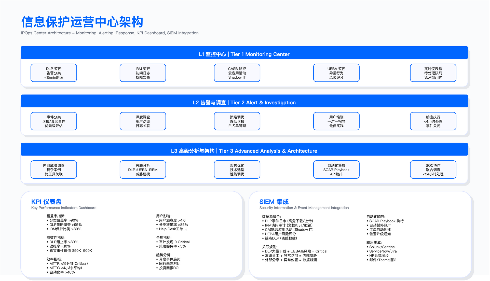

# 10.8　实战案例

> 导读：前八节构建了信息保护的完整理论框架——从分类分级、IRM、DLP 到内部威胁与移动安全。本节转入实战视角，通过金融、科技、制造、专业服务四个行业案例，呈现这套框架在真实约束下的落地逻辑：技术选型怎么做出、哪些判断被证明正确、哪些假设在执行中被推翻。案例中的公司均为化名，数据为示例口径。

---

## 10.8.1 案例一：金融机构 DLP 体系建设

### 背景与驱动因素

某全球性银行（化名 Global Bank）面临多重合规压力：GDPR 生效带来的数据保护要求[1]、金融监管（PCI DSS[2]、SOX）的审计义务，以及此前发生的客户数据泄露事件。该银行决定在全球范围内部署企业级 DLP 系统。

项目启动时的现状评估显示：数据分散在多个业务系统中，仅有邮件网关的基础过滤能力，无法提供数据访问的完整审计轨迹，且过去曾发生过未被检出的员工数据窃取事件。

### 实施分阶段路径

第一阶段：现状发现与规划

项目团队首先完成数据流映射，识别业务系统中的敏感数据分布（客户 PII、交易数据、内幕信息等），并评估现有控制的差距。供应商选型时综合考量产品成熟度、多渠道覆盖能力（网络、端点、云），以及与现有基础设施的集成难度——这三个维度缺一不可，过于侧重任何一个都会在后续阶段埋下隐患。

第二阶段：试点验证

选择财富管理部门作为试点范围，部署网络 DLP（邮件网关与 Web 代理集成）和端点 DLP（覆盖高风险岗位）。试点阶段全程采用审计模式运行，而非直接启用阻止策略。这是整个项目里最关键的一个决定，理由可以脱离本案例独立成立：DLP 策略的误报率在上线前无法预估，它取决于本组织业务数据里长数字串、内部文档流转习惯、第三方协作方式的具体分布，而这些没有任何行业基准可以套用。审计模式用几周时间把这个分布测出来，代价是这几周里真实外泄不会被拦；直接启用阻断则是拿业务连续性去赌一个未经测量的误报率。选前者的前提是这几周有人真的看告警——如果审计模式期间没人分诊，那它既没拦住泄露也没积累到调优数据，只是把上线推迟了几周。

试点期间暴露的主要问题：初期误报率过高导致用户投诉、端点 Agent 对设备性能的影响，以及 SSL 解密所需 PKI 证书部署带来的 IT 阻力。应对策略是先以审计模式收集数据，再逐步迭代调优阈值，同时建立误报模式白名单——三个问题各有针对性的处置路径，没有试图用一个统一方案一次性解决。

第三阶段：全球推广

在试点问题修复后，按地域分批推广。各地区的差异化要求超出了最初的预期：部分地区因政府监管要求须部署本地网关、部分地区需与工会签署数据保护协议、部分地区的监管机构要求定期提交审计报告。这些合规差异无法通过统一的技术配置化解，必须在项目计划中为"地区谈判"预留时间和资源。

DLP 策略从初期的基础策略逐步演进，按业务单元和地域定制扩展。策略设计遵循分级响应原则：低敏数据仅审计记录，高敏数据触发阻止或审批流程。

第四阶段：运营优化

建立 DLP 运营团队（IPOps），与 SOC 集成实现全天候监控。运营优化措施包括：重复误报自动加入白名单、使用机器学习辅助文档分类，以及与 SOAR 平台集成实现自动化响应。

### 适用边界

本案例的实施路径适用于：具有多地域运营且面临多法规合规要求的大型金融机构；数据分散在多个系统且缺乏统一监控能力的组织；已发生数据泄露事件或面临监管审计压力的场景。

不适用于：数据量较小且业务系统单一的小型机构（可采用轻量级方案）；无跨境业务且仅需满足单一法规的场景（可简化区域定制流程）。

### 实施约束与权衡

DLP 项目的主要约束包括：性能影响方面，端点 Agent 的 CPU 占用须控制在可接受范围，否则用户接受度会急剧下降；隐私争议方面，SSL 解密可能引发隐私担忧，最终采取仅解密外发流量的折中方案；跨国合规方面，各国劳动法和隐私法差异显著，需针对不同地区调整监控策略和用户告知方式；成本管控方面，区域定制和咨询费用可能导致预算超支，建议预留缓冲。

### 常见误区

低估变更管理投入——DLP 项目的技术部署相对直接，但用户沟通、培训和流程变更往往被低估，上线初期 Help Desk 工单激增是普遍现象，而非意外。

一次性策略思维——将 DLP 策略视为上线即完成的交付物，忽略持续调优的必要性。策略需要根据业务变化和误报反馈持续迭代，这是常态，不是例外。

全量覆盖优先——试图一次覆盖所有数据类型，导致策略复杂度失控。正确的做法是优先覆盖高价值数据（如客户 PII），再逐步扩展覆盖面。

### 验证方法

策略有效性测试——使用包含已知敏感数据的测试文件验证检测规则，覆盖常见绕过场景（加密压缩、图片嵌入等）。

误报率跟踪——建立误报率统计机制，设定阈值作为策略成熟度指标；误报率应随时间持续下降，若趋势反转则需要审查策略变更记录。

合规审计验证——通过内部或外部审计验证 DLP 系统能否满足监管报告要求。

### 运行关注指标

| 指标名称 | 触发条件/阈值表达 |
|---------|-----------------|
| DLP 事件量 | 月度事件数与环比变化 |
| 误报率 | 假阳性占比，需持续下降 |
| 策略覆盖率 | 已纳入 DLP 监控的数据渠道占比 |
| 用户满意度 | 定期调研，关注上线前后对比 |

### 经验总结

审计模式试运行可避免上线初期的业务冲击；分阶段部署允许在全面推广前修复试点暴露的问题；用户培训和沟通的投入应与技术部署并重；DLP 系统的价值证明须与业务目标对齐（如帮助通过监管审计），单纯的技术指标很难说服业务部门的持续支持。

---

## 10.8.2 案例二：科技公司源代码保护

### 背景与触发事件

某 AI 芯片领域的科技公司（化名 TechUnicorn）曾发生核心工程师离职跳槽至竞争对手并窃取神经网络加速器设计代码的事件，导致研发投入和技术领先优势受损。

事件检测与响应的时间线：工程师提出辞职，HR 按标准流程通知安全团队；DLP 系统检测到异常——单日 Git clone 大量代码仓库；调查确认工程师将整个设计库下载至外置硬盘；公司立即终止雇佣、收回设备并启动法律诉讼；最终通过法律途径获得赔偿，被窃代码的使用也被阻止。

DLP 系统在这个案例中是事后检测而非事前预防——工程师已经完成了数据窃取，告警触发于行为异常发现之后。这个局限性推动了后续补救措施的设计方向：从检测向预防转移。

### 根因分析

事件暴露了多层面的控制缺失：

技术层面：Git 服务器缺乏 DLP 监控，大量 clone 操作未触发告警；USB 端口未限制；离职前员工的访问权限未收紧；代码缺乏水印或指纹机制，增加了法律追溯的难度。

流程层面：缺乏离职风险评估流程；竞业协议约束力不足；知识产权保护培训不到位。

### 补救措施设计

Git 安全加固

访问控制从"所有工程师可访问所有仓库"调整为最小权限原则，仅授予相关项目的访问权限。这一改变的阻力不小——工程师习惯于开放访问文化，限制访问需要配套清晰的申请流程，否则会制造大量摩擦。

部署 Git 活动监控，设置阈值告警（如单日下载量超过设定值、非工作时间操作等），并对离职员工标记实现自动限制访问。要求所有 commit 必须 GPG 签名，服务器拒绝未签名提交。

端点控制

禁止 USB 存储设备（经 IT 审批的例外除外）。部署屏幕动态水印（包含用户名和时间戳），覆盖拍照或截屏场景。源代码禁止打印，通过 DLP 检测代码特征并阻止。

离职风险管理程序

员工提交辞职当日触发以下联动动作：UEBA 系统标记为高风险、Git 访问降级为只读（禁止 clone）、禁用 USB 和打印权限、启动实时监控（EDR 与 DLP 联动）。离职面谈由 HR、安全和法务共同参与，强调 IP 义务。离职后持续监控公开代码仓库（检测代码相似性）、竞争对手产品（检测专利侵权）。

这套流程的核心逻辑在于：将风险处置的时间窗口从"离职当日"提前到"辞职当日"，压缩了高风险行为的可操作空间。

法律加固

雇佣合同强化 IP 归属条款、延长竞业禁止期限、增加违约金条款。入职和年度培训强调知识产权义务，对违规行为采取刑事报案与民事诉讼并行的策略。

### 适用边界

本案例的控制措施适用于：拥有高价值源代码或设计文档的科技公司；存在竞争对手挖角风险的行业；对知识产权保护有明确法律诉讼需求的场景。

不适用于：代码本身为开源性质的项目；员工流动性极高且岗位无核心 IP 接触的场景。

### 常见误区

信任优先于验证——开放的工程师文化容易形成"默认信任"习惯，忽略对高风险行为的技术监控。安全文化的转变方向是"验证后信任"，而非全面监控，两者之间存在重要区别。

离职控制滞后——仅在离职当日收回权限，忽略了辞职提出到实际离职之间的风险窗口期。应在员工提交辞职时立即启动访问限制和监控强化。

技术控制孤立——仅部署 DLP、EDR 等技术手段，而忽略流程（离职程序）和法律（NDA、竞业协议）的配合。三层防御必须协同设计，缺少任何一层都会出现明显漏洞。

### 验证方法

异常检测有效性——模拟大量 clone 操作，验证告警是否触发，测试须覆盖工作时间和非工作时间场景。

USB 阻止测试——使用测试设备验证 USB 存储设备是否被有效阻止。

水印追溯测试——模拟截屏场景，验证水印是否清晰可识别。

离职流程演练——定期演练离职风险管理程序，验证各部门协作的时效性；演练暴露的延迟往往比预期更长。

### 运行关注指标

| 指标名称 | 触发条件/阈值表达 |
|---------|-----------------|
| Git 异常告警数 | 超过阈值的 clone/pull 操作数量 |
| 阻止的窃取企图 | 经调查确认的真实窃取企图次数 |
| 误报率 | 异常告警中的假阳性占比 |
| IP 泄露事件 | 确认的知识产权外泄事件（目标为零） |

### 经验总结

预防优于检测——离职前的访问限制比离职后的响应更有效；技术、流程、法律三层防御须协同设计；工程师需要理解 IP 保护的价值（而非单纯的监控），通过案例教育促进文化转变；IP 保护的投入相对于潜在损失而言具有显著的投资回报。

---

## 10.8.3 案例三：制造业知识产权保护

### 背景与业务需求

某工业机器人制造商（化名 Precision Manufacturing）的核心 IP 资产包括：3D CAD 设计文件、生产工艺文档、供应商规格书、测试数据等。业务需要与全球供应商共享部分设计信息，但此前曾发生设计图纸被竞争对手抄袭的情况。

核心挑战在于如何在必要的信息共享与防止过度泄露之间取得平衡——一旦收紧过度，供应链协作效率受损；过于宽松，核心设计面临持续泄露风险。

### 解决方案设计

信息分类体系

建立四级分类标准：公开级（产品宣传册、展会资料）、供应商共享级（供应商需要的具体零件图）、内部级（完整装配图、工艺参数）、核心 IP 级（核心算法、专利设计、成本模型）。

分级的关键不在于标签本身，而在于不同级别对应不同的分享渠道和技术控制。没有技术执行的分类体系只是一套文档，无法产生实际保护效果。

CAD 文件的 IRM 保护

针对工程设计文件部署 IRM 系统，实现以下控制：供应商仅能查看（禁止打印、截图）、动态水印（包含公司名称和查看者身份）、自动过期（项目结束后设定时间内失效）、远程撤销（供应商合作终止时撤销访问权限）。

工作流程设计为：工程师在创建 CAD 文件时标记分类级别，系统自动应用对应的 IRM 策略，通过专用 Portal 分享（而非邮件附件），供应商需认证后方可打开，所有查看操作记录审计日志。用专用 Portal 替代邮件附件这一决定，是整个方案中阻力最大但价值最高的改变——它使审计日志成为可信的证据链。

虚拟数据室（VDR）

针对新产品导入（NPI）等需要深度协作的场景，部署虚拟数据室解决方案。VDR 提供细粒度权限（不同供应商看到不同文件）、防截屏技术、打印水印、时间限制、完整审计日志等功能。

供应商 NDA 程序

标准化 NDA 模板经法务批准，包含保密期限、禁止逆向工程和复制、项目结束后资料返还或销毁、分包商同等义务等条款。执行层面包括年度供应商审计（抽查一定比例）和明确的违规处理路径（终止合作、赔偿、行业黑名单）。

### 实际事件与响应

在实施保护体系后，公司发现某供应商向第三方转售设计图。检测方式：拆解竞争对手产品时发现相同设计（包括故意设置的缺陷标记），IRM 审计日志显示该供应商查看过相关图纸，竞争对手产品文档中还包含该供应商的水印。

三条证据链相互印证，形成了法律诉讼所需的完整证明。响应措施包括：立即撤销该供应商的所有 IRM 访问权限、启动法律诉讼、切换至备用供应商。最终通过庭外和解获得赔偿，并将该供应商永久列入黑名单。

此事件证明了 IRM 水印在法律诉讼中的关键证据价值——技术控制不仅用于预防，也为法律追溯提供了可信的证据基础。

### 适用边界

本方案适用于：需要与外部供应商共享设计文档的制造业企业；对知识产权有明确保护需求和法律追溯能力要求的场景；使用 CAD 等专业软件且 IRM 工具支持该格式的环境。

不适用于：供应商协作仅限于标准化零件且无定制设计的场景；缺乏 IRM 格式支持或供应商技术能力不足以使用 IRM 客户端的情况。

### 常见误区

NDA 签署即完成——仅依赖法律文件而缺乏技术控制，NDA 在泄露发生后才能发挥作用，无法预防。技术控制与法律协议须配合使用，而非互相替代。

VDR 仅用于并购场景——忽略 VDR 在日常供应链协作中的价值，导致敏感文档通过邮件等不安全渠道分享。

备用供应商计划缺失——未准备 B 计划，在需要终止与违规供应商合作时面临业务中断风险。备用供应商是供应链韧性的必要组成部分，而非可选项。

### 验证方法

IRM 控制测试——验证供应商账户是否确实无法打印、截图、转发受保护文档。

水印可追溯性测试——模拟泄露场景，验证水印能否准确识别泄露源。

权限撤销测试——测试撤销操作后，供应商是否立即无法访问已下载的文档。

NDA 合规审计——抽查供应商的文档管理实践是否符合 NDA 条款。

### 运行关注指标

| 指标名称 | 触发条件/阈值表达 |
|---------|-----------------|
| IP 泄露事件 | 确认的设计文档外泄事件数（目标为零） |
| NDA 签署率 | 所有活跃供应商的 NDA 签署覆盖率 |
| VDR 访问审计异常 | 异常访问模式的检出数量 |
| 供应商审计发现 | 年度审计中的违规发现数量 |

### 经验总结

IRM 技术控制与法律协议须配合使用，前者提供预防和证据，后者提供追诉依据；供应商管理须建立分级机制，核心 IP 仅与经过严格审查的供应商共享；备用供应商计划是供应链韧性的必要组成部分；故意设置的"缺陷标记"可作为抄袭检测的技术手段——这一措施成本极低，但在诉讼中的证据价值极高。

---

## 10.8.4 案例四：远程办公安全转型

### 背景与危机响应

某咨询公司（化名 Professional Services Firm）在突发公共卫生事件期间须在短时间内实现全员远程办公。初期面临的挑战包括：VPN 容量不足、BYOD 设备激增、家庭网络环境风险，以及客户数据保护要求。

危机响应阶段的问题相互叠加：紧急扩容 VPN 后仍频繁断线，员工开始绕过 VPN 直接访问云应用；大量个人设备未纳入管理（无 MDM/DLP），员工自行使用文件传输服务形成影子 IT；家庭网络环境（IoT 设备、共享 Wi-Fi）带来额外攻击面。

初期安全事件包括：客户机密文档通过个人邮箱外发（DLP 未覆盖）、视频会议安全配置不当、员工设备在家中被盗且无远程擦除能力。这些事件的共同特征是：控制缺失并非技术失效，而是控制边界在危机中被快速扩展的业务现实所超越。

### 稳定化阶段措施

VPN 替代方案：ZTNA

用零信任网络访问（ZTNA）替代传统 VPN。ZTNA 的优势在于：直连应用而非回传数据中心，性能改善显著；最小权限原则，仅授权访问特定应用而非整个网络；云原生架构，无容量限制；客户端自动连接，用户体验更接近透明。

这一架构切换并非纯粹的技术升级，更是一次安全模型的根本改变——从"进入内网即信任"转向"每次访问独立验证"。成本有所增加，但性能和安全性的提升支撑了这一决策。

BYOD 管理：MAM 优先

选择移动应用管理（MAM）而非移动设备管理（MDM）的核心原因是侵入性差异：MAM 仅管理企业应用和数据，不触碰员工个人空间，采用率因此更高。

MAM 策略包括：企业应用（邮件、协作工具、云存储）受保护；企业数据容器化，禁止复制到个人应用；设备合规检查（操作系统更新、PIN 设置、未越狱）；离职时仅删除企业数据，个人数据完整保留。

采用用户自助注册方式，配合视频教程和 Help Desk 支持，较短时间内实现高采用率。如果选择 MDM 路线，同样的时间窗口内可能面临大量员工拒绝注册的局面。

云 DLP 扩展

部署 CASB（云访问安全代理）覆盖 SaaS 应用，策略包括：客户数据外发阻止、文件分享链接须设置密码和过期时间、敏感会议录像自动加密。CASB 的附加价值是发现了大量员工自行使用的影子 IT 应用——这些应用在部署前完全不在安全团队的视野内。

### 优化阶段措施

协作工具加固

视频会议工具的安全配置：强制密码和等候室、禁止录制到本地（仅允许云端）、敏感会议启用端到端加密、会议 ID 随机生成。协作平台启用 DLP 策略覆盖聊天和文件共享。为客户文档交换建立专用 Portal（IRM 保护）。

端点安全

部署 EDR 覆盖公司设备和 BYOD 设备，重点是家庭网络感染风险的检测和自动隔离响应。家庭网络中的 IoT 设备是一个长期被低估的威胁向量。

用户培训

家庭网络安全培训（必修）：路由器默认密码修改、工作设备使用独立网络、公共 Wi-Fi 场景使用 ZTNA、物理安全（锁屏、设备放置）。培训的目的不是让员工变成安全专家，而是让他们具备识别和规避最常见风险场景的基本意识。

### 长期混合办公模式

公共卫生事件后保留混合办公模式。安全架构从传统的边界安全（防火墙 + VPN）转向零信任架构（身份 + 设备 + 应用层）。

技术栈演进为：身份层（SSO + MFA）、网络层（ZTNA + SWG）、端点层（EDR + MAM）、数据层（DLP + IRM）、监控层（SIEM + UEBA）。这套分层架构的价值在于每层独立可验证，任何一层的失效不会导致整体防御崩溃。

### 适用边界

本方案适用于：须支持大规模远程或混合办公的企业；员工使用个人设备（BYOD）且对隐私敏感的场景；依赖 SaaS 应用且存在影子 IT 风险的环境。

不适用于：业务性质要求员工必须在物理安全环境内工作的场景（如涉密单位）；网络基础设施不支持 ZTNA 架构的环境。

### 常见误区

VPN 扩容即解决问题——仅增加 VPN 容量而不解决架构问题，员工仍会因性能问题绕过 VPN，形成安全盲区。扩容解决的是容量问题，但 VPN 架构本身的性能和安全缺陷无法通过扩容消除。

MDM 优先于 MAM——对 BYOD 设备强制部署 MDM 导致员工抵触，实际采用率低。MAM 通过尊重个人隐私获得更高接受度，在 BYOD 场景下这是更务实的选择。

忽略影子 IT——CASB 部署仅覆盖公司采购的 SaaS 服务，忽略员工自行使用的应用，导致数据泄露盲区。影子 IT 的规模通常超出安全团队的预期。

技术先于培训——部署大量安全工具但用户不理解使用方式和目的，导致绕过或误用。工具的有效性上限取决于用户是否愿意使用它。

### 验证方法

ZTNA 访问控制测试——验证未授权应用是否确实无法通过 ZTNA 访问。

MAM 数据隔离测试——验证企业数据是否无法复制到个人应用。

CASB 影子 IT 发现——审查 CASB 发现的影子 IT 列表，评估风险并制定处置策略。

钓鱼演练——定期开展钓鱼测试，验证培训效果；成功率应随时间持续下降。

### 运行关注指标

| 指标名称 | 触发条件/阈值表达 |
|---------|-----------------|
| 数据泄露事件 | 确认的数据泄露事件数 |
| DLP 事件量 | 月度事件数及趋势 |
| 钓鱼测试成功率 | 员工点击钓鱼链接的比例（应持续下降） |
| 设备合规率 | 符合安全策略的设备占比 |
| ZTNA 覆盖率 | 通过 ZTNA 访问应用的流量占比 |

### 经验总结

零信任架构在性能和安全性上优于传统 VPN，但需要架构层面的重新设计；MAM 通过尊重隐私获得用户接受度，比强制性 MDM 更适合 BYOD 场景；CASB 的价值不仅在于 DLP，还在于发现和管理影子 IT；技术部署与用户培训须同步推进；危机驱动的转型虽然被动，但可借机推动本应进行的架构升级。

---

## 跨案例经验提炼

### 共性成功因素

四个案例均体现了以下成功要素：

高层支持与业务对齐：信息保护项目需要安全团队与业务领导共同推动，项目目标须与业务价值（合规通过、风险降低、效率提升）对齐。没有业务部门认同的安全项目，在遭遇摩擦时往往第一个被削减。

分阶段实施：试点验证后再全面推广，在可控范围内发现和修复问题，避免大规模上线失败。四个案例中没有一个采用了一次性全量上线的策略。

用户参与：技术控制的有效性取决于用户接受度，培训和沟通的投入应与技术部署并重。培训内容应帮助用户理解"为什么"而非仅告知"做什么"——理解动机的人更不容易寻找绕过的方法。

持续迭代：策略和配置非一次性交付物，须根据误报反馈、业务变化和威胁演进持续优化。

### 共性常见误区

低估变更管理：技术部署相对容易，但组织变更（流程调整、用户习惯改变、部门协作）往往被低估，这是四个案例共同踩过的坑。

一次性部署思维：试图在项目阶段完成所有工作，忽略持续运营和优化的资源需求。

用户体验忽视：过度安全导致用户绕过控制，反而形成更大的安全盲区；安全与可用性之间的平衡点须在实践中不断调整。

指标缺失：没有建立 KPI 体系，既无法量化证明项目价值，也无法识别需要优化的领域。

### 行业模式差异

不同行业的信息保护侧重点存在差异：金融行业以合规驱动为主，投入较高，成熟度普遍较高；科技行业以知识产权保护为核心，离职风险管理是关键场景；制造业须平衡供应链协作需求与 IP 保护；专业服务行业（咨询、法律等）以客户数据保护为核心，远程办公是常见场景。

### 技术演进趋势

从案例的时间线可以观察到技术架构的演进：从边界安全（防火墙、VPN、邮件网关 DLP）向云 DLP、CASB、BYOD MAM 演进，进一步向零信任架构（ZTNA、SASE）和 AI 辅助 DLP 演进。

这一演进反映了工作模式（远程/混合办公）、IT 架构（云原生）和威胁形态的变化。架构不是目的，是对现实约束的持续适应。

---

## 参考文献

| # | 来源 | 标题 | 日期 | 链接 |
| --- | --- | --- | --- | --- |
| [1] | EUR-Lex | Regulation (EU) 2016/679 (GDPR) | 2016-04 | <https://eur-lex.europa.eu/eli/reg/2016/679/oj> |
| [2] | PCI Security Standards Council | PCI DSS v4.0.1 — Payment Card Industry Data Security Standard | 2024-06 | <https://www.pcisecuritystandards.org/document_library/> |

---

## 导航

[← 上一节：10.7 信息保护运营](./10.7_信息保护运营.md) | [返回章节目录](./README.md) | [下一节：第11章 安全运营中心（SOC） →](../../第04部分_安全运营与防御能力/第11章_安全运营/README.md)

---

© 2025-2026 AISecOps Project. Licensed under CC BY-NC-SA 4.0
