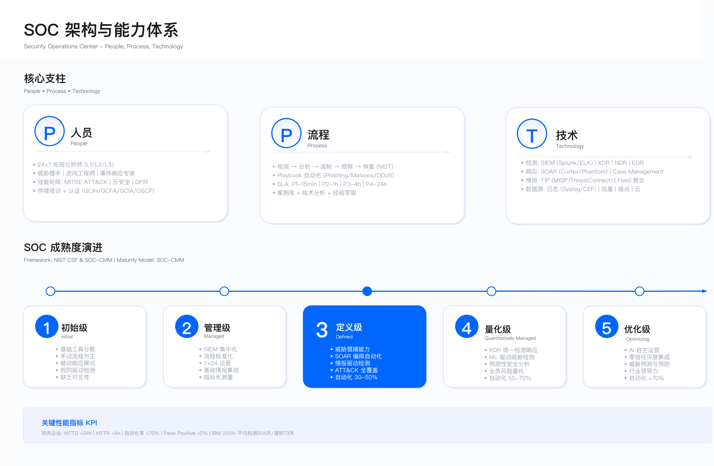

# 11.0　执行摘要

2024 年 7 月，一次安全软件更新导致全球数百万台 Windows 系统同时崩溃。航空公司停飞、医院业务中断、银行服务受阻[1]。这一事件暴露了安全运营中心（SOC）面临的根本困境：企业投入大量资源建设威胁检测体系，却难以识别来自可信供应链的系统性风险。

这不是孤例。2020 年，某供应链攻击[^1]通过软件更新渠道植入后门，从初次植入到被发现历时数月，期间攻击者已渗透多个政府部门与企业网络。被攻陷的受害者自身也是顶级网络安全公司，拥有成熟的 SOC 团队与检测能力。

[^1]: 指 SolarWinds 供应链攻击事件（2020 年 12 月披露），出于出版规范进行脱敏处理。详见 CISA Alert AA20-352A[2]。

2023 年，某文件传输软件[^2]的零日漏洞在披露后被大规模利用，攻陷全球数千家机构[3]。受害企业的共同特征是：SOC 监控覆盖了网络边界、终端系统与云平台，却未将第三方文件传输工具纳入资产清单，缺乏相应的日志接入与告警规则。

[^2]: 指 MOVEit Transfer 漏洞利用事件（CVE-2023-34362），出于出版规范进行脱敏处理。

## SOC 建设的三个核心困境

### 1. 检测覆盖的结构性盲区

传统 SOC 架构以"边界防御 + 终端保护"为中心，在网络流量与主机日志监控上已形成成熟能力。但企业攻击面已发生根本变化。

攻击面扩展带来的挑战

- SaaS 应用采用激增，但多数未纳入 SOC 统一监控体系
- 云原生环境（容器、Kubernetes）引入新的攻击向量，传统 SIEM 难以解析云控制平面日志
- 软件供应链依赖复杂（直接与间接依赖数以百计），多数企业缺乏软件物料清单（SBOM）可见性
- IoT 与 OT 设备规模庞大，工控协议日志格式与传统 IT 系统差异显著

适用边界

上述盲区的存在受限于以下条件：

- 日志接入成本：云服务与 SaaS 应用的日志导出通常需额外付费
- 协议兼容性：OT / IoT 设备采用非标准协议，SIEM 需定制解析器
- 组织可见性：影子 IT 与未经批准的云服务使用，IT 部门无法感知其存在

常见误区

- 认为部署了 SIEM 等同于建立了全面监控，忽视日志源覆盖度评估
- 只关注"已知资产"的监控，未建立资产发现与动态清单更新机制
- 将监控盲区归因于"工具能力不足"，而非系统化的攻击面管理问题

验证方法

- 基于 MITRE ATT&CK 框架，评估检测覆盖度（Data Sources Coverage）
- 定期执行红队演练，测试盲区是否可被利用
- 通过资产发现工具（主动扫描 + 被动流量分析），对比资产清单完整性

运行指标

- 日志源覆盖率：已接入日志的资产数 / 总资产数
- 检测覆盖度：可检测的 ATT&CK 技术数 / 企业相关技术总数
- 盲区修复周期：从发现监控盲区到完成日志接入的平均时间

### 2. 从检测到响应的决策困境

即使 SOC 检测到异常告警，团队也常陷入"犹豫 → 观望 → 错过响应窗口"的循环。

典型案例：检测能力充足但响应失败

2013 年，某零售企业[^3]的 SOC 使用商业威胁检测系统发现门店终端的恶意软件活动，系统生成高危告警。但 SOC 团队未采取隔离措施，最终攻击者在系统中驻留数周，窃取大量支付卡数据。

[^3]: 指 Target 数据泄露事件（2013 年 11-12 月），出于出版规范进行脱敏处理。详见 US Senate Commerce Committee Report，2014[4]。

响应失败的根本原因

1. 误报经验主义：该企业的威胁检测系统每周产生大量高危告警，但历史验证显示绝大多数为误报。分析师基于经验判断，认为本次告警也是误报，未深入分析。
2. 业务理解不足：SOC 团队对门店终端的正常运维模式缺乏了解，无法判断告警中的异常进程行为是恶意活动还是合法维护操作。
3. 响应权限模糊：告警发生在业务高峰期，SOC 团队不确定是否有权限隔离终端（可能导致收银中断），且无法快速联系业务主管完成决策。

关键约束

- 业务连续性压力：隔离或阻断操作可能导致业务中断，需权衡安全风险与业务损失
- 决策时间窗口：高级威胁的响应窗口通常在小时级，跨部门沟通成本可能超过此时限
- 误报容忍度：过度激进的响应会因频繁误报导致业务抱怨，损害 SOC 可信度

常见误区

- 认为"检测即响应"，未建立明确的响应决策流程与授权机制
- 将所有告警一视同仁，未根据资产重要性与威胁置信度建立分级响应策略
- 依赖人工判断每个告警，未通过 Playbook 标准化常见场景的响应动作

验证方法

- 定期演练：模拟高危告警场景，测试从检测到响应的完整流程与决策时效
- Playbook 覆盖度检查：统计常见告警类型中已有标准响应流程的比例
- 误操作复盘：分析因响应不当导致业务影响的案例，识别决策流程缺陷

运行指标

- 平均响应时间（MTTR）：从告警确认到威胁遏制的平均时长
- 响应决策延迟：从告警生成到 SOC 团队做出响应决策的时间
- Playbook 自动化率：可自动执行响应动作的告警类型占比

### 3. 战略价值的认知鸿沟

多数企业将 SOC 视为"成本中心"——必须建设但不产生直接收入的部门。这导致资源投入不足与价值衡量失焦。

资源配置困境

- 分析师负载过高，单人监控资产数量远超合理范围
- 预算偏向工具采购，运营投入（人员培训、流程优化）占比低
- 人员流失率高，职业发展路径不清晰导致难以留住人才
- 自动化编排平台因预算限制无法部署，人工处理效率低下

指标失焦问题

- 用"告警数量""规则覆盖率"等虚荣指标衡量 SOC 价值，而非"避免的损失""响应时效提升"等结果指标
- 为满足合规要求而建设 SOC，导致只关注"是否部署 SIEM"而非"检测能力是否有效"
- SOC 团队为达成"好看的 KPI"，增加告警规则数量，反而加剧误报与分析师疲劳

关键约束

- 安全价值量化困难：避免的损失难以准确计算，ROI 论证缺乏说服力
- 业务理解差距：高层管理者对 SOC 运作机制缺乏认知，难以评估其战略重要性
- 预算周期错配：SOC 能力建设需长期投入，但企业预算审批通常以年度为周期

常见误区

- 认为"购买工具 = 建设能力"，忽视人员、流程与持续优化的重要性
- 将 SOC 定位为"IT 部门的技术支撑"，未与业务风险管理、合规治理等战略目标对齐
- 只在发生重大安全事件后才重视 SOC 投入，缺乏前瞻性规划

验证方法

- 成熟度评估：使用行业标准成熟度模型评估能力现状
- 业务影响分析：计算假设遭受攻击时的潜在业务损失，论证 SOC 投资价值
- 对标研究：与同行业、同规模企业的 SOC 投入与能力水平对比

运行指标

- SOC 投入占安全预算比例：运营成本 / 总安全支出
- 人员配置比：SOC 分析师数量 / 监控资产数量
- 能力成熟度得分：基于标准模型的年度评估结果

---

## 本章目标：构建有效的安全运营体系

本章展示如何构建有效的 SOC——不是通过购买更多工具，而是通过系统化的能力建设。

### 战略层面：重新定义 SOC 使命

从"监控中心"到"风险决策平台"（11.1）

将 SOC 定位从"处理告警"转变为"支持业务连续性、量化风险暴露、驱动安全投资决策"。这种转变要重新定义 SOC 团队的授权边界、信息流设计和价值度量方式，不只是改个名字。

服务目录应明确列出：威胁检测、事件响应、威胁情报、漏洞管理、合规支撑——每项服务对应清晰的 SLA 与交付物，而不是模糊的"安全运营"。

组织模型选择（11.1.2）

- 集中式 SOC：统一管理，标准化流程，适用于单一地域或业务线相对简单的企业
- 分布式 SOC：贴近业务，响应灵活，适用于多地域、多业务单元的大型企业
- 混合式 SOC：结合两者优势，全球 SOC 负责战略与标准，区域 SOC 负责本地响应
- 权衡因素：成本、响应时效、文化融合、技术债务

成熟度演进路径（11.1.4）

- Level 1（初始级）：被动响应，依赖人工，无标准流程
- Level 2（可重复级）：建立基本流程，部署 SIEM，开始日志集中管理
- Level 3（已定义级）：标准化 Playbook，威胁情报集成，初步自动化
- Level 4（已管理级）：指标驱动优化，SOAR 广泛应用，主动威胁狩猎
- Level 5（优化级）：预测性防御，AI 驱动检测，持续演进

成熟度演进通常需 18-36 个月，受限于组织文化、预算周期与人才储备。

### 架构层面：构建覆盖现代攻击面的检测体系

SIEM / SOAR / XDR 平台选型（11.2）

评估维度应包括：日志处理能力、查询性能、集成开放性、成本结构。常见陷阱是"SIEM 成本失控"——未做好日志源优先级规划，盲目接入所有日志导致存储与计算成本激增。关键决策点：自建 vs 商业方案、本地部署 vs 云服务、单一厂商 vs 最佳组合。选型时需评估内部运维能力，避免选择超出团队技术栈的复杂方案。

日志管理与数据湖（11.2）

设计目标是支持日均大规模日志处理，实现秒级查询响应。成本权衡上，热存储（高性能、高成本）vs 冷存储（低成本、查询慢）需根据业务场景分层设计。不同类型日志（安全 / 审计 / 合规）有不同保留周期要求，需通过压力测试确认系统在峰值负载下的性能表现。

云原生检测扩展

覆盖范围应涵盖：云安全态势管理（CSPM）、云工作负载保护（CWPP）、云访问安全代理（CASB）。多云环境下，AWS、Azure、GCP、阿里云的日志格式与 API 差异需统一归一化。一个常见误区是认为云服务商的原生安全工具已经足够，实际上跨云统一监控往往缺失。

### 工程层面：从规则堆砌到精准检测

检测用例开发（11.3.1）

有效的检测用例开发应同时覆盖三个维度：基于威胁情报（将外部 IOC 与内部日志关联）、基于行为基线（UEBA 检测偏离）、基于 ATT&CK 映射（确保覆盖企业相关技术）。验证方法是使用 Atomic Red Team 等工具模拟攻击，测试检测用例有效性——这一步经常被跳过，导致"部署了规则但从未验证是否真的有效"。

威胁狩猎方法论（11.3.2）

假设驱动是威胁狩猎的核心：基于威胁情报与攻击趋势，提出"攻击者可能已渗透"的假设，选择验证假设所需的日志与数据源，编写检索查询寻找证据，最终将狩猎发现转化为持久化检测规则——形成改进闭环。

误报优化策略

误报根因通常是：规则过于宽泛、基线不准确、上下文信息缺失。优化路径包括增加关联条件、引入白名单、调整阈值、丰富告警上下文。需要注意的约束：过度优化误报率可能导致真实威胁被过滤，需要在误报率与漏报率之间谨慎权衡。

### 运营层面：建立可持续的响应能力

事件响应生命周期（11.5）

四个阶段的设计都有对应权衡：准备阶段需预置工具和授权；检测与分析阶段关注告警分类和优先级；遏制、根除与恢复阶段要在"快速遏制"与"完整取证"之间权衡，过早清除可能破坏证据；事后活动关注复盘改进。

SOAR 自动化边界

适合自动化的场景：一线告警分类、IOC 查询、威胁情报富化、常规隔离操作。需要人工决策的场景：涉及业务中断的阻断操作、复杂攻击的分析研判、高管沟通。常见误区是过度自动化导致"假性安全感"——自动化流程未经充分测试即上线，在业务高峰期触发误操作。

威胁情报运营（11.6）

情报应用形成闭环：IOC 阻断 → TTP 分析 → 检测用例开发 → 能力验证。需要过滤低价值情报，避免"IOC 洪水"导致性能下降与误报增加。情报来源应覆盖：开源（公开 IOC）、商业（APT 情报）、行业共享（ISAC）、内部（狩猎发现）。

### 指标层面：数据驱动的持续改进

关键指标定义（11.9.2）

三个核心指标：MTTD（平均检测时间，从攻击发生到 SOC 检测到异常）、MTTR（平均响应时间，从检测确认到威胁遏制）、MTTA（平均确认时间，从告警生成到分析师确认）。改进路径是通过自动化、流程优化、技能提升系统性缩短上述指标。

避免虚荣指标陷阱（11.9.4）

几个典型失衡模式：规则数量↑但检出率↓（盲目增加规则导致误报激增，真实威胁被噪声淹没）；自动化率↑但误封禁↑（自动化流程缺乏充分验证）；告警处理量↑但价值产出↓（分析师疲于处理低价值告警）。需定期审查指标与业务目标的对齐性。

---

## 本章结构导航

| 小节 | 核心主题 | 关键输出 |
|------|----------|----------|
| 11.1 战略与组织 | SOC 使命、组织模型、成熟度评估 | 组织架构方案、成熟度路线图 |
| 11.2 架构设计 | SIEM / SOAR / XDR 平台、数据湖、云扩展 | 技术架构设计、平台选型决策 |
| 11.3 检测工程 | 检测用例开发、规则建设、ATT&CK 应用、覆盖度评估 | 检测规则库、覆盖度矩阵 |
| 11.4 威胁狩猎 | 假设驱动狩猎、实战技术、成熟度模型、AI 辅助狩猎 | 狩猎手册、狩猎假设库 |
| 11.5 事件响应 | 响应生命周期、SOAR 自动化、War Room | 响应 Playbook、自动化流程 |
| 11.6 威胁情报 | 情报来源、IOC / IOA 管理、TIP 平台 | 情报处理流程、集成方案 |
| 11.7 安全监控 | 7 × 24 运营、告警分级、误报处理 | 运营手册、分级标准 |
| 11.8 漏洞管理 | CVSS / EPSS 评分、补丁管理、虚拟补丁 | 漏洞处置流程、优先级矩阵 |
| 11.9 指标与报告 | KPI / KRI 体系、MTTD / MTTR 优化、高管报告 | 指标仪表板、报告模板 |
| 11.10 实战案例 | 完整 SOC 建设案例、失败教训 | 可复制的实施路径 |

---

## SOC 演进的五个方向（2026 年 7 月基准）

下面五个方向按当期状态排列。每一条都标注它今天走到哪一步：已经成为常规配置的，不必再当规划项写进预算；仍在检验的，投入前先确认前提条件是否具备。

### 趋势 1：从 AI-Augmented 到 AI-Native SOC

AI 在 SOC 中的角色正从"辅助工具"演进为"核心能力"：

- 告警分诊自动化：AI 模型实现高置信度告警的自动分类与优先级排序，显著降低一线分析师负载
- 自然语言交互：安全分析师通过自然语言查询日志、生成调查报告、获取响应建议
- Agentic SOC 萌芽：从问答式 Copilot 向自主执行任务的 Agent 演进，实现端到端告警处理

> 参考：AI 在安全运营中的技术实现与架构设计，详见 [17.3 AI for SecOps](../../第06部分_AI驱动的安全创新/第17章_AI驱动网络安全/17.3_AIforSecOps_AI安全运营.md)。

当期状态：AI 辅助研判已是主流配置，具备真实自主能力的 agentic SOC 仍处探索期，渗透率停留在个位数（口径与数据见 [11.11.1](11.11_SOC未来趋势.md#11111-aiml-驱动的自主-soc)）。AI-Native SOC 需要高质量的标注数据、成熟的 MLOps 流程与清晰的人机协作边界。盲目追求自动化可能导致关键威胁被误判，规划时按自主等级逐场景定级，不给整个 SOC 设一个统一目标等级。

### 趋势 2：平台整合与最佳组合的再平衡

过去数年"最佳组合"（Best-of-Breed）策略导致工具碎片化与集成成本激增，向平台整合的回摆已基本完成：

- XDR 平台崛起：统一端点、网络、云、身份的检测与响应，减少"工具孤岛"
- SIEM + SOAR + TIP 融合：主流厂商将三者整合为统一平台，简化运营复杂度
- 开放架构成为标配：即使选择单一厂商平台，开放 API 与标准化数据格式（如 OCSF）确保扩展灵活性

当期状态：已兑现。平台化整合是采购常态，开放数据格式（如 OCSF）从加分项变为默认要求。剩下的分歧只在整合到什么程度：中小企业倾向统一平台降低复杂度，大型企业在核心场景保留最佳组合。

### 趋势 3：身份优先安全（Identity-First Security）

身份已成为新的安全边界，身份威胁检测与响应（ITDR）成为 SOC 核心能力：

- 身份攻击面激增：云服务、SaaS 应用、API 密钥、服务账号扩大了身份攻击面
- 凭证泄露成主要入口：多数入侵事件始于被盗凭证，而非漏洞利用
- ITDR 纳入 SOC 监控：用户异常登录、权限提升、横向移动、OAuth 滥用等身份威胁纳入实时检测

当期状态：已兑现。ITDR 是 SOC 的常规能力项而非差异化选项，建设路径见 11.3。SOC 需与 IAM 团队建立紧密协作，将身份日志纳入核心监控范围。

### 趋势 4：从漏洞管理到持续威胁暴露管理（CTEM）

传统漏洞管理聚焦于"扫描→修复"循环，CTEM 框架将其扩展为全面的暴露面管理：

- 范围扩展：不仅覆盖软件漏洞，还包括配置错误、身份风险、攻击路径
- 持续验证：通过攻击模拟（BAS）与紫队演练持续验证防御有效性
- 业务对齐：基于业务影响而非 CVSS 分数确定修复优先级

当期状态：框架已被广泛接受，落地程度分化明显——范围界定与暴露面发现相对容易推动，持续验证（BAS、紫队）是普遍的薄弱环节。实施路径：Scoping → Discovery → Prioritization → Validation → Mobilization（详见 11.8）。

### 趋势 5：SOC 自动化深化——从响应到检测

自动化边界正在扩展：

- 响应自动化成熟：SOAR 平台已广泛应用于告警富化、IOC 阻断、工单创建
- 检测自动化兴起：Detection-as-Code 实践将检测规则纳入 CI/CD 流水线，实现版本控制、自动测试、持续部署
- 运营代码化（SOC-as-Code）：不仅检测规则，SOC 的配置、流程、策略均以代码形式管理

当期状态：响应自动化已兑现；检测自动化在成熟团队已是标配，在多数团队仍停在"规则进了版本控制、但没有自动测试与灰度"这一步。检测规则版本控制、单元测试框架、ATT&CK 覆盖度自动分析、规则自动部署——这些工程实践的具体实现见 11.3。

---

## 关键成功要素

基于行业实践与失败教训，有效 SOC 建设的八个关键要素：

1. 高层支持：获得 CEO / 董事会的战略认可与持续资源承诺，而非仅 CISO 层面的支持
2. 使命对齐：将 SOC 目标与业务目标深度绑定（如"保障业务连续性"），而非仅满足合规要求
3. 人才投资：建立清晰的职业发展路径（一线 → 二线 → 三线 → 威胁狩猎专家），降低流失率
4. 流程标准化：开发覆盖常见场景的 Playbook，避免每次事件都重新发明轮子
5. 持续优化：建立基于 MTTD / MTTR / 误报率的数据驱动改进机制，而非一次性项目
6. 跨部门协作：与 IT 运维、DevOps、业务部门、法务、公关建立预定义协作流程
7. 威胁情报：从"堆砌 IOC"转向"基于 TTPs 的情报驱动检测"
8. 自动化边界：识别哪些场景适合自动化（一线分类），哪些需人工判断（业务权衡）

失败 SOC 的常见特征

- 将 SOC 视为"购买工具就能解决的问题"，忽视人员与流程建设
- 过度依赖外包 MSSP，内部团队缺乏响应能力与上下文理解
- 检测规则从未调优，误报率持续处于高位导致分析师麻木
- 事件响应没有 Playbook，每次都临时决策延误处置时机
- SIEM 部署后日志源覆盖不足，存在大量监控盲区
- 缺乏与业务的沟通机制，响应决策因审批流程延迟
- 没有定期演练（红蓝紫团队），检测能力未经实战验证

---

## 参考文献

| # | 来源 | 标题 | 日期 | 链接 |
| --- | --- | --- | --- | --- |
| [1] | CrowdStrike | External Technical Root Cause Analysis — Channel File 291（2024-07-19 全球性 Windows 崩溃事件的技术根因分析） | 2024-08-06 | <https://www.crowdstrike.com/wp-content/uploads/2024/08/Channel-File-291-Incident-Root-Cause-Analysis-08.06.2024.pdf> |
| [2] | CISA | Alert AA20-352A, Advanced Persistent Threat Compromise of Government Agencies, Critical Infrastructure, and Private Sector Organizations（SolarWinds） | 2020-12-17 | <https://www.cisa.gov/news-events/cybersecurity-advisories/aa20-352a> |
| [3] | NIST NVD / Progress Software | CVE-2023-34362, MOVEit Transfer SQL 注入零日漏洞 | 2023-06 | <https://nvd.nist.gov/vuln/detail/CVE-2023-34362> |
| [4] | 美国参议院商务、科学与运输委员会 | A "Kill Chain" Analysis of the 2013 Target Data Breach（多数党职员报告；委员会新闻稿与报告发布公告） | 2014-03-25 | <https://www.commerce.senate.gov/wp-content/uploads/media/doc/2014%200325%20Target%20Kill%20Chain%20Analysis.pdf> |

---

## 导航

[← 返回章节目录](./README.md) | [返回章节目录](./README.md) | [下一节：11.1 战略与组织 →](./11.1_SOC战略与组织.md)

---

© 2025-2026 AISecOps Project. Licensed under CC BY-NC-SA 4.0
