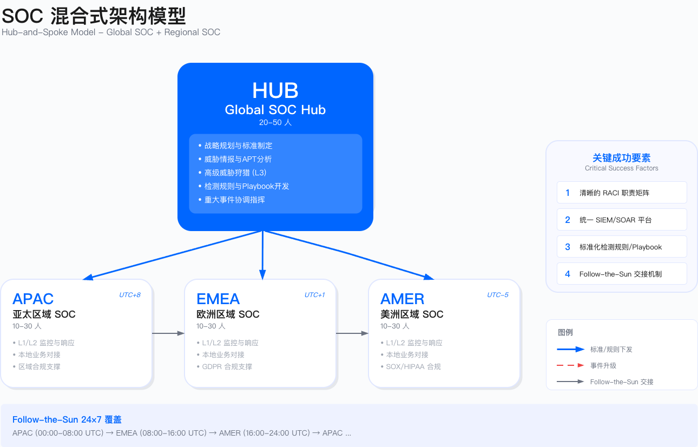

# 11.1　SOC 战略与组织

安全运营中心的战略定位决定了其能否真正发挥防御价值。SOC 战略定位的核心困境在于：如何平衡"保护业务"与"支持业务"。过度保守导致业务阻塞——每个可疑行为都触发阻断，正常业务流程被频繁中断；过度激进则可能错失威胁——为了减少误报而提高告警阈值，真实攻击被淹没在噪音中。

这一困境的本质是风险容忍度与运营成本的权衡。SOC 是企业风险管理体系的执行层，不能当作孤立的技术部门。其战略定位必须与企业整体安全战略对齐，既不能脱离业务实际追求理想化的"零风险"，也不能因成本压力而牺牲基本防护能力。

本节基于 Target 等公开案例，展示组织模型选择、成熟度演进与全球运营的关键权衡。这些案例揭示了一个核心教训：SOC 失效往往不是技术能力不足，而是组织设计、决策权限与业务理解的缺陷。

---

## 11.1.1 SOC 使命与目标

### 从"监控中心"到"风险决策平台"的演进

传统 SOC 的定位是"技术监控部门"——部署 SIEM、编写检测规则、处理告警队列。这种定位在威胁环境相对简单的时代或许足够，但在现代攻击复杂度与业务数字化程度大幅提升的背景下，已经无法满足企业安全需求。

Target 2013 数据泄露事件清晰地暴露了这一定位的根本缺陷。美国参议院调查报告指出：SOC 不缺检测能力，缺的是响应决策能力。FireEye 告警确实检测到了恶意软件，但 SOC 团队陷入决策瘫痪——"这是误报吗？""能隔离 POS 终端吗？""谁来承担业务中断责任？"

决策瘫痪的根源在于：SOC 分析师具备识别威胁的技术能力，但缺乏做出业务决策的权限与信息。隔离一台 POS 终端可能导致该门店无法收款，在感恩节购物高峰期，这意味着直接的营收损失。分析师面临两难：隔离可能是"过度反应"导致业务中断，不隔离可能是"疏忽"导致数据泄露。缺乏预定义的决策框架时，"等待确认"成为最安全的职业选择——但却是最危险的安全选择。

这暴露了传统 SOC 使命定义的根本问题：将 SOC 定位为"技术监控部门"，而非"风险决策平台"。有效的 SOC 必须具备三项核心能力：检测威胁的技术能力、评估业务影响的分析能力、以及在不确定性中做出决策的授权与框架。

有效的 SOC 使命应包含三个层次，每个层次对应不同的能力要求与价值交付：

1. 战术层（tactical）：检测与响应

战术层是 SOC 的基础能力，聚焦于威胁的识别与处置。其核心职责包括：7×24 小时监控企业资产，检测已知和未知威胁；快速遏制、根除与恢复，将业务中断时间降至最低；以及维护检测规则库与响应剧本的有效性。

战术层的衡量指标通常包括 MTTD（平均检测时间）与 MTTR（平均响应时间）。基线目标示例：MTTD < 24 小时，MTTR（P1）< 4 小时。这些数值需根据组织实际能力、资产关键性与风险容忍度设定，而非简单套用行业基准（跨组织对标口径可参照 SANS 的年度 SOC 调研[8]）。拥有成熟 EDR 部署的组织可能将 MTTD 目标设为小时级，刚起步的 SOC 可能需要先从天级目标开始逐步优化。

2. 战略层（strategic）：风险量化与决策支持

战略层将 SOC 从"告警处理"提升至"风险管理"。其核心职责是：将威胁情报转化为风险评估，支持安全投资优先级决策；为业务连续性规划（BCP）提供威胁场景分析，识别哪些威胁会导致何种业务中断；支持董事会级别的风险报告，用业务语言（而非技术术语）解释安全态势。

战略层能力的缺失是许多 SOC 被边缘化的根源。当 SOC 只能汇报"本月处理了 5000 条告警"，而无法回答"我们面临的最大风险是什么"时，其价值无法被业务领导层理解，预算与资源争取也会陷入被动。

3. 价值层（value）：业务赋能

价值层是 SOC 从"成本中心"向"业务伙伴"转型的关键。其核心职责包括：支持新业务上线的安全评估与监控覆盖，使安全成为业务加速器而非阻碍；为客户或合作伙伴提供安全态势证明（SOC 2、ISO 27001 认证），将安全能力转化为竞争优势；通过降低保险保费、避免合规罚款创造可量化价值。

反面案例：某金融科技公司[^1] SOC 将使命定义为"处理所有安全告警"，这一看似合理的目标导致了系统性失败：

[^1]: 基于行业调研汇总的脱敏案例，非特指单一企业。

一线分析师每天处理大量告警，其中误报占比过高。在"清空队列"的压力下，分析师不得不快速决策，将大量中危告警直接关闭未分析。一起 APT 攻击的告警被当成"常规恶意软件"处理，攻击者驻留时间远超行业平均水平。

教训是："处理告警"不是使命，"避免业务损失"才是。当使命被错误定义时，团队会优化错误的指标——追求告警处理数量而非检测质量，追求队列清空速度而非威胁识别准确性。

### 战略目标设计

SOC 的战略目标应该是 SMART（具体、可测量、可达成、相关、有时限）的。以下表格展示典型目标维度与衡量指标：

| 目标维度 | 示例目标 | 衡量指标 |
|---------|---------|---------|
| 检测能力 | 在指定时间窗口内检测到关键威胁 | MTTD（平均检测时间）|
| 响应效率 | 在规定时间内遏制 P1 级事件 | MTTR（平均响应时间）|
| 覆盖范围 | 覆盖企业相关的 MITRE ATT&CK 技术 | ATT&CK 覆盖率 |
| 自动化率 | 提升告警自动化处置比例 | 自动化处置比例 |
| 业务影响 | 减少因安全事件导致的业务中断时间 | 业务中断时长 |
| 成本效益 | 安全投资产生正向回报 | ROI 或 ROSI |

具体数值需根据组织规模、行业特点与现有能力水平设定，避免脱离实际。

适用边界

- 适用于已有基础 SIEM 平台与日志聚合能力的环境
- 不适用于缺乏日志规范、资产盘点未完成的环境（需先补基础）
- 适用于一线/二线人员配备已到位的场景

关键约束

- 成本约束：提升自动化率需投资 SOAR 平台，需评估 ROI
- 组织能力约束：响应 SLA 依赖跨部门协同，需预定义响应权限矩阵
- 合规约束：日志留存、响应证据链需符合 ISO 27001、SOC 2 要求

人员配置约束（参考值）

以下为行业实践中的参考配置比例，实际需根据告警量、自动化程度与业务复杂度调整：

| 角色 | 配置参考 | 说明 |
|------|---------|------|
| 一线分析师 : 监控资产 | 1:2000-5000 | 高自动化环境可接近上限，低自动化环境需接近下限 |
| 二线分析师 : 一线分析师 | 1:3-5 | 二线承担深度分析与升级处理 |
| 三线专家 : 二线分析师 | 1:5-8 | 三线专注威胁狩猎与复杂事件 |
| 7×24 单岗位覆盖 | 5.2 FTE/岗位 | 含休假、培训、离职冗余（内部口径） |

告警疲劳阈值（内部口径）

- 单人单班次有效处理告警量：80-120 条（含初步分诊与记录）
- 超过此阈值时误判率显著上升，需引入自动化或增加人员
- 夜班准确率相比白班下降约 15-25%，需通过流程补偿（降低自主决策权限、强制升级阈值下调）

值班容量规划参考

| 日均告警量 | 一线建议 | 二线建议 | 检测工程 | 说明 |
|------------|---------|---------|----------|------|
| < 500 | 2 | 1 | 0.5（兼职） | 起步阶段，优先建立流程 |
| 500-2000 | 3-4 | 2 | 1 | 稳定运营，可启动自动化 |
| 2000-5000 | 5-6 | 3 | 2 | 规模化，需完善检测工程 |
| > 5000 | 优先降噪 | - | 2+ | 需先治理噪声，否则人员投入无效 |

> 关键约束：明确 On-call 补偿机制与"燃尽治理"（burnout prevention），否则团队稳定性难以维持。非 7×24 模式下，工作时间由一线 + 二线 + IC 值班，非工作时间由二线 On-call 轮值。

### 价值主张

SOC 需向不同利益相关者清晰传达价值。对董事会/高管，核心是降低重大安全事件风险、满足监管合规要求、量化投资回报。对业务部门，核心是保护业务连续性、支持新业务安全保障、提供快速响应能力。对 IT/技术团队，核心是提供统一监控能力、协助漏洞管理、协同处置事件。对客户/合作伙伴，核心是保护数据与隐私、维护服务可用性、满足安全与合规要求。

### 核心原则

1. 业务驱动：安全运营须理解与支持业务目标，而非简单的"禁止"
2. 数据驱动：基于数据与指标进行决策、优化与改进
3. 自动化优先：优先考虑自动化，释放人力处理高价值任务
4. 持续改进：建立反馈循环，持续优化检测、响应与流程
5. 协同合作：与 IT、业务、法务、公关等部门紧密协作
6. 人才为本：投资人才培养，建立学习型组织
7. 威胁情报驱动：基于威胁情报指导检测与响应优先级
8. 合规融入：将合规要求融入日常运营流程

---

## 11.1.2 SOC 组织模型：Target 案例的启示

### 集中式 SOC 的隐藏陷阱

Target 采用集中式 SOC，总部位于明尼苏达州 Minneapolis，监控全美门店的 IT 与 POS 系统。表面上这是"成本最优"的方案——单一团队、统一流程、集中专家资源。但 2013 年 11 月的数据泄露暴露了集中式模型在"总部-分支"复杂场景中的缺陷。

Target 案例复盘（数据来源：US Senate Commerce Committee Report，2014）

时间线：

- 11 月 15 日：攻击者通过供应商 VPN 凭证入侵，开始在网络中横向移动
- 11 月 30 日：FireEye 检测到门店 POS 终端的恶意软件（Trojan.POSWDS），生成高危告警
- 12 月 2 日：SOC 分析师查看告警，但未采取行动
- 12 月 12 日：美国国防部网络安全团队通报 Target 疑似数据泄露
- 12 月 15 日：Target 确认泄露，开始响应
- 最终：大量信用卡信息与客户记录被窃（据公开报道）

关键失误分析

集中式 SOC 团队位于总部，与门店运营团队物理与组织上都分离。当 FireEye 告警显示"POS 进程被注入恶意代码"时，分析师无法判断这是恶意行为还是门店 IT 部门的正常更新，也无法获知 POS 系统的正常运维模式。更关键的是，响应权限不明确——是否有权限"隔离 POS 终端"？谁来批准？感恩节假期如何联系有决策权的人？参议院报告指出，响应手册中没有定义"业务高峰期如何权衡安全响应与业务连续性"。最终，分析师选择"观望"——这是最安全的职业决策，但却是最危险的安全决策。

集中式 SOC 的适用条件

集中式模型能有效运作需满足：技术栈统一（单一云环境，而非"数据中心 + 门店 + 云"混合）、业务模式一致（电商平台、SaaS 服务）、日志标准化、地理集中（主要业务在单一时区）、决策链路短、响应权限明确。

反例场景包括：跨国零售企业（Target 模式）、欧盟跨国企业（GDPR 数据传输限制）、中国区 + 全球混合（可能违反《数据安全法》第 31 条）。

### 分布式 SOC 的成本困境

某全球制造企业[^2]采用完全分布式 SOC：美国、欧洲、中国各自独立建设。运营后发现三个 SOC 各自采购 SIEM/SOAR/TIP，工具成本倍增；专家资源分散，每个 SOC 都需要"全栈"能力但单体规模不足以支撑专家团队；跨区域 APT 攻击中，美国 SOC 发现初始入侵，攻击者横向移动到欧洲，两个 SOC 没有情报共享机制，各自独立分析；全局态势感知缺失。

[^2]: 基于行业调研汇总的脱敏案例，非特指单一企业。

教训：分布式 SOC 适用于"收购整合后的多品牌运营"（如 PE 公司投资组合），但对于"单一品牌的全球业务"，成本与协同问题通常大于收益。

### SOC 组织模型对比

| 模型 | 适用组织规模 | 行业特征 | 预算门槛（参考） | 核心优势 | 核心约束 | 不适用场景 |
|------|-------------|---------|----------------|---------|---------|-----------|
| 集中式 | 中小型企业、单一业务线 | 技术栈统一、业务模式单一 | 较低（单一团队、统一平台） | 成本最优、流程标准化、专家资源集中 | 业务理解不足、时区覆盖受限、响应权限不明确 | 跨国零售、多时区运营、异构环境 |
| 分布式 | 多品牌集团、PE 投资组合 | 各业务单元独立运营、技术栈差异大 | 高（多个团队、多套平台） | 本地化响应快、业务理解深、合规自主 | 成本倍增、协同失效、全局态势感知缺失 | 单一品牌全球业务、预算受限组织 |
| 混合式 | 大型跨国企业、全球化业务 | 核心业务全球化、区域合规差异大 | 中高（Hub 投入 + 区域投入） | 兼顾全局标准与本地灵活、成本可控 | 职责划分复杂、交接协调成本、需统一平台 | 业务高度集中于单一区域、小型组织 |
| MSSP 托管 | 中小型企业、安全团队初建阶段 | 核心业务非 IT、安全人才招聘困难 | 按服务付费（OpEx 模式） | 快速获得能力、无需自建团队、弹性扩展 | 环境熟悉度低、响应深度受限、数据出境合规 | 核心业务响应时效要求极高、高度定制化检测需求 |

选型决策树

1. 业务是否跨多时区？是 → 考虑 Follow-the-Sun（混合式）；否 → 考虑集中式
2. 是否有多个独立运营的业务单元？是 → 考虑分布式或混合式；否 → 考虑集中式
3. 是否有充足预算与安全人才？是 → 自建；否 → 考虑 MSSP 托管或混合托管
4. 是否有严格的数据出境限制？是 → 需评估区域 SOC 或本地 MSSP；否 → 可考虑全球统一平台

### 混合式 SOC：常见实践

多数成熟企业采用混合式（hub-and-spoke）模型。架构上，Global SOC Hub（参考配置 20-50 人）负责战略、标准、高级检测（威胁狩猎、APT 分析）、威胁情报；Regional SOC（参考配置每个 10-30 人）负责一线/二线监控、初步响应、本地业务对接、本地合规。



关键成功要素

1. 清晰的 RACI 矩阵：谁负责一线告警？谁负责 P1 事件？谁负责合规报告？
2. 统一平台：所有区域使用相同 SIEM/SOAR，避免"平台割裂"
3. 标准化流程：检测规则、playbook 由 Global Hub 制定，Regional SOC 执行
4. Follow-the-Sun 交接：亚太 → 欧洲 → 美洲，确保 24×7 覆盖（详见 11.1.3）

常见误区

- 认为混合式模型可"兼得两者优势"，忽视协调成本
- Global Hub 与 Regional SOC 职责边界模糊，导致责任真空
- 统一平台后未同步统一流程，各区域仍各自为政

### 三线一体组织架构

对于互联网科技公司与云原生企业，传统的一线/二线/三线分层模型需要进一步演进为"三线一体"架构：

```
┌─────────────────────────────────────────────────────────────────┐
│                         SOC 负责人                               │
├──────────────────┬───────────────────┬──────────────────────────┤
│   监控运营线      │   检测工程线       │    威胁对抗线             │
│   (Ops)          │   (Detection Eng)  │    (Threat/Hunt/Intel)   │
├──────────────────┼───────────────────┼──────────────────────────┤
│ • 一线监控分析   │ • 规则/查询工程    │ • 威胁情报运营            │
│ • 二线事件分析   │ • 数据规范        │ • 威胁狩猎                 │
│ • IC 值班经理    │ • 用例库管理      │ • 对手画像                 │
│                  │ • 回归测试        │ • 红蓝紫队联动             │
│                  │ • 噪声治理        │ • 热点战法产品化           │
├──────────────────┴───────────────────┴──────────────────────────┤
│                    SOC 平台与自动化                               │
│         (SecOps Platform / SOAR / Case Management)               │
└─────────────────────────────────────────────────────────────────┘
```

三线一体架构适用于告警日均量超过 500 条、具备云原生或混合环境、需要自主检测能力的组织。对于小型团队（人员不足 5 人），可合并实施，但检测工程能力必须有人负责，否则 SOC 会退化为"告警处理中心"。

检测工程线与监控运营线必须分离考核，否则检测工程师会被告警处理淹没。威胁对抗线需与红蓝队建立常态化联动机制，避免能力孤立。

### 混合式 SOC 的职责划分（RACI）

| 活动 | Global SOC | Regional SOC | Business BP | IT/Engineering |
|-----|------------|--------------|-------------|----------------|
| 战略与政策制定 | R/A | C | C | I |
| 平台选型与架构 | R/A | C | I | C |
| 检测规则开发 | R/A | C | C | I |
| 一线告警监控 | C | R/A | I | I |
| 二线告警分析 | C | R/A | I | I |
| 三线高级分析 | R/A | C | C | C |
| 威胁情报运营 | R/A | C | I | I |
| 威胁狩猎 | R/A | C | C | I |
| P1/P2 事件响应 | R/A | C | C | C |
| P3/P4 事件响应 | C | R/A | C | C |
| 合规报告 | A | C | I | I |

### Incident Commander（IC）授权范围

Target 案例揭示的核心问题是：SOC 分析师具备检测能力，但缺乏响应决策的授权与框架。为避免"观望瘫痪"，必须预定义 IC 的授权边界：

| 动作类别 | IC 可直接触发 | 需审批触发 | 禁止触发 |
|----------|---------------|------------|----------|
| 账号 | 禁用会话、强制登出 | 禁用账号、重置密码 | 删除账号 |
| 密钥 | 标记泄露 | 轮转密钥 | 吊销根密钥 |
| 终端 | 隔离终端、网络断连 | 远程擦除 | - |
| 网络 | 封禁 IP、WAF 临时规则 | 修改 ACL、封禁网段 | 修改核心路由 |
| 业务 | 熔断接口（影响 < 1%） | 熔断接口（影响 > 1%） | 关停核心服务 |

"需审批触发"的动作必须有预定义的审批人清单与备援机制（含节假日）。"禁止触发"的动作仅限 CSO 或同等级别高管在 War Room 中决策。所有响应动作需记录完整审计日志，包含触发人、时间、依据与回滚方案。

验证方法：每季度桌面推演，测试 IC 在不同场景下的决策准确性与速度；红队演练中验证响应动作的执行路径与审批流程。

---

## 11.1.3 全球 SOC vs. 区域 SOC

### Follow-the-Sun 24×7 运营模式

对于全球化企业，follow-the-sun 模式是实现 24×7 运营的常见实践。核心理念是利用地理时区差异，确保任何时刻都有主值班团队，通过标准化交接流程保持连续性，通过统一平台与流程保持一致性。

典型三区域部署

| 区域 | 覆盖时区 | 主值班时间（UTC） | 覆盖范围 |
|-----|---------|------------------|---------|
| APAC SOC | UTC+8 ~ UTC+10 | 00:00 - 08:00 | 亚太、澳洲、中国 |
| EMEA SOC | UTC+0 ~ UTC+2 | 08:00 - 16:00 | 欧洲、中东、非洲 |
| Americas SOC | UTC-5 ~ UTC-8 | 16:00 - 00:00 | 北美、南美 |

### 交接机制（handover）

标准化交接包内容应覆盖：进行中的事件（事件 ID、级别、状态、当前处理人、下一步行动、时间线、升级建议）、告警趋势（过去 8 小时量趋势、高频类型、异常告警）、平台与工具状态（SIEM/SOAR 健康状态、数据源状态、正在进行的维护活动）、威胁情报更新（新情报、紧急 IOC、行业预警）、其他注意事项（计划变更、VIP 请求、资源问题）。

常用工具：协作平台（Confluence、SharePoint）、实时通信（Slack、Microsoft Teams）、工单系统（Jira、ServiceNow）、视频会议（Zoom、Teams）。

### 适用边界与关键约束

Follow-the-Sun 适用于跨多时区（≥3 个时区差）运营的全球化企业，不适用于业务高度集中于单一区域的组织。

关键约束包括：每增加一个区域 SOC，最低配置需 5-8 FTE；即使有标准化交接流程，跨区域交接仍存在信息损耗，复杂事件交接延迟约 15-30 分钟；跨境日志传输需遵守 GDPR、中国《数据安全法》等要求，可能限制全球统一 SIEM 的可行性。

一个常见误区是认为 Follow-the-Sun 可完全替代夜班——夜间仍需值班人员处理突发 P1 事件的本地化响应，Follow-the-Sun 仅减少而非消除夜班需求。

### 运行指标

| 指标 | 定义 | 触发条件 |
|-----|-----|---------|
| 交接完成率 | 按时完成交接 / 应交接次数 | <95% 需优化交接流程 |
| 交接信息完整度 | 交接包含全部必要字段 / 总交接数 | <90% 需强化交接模板 |
| 跨区域事件 MTTR | 跨区域事件的平均响应时间 | 较单区域 MTTR 高 >50% 需改进协同 |

---

## 11.1.4 SOC 成熟度模型

### SOC-CMM 框架概述

SOC-CMM（Security Operations Center - Capability Maturity Model）是由 Rob van Os 开发的 SOC 能力成熟度评估框架，通过 5 个评估域 和 6 个成熟度级别（Level 0-5）系统评估 SOC 能力。

> 参考资源：SOC-CMM 官方网站（soc-cmm.com）提供免费的自评估工具与详细文档。

### 五个评估域

| 评估域 | 英文 | 核心内容 | 关键评估要素 |
|--------|------|----------|--------------|
| 业务 | Business | SOC 与业务的对齐程度 | 治理结构、战略规划、预算管理、利益相关者管理、合规对齐、服务目录定义 |
| 人员 | People | 团队能力与组织 | 组织架构、角色定义、技能矩阵、培训计划、职业发展、知识管理、轮班管理 |
| 流程 | Process | 运营流程成熟度 | 事件管理、变更管理、问题管理、持续改进、文档管理、SLA 管理 |
| 技术 | Technology | 工具与平台能力 | SIEM/SOAR/TIP 部署、日志管理、自动化水平、工具集成、平台运维 |
| 服务 | Services | SOC 交付的服务能力 | 监控、检测、响应、威胁狩猎、威胁情报、漏洞管理、取证分析 |

### 六个成熟度级别

| 级别 | 名称 | 特征描述 | 典型状态 |
|------|------|----------|----------|
| Level 0 | 不存在（Non-existent） | 能力极度临时或不完整 | 无 SOC 或仅有临时响应 |
| Level 1 | 初始（Initial） | 能力以临时方式交付，依赖个人经验 | 基础监控已建立，但流程不一致，工具分散 |
| Level 2 | 已管理（Managed） | 能力已文档化并一致性交付 | SIEM 部署，基本 Playbook，团队分工明确 |
| Level 3 | 已定义（Defined） | 基于交付质量和时效的反馈进行管理 | SOAR 自动化，威胁情报运营，一线/二线/三线分级 |
| Level 4 | 量化管理（Quantitatively Managed） | 系统性测量交付的质量、数量与时效 | XDR/ML 检测，业务风险量化，指标驱动决策 |
| Level 5 | 优化（Optimizing） | 持续优化与改进 | AI 驱动运营，预测防御，持续改进循环 |

### 典型演进路径

| 阶段 | 目标级别 | 参考周期 | 重点投入 |
|------|----------|----------|----------|
| 初建期 | Level 0 → Level 1 | 3-6 个月 | 建立基础监控、组建团队、接入核心日志 |
| 规范期 | Level 1 → Level 2 | 6-12 个月 | 部署 SIEM、建立流程、文档化、定义 SLA |
| 成熟期 | Level 2 → Level 3 | 12-18 个月 | 引入 SOAR、威胁情报、标准化流程、质量反馈 |
| 量化期 | Level 3 → Level 4 | 18-24 个月 | 指标体系、ML 检测、业务价值量化 |
| 优化期 | Level 4 → Level 5 | 持续 | AI 驱动、持续改进循环、行业领先 |

关键约束：追求快速升级而跳过基础建设是最常见的错误——Level 2 的流程文档化是 Level 3 质量管理的前提，跳级会导致能力空心化。评估应纳入年度运营周期而非一次性项目，并通过红队验证实际能力是否与评估级别匹配。

### SOC-CMM 与 NIST CSF 2.0 映射

SOC 运营主要覆盖 NIST CSF 2.0 的 Detect 和 Respond 功能，同时与其他功能存在交集：

| NIST CSF 2.0 功能 | SOC-CMM 对应域 | SOC 职责范围 |
|------------------|---------------|-------------|
| Govern（治理） | Business | SOC 治理结构、预算管理、利益相关者管理 |
| Identify（识别） | Business, Services | 资产可见性、风险评估支持、威胁情报 |
| Detect（检测） | Technology, Services, Process | 核心职责：监控、告警、威胁狩猎、检测工程 |
| Respond（响应） | Services, Process, People | 核心职责：事件响应、遏制、根除、取证 |
| Recover（恢复） | Services | 事件后恢复支持、复盘改进（协同职责） |

---

## 11.1.5 SOC 服务目录

服务目录定义了 SOC 提供的服务、服务范围、SLA 与交付物，是 SOC 与业务、IT 等部门的"合同"。服务目录应随 SOC 能力演进逐步扩展，初期聚焦核心服务（监控、告警响应），需与业务、IT 团队协商确认而非 SOC 单方面定义。

核心服务类别涵盖八类：监控与告警响应（7×24 监控、一线/二线/三线告警分析）、威胁情报（收集、IOC 管理、情报报告、预警）、事件响应（调查/遏制/根除/恢复、数字取证、危机管理、事件后分析）、威胁狩猎（主动狩猎、假设驱动狩猎、异常行为调查）、漏洞管理（扫描协调、漏洞情报、漏洞响应）、安全平台运维（SIEM/SOAR 运维、数据源管理、规则管理）、合规与报告（合规支持、运营报告、高管报告、监管报告）、咨询与培训（安全咨询、演练组织、安全培训）。

SLA 设计原则

事件优先级分级（P1 Critical → P4 Low），响应时间依优先级分级设定。服务类型决定 SLA 粒度：实时服务（监控、告警）分钟级；按需服务（事件响应、威胁狩猎）小时级；计划服务（报告、扫描）天/周/月级；咨询服务工作日级。

常见误区

- 照搬 MSSP 服务目录：外部 MSSP 的服务目录针对标准化客户，内部 SOC 需根据业务特点定制
- SLA 设定过于激进：P1 事件 5 分钟响应听起来很好，但如果实际达成率 <80% 反而损害信任
- 服务目录发布后不再更新：建议每年至少修订一次

运行指标

| 指标 | 定义 | 触发条件 |
|-----|-----|---------|
| 整体 SLA 达成率 | 符合 SLA 的事件 / 总事件 | <90% 需分析原因并改进 |
| P1 SLA 达成率 | P1 事件符合 SLA / P1 事件总数 | <95% 需立即改进 |
| 客户满意度 | 满意度调查平均分 | <3.5/5 需收集反馈并改进 |

---

## 11.1.6 实施建议

SOC 建设分四个阶段推进：战略规划（1-2 个月，定义使命目标、获得支持、选择组织模型）、基础建设（3-6 个月，组建团队、部署 SIEM、接入核心日志、建立事件响应流程）、能力扩展（6-12 个月，扩展日志源、部署 SOAR、建立威胁情报能力、优化检测规则）、持续改进（12 个月+，实施威胁狩猎、部署 UEBA/ML、扩展自动化覆盖）。

十一个关键成功要素

1. 高层承诺：获得 CISO/CIO 的明确支持与持续投资
2. 清晰愿景：明确 SOC 的使命、目标与价值主张
3. 合适模型：选择适合企业规模与特点的组织模型
4. 人才优先：投资人才招募与培养
5. 流程先行：先建立流程，再引入工具
6. 小步快跑：采用敏捷方法，快速迭代
7. 数据驱动：建立指标体系，持续测量与改进
8. 跨部门协作：与 IT、业务、法务等紧密协作
9. 持续改进：建立反馈循环，持续优化
10. 文化建设：培养学习型组织与团队文化
11. 倦怠预防：建立机制化的分析师倦怠预防措施（详见 11.1.7）

---

## 11.1.7 SOC 分析师倦怠预防

SOC 分析师倦怠（Burnout）是行业普遍面临的挑战。SANS 2025 年 SOC 调研的口径是：SOC 人员最常见的在岗时长为 3-5 年，只有 4% 的人在岗超过 10 年；同时 62% 的受访者认为所在组织在留住核心人才方面做得不够[7]。**需要提醒的是，业内常见的"SOC 分析师平均任期只有 1-2 年"这一说法在 SANS 的调研数据里得不到支持**，引用时应以当期调研的原始口径为准。真正值得警惕的不是绝对任期数字，而是团队规模——同一份调研显示最常见的团队规模只有 2-10 人，因此一次资深分析师离职带走的往往是整个团队对环境的深度理解。高流失导致的连锁后果包括知识流失、培训成本攀升（据作者实践，新人通常需要 6-12 个月才能独立值班，示例口径、非行业基准）、以及人员变动期间告警处理质量下降。

倦怠根因分析

| 根因类别 | 具体表现 | 影响程度 |
|---------|---------|---------|
| 告警疲劳 | 日处理数百条告警，多数为误报，重复性工作消耗热情 | 高 |
| 夜班负担 | 7×24 轮班打乱生活节奏，长期影响健康 | 高 |
| 技能停滞 | 日常工作以一线分诊为主，缺乏技能提升机会 | 中 |
| 价值感缺失 | 处理的多数告警最终被标记为"误报"或"无需响应" | 中 |
| 职业发展受限 | 晋升路径不清晰，高级岗位有限 | 中 |
| 工具低效 | 工具碎片化、缺乏自动化，大量时间浪费在重复操作 | 中 |

机制化预防措施

工作负载管理：设定单人单班次告警处理上限（建议 80-120 条）；将误报率纳入 SOC 运营 OKR，持续降低无效告警；通过 SOAR 自动处置低风险告警，释放人力聚焦高价值分析。

轮班优化：避免连续夜班超过 3 天，设定强制休息期；条件允许时采用 Follow-the-Sun，从根本上减少本地夜班需求。

技能发展通道：一线分析师每季度参与 1-2 次威胁狩猎项目；资助 GIAC、OSCP 等认证；明确一线→二线→三线→威胁狩猎/检测工程 的晋升标准。

价值感提升：每周分享"本周最佳检测"，表彰发现真实威胁的分析师；在事件报告中展示"避免的潜在损失"；一线/二线分析师参与 P1/P2 事件复盘会议。

倦怠预警指标

| 指标 | 定义 | 预警阈值 |
|-----|-----|---------|
| 月度离职率 | 月离职人数 / 团队总人数 | >5% 需立即干预 |
| 病假率 | 病假天数 / 应出勤天数 | >10% 需关注 |
| 告警处理准确率 | 正确分类告警 / 总处理告警 | 持续下降需关注 |
| 员工满意度 | 季度满意度调查得分 | <3.0/5 需改进 |

---

## 11.1.8 远程与混合 SOC 运营模式

后疫情时代，远程与混合办公已成为常态。SOC 作为需要 7×24 运营的关键部门，面临特殊挑战：分析师需访问敏感日志与威胁情报，远程环境下如何保障数据安全；告警分析、事件响应需要快速沟通，远程协作是否会影响 MTTR；某些监管要求日志数据不出特定区域，远程访问是否合规。

安全远程访问要求

| 控制领域 | 具体要求 | 实施建议 |
|---------|---------|---------|
| 身份认证 | 多因素认证（MFA），优先使用硬件令牌或 FIDO2 | 禁止仅密码认证，短信 OTP 作为备用 |
| 设备管理 | 仅允许公司托管设备访问 SOC 平台 | MDM/UEM 管理，设备合规检查 |
| 网络接入 | 零信任网络访问（ZTNA）或 VPN | 按需授权，最小权限原则 |
| 数据防护 | 禁止本地下载敏感日志，会话录制 | VDI 环境，DLP 策略 |
| 审计追溯 | 完整的访问与操作日志 | 关键操作双人确认 |

混合模式最佳实践

一线告警监控支持远程；二线深度分析混合（复杂分析可远程，团队协作场景建议现场）；三线高级分析/威胁狩猎优先现场；P1 事件响应 War Room 现场；值班交接视频会议；培训与演练混合（理论可远程，实操建议现场）。

---

## 11.1.9 SOC-as-Code：运营代码化趋势

SOC-as-Code 是将 SOC 运营的配置、规则、流程以代码形式管理的实践，借鉴 DevOps 的 Infrastructure-as-Code 理念。核心价值在于：所有变更可追溯可回滚（版本控制），规则与流程上线前经过验证（自动化测试），消除手工配置导致的环境差异（一致性部署），通过 Pull Request 实现变更审批（协作效率）。

覆盖范围包括：检测层（SIGMA 规则、YARA 规则、ML 模型配置、告警阈值配置）、响应层（SOAR Playbook、响应脚本、审批工作流配置）、配置层（SIEM 数据源配置、日志解析规则、告警路由规则）、知识层（Playbook 文档、SOP 文档、白名单配置）。

Detection-as-Code 典型 CI/CD Pipeline 示例

```yaml
# .github/workflows/detection-rules.yml
name: Detection Rules CI/CD

on:
  push:
    paths: ['rules/**/*.yml']
  pull_request:
    paths: ['rules/**/*.yml']

jobs:
  validate:
    runs-on: ubuntu-latest
    steps:
      - uses: actions/checkout@v4

      - name: SIGMA Rule Syntax Validation
        run: |
          pip install sigma-cli
          sigma check rules/*.yml

      - name: Unit Test with Historical Data
        run: |
          python tests/test_detection.py --rules rules/ --data tests/fixtures/

      - name: ATT&CK Coverage Analysis
        run: |
          python tools/attack_coverage.py --rules rules/ --output coverage_report.md

  deploy:
    needs: validate
    if: github.ref == 'refs/heads/main'
    runs-on: ubuntu-latest
    steps:
      - name: Convert and Deploy to SIEM
        run: |
          sigma convert -t splunk rules/*.yml > splunk_queries.txt
          ./scripts/deploy_to_siem.sh splunk_queries.txt
```

这段 Pipeline 展示了四个关键控制点：语法验证（sigma check）防止格式错误的规则进入生产；历史数据单元测试（test_detection.py）验证规则对已知样本的命中情况；ATT&CK 覆盖度分析自动量化规则库的技术覆盖范围；只有 main 分支合并后才触发 SIEM 部署，确保未经审批的变更不会直接上线。

实施路径

| 阶段 | 目标 | 关键活动 | 参考周期 |
|-----|------|---------|---------|
| 阶段 1 | 规则版本控制 | 将现有检测规则迁移至 Git 仓库，建立基本变更追溯 | 1-2 个月 |
| 阶段 2 | 自动化验证 | 实现语法检查、单元测试，建立 CI 流水线 | 2-3 个月 |
| 阶段 3 | 自动化部署 | 实现规则自动部署至 SIEM，建立回滚机制 | 2-3 个月 |
| 阶段 4 | 全面覆盖 | 扩展至 Playbook、配置、文档的代码化管理 | 持续 |

SOC-as-Code 适用于检测规则数量超过 100 条、有多人协作维护需求的 SOC，需要 SIEM 支持 API 集成（Splunk、Elastic、Sentinel 等主流平台均支持），团队需具备基本的 Git 与 CI/CD 使用能力。

> 参考：Detection-as-Code 的技术实现细节，详见 [11.3 检测工程](./11.3_威胁检测工程.md)。

---

## 小结

本节覆盖了 SOC 战略与组织的核心要素：使命与目标定义（战术/战略/价值三层次）、组织模型选择（集中/分布/混合/MSSP 四类模型及 Target 案例警示）、全球运营（Follow-the-Sun 与交接机制）、成熟度模型（SOC-CMM 六级）、服务目录设计、分析师倦怠预防、远程运营模式、运营代码化趋势。

下一节（11.2）将深入探讨 SOC 架构设计，包括 SIEM、SOAR、威胁情报平台等技术架构，以及云原生与国产信创选型指南。

## 参考资料

1. SOC-CMM Official Website: https://www.soc-cmm.com/
2. Rob van Os, "SOC-CMM: Measuring Capability Maturity in Security Operations Centers", 2016
3. NIST Cybersecurity Framework 2.0: https://www.nist.gov/cyberframework
4. US Senate Commerce Committee, "A 'Kill Chain' Analysis of the 2013 Target Data Breach", 2014
5. SANS Institute, "Building a World-Class Security Operations Center: A Roadmap", 2015
6. Gartner, "How to Plan, Design, Operate and Evolve a SOC", 2023

---

## 参考文献

| # | 来源 | 标题 | 日期 | 链接 |
| --- | --- | --- | --- | --- |
| [7] | SANS Institute（Christopher Crowley） | SANS 2025 SOC Survey（SOC 人员最常见在岗时长 3-5 年；仅 4% 超过 10 年；62% 认为组织在人才保留上做得不够；最常见团队规模 2-10 人） | 2025-07 | <https://www.sans.org/white-papers/sans-2025-soc-survey> |
| [8] | SANS Institute（Christopher Crowley） | 2026 SANS SOC Survey: A Decade of Evolution in Cyber Defense（当期版本） | 2026-06 | <https://www.sans.org/webcasts/2026-sans-soc-survey-insights> |

---

## 导航

[← 上一节：11.0 执行摘要](./11.0_执行摘要.md) | [返回章节目录](./README.md) | [下一节：11.2 架构设计 →](./11.2_SOC架构设计.md)

---

© 2025-2026 AISecOps Project. Licensed under CC BY-NC-SA 4.0
