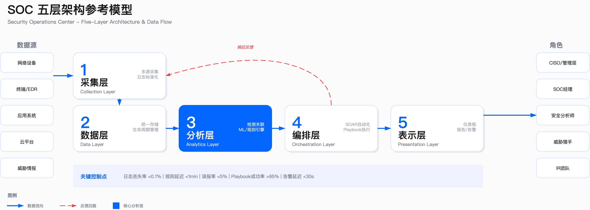
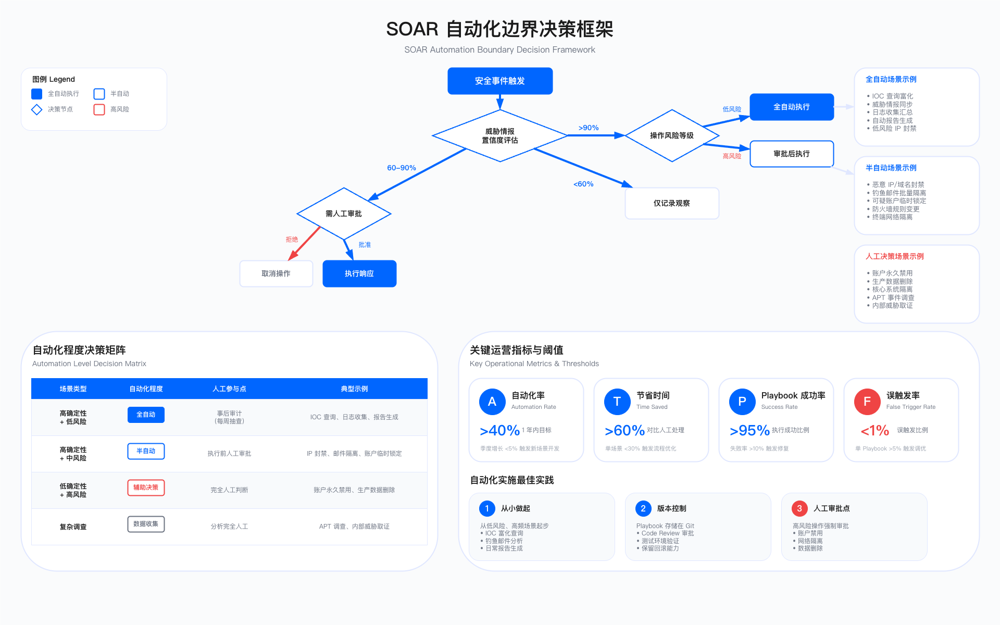

# 11.2　SOC 架构设计

SOC 技术架构是支撑安全运营能力的基础设施。架构设计质量直接决定了检测覆盖范围、响应速度、自动化水平和运营成本。本节从架构原则、核心平台选型、集成方案和数据治理四个维度展开，聚焦工程决策点与约束条件。

---

## 11.2.1 SOC 技术架构设计原则

SOC 架构设计的核心挑战不在于选择哪款产品，而在于如何构建一个可观测、可恢复、可扩展的技术底座。许多 SOC 在建设初期将全部精力投入 SIEM 选型，却忽视了更基础的问题：当某个日志源断流时，分析师能否在 10 分钟内发现？当 SIEM 主节点故障时，是否有备用检测能力？当日志量翻倍时，现有架构能否平滑扩容？

这些问题的共同根源是架构层次不清晰——采集、存储、分析、编排、展现混为一体，任何一点故障都可能导致全局失效。更隐蔽的风险是"沉默失效"：日志采集中断但无告警，检测规则失效但无监控，团队在事件发生后才发现"我们根本没收到这个日志"。

分层设计的价值正在于此：通过明确每层的控制点与健康指标，使故障可发现、可定位、可恢复。

### 分层设计与控制点

SOC 架构采用五层分离设计，每层承担明确的控制职责：

采集层：从数据源收集原始事件。关键控制点包括采集完整性（日志丢失率 <0.1%）、时间同步（NTP 误差 <1s）、传输加密（TLS 1.3[14]）。日志采集与留存的通用要求可参照 NIST SP 800-92[15]。常见失效模式：Agent 版本碎片化导致解析失败、高峰期网络拥塞导致丢包。

数据层：统一存储与生命周期管理。控制点：存储分层策略（热/温/冷）、数据保留期（满足 PCI DSS/SOX/GDPR 等合规要求，通常 1-7 年）、备份与恢复能力（RPO <1h, RTO <4h）。核心约束：热存储（SSD/内存）性能高成本高，长期归档可用对象存储，两者之间的平衡需根据查询频率决策。

分析层：实时关联与批处理分析。控制点：规则引擎延迟（<1min）、检测覆盖度（MITRE ATT&CK 技术覆盖率）、误报率（<5%）。约束：实时分析消耗大量计算资源，需根据事件优先级分配——Critical 告警实时处理，Low 告警可异步批处理。

编排层：自动化工作流与案例管理。控制点：Playbook 执行成功率（>95%）、人工审批点设置（高风险操作需人工确认）、审计日志完整性。约束：过度自动化可能导致误操作扩大影响，建议从低风险场景（IOC 查询、日志收集）起步，逐步扩展至高风险操作（账户禁用、网络隔离）。

表示层：仪表板、报告与告警界面。控制点：告警通知延迟（<30s）、仪表板刷新频率（Critical 事件实时刷新）、多租户权限隔离（RBAC）。



### 架构决策权衡

| 决策维度 | 选项 | 适用场景 | 主要约束 |
|---------|------|---------|---------|
| 部署模式 | 云原生 | 中小企业、快速扩展、SaaS 工具为主 | 数据主权合规（中国/俄罗斯/欧盟）、云厂商锁定 |
| | 本地部署 | 高合规要求、敏感数据不出境 | 硬件采购周期（3-6 个月）、扩容成本高 |
| | 混合架构 | 敏感数据本地、分析能力云端 | 网络延迟影响实时性、双环境运维复杂度 |
| 数据保留 | 热数据 30 天 + 温数据 1 年 + 冷数据 7 年 | 金融、医疗行业（SOX/HIPAA） | 存储成本随数据量线性增长 |
| | 热数据 90 天 + 温数据 6 个月 | 互联网行业 | 长周期事件调查受限 |
| 集成方式 | API 优先 | 结构化数据、双向交互（SOAR 调用 EDR） | 需工具支持 RESTful API，开发成本高 |
| | Syslog/CEF | 网络设备、传统系统 | 非结构化日志需解析，数据丢失无反馈 |
| | Agent | 终端、应用服务器 | Agent 版本管理成本，性能影响（CPU <5%） |

常见误区：

1. 过度追求单一平台：试图用一个 SIEM 解决所有问题，导致工具能力不匹配——应采用"工具组合+标准化集成"策略
2. 忽视数据质量：大量采集低价值日志（如 Debug 级别应用日志），占用大部分存储但产生极少有效告警——建议在采集层过滤低价值数据
3. 自动化无审批：所有 Playbook 全自动执行，发生误封禁生产 IP 导致业务中断——高风险操作必须保留人工审批点

### 运行指标与阈值

| 指标类别 | 指标名称 | 目标阈值（推荐值） | 触发条件（示例） |
|---------|---------|-----------------|--------------|
| 数据采集 | 日志丢失率 | <0.1% | 单源 1h 内丢失率 >1% 触发告警 |
| | 采集延迟 | <5min(P95) | P95 延迟 >10min 触发告警 |
| 检测性能 | 规则执行延迟 | <1min(Critical) | Critical 告警延迟 >5min 触发升级 |
| | 误报率 | <5% | 单一规则误报率 >20% 触发调优 |
| 平台可用性 | SIEM 可用性 | >99.5% | 连续故障 >1h 触发灾备切换 |
| 自动化 | Playbook 成功率 | >95% | 单一 Playbook 失败率 >10% 触发审查 |

---

## 11.2.2 SOC 技术栈工具链选型指南

SOC 技术栈选型是一项系统性决策，需综合考虑企业规模、安全成熟度、预算、团队能力和合规要求。

### 选型核心原则

适配优先于功能：选择与团队能力、预算、合规要求适配的方案，而非功能最强的方案。功能过剩意味着成本浪费和复杂度增加。

渐进式演进：SOC 能力建设是 3-5 年的持续过程，初期选型应保留升级路径，避免技术锁定。

TCO 思维：评估 3-5 年总拥有成本（授权+硬件+人力+培训+集成开发），而非首年采购成本。

### 按成熟度阶段的演进路径

阶段一：基础可见性（0-12 个月）

目标是建立日志采集覆盖，具备基础检测能力。核心里程碑：核心资产日志覆盖率 ≥80%；基础检测规则上线（登录异常、恶意软件、网络扫描）；7×8 监控能力。

| 能力域 | 推荐方案（预算受限） | 推荐方案（预算充足） |
|--------|----------------------|----------------------|
| 日志采集 | Wazuh Agent + Fluent Bit | CrowdStrike + Cribl |
| SIEM | Wazuh + Elastic | Microsoft Sentinel |
| 情报 | 开源情报（OTX、Abuse.ch） | 商业情报基础版 |
| 响应 | 手工流程 + 工单系统 | 基础 SOAR |

阶段二：检测增强（12-24 个月）

目标是提升检测覆盖率，建立自动化响应能力。里程碑：ATT&CK 技术覆盖率 ≥50%；自动化率 ≥20%（低风险场景）；MTTD ≤30 分钟。日志采集扩展到云环境、容器、SaaS 应用；SIEM 引入 UEBA；SOAR 建立 5-10 个高价值 Playbook（钓鱼、IOC 富化）。

阶段三：主动防御（24-36 个月）

目标是威胁狩猎、红蓝对抗、情报驱动运营。里程碑：主动发现未知威胁 ≥2 起/季度；ATT&CK 覆盖率 ≥70%；24×7 监控能力。

阶段四：智能运营（36+ 个月）

目标是 AI 增强检测、预测性安全、持续优化。引入 ML 异常检测模型、自动规则生成、完整 KPI 体系。

### 典型技术栈组合推荐

组合一：预算受限型（年预算 <200 万）

```
展现层：Grafana + Kibana
编排层：Shuffle Community / n8n
分析层：Wazuh Manager + Elastic Security
存储层：Elasticsearch OSS + MinIO（冷存储）
采集层：Wazuh Agent + Fluent Bit + Suricata
情报层：MISP + 开源情报源（OTX, Abuse.ch）

TCO 估算（3年）：150-300 万（主要为人力+硬件）
适用：初创企业、预算受限的中小企业、PoC 验证
约束：需要较强技术团队（≥2 人全职运维）
```

组合二：平衡型（年预算 200-800 万）

```
展现层：Splunk Dashboard / Elastic Kibana
编排层：Swimlane / TheHive + Cortex
分析层：Splunk ES / Elastic Cloud Security
存储层：Splunk SmartStore / Elasticsearch + S3
采集层：商业 EDR + Cribl Stream
情报层：MISP + Recorded Future Lite

TCO 估算（3年）：600-2000 万
适用：中型企业、区域金融、SaaS 公司
优势：商业支持 + 开源灵活性的平衡
```

组合三：企业级型（年预算 >1000 万）

```
展现层：Splunk Dashboard + 定制化大屏
编排层：Cortex XSOAR + ServiceNow 集成
分析层：Splunk ES + CrowdStrike Falcon（XDR）
存储层：Splunk Indexer Cluster + 数据湖
采集层：CrowdStrike + Cribl + 网络 NDR
情报层：Mandiant Advantage + 行业 ISAC

TCO 估算（3年）：3000-8000 万
适用：大型银行、运营商、互联网头部企业
优势：企业级 SLA、完整生态、合规就绪
```

组合四：云原生型（云优先企业）

```
展现层：云厂商原生控制台 + Grafana Cloud
编排层：Azure Logic Apps / AWS Step Functions
分析层：Microsoft Sentinel / AWS Security Lake
存储层：Azure Log Analytics / S3 + Athena
采集层：云原生 Agent + AWS/Azure 日志服务
情报层：云厂商内置 + MISP

TCO 估算（3年）：按量付费，弹性可控
适用：云优先企业、SaaS 公司、快速扩张业务
约束：云厂商锁定、数据出境合规
```

组合五：国产信创型（合规驱动企业）

```
展现层：态势感知大屏 + 国产 BI（帆软/永洪）
编排层：奇安信 SOAR / 绿盟 ISOP 编排模块
分析层：奇安信 NGSOC / 深信服 SIP / 绿盟 ISOP
存储层：华为 GaussDB / 达梦 / OceanBase + 国产对象存储
采集层：国产 Agent + 边界探针（启明/绿盟/深信服）
情报层：微步在线 TIP / 奇安信威胁情报 / 绿盟 NTI

TCO 估算（3年）：2000-6000 万（视规模与定制程度）
适用：金融、能源、运营商、央企、党政机关
优势：信创合规、数据不出境、本地化服务支持
约束：生态成熟度较国际厂商有差距，跨厂商集成需投入
```

信创选型要点

1. 资质核查：确认产品通过信创目录认证、等保测评、商用密码认证
2. 技术栈兼容：验证与国产操作系统（麒麟、统信 UOS）、国产数据库（达梦、人大金仓、GaussDB）的兼容性
3. 芯片适配：关键场景需确认对飞腾、鲲鹏、龙芯、海光等国产 CPU 的支持
4. 数据主权：确保日志存储、威胁情报查询不出境，API 调用不依赖境外服务
5. 分阶段替代：存量环境建议分阶段替代（日志采集层→情报层→SIEM 核心→EDR/NDR），而非一次性切换

组合六：自研型（技术驱动企业）

```
展现层：自研安全运营平台 + Grafana/Superset
编排层：自研 SOAR 引擎 / n8n / Temporal
分析层：自研检测引擎 + ClickHouse/Doris + Flink
存储层：Kafka + ClickHouse/Doris + 对象存储（冷热分层）
采集层：自研 Agent / OpenTelemetry / Vector / Filebeat
情报层：自研 TIP + MISP + 商业情报 API

TCO 估算（3年）：研发投入 1500-5000 万 + 运维成本
适用：互联网大厂、金融科技、有强安全研发团队的企业
约束：研发周期长、人才依赖重、持续投入高
```

自研路线需满足前提条件：≥10 人专职安全研发团队、日志量 ≥10 TB/天（规模效应才能摊薄成本）、有大数据平台运维经验、商业产品无法满足的定制化需求、3-5 年持续迭代意愿。

### 流处理引擎（CEP）在安全检测中的应用

流处理引擎（如 Apache Flink）并非 SOC 的必选组件，但在特定场景下能提供传统 SIEM 无法实现的实时检测能力。

何时需要流处理？

| 场景类型 | 具体示例 | 为什么需要流处理 |
|----------|----------|------------------|
| 多事件时序关联 | 5 分钟内同一 IP 登录失败 >10 次后成功登录 | 需要维护时间窗口状态，跨事件关联 |
| 实时行为基线 | 用户下载量突然是历史均值的 100 倍 | 需要滑动窗口计算动态基线 |
| 攻击链检测 | 端口扫描 → 漏洞利用 → 横向移动的序列模式 | 需要检测有序事件序列 |
| 亚秒级阻断 | 实时阻断暴力破解、DDoS 攻击 | 检测到威胁需立即联动阻断 |

何时不需要流处理？

- 单事件规则匹配：SIEM 内置规则引擎已足够
- 日志量 <5TB/天：ClickHouse/Doris 定时 SQL 查询已足够快
- 容忍分钟级延迟：Spark Streaming 微批处理更简单
- 团队无大数据运维能力：Flink 运维复杂度高，优先选商业 SIEM 或托管服务

这个判断逻辑背后的权衡是：流处理的核心价值是有状态的实时关联，而不是简单地"快"。如果检测场景不需要跨事件状态（如单条日志的 IOC 匹配），引入 Flink 只会增加运维复杂度而无实质收益。

Flink CEP 核心检测模式

*模式一：频率阈值检测（暴力破解）*

检测逻辑：5 分钟内同一源 IP 对同一目标账户登录失败超过 10 次，随后出现成功登录事件。

关键设计：时间窗口内维护每个（srcIP, targetAccount）对的失败计数器；失败计数触阈后监听成功事件；告警携带完整的失败序列时间戳，供二线分析师回溯。

生产环境坑：时间窗口结束前未达阈值的计数器需清理，否则状态会无限增长（OOM）。建议设置状态 TTL（time-to-live），例如失败事件 10 分钟内无续集则清除。

*模式二：序列模式检测（攻击链）*

检测逻辑：30 分钟内依次发生端口扫描 → 漏洞利用 → 横向移动，且目标 IP 与源 IP 匹配。

关键设计：序列检测要求事件按语义顺序出现（不要求时间严格连续），中间可插入其他无关事件。关联条件（targetIP 一致、srcIP 一致）是误报控制的关键。

生产环境坑：网络延迟导致的乱序事件会破坏序列匹配。需通过 Watermark 设置合理的乱序容忍（如 30 秒），容忍窗口过大会延迟告警，过小会漏报。

*模式三：动态基线检测（数据泄露）*

检测逻辑：用户当前下载量 > 过去 30 天平均值 × 10。

关键设计：30 天滑动窗口存储每用户的聚合下载量，实时与当前行为比对。状态存储是关键——百万级用户的 30 天滑动窗口需 RocksDB 状态后端（内存不够）。

生产环境坑：基线建立需要足够的历史数据。新用户或低频用户缺乏历史基线，可设置"新用户豁免期"（前 30 天不触发此规则）。

流处理引擎选型对比

| 维度 | Apache Flink | Spark Streaming | Kafka Streams | ClickHouse MV |
|------|--------------|-----------------|---------------|---------------|
| 处理模式 | 真正流处理 | 微批处理 | 真正流处理 | 物化视图 |
| 延迟 | 毫秒级 | 秒级（批次间隔） | 毫秒级 | 秒级 |
| CEP 支持 | 原生 CEP 库 | 需自行实现 | 需自行实现 | 不支持复杂 CEP |
| 运维复杂度 | 高 | 中 | 低（无独立集群） | 低 |
| 适用场景 | 复杂 CEP、攻击链检测 | 批量聚合分析 | 轻量流处理 | 简单实时聚合 |

流处理平台运行指标

| 指标 | 目标值 | 异常触发条件 |
|------|--------|--------------|
| 检测延迟（P99） | <1s | >5s 触发性能排查 |
| Checkpoint 成功率 | ≥99% | <95% 触发状态后端优化 |
| 背压率 | <5% | >10% 触发并行度调整 |
| 状态大小 | <可用内存 80% | >80% 触发状态清理 |

### 常见选型误区

1. 唯功能论：追求功能最全的产品，忽视团队能力与运维成本。功能用不起来等于没有。
2. 唯开源论：认为开源=免费，忽视人力成本。开源方案的隐性成本（运维、调优、安全补丁）往往高于商业授权。
3. 唯品牌论：盲目选择 Gartner 领导者象限产品，忽视自身场景适配。领导者产品通常面向大型企业，中小企业可能无法发挥其价值。
4. 一步到位：首期采购全套企业级方案，因团队能力不足而闲置。应分阶段采购，随能力成长逐步升级。
5. 忽视退出成本：不考虑厂商锁定风险，后期迁移成本高昂。应优先选择支持标准格式（CEF、STIX、ECS）的方案。

---

## 11.2.3 SIEM 平台选型

SIEM（Security Information and Event Management）是 SOC 的核心分析平台，负责日志聚合、关联分析与告警生成。选型需综合评估：日志处理容量（EPS）、查询响应性能、规则引擎能力、集成开放性与总拥有成本。

SIEM 选型是 SOC 建设中投入最大、影响最深的决策之一，但也是最容易"选错"的环节。选型失败通常不是"产品功能不行"，而是需求与产品特性的错配。团队能力不足驱动的"购买最强产品"心态、部署模式与合规要求的后期冲突，都是常见的选型陷阱。

SIEM 选型的首要任务是明确自身约束条件，而非"比较产品功能表"：日志量增长预测、团队技能结构、数据主权要求、预算模式偏好（CapEx vs OpEx）。在此基础上再评估产品与约束的适配度。

### 主流 SIEM 平台逐产品分析

*注：以下评估综合厂商公开文档、企业用户调研反馈及编写小组实践经验，评级为相对对比而非绝对评分。*

Splunk Enterprise Security

适用边界：日志量 >1TB/天、预算充足、需要高度定制化、已有 Splunk 投资的中大型企业。

关键约束：成本按数据量授权（ingest-based），超量费用高昂，需严格控制采集范围；SPL 语言灵活但复杂，新分析师需数周培训；Indexer Cluster 扩容周期长或云实例成本增幅明显。

验证方法：统计所有数据源的日均日志量并预留增长空间，计算 3 年 TCO；POC 测试检测用例准确性、查询性能（90 天数据查询目标 <10s）、仪表板响应时间。

常见误区：采集所有日志而未区分价值，导致成本失控；直接使用默认内容库而不根据环境调优，误报率偏高。

Microsoft Sentinel

适用边界：Microsoft 365/Azure 环境为主、云优先策略、预算灵活（按实际消费付费）的中小企业。

关键约束：数据必须存储在 Azure Log Analytics Workspace，不支持本地部署；KQL 查询语言与 SPL 不同，团队需重新培训；部分高级能力（如 UEBA）需额外授权。

验证方法：使用 Azure Pricing Calculator 估算日志摄入与数据保留成本；验证非 Microsoft 工具的 Data Connector 可用性与数据延迟。

常见误区：低估非 Azure 数据源的集成复杂度；未配置 Commitment Tier 导致按量计费成本超预期。

IBM QRadar

适用边界：重视网络流量分析（NetFlow/IPFIX）、预算适中、IBM 生态客户的中大型企业。

关键约束：界面相对传统，自定义能力不如 Splunk，分析师接受度需评估；社区资源相比 Splunk 较少，自定义开发需更多内部投入。

验证方法：测试 NetFlow/IPFIX 数据解析准确性与关联规则性能；评估现有 IBM 产品（QRadar SOAR、X-Force）的集成深度。

常见误区：高估网络流量分析在威胁检测中的权重而忽视端点日志；低估界面学习成本对团队效率的影响。

Google Chronicle

适用边界：超大规模数据（PB 级）、威胁情报驱动（内置 VirusTotal/Mandiant）、Google Cloud 客户。

关键约束：检测规则基于 YARA-L，灵活性不如 SPL/KQL，复杂场景需适应；第三方集成相比 Splunk/Sentinel 较少，需评估现有工具支持度。

验证方法：测试 PB 级数据查询性能与威胁情报匹配准确性；评估非 GCP 数据源的接入方案与延迟。

常见误区：高估内置威胁情报的覆盖范围而放弃其他情报源；低估 YARA-L 规则开发的学习成本。

Elastic Security

适用边界：预算受限、技术团队强（能自主开发）、已有 ELK 投资的中小企业。

关键约束：检测规则需大量自定义，初期投入高；需自建 Elasticsearch 集群并维护（高可用、备份、性能调优）。

验证方法：评估团队 Elasticsearch 运维能力与检测规则开发资源；测试集群在目标日志量下的查询性能与稳定性。

常见误区：低估开源方案的隐性运维成本；将 ELK 日志分析能力等同于成熟 SIEM 的检测能力。

### SIEM 选型决策矩阵

以下矩阵从六个维度对主流 SIEM 平台进行横向对比，供初步筛选参考。维度选择依据：产品历史反映平台稳定性与检测规则库积累；部署模式决定数据主权合规可行性；TCO 影响长期预算规划；学习成本关系团队采纳周期；生态集成数量决定工具链整合效率；适用规模需匹配企业日志量增长预期。

*注：TCO 成本区间为参考估算，基于典型企业场景（500-2000 人规模、日志量 100GB-10TB/天），实际成本需根据数据量、保留期、并发用户数等因素调整。*

| 维度 | Splunk ES | IBM QRadar | MS Sentinel | Google Chronicle | Elastic Security |
|------|-----------|------------|-------------|------------------|------------------|
| 产品历史 | 2003 年创立，SIEM 领域积累深 | 2007 年收购 Q1 Labs，网络流量分析见长 | 2019 年发布，迭代速度快 | 2019 年发布，背靠 VirusTotal/Mandiant | 2019 年推出安全方案，基于 ELK 生态 |
| 部署模式 | 本地/云/混合 | 本地/云 | 仅云（Azure） | 仅云（GCP） | 本地/云/混合 |
| TCO（3 年参考） | 高（50-200 万美元） | 中（30-100 万美元） | 中（按量付费） | 中（简化定价） | 低（开源基础） |
| 学习成本 | 高（SPL 4-6 周） | 中（2-4 周） | 中（KQL 2-4 周） | 中（YARA-L） | 高（需开发能力） |
| 生态集成 | 丰富（官方称 2800+ 应用） | 中等（官方称 700+ 集成） | 丰富（Azure 原生生态） | 中等（Google 生态） | 中等（需自开发补充） |
| 适用规模 | 中大型企业 | 中大型企业 | 中小型企业 | 大型企业（PB 级） | 中小型企业 |

矩阵仅作初筛依据，单一维度的领先不能替代整体适配性评估。最终选型需通过 POC 验证实际表现，建议周期 30 天，使用真实生产数据。

POC 验证要点：
1. 检测准确性：用历史安全事件（已知攻击）测试检出率与误报率
2. 查询性能：用典型调查场景（跨 90 天数据）测试响应时间
3. 集成成本：统计现有工具集成开发工时（API/Agent/Syslog）
4. 运维复杂度：评估日常维护任务（规则调优/告警处理/平台升级）所需人力

关键约束：SIEM 成本失控是最常见的风险——盲目接入所有日志导致存储与计算成本激增。建议在接入前制定日志源优先级规划，按"业务重要性 × 威胁相关性"排序，优先接入高价值日志源，低价值日志（如调试日志）过滤或归档至冷存储。

---

## 11.2.4 SOAR 平台

SOAR（Security Orchestration, Automation and Response）平台通过自动化 Playbook 编排安全响应流程，减少人工操作、缩短 MTTR。

SOAR 能力评估维度

- Playbook 开发效率：低代码/无代码界面 vs 代码优先（Python/YAML）
- 集成生态：预置连接器数量（SIEM、EDR、防火墙、工单系统）
- 执行可靠性：故障恢复、重试机制、执行审计日志
- 人工审批机制：高风险操作的人工确认节点设计

SOAR 自动化边界——这是 SOAR 建设中最容易踩的坑：

适合自动化的场景：IOC 信誉查询（VirusTotal、AbuseIPDB）、威胁情报富化（GeoIP、WHOIS）、一线告警分类（已知误报过滤）、工单创建与分配、合规证据收集。

必须保留人工决策的场景：隔离生产服务器（可能导致业务中断）、封禁 IP 段（可能误伤合法用户）、删除账号（不可逆操作）、高管沟通与监管报告。

Playbook 设计原则：每个自动化动作应携带"影响评估"字段（预期业务影响、回滚方案），高风险动作的审批人清单需预定义且包含节假日备援。



*图 11-6：SOAR 自动化边界决策框架——基于威胁情报置信度和操作风险等级的自动化程度决策树*

---

## 11.2.5 UEBA 与内部威胁检测

UEBA（User and Entity Behavior Analytics）通过建立行为基线，检测偏离正常模式的异常行为。这是检测内部威胁和凭证滥用的核心技术。

内部威胁四象限模型

内部威胁按损失潜力（高/低）和恶意程度（低/高）分为四类，每类对应不同检测策略：

```
                        恶意程度
                    低 ←————————→ 高
               ┌─────────────┬─────────────┐
           高  │  疏忽型     │  恶意型     │
               │  (Negligent)│  (Malicious)│
    损失潜力   │             │             │
               │  • 误发邮件  │  • 数据窃取  │
               │  • 弱密码    │  • 商业间谍  │
               │  • 钓鱼受害  │  • 删库跑路  │
               ├─────────────┼─────────────┤
           低  │  无知型     │  投机型     │
               │  (Unaware)  │(Opportunist)│
               │             │             │
               │  • 违规但无害│  • 权限试探  │
               │  • 政策不清  │  • 小额欺诈  │
               └─────────────┴─────────────┘
```

检测优先级与策略：恶意型（右上）是最高优先级，需行为基线 + 权限访问量监控 + HR 信号联动（离职流程触发加强监控）；疏忽型（左上）通过安全意识培训降低发生率，辅以 DLP 检测；投机型（右下）通过特权访问监控（PAM）覆盖；无知型（左下）靠策略宣贯解决，不值得大量检测资源投入。

UEBA 技术架构

```
┌─────────────────────────────────────────────────────────────────────────────────┐
│                              UEBA 系统架构                                       │
├─────────────────────────────────────────────────────────────────────────────────┤
│                                                                                  │
│   ┌──────────────────────────────────────────────────────────────────────────┐  │
│   │                         数据源层（Identity & Activity）                    │  │
│   │  ┌──────────┐ ┌──────────┐ ┌──────────┐ ┌──────────┐ ┌──────────┐       │  │
│   │  │ IAM/SSO  │ │ AD/LDAP  │ │ VPN 日志 │ │ 应用日志 │ │ 端点日志 │       │  │
│   │  └──────────┘ └──────────┘ └──────────┘ └──────────┘ └──────────┘       │  │
│   │  ┌──────────┐ ┌──────────┐ ┌──────────┐ ┌──────────┐ ┌──────────┐       │  │
│   │  │ DLP 告警 │ │ CASB 日志│ │ 邮件网关 │ │ 数据库审计│ │ HR 系统  │       │  │
│   │  └──────────┘ └──────────┘ └──────────┘ └──────────┘ └──────────┘       │  │
│   └──────────────────────────────────────────────────────────────────────────┘  │
│                                       ↓                                         │
│   ┌──────────────────────────────────────────────────────────────────────────┐  │
│   │                       身份解析层（Identity Resolution）                    │  │
│   │   • 用户身份统一：AD 账户 ↔ 邮箱 ↔ VPN 账户 ↔ 应用账户                    │  │
│   │   • 实体识别：设备 ID、IP、主机名、服务账户                                │  │
│   │   • 组织上下文：部门、职级、汇报关系、入离职状态                           │  │
│   └──────────────────────────────────────────────────────────────────────────┘  │
│                                       ↓                                         │
│   ┌──────────────────────────────────────────────────────────────────────────┐  │
│   │                       行为建模层（Behavior Modeling）                      │  │
│   │   ┌─────────────────┐  ┌─────────────────┐  ┌─────────────────┐          │  │
│   │   │   个体基线      │  │   对等组基线     │  │   全局基线      │          │  │
│   │   │  (User Baseline)│  │ (Peer Baseline) │  │(Global Baseline)│          │  │
│   │   │ • 登录时间模式  │  │ • 同部门行为    │  │ • 全公司基准    │          │  │
│   │   │ • 访问资源集    │  │ • 同职级行为    │  │ • 季节性模式    │          │  │
│   │   │ • 数据操作量    │  │ • 同项目组行为  │  │ • 业务周期      │          │  │
│   │   └─────────────────┘  └─────────────────┘  └─────────────────┘          │  │
│   │   基线学习周期：14-30 天（取决于数据量和行为多样性）                        │  │
│   └──────────────────────────────────────────────────────────────────────────┘  │
│                                       ↓                                         │
│   ┌──────────────────────────────────────────────────────────────────────────┐  │
│   │                       异常检测层（Anomaly Detection）                      │  │
│   │   • 统计异常：Z-score、IQR、MAD                                           │  │
│   │   • 聚类异常：K-means、DBSCAN、Isolation Forest                           │  │
│   │   • 序列异常：LSTM、Transformer（行为序列）                               │  │
│   │   • 图异常：图神经网络（关系网络异常）                                    │  │
│   │   风险评分：综合多维度异常信号，输出用户/实体风险分数（0-100）             │  │
│   └──────────────────────────────────────────────────────────────────────────┘  │
│                                       ↓                                         │
│   ┌──────────────────────────────────────────────────────────────────────────┐  │
│   │                        输出层（Alert & Response）                         │  │
│   │   ┌─────────────┐  ┌─────────────┐  ┌─────────────┐  ┌─────────────┐    │  │
│   │   │  风险仪表板 │  │  告警工单   │  │  SIEM 集成  │  │  SOAR 联动  │    │  │
│   │   │ (用户风险   │  │ (高风险     │  │ (关联外部   │  │ (自动化     │    │  │
│   │   │  排行榜)    │  │  告警)      │  │  攻击)      │  │  响应)      │    │  │
│   │   └─────────────┘  └─────────────┘  └─────────────┘  └─────────────┘    │  │
│   └──────────────────────────────────────────────────────────────────────────┘  │
└─────────────────────────────────────────────────────────────────────────────────┘
```

UEBA 分析维度

| 维度 | 检测指标 | 异常示例 | 风险场景 |
|------|----------|----------|----------|
| 时间 | 登录时间、操作时间 | 凌晨 3 点访问财务系统 | 非授权访问、账户被盗 |
| 地理 | 登录位置、IP 地理 | 从未去过的国家登录 | 凭证泄露、VPN 共享 |
| 资源 | 访问的系统/文件 | 访问从未访问过的敏感数据库 | 越权访问、数据侦察 |
| 数量 | 操作量、数据量 | 下载量是平时的 50 倍 | 数据窃取、离职前行为 |
| 行为 | 操作序列、工具使用 | 使用从未用过的管理工具 | 特权滥用、横向移动 |
| 对等 | 与同组对比 | 行为与同部门同事显著不同 | 异常角色、冒充身份 |

UEBA 核心检测场景

- 异常登录行为：非工作时间登录、地理位置跳变（不可能旅行）、登录设备突变
- 数据访问异常：访问量突增（基线的 N 倍）、访问大量新文件/目录、批量下载敏感数据
- 权限异常：短时间内权限提升、访问与职责不符的系统、绕过 MFA
- 离职前行为模式：离职申请后访问量激增、批量复制外部存储介质、账号共享行为

建设路径

1. 数据准备（1-3 月）：接入身份日志（AD/LDAP/SSO）、文件访问日志（DLP）、网络访问日志；建立用户身份画像（部门、职级、正常工作时间）
2. 基线建立（3-6 月）：每个用户/实体建立 30-90 天行为基线；设定异常阈值（建议从宽松开始，逐步收紧）
3. 规则优化（6-12 月）：基于误报率优化基线参数；引入上下文信息（如业务高峰期的正常流量波动）；建立高风险用户监控清单（离职员工、特权账号、外包人员）

关键约束：UEBA 误报率初期通常较高（基线不准确、业务场景特殊），需预留 2-3 个月调优期。不要在调优未完成前大范围推广，否则会导致分析师对 UEBA 告警产生不信任感。

---

## 11.2.6 威胁情报平台（TIP）

TIP 是威胁情报的集中管理与分发枢纽，负责情报的采集、标准化、关联、分发和反馈闭环。

开源 TIP 方案

- MISP（Malware Information Sharing Platform）：功能完整、社区活跃、支持 STIX/TAXII 标准；适合有技术团队、重视情报共享的组织
- OpenCTI：现代化界面、知识图谱能力强；适合需要高级分析与可视化的团队

商业 TIP 方案

- Recorded Future：AI 驱动的实时情报分析，数据覆盖广
- Mandiant Advantage：APT 情报深度，高端定向威胁场景
- ThreatConnect：情报运营与协作平台，工作流自动化能力强

---

## 11.2.7 威胁情报平台与情报运营

威胁情报的价值在于让防御者比攻击者先一步行动——在攻击者使用某个 C2 域名之前将其封禁，在漏洞被大规模利用之前优先修复。但这一价值的实现有严格的时效性要求：情报从发布到企业消费的延迟越长，价值衰减越快。

然而，许多 SOC 的威胁情报运营陷入了"有情报但用不上"的困境：

- 情报堆积但未消费：订阅了多个商业情报源，每天新增数千条 IOC，但没有自动化机制将其分发到防火墙、EDR、DNS 过滤器，情报只是静静躺在 TIP 中。
- 情报质量参差不齐：开源情报（如 Abuse.ch、OTX）免费但误报率高，直接用于自动封禁会误伤正常业务；商业情报质量高但成本高昂，覆盖范围有限。缺乏情报评分机制，团队无法区分"高置信度应立即阻断"与"低置信度仅供参考"。
- 情报过期但未淘汰：攻击者频繁更换基础设施（域名、IP、证书），三个月前的 IOC 可能已经失效甚至被合法服务复用。如果不定期淘汰过期情报，反而会产生误报。

威胁情报平台（TIP）的核心价值正是解决这些问题：将多源异构情报标准化、评分、自动分发、生命周期管理，使情报真正转化为防御行动。

### 威胁情报平台核心能力

TIP 的职责是将多源异构的威胁情报转化为可执行的控制动作（阻断/告警/优先级调整）。关键控制点：

1. 情报标准化：统一转换为 STIX 2.1/OpenIOC 格式，确保不同来源情报可关联
2. 情报评分：根据来源可信度、时效性、上下文关联性计算置信度（0-100），过滤低质量情报
3. 自动分发：根据 IOC 类型自动分发至消费端（IP→防火墙，Hash→EDR，Domain→DNS 过滤）
4. 生命周期管理：定期淘汰过期情报（如 90 天未命中的 IOC），避免误报

关键约束：
- 情报质量：开源情报（OTX/Abuse.ch）误报率相对较高，需配合多源验证
- 分发延迟：从情报平台到防火墙/EDR 的分发链路需 <5min，否则攻击已得逞
- 覆盖范围：商业情报（Mandiant/Recorded Future）成本高（年费参考区间 10-50 万美元，依覆盖范围与服务级别而定），需评估 ROI，建议优先覆盖 APT 威胁情报，补充开源情报覆盖常规威胁

### 威胁情报生命周期

收集 → 处理（标准化/去重/富化） → 分析（关联/评分/优先级） → 分发（SIEM/防火墙/EDR） → 应用（检测/响应/狩猎） → 反馈（命中率/准确性/时效性） → 优化

关键指标：
- 情报命中率：命中次数 / 总 IOC 数（目标 >5%，低于 1% 说明情报质量差）
- 情报时效性：从情报发布到企业消费的平均时间（目标 <1h）
- 误报率：误报次数 / 总命中次数（目标 <2%）

TIP 集成架构：TIP 应与 SIEM（IOC 自动推送检测规则）、SOAR（情报驱动自动响应）、漏洞管理（CVE 情报关联）形成三角集成，而非孤立运行。情报在 TIP 中沉淀、富化、评分后，通过 API 推送至 SIEM 生成检测规则，检测命中后触发 SOAR Playbook 进行自动响应，响应结果反馈至 TIP 更新情报置信度。

验证方法：
1. 时效性测试：MISP 新增 IOC 后，5min 内在 SIEM 中可查询到
2. 准确性测试：用 10 个已知恶意 IP 测试，确认 100% 匹配到威胁情报
3. 性能测试：10 万级 IOC 库，SIEM 查询性能无明显下降（<10s）

---

## 11.2.8 日志管理与安全数据湖

日志是 SOC 检测与调查的"原材料"，但日志管理往往是 SOC 运营中投入产出比最低的环节。常见的困境包括：

- 日志量爆炸但价值密度低：云原生应用、微服务架构、容器化部署使日志量呈指数增长，但真正与安全相关的事件可能只占万分之一。按传统方式全量采集、热存储、实时分析，成本会快速失控。
- 日志缺失在事件后才发现：某台关键服务器的 Agent 三周前停止上报，但因缺乏日志完整性监控，团队在调查安全事件时才发现"这个时间段的日志根本没有"。而攻击者恰好利用了这个盲区。
- 合规要求与成本的冲突：PCI DSS 要求日志保留一年，SOX 可能要求七年，但热存储成本按月累积，多数 SOC 既不想违反合规，也承担不起全量热存储的成本。

解决这些问题的关键是分层存储 + 数据质量监控——按访问频率分层存储（热/温/冷），按成本效益调整采集范围，同时建立日志完整性监控确保"该有的日志一定有"。

### 分层存储策略

*注：以下成本基于 AWS 美东区域（us-east-1）2025 Q1 公开定价估算，包含存储+计算+传输成本，实际成本因地域、用量、承诺折扣而异。*

热数据（30-90 天）：SIEM 实时存储，高性能 SSD，支持复杂关联查询。存储对象：认证日志、EDR 告警、防火墙事件、特权操作、云审计。成本参考：约 500-1000 美元/TB/月（AWS S3 Standard + 计算）。

温数据（1 年）：数据湖中期存储，标准存储，支持批处理分析。存储对象：历史告警、应用日志、网络流量（采样）。成本参考：约 50-100 美元/TB/月（AWS S3 Standard）。

冷数据（2-7 年）：归档长期存储，对象存储（S3 Glacier），仅满足合规要求，检索延迟高（小时级）。存储对象：合规归档日志。成本参考：约 1-5 美元/TB/月（AWS S3 Glacier Deep Archive）。

验证方法：
- 成本测算：统计日志量（GB/天），计算 3 年总成本（热+温+冷），对比预算
- 检索测试：从冷存储检索 90 天前数据，确认时间 <4h（满足事件调查 SLA）
- 数据完整性：定期抽查归档数据（每季度），确认无损坏

### 数据质量管理

数据质量 SLO 框架

日志质量是检测能力的基础，必须建立量化的质量目标（SLO）。以下指标构成数据质量的核心度量维度：

| 指标 | 定义 | 目标值 | 监控方式 |
|------|------|--------|----------|
| 覆盖率 | 关键系统接入率（已接入数据源/应接入数据源） | ≥ 95% | 资产清单 vs 日志源对比，月度审查 |
| 延迟 P95 | 日志入库延迟（从生成到可查询） | < 5 分钟 | 日志平台内置监控，按数据源分组统计 |
| 丢失率 | 每日日志缺失比例 | < 0.1% | 采样校验（对比源端计数与接收计数） |
| 字段完整度 | 主体/动作/结果/资源 ID 字段存在率 | ≥ 99% | 字段空值检测，每小时统计 |
| 时间准确性 | 时间戳偏移（与 NTP 服务器对比） | < 1 秒 | NTP 同步监控，异常即告警 |

日志完整性监控：每小时统计各数据源日志量，与基线（过去 30 天平均值）对比；偏差 >30% 触发告警；验证方法：模拟日志收集故障（停止 Agent），确认 10min 内收到告警。

数据脱敏：敏感字段（邮箱/电话/IP）在采集时脱敏；验证方法：审查 SIEM 中存储的原始日志，确认无明文 PII（个人身份信息）。

### Security FinOps 与成本优化

安全数据的成本已经是 SOC 运营的核心约束之一。日志量持续攀升，"全量采集、热存储、无限保留"的老模式在多数组织已经撑不住。FinOps 理念已经落进安全运营，Security FinOps 成为一项常规实践。

日志价值分级标准

| 价值等级 | 日志类型示例 | 路由目标 | 保留策略 |
|---------|-------------|---------|---------|
| 一档 - 关键 | 安全告警、认证失败、特权操作、云 API 调用 | 商业 SIEM（实时分析） | 热存储 90 天 + 温存储 1 年 |
| 二档 - 重要 | 应用错误、网络连接、进程创建 | 数据湖（批量分析） | 热存储 30 天 + 温存储 6 个月 |
| 三档 - 一般 | 应用 Info 日志、健康检查、指标数据 | 数据湖（采样存储） | 采样 1:10，保留 30 天 |
| 四档 - 低值 | Debug 日志、Trace 日志、临时文件操作 | 丢弃或仅边缘缓存 | 不持久化或仅保留 7 天 |

日志分流架构（降低商业 SIEM 成本）

当商业 SIEM 许可成本成为瓶颈时，可采用日志分流架构——将高价值安全日志发送至商业 SIEM，低价值/高容量日志发送至低成本数据湖：

```
                                ┌─────────────────────────────────────┐
                                │            数据源层                  │
                                │  EDR │ 防火墙 │ 云审计 │ 应用日志    │
                                └──────────────────┬──────────────────┘
                                                   │
                                                   ▼
                                ┌─────────────────────────────────────┐
                                │        日志路由层（Cribl/Vector）    │
                                │  • 日志分类与标签                    │
                                │  • 字段裁剪与脱敏                    │
                                │  • 采样与聚合                        │
                                │  • 路由决策                          │
                                └──────────────────┬──────────────────┘
                                                   │
                      ┌────────────────────────────┼────────────────────────────┐
                      │                            │                            │
                      ▼                            ▼                            ▼
         ┌────────────────────────┐   ┌────────────────────────┐   ┌────────────────────────┐
         │    商业 SIEM（Splunk）   │   │   开源数据湖（ClickHouse）│   │   归档存储（S3 Glacier）│
         │  • 安全告警日志          │   │  • 应用日志             │   │  • 合规归档            │
         │  • 认证/授权日志         │   │  • 网络 NetFlow         │   │  • 冷数据              │
         │  • 云审计日志            │   │  • 容器日志             │   │  • 7 年保留            │
         │  • 特权操作日志          │   │  • Debug 日志           │   │                        │
         │  成本：$$$               │   │  成本：$                 │   │  成本：¢               │
         │  保留：90 天             │   │  保留：1 年              │   │  保留：7 年            │
         └────────────────────────┘   └────────────────────────┘   └────────────────────────┘
```

成本监控指标

| 指标 | 目标阈值 | 告警触发 |
|------|---------|---------|
| 单位事件成本 | <$0.01/事件 | 超过 $0.02/事件 |
| 存储成本增长率 | <10%/月 | 超过 20%/月 |
| SIEM 许可利用率 | 70-90% | 超过 95% 或低于 50% |
| 分层存储比例 | 热存储 <20% | 超过 30% |

### Cloud-Native SOC 架构

随着企业 IT 基础设施向云端迁移，Cloud-Native SOC 利用云原生能力重新设计安全运营架构。

主流云厂商安全数据湖对比

| 维度 | AWS Security Lake | Google Chronicle | Microsoft Sentinel |
|------|-------------------|------------------|--------------------|
| 架构理念 | 开放数据湖、OCSF 标准 | Google 级别基础设施、1 年免费热存储 | Azure 生态深度集成 |
| 数据格式 | OCSF（开放网络安全架构框架） | UDM（统一数据模型） | KQL + 自定义 Schema |
| 热存储成本 | $2.85/GB/月（S3 Standard） | 包含在许可中（1 年热存储） | $2.61/GB/月（按摄入量） |
| 检测能力 | 需集成 GuardDuty/第三方 | 强（Google 威胁情报 + YARA-L） | 强（Microsoft 威胁情报 + KQL） |
| 多云支持 | 原生 AWS，需 Connector 接入其他 | 强（原生支持 AWS/Azure/GCP） | 原生 Azure，需 Connector 接入其他 |
| 适用场景 | AWS 重度用户、多源数据整合 | 大规模日志、Google Workspace 用户 | Microsoft 365/Azure 重度用户 |

OCSF 标准的价值：OCSF（Open Cybersecurity Schema Framework）是由 AWS、Splunk、IBM 等厂商联合推出的开放安全数据标准[13]，提供统一 Schema（不同安全工具数据格式统一）、避免厂商锁定（数据可移植）、社区驱动（持续演进）三项核心价值。

Chronicle 差异化能力：Chronicle 基于 Google 的基础设施构建，核心优势是 1 年热存储（日志无需分层，1 年内秒级查询）和 PB 级秒查询。YARA-L 是 Google 自研检测语言，比 SPL/KQL 更适合安全场景。内置 Mandiant 情报（顶级 APT 情报），原生支持多云日志接入。

Cloud-Native SOC 选型决策

- AWS 为主 + 日志量 >10TB/天 → Security Lake + Athena
- Azure/M365 为主 → Microsoft Sentinel Full
- GCP 为主 + 预算充足 → Chronicle Full
- 多云环境 → Chronicle（原生多云）或 Splunk Cloud + Cloud Connectors

Cloud-Native SOC 常见陷阱

| 陷阱 | 后果 | 规避方法 |
|------|------|---------|
| 成本失控（日志量按量付费，未设置预算告警） | 月度账单超预期数倍 | 设置成本告警、日志采样策略 |
| 数据主权忽视（日志跨区存储，未评估合规） | 违反 GDPR/数安法 | 明确数据驻留要求 |
| 厂商锁定（深度依赖单一云厂商格式） | 迁移成本高 | 采用 OCSF 等开放标准 |
| 响应断层（云 SIEM 与本地工具未集成） | 跨环境响应需人工切换 | 统一 SOAR 编排 |

> 参考：AI 在云安全运营中的应用场景与技术实现，详见 [第17章.3 AI for SecOps](../../第06部分_AI驱动的安全创新/第17章_AI驱动网络安全/17.3_AIforSecOps_AI安全运营.md)。

---

## 11.2.9 SOC 工具集成架构

SOC 工具栈的复杂度是一个持续增长的问题。典型的成熟 SOC 可能同时运营二十种以上的安全工具。如果缺乏系统性的集成架构，工具之间会形成"信息孤岛"：

- 数据割裂：EDR 发现可疑进程，但 SIEM 中没有对应的网络日志关联，分析师需要手工跨平台查询拼接上下文。
- 响应断层：SOAR 触发封禁 IP 的 Playbook，但防火墙 API 变更导致执行失败，而 SOAR 没有收到失败反馈，团队以为威胁已被阻断。
- 运维碎片化：每个工具独立监控，没有统一的健康视图，某个集成失效可能数天后才被发现。

工具集成架构的核心目标是：让数据流动起来，让操作可闭环，让故障可感知。

### 集成模式选择

| 集成模式 | 适用场景 | 优势 | 约束 |
|---------|---------|------|------|
| SIEM 中心化 | 数据源 <50 个、告警量 <10 万/天 | 集中数据平台，简化数据流 | SIEM 成为单点故障，需高可用设计 |
| SOAR 中心化 | 工具 >20 个、自动化需求高 | 工具解耦，灵活编排 | 需管理多个 API 连接，复杂度高 |
| 数据湖中心化 | 数据量 >10TB/天、需多分析场景 | 成本效益，支持多场景 | 实时性较差，需配合 SIEM 做实时检测 |

### 集成可靠性设计

API 重试机制：网络/服务临时故障时自动重试，指数退避（1s → 2s → 4s → 8s）；最大重试 3 次，失败后记录错误日志并告警运维团队。

集成健康监控：每 5min 检查所有集成端点健康状态（HTTP 200）；连续 3 次失败触发告警，连续故障 >1h 触发高优先级事件；验证方法：模拟集成服务下线，确认 15min 内收到告警。

错误日志与审计：所有集成操作记录完整日志（时间/参数/响应/耗时）；日志保留 90 天，满足审计要求。

---

## 11.2.10 高可用低延时场景的安全架构设计

在金融支付、高频交易、电商大促等业务场景中，系统可用性和响应延时是核心 SLA 指标。安全产品的部署必须在威胁检测能力与业务性能影响之间取得平衡。本节针对这类高敏感场景，提供安全架构设计的工程实践指南。

### 核心挑战与约束

| 挑战维度 | 具体表现 | 业务影响 |
|---------|---------|---------|
| 性能损耗 | 安全 Agent 占用 CPU/内存资源，流量检测增加网络延时 | 交易处理能力下降，用户体验劣化 |
| 稳定性风险 | Agent 异常可能导致宿主机/容器崩溃或资源耗尽 | 业务中断，直接经济损失 |
| 阻断误伤 | 实时阻断模式下的误报导致正常交易被拦截 | 资金损失，客户投诉，声誉风险 |
| 故障传导 | 安全平台故障影响业务系统可用性 | 安全组件成为业务单点故障 |

典型业务场景 SLA 参考：

| 场景 | 可用性要求 | 延时要求 | 安全约束 |
|------|-----------|---------|---------|
| 支付核心链路 | 99.99%（年停机 <52min） | P99 <100ms | 不可接受任何额外延时 |
| 高频交易系统 | 99.999% | P99 <1ms | 禁止同步检测，仅异步审计 |
| 电商大促（秒杀） | 99.9%（峰值期间） | P95 <200ms | 峰值期间降级安全策略 |
| 金融清算批处理 | 99.99% | 窗口期内完成 | 可接受异步检测，但需完整审计 |

### 高敏感场景安全架构模式

#### 模式一：旁路检测架构（推荐用于核心交易链路）

核心原则：安全检测完全与业务流量解耦，仅做事后分析，不影响业务性能和可用性。

```
┌─────────────────────────────────────────────────────────────────────────┐
│                         旁路检测架构                                      │
├─────────────────────────────────────────────────────────────────────────┤
│                                                                          │
│   ┌──────────┐     ┌──────────┐     ┌──────────┐     ┌──────────┐      │
│   │  客户端   │────▶│  网关层   │────▶│  业务层   │────▶│  数据层   │      │
│   └──────────┘     └────┬─────┘     └────┬─────┘     └────┬─────┘      │
│                         │                │                │             │
│                    ┌────▼────┐      ┌────▼────┐      ┌────▼────┐       │
│                    │TAP/镜像 │      │日志采集 │      │审计日志 │        │
│                    └────┬────┘      └────┬────┘      └────┬────┘       │
│                         └────────────────┼────────────────┘             │
│                                          │                              │
│                                   ┌──────▼──────┐                       │
│                                   │  Kafka 队列  │                       │
│                                   └──────┬──────┘                       │
│                                          │                              │
│                    ┌─────────────────────┼─────────────────────┐        │
│                    │                     │                     │        │
│             ┌──────▼──────┐       ┌──────▼──────┐       ┌──────▼──────┐ │
│             │   NDR 分析   │       │   SIEM 分析  │       │  UEBA 分析  │ │
│             └─────────────┘       └─────────────┘       └─────────────┘ │
│                                                                          │
└─────────────────────────────────────────────────────────────────────────┘
```

关键设计：流量采集使用 TAP 设备或 SPAN 端口（非串联），日志异步上报（本地缓存 + 批量上报 + 限流），检测异步执行（Kafka 队列缓冲），响应软隔离（检测到威胁后通知而非直接阻断）。

局限性：无法实现实时阻断，威胁检测到响应存在时间窗口（通常分钟级）。

#### 模式二：轻量检测 + 异步响应（推荐用于一般敏感业务）

在业务链路中仅部署轻量级检测（高置信度规则），复杂分析和响应异步执行。

同步阻断 vs 异步告警的边界：

| 检测类型 | 同步执行（阻断） | 异步执行（告警） |
|---------|-----------------|-----------------|
| SQL 注入 | 高置信度模式 | 所有可疑模式 |
| 已知恶意 IP | 高置信度情报（>95%） | 中等置信度（60-95%） |
| CC 攻击 | 超阈值限流 | 异常模式告警 |
| 异常行为 | 不阻断 | 全部异步分析 |

#### 模式三：分层防护架构（推荐用于需要深度防护的场景）

在不同网络层部署差异化安全能力，将重检测放在边缘，核心链路保持轻量：

| 防护层 | 延时预算 | 部署的安全能力 | 不部署的能力 |
|-------|---------|---------------|-------------|
| 边缘层 | <50ms | DDoS 防护、Bot 识别、全规则 WAF、威胁情报阻断 | 业务逻辑检测 |
| 接入层 | <10ms | 精简 WAF、身份认证、风控决策、限流熔断 | 深度内容检测 |
| 核心层 | <1ms | 日志审计、旁路监控 | 任何同步检测 |

### Agent 稳定性保障

Linux cgroup 资源限制：

```bash
# 创建安全 Agent 专用 cgroup
mkdir -p /sys/fs/cgroup/cpu/security_agent
mkdir -p /sys/fs/cgroup/memory/security_agent

# CPU 限制：最多使用 10% CPU
echo 10000 > /sys/fs/cgroup/cpu/security_agent/cpu.cfs_quota_us
echo 100000 > /sys/fs/cgroup/cpu/security_agent/cpu.cfs_period_us

# 内存限制：最多使用 512MB
echo 536870912 > /sys/fs/cgroup/memory/security_agent/memory.limit_in_bytes

# 将 Agent 进程加入 cgroup
echo $AGENT_PID > /sys/fs/cgroup/cpu/security_agent/cgroup.procs
echo $AGENT_PID > /sys/fs/cgroup/memory/security_agent/cgroup.procs
```

cgroup 配置的核心权衡：限制过紧（如 CPU <5%）会导致 Agent 功能降级；限制过松（如 CPU >20%）在峰值期间会挤占业务资源。建议从 10% CPU + 512MB 内存起步，结合实际监控数据逐步调整。

Kubernetes DaemonSet 配置示例：

```yaml
apiVersion: apps/v1
kind: DaemonSet
metadata:
  name: security-agent
  namespace: security
spec:
  template:
    spec:
      # 避免调度到高敏感节点
      affinity:
        nodeAffinity:
          requiredDuringSchedulingIgnoredDuringExecution:
            nodeSelectorTerms:
            - matchExpressions:
              - key: workload-type
                operator: NotIn
                values:
                - critical-trading
                - payment-core
      containers:
      - name: agent
        resources:
          limits:
            cpu: "200m"       # 严格限制 CPU
            memory: "256Mi"   # 严格限制内存
          requests:
            cpu: "50m"
            memory: "64Mi"
        priorityClassName: security-low-priority  # 低于业务容器优先级
        securityContext:
          privileged: false   # 非特权模式
          readOnlyRootFilesystem: true
```

熔断与降级机制：

| 触发条件 | 熔断动作 | 恢复条件 |
|---------|---------|---------|
| Agent CPU >15% 持续 5min | 停止实时扫描，仅保留日志采集 | CPU <10% 持续 10min |
| Agent 内存 >400MB | 释放缓存，降低检测规则数量 | 内存 <300MB 持续 5min |
| Agent 进程重启 >3 次/小时 | 进入静默模式，仅上报存活心跳 | 人工确认后恢复 |
| 网络上报队列积压 >10000 条 | 本地采样，丢弃低优先级日志 | 队列 <1000 条 |

### eBPF 轻量采集

对于延时敏感场景，eBPF 提供比传统流量镜像更轻量的采集方式：

| 维度 | 传统镜像/TAP | eBPF 采集 |
|------|-------------|----------|
| 数据粒度 | 完整数据包 | 可定制（仅元数据或指定字段） |
| 性能开销 | 流量翻倍 | <5% CPU 增加 |
| 部署方式 | 需要网络设备支持 | 内核级，无需网络改造 |
| 灵活性 | 固定采集点 | 可编程，动态调整 |

eBPF 采集仅提取连接五元组和字节数（不复制数据包内容），通过 `kprobe/tcp_sendmsg` 在 socket 层 hook，性能开销远低于全量流量镜像。适用于高频交易等对延时零容忍的场景。

### 大促与峰值期间安全策略降级

| 安全能力 | 常规模式 | 峰值模式 | 补偿措施 |
|---------|---------|---------|---------|
| WAF 规则 | 全规则启用 | 仅核心规则（SQL 注入/XSS/RCE） | 事后全量日志分析 |
| EDR 实时扫描 | 全量扫描 | 关闭或仅关键目录 | 峰值后补扫 |
| 日志采集 | 全量采集 | 采样或延迟上报 | 本地缓存，峰值后补传 |
| 自动响应 | 自动封禁 | 改为人工确认 | 加强人工值守 |

降级决策授权：预设降级（按计划）由安全负责人提前审批，按预设时间自动执行；临时降级（紧急）由安全 oncall + 业务 oncall，<15min 决策；全面关闭（极端）由 CISO + 业务 VP，<30min 决策，书面审批后恢复。

### 安全架构故障隔离原则

| 设计原则 | 实现方式 | 验证方法 |
|---------|---------|---------|
| 安全组件可降级 | 安全检测失败时 fail-open（放行） | 故障注入测试 |
| 网络路径解耦 | 安全流量与业务流量物理/逻辑隔离 | 断开安全网络验证业务可用性 |
| 超时快速失败 | 安全检测超时 <100ms 即放行 | 压测验证超时行为 |
| 本地缓存兜底 | 策略/规则本地缓存，中心故障时使用缓存 | 断开中心服务器验证 |

故障模式与应对：

| 故障模式 | 应对措施 | RTO 目标 |
|---------|---------|---------|
| 单台 Agent 故障 | 自动重启 → 降级模式 → 告警 | <5min |
| Agent 批量故障 | 紧急回滚版本，保留最小监控 | <30min |
| 安全平台中心故障 | Agent 使用本地缓存策略继续运行 | 检测不中断 |
| SIEM 故障 | 日志缓存在 Kafka，待恢复后补分析 | <4h |

### 常见误区

| 误区 | 后果 | 纠正方法 |
|------|------|---------|
| 追求检测全覆盖（核心链路部署全量规则） | 业务延时剧增，大促期间故障 | 分层部署，核心链路仅旁路检测 |
| 安全产品直接上生产（跳过灰度） | Agent 兼容性问题导致批量故障 | 严格执行灰度发布流程 |
| 安全检测串联部署，无 fail-open 机制 | 安全平台故障导致业务中断 | 设计 fail-open，超时即放行 |
| 缺乏降级预案 | 大促期间临时决策混乱 | 提前制定并演练降级预案 |

---

## 小结

SOC 技术架构设计的核心是在功能、性能、成本三者间找到平衡点，关键决策包括：

1. 架构原则：分层设计明确控制点，可观测性确保问题可发现，渐进演进随团队成熟度同步增长
2. SIEM 选型：根据企业规模（日志量/预算/团队技能）选择，POC 测试验证检测准确性/查询性能/集成成本
3. SOAR 实施：从低风险高频场景起步，建立治理机制（版本控制/审批流程），三级动作分级防止误操作
4. 威胁情报：多源聚合需配合质量评分，自动分发需验证时效性（<5min），生命周期管理淘汰低命中率情报
5. 数据治理：分层存储平衡成本与性能，数据质量 SLO 防止采集故障，脱敏策略满足隐私合规
6. Security FinOps：日志价值分档（一档至四档）+ 日志分流架构降低商业 SIEM 许可成本
7. Cloud-Native SOC：AWS Security Lake（OCSF 标准）、Chronicle（1 年热存储）、Sentinel（M365 生态）各有适用场景，多云环境需统一日志聚合层
8. 工具集成：选择适合的集成模式（SIEM/SOAR/数据湖中心），API 重试 + 健康监控保障集成可靠性
9. 高敏感场景：旁路检测或分层防护架构保护核心链路，Agent cgroup 限制 + 熔断降级 + 灰度发布保障稳定性，安全组件故障必须 fail-open 而非阻塞业务

下一节（11.3）深入检测工程——如何开发高质量检测用例、实施威胁狩猎、应用 Detection-as-Code。

## 参考资料

### SIEM 平台

1. Splunk Enterprise Security: https://www.splunk.com/en_us/products/enterprise-security.html
2. Microsoft Sentinel Documentation: https://learn.microsoft.com/en-us/azure/sentinel/
3. Elastic Security: https://www.elastic.co/security
4. Google Chronicle: https://chronicle.security/
5. Wazuh (开源 XDR/SIEM): https://wazuh.com/

### SOAR 平台

6. Palo Alto Cortex XSOAR: https://www.paloaltonetworks.com/cortex/xsoar
7. Shuffle SOAR (开源): https://shuffler.io/
8. Tracecat (开源 AI-native SOAR): https://github.com/TracecatHQ/tracecat
9. TheHive Project: https://thehive-project.org/
10. Tines: https://www.tines.com/

### 威胁情报平台

11. MISP - Open Source Threat Intelligence Platform: https://www.misp-project.org/
12. OpenCTI: https://www.opencti.io/

### 网络检测与分析

13. Suricata (开源 IDS/IPS): https://suricata.io/
14. Zeek (网络分析框架): https://zeek.org/
15. Security Onion: https://securityonionsolutions.com/

### 端点安全与取证

16. Velociraptor (端点取证与狩猎): https://docs.velociraptor.app/
17. Falco (容器运行时安全): https://falco.org/

### 日志采集与路由

18. Cribl Stream: https://cribl.io/stream/
19. Vector: https://vector.dev/
20. Fluent Bit: https://fluentbit.io/

### 数据流与存储

21. Apache Kafka: https://kafka.apache.org/
22. ClickHouse: https://clickhouse.com/

---

## 参考文献

| # | 来源 | 标题 | 日期 | 链接 |
| --- | --- | --- | --- | --- |
| [13] | OCSF 项目（AWS、Splunk、IBM 等联合发起） | Open Cybersecurity Schema Framework (OCSF) 官方站点与 Schema 浏览器 | 持续更新 | <https://ocsf.io/> |
| [14] | IETF | RFC 8446, The Transport Layer Security (TLS) Protocol Version 1.3 | 2018-08 | <https://www.rfc-editor.org/rfc/rfc8446.html> |
| [15] | NIST | SP 800-92, Guide to Computer Security Log Management（Kent, Souppaya） | 2006-09 | <https://doi.org/10.6028/NIST.SP.800-92> |

---

## 导航

[← 上一节：11.1 战略与组织](./11.1_SOC战略与组织.md) | [返回章节目录](./README.md) | [下一节：11.3 检测工程 →](./11.3_威胁检测工程.md)

---

© 2025-2026 AISecOps Project. Licensed under CC BY-NC-SA 4.0
