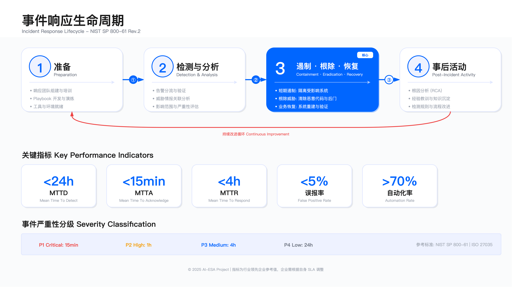
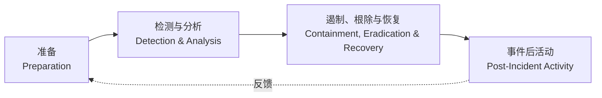

# 11.5　事件响应（IR）

事件响应是 SOC 的核心能力，也是安全投入能否转化为业务保障的关键节点。本节基于 NIST SP 800-61 标准，覆盖完整的事件响应生命周期、事件分级体系、Playbook 开发、SOAR 自动化响应、战时指挥室运作和事件后分析。



---

## 11.5.1 事件响应生命周期

### NIST SP 800-61 框架

NIST SP 800-61 Rev. 3 于 2025 年 4 月正式发布，取代了 2012 年 8 月的 Rev. 2[7]。这里需要说明版本差异：本节沿用的事件响应四阶段循环模型出自 Rev. 2，而 Rev. 3 已改为按 CSF 2.0 六大职能组织的社区参考剖面（Community Profile），不再重述阶段划分，两者可对照使用。该四阶段模型的价值不在于阶段划分本身——这些阶段本来就是自然发生的——而在于为每个阶段明确了输入、输出和验收标准，将混乱的应急处置转化为可操作、可衡量的工程流程。



循环中的反馈箭头是整个框架最重要的部分：每次事件都应改进下一次的准备能力。没有这个闭环，IR 永远停留在被动救火，而不会演进为主动防御。

### 阶段 1：准备（Preparation）

准备阶段的目标是在事件发生前建立响应能力。验收标准：响应团队已组建且角色清晰、响应流程已文档化且经过演练、工具和通信渠道已就绪。

准备不足会带来可预测的后果：团队在压力下临时协商分工（浪费时间）、工具因未提前配置而无法使用（延误响应）、沟通渠道未预设导致信息混乱（决策质量下降）。这些失效在演练中会暴露，在真实攻击中会放大。

核心建设内容：

1. 组建事件响应团队（CSIRT）——角色分工必须在事件发生前明确，不能在战时协商：
   - 事件响应指挥官（Incident Commander）：决策权、资源调配、对外沟通
   - 技术分析师（Technical Analyst）：日志分析、威胁识别、IOC 提取
   - 取证专家（Forensic Analyst）：证据保全、根因分析、攻击路径重建
   - 沟通协调员（Communications Coordinator）：内外部通知、状态更新、监管报告
   - 法务/合规代表：法律风险评估、监管通知判定、合规证据收集

2. 制定响应政策和流程——包括事件响应政策（触发条件、升级路径、审批权限）、事件分级标准、升级矩阵、沟通计划（内部员工/管理层、外部客户/监管/媒体）、法律合规要求（如 GDPR 72 小时通知）。

3. 准备工具和资源：
   - 事件响应工具包：取证工具（FTK、EnCase）、内存分析（Volatility）、网络抓包（Wireshark）
   - 隔离分析环境：恶意软件沙箱（Cuckoo、Any.run）
   - 通信渠道：专用 War Room（物理或虚拟）、加密通信工具（Signal、Wickr）
   - 针对常见威胁（勒索软件、数据泄露、DDoS）的标准化 Playbook
   - 联系人清单：内部团队（IT、业务、法务）、外部资源（执法机关、律师、保险公司）

4. 培训和演练：
   - 桌面演练（Tabletop Exercise）：每季度，模拟场景讨论，验证流程完整性
   - 实战演练（Full-Scale Exercise）：每半年，真实环境模拟，测量响应时间
   - 红蓝对抗：每年，模拟 APT 攻击，评估检测与响应能力

关键约束：

- 全职 CSIRT 需要持续投入（人员、工具、培训）。中小企业可考虑"核心团队 + 按需外部专家"的混合模式
- 跨时区协调：全球企业需考虑 24×7 覆盖，通常需要 3 个时区的团队或 Follow-the-Sun 模式（见 11.7.2）
- Playbook 有时效性：攻击手法持续演进，Playbook 需定期基于新威胁和事件经验更新

常见误区：

1. 认为"买了工具就能响应"——工具只是手段，未经演练的流程在压力下会失效
2. 只培训安全团队——业务部门（HR、PR、法务）的协同能力同样关键，尤其在重大事件中
3. Playbook 一次编写永久有效——需定期基于新威胁和事件经验更新

运行指标：演练频率（桌面演练 ≥4 次/年，实战演练 ≥2 次/年）、工具就绪率（月度检查，可用性 >95%）、联系人准确率（季度验证，更新及时性 >90%）

### 阶段 2：检测与分析（Detection & Analysis）

检测与分析阶段的目标是快速识别安全事件，完成初步分类和影响评估。挑战是在大量告警中筛选真实威胁，避免漏报和误报造成的两种截然相反的损失。

检测来源：SIEM/XDR 告警、IDS/IPS 告警、EDR/AV 告警、威胁情报 IOC 命中、用户报告（钓鱼邮件举报、账号异常）、第三方通知（安全厂商、执法机关、行业共享平台）

初步分析清单：

- 事件类型：恶意软件、钓鱼、数据泄露、账号入侵、内部威胁、DDoS（分类影响后续 Playbook 选择）
- 影响范围：受影响系统数量、用户数量、数据类型与敏感度
- 业务影响：服务中断时长、交易影响金额、客户影响规模、声誉影响评估
- IOC 提取：攻击者 IP、C2 域名、文件哈希、注册表键值、进程名称
- 时间线：首次告警时间、攻击可能开始时间、最后活动时间（估算攻击窗口）
- 攻击者 TTP：基于 MITRE ATT&CK 映射战术

关键约束：

- P1 事件需在 15 分钟内完成初步分析，延误会错过遏制窗口
- 分析过程中需避免破坏证据（如不直接登录受感染主机），影响后续取证

常见误区：

1. 所有告警都立即深入调查——应先基于分级标准判断优先级
2. 仅依赖自动化工具输出——零日攻击和正常行为误判需要人工审核关键决策点
3. 忽略时间线分析——攻击者可能潜伏数周，仅分析当前状态会遗漏初始入侵点

运行指标：MTTD（P1 目标 <15min）、分类准确率（目标 >90%）、误报率（目标 <10%）

### 阶段 3：遏制、根除与恢复

该阶段目标是阻止威胁扩散、彻底清除威胁、恢复正常运营。三个子步骤依次进行，每个步骤都有明确的验收条件才能进入下一步。

遏制（Containment）——快速阻止威胁扩散，降低损害：

短期遏制（立即行动）：隔离受感染主机（断网保留内存，以保存易失性证据）、封禁恶意 IP/域名（防火墙/DNS 黑洞）、禁用被入侵账户、必要时隔离网络段

长期遏制（为根除争取时间）：部署临时防护规则（WAF/IPS）、加强监控（提高日志级别）、部署蜜罐/诱饵监控攻击者行为、应用虚拟补丁（WAF/IPS 规则替代生产补丁，降低业务中断风险）

关键约束：过度遏制（隔离生产系统）会造成业务中断，需与业务部门沟通权衡。遏制操作前必须先采集易失性证据（内存 dump、网络连接状态），断网/关机会永久丢失这些证据。

根除（Eradication）——从环境中彻底清除威胁：

- 移除恶意软件和后门：EDR 清除、手动删除、镜像重建
- 删除未授权账户：清理影子账户、删除后门用户、撤销持久化机制
- 修复被利用的漏洞：应用补丁、配置加固、关闭不必要服务
- 重置被盗凭证：强制密码重置、撤销 API 密钥、重新颁发证书
- 重建受损系统：从干净镜像重建，而非依赖可能被篡改的备份

根除不彻底是二次感染的最常见原因。"我们清除了这台机器上的恶意软件"不等于"我们清除了所有入侵点"——攻击者通常会建立多个立足点。

恢复（Recovery）——恢复正常业务运营并确保系统安全：

- 验证系统干净：扫描检查、行为监控、日志分析，确认无残留威胁
- 逐步恢复服务：从非生产环境开始，逐步恢复生产系统
- 增强监控：恢复后 72 小时内保持高强度监控，及时发现复发（勒索场景下这个窗口应延长到 2 周以上，理由见 [16.5.7](../../第05部分_身份网络与业务连续性/第16章_业务连续性与灾难恢复/16.5_勒索软件端到端处置.md) 的恢复期再感染防线）
- 验证业务功能：功能测试、性能测试、数据完整性验证
- 通知相关方：业务部门、客户、监管机构

常见误区：

1. 快速遏制但根除不彻底——仅隔离受感染主机而未清除攻击者在其他系统的立足点
2. 过度依赖自动化工具清除——高级持久化机制可能需要人工验证
3. 恢复后立即解除监控——攻击者可能植入多个后门，需在恢复后保持警惕

运行指标：遏制时间（P1 目标 <2h）、恢复时间（P1 目标 <4h）、二次感染率（30 天内同一威胁重现，目标 <5%）

### 阶段 4：事件后活动（Post-Incident Activity）

事件后活动是生命周期闭环的关键。许多团队在事件解决后立即转向下一个告警，跳过复盘——这是在系统性地放弃从失败中学习的机会，同类事件会反复发生。

事件复盘（Post-Incident Review）

复盘应在事件关闭后 5-7 个工作日内进行。时间过长会导致记忆模糊，证据和决策细节丢失。复盘不是追责会议，是系统改进会议——如果因为担心被追责而隐瞒信息，复盘的价值会归零。

复盘内容：完整事件时间线（从初始入侵到完全恢复，标注关键决策点）、根因分析（漏洞/配置错误/社工？为什么未被阻止？）、响应评估（哪些环节顺利、哪些延误）、经验教训（新攻击手法、流程缺陷）、改进措施（检测规则/响应流程/工具能力/人员培训）。

改进措施必须明确责任人和截止日期，纳入跟踪系统。没有跟踪的改进措施等于未实施。

运行指标：复盘完成率（P1-P3 事件目标 100%）、改进措施执行率（复盘后 30 天内目标 >80%）、知识库更新率（事件分析报告归档比例目标 100%）

---

## 11.5.2 事件分级与优先级

### 事件分级标准

事件分级决定响应的紧急程度和资源投入。分级标准基于 NIST SP 800-61 和 ISO/IEC 27035[8]，应根据组织规模、业务特点、监管要求调整。

| 级别 | 严重程度 | 业务影响 | 响应时间 | 示例 |
|------|---------|---------|---------|------|
| P1 Critical | 严重 | 业务中断或重大数据泄露 | 15 分钟（MTTA） | 勒索软件爆发、核心系统被攻陷、大规模数据泄露 |
| P2 High | 高 | 显著影响或潜在严重后果 | 30 分钟（MTTA） | 重要系统被入侵、敏感数据暴露、APT 活动 |
| P3 Medium | 中 | 有限影响 | 2 小时（MTTA） | 单一主机感染、钓鱼邮件成功、权限滥用 |
| P4 Low | 低 | 最小或无影响 | 8 小时（MTTA） | 扫描活动、策略违规、可疑但未确认 |

这张表的价值不在于罗列了四个级别，而在于把"严重程度"这个主观词绑定到了可执行的响应时间上。最右两列构成一组硬对应：级别一旦判定，响应时间就是硬承诺，而非"尽快处理"。示例列的作用是给分析师一个锚点——面对一个陌生告警时，先问"它更像勒索软件爆发（P1）还是像单机感染（P3）"，用类比快速定级，而不是逐条比对抽象的严重程度定义。生产环境中最容易踩的坑是把这张表当成静态查表工具：同一类事件（如"钓鱼邮件成功"）在不同业务上下文中可能落在 P2 或 P3，表格给的是默认起点，最终定级仍要叠加下面的三维度判断。

分级依据三个维度：业务影响（服务中断时长、影响用户数、数据泄露规模、财务损失）、紧急程度（攻击扩散速度、数据外泄风险、监管报告要求）、技术复杂度（攻击手法复杂度、根除难度、恢复时间预估）。

关键约束：

- 分级争议时由 Incident Commander 裁决，不能在战时协商太久
- 事件可随调查深入而升级或降级，建立重新分级机制

常见误区：

1. 所有事件都定为 P1——过度升级导致资源浪费、团队疲劳，真正的紧急事件反而延误
2. 分级后不再调整——攻击范围扩大或发现更严重影响时应及时重新分级

### 响应时间指标（MTTD/MTTA/MTTR）

响应时间指标是衡量 IR 能力的核心量化工具。以下是指标的定义与示例计算。

事件响应时间线：

```
攻击发生 ─→ 告警触发 ─→ 分析师确认 ─→ 开始响应 ─→ 威胁遏制 ─→ 系统恢复
   T0         T1           T2            T3           T4          T5

   |<─ MTTD ─>|
              |<─ MTTA ─>|
                         |<─ MTTR (Respond) ─>|
                                              |<─ MTTR (Recover) ─>|
```

| 指标 | 全称 | 计算方式 | P1 目标 | P2 目标 | P3 目标 |
|------|------|---------|--------|--------|--------|
| MTTD | Mean Time To Detect | T1 - T0（攻击发生 → 告警触发） | <15min | <1h | <4h |
| MTTA | Mean Time To Acknowledge | T2 - T1（告警触发 → 分析师确认） | <15min | <30min | <2h |
| MTTR (Respond) | Mean Time To Respond | T4 - T3（开始响应 → 威胁遏制） | <2h | <4h | <24h |
| MTTR (Recover) | Mean Time To Recover | T5 - T4（威胁遏制 → 系统完全恢复） | <4h | <8h | <48h |

这套指标的设计意图是把一条时间线切成互不重叠的区段，每段追责给不同的能力短板。每个指标都对应上面时间线的两个端点：MTTD 衡量"检测覆盖是否到位"，MTTA 衡量"值班人力与响应意愿是否到位"，两个 MTTR 分别衡量"遏制手段是否就绪"和"恢复流程与备份是否可靠"。之所以把 Detect 和 Acknowledge 拆开，是因为它们对应完全不同的投入：MTTD 靠检测规则和数据源覆盖度改善，MTTA 靠排班和告警路由改善——混在一起就无法定位是"没发现"还是"发现了没人接"。表格按 P1/P2/P3 分列目标值，隐含的权衡是级别越低、容忍度越高，这样才能把有限的 7×24 人力集中在真正的高危事件上。

示例计算（P1 勒索软件事件）：

```
02:00  攻击者获得初始访问（T0）
02:12  EDR 触发异常加密告警（T1）→ MTTD = 12min ✓
02:18  SOC 分析师确认勒索软件（T2）→ MTTA = 6min ✓
02:20  启动应急响应（T3）
03:45  隔离受感染主机，停止加密（T4）→ MTTR (Respond) = 85min ✓
06:30  从备份恢复系统并验证（T5）→ MTTR (Recover) = 165min ✓
```

这段时间线示例把抽象指标落到了一次具体事件上，每个 ✓ 背后都是一次减法：MTTD 的 12 分钟是 T1 减 T0，但 T0（02:00 攻击者获得初始访问）在事件当时是无法知道的，只有事后取证才能倒推出来——这正是下面"MTTD 关键约束"要强调的点。相对地，MTTA 的 6 分钟是 T2 减 T1，两个端点都是系统内可精确记录的时间戳，所以它是四个指标里最可信、最实时的一个。与上面的目标值表相比，这个例子的每一步都卡在 P1 目标线之内，它示范的是一次"教科书级"的响应，用来对比真实事件中哪一段最容易超时。

MTTD 的关键约束：T0（攻击实际发生时间）通常只能在事后通过取证分析估算，实时 MTTD 依赖检测覆盖度。MTTA 受人员覆盖影响，7×24 覆盖需要多时区团队或夜班安排。

MTTR（Recover）的适用边界要单独说明，否则这一列最容易被误用。**表中的 P1 目标 <4h 适用于遏制后能靠重启、回滚、切流量收尾的单点事件，不适用于破坏性事件的业务恢复。**理由有三条：其一，恢复时限本身应当由业务影响分析逐流程标定，而**一份所有系统都填"4 小时"的 RTO 是 BIA 已经失效的信号**，五种谈出真实恢复目标的方法见 [16.2 业务影响分析与 RTO/RPO 标定](../../第05部分_身份网络与业务连续性/第16章_业务连续性与灾难恢复/16.2_业务影响分析与RTO_RPO标定.md)；其二，勒索类事件的恢复要先过恢复放行门（入侵向量已封堵、持久化已清点、还原点早于攻击者最早活动），这道门的判据见 [16.5.7](../../第05部分_身份网络与业务连续性/第16章_业务连续性与灾难恢复/16.5_勒索软件端到端处置.md)，它会让恢复的起点晚于遏制若干天；其三，本章 11.10 的勒索案例实际恢复耗时 78 小时、目标 72 小时，与 <4h 不在一个量级——**这两个数字不矛盾，因为它们量的不是同一件事**：一个是单点事件的服务恢复，一个是破坏性事件的业务恢复。报告里必须分开列，合成一个"MTTR"会同时掩盖两边的真实状态。

常见误区：只关注单一指标——仅优化 MTTA 而忽略 MTTD 会导致快速响应但发现太晚；仅优化 MTTD 而忽略 MTTR 会导致发现快但处置慢。四个指标需整体优化。

### 升级机制

升级机制确保事件在合适层级得到处理，避免一线分析师处理超出能力的事件，或高级分析师浪费在简单事件上。

升级触发条件：

- 级别触发：P1 自动升级至三线 + Incident Commander；P2 升级至二线
- 能力触发：当前层级无法处理（需取证、逆向、法律判断）
- 时间触发：超过 SLA 时限仍未解决，自动升级
- 影响扩大：事件影响范围扩大，超出初始分级

升级流程：一线分析师在工单系统标记升级原因 → 系统自动通知上级和 Incident Commander → 上级分析师 15 分钟内接手 → 一线协助提供上下文（决策权转移，协助责任保留）。

文化约束：一线分析师可能因担心被认为能力不足而延迟升级。需在团队文化中明确：及时升级是职责，而非失败。延迟升级才是风险。

运行指标：升级及时性（目标 <15 分钟）、升级准确性（升级后确认需要上级处理的比例，目标 >85%）

---

## 11.5.3 事件响应 Playbook

### Playbook 结构与设计原则

Playbook 是标准化的响应流程文档，定义了针对特定威胁的详细操作步骤。良好的 Playbook 应包括：触发条件、角色分工、操作步骤、决策点、沟通要求和验收标准。

一个关键的设计原则：Playbook 应该在分析师压力最大、时间最紧张的时候能够快速使用。这意味着步骤必须具体可操作（写"运行 `vol.py malfind -p <PID>`"，别写"分析威胁"），决策点必须有明确的判断标准（写"如果加密文件超过 100 个，则触发 P1"，别写"视情况而定"）。

以下是基于生产实践的勒索软件响应 Playbook 示例。之所以选用 YAML 而非散文式的操作手册，是因为 YAML 的结构化字段天然强制"每个动作都要写清由谁做、用什么工具"，散文很容易在时间紧张时被跳读或误解。同时，结构化的 Playbook 可以被 SOAR 平台直接解析执行（见下一小节），一份文档同时服务于人工执行和自动化编排两个用途。

这份 Playbook 的结构由三条主干撑起，比逐行的 action 更值得关注：一是顶层元数据（`playbook_id` 到 `severity`），它把这份文档和一个具体威胁类型、一个负责团队、一个严重级别绑定，保证战时不会拿错剧本；二是按时间窗口切分的四个 phase（`phase_1` 到 `phase_4`），每个 phase 头部的注释（如 `# 0-15 分钟`）给出了这一阶段的时间预算，让 Incident Commander 能据此管控节奏；三是嵌在最后的 `communication` 块，把"什么时候通知谁"直接写进剧本，避免临时翻查通知流程。

```yaml
playbook_id: PB-001
name: Ransomware Response Playbook
version: 2.0
last_updated: 2025-10-21
owner: IR Team

trigger:
  - Ransomware detection by EDR
  - Ransom note discovered
  - Mass file encryption detected (>100 files in 5 minutes)

severity: P1 - Critical

roles:
  - incident_commander    # 总协调，对外沟通
  - technical_analyst     # 日志分析，IOC 提取
  - forensic_analyst      # 证据保全，内存取证
  - communications_lead   # 内外部通知

phase_1_immediate_actions:  # 0-15 分钟
  - action: "触发 P1 应急响应，通知 Incident Commander"
    owner: soc_analyst
    tool: PagerDuty

  - action: "隔离受感染主机（断网，保留电源）"
    owner: soc_analyst
    tool: EDR Console
    critical_note: "断网前先截图/导出内存进程列表，断网后立即记录时间戳"

  - action: "封禁已知 C2 IP 和域名"
    owner: soc_analyst
    tool: Firewall/DNS

  - action: "保存受感染主机内存 dump"
    owner: forensic_analyst
    tool: "winpmem / DumpIt"
    command: "winpmem_mini.exe memdump.raw"

phase_2_investigation:  # 15-60 分钟
  - action: "识别加密范围（受影响主机/文件数量）"
    owner: technical_analyst
    query: |
      # Splunk
      index=endpoint EventID=4663 Object.Name="*.encrypted" OR Object.Name="*.locked"
      | stats count by host
      | sort count desc

  - action: "追踪横向移动路径"
    owner: technical_analyst
    query: |
      # 检查 RDP/SMB 横向移动
      index=winevent EventID=4624 Logon_Type=10
      | where src_ip != "127.0.0.1"
      | stats count by src_ip, dest_ip
      | sort count desc

  - action: "提取勒索软件 IOC（文件哈希、C2 域名、注册表项）"
    owner: forensic_analyst

phase_3_eradication:  # 60 分钟-4 小时
  - action: "重建受影响主机（不清洗，直接重建）"
    owner: it_team
    critical_note: "从已验证的干净镜像重建，不要尝试清除恶意软件后继续使用"

  - action: "重置所有受影响账号凭证"
    owner: iam_team
    scope: "域管理员、服务账号、受感染主机上曾登录的所有账号"

  - action: "修复初始入侵漏洞（如 VPN 漏洞、钓鱼邮件附件）"
    owner: security_team

phase_4_recovery:  # 4-24 小时
  - action: "从备份恢复数据（验证备份完整性和无感染）"
    owner: it_team
    pre_check: "备份系统是否隔离？备份是否在感染时间之前？"

  - action: "恢复后 72 小时加强监控"
    owner: soc_team
    alert_threshold: "降低所有相关规则的告警阈值 50%"

communication:
  internal:
    - notify: [CISO, CTO, Business_Heads]
      at: [T+15min, T+1h, T+4h, T+24h]
      template: "templates/ransomware_internal_notification.md"
  external:
    - notify: [Legal, PR, Regulatory_Affairs]
      trigger: "如发现 PII/金融数据可能泄露"
      template: "templates/ransomware_external_notification.md"
    - regulatory: "GDPR 72h 通知窗口计时从 T0 开始"
```

这个 Playbook 的几个设计要点值得注意：每个 Action 都有明确的 owner 和 tool，避免在战时协商由谁执行；`critical_note` 字段专门用于记录最容易犯错的决策点（如"断网前先取证"）；阶段时间窗口明确，方便 Incident Commander 管控节奏；沟通计划内嵌在 Playbook 中，不需要额外查找通知流程。

### Playbook 与 SOAR 的衔接

> 本节聚焦 Playbook 中哪些步骤适合交给 SOAR 自动化、哪些必须保留人工审批；完整的 SOAR 平台设计与多场景实现见 [11.5.6 SOAR 自动化响应](#1156-soar-自动化响应)。

SOAR 将 Playbook 中可自动化的步骤转化为代码执行，减少人工操作时间并降低操作错误。关键决策：哪些步骤适合自动化，哪些步骤必须保留人工审批。

可自动化的步骤：

- IOC 信誉查询（VirusTotal、AbuseIPDB、MicroFocus ThreatIntelligence）
- 威胁情报富化（GeoIP、WHOIS、Passive DNS）
- 工单创建与分配
- 一线告警自动分类（已知误报模式过滤）
- 低风险隔离（沙箱隔离可疑文件）

必须保留人工审批的步骤：

- 隔离生产服务器（可能导致业务中断）
- 封禁 IP 段（可能误伤合法用户，尤其是共享 IP/NAT 环境）
- 禁用用户账号（对员工有直接影响，错误操作不可忽视）
- 对外通知（监管/媒体）
- 大范围凭证重置

以下是一个典型的 SOAR Playbook 实现片段——钓鱼邮件自动化响应。选钓鱼作为示例，是因为它同时包含"可完全自动"和"必须人工"两类步骤，能完整展示 SOAR 的核心决策逻辑：不是把一切都自动化，而是用置信度作为分流阀门，让机器处理确定的部分、把不确定的部分结构化地交还给人。

这段代码的骨架是三个 `if/elif/else` 分支，真正的判据是分支所依据的 `confidence`，而非每个动作的实现细节。前两步（提取 IOC、并行查信誉）是无副作用的只读操作，所以放在分支之前无条件执行；真正有业务影响的动作全部收敛到分支里，按置信度高低对应"自动删除 / 人工审批 / 仅记录"三档处置。这种"只读富化在前、有副作用动作按置信度分档在后"的结构，是几乎所有 SOAR Playbook 的通用模式。

```python
# SOAR Playbook: 钓鱼邮件自动响应
# 执行于 SOAR 平台（如 Cortex XSOAR / Swimlane）

def phishing_response_playbook(alert):
    """
    流程：
    1. 自动收集邮件证据（低风险，无业务影响）
    2. 自动查询 IOC 信誉（只读操作）
    3. 高置信度时自动删除邮件（有影响但可逆）
    4. 封禁发件域名需人工审批（可能影响合法通信）
    """

    # 步骤 1：提取邮件 IOC
    email = get_email_details(alert['email_id'])
    iocs = extract_iocs(email)  # 提取 URL、域名、IP、哈希

    # 步骤 2：IOC 信誉查询（并行）
    # 这里使用并行查询节省时间，每个查询都是只读的，无需审批
    reputation_results = parallel_check_reputation(
        urls=iocs.get('urls', []),
        domains=iocs.get('domains', []),
        file_hashes=iocs.get('hashes', [])
    )

    # 步骤 3：根据置信度决策
    confidence = calculate_confidence(reputation_results)

    if confidence >= 0.9:
        # 高置信度：自动删除邮件（可逆操作，可自动执行）
        quarantine_emails(email['sender'], email['subject'])
        create_incident(alert, confidence, 'auto_quarantined')

    elif confidence >= 0.6:
        # 中置信度：触发人工审批
        # 关键：不直接行动，而是将决策权交给分析师
        human_review_task = create_review_task(
            email=email,
            reputation=reputation_results,
            confidence=confidence,
            options=['quarantine', 'dismiss', 'escalate'],
            timeout_minutes=30,  # 30 分钟未处理则升级
            escalation_handler='l2_analyst'
        )

    else:
        # 低置信度：记录并监控
        log_for_monitoring(email, iocs, confidence)
```

中置信度场景下的 `create_review_task` 设计值得关注：它创建的是一个有超时和升级机制的结构化任务，而非简单地"发通知给分析师"。30 分钟未处理会自动升级到二线，确保响应及时性不依赖于个人的工作状态。

SOAR 建设路径：

1. 基础阶段（0-3 月）：5-10 个核心 Playbook（钓鱼、IOC 富化、工单创建）
2. 扩展阶段（3-9 月）：扩展到 20-30 个 Playbook，覆盖主要威胁类型
3. 优化阶段（9-18 月）：提高自动化率，引入机器学习辅助决策
4. 成熟阶段（18+ 月）：全自动化低风险响应，人工专注高复杂度事件

运行指标：

| 指标 | 定义 | 目标 |
|------|------|------|
| 自动化率 | 自动执行步骤/总步骤 | ≥30%（成熟期 ≥60%） |
| Playbook 成功率 | 成功执行的 Playbook/总执行次数 | ≥95% |
| 平均自动化响应时间 | 从告警到 Playbook 完成的时间 | <5 分钟（低风险场景） |

这三个指标各自防范一种 SOAR 建设的失败模式。自动化率防的是"买了平台却仍在手工操作"，但它也不宜盲目求高——把"全自动化率 100%"当目标，会诱使团队把本该人工审批的高风险动作也自动化，反而埋雷，所以目标值刻意分了成熟期档位而非一味攀高。Playbook 成功率防的是"自动化跑起来了但经常出错"，95% 这个高门槛意味着一旦某个 Playbook 频繁失败，就该下线人工接管而非放任它半自动地制造脏数据。平均自动化响应时间则专门限定在"低风险场景"，因为把高风险的人工审批耗时也算进来会污染这个指标——它衡量的是机器该快的地方有没有快起来。

---

## 11.5.4 数字取证与证据保全

数字取证是 IR 调查的技术支撑，其质量直接影响根因分析准确性和法律诉讼可用性。

### 证据保全原则

优先级原则：按证据的易失性从高到低依次采集——内存（最易失，断电即消失）> 网络连接状态 > 进程列表 > 临时文件 > 磁盘数据 > 日志文件。

这个顺序反映了实际操作约束：隔离受感染主机时必须先采集内存，断网操作会清除活跃的网络连接信息，关机会清除内存中的加密密钥（对勒索软件取证尤为关键）。

证据链保管：每件证据需记录采集时间、采集人、工具版本、哈希值（MD5 + SHA256），确保证据完整性可验证。

### 内存取证

内存取证能发现磁盘取证无法发现的证据：进程注入代码（存在内存但未写磁盘）、解密后的勒索软件密钥、内存中的凭证（Mimikatz 抓取后的明文密码）、无文件攻击（Fileless Malware）的执行状态。这也解释了为什么它排在证据采集顺序的最前面——这些证据只存在于运行中的内存里，任何一次关机或断电都会把它们连同攻击者的密钥一起清零。

下面这组命令按"先采集、后分析"的两段式组织，其价值不在每个 Volatility 插件的参数，而在它们各自回答的取证问题。

```bash
# 采集内存 dump
# Windows
winpmem_mini.exe memdump.raw
# 记录哈希值（证据链）
certutil -hashfile memdump.raw SHA256 > memdump.raw.sha256

# 分析内存 dump（Volatility 3；Volatility 2 已停维、不支持 Python 3）
# Volatility 3 自动识别操作系统结构，无需手动指定 Profile
# 列出所有进程（包括隐藏进程）
python vol.py -f memdump.raw windows.pslist
python vol.py -f memdump.raw windows.pstree

# 检测代码注入（发现 Shellcode、反射 DLL 注入）
python vol.py -f memdump.raw windows.malfind

# 提取网络连接（断网前的网络状态）
python vol.py -f memdump.raw windows.netscan

# 提取进程注入的可疑内存段并保存为文件供分析
python vol.py -f memdump.raw -o ./dump/ windows.dumpfiles --physaddr <物理地址>
```

Volatility 3 相较于 Volatility 2 的关键变化是取消了手动 Profile 机制：它通过符号表自动识别内存中的操作系统结构，省去了 Volatility 2 中"`imageinfo` 选错 Profile 导致后续分析全盘错乱"这道最常见的第一道坎。插件命名也改为按操作系统分层（如 `windows.pslist`）。选定内存镜像后，`pslist`/`pstree` 回答"有哪些进程、进程间的父子关系是否异常"，`netscan` 回答"断网前它连了哪些外部地址"（这条尤其关键，因为断网操作本身会抹掉这些连接），`malfind` 回答"哪段内存像被注入了代码"，最后 `dumpfiles` 把可疑内存段落地成文件供逆向。

`malfind` 插件的工作原理是扫描内存中的可执行区域，识别具有 `PAGE_EXECUTE_READ_WRITE` 属性但没有对应磁盘文件的内存段——这是代码注入的典型特征。结果需要人工确认，因为某些 JIT 编译器（如 .NET、V8）也会产生类似特征。换句话说，`malfind` 给的是"值得怀疑的候选"，不是"确诊的恶意代码"；生产环境中若把它的每一条输出都当成攻击证据，会在跑着大量托管代码的服务器上淹没在误报里。

### 磁盘取证

磁盘取证与内存取证是互补而非替代关系：内存抓的是"此刻正在发生什么"，磁盘抓的是"曾经落地过什么"，包括攻击者试图删除的工具和日志。它排在采集顺序靠后，是因为磁盘数据在断电后仍然保留，不像内存那样一断即失。

下面这组命令贯穿一条铁律——先做完整镜像，再在镜像上分析，绝不动原盘。每一步都配了一次哈希或只读标志，这不是形式主义，而是维系证据法律效力的必要动作。

```bash
# 创建磁盘镜像（保留原始证据）
# dd 方式（Linux/Mac）
dd if=/dev/sda of=disk.img bs=4M status=progress
# 验证完整性
md5sum disk.img > disk.img.md5

# FTK Imager（Windows，推荐用于生产环境——速度更快，支持进度显示）
ftkimager.exe \\.\PhysicalDrive0 ./evidence/disk

# 挂载镜像进行分析（只读挂载，不修改原始证据）
mount -o ro,loop disk.img /mnt/evidence

# 恢复已删除文件（攻击者通常会删除工具和日志）
foremost -i disk.img -o ./recovered_files/
```

磁盘取证的关键约束：必须以只读模式操作（`-o ro`），任何对挂载文件系统的写操作都会改变元数据（如访问时间 atime），破坏证据的法律效力。

### 日志分析

内存和磁盘取证解决的是"单台主机上发生了什么"，而攻击往往横跨多个系统、留在互不相通的日志里（终端有 Sysmon、边界有代理、身份侧有认证日志）。日志分析这一步的核心任务是把这些散落的碎片按时间轴拼成一条完整攻击路径。

下面这个 `ForensicTimeline` 类刻意做得很小，只有三个方法，因为它要解决的是"如何以可追溯的方式记录分析结论"，不是"如何分析"。其要害在 `add_event` 里的字段设计：`source` 标明证据来自哪个日志系统，`event_type` 归一化了不同来源的事件语义，而 `artifact` 保留原始日志条目——这个字段是整个类存在的理由。`get_timeline` 只是排序加时间过滤，`export_report` 只是落盘共享，真正的取证价值集中在"每条重建出来的时间线事件都能反向指回它的原始证据"。

```python
# 攻击时间线重建
# 目标：从多个数据源提取相关事件，按时间排序，重建完整攻击路径

import json
from datetime import datetime

class ForensicTimeline:
    def __init__(self):
        self.events = []

    def add_event(self, timestamp, source, event_type, description, artifact):
        """artifact 字段存储原始数据，用于证据链追溯"""
        self.events.append({
            'timestamp': timestamp,
            'source': source,        # sysmon / security_log / dns / proxy
            'event_type': event_type, # process_create / network_connect / auth_logon
            'description': description,
            'artifact': artifact      # 原始日志条目，完整保留
        })

    def get_timeline(self, start_time=None, end_time=None):
        """按时间排序，可按时间范围过滤"""
        filtered = [
            e for e in self.events
            if (start_time is None or e['timestamp'] >= start_time) and
               (end_time is None or e['timestamp'] <= end_time)
        ]
        return sorted(filtered, key=lambda x: x['timestamp'])

    def export_report(self, filename):
        """导出 JSON 格式供 IR 团队共享"""
        with open(filename, 'w') as f:
            json.dump(self.get_timeline(), f, indent=2, default=str)
```

`artifact` 字段的存在是为了保留证据链：时间线是人工重建的，但每个事件的判断依据都可以追溯到原始日志条目。在法律诉讼或监管调查中，这个追溯链是证据可信度的基础。

关键约束：

- 证据保全必须在隔离操作前完成，顺序不能颠倒
- 所有工具需使用预编译的只读版本（勿从受感染系统运行），避免污染证据
- 取证报告必须区分"观察到的事实"和"分析推断"，避免混淆
- 涉及法律诉讼时，所有操作需记录见证人（双人操作原则）

---

## 11.5.5 沟通与上报

### 内部沟通

P1 事件的内部沟通需要在正确的时间向正确的人传递正确的信息。过度通知（向所有人发送技术细节）会引起混乱；通知不足（只通知技术团队）会在后期引发管理层对未被告知的不满。

建议的 P1 通知矩阵：

| 时间节点 | 通知对象 | 内容深度 |
|---------|---------|---------|
| T+15min | CISO、IT 负责人 | 初步确认：事件类型、初步范围、已采取措施 |
| T+1h | CTO、CEO（视事件严重程度） | 业务影响评估、最坏情况与下一个判定节点 |
| T+4h | 相关业务负责人 | 具体影响范围、用户通知计划 |
| T+24h | 全体相关方 | 完整事件报告（攻击路径、影响、修复措施） |

这张矩阵的设计逻辑是让通知对象和内容深度随时间同步升级：越早的时间点、通知面越窄、内容越"初步"，随着事件推进才逐层扩大受众、加深细节。左列时间与右列内容深度的对应关系里藏着一条隐含原则——早期宁可信息少而准，也不要为了"透明"就把未经证实的技术细节推给高管。T+15min 只给 CISO 和 IT 负责人"初步确认"，正是为了避免在事件全貌未明时就惊动 CEO 或业务线，造成过度反应。

T+1h 那一格给的是**最坏情况与下一个判定节点，不是一个点值的恢复时间**。在遏制尚未完成、影响范围尚未界定时给出"预计 X 小时恢复"，这个数字必然被打脸，而它一旦被复述到客服话术、客户邮件或对外声明里，后续所有沟通的可信度都会一起受损。[16.9](../../第05部分_身份网络与业务连续性/第16章_业务连续性与灾难恢复/16.9_实战案例.md) 记录的一次事件里，客服在公开声明后的 6 小时里给出的几个恢复时间承诺被客户截图，最终成为索赔谈判中对方最常引用的三类材料之一。相应地，[16.6.2](../../第05部分_身份网络与业务连续性/第16章_业务连续性与灾难恢复/16.6_危机管理与战时指挥.md) 的高管行为规范里有一条是"不要求给我一个准确的恢复时间"，正确的问法是"最坏情况是什么"——把这条规范提前让高管本人在演练中读一遍，比事件当天由 CISO 当面拒绝要容易得多。

### 外部报告

监管报告时限是合规硬约束，事件确认后应同时启动多个计时器。以下为常被触发的几条（**具体适用性与时限须由法务按本组织的业务地域与行业逐条确认**）：

- GDPR：72 小时内向监管机构报告（如发现欧盟居民 PII 泄露）
- 中国境内网络安全事件与关基相关事件：按事件分级与相关规定向主管部门、公安机关报告
- 涉及个人信息的泄露：按相关法规向监管与受影响个人告知
- PCI DSS：立即（发现后即报）向收单机构报告
- **合同约定的客户通知**：按合同，常短于监管时限
- **保险报案**：按保单，通常极短，且多数保单要求使用保险人认可的供应商名单

后两条经常被漏掉，因为它们不在合规团队的常规清单里，而它们恰恰是最容易失权的两条：先自己找了取证或谈判供应商再报保险，这部分费用可能不被认可。事件当天必须有人专门跑一遍合同库与保单。

起算点比时限更容易出错：有的从"知悉"起算，有的从"判定为重大"起算，两者可能相差数天。"知悉"与"判定"的认定都是法律问题，需提前与法务确定本组织的判定流程与留痕方式——**"我们何时判定这是一起重大事件"这个时间点会在事后被监管反复追问**，判定过程必须记录谁在何时基于什么信息作出。含起算点列与具名负责人的完整报告矩阵（覆盖 NIS2 的 24 小时预警 / 72 小时通知 / 1 个月最终报告、DORA 的判定后 4 小时、合同与保险时钟）见 [16.5.10](../../第05部分_身份网络与业务连续性/第16章_业务连续性与灾难恢复/16.5_勒索软件端到端处置.md)，多份报告的口径统一出口见 [16.6.5](../../第05部分_身份网络与业务连续性/第16章_业务连续性与灾难恢复/16.6_危机管理与战时指挥.md)。

---

## 11.5.6 SOAR 自动化响应

> Playbook 中自动化与人工审批的分工原则见 [11.5.3 节"Playbook 与 SOAR 的衔接"](#playbook-与-soar-的衔接)；本节聚焦 SOAR 平台的完整场景实现。

SOAR（Security Orchestration, Automation and Response）通过自动化编排减少人工干预，提升响应速度和一致性。

> *关于 AI 如何增强 SOAR 的 Playbook 生成、决策建议与自动化编排能力，详见 [第17章.3 AI for SecOps](../../第06部分_AI驱动的安全创新/第17章_AI驱动网络安全/17.3_AIforSecOps_AI安全运营.md)。*

### 典型自动化响应场景

场景 1：恶意软件响应

适用于高置信度的恶意软件检测（如已知文件哈希匹配）。对于未知威胁，应加入人工审批点。这个"适用边界"是读懂下面代码的前提：整段 Playbook 之所以敢一路自动隔离、终止、扫描而不设审批，正是因为它把自己限定在"威胁情报明确判恶"的分支里；一旦离开这个前提，同样的自动化就会变成误伤。

这段代码的枢纽是 `if ti_result.is_malicious` 这一个判断——它是自动化与人工的分水岭。判恶成立时，后续五步（隔离、终止进程、隔离文件、全盘扫描、开单通知）是一条无人工干预的处置流水线，按"先止血、再清理、后记录"的顺序排列；判恶不成立时直接返回 `requires_analyst_review`，把决策权交回给人，绝不擅自行动。

```python
@playbook(trigger="malware_detected")
def malware_response_playbook(alert):
    # Step 1: 富化上下文
    endpoint = get_endpoint_details(alert.hostname)
    ti_result = query_threat_intelligence(alert.file_hash)

    if ti_result.is_malicious:
        # Step 2: 隔离终端
        isolate_endpoint(alert.hostname)
        # Step 3: 终止进程、隔离文件
        terminate_process(alert.hostname, alert.process_id)
        quarantine_file(alert.hostname, alert.file_path)
        # Step 4: 全盘扫描
        full_scan_endpoint(alert.hostname)
        # Step 5: 创建工单并通知
        incident = create_incident_ticket({
            'title': f'Malware on {alert.hostname}',
            'severity': 'high',
            'details': {'file_hash': alert.file_hash, 'ti_verdict': ti_result.verdict}
        })
        notify_soc_team(incident)
        return {'status': 'automated_response_complete', 'incident_id': incident.id}
    else:
        return {'status': 'requires_analyst_review'}
```

场景 2：账户入侵响应

账户入侵与恶意软件的处置逻辑不同：恶意软件针对的是一台主机，账户入侵针对的是一个身份，而一个身份可能横跨多个系统和会话。所以这个 Playbook 的重点从"隔离设备"转向"切断这个身份的一切活动通道"。

这段代码的动作分成两组。第一组是切断当前访问——禁用账户、撤销所有会话、重置密码、吊销 OAuth Token，四个动作缺一不可，因为只改密码不撤会话，攻击者已建立的会话仍然有效。注意 `if not alert.indicators.password_spray` 这个条件：喷洒攻击往往波及大量账户，无差别强制重置反而会制造运营灾难，所以此处对是否触发密码重置做了区分。第二组是 `hunt_lateral_movement`——账户一旦失陷，真正的问题在于攻击者是否已借它跳板到别处，而不在这个账户本身，所以处置之外必须补一次横向移动狩猎。

```python
@playbook(trigger="account_compromise")
def account_compromise_playbook(alert):
    user = alert.user_principal_name
    # 禁用账户、撤销会话、重置密码、吊销 OAuth Token
    disable_user_account(user)
    revoke_all_sessions(user)
    if not alert.indicators.password_spray:
        force_password_reset(user)
    revoke_oauth_tokens(user)
    # 横向移动狩猎
    hunt_result = hunt_lateral_movement(user, timerange='7d')
    # 通知用户和管理员
    notify_user_and_manager(user, alert)
    return create_incident_ticket({'title': f'Account compromise: {user}', 'severity': 'high',
                                   'actions_taken': {'hunting_results': hunt_result}})
```

### 自动化决策边界

| 自动化程度 | 适用场景 | 示例 |
|-----------|---------|------|
| 全自动 | 低风险、高确定性、可逆操作 | IOC 查询、账号禁用、网络隔离（已知威胁） |
| 半自动 | 中等风险，需人工审批 | 生产系统隔离、防火墙规则变更 |
| 人工处理 | 高风险、法律敏感、未知场景 | 支付赎金、数据销毁、监管报告 |

这张表是前面两个 Python 场景背后的通用分类框架，其划线依据不是"技术上能不能自动化"，而是三个属性的组合：风险高低、确定性高低、操作是否可逆。全自动那一档要同时满足"低风险 + 高确定性 + 可逆"，缺一不可——这正是场景 1 敢在判恶后一路自动处置、场景 2 敢自动禁用账户的理由（这些动作出错也能回滚）。而"支付赎金""监管报告"落入人工处理档，原因在于它们不可逆或涉及法律判断，与技术做不做得到无关，这类决策自动化的代价远高于收益。中间的半自动档则是给"风险不算低但也不至于致命"的操作留的缓冲带，用一次人工点击换取风险兜底。

关键约束：误操作风险（自动化隔离可能误伤正常系统）、合规要求（某些操作不能完全自动化）、工具可靠性（需降级到人工流程的预案）。

### SOAR 实施指标

| 指标 | 定义 | 目标 |
|------|------|------|
| 自动化率 | 自动化处置事件 / 总事件 | >40% |
| 时间节省 | (人工耗时 - 自动化耗时) × 事件数 | >1000 小时/年 |
| MTTR 改善 | 自动化后 vs 自动化前 | -50% |
| Playbook 成功率 | 成功执行 / 总执行 | >95% |

---

## 11.5.7 战时指挥室（War Room）

### 触发条件

War Room 是应对重大安全事件的**战术层**协调机制，对应 [16.6.2 危机组织与决策权限](../../第05部分_身份网络与业务连续性/第16章_业务连续性与灾难恢复/16.6_危机管理与战时指挥.md) 三层结构里的中间那一层：由事件指挥官召集，推进技术处置、恢复与取证。触发条件：P1 级别事件（业务中断或重大数据泄露）、跨区域/跨业务影响、需要多个团队同时在场才能推进的处置。

它与**危机管理团队（CMT）的激活**是两件事，阈值也不同。**P1 本身并不构成危机激活的理由**——监管报告义务、媒体与公众关注、赎金与停止业务这类企业级决策、以及持续时间跨过一个工作日，属于危机升级判据，且判据的设计是"满足任意两条才激活"而非"任一条即激活"，理由（含降级判据）见 [16.6.1 什么时候从"事件"升级为"危机"](../../第05部分_身份网络与业务连续性/第16章_业务连续性与灾难恢复/16.6_危机管理与战时指挥.md)。本节按那套判据执行，不在这里另立一套时长阈值。

关键约束：War Room 需要多团队同时投入，激活成本高，不应滥用；频繁激活会导致团队疲劳，应严格控制触发条件。

### War Room 组织

核心团队：
- 事件指挥官（Incident Commander）：统一指挥、最终决策、资源调配
- 技术负责人（Technical Lead）：技术调查和修复，协调 SOC/IT/开发
- 沟通协调员（Communications Lead）：高管简报、客户通知、监管报告
- 记录员（Scribe）：记录所有决策和行动，维护事件时间线

支持团队：IT/工程、安全分析师、法务/合规、PR/公共事务、业务代表、高管（必要时）。

### War Room 运作

沟通节奏：
- 每 30 分钟内部状态更新（Incident Commander 汇总进展）
- 每 2 小时高管简报（使用统一模板）
- 关键决策实时沟通（重大决策立即通知高管并获批准）

决策机制：Incident Commander 拥有战术层的最终决策权，所有决策记录并解释原因。这里有一条必须写清楚的例外：**遏制类动作不走"重大决策报高管批准"这条路。**隔离主机、隔离网段、切断站点互联应当事前分级预授权到 SOC 值班与 IC，事中只做通知、不等回复；升到 CISO 或 CEO 的只有切断互联网出口、全网断开、停止某项业务、支付赎金这几类。分级预授权表（R1–R5 与各级的事后报备时限）见 [16.5.5 遏制与断网决策](../../第05部分_身份网络与业务连续性/第16章_业务连续性与灾难恢复/16.5_勒索软件端到端处置.md)，覆盖全部危机决策（含应急预算限额）的权限矩阵见 [16.6.2](../../第05部分_身份网络与业务连续性/第16章_业务连续性与灾难恢复/16.6_危机管理与战时指挥.md)。

把遏制动作压在高管审批后面的代价是可量化的：[16.9 实战案例](../../第05部分_身份网络与业务连续性/第16章_业务连续性与灾难恢复/16.9_实战案例.md) 中的组织，预案里写的正是"重大决策需管理层批准"，但没有定义"重大"，也没有定义"管理层"是谁——加密进行中断网决策僵持了 2 小时 40 分，其中 40 分钟花在给出差在外的 CIO 打电话上；补齐分级与预授权后，同一决策在复演中降到 12 分钟。**"重大"与"管理层"这两个词如果不在事前展开成表，事中就会被逐字重新讨论一遍。**

### 状态报告模板

用固定模板发状态报告，是为了在高压、信息碎片化的战时保证每次沟通都覆盖高管真正关心的几个问题，而不是让 Incident Commander 每半小时临时组织语言。模板本身就是一种降负荷手段——填空比作文快，也不易漏项。

这份模板的关键在它的信息排序：`Executive Summary` 放在最前，一句话讲清"什么事、影响谁、现在什么阶段"，让高管三秒内抓住全局；接着 `Current Status` 给量化现状，`Actions Taken` 给"上次报告以来做了什么"（注意是增量，不是从头复述），`Next Steps` 给未来两小时计划，最后 `Estimated Resolution` 给各阶段预估时间。这个顺序对应高管的决策链路：先判严重程度，再看进展是否可控，最后据恢复时间决定要不要对外发声。

```markdown
## Incident Status Report
**Time**: 2025-10-21 14:30 UTC | **Report #**: 5 | **Incident ID**: INC-20251021-001

### Executive Summary
Ransomware incident affecting 50 servers in APAC region.
Services impacted: Customer portal (partial outage). Status: Containment in progress.

### Current Status
- **Affected Systems**: 50 servers (10 critical, 40 non-critical)
- **Services Impact**: Customer portal 30% capacity
- **Data at Risk**: No evidence of data exfiltration yet

### Actions Taken (since last report)
1. Isolated all 50 affected servers
2. Blocked C2 domains at firewall
3. Disabled 3 compromised accounts

### Next Steps (next 2 hours)
1. Complete forensic analysis
2. Begin restoration from backup

### Estimated Resolution
- Containment: Complete | Eradication: ETA 4h | Recovery: ETA 8h
```

报告关键约束：定时发布（即使无进展也要更新）、预估时间保守（避免多次延期）、用业务语言描述（高管不关注技术细节）。

---

## 11.5.8 事件后分析（Post-Incident Review）

### 复盘会议

目标是系统性学习，而非追究个人责任。事件关闭后 5-7 天内进行。

议程（2 小时）：
1. 事件回顾（30 分钟）：完整时间线、攻击路径、影响评估
2. 响应评估（30 分钟）：亮点、改进点、SLA 对比
3. 根因分析（30 分钟）：如何发生、为何未被阻止、系统性问题
4. 改进措施（30 分钟）：技术/流程/人员改进，分配责任人和截止日期

关键原则：无责文化（no blame）——复盘应聚焦流程和系统改进，追责会导致信息隐藏。

### 事件报告模板

事件报告与上面的战时状态报告用途相反：状态报告服务于"事件进行中的实时决策"，而这份报告服务于"事件结束后的系统性学习和存档"，所以它的结构不再追求速读，而追求可追溯和可问责。

这份模板由三个由浅入深的段落构成：`Incident Timeline` 用带时间戳的表格还原"发生了什么、何时发生"，是后续一切分析的事实基座；`Root Cause Analysis` 从时间线里提炼"为什么会发生"，示例中"初始入侵→横向移动→权限提升"三段正是把攻击链拆解到每一环的具体成因；最关键的是 `Corrective Actions`——它用带 `Owner` 和 `Due Date` 的表格把教训转成可跟踪的行动项。这张表回应了前文反复强调的原则：没有责任人和截止日期的改进措施等于没做，模板用结构强制补齐这两列。

```markdown
# Post-Incident Report: INC-20251021-001

## Executive Summary
2025-10-21 检测到勒索软件事件，影响 APAC 50 台服务器，22:00 UTC 完全恢复。

## Incident Timeline
| Time (UTC)      | Event                                           |
|-----------------|-------------------------------------------------|
| 10:15           | 初始 EDR 告警：可疑加密活动                      |
| 10:20           | 宣布事件，启动 War Room                          |
| 10:30           | 50 台服务器隔离                                  |
| 22:00           | 服务完全恢复                                     |

## Root Cause Analysis
- 初始入侵：钓鱼邮件 → 用户执行恶意宏
- 横向移动：利用未修复的 SMB 漏洞（已知 30 天）
- 权限提升：特权账户无 MFA

## Corrective Actions
| # | Action                      | Owner      | Due Date   | Status      |
|---|-----------------------------|------------|------------|-------------|
| 1 | 部署高级邮件安全（DMARC+沙箱）| Email Team | 2025-11-01 | In Progress |
| 2 | 强制特权账户 MFA             | IAM Team   | 2025-10-25 | In Progress |
| 3 | 加速补丁管理（Critical: 7天）  | Patch Team | 2025-11-15 | In Progress |
```

运行指标：复盘完成率（P1-P3 事件目标 100%）、改进措施执行率（30 天内目标 >80%）、报告完成时效（事件关闭后 <14 天）。

---

## 11.5.9 勒索软件专项响应

### 现代勒索软件威胁演进

| 代际 | 时间 | 模式 | 代表家族 |
|------|------|------|----------|
| 1.0 | 2013-2016 | 单一加密 | CryptoLocker, TeslaCrypt |
| 2.0 | 2017-2019 | 定向攻击 | SamSam, Ryuk |
| 3.0 | 2020-2022 | 双重勒索（加密+数据窃取） | Maze, REvil, Conti |
| 4.0 | 2023-2025 | 多重勒索，RaaS 成熟化 | BlackCat, LockBit 3.0, Akira |

这张代际表的关键不在家族名字，而在"模式"列的演变逻辑，它直接决定了防御和响应重心该放在哪。1.0 时代只加密文件，所以"有备份就能恢复"几乎是万灵药；到了 3.0 引入"加密+数据窃取"的双重勒索，备份就不再是护身符——即便数据能恢复，攻击者手里的副本仍可用来威胁公开，这也是为什么后面的赎金决策框架要单独考量"数据是否已外泄"。理解了这条演进线，才能明白下一小节的备份规则为什么必要但不充分。

### 赎金支付决策框架

**先明确决策权**：赎金决策不属于安全团队，它是涉及法律、财务、保险与声誉的企业级决策，决定权在 CEO 或董事会（见 [16.6.2](../../第05部分_身份网络与业务连续性/第16章_业务连续性与灾难恢复/16.6_危机管理与战时指挥.md) 的权限矩阵）。安全团队的产出是事实基础，而不是建议。

| 因素 | 支持支付 | 反对支付 |
|------|----------|----------|
| 法律合规 | 所在司法管辖区允许 | OFAC 制裁名单（关键约束） |
| 数据关键性 | 不可替代、业务存亡相关 | 可从备份恢复 |
| 备份可用性 | 无完整备份 | 存在早于攻击者最早活动的副本，且已验证可恢复 |
| 外泄范围 | 未发生外泄，只需解密 | 已外泄，付款买不到可验证的删除 |

这张决策表的意义在于把一个极易被情绪和时间压力扭曲的决定，拆成四个可以冷静逐条评估的因素。其中"法律合规"这一行分量最重——它是一票否决项：无论数据多关键、备份多缺失，只要收款方落在 OFAC 制裁名单上，支付本身就可能违法，其他三行的权衡都无从谈起。其余三行回答同一个现实问题："不付，我能不能自救？"

有一个因素**刻意没有进这张表：攻击者的"信誉"**。用"这个团伙历史上兑现过解密承诺"来支持支付，在 RaaS 生态下不成立——品牌会因执法打击与内部纠纷重组，同一招牌下的会员能力参差，收钱后卷款关站的"退出骗局"也已多次发生（机理见 [16.5.1](../../第05部分_身份网络与业务连续性/第16章_业务连续性与灾难恢复/16.5_勒索软件端到端处置.md)）。把它写进决策表，等于给一个无法核实的变量赋予了权重。

关键约束：支付赎金不保证获得有效解密密钥；支付给 OFAC 制裁实体可能违法，需事先法律审查。还有一条常被管理层的直觉带偏：**支付买到的主要不是恢复速度。**攻击者的解密器需要实测速度、完整性与批量下发能力，多数情况下从备份恢复反而更快更可控——这一判断连同不支付的八条前提条件清单、制裁筛查、保险联动与决策记录结构，见 [16.5.8 赎金决策框架](../../第05部分_身份网络与业务连续性/第16章_业务连续性与灾难恢复/16.5_勒索软件端到端处置.md)。

### 备份防护：3-2-1-1-0 规则

传统备份规则是 3-2-1，勒索软件时代额外加了后两位"1"和"0"，正是针对上面代际表揭示的新威胁：现代勒索团伙会主动搜寻并加密联网的备份，所以光有异地副本还不够。这条规则里每个数字各防一种失效——"3 份副本"防单点损坏，"2 种介质"防某类介质的系统性故障，"1 份异地"防机房级灾难，而新增的"1 份离线/Air-Gapped"专门防勒索软件横向加密（离线副本它够不着），"0 个错误"则防最隐蔽的失败：备份一直在跑，真要恢复时才发现根本恢复不了。

```
3 份数据副本 → 2 种存储介质 → 1 份异地存储 → 1 份离线/Air-Gapped → 0 个错误（定期验证）
```

后面这组安全控制正是对规则中"1（离线）"和"0（零错误）"的落地展开——它们解释了为什么备份系统本身必须被当成高价值资产来保护，而不是设完就不管的后台任务。

备份安全控制：
- 备份账户独立于 AD/IAM，MFA 强制
- 备份网络隔离，仅允许单向数据流
- 使用不可变存储（WORM 策略），保留期内无法删除/修改
- 备份可恢复性按级别分频验证，而非笼统的"定期恢复测试"

最后一条需要展开。"每周做一次恢复测试"这种说法把五件深浅不同的事压成了一件：校验和完整、能被解析、能启动、应用能跑通只读业务查询、业务人员能端到端走完流程，它们的成本相差两个数量级，频率也不该相同。[16.3.7](../../第05部分_身份网络与业务连续性/第16章_业务连续性与灾难恢复/16.3_备份与恢复体系工程.md) 用 V1–V5 标记验证深度并给出对应节奏：V1 每次备份后、V2 每日抽样、V3 每周至每月抽样、V4 对 Tier 1 每季度、V5 对 Tier 0 每半年，且**验证必须轮换源副本**——从在线主副本恢复成功，不能证明事件当天唯一还能用的不可变副本可用。大量恢复失败正落在 V3 与 V4 之间：数据库进程起来了，业务查询返回空结果。

运行指标本节只留一条：**关键系统的备份覆盖率，分母取自资产清单而不是备份任务清单。**"备份成功率 >99%"与"恢复测试通过率"不建议进入 SOC 或韧性报告——没配置备份任务的系统永远不会拉低成功率，把备份目标改写到无锁定位置的攻击也不会让任何任务失败，而一个长期停在 99.9% 以上的指标不再携带决策信息。替代它们的验证层与结果层指标（距上次成功恢复天数、实测恢复时长 RTA、验证级别分布）见 [16.8.1](../../第05部分_身份网络与业务连续性/第16章_业务连续性与灾难恢复/16.8_韧性度量.md) 与 [16.8.2](../../第05部分_身份网络与业务连续性/第16章_业务连续性与灾难恢复/16.8_韧性度量.md)。

---

## 11.5.10 云环境事件响应（Cloud IR）

### 云 IR 核心挑战

| 维度 | 传统环境 | 云环境 |
|------|----------|--------|
| 资产可见性 | 固定资产清单，变化慢 | 动态资源，秒级变化 |
| 证据采集 | 物理访问，完整控制 | API 访问，依赖云商 |
| 网络隔离 | 物理/VLAN 隔离 | 安全组/NACL/VPC 隔离 |
| 时效性 | 证据持久化 | 资源可能被自动销毁 |

这张对比表的作用是打破一个常见误区：以为云上做 IR 只是把本地那套搬到云上。逐行对照下，云环境几乎在每个维度都改变了取证的物理前提。最要害的是"证据采集"和"时效性"两行——传统环境可以拔硬盘、做镜像，完整掌控证据；云上只能通过 API 向云商索取，且资源可能在动手前就被自动销毁。这两点共同导出了下面的"最大挑战"和应对策略：既然事后采集不可靠，就必须把日志持久化前置到事件发生之前。

最大挑战：Auto-scaling 和容器的短生命周期（平均存活 <5 分钟）可能导致证据在响应前已丢失。应提前配置日志持久化（所有关键服务的审计日志输出到不可删除的存储）。

### 云 IR 必备日志源

| 云平台 | 控制平面 | 数据平面 | 网络 | 身份 |
|--------|---------|---------|------|------|
| AWS | CloudTrail（1 年+） | S3 Access Logs | VPC Flow Logs | GuardDuty |
| Azure | Activity Log（90 天+） | Storage Analytics | NSG Flow Logs | Azure AD Audit |
| GCP | Cloud Audit Logs（400 天） | Data Access Logs | VPC Flow Logs | Security Command Center |

这张表把三大云平台的日志源按"控制平面/数据平面/网络/身份"四个取证维度对齐排列，其组织逻辑是按列而非按行：无论用哪家云，做 IR 都需要这四类证据齐备，表格在具体平台上给出对应的服务名。控制平面日志（CloudTrail/Activity Log/Audit Logs）是云 IR 的核心，因为云上攻击者的多数动作是调 API 而非登主机——谁在什么时候创建了哪个资源，答案都在这里。括号里的保留期差异直接决定了可回溯多久的攻击历史，这也是为什么前面强调要把关键日志导出到不可删除的独立存储，而不能只依赖云商的默认保留窗口。

### 云凭证泄露响应 Playbook（简化）

云凭证泄露是云环境最典型的入侵入口——一把泄露的 Access Key 可能等于整个账户的控制权。这份 Playbook 沿用了前面 11.5.1 的四阶段结构（立即行动/遏制/根除/事件后），但每一步都替换成了云原生的动作，恰好与传统主机响应形成对照：

```yaml
trigger: GitHub secret scanning / CloudTrail 异常 / GuardDuty 发现

immediate_actions:  # 黄金 15 分钟
  aws:
    - 禁用泄露的 Access Key（不立即删除，保留审计）
    - 查询 CloudTrail 中该 Key 的所有 API 活动
    - 检查持久化机制（新建 IAM 用户、Lambda、EC2 实例）
    - 评估影响：数据外泄、资源滥用、权限提升

containment:
  - 隔离受影响资源（修改安全组）
  - 导出 CloudTrail/Activity Log 到隔离存储（防止被删除）
  - 创建受影响实例快照

eradication:
  - 删除攻击者创建的所有资源（IAM 用户、实例、Lambda）
  - 清理被篡改的策略和配置
  - 轮换所有可能关联的凭证

post_incident:
  - 启用 GitHub secret scanning
  - 迁移到 IAM 角色 / Managed Identity（禁止长期凭证）
  - 强制 MFA for CLI
```

这份 Playbook 有几个值得留意的云原生设计。`immediate_actions` 里"禁用泄露的 Access Key（不立即删除，保留审计）"体现了取证优先——删除会连带丢失该 Key 的关联审计线索，禁用则既止血又保全证据。遏制阶段的"导出 CloudTrail/Activity Log 到隔离存储"正是前面反复强调的思路：默认日志可能被攻击者或自动策略清除，必须主动搬到他动不了的地方。而 `post_incident` 的落脚点不是"修好这次"，而是"从根上断掉长期凭证"——迁移到 IAM 角色和强制 MFA，指向的是一类问题而非单个 Key，这才是云凭证事件真正的复盘价值。

---

## 11.5.11 法律保全与合规响应

### 证据保全链（Chain of Custody）

证据的法律有效性要求记录从采集到呈堂的完整处理过程。每次接触证据必须记录：时间戳（精确到秒）、操作人员、操作内容、操作原因、见证人。

这两条命令看似简单，却是整条证据链在技术上的锚点：哈希值是证据"未被篡改"的数学证明。之所以同时算 SHA256 和 MD5 两种，不是冗余，而是法律层面的双保险——即便某种算法未来被质疑存在碰撞风险，另一种仍能独立佐证完整性。采集时留下的哈希，会在证据每次转手、每次呈堂时被重新计算比对，任何一次不匹配都意味着证据链断裂、证据失效。

```bash
# 证据采集时计算哈希（双哈希验证）
sha256sum evidence_file.dd > evidence_file.dd.sha256
md5sum evidence_file.dd > evidence_file.dd.md5
```

### 主要监管报告要求

| 法规 | 适用范围 | 报告时限 | 处罚上限 |
|------|---------|---------|---------|
| GDPR | 欧盟个人数据 | 72 小时（监管机构）| 2000 万欧元或 4% 营收 |
| 中国《个人信息保护法》 | 中国个人信息 | 立即通知 | 5000 万元或 5% 营收 |
| 中国《网络安全法》 | 关键信息基础设施 | 24 小时 | 最高 100 万元 |
| PCI DSS | 支付卡数据 | 立即 | 罚款 + 吊销资质 |
| SEC | 美国上市公司 | 4 个工作日 | 民事/刑事处罚 |

这张矩阵中"报告时限"一列的分量最重——它是所有合规响应中最刚性的约束，因为时限一旦错过，即便事件处置得当，罚款上限那一列也会照常适用。对跨国经营的组织，真正的难点不在单条法规，而在多条法规可能同时触发且时限各异：一次涉及欧盟居民数据的泄露，GDPR 的 72 小时和当地法规可能并行倒计时。因此实操上应提前把与自身业务相关的几行标出来，事件一旦坐实就同时启动多个计时器，而不是逐个法规临时查阅。表格右列的处罚上限则是把这件事的优先级钉死——它解释了为什么合规通知必须与技术处置并行推进，而非等事件收尾后再补。

**这张表缺一列：起算点。**上表各行的时限起算方式并不相同（知悉 / 判定为重大 / 合同定义），本表按"知悉"简化，落地时必须逐行核实。表中中国境内相关法规的具体时限按事件分级与主管部门要求确定，此处给出的是量级参考而非可直接引用的口径，须由法务确认。带起算点列、具名负责人与备份人，并把合同通知与保险报案一并纳入的完整矩阵，见 [16.5.10](../../第05部分_身份网络与业务连续性/第16章_业务连续性与灾难恢复/16.5_勒索软件端到端处置.md)。

### 诉讼保全（Legal Hold）

当预见诉讼或监管调查时，必须立即暂停相关数据的自动删除策略。销毁处于 Legal Hold 的证据可能构成妨碍司法，导致不利推定（Adverse Inference）或制裁。

执行步骤：法务发起 Legal Hold → 标记相关系统和数据 → 暂停日志轮转和备份过期 → 禁用邮件自动归档删除 → 定期监控是否有违规删除。

运行指标：监管报告时效（符合法规要求）、证据保全完整性（100%）、Legal Hold 响应时间（<24 小时）。

---

## 小结

事件响应是 SOC 能力的综合体现，本节基于 NIST SP 800-61 标准，覆盖完整的事件响应框架：

1. 生命周期：准备、检测与分析、遏制/根除/恢复、事件后活动四阶段，明确每阶段目标、约束和验证方法
2. 事件分级：基于业务影响和紧急程度的二维分级体系，定义响应时间和升级机制
3. Playbook：标准化响应流程文档，通过演练持续验证和改进
4. SOAR 自动化：平衡自动化程度与风险控制，量化自动化效果
5. War Room：重大事件协调机制，明确角色、沟通节奏和决策权限
6. 事件后分析：系统性学习，no-blame 复盘文化，改进措施跟踪执行
7. 勒索软件专项：多重勒索应对、赎金决策框架、3-2-1-1-0 备份防护
8. 云环境 IR：云 IR 挑战、必备日志源、云凭证泄露专项 Playbook
9. 法律保全：证据保全链、监管报告义务矩阵、诉讼保全流程

核心原则：准备是基础、速度与准确性平衡、自动化是手段不是目的、复盘是关键、合规前置。

### AI 在事件响应本域的落点形态

事件响应是本章各域中 AI 介入最密集的一个，工作流天然由一连串"判断—决策—动作"组成，每一环都有 AI 可切入的位置；但也正因为 IR 的动作直接作用于生产系统，它同时是自主执行爆炸半径最大的域，落点形态必须与动作的可逆性严格挂钩。

第一类落点是告警到事件的自动关联。11.5.2 的检测与分析阶段依赖分析师在大量告警中拼出事件，AI 在这里把分散在 EDR、SIEM、身份日志里的相关告警按同一攻击活动聚合成候选事件，并给出初步影响范围与 ATT&CK 映射草稿。它压缩的是 MTTA 里"发现了没人接、接了看不全"的耗时，产出的是供分析师确认的关联假设，而非直接定级的结论——漏关联和过度关联都会误导后续处置。

第二类落点是遏制动作的建议与执行分离，这是 IR 里 AI 落地最需要克制的地方。11.5.3 的 Playbook 和 SOAR 小节已用置信度把动作分成"自动执行 / 人工审批 / 仅记录"三档，AI 的价值是让"建议"这一侧更准——推荐下一步遏制动作、起草 Playbook 分支、预填隔离范围；但"执行"这一侧必须保留人工闸门。凡是高爆炸半径的动作，隔离生产主机、封禁 IP 段、拔网线断网、大范围凭证重置，都不能因为 AI 给出高置信度就越过审批直接执行——这些动作出错的代价即时且可能不可逆，而模型对"这次判恶是否可靠"并不具备它表现出的那种确定性。

第三类落点是 SOAR playbook 的 AI 编排。传统 Playbook 是人预先写死的固定分支，AI 能根据实时事件特征动态选择或拼装步骤，并在收尾时起草复盘的时间线与初步根因。这类落点提效明显，但动态编排出的流程不像静态 Playbook 那样可被逐行审计，因此高风险分支仍应回落到预定义的固定 Playbook，把动态编排限制在只读富化和低风险动作上。

三类落点的共同边界是同一条：AI 负责把判断做快、把建议做全，人负责为高爆炸半径的动作背书。IR 域落地 AI 的具体方法论见 17.3；而当流程里引入具备自主行动能力的响应 agent 时，agent 本身的权限边界与被操纵风险，见 18.3。

> *关于 AI 如何增强事件响应能力，包括智能 Playbook 生成、自动化根因分析、响应建议等，详见 [17.3 AI for SecOps](../../第06部分_AI驱动的安全创新/第17章_AI驱动网络安全/17.3_AIforSecOps_AI安全运营.md)。*

下一节（11.6）转向威胁情报运营——如何将外部情报与内部检测结合，使 IR 从被动响应转向情报驱动的主动防御。

## 参考资料

1. NIST SP 800-61 Rev. 3, "Incident Response Recommendations and Considerations for Cybersecurity Risk Management: A CSF 2.0 Community Profile"（2025-04 发布，取代 2012-08 的 Rev. 2）
2. SANS Institute, "Incident Handler's Handbook"
3. ISO/IEC 27035, "Information Security Incident Management"
4. CISA, "Ransomware Guide" (2024)
5. AWS, "Security Incident Response Guide"
6. NIST SP 800-86, "Guide to Integrating Forensic Techniques into Incident Response"

---

## 参考文献

| # | 来源 | 标题 | 日期 | 链接 |
| --- | --- | --- | --- | --- |
| [7] | NIST | SP 800-61 Rev. 3, Incident Response Recommendations and Considerations for Cybersecurity Risk Management: A CSF 2.0 Community Profile（取代 2012-08 的 Rev. 2） | 2025-04 | <https://doi.org/10.6028/NIST.SP.800-61r3> |
| [8] | ISO/IEC | ISO/IEC 27035-1:2023, Information technology — Information security incident management — Part 1: Principles and process（第二版） | 2023-02 | <https://www.iso.org/standard/78973.html> |

---

## 导航

[← 上一节：11.4 威胁狩猎](./11.4_威胁狩猎.md) | [返回章节目录](./README.md) | [下一节：11.6 威胁情报运营 →](./11.6_威胁情报运营.md)

---

© 2025-2026 AISecOps Project. Licensed under CC BY-NC-SA 4.0
