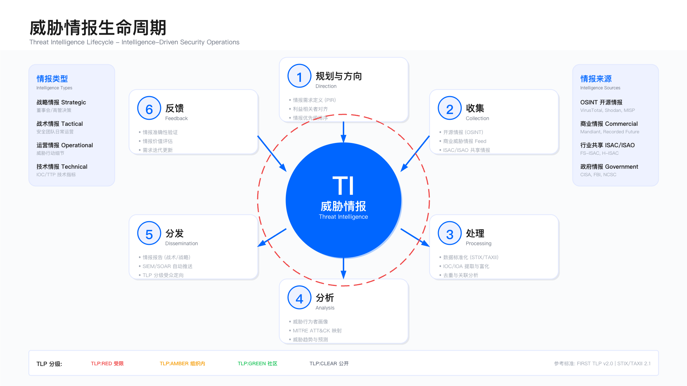

# 11.6　威胁情报运营

威胁情报是安全运营中心的关键资产，其价值在于将分散的威胁数据转化为可操作的检测、响应与决策依据。但情报运营最常见的失败模式，不是情报不够多，而是情报不流动——情报团队每天从多个来源收集大量威胁数据，却在 TIP 中静静积压，未能推送到检测平台，未能指导狩猎行动，也未能反馈给决策层影响安全投资。

更隐蔽的问题是"情报来源同质化"：许多商业情报厂商共享底层数据源（同一批安全研究员的博客、同一个暗网论坛的爬虫），高价购买的"独家情报"与免费开源情报高度重合。而真正有价值的"内部情报"——来自事件响应、红队演练、蜜罐捕获的威胁数据——往往散落在事件报告中，未被系统化提取和复用。

本节介绍威胁情报运营的完整实践：从多源情报整合、IOC/IOA 管理、情报自动化、分析报告，到情报驱动的检测和响应机制。



---

## 11.6.1 威胁情报来源

### 情报来源分类

威胁情报来源可分为四类，各有其适用场景与局限性。选择情报源时需权衡成本、时效性、可信度与内部消化能力——与其订阅十个来源消化不了，不如专注三个来源消化到位。

1. 开源情报（OSINT）

下表把主流开源情报按数据形态分组，落点是在"补什么"之前先分清"用它来做什么"：社区平台给的是可直接入库的原子 IOC，厂商博客给的是需要人读的分析叙事，CVE 数据库对接的是漏洞管理决策，社交媒体则是牺牲可信度换时效的预警渠道。四类的消费方式截然不同，不能用同一套自动化管道处理。

| 来源 | 类型 | 示例 | 适用场景 |
|------|------|------|---------|
| 社区平台 | IOC、报告 | OTX, MalwareBazaar, URLhaus | 快速补充基础 IOC 库 |
| 安全厂商博客 | 分析报告 | Mandiant, CrowdStrike, Palo Alto Unit 42 | 了解 APT 战役与 TTP |
| CVE 数据库 | 漏洞信息 | NVD, CVE, Exploit-DB | 漏洞情报与补丁决策 |
| 社交媒体 | 实时威胁 | Twitter #threatintel, Reddit r/netsec | 实时威胁预警 |

这张表里的关键取舍在于"入库路径"：社区平台的原子 IOC 可以走自动化摄取，但正因为门槛低、缺乏人工背书，它也是误报的主要来源；社交媒体时效最快，却几乎没有可信度保证。因此下面这条边界提醒并非泛泛而谈——它明确点出社区/社交类来源与生产环境之间必须隔一道评分与验证的闸门。

开源情报质量参差不齐，误报率可能较高，需建立评分与验证机制，避免直接自动化分发至生产环境。

专项威胁情报源

前一张表覆盖的是"广谱"开源情报，胜在数量、弱在信噪比。而下面这类专项源恰好相反：它们聚焦某一狭窄场景（在野漏洞、供应链投毒、恶意 IP 等），因为聚焦，其可信度和时效性反而普遍高于通用 OSINT。之所以单独成表，是因为这类源往往对接的是一条具体的自动化管道（漏洞管理、CI/CD、边界防护），而非泛泛地"补充 IOC 库"，集成方式带有明确的落点。

以下专项情报源在特定场景下具有极高价值，可信度和实效性均优于通用 OSINT：

| 类型 | 情报源 | 覆盖范围 | 集成建议 |
|------|--------|----------|----------|
| 在野漏洞（开源） | CISA KEV | 已确认在野利用的漏洞 | 漏洞管理系统必接、自动提升 KEV 漏洞优先级 |
| 在野漏洞（开源） | EPSS | 漏洞利用概率评分（0-1） | 与 CVSS 结合优化漏洞优先级排序 |
| 供应链投毒（商业） | 墨菲安全 | PyPI/npm/Maven 恶意包（国产） | CI/CD 集成检测、开发者告警 |
| 供应链投毒（商业） | Snyk/Phylum/Socket.dev | npm/PyPI 供应链风险（国际） | 开发环境集成、SBOM 关联 |
| 恶意软件（开源） | Abuse.ch | 恶意 URL/样本/IOC | MISP Feed 订阅、自动化 IOC 分发 |
| 恶意 IP（开源） | AbuseIPDB/Shodan InternetDB | IP 信誉/开放端口 | 边界防护 IP 信誉查询 |

这张表里"集成建议"一列才是专项源与广谱源的真正区别：每一行都指向一个具体的接入点。CISA KEV 接漏洞管理、EPSS 补充 CVSS 排序、墨菲/Snyk 接 CI/CD、Abuse.ch 走 MISP Feed、AbuseIPDB 接边界防护。这意味着专项源的价值不在于"多一份数据"，而在于它能直接嵌入某条既有的决策流水线。其中 CISA KEV 因为语义最强（"已确认在野利用"），单独展开如下。

CISA KEV 集成要点：KEV 列入意味着漏洞已确认被在野利用，是优先级最高的漏洞情报源。集成建议：每日自动同步 KEV 清单、匹配 KEV 的 CVE 自动标记为 Critical（无论 CVSS 评分如何）、KEV 漏洞建议 7 天内修复、利用 `knownRansomwareCampaignUse` 字段进行勒索软件关联分析。

2. 商业情报

商业情报解决的是开源情报覆盖不到的两个盲区：一是深度分析（APT 归因、暗网黑产这类需要长期投入的能力，不是免费源能提供的），二是时效与预测（专业团队 7×24 跟踪并提前预警）。下表按厂商的差异化能力划分——商业情报不该"买一家全包"，而应按自身威胁模型对应到具体能力缺口。

| 厂商 | 特点 | 适用场景 |
|------|------|---------|
| Mandiant | APT 情报深度分析 | 针对高级威胁的防护 |
| Recorded Future | 实时情报、AI 驱动 | 实时威胁感知与预测 |
| CrowdStrike | 端点威胁情报 | EDR 集成与端点防护 |
| Flashpoint | 暗网情报 | 数据泄露监控与地下黑产跟踪 |

这张表适合"从能力缺口反向选型"：如果组织已有 EDR 但缺端点侧情报，CrowdStrike 的价值最大；如果核心诉求是提前量与预测，Recorded Future 更贴合；暗网监控需求则对应 Flashpoint。正因为每家的强项不同、价格不菲，才有了下面这条务实建议——用试用期的真实命中率和误报率说话，而不是被 marketing 材料说服。

商业情报通常按订阅收费，需评估 ROI。建议先通过试用验证命中率与误报率，再决定是否采购。

**关于命中率阈值：本书不给具体数字，因为不存在可引用的公开基准。** 命中率的分母是"你消费了多少条情报"，分子是"其中多少条触发了有效告警"，两端都由本组织的资产暴露面、行业、以及情报源的选择决定——一家只订阅了本行业定向情报的公司，命中率天然远高于订阅了全量泛化 feed 的公司，而后者未必更差。所以横向对标这个数字没有意义，能用的只有自己的时间序列：先跑三个月建立基线，再把改进目标定成"相对基线提升多少"。**任何把"情报命中率应达 X%"当作行业标准写进采购要求的做法，都要先问出处——这类数字在采购模板里流传很广，但追到源头往往是另一家公司的内部基线，与你的资产和情报源都不相干。**

3. 行业共享（ISAC）

金融（FS-ISAC）、医疗（H-ISAC）、能源（E-ISAC）等行业情报共享圈子，提供针对特定行业的高相关性情报。参与门槛：通常需要企业能够向社区贡献情报，单向获取而不共享，长期参与价值有限。

4. 内部情报

来自事件响应发现的 IOC、红队演练产生的 TTP、蜜罐捕获的威胁、自研沙箱分析结果。可信度最高：直接来自真实攻击，误报率低、相关性强。关键是建立情报提取与标准化流程，避免散落在事件报告中无法复用。

---

## 11.6.2 威胁情报生命周期

威胁情报运营遵循"收集 → 处理 → 分析 → 分发 → 反馈"的闭环流程。每个环节都需要明确的转化机制——缺乏任何一个，情报运营都会陷入"有情报无行动"或"有行动无闭环"的困境。

### 阶段 1：收集（Collection）

目标：从多个渠道自动化采集威胁情报，确保覆盖主流情报源。

自动化收集框架的核心职责是：并发查询多个情报源、统一标注来源、记录采集时间，为后续处理提供可溯源的原始数据。下面这段代码之所以把多个情报源收拢进一个 `sources` 字典、再用统一循环遍历，是为了让"新增一个情报源"变成往字典里加一项、而不是改动主流程——这是面对情报源频繁增删时最省事的结构。

```python
class ThreatIntelCollector:
    def __init__(self):
        self.sources = {
            'otx': AlienVaultOTX(api_key=OTX_KEY),
            'virustotal': VirusTotal(api_key=VT_KEY),
            'abuseipdb': AbuseIPDB(api_key=ABUSE_KEY),
            'malwarebazaar': MalwareBazaar(),
            'misp': MISPClient(url=MISP_URL, key=MISP_KEY)
        }

    def collect_iocs(self, timeframe='24h'):
        all_iocs = []
        for source_name, source in self.sources.items():
            try:
                iocs = source.get_recent_iocs(timeframe)
                for ioc in iocs:
                    ioc['source'] = source_name
                    ioc['collected_at'] = datetime.now()
                all_iocs.extend(iocs)
            except Exception as e:
                # 单源失败不中断整体采集
                log.error(f"Failed to collect from {source_name}: {e}")
        return all_iocs
```

这段代码里两行不起眼的赋值最关键：`ioc['source'] = source_name` 和 `ioc['collected_at'] = datetime.now()`。它们在采集的第一刻就给每条 IOC 打上"从哪来、何时来"的标签——正是这两个字段，让后面的评分阶段能按来源可靠性打分、让过期阶段能按采集时间判断新鲜度。如果在收集期偷懒不标注，后续所有依赖溯源的逻辑都会失去依据。而循环体外层的 `try/except`，则决定了这个框架在生产中能不能活下来。

`try/except` 设计确保单个情报源故障不中断整体采集流程——这在生产环境中至关重要，外部 API 不可用是常态而非异常。

常见误区：

- 只关注开源情报，忽略内部情报价值——内部情报量小但针对性强，应优先提取
- 未设置采集频率上限，导致 API 超限或数据重复

### 阶段 2：处理（Processing）

目标：将原始情报标准化、去重、验证与富化，形成可消费的情报产品。

处理阶段是把"一堆格式各异、真假混杂的原始 IOC"转化为"可以放心消费的情报产品"的关键一跳，其顺序不能随意调整：先标准化（否则后续无法统一操作）、再去重（在统一格式上比对才准确）、然后验证（丢掉明显无效项以免浪费富化开销）、最后才富化（对已确认有效的 IOC 补上下文最划算）。下面的四步流程正是按这个先后编排的：

```python
def process_threat_intelligence(raw_iocs):
    """
    四步处理流程：
    1. 标准化（转为 STIX 2.1，确保跨系统互操作性）
    2. 去重（多源采集的重复率通常 30-50%）
    3. 验证（过滤格式错误或明显无效的 IOC）
    4. 富化（补充 GeoIP、WHOIS、信誉评分等上下文）
    """
    normalized = [convert_to_stix(ioc) for ioc in raw_iocs]
    deduped = deduplicate_iocs(normalized, key=['value', 'type'])
    validated = [ioc for ioc in deduped if validate_ioc(ioc)]

    enriched = []
    for ioc in validated:
        enriched_ioc = enrich_ioc(ioc)
        enriched.append(enriched_ioc)
    return enriched

def enrich_ioc(ioc):
    """富化：为 IOC 补充决策所需的上下文信息"""
    if ioc['type'] == 'ipv4-addr':
        ioc['geo'] = geoip_lookup(ioc['value'])
        ioc['whois'] = whois_lookup(ioc['value'])
        ioc['reputation'] = reputation_check(ioc['value'])
    elif ioc['type'] == 'domain-name':
        ioc['resolved_ips'] = dns_resolve(ioc['value'])
        ioc['whois'] = whois_lookup(ioc['value'])
    elif ioc['type'] == 'file':
        ioc['vt_result'] = virustotal_lookup(ioc['value'])
    return ioc
```

这段代码有两个值得注意的设计点。其一是 `deduplicate_iocs` 的去重键 `['value', 'type']`——去重不能只看值，同一个字符串既可能是域名也可能是文件名的一部分，必须连类型一起比对才不会误合并。其二是 `enrich_ioc` 按 `type` 分支的设计：IP、域名、文件哈希各自需要的上下文完全不同（IP 查 GeoIP/WHOIS/信誉，域名查解析记录，文件查 VT），一刀切地对所有 IOC 做全套富化既浪费又无意义。这段代码把"富化"具体化成了"按类型补对应的决策上下文"。

STIX 2.1 标准化的意义不只是格式统一，它使情报可以在不同 TIP 平台之间通过 TAXII 2.1 协议互换[3][4]——这是情报共享和多系统集成的基础。情报共享关系的建立、共享范围界定与运营流程，另有成体系的公开指南可循[5]。去重率预期在 30-50%，大量重复来自多个来源跟踪同一 IOC（如活跃 C2 服务器）。这里也埋着一个生产坑：富化步骤里的每一次 `geoip_lookup`、`whois_lookup`、`virustotal_lookup` 都是外部调用，如果不加超时与并发控制，处理管道会被慢查询拖垮——这也是为什么先验证、再富化的顺序如此重要，验证阶段过滤掉的无效 IOC 越多，昂贵的富化调用就越少。

验证指标：富化字段覆盖率（IP 地址 GeoIP 覆盖率 >95%）、去重率（建议 >40%）、格式合规率（STIX 2.1 标准）。

### 阶段 3：分析（Analysis）

目标：对情报进行评分、关联分析，判断其可靠性、相关性与紧急度。分析阶段的结构化方法可参照两个经典框架：钻石模型把一次入侵活动拆成对手、能力、基础设施、受害者四个顶点并刻画其间的关系[1]；痛苦金字塔则给出"该优先跟踪哪一类指标"的排序判据——哈希、IP、域名易变，工具与 TTP 难改[2]。前者用于把零散 IOC 拼成活动画像，后者用于决定哪些结论值得沉淀成检测规则（见 11.3、11.4）。

分析阶段要回答的核心问题是"这条情报值不值得我行动"，而这个判断必须量化才能自动化。下面的评分模型把这个主观判断拆成三个可独立计算的维度（可靠性、相关性、紧急度），再用加权求和收敛成一个 0-100 的置信度分数。之所以要拆维度，是因为"值不值得行动"是多因素权衡：一条来自权威源但与本组织无关的情报，和一条来源一般但正打在自家技术栈上的情报，孰轻孰重取决于权重怎么配——把权重显式写出来，才能被讨论、被校准。

```python
def score_threat_intelligence(ioc):
    """
    综合评分（20-100）：
    - 可靠性（30%）：情报来源的历史准确性
    - 相关性（40%）：与本组织业务环境的匹配度（权重最高）
    - 紧急度（30%）：时效性与活跃程度
    """
    score = {
        'reliability': assess_reliability(ioc),   # 1-5
        'relevance': assess_relevance(ioc),        # 1-5
        'urgency': assess_urgency(ioc),            # 1-5
    }
    score['confidence'] = (
        score['reliability'] * 0.3 +
        score['relevance'] * 0.4 +
        score['urgency'] * 0.3
    ) * 20
    return score

def assess_reliability(ioc):
    """来源可靠性评分——基于历史准确率"""
    source_scores = {
        'mandiant': 5, 'crowdstrike': 5, 'recorded_future': 5,
        'misp_community': 4, 'otx': 3, 'internal': 5
    }
    return source_scores.get(ioc['source'], 2)

def assess_relevance(ioc):
    """相关性评分——与本组织的地理、行业、技术栈匹配度"""
    score = 3  # 默认中等相关
    if ioc.get('geo', {}).get('country') in OUR_OPERATING_COUNTRIES:
        score += 1
    if ioc.get('industry') == OUR_INDUSTRY:
        score += 1
    if ioc.get('technology') in OUR_TECH_STACK:
        score += 1
    return min(score, 5)

def assess_urgency(ioc):
    """紧急度评分——越新、越活跃，分越高"""
    if ioc.get('active_campaign'):
        return 5
    if days_since(ioc['first_seen']) < 7:
        return 4
    if days_since(ioc['first_seen']) < 30:
        return 3
    return 2
```

这三个评估函数各有各的"世界观"。`assess_reliability` 用一张来源白名单表打分，`get(..., 2)` 的默认值意味着任何不认识的来源都被视为低可靠——这是一个保守设计，宁可低估陌生源也不放行。`assess_relevance` 从中等分 3 起步，再按地理/行业/技术栈逐项加分，这正是把"相关性"落地成三个可判定条件（`OUR_OPERATING_COUNTRIES` 等常量代表本组织的画像）。`assess_urgency` 则是一串按新鲜度递减的阈值判断，`active_campaign` 直接顶格。三者都返回 1-5，最后乘 20 归一到百分制——所有维度先归一再加权，权重差异才有可比性。

相关性权重（40%）高于可靠性和紧急度，反映了一个核心判断：来自权威机构但与本组织无关的情报（如针对能源行业的 APT，但本组织是金融机构），价值远低于直接针对本组织的情报。这个权重分配是可调整的——根据组织威胁模型定期校准评分有效性。这里有个容易被忽视的依赖：`assess_relevance` 的判断完全建立在 `ioc.get('geo')`、`ioc.get('industry')` 这些字段上，而这些字段是上一阶段富化补上去的——如果处理阶段富化失败，相关性评分会静默退化为默认的中等分，评分体系的准头也就跟着塌了。

权衡点：可靠性权重过高，可能错过新兴威胁（新情报源评分低）；相关性权重过高，可能忽略跨行业通用威胁；紧急度权重过高，可能导致频繁调整策略。

### 阶段 4：分发（Dissemination）

目标：将高质量情报自动分发至检测平台，同时避免低质量情报污染生产环境。

分发是情报运营中风险最高的一步：分发对了能实时封堵威胁，分发错了会直接造成业务中断（误封合法 IP、拦截正常域名）。因此这里的核心不是"如何把情报推出去"，而是"如何按可信度把关"。下表的三级策略正是这道关卡——用评分把情报分流到不同的处置路径，高置信度才享有自动化的特权，其余的必须经过人工或时间的沉淀。

分发采用三级策略，不同置信度对应不同处置路径：

| 置信度分层 | 评分范围 | 处置方式 | 下发目标 |
|-----------|---------|---------|---------|
| 高置信度 | 90-100 | 自动分发 | SIEM、防火墙、EDR、邮件网关 |
| 中置信度 | 60-89 | 人工审核 | 进入 TIP 待审核队列，审批后分发 |
| 低置信度 | <60 | 观察池 | 存入低优先级队列，每月复审 |

这张表与上一节的评分模型直接相连：这里的"评分范围"就是 `score_threat_intelligence` 输出的那个 0-100 置信度。90 分以上才允许无人值守地写入生产设备，是因为一旦自动分发到防火墙或邮件网关，误报的代价是即时且可见的业务中断；60-89 落入人工队列，用人的判断兜住机器的不确定；60 以下不丢弃而是进观察池，保留了它日后与本地告警交叉印证的可能。除了按分数分层，还有一层更细的按类型分层，如下。

分发策略中最重要的设计是高置信度情报的防火墙自动封禁仅限 IP 类型——域名不直接封禁（高误封风险），文件哈希仅发送至 EDR。这种类型差异化处置避免了"一刀切"导致的业务中断。

### 情报预警等级矩阵

如果说上面的分发策略解决的是"情报进哪个检测平台"，那么下面的预警等级矩阵解决的是"人该以多快的速度、动员多大的资源来响应"。两者维度不同：分发是机器动作，预警是人的动员。之所以要用四色分级，是为了避免两种极端——把所有情报都当红色处理会让团队疲于奔命并很快麻木，而不分级又会淹没真正紧急的信号。

| 预警等级 | 触发条件 | 主要行动 | 响应时限 |
|---------|---------|---------|---------|
| 红色（Critical） | 针对核心资产的活跃攻击、0Day 武器化、APT 组织定向攻击 | 15 分钟内通知 CISO 与 IC、启动应急响应 | 情报提前量 ≥12h |
| 橙色（High） | 高影响漏洞在野利用、APT 行动迹象、行业同行遭攻击 | 1 小时内通知 SOC 经理、启动威胁狩猎 | 按本组织基线设定（见下） |
| 黄色（Medium） | 新披露漏洞（有 PoC 但未见利用）、相关行业威胁趋势 | 24 小时内完成影响评估、更新检测规则 | 按本组织基线设定（见下） |
| 绿色（Info） | 通用威胁趋势、长期跟踪对象活动更新 | 纳入周报、更新知识库 | 按周处理 |

这张表里"触发条件"与"主要行动"是绑定的一对：等级越高，触发门槛越苛刻（红色要求活跃攻击或定向 APT），对应的行动也越重（惊动 CISO、启动应急响应）。这种"高门槛配重响应"的对齐，就是为了保证被惊动到最高层的一定是真正值得的信号。也正因为红色代价高昂，下面这条约束才格外重要——它给自动升级加了一道"双源确认"的保险。

关键约束：红色预警的触发需至少两个独立情报源确认，避免单一来源误判导致过度响应。预警等级与情报评分不是一一对应关系——低评分情报若匹配本地已发现的攻击迹象，仍可升级为红色预警。

### 阶段 5：反馈（Feedback）

目标：评估情报有效性，优化情报源选择与评分模型。

反馈是整个生命周期里最容易被跳过、却最决定长期成败的一环。没有反馈，情报源的好坏只能凭主观印象判断，评分模型的权重永远是拍脑袋定的初始值。下表的四个指标正是把"情报到底有没有用"这个模糊感受量化成可以逐月追踪的数字——每一个都对应一种典型的失效模式：命中率低说明情报噪音大，准确率低说明误报多，覆盖率低说明情报没真正参与检测，时效差说明情报到手已经过时。

| 指标 | 定义 | 目标值 |
|------|------|--------|
| 命中率 | 情报触发有效告警的比例 | >5% |
| 准确率 | 情报触发真阳性的比例 | >80% |
| 覆盖率 | 检测到的攻击中使用了情报的比例 | >30% |
| 时效性 | 情报从发布到使用的时间 | <24h |

命中率和准确率在这张表里各有分工——两者都高才算健康，只看其一都会被误导。这也正是下面"常见误区"点破的：命中率高但准确率低（误报多）看似情报很"活跃"，实则在制造告警疲劳。而表尾这句关于适用基线的说明同样重要——这些目标值不是绝对的及格线，要按团队规模和行业特性折算。

上述目标值为已建立 TIP 平台且运营超过 6 个月的企业参考基线。小型团队（<3 人）应优先保障命中率与准确率，覆盖率目标可适当降低；金融/关基行业对时效性要求更高（<4h）。

常见误区：只关注命中率，忽略误报率——高命中率但误报率同样高，会导致告警疲劳。未建立反馈闭环，情报源评分长期不更新——建议每月复审情报源有效性，淘汰低效来源。

---

## 11.6.3 IOC/IOA 管理

IOC（入侵指标）与 IOA（攻击指标）的管理是威胁情报落地的关键环节，两者代表了截然不同的防御思路。下表把两者放在同一组维度下对照，两者并非二选一的关系，而是呈现出一个演进方向：IOC 廉价但易失效（攻击者换个 IP 就绕过），IOA 昂贵但持久（改变攻击手法的成本高得多）。理解这组对照，才能理解为什么成熟的情报体系会从依赖前者逐步转向倚重后者。

| 维度 | IOC（入侵指标） | IOA（攻击指标） |
|------|----------------|----------------|
| 定义 | 已发生入侵的痕迹 | 正在进行的攻击行为 |
| 示例 | 恶意 IP、文件哈希、域名 | 异常进程注入、异常网络连接 |
| 检测时机 | 事后（攻击已发生） | 事中（攻击正在进行） |
| 防御效果 | 阻止已知威胁 | 阻止未知威胁 |
| 时效性 | 易过时（攻击者可随时换 IP/域名） | 相对持久（TTP 改变成本高） |

这张表里"检测时机"和"时效性"两行之间存在因果关系：IOC 是事后痕迹，所以只能拦已知威胁，且因为攻击者能轻易更换基础设施而快速失效；IOA 盯的是行为本身，所以能在攻击进行中拦截未知威胁，也因为攻击手法难改而更持久。这正是下面这条演进建议的依据——先用低成本的 IOC 快速建起防御底盘，再往难度更高、回报更持久的 IOA 爬。

从"IOC 依赖"向"IOA/TTP 驱动"的转型，是情报成熟度提升的关键跨越。建议优先建立 IOC 库（成本低、见效快），再逐步扩展 IOA 检测能力（见 11.3）。

### IOC 管理流程

上面讨论的是 IOC 与 IOA 的理念差异，接下来要落到 IOC 的全生命周期工程实现上。一条 IOC 从进入系统到最终归档，会经历摄取、去重、富化、评分、分发、过期这一整条链路。下面的 `IOCManager` 把这条链路拆成三个方法：`ingest_ioc` 负责入口把关和分流，`distribute` 负责按类型精准投递，`expire_ioc` 负责生命末期的取舍。这样拆分的动机是让每个阶段的策略都能独立演进——比如未来要调整封禁阈值，只需改 `distribute`，不影响摄取逻辑。

```python
class IOCManager:
    def __init__(self, tip_client, siem_client, firewall_client, edr_client):
        self.tip = tip_client
        self.siem = siem_client
        self.firewall = firewall_client
        self.edr = edr_client

    def ingest_ioc(self, ioc):
        """接收并处理 IOC——六步完整流程"""

        if not self.validate_ioc(ioc):
            raise ValueError("Invalid IOC format")

        # 去重：避免重复存储，更新已有 IOC 的元数据
        if self.tip.exists(ioc['value']):
            return self.tip.update(ioc)

        enriched_ioc = self.enrich(ioc)
        enriched_ioc['score'] = self.score(enriched_ioc)
        stored_ioc = self.tip.store(enriched_ioc)

        # 高分 IOC 自动分发；低分 IOC 仅存储，等待人工审核
        if enriched_ioc['score'] >= 70:
            self.distribute(stored_ioc)

        return stored_ioc

    def distribute(self, ioc):
        """分类分发：不同 IOC 类型分发至不同平台"""
        self.siem.add_threat_list(ioc)

        # IP 封禁需要高置信度（防止误封）
        if ioc['type'] == 'ip' and ioc['score'] >= 90:
            self.firewall.block_ip(ioc['value'])

        if ioc['type'] == 'file':
            self.edr.add_ioc(ioc)

    def expire_ioc(self, ioc_id):
        """IOC 过期处理——有近期命中则延长，否则归档"""
        ioc = self.tip.get(ioc_id)
        recent_hits = self.siem.search_ioc_hits(ioc['value'], timerange='30d')

        if recent_hits:
            ioc['valid_until'] = extend_validity(ioc, days=90)
            self.tip.update(ioc)
        else:
            # 无命中的 IOC 从检测平台移除（减少噪音），但 TIP 中归档保留
            self.siem.remove_threat_list(ioc)
            self.tip.archive(ioc)
```

读 `ingest_ioc` 要注意它的短路顺序：先验证格式（不合格直接抛异常，不浪费后续资源），再查重（已存在的只更新元数据、不重复走完整流程），最后才是富化、评分、按 70 分门槛决定是否分发。这条流水线里两道闸门——70 分决定"分不分发"、`distribute` 里 90 分决定"要不要直接封 IP"——共同体现了同一个原则：动作越不可逆（封禁 IP 是最不可逆的），门槛就设得越高。`distribute` 中把 SIEM 威胁列表（所有类型都进）、防火墙封禁（仅 IP 且 ≥90 分）、EDR（仅文件）分开处理，正是 11.6.2 "类型差异化处置"在代码层面的落地。

`expire_ioc` 中的关键设计：有近期命中（30 天内触发过告警）的 IOC 延长有效期，无命中的归档而非删除。归档保留的原因是：历史 IOC 仍有取证价值（可以回溯确认某个 IP 是否曾被标记），但不应继续产生告警（避免过时 IOC 产生误报）。这里的 `remove_threat_list` 和 `archive` 是两个独立动作、缺一不可——只移除不归档会丢失取证线索，只归档不移除则会让过时 IOC 继续在检测平台制造噪音，两步分离才能同时满足"止损噪音"和"保留证据"两个目标。

运行指标：IOC 有效期中位数（建议 30-90 天）、IOC 去重率（建议 >40%）、IOC 分发至检测平台的成功率（目标 >99%）

---

## 11.6.4 威胁情报平台（TIP）

TIP 是情报运营的中枢，负责情报的统一管理、标准化存储与向下游系统分发。关于 TIP 选型（MISP、OpenCTI、Recorded Future 等商业方案）的详细对比，见 11.2.6。

TIP 之所以要与 SIEM、SOAR、漏洞管理三者集成成一个闭环，而不是简单地做一个"情报数据库"，是因为孤立存储的情报没有价值——它必须能推动检测、触发响应、并从响应结果中学习。下面的三角形图正是要凸显这种"三边缺一不可"的联动关系：

TIP 与其他系统的集成架构形成三角形联动：

```
     TIP（情报中枢）
      /          \
   SIEM            SOAR
（IOC 推送        （情报驱动
  检测规则）        自动响应）
      \            /
       漏洞管理平台
     （CVE 情报关联）
```

这张图不是静态的三角，而是一条沿数据流向运转的回路。情报在 TIP 中沉淀、富化、评分后，向 SIEM 推 IOC 生成检测规则，SIEM 命中后触发 SOAR 的 Playbook 自动响应，响应结果又回流 TIP 更新置信度——这是一条有方向的环，起点和终点都是 TIP。漏洞管理这条边则负责把 CVE 情报关联进来，让漏洞优先级也能吃到情报的养分。图中三条边各自承载一种转化：情报→检测、检测→响应、响应→情报改进，任何一条边断了，环就退化成了单向的数据搬运。

TIP 在这个三角形中的核心职责是：情报在 TIP 中沉淀、富化、评分后，通过 API 推送至 SIEM 生成检测规则，检测命中后触发 SOAR Playbook 进行自动响应，响应结果反馈至 TIP 更新情报置信度。这个闭环是情报持续改进的基础，缺少任何一条边都会使整体价值大打折扣。

---

## 11.6.5 情报驱动的 SOC 运营

### 情报驱动检测

情报驱动检测（Intelligence-Driven Detection）是将威胁情报实时反馈至检测规则的自动化机制。与静态规则不同，情报驱动的检测规则会随情报更新而自动调整。

核心流程：威胁情报 API 定时推送最新 IOC → TIP 评分过滤（仅高置信度 IOC 进入检测） → SIEM 自动更新威胁列表 → 检测命中实时告警。

CISA KEV 是情报驱动检测的最佳实践场景：每天同步 KEV 最新数据，自动在 SIEM 中创建或更新"未修复 KEV 漏洞利用行为"检测规则。这确保了漏洞管理与检测能力的实时联动（见 11.8 漏洞管理）。

### 情报驱动威胁狩猎

当情报预警等级达到橙色（High）时，应立即启动针对性威胁狩猎（见 11.4），重点检查：

- 相关 IOC 在内部环境的历史匹配记录（过去 30-90 天）
- 与情报描述的 TTP 相似的内部行为模式
- 与同行业受害者相同的资产类型或技术栈

### 适用边界

- 适用于已建立 TIP 平台且日志采集覆盖率 >80% 的环境
- 情报驱动检测效果高度依赖情报质量——低质量情报自动化分发会引发大量误报，比手动处置更糟
- 小型 SOC（<5 人）建议优先专注内部情报提取和 CISA KEV 集成，商业情报订阅可待人员规模扩大后再考虑

### 常见误区

1. 盲目追求情报来源数量——10 个来源消化 30% 不如 3 个来源消化 90%
2. 将所有情报都自动化分发——低置信度情报必须有人工审核门槛
3. 情报运营与检测工程脱钩——情报团队和检测工程师需要定期协同（建议每周情报评审会），确保新情报及时转化为检测规则

### 运行指标

下面这张指标表专门衡量"情报驱动检测"这一机制本身跑得好不好，和 11.6.2 反馈阶段的情报源指标视角不同：那里评的是情报源的质量，这里评的是情报到检测规则的转化效率。四个指标构成一条流水线的观测点——转化率看有多少高置信度情报真的变成了规则，响应时效看这个转化有多快，命中率看规则上线后是否有效，覆盖率看情报驱动的检测在整体检测中占多大分量。

| 指标 | 定义 | 目标值 |
|------|------|--------|
| 情报转化率 | 转化为检测规则的高置信度情报比例 | >60% |
| 情报响应时效 | 高危情报推送到规则上线的时间 | <24h（橙色），<4h（红色） |
| IOC 命中率 | 分发 IOC 触发有效告警的比例 | >5% |
| 情报覆盖率 | 情报驱动检测占总检测的比例 | >30% |

这张表里"情报响应时效"一行的分级目标值得注意——橙色 <24h、红色 <4h，这与前面预警等级矩阵的分级一脉相承：越高等级的情报，从推送到规则上线的窗口就压得越紧。转化率与覆盖率则是一对互补视角，前者衡量"该转化的转化了没有"，后者衡量"转化后在实战检测中占了多大比重"，只有两者都达标，才说明情报真正嵌入了检测体系而非停在纸面。

---

## 11.6.6 暗网情报运营（Dark Web Intelligence）

暗网情报是威胁情报的重要组成部分，但也是最容易被误解的领域。许多组织将暗网监控简化为"品牌关键词搜索"——在几个暗网论坛和泄露网站搜索公司名称，发现泄露后再响应。这种被动式监控虽有价值，但远未发挥暗网情报的真正潜力。

暗网情报价值按层级递增：操作情报层（泄露凭证、数据交易、品牌仿冒，关键词监控即可）→ 战术预警层（攻击工具、0Day 交易、TTP，需专业技术能力）→ 战略预测层（攻击趋势、威胁行为者意图，需深度分析能力）。大多数组织在操作情报层即可获得显著价值。

### 分层监控框架

上面区分了暗网情报的三个价值层级，下面的配置文件把这三层落成一套可执行的监控策略。之所以用"频率 + 来源 + 关注点"三要素来定义每一层，是因为暗网监控的成本主要由频率和深度决定：实时监控海量论坛既不现实也没必要，正确做法是让影响最直接的场景（如凭证泄露）享受实时自动化，让需要人力研判的战略分析降到每周。这份 YAML 正是把"越直接的威胁、越高的监控频率"这一原则参数化了。

```yaml
# 暗网监控策略配置
dark_web_monitoring:
  tier_1_automated:  # 自动化监控层
    frequency: realtime
    sources:
      - ransomware_leak_sites
      - paste_sites
      - breach_notification_services
    keywords:
      - company_name: ["公司名", "brand.com", "子品牌"]
      - domains: ["*.company.com", "mail.company.com"]
      - executives: ["CEO姓名", "CFO姓名"]  # 高管身份冒充
      - products: ["产品名称", "服务名称"]
    alerts:
      - type: data_leak
        severity: critical
        notification: [CISO, Legal, PR]
      - type: credential_exposure
        severity: high
        notification: [SOC, IAM]

  tier_2_periodic:  # 定期监控层
    frequency: daily
    sources:
      - hacker_forums
      - initial_access_brokers
      - malware_as_a_service
    focus_areas:
      - 针对我方行业的攻击工具
      - 我方技术栈相关漏洞交易
      - 供应商/合作伙伴泄露

  tier_3_strategic:  # 战略情报层
    frequency: weekly
    sources:
      - threat_actor_tracking
      - campaign_analysis
      - geopolitical_developments
    deliverables:
      - 威胁行为者画像更新
      - 攻击趋势预测报告
```

这份配置里最要紧的是 Tier 1 里 `alerts` 段的设计：它没有停在"发现即告警"，而是把告警按类型直接绑定到不同的通知对象——数据泄露惊动 CISO/法务/公关，凭证泄露转给 SOC/IAM。这种"告警类型即通知路由"的写法，让暗网发现能第一时间落到对的人手上，而不是统一丢进一个大群等人认领。另一处细节是 `keywords` 里显式列出高管姓名（用于识别身份冒充）和域名通配符——暗网监控的关键词库需要精心维护，漏配一个子品牌或高管，对应的冒充与泄露就监控不到。

三层框架的设计逻辑：Tier 1 实时自动化，覆盖对业务影响最直接的泄露场景；Tier 2 每日定期，关注攻击工具和目标供应商；Tier 3 每周战略，为管理层提供前瞻视角。多数中型组织可先落地 Tier 1，再逐步扩展。

### 暗网凭证泄露响应流程

上面的监控框架负责"发现"，而发现之后如何处置才是价值兑现的地方。凭证泄露是暗网监控中最高频、也最需要争分夺秒的场景——凭证一旦流出，攻击者可能随时用它登录。下面的流程图把从告警到长期改进的全过程串成一条主线，其设计要点是"先验证真伪，再谈响应"：暗网数据鱼龙混杂，大量是过时或伪造的样本，如果不先验证就触发全员改密，会造成不必要的业务扰动和信任透支。

```
           ┌────────────────────────────┐
           │   暗网凭证泄露告警          │
           └─────────────┬──────────────┘
                         ▼
           ┌────────────────────────────┐
           │   验证泄露真实性            │
           │   • 样本数据核验            │
           │   • 时间戳分析              │
           │   • 来源可信度评估          │
           └─────────────┬──────────────┘
                         ▼
              ┌──────────┴──────────┐
              ▼                     ▼
         泄露确认               误报/过时
              │                     │
              ▼                     ▼
    ┌─────────────────┐      标记并关闭
    │ 评估影响范围     │
    │ • 涉及账号数量   │
    │ • 账号类型/权限  │
    │ • 关联系统      │
    └────────┬────────┘
             ▼
    ┌─────────────────────────────────────┐
    │ 即时响应（黄金 4 小时）              │
    │ 1. 强制密码重置（受影响账号）        │
    │ 2. 撤销活跃会话                      │
    │ 3. 审计登录历史（异常登录检测）      │
    │ 4. 加强监控（登录行为、特权操作）    │
    └────────┬────────────────────────────┘
             ▼
    ┌─────────────────────────────────────┐
    │ 溯源分析                             │
    │ • 泄露源头（钓鱼/恶意软件/第三方）  │
    │ • 泄露时间窗口                       │
    │ • 是否已被利用                       │
    └────────┬────────────────────────────┘
             ▼
    ┌─────────────────────────────────────┐
    │ 长期改进                             │
    │ • 凭证卫生强化                       │
    │ • MFA 覆盖扩展                       │
    │ • 密码策略优化                       │
    └─────────────────────────────────────┘
```

这张流程图有三个关键转折。第一个是最上方的分叉——"泄露确认"与"误报/过时"分道，后者直接"标记并关闭"，这就是前面强调的验证闸门，它把大量噪音挡在了重响应之外。第二个是"即时响应"框里的动作顺序：密码重置和撤销活跃会话必须并行，只改密码却不撤会话，攻击者手上已建立的会话仍然有效——这是实战中极易踩的坑。第三个是流程没有止于止血，而是延伸到"溯源分析"和"长期改进"：搞清泄露源头（是钓鱼还是第三方泄露）才能对症加固，否则同一渠道会反复出血。这条从"止血"到"溯源"再到"根治"的链路，正是把一次被动的泄露响应转化为一次防御体系升级的机会。

运行指标：凭证泄露发现时效（<4 小时）、凭证响应时效（<4 小时）、误报率（<20%）。

---

## 11.6.7 威胁情报自动化关联

自动化的核心价值是"释放人力处理高价值任务"，而非"用机器替代人的判断"。有效的自动化策略需要分层：高置信度情报自动分发、中置信度情报人工审核、低置信度情报仅作参考。缺乏分层机制的"全自动化"往往带来比手工操作更大的运营负担——自动化误报会比手动误报更难清理，因为它们来得更快更多。

### 自动化关联引擎

前面各节的自动化多是"单条情报的处理"，而关联引擎解决的是另一类问题：把一条孤立的告警放回威胁情报的大背景里，看它是不是某个已知威胁行为者、某场正在进行的战役的一部分。这一步的价值在于给告警补上"敌情"——同样一个可疑连接，如果关联出背后是某 APT 组织，其严重度判断会完全不同。下面的引擎把这个过程拆成"提取指标 → 逐个查 TIP → 汇总成威胁上下文 → 据此调整严重度"四步。

```python
class ThreatIntelCorrelationEngine:
    """威胁情报自动化关联引擎"""

    def correlate_alert_with_intel(self, alert):
        """将告警与威胁情报关联"""
        correlations = []
        indicators = self.extract_indicators(alert)

        for indicator in indicators:
            # 查询 TIP——注意设置超时，TIP 查询不能阻塞告警处理
            intel_matches = self.tip.query(
                indicator_type=indicator['type'],
                indicator_value=indicator['value']
            )
            for intel in intel_matches:
                correlation = {
                    'alert_id': alert['id'],
                    'intel_id': intel['id'],
                    'indicator': indicator,
                    'intel_details': intel,
                    'correlation_score': self.calculate_correlation_score(alert, intel)
                }
                correlations.append(correlation)

        # 关联多个情报，构建威胁上下文
        if correlations:
            threat_context = self.build_threat_context(correlations)
            self.enrich_alert(alert, threat_context)

        return correlations

    def build_threat_context(self, correlations):
        """构建威胁上下文——识别威胁行为者、战役、TTP"""
        threat_actors = set()
        campaigns = set()
        ttps = set()

        for corr in correlations:
            intel = corr['intel_details']
            if 'threat_actor' in intel:
                threat_actors.add(intel['threat_actor'])
            if 'campaign' in intel:
                campaigns.add(intel['campaign'])
            if 'mitre_attack' in intel:
                ttps.update(intel['mitre_attack'])

        return {
            'threat_actors': list(threat_actors),
            'campaigns': list(campaigns),
            'ttps': list(ttps),
            'severity_adjustment': self.calculate_severity_adjustment(
                threat_actors, campaigns
            )
        }

    def calculate_severity_adjustment(self, threat_actors, campaigns):
        """基于威胁行为者和战役调整严重程度"""
        high_profile_actors = ['APT28', 'APT29', 'Lazarus', 'FIN7']
        if any(actor in high_profile_actors for actor in threat_actors):
            return +2  # APT 组织 -> 提升 2 级

        active_campaigns = self.get_active_campaigns()
        if any(campaign in active_campaigns for campaign in campaigns):
            return +1  # 活跃战役 -> 提升 1 级

        return 0
```

这段代码里三个方法各司其职。`correlate_alert_with_intel` 里有一行注释点出了最容易翻车的地方——TIP 查询必须设超时，因为它是嵌在告警处理主路径上的外部调用，一旦 TIP 慢查询，整个告警流水线都会被拖住。`build_threat_context` 用 `set` 去重来汇聚多条关联指向的同一威胁行为者或战役，把碎片化的情报收敛成一份结构化的"敌情画像"。而 `calculate_severity_adjustment` 则把这份画像转成一个可量化的调整值：命中已知 APT 直接 +2、命中活跃战役 +1，二者取先命中即返回，不叠加。

`calculate_severity_adjustment` 的设计值得注意：它基于已知 APT 列表进行严重度升级，这意味着该列表需要定期维护。未在列表中的新兴威胁行为者不会触发升级——这是规则驱动方法的固有局限，需通过定期更新 `high_profile_actors` 名单来弥补。换句话说，这段代码的检测力上限，就锁死在那份硬编码名单的更新频率上：名单落后一天，新出现的高危组织就有一天窗口无法被自动提级——这也是为什么实践中常把这类名单外置成可动态加载的配置，而非埋在代码里。

### 多维度情报富化

上一段的关联引擎回答的是"这条情报属于谁"，而下面的富化函数回答的是"这条情报还能补充哪些角度"。它把富化明确拆成四个递进的维度：上下文（它本身是什么）、关联（它和什么有关）、战术（映射到 ATT&CK 框架的哪个技战术）、预测（它接下来可能怎么发展）。这种分维度的写法，好处是每个维度可以独立开关——尤其最后的预测维度成本最高、依赖最重，能被单独关掉而不影响前三层。

```python
def enrich_threat_intelligence(ioc):
    """多维度富化：上下文 + 关联 + ATT&CK 映射 + 预测"""
    enriched = ioc.copy()

    # 1. 上下文富化
    enriched['context'] = {
        'geo': get_geo_info(ioc),
        'asn': get_asn_info(ioc),
        'reputation': get_reputation(ioc),
        'historical_activity': get_historical_activity(ioc)
    }

    # 2. 关联富化
    enriched['relationships'] = {
        'related_iocs': find_related_iocs(ioc),
        'threat_actor': identify_threat_actor(ioc),
        'campaign': identify_campaign(ioc),
        'malware_family': identify_malware(ioc)
    }

    # 3. 战术富化（MITRE ATT&CK）
    enriched['mitre_attack'] = map_to_attack_framework(ioc)

    # 4. 预测富化（依赖历史数据质量，新建 SOC 慎用）
    enriched['predictions'] = {
        'likely_targets': predict_targets(ioc),
        'attack_probability': predict_attack_probability(ioc),
        'recommended_actions': recommend_actions(ioc)
    }

    return enriched
```

这段代码里四个维度的"成本和可靠性"呈现一升一降：从上下文到预测，信息越来越有价值，但获取难度和不确定性也越来越大。前三个维度（上下文、关联、ATT&CK 映射）建立在相对确定的查询和已有映射上，第四个维度的预测则依赖历史数据训练和推断——注释里"新建 SOC 慎用"正是这个意思。函数开头 `ioc.copy()` 也值得一提：它避免了原地修改传入对象，让富化结果是一份新数据，不污染上游的原始 IOC。

富化操作需设置超时（建议每个 IOC 富化 <5 秒），避免阻塞情报处理流程。预测类富化依赖历史数据质量，新建 SOC 可能缺乏足够数据支撑预测——建议先落地前三个维度，待数据积累后再开启预测富化。也就是说，这四个维度不必一次全开：把预测维度作为可延后启用的第四档，既能让新建 SOC 立刻用上前三层的确定性价值，又避免了在数据不足时让不可靠的预测污染富化结果。

---

## 11.6.8 威胁情报质量评估框架

情报质量是威胁情报运营的核心挑战。组织常见的困境是"情报多但质量差"：TIP 中存储了数十万条 IOC，但实际能驱动有效检测的不足 10%。更糟糕的是，低质量情报产生的误报消耗了分析师大量时间，导致"情报越多、效率越低"的悖论。

### 情报质量评估模型

要打破"越多越低效"的悖论，前提是能量化每一条情报的质量，从而淘汰拖后腿的来源。下面的评分公式把质量拆成准确性、时效性、相关性三个维度加权求和——这与 11.6.2 的情报评分（可靠性/相关性/紧急度）视角相近但侧重不同：那里评的是"单条情报值不值得行动"，这里评的是"某个情报源整体质量如何"，服务于淘汰决策。

情报质量评分从三个维度综合计算：

```
评分公式：Quality = Accuracy×0.4 + Timeliness×0.3 + Relevance×0.3

准确性（40%）：来源可信度 + 验证状态 + 误报历史 + 多源确认
时效性（30%）：情报新鲜度 + IOC 有效期 + 威胁活跃度
相关性（30%）：行业相关 + 地理相关 + 技术栈相关 + 资产匹配
```

这个公式与 11.6.2 评分模型存在权重差异：那里相关性最高（40%），这里准确性最高（40%）。差异源于两者的用途——单条情报要不要行动，最关心"是否打在自家身上"（相关性）；而评判一个情报源该不该继续用，最关心"它给的东西准不准"（准确性），因为一个持续制造误报的源，哪怕再相关再实时，也是在破坏信噪比、消耗分析师。这个权重取向直接推出了下面这句判断。

准确性权重最高（40%）的原因：低准确性情报哪怕实时、相关，分发至检测平台后也会制造大量误报，破坏 SOC 的整体信噪比。情报来源的历史误报率是准确性评估中最重要的单项指标。

### 情报质量监控指标

有了评估模型还不够，还需要把它变成可以持续采集、自动触发淘汰的监控体系。下面的配置把质量落成三组可计算的指标：`source_metrics` 按情报源维度追踪命中率、误报率等，`ioc_type_metrics` 给出不同 IOC 类型的预期基线，`source_retirement` 则把淘汰决策也参数化了。之所以要把公式（`formula`）和目标（`target`）一并写进配置，是为了让"质量差"从主观感受变成可复现、可审计的判定。

```yaml
# 情报质量监控指标
intelligence_quality_metrics:

  source_metrics:
    - metric: hit_rate
      description: 情报命中率（触发有效告警的比例）
      formula: valid_alerts / total_iocs_distributed
      target: "> 5%"
      frequency: weekly

    - metric: false_positive_rate
      description: 误报率
      formula: false_positives / (true_positives + false_positives)
      target: "< 20%"
      frequency: weekly

    - metric: coverage_contribution
      description: 对检测覆盖的贡献度
      formula: source_driven_detections / total_detections
      target: "按来源分布评估"
      frequency: monthly

    - metric: latency
      description: 情报时效（从发布到使用）
      formula: avg(detection_time - intel_publish_time)
      target: "< 24h"
      frequency: weekly

  ioc_type_metrics:
    ip_address:
      avg_validity: "7-14 days"
      expected_hit_rate: "3-8%"
    domain:
      avg_validity: "14-30 days"
      expected_hit_rate: "5-10%"
    file_hash:
      avg_validity: "30-90 days"
      expected_hit_rate: "1-5%"
    url:
      avg_validity: "1-7 days"
      expected_hit_rate: "2-6%"

  # 情报源淘汰机制
  source_retirement:
    criteria:
      - hit_rate < 1% for 3 consecutive months
      - false_positive_rate > 50%
      - no updates for 30+ days
    process:
      - 标记为"观察期"
      - 30 天复评
      - 决定保留/淘汰
```

这份配置里，`source_metrics` 里每个指标都自带 `formula` 是关键——它让 `hit_rate`、`false_positive_rate` 这些词不再是口头概念，而是可以直接对接监控系统的计算式。`ioc_type_metrics` 给不同类型定了不同基线，说明"命中率好不好"必须分类型看：文件哈希 1-5% 的命中率是正常的，若拿域名 5-10% 的标准去要求它就会误判。最实用的是 `source_retirement`——它把淘汰从"觉得不好用就砍"变成了三条明确阈值加一套"观察期→复评→决定"的流程，避免了拍脑袋淘汰。

IP 地址的有效期（7-14 天）显著短于文件哈希（30-90 天），原因是攻击者更换 C2 服务器的成本远低于更换恶意软件。这个差异直接影响自动过期策略的配置——IP 类 IOC 应更频繁地重新验证，而不能像文件哈希一样设置较长的静态有效期。这也回应了 11.6.3 `expire_ioc` 里"按命中动态延长有效期"的设计：静态有效期只是起点，不同类型的起点本就该不同。

### 情报质量改进循环

前面的指标解决"看见问题"，下面的改进循环解决"闭环修复"。它把采集、分发、检测、评估四个环节连成一个带反馈边的环——注意图中从"检测"回流到"评估"的那条"反馈循环"，正是整张图的灵魂。没有这条回流，评估就成了无源之水，只能靠人主观打分。

```
┌─────────────────────────────────────────────────────────────────────┐
│                    情报质量改进循环                                  │
├─────────────────────────────────────────────────────────────────────┤
│                                                                     │
│      ┌──────────────┐                    ┌──────────────┐          │
│      │   采集       │───────────────────▶│   分发       │          │
│      │  Collection  │                    │  Distribution│          │
│      └──────┬───────┘                    └──────┬───────┘          │
│             │                                    │                  │
│             ▼                                    ▼                  │
│      ┌──────────────┐                    ┌──────────────┐          │
│      │   评估       │◀───────────────────│   检测       │          │
│      │  Assessment  │    反馈循环         │  Detection   │          │
│      └──────┬───────┘                    └──────────────┘          │
│             │                                                       │
│             ▼                                                       │
│      ┌──────────────────────────────────────────────────────────┐  │
│      │                     改进行动                              │  │
│      ├──────────────────────────────────────────────────────────┤  │
│      │  低效情报源 → 调整权重 / 淘汰                             │  │
│      │  高误报 IOC 类型 → 调整分发策略                           │  │
│      │  缺失检测场景 → 引入新情报源                              │  │
│      │  高效情报源 → 增加投入                                    │  │
│      └──────────────────────────────────────────────────────────┘  │
│                                                                     │
│  改进频率：每月情报源评估会议                                       │
│  参与者：威胁情报团队、检测工程、SOC 分析师                         │
│                                                                     │
└─────────────────────────────────────────────────────────────────────┘
```

这张图与上一节的监控指标直接衔接：底部"改进行动"框里的四条动作，每一条都对应一个可以由指标触发的判断——"低效情报源→淘汰"对应 `source_retirement` 的阈值，"高误报 IOC 类型→调整分发策略"对应误报率指标，"高效情报源→增加投入"对应命中率排名。也就是说，这张图不是抽象的 PDCA 口号，而是给前面那些冷冰冰的数字指定了对应的行动出口。图底还特意标注了改进会议的参与者要包含检测工程和 SOC 分析师——这呼应了 11.6.5 "情报运营与检测工程脱钩"的误区，只有下游用情报的人一起复盘，反馈才是真实的。

改进循环的关键是"反馈闭环"——检测平台的命中记录必须回流至情报评估阶段。没有这个回流，情报源评分就只能依赖主观判断，而无法基于实际效果做出淘汰或加投入的决策。

运行指标：

| 指标 | 定义 | 目标 | 评估频率 |
|------|------|------|----------|
| 情报源综合评分 | 加权平均质量分 | >70 分 | 每月 |
| 情报命中率 | 有效告警/分发 IOC | >5% | 每周 |
| 情报时效 | 发布到使用的时间 | <24h | 每周 |
| 覆盖率 | 情报驱动检测占比 | >30% | 每月 |
| 情报源淘汰率 | 年度淘汰/新增比 | 动态平衡 | 每年 |

这张收尾指标表把前面质量评估的各条线索汇总成一份可挂在墙上的记分卡，其中"评估频率"一列尤其值得留意——命中率、时效按周看（贴近运营节奏），综合评分、覆盖率按月看（反映中期趋势），淘汰率按年看（衡量情报源结构的健康度）。不同指标配不同的复盘节奏，才能让高频指标驱动日常调优、低频指标驱动战略调整，而不是眉毛胡子一把抓。

---

## 小结

威胁情报运营的核心是建立情报价值链——从原始数据到可操作情报，再到检测规则和响应行动。情报如果不能影响检测和响应决策，就只是数据，不是情报。

本节完整覆盖了情报运营的各个阶段：多源情报整合（11.6.1-11.6.2）、IOC/IOA 管理（11.6.3）、TIP 平台集成（11.6.4）、情报驱动运营（11.6.5）、暗网情报监控（11.6.6）、自动化关联引擎（11.6.7）、质量评估框架（11.6.8）。情报运营的成熟度建设建议从 CISA KEV 集成和内部情报提取开始，逐步扩展商业情报订阅，最终建立闭环质量评估机制。

### AI 在情报运营本域的落点形态

威胁情报运营的工作量集中在"把海量原始数据加工成可消费情报"这一段，而这段恰好是文本处理密集、判断规则模糊的地带，也是 AI 落点最自然的地方。落点主要有四处，都对应前面已经用规则或人力吃力做着的环节。

第一处是情报富化。11.6.2 的富化函数按 IOC 类型补 GeoIP、WHOIS 这类结构化上下文，AI 能补的是规则够不到的那层——从厂商博客、事件报告这类非结构化叙事里抽取出结构化的威胁行为者、战役、TTP 关联。它接的正是 11.6.7 关联引擎里硬编码 `high_profile_actors` 名单覆盖不到的部分，缓解规则方法"名单落后一天就有一天盲区"的局限。

第二处是去重与关联。多源采集重复率常在 30-50%，传统去重靠 `['value', 'type']` 精确键比对，只能合并字面相同的条目；AI 能识别语义等价——同一 C2 基础设施在不同报告里描述各异、同一场战役被不同厂商起了不同代号。这类模糊匹配是精确键做不到的，但因为是概率判断，合并结果必须可回溯到原始条目，不能让一次错误合并把两个不相关的威胁搅在一起。

第三处是可信度评分。11.6.2 和 11.6.8 的评分都是人工设权重的加权公式，透明可审计但权重靠经验、无法吸收历史命中数据。AI 能基于情报源的历史真阳性/误报记录动态校准评分，让"某个源最近质量下滑"更早反映到分数上。但它不该取代那套透明公式，而是作为一路输入喂给它——评分一旦变成黑盒，下游"90 分才自动分发到防火墙"这类高风险决策就失去了可审计依据。

第四处是报告摘要生成。周报、威胁行为者画像、情报复盘都是耗时的文本工作，AI 起草初稿能显著提速，但有一条明确边界：AI 生成的关联要人工核实来源。情报领域的错误归因代价很高——把普通犯罪团伙的活动误挂到某 APT 名下，会连带触发 11.6.2 预警矩阵里代价高昂的红色响应，而模型在缺乏证据时仍可能给出语气笃定的错误关联。摘要可以自动生成，但每一条落到决策的判断，署名仍是分析师。

这四处落点的具体方法论——如何评估抽取质量、如何设计人工核实的采样比例——见 17.3。

> 与 AI 能力的融合：关于 AI 驱动的情报分析、自动化情报生成、以及 LLM 辅助威胁研判等内容，请参阅 [第 17.3 节：AI for SecOps](../../第06部分_AI驱动的安全创新/第17章_AI驱动网络安全/17.3_AIforSecOps_AI安全运营.md)。

下一节（11.7）转向安全监控运营——7×24 监控模式、告警分级处置、智能聚合与误报管理的工程实践。

---

## 参考文献

| # | 来源 | 标题 | 日期 | 链接 |
| --- | --- | --- | --- | --- |
| [1] | S. Caltagirone, A. Pendergast, C. Betz（CCIATR） | The Diamond Model of Intrusion Analysis（对手 / 能力 / 基础设施 / 受害者四顶点模型） | 2013-07 | <https://www.activeresponse.org/wp-content/uploads/2013/07/diamond.pdf> |
| [2] | David J. Bianco | The Pyramid of Pain（原始博文，2014-01 补充哈希层） | 2013-03-01 | <https://detect-respond.blogspot.com/2013/03/the-pyramid-of-pain.html> |
| [3] | OASIS | STIX Version 2.1（OASIS Standard） | 2021-06 | <https://www.oasis-open.org/standard/stix-version-2-1/> |
| [4] | OASIS | TAXII Version 2.1（OASIS Standard） | 2021-06 | <https://www.oasis-open.org/standard/taxii-version-2-1/> |
| [5] | NIST | SP 800-150, Guide to Cyber Threat Information Sharing（Johnson, Badger, Waltermire, Snyder, Skorupka） | 2016-10 | <https://doi.org/10.6028/NIST.SP.800-150> |

---

## 导航

[← 上一节：11.5 事件响应](./11.5_事件响应.md) | [返回章节目录](./README.md) | [下一节：11.7 安全监控 →](./11.7_安全监控.md)

---

© 2025-2026 AISecOps Project. Licensed under CC BY-NC-SA 4.0
