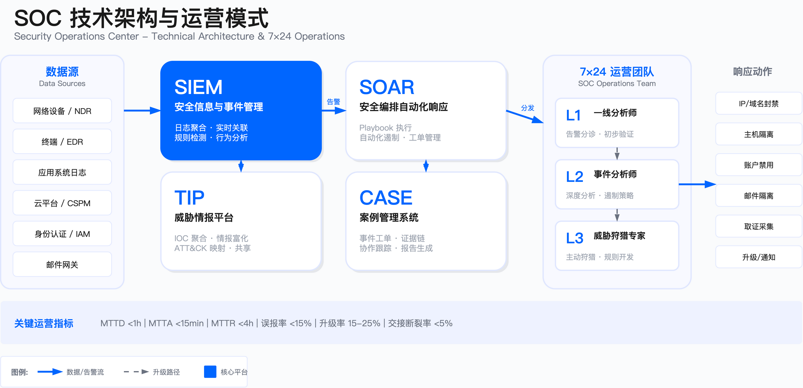

# 11.7　安全监控

安全监控是 SOC 持续运转的核心能力，负责通过自动化检测、人工分析和主动狩猎机制，从海量日志、告警与行为数据中发现、验证并升级威胁事件。本节阐述如何构建从 7×24 运营模式、告警分级处置、智能聚合、误报管理到覆盖度评估的完整监控能力闭环。

---

## 11.7.1 7×24 监控运营模式

SOC 监控运营模式的选择是一项容易被推迟的战略决策。常见的后果是：安全团队在业务快速全球化后才发现，原本为单一时区设计的监控体系无法覆盖海外业务——凌晨两点发生的云环境入侵，要等到第二天早上才被本地分析师发现，此时攻击者已完成横向移动并建立持久化据点。

更隐蔽的问题是"纸面上的 7×24"：安排了夜班值守，但夜班分析师的判断准确率显著下降（内部复盘口径下降 15-25%），高严重性告警被误判为误报而延迟升级。这种"有人值守但无效监控"的状态比明确的监控空白更危险——它制造了虚假的安全感。

### 运营模型选择

选择何种运营模型取决于业务分布、资产价值与预算约束，而非追求理论最优方案。

| 模式 | 适用场景 | 核心优势 | 核心约束 | 不适用场景 |
|------|---------|---------|---------|-----------|
| 集中单点守夜 | 业务集中于单一时区、告警量 <500 条/日 | 成本最低、管理简单 | 夜班疲劳导致准确率下降 15-25%、响应延迟 | 全球化业务、高价值资产跨时区部署 |
| Follow-the-Sun | 全球业务、高价值资产分布于多时区 | 全天候无夜班疲劳、响应时效稳定 | 交接标准化成本高、上下文传递风险 | 预算受限、业务集中于单一区域 |
| 混合托管（MSSP） | 预算受限、非核心时段告警量低 | 成本可控、弹性扩展 | MSSP 对环境熟悉度低、信任边界划定复杂 | 对响应深度要求高、高度定制化检测需求 |

选型决策树：

1. 业务是否覆盖多时区？是 → Follow-the-Sun；否 → 集中单点或混合托管
2. 夜间告警量是否显著？是 → 需专职夜班或 Follow-the-Sun；否 → 可考虑混合托管
3. 安全团队人才储备是否充足？是 → 自建；否 → 混合托管或完全托管
4. 告警处理是否需要深度业务上下文？是 → 自建为主；否 → 可引入 MSSP

量化约束（内部口径）：

- 单人单班次有效告警处理量：80-120 条（含初步分诊与记录），超过此阈值误判率显著上升
- Follow-the-Sun 交接成功率目标：>95%，低于此值需复盘交接流程
- 交接窗口建议时长：30-60 分钟重叠



### 交接机制设计

Follow-the-Sun 模式的失败常因交接断裂导致。交接断裂的根本原因是信息依赖口头传递而非结构化记录——分析师对"当前事件状态"的理解往往掺杂着大量隐性知识，这些知识在口头交接时容易丢失。

标准化交接内容必须以结构化形式记录在工单系统中：

- 当前活跃事件（事件 ID、分类、当前处置阶段、待验证假设）
- 已调整的检测规则（生效时间、调整原因、预期回滚时间）
- 威胁情报更新（新增 IOC、失效指标）

"待验证假设"字段是关键——接班团队不仅需要知道发生了什么，更需要知道前任分析师认为可能发生了什么，这样才能在正确的方向上继续调查，而不是从零开始。

接班验证机制：接班团队在交接完成后 10 分钟内完成三项检查：SIEM 告警队列状态、关键仪表盘数据源健康度、待处理工单数量。发现异常（如数据摄取中断、告警积压超阈值）立即升级。

常见误区：

- 依赖个人记忆完成交接——必须使用标准化工单字段记录，口头复述遗忘率显著
- 交接时段停止新告警处理——交接窗口内需保持监控能力，由夜班负责初步响应，早班负责后续处置
- 未验证工具链健康状态——SIEM 数据摄取中断等隐性故障会在下个时区的交班中才被发现，延误极高

运行指标：

| 指标 | 定义 | 目标阈值 |
|------|------|---------|
| 交接断裂率 | 跨时区事件中出现信息缺失导致重复分析或决策未同步的比例 | <5% |
| 交接延迟 | 接班团队接手第一个告警的时间（从交接窗口结束计起） | <10 分钟 |

---

## 11.7.2 告警分级与处置（一线/二线/三线）

告警分级与处置流程是 SOC 人员效能的关键杠杆。分级机制存在两种极端缺陷，各自导致不同的危害：

升级恐惧症：一线分析师过度升级，二线淹没在噪音中无法专注于真正需要深度分析的事件，威胁狩猎与规则优化等高价值工作被挤压。

升级抑制：一线分析师因流程约束或文化因素（升级被视为"无能"）而过度谨慎，将本应升级的复杂事件自行处置。多阶段攻击常因一线仅处置了初始告警而未识别完整攻击链，攻击者得以在未被检测的阶段继续推进。

分级机制的核心挑战不在于定义层级，而在于设计清晰的升级触发条件与流程激励——让该升级的告警快速升级，让不该升级的告警高效处置。

### 分级模型与职责边界

一线分析师：初步验证告警真实性、执行标准化 Playbook（隔离主机、封禁 IP）、收集初步证据。适用于有明确检测规则与响应步骤的常见威胁（已知恶意域名匹配、弱口令登录尝试）。当告警涉及深度取证需求、需要业务上下文判断或跨系统关联分析时，升级至二线。

"一线可以隔离主机"这句话隐含六项前置能力，缺一项就会在夜间变成一句空话：隔离权限已授予到值班人员（而不是只有管理员能操作）、隔离后仍保留与管理平台的通道以便远程取证、全网批量查询可用、远程取证采集脚本已就绪并测试过、隔离时向用户展示明确说明（否则用户会自行重启重装并破坏证据）、以及重建与恢复流程。逐项的常见缺口见 [15.5.14](../../第05部分_身份网络与业务连续性/第15章_网络基础设施与终端安全/15.5_终端安全管理.md)。身份类响应动作的可逆性分级另有一套判据，撤销会话可全自动、禁用账号须人工，见 [14.10.5](../../第05部分_身份网络与业务连续性/第14章_企业身份与访问管理/14.10_身份威胁检测与响应.md)。

二线（事件分析师）：深度分析攻击手法、确定影响范围（横向移动路径、数据访问范围）、制定遏制策略、与业务团队协调。适用于需要日志深度关联、需要理解业务逻辑、需要跨工具查询（EDR + SIEM + 云平台日志）的场景。

三线（威胁狩猎专家）：主动狩猎未知威胁、开发新检测规则、分析 APT 战术演进、支持红队演练。适用于无明确告警但存在异常模式、需要逆向工程恶意样本、需要对抗性思维推演攻击路径的场景。

### 升级触发条件

一线升级至二线——满足以下任一条件：

- 技术复杂度：涉及多阶段攻击（钓鱼触发→横向移动→数据外带）、未知工具或 0day 利用、云环境 IAM 角色提权
- 业务影响：涉及核心业务系统（支付平台、客户数据库）、敏感数据（PII、财务数据）、高价值资产（代码仓库、密钥管理系统）
- 时间约束：一线在 SLA 时限内无法完成验证或遏制，或告警反复出现无法定位根因

二线升级至三线——满足以下任一条件：

- 对抗性指标：攻击者展示反检测能力（清除日志、禁用 EDR）、使用定制化工具或变种技术、利用合法工具实施攻击（Living off the Land）
- 组织级威胁：怀疑 APT 组织或定向攻击、发现供应链投毒或内部威胁迹象

### 分级响应 SLA 参考

| 告警级别 | 一线响应时限 | 二线响应时限 | 升级触发条件 |
|---------|------------|------------|-------------|
| P1（Critical） | 15 分钟内开始处理 | 30 分钟内接手 | 涉及核心业务系统、数据外泄迹象、APT 指标匹配 |
| P2（High） | 30 分钟内开始处理 | 2 小时内接手 | 涉及敏感数据、多阶段攻击链、已知漏洞利用 |
| P3（Medium） | 2 小时内开始处理 | 8 小时内接手 | 单点异常、低置信度告警、需进一步验证 |
| P4（Low） | 工作日内处理 | 按需升级 | 信息类告警、合规审计、趋势分析 |

SLA 设计原则：时限需可执行（过于激进会导致达标率崩塌）、分级需明确（每个告警只能有一个级别）、升级路径需预定义（一线超时自动升级至二线）。

文化约束：应在团队文化中明确——及时升级是职责，而非失败。延迟升级才是风险。

常见误区：

1. 认为一线不具备技术判断权——一线必须有权在确认已知 IOC 匹配时立即执行隔离，而非等待二线批准
2. 要求所有告警必须经过一线——高价值资产（域控制器、密钥管理系统）的告警可配置为直接路由至二线
3. 将三线定位为仅处理复杂事件——三线应定期参与一线/二线告警复盘（每月部分时间），识别检测规则盲点

运行指标：

| 指标 | 定义 | 参考范围 |
|------|------|---------|
| 升级率 | 一线 → 二线升级比例 | 15-25%。过低可能表示一线误判，过高可能表示一线能力不足 |
| 误升级率 | 升级至二线后被判定为误报的比例 | <10% |
| SLA 达标率 | 在规定时限内开始处理的告警比例 | >90% 为健康，<80% 需立即干预 |

---

## 11.7.3 智能告警聚合与优先级排序

告警过载是现代 SOC 面临的结构性困境，根源不只是告警数量庞大，更在于告警之间的关系未被有效建模。

典型失效模式：一次针对关键数据库的攻击触发了数十条告警——网络层的异常连接告警、主机层的可疑进程告警、应用层的 SQL 注入告警——每条告警被分别路由给不同分析师，各自按 Playbook 执行操作。结果：没有人意识到这是一次协调的攻击，没有人追溯攻击者的完整路径，也没有人评估是否已完成数据外泄。

智能告警聚合的目标不是减少告警数量，而是将"告警集合"转化为"可分析的事件"，让分析师能够理解攻击的完整图景而非处理碎片化的信号。

### 聚合策略

基于 IOC 聚合：将指向同一攻击者基础设施的多个告警聚合，例如同一 C2 域名的多个连接尝试。前提是 IOC 情报准确，否则会导致无关告警被误聚合。

基于攻击链聚合：将符合 MITRE ATT&CK 同一战术序列的告警聚合，例如"初始访问"阶段的钓鱼邮件告警与"执行"阶段的恶意宏告警、"持久化"阶段的注册表修改告警。

基于资产聚合：将针对同一高价值资产的多类型告警聚合。依赖准确的资产清单与分类标签。

基于时间窗口聚合：将时间窗口内的重复告警去重。时间窗口设置需权衡去重效果与时间序列信息保留（内部口径建议 5-15 分钟）。

### 优先级排序因子

优先级排序算法需综合四个维度，单一维度排序无法反映真实风险：

1. 威胁严重性：基于 MITRE ATT&CK 战术阶段（后期战术如"数据外带"高于"侦察"）、CVSS 评分、攻击成功率（已确认利用高于尝试）
2. 资产关键性：基于资产分类标签（核心业务系统、高敏感数据存储），引入业务影响评分（BIA）
3. 威胁情报匹配度：是否匹配已知 APT 组织 TTP、行业定向攻击活动、近期披露的活跃漏洞
4. 上下文异常度：基于 UEBA 行为基线（管理员非工作时间登录、数据库查询量突增）、地理位置异常（UEBA 架构详见 [11.2.5 UEBA 与内部威胁检测](11.2_SOC架构设计.md#1125-ueba-与内部威胁检测)）

### AI 增强的智能告警聚合

传统基于规则的聚合难以适应攻击模式演变。AI 技术可从三个层面增强：

机器学习聚类：使用无监督学习算法（DBSCAN、HDBSCAN）对告警自动分组，无需预定义规则。基于告警特征（源 IP、目标资产、时间序列、ATT&CK 战术）计算相似度，能发现人工规则难以覆盖的隐性模式。

图神经网络关联：将告警建模为图结构（节点为告警，边为关联关系），GNN 通过消息传递学习关联强度，自动识别属于同一攻击活动的告警簇。典型应用：跨时间、跨检测工具的攻击链识别。

LLM 上下文推理：利用大语言模型理解告警文本描述，结合威胁情报和历史事件知识推理语义关联。例如，识别"异常 PowerShell 执行"与"Mimikatz 凭证转储"告警属于同一攻击链。LLM 推理延迟高于规则和 ML，应仅对 ML 置信度较低的告警触发。

AI 在 SOC 告警分诊中的完整技术架构与实现案例，详见 [17.3 AI for SecOps：安全运营智能化](../../第06部分_AI驱动的安全创新/第17章_AI驱动网络安全/17.3_AIforSecOps_AI安全运营.md)。

常见误区：

1. 完全依赖自动化聚合——自动化无法理解业务场景（某次"异常大量数据下载"实为合规审计的合法操作），需保留人工审核机制
2. 聚合窗口设置过长——会导致多个攻击阶段被合并，丢失时间序列关系
3. 优先级算法固定不变——无法适应动态威胁环境，应支持动态调整机制

运行指标：

| 指标 | 定义 | 参考范围 |
|------|------|---------|
| 聚合率 | 聚合后告警数/原始告警数 | 1:5 至 1:20。过低表示聚合规则不足，过高可能过度聚合掩盖威胁 |
| 分析师工作负载 | 每位分析师日均处理聚合后告警数 | 20-40 个（含深度分析）为合理范围 |

---

## 11.7.4 误报处理与规则调优

误报是消耗 SOC 分析师精力的首要因素，也是导致"告警疲劳"后真实威胁被忽视的根本原因。行业痛点不在于误报本身，而在于误报处理的组织方式——许多 SOC 的误报处理呈"救火式"特征：分析师标记误报后关闭工单，不触发任何规则调优动作，相同误报下周再次出现，再次被标记、再次关闭。

另一种常见问题是"调优恐惧"：安全团队担心调优后产生漏报，宁可维持高误报率也不敢调整规则。这种过度保守导致告警队列持续膨胀，分析师对所有告警"草草处理"，反而增加了漏报风险。

### 误报根因分类

| 根因类型 | 示例 | 调优策略 |
|---------|------|---------|
| 检测规则过于宽泛 | "PowerShell 执行"未区分管理员运维与横向移动 | 增加上下文条件或白名单，收窄检测范围 |
| 缺乏上下文信息 | "异地登录"未关联 VPN 日志，误报出差员工 | 关联多数据源丰富上下文 |
| 基线漂移 | 业务高峰期流量突增被判定为 DDoS | 建立动态基线或配置业务日历 |
| 工具误判 | 安全工具将渗透测试工具标记为恶意软件 | 在工具层面配置排除策略 |

### 调优流程

1. 误报分类与统计：定期统计高误报规则（触发规则、资产类型、时间分布）
2. 根因分析：抽查高误报规则的多个实例，记录共性特征（时间段、用户组、业务流程）
3. 规则优化：添加白名单、调整阈值（同步评估风险容忍度）、增加上下文关联条件、调整时间窗口
4. 灰度验证：调整后先在小范围资产运行，监控误报率与漏报率变化
5. 正式发布与持续监控：全量发布后持续跟踪，定期复核检测有效性

关键设计原则：调优后必须验证是否产生新漏报（通过红队演练）。不能仅评估误报率下降，还要确认真阳性检测率未下降。

常见误区：

1. 直接关闭高误报规则——某规则即使误报率较高，也可能捕获了关键威胁。应先分析真实告警特征，提炼为新规则后再关闭旧规则
2. 调优仅由 SOC 团队完成——合法的批量操作、季节性流量变化等业务信息必须由业务团队提供
3. 无限期保留已调优规则——业务环境变化会导致规则重新产生误报，需定期复核

运行指标：

| 指标 | 定义 | 参考阈值 |
|------|------|---------|
| 误报率 | 误报告警数/总告警数 | 初期 <30%，成熟期 <15% |
| 规则调优周期 | 从识别高误报规则到完成调优发布的平均时长 | <2 周为合理，>1 个月表示流程阻塞 |

---

## 11.7.5 监控覆盖度评估

监控覆盖度评估的行业常见问题是"覆盖度幻觉"：安全团队统计出高覆盖率（如"MITRE ATT&CK 战术覆盖率达 90%"），但这个数字仅反映"有规则"，不反映"规则有效"。**统计口径还有一个易被忽略的前提——ATT&CK 的技术总数每年都在变**：2026 年 4 月的 v19 把 Enterprise 扩展到 15 个战术、222 项技术与 475 项子技术，并将原"防御规避"拆为"隐蔽"与"防御削弱"两个战术[1]，跨版本对比覆盖率必须先说明基于哪个版本。

典型陷阱：规则存在但从未触发过告警（可能是规则逻辑错误或数据源缺失）；规则覆盖了某技术但仅适用于特定工具（只检测 Mimikatz 但不检测 LaZagne）；规则在测试环境有效但在生产环境因日志格式差异而失效。

有效的覆盖度管理需要从"统计规则数量"转向"验证检测能力"，从"一次性评估"转向"持续监控"。

### 覆盖度评估矩阵

| 维度 | 测量方法 | 目标参考 | 盲点风险 |
|------|---------|---------|---------|
| 数据源覆盖 | 已接入日志源/应接入日志源 | >95% 核心资产 | 未接入资产无法检测任何威胁 |
| 资产覆盖 | 已监控资产/资产清单总数 | 100% 高价值资产 | 盲点资产可能成为攻击跳板 |
| ATT&CK 战术覆盖 | 已覆盖技术数/相关技术总数 | >80% 相关战术 | 特定攻击阶段无检测能力 |
| 时间覆盖 | 日志保留时长 | 热存储 90 天，归档 1-7 年 | 无法回溯分析长期潜伏攻击 |
| 检测规则有效性 | 近 90 天内触发过真实威胁的规则比例 | >30% | 冗余规则消耗资源但无价值 |

资产覆盖度需分类统计：终端（EDR 部署率）、服务器（日志代理安装率）、网络设备（流量镜像/NetFlow 覆盖率）、云资源（CSPM 扫描覆盖率）。不同类型的盲点风险和修复难度各不相同。

### 覆盖度评估方法

MITRE ATT&CK 映射：使用 DeTT&CT[2] 或 ATT&CK Navigator[3] 生成热力图，直观展示已覆盖与盲点技术分布。热力图红色区域（无覆盖 + 高威胁 TTP）是优先建设目标。

红队演练验证：设计覆盖 ATT&CK 常见技术的攻击场景（凭证窃取→横向移动→数据外带），执行后统计被 SOC 检测到的阶段数。此方法验证理论覆盖度与实际检测能力的差距——这个差距通常比预期大。

日志盲点扫描：使用自动化工具（osquery、Wazuh）扫描未安装日志代理的资产、未配置审计的服务、未启用流量监控的网络段。可发现资产清单与实际监控之间的偏差。

常见误区：

1. 将覆盖度等同于规则数量——需引入"有效覆盖度"指标（规则在一定时间内至少触发过真实威胁）
2. 仅关注技术覆盖而忽略资产覆盖——某技术虽有检测规则但未部署至关键资产（如数据库服务器未安装 EDR），实际覆盖度为零
3. 静态评估不持续更新——业务系统上线、新攻击技术披露、架构变更均会改变覆盖度要求

运行指标：

| 指标 | 定义 | 参考阈值 |
|------|------|---------|
| ATT&CK 战术覆盖率 | 已覆盖战术数/核心战术数 | 成熟 SOC 目标 >80% |
| 高价值资产监控率 | 核心业务系统、敏感数据存储的监控覆盖率 | 应为 100%，任何盲点均为高风险 |
| 检测规则有效性比例 | 近期触发过真实威胁的规则数/总规则数 | 低于 30% 需清理冗余规则 |

---

## 11.7.6 监控关键指标（MTTD/MTTR/MTTA）

MTTD、MTTA、MTTR 是度量 SOC 效能的核心指标，但在实践中常被误用。三种常见误用：

指标游戏：调整测量口径（如将"开始处理"定义为"分配工单"而非"实际分析"），或选择性统计（排除"复杂事件"以降低 MTTR）。这种优化指标而非优化能力的做法，最终导致管理层基于失真数据做出错误决策。

平均值陷阱：MTTD 平均值 2 小时看起来不错，但可能掩盖了大多数告警 30 分钟内检测而少量 APT/内部威胁数周后才发现的分布。这些长尾事件是最危险的，平均值完全无法反映这一风险。建议同时报告 P95 值。

指标孤立：仅关注 MTTD/MTTR 而不关联业务影响，可能导致资源错配——将大量精力投入优化低风险告警的响应速度，而忽视高风险资产的检测覆盖度。

### 测量与优化

缩短 MTTD：

- 部署行为检测（UEBA）与威胁狩猎，主动发现未触发规则的威胁
- 优化检测规则逻辑，将离线批处理规则改为实时流式检测
- 引入威胁情报实时关联（见 11.6），缩短从 IOC 披露到检测生效的窗口

缩短 MTTA：

- 实施告警优先级排序，确保高风险告警在队列顶部
- 配置告警自动分发规则，将特定类型告警直接路由至专项团队
- 引入 SOAR 自动化执行无需人工判断的遏制动作（见 11.5.3）

缩短 MTTR：

- 开发标准化 Playbook，减少分析师决策时间
- 预集成响应工具（EDR、防火墙、IAM）至 SOAR 实现一键遏制
- 建立战时指挥室（War Room）机制，重大事件时集结跨职能团队同步决策

MTTD/MTTA/MTTR 的精确定义和 P1 事件目标值，见 11.5.2（时间指标计算说明）。本节聚焦监控运营视角下的改进策略，而非指标的首次定义。

---

## 11.7.7 监控能力闭环与持续改进

SOC 能力建设的终极挑战不是部署工具或配置规则，而是建立持续改进的闭环机制。行业中大量 SOC 陷入"救火循环"：每天处理告警、响应事件，但从不回头分析为什么某些攻击未被检测、为什么某些响应延迟过长、为什么某些规则持续产生误报。

这种"只处理不改进"的模式有其组织根源：分析师的 KPI 是"处理了多少告警"而非"改进了多少规则"，事件响应团队的压力是"尽快关闭工单"而非"彻底分析根因"，管理层关注的是"本月没有重大事件"而非"检测能力是否提升"。

闭环机制的核心价值在于将每一次事件——无论成功检测还是漏报——转化为组织学习的机会。成功检测的事件需要分析"为什么这次检测到了，是规则设计合理还是攻击者犯了错"；漏报事件需要分析"盲点在哪里，是数据源缺失、规则逻辑缺陷还是攻击者使用了新技术"。

### 闭环模型

监控能力需形成完整闭环，否则会陷入"检测到威胁但不改进"的被动循环。闭环包含五个阶段：监控阶段持续采集日志、告警与行为数据；检测阶段通过规则、机器学习、威胁狩猎发现威胁；响应阶段执行遏制、根除、恢复动作；复盘阶段进行事件后分析，识别检测盲点、响应延迟根因、流程缺陷；优化阶段更新检测规则、调整告警阈值、补充数据源、优化 Playbook。

闭环的关键在于复盘结论必须转化为可执行的改进措施，且改进措施必须被跟踪至完成。

### 复盘机制

每起重大事件（高严重性或影响核心业务）需在事件关闭后及时完成复盘。

时间线重建：还原攻击者每个操作的时间点、使用的工具、访问的资产、窃取的数据。这是后续分析的基础。

检测有效性评估：分析哪些阶段被 SOC 检测到、哪些阶段未检测（盲点）、检测延迟是否在 SLA 内。此分析识别检测能力的薄弱环节。

响应有效性评估：分析遏制动作是否及时、是否成功阻止横向移动或数据外带、是否存在误操作（如误隔离正常业务系统）。此分析识别响应流程的改进点。

根因分析：识别盲点根因（数据源缺失、规则逻辑缺陷、威胁情报滞后）与延迟根因（人员不足、工具故障、流程阻塞）。

改进措施：列出具体行动项（开发新检测规则、部署新数据源、优化 Playbook）、责任人、完成时限。措施需具体可执行、可验收。

常见误区：

1. 复盘仅关注失败事件——成功遏制的事件同样需要复盘，识别流程中的低效环节
2. 复盘结论无人执行——改进措施需纳入项目管理流程，分配责任人并设置截止日期
3. 复盘信息未共享——复盘报告应在 SOC 内部、红队、GRC 团队之间共享，形成组织学习

运行指标：

| 指标 | 定义 | 参考阈值 |
|------|------|---------|
| 改进措施完成率 | 已实施改进措施数/计划改进措施总数 | 较低时需升级至管理层介入 |
| 检测盲点修复率 | 本季度修复的 ATT&CK 技术盲点数/识别出的盲点总数 | 持续跟踪趋势 |

---

## 11.7.8 NOC 与 SOC 的数据与流程融合

IT 运维团队（NOC）与安全运营团队（SOC）监控同一套基础设施，处理的告警常常指向同一个根因，却各自使用独立的监控平台、独立的告警队列、独立的响应流程。这个割裂是组织分工和工具采购历史留下的，与用不用 AI 无关，因此也可以脱离 AI 议题单独解决——本节讨论的就是这部分工程问题。

> 本节不讨论 AI 在 SOC 里承担多少工作、放权到哪一级。那是另一条线，全书用统一的自主等级 L0–L5 讨论，见 [11.11.1 AI/ML 驱动的自主 SOC](11.11_SOC未来趋势.md#11111-aiml-驱动的自主-soc)（规划视角）与 [17.3 AI for SecOps](../../第06部分_AI驱动的安全创新/第17章_AI驱动网络安全/17.3_AIforSecOps_AI安全运营.md)（实现视角）。把 NOC/SOC 融合和 AI 自主化混为一谈，容易得出"上了智能体就顺带把两个中心合了"的错误结论：数据打通和组织打通该做的功课，一件也不会少。

割裂造成的损失有三类，都可以被观测到：

告警重复。同一事件在 NOC 产生性能告警（如"数据库 CPU 飙升"），在 SOC 产生安全告警（如"数据库异常查询"），两个团队分别处理却不知道是同一根因，人力按两份算。

根因分析割裂。安全事件的根因可能是运维配置错误（防火墙规则变更导致暴露），运维事件的根因可能是安全攻击（DDoS 导致服务降级）。任一侧单独看自己的数据都得不出结论，跨侧关联又没有现成通道。

响应协调低效。重大事件需要两边协同，但缺乏统一的事件管理平台和指挥机制，协调靠临时拉群，升级路径在事中现商量。

### 融合的三个技术落点

统一基线。运维侧对基础设施指标（CPU、内存、网络流量）建立的动态基线，安全侧可以直接复用，把"业务异常"和"安全异常"放在同一张时间线上比对。例如某服务器在凌晨 3 点 CPU 异常飙升，运维侧标记为容量异常，SOC 顺着这条线索查下去发现是挖矿程序。基线本身是运维产物，安全侧不必重建一套。

拓扑与依赖数据。运维侧维护的服务依赖拓扑，是安全事件根因定位的现成输入：告警触发时可以立即回答"这台机器刚做过什么变更、它依赖的服务是否正常、网络路径有没有变化"，把分析师原本要人工问一圈的信息前置到告警上下文里。

变更关联。把 CMDB 与变更管理系统接进告警管道，让"变更事件"与"安全告警"自动对齐时间窗。例如某防火墙规则变更后 2 小时内出现外部扫描告警，系统直接给出"可能因变更导致暴露"的关联提示。这是投入产出比最高的一项，因为变更数据本来就是结构化的，接进来主要是打通权限和字段映射。

### 融合程度的四档选择

融合不是一步到位的组织合并，实践中按数据与流程的耦合深度分四档，越往下收益越大、代价也越大：

| 融合档位 | 描述 | 适用场景 | 实施复杂度 |
|---------|------|---------|-----------|
| 数据共享 | 运维监控与 SIEM 共享数据源，各自分析 | 组织尚未准备好流程整合 | 低 |
| 告警关联 | 两侧告警在统一平台按资产、时间窗、变更单关联 | 需要跨团队可见性 | 中 |
| 统一根因分析 | 安全事件与运维事件使用同一套根因分析与拓扑数据 | 追求分析效率最大化 | 中高 |
| 融合运营中心 | NOC 与 SOC 合并为统一运营中心（Unified Operations Center） | 成熟组织、资源整合需求 | 高 |

多数组织停在"告警关联"这一档是合理的：它拿到了跨侧可见性的大部分收益，又不需要动组织架构。往下两档要不要走，取决于两个中心是否本来就同属一条管理线。

### 融合的组织与工程障碍

组织边界：NOC 与 SOC 通常隶属不同管理线（IT 与安全），融合需要高层支持与组织架构调整。渐进式方法是先建立"联合值班"机制，在重大事件时协同响应，跑顺了再谈平台合并。

技能差异：运维工程师与安全分析师技能集不同。培训计划应包括基础安全意识（针对运维）与基础运维知识（针对安全），逐步培养"全栈运营"人才。这一项的周期通常被低估，按季度计不现实，按年计才接近实际。

工具整合：运维监控平台与 SIEM/SOAR 的集成需要 API 对接、数据格式映射、告警去重逻辑。采用开放数据格式（如 OCSF）能降低后续更换任一侧平台的代价，比绑定单一厂商生态更耐久。

---

## 11.7.9 Security + Observability 融合

在云原生环境里，可观测性（Observability）与安全监控用同一批数据回答不同的问题，融合已经是多数团队的既有做法而非规划项。传统安全监控聚焦于"检测恶意行为"，可观测性聚焦于"理解系统状态"——但在现代分布式系统中，这两个目标高度重叠：理解正常行为是检测异常的前提，而安全事件往往表现为系统状态的异常变化。真正的问题不在要不要融合，而在采集口径、保留期和成本由谁承担。

### 可观测性三支柱与安全映射

```
┌─────────────────────────────────────────────────────────────────────────┐
│              可观测性三支柱 × 安全监控融合                               │
├─────────────────────────────────────────────────────────────────────────┤
│                                                                         │
│   ┌──────────────────┐  ┌──────────────────┐  ┌──────────────────┐     │
│   │     Metrics      │  │      Logs        │  │     Traces       │     │
│   │     (指标)       │  │     (日志)       │  │     (链路)       │     │
│   ├──────────────────┤  ├──────────────────┤  ├──────────────────┤     │
│   │ 运维：           │  │ 运维：           │  │ 运维：           │     │
│   │ • CPU/内存/网络  │  │ • 应用日志       │  │ • 请求延迟分布   │     │
│   │ • 请求吞吐量     │  │ • 错误日志       │  │ • 服务依赖拓扑   │     │
│   │ • 错误率         │  │ • 审计日志       │  │ • 性能瓶颈定位   │     │
│   ├──────────────────┤  ├──────────────────┤  ├──────────────────┤     │
│   │ 安全：           │  │ 安全：           │  │ 安全：           │     │
│   │ • 异常流量基线   │  │ • 安全事件日志   │  │ • 攻击路径追踪   │     │
│   │ • 认证失败率     │  │ • 访问日志       │  │ • 数据流向追踪   │     │
│   │ • API 调用异常   │  │ • 变更日志       │  │ • 横向移动检测   │     │
│   └──────────────────┘  └──────────────────┘  └──────────────────┘     │
│                                   │                                     │
│                                   ▼                                     │
│              ┌────────────────────────────────────────┐                │
│              │      统一可观测性 + 安全平台           │                │
│              │  ┌────────────┐  ┌────────────────┐   │                │
│              │  │ 关联分析   │  │ 上下文丰富     │   │                │
│              │  └────────────┘  └────────────────┘   │                │
│              └────────────────────────────────────────┘                │
│                                                                         │
└─────────────────────────────────────────────────────────────────────────┘
```

Metrics + Security：可观测性平台收集的指标数据可作为安全基线的数据源。例如，Prometheus 收集的 API 调用指标可用于检测异常调用模式（如某 API 调用量突增 10 倍），Grafana 仪表板可同时展示性能指标与安全指标。

Logs + Security：日志是安全监控的核心数据源，可观测性平台（如 ELK、Loki）与 SIEM 的边界日益模糊。现代实践是使用统一日志管道（如 OpenTelemetry Collector）将日志同时路由至可观测性平台与 SIEM，或使用同一平台（如 Elastic）同时支持运维与安全用例。

Traces + Security：分布式追踪（如 Jaeger、Zipkin）记录请求在微服务之间的完整路径，这恰好是安全团队追踪攻击链的关键数据。例如，攻击者通过 API Gateway 入侵后横向移动至数据库服务，Trace 数据可清晰展示这一路径。

### OpenTelemetry 与安全数据采集

OpenTelemetry（OTel）已经是可观测性数据采集的事实标准，主流后端普遍支持 OTLP，选型时的问题不再是"要不要用 OTel"，而是安全侧该复用到什么程度。安全团队可复用 OTel 基础设施：

```yaml
# OpenTelemetry Collector 安全增强配置示例
receivers:
  otlp:
    protocols:
      grpc:
        endpoint: 0.0.0.0:4317
  # 安全日志接收器
  filelog:
    include:
      - /var/log/auth.log
      - /var/log/audit/audit.log
    operators:
      - type: regex_parser
        regex: '^(?P<timestamp>\S+)\s+(?P<host>\S+)\s+(?P<program>\S+):\s+(?P<message>.*)$'

processors:
  batch:
    timeout: 10s
  # 安全上下文增强
  attributes:
    actions:
      - key: security.classification
        action: insert
        value: "audit"
      - key: environment
        from_attribute: host.name
        action: insert

exporters:
  # 可观测性目标
  otlp/observability:
    endpoint: observability-backend:4317
  # 安全分析目标
  otlp/security:
    endpoint: siem-backend:4317

service:
  pipelines:
    logs/security:
      receivers: [filelog]
      processors: [batch, attributes]
      exporters: [otlp/observability, otlp/security]
```

这份配置展示了"一次采集，双向路由"的设计思路：安全日志（auth.log、audit.log）通过同一 OTel Collector 分别发往可观测性后端和 SIEM 后端，避免在每台主机上部署两套采集 Agent。`security.classification` 属性在 processor 层注入，使下游的安全分析平台能够按此字段过滤。

### 融合实践要点

数据模型统一：可观测性数据（OTel Semantic Conventions）与安全数据（ECS、OCSF）需要映射。建议在数据管道层完成格式转换，确保下游分析平台可理解。

查询语言互通：运维团队使用 PromQL 查询指标，安全团队使用 SPL/KQL 查询日志。统一平台应支持多种查询语言或提供可视化查询构建器。

告警去重：同一根因可能在可观测性平台与安全平台分别触发告警。需建立跨平台告警去重机制，避免分析师重复处理。

运行指标：

| 指标 | 定义 | 目标参考 |
|------|------|---------|
| 数据管道统一率 | 通过统一管道采集的数据源比例 | >80% |
| 跨平台告警关联率 | 可观测性告警与安全告警自动关联的比例 | >50% |
| 上下文丰富度 | 安全告警携带可观测性上下文（服务拓扑、依赖关系）的比例 | >70% |

---

## 11.7.10 安全监控成熟度模型（SMMM）

安全监控能力的建设是一个渐进过程，不同发展阶段的组织面临不同的挑战与优先级。成熟度模型提供了评估当前状态、识别改进方向的结构化框架。

### 五级成熟度模型

```
┌─────────────────────────────────────────────────────────────────────────┐
│                    安全监控成熟度模型 (SMMM)                             │
├─────────────────────────────────────────────────────────────────────────┤
│                                                                         │
│  Level 5 ──────────────────────────────────────────────────────────────│
│  优化级     │ • AI 驱动的自适应检测                                     │
│  Optimizing │ • 预测性安全运营                                          │
│             │ • 持续自动化改进                                          │
│  ───────────┼───────────────────────────────────────────────────────── │
│  Level 4    │ • 威胁狩猎常态化                                          │
│  托管级     │ • 检测规则版本化管理（Detection-as-Code）                 │
│  Managed    │ • 完整 MTTD/MTTR 度量与优化                               │
│  ───────────┼───────────────────────────────────────────────────────── │
│  Level 3    │ • MITRE ATT&CK 覆盖度可视化                               │
│  已定义     │ • SOAR 自动化响应                                         │
│  Defined    │ • 结构化 Playbook                                         │
│  ───────────┼───────────────────────────────────────────────────────── │
│  Level 2    │ • 集中式 SIEM 部署                                        │
│  可重复     │ • 基础告警分级 (L1/L2)                                    │
│  Repeatable │ • 人工告警处理流程                                        │
│  ───────────┼───────────────────────────────────────────────────────── │
│  Level 1    │ • 分散式日志存储                                          │
│  初始级     │ • 被动响应（事后分析）                                    │
│  Initial    │ • 无标准化流程                                            │
│             │                                                           │
└─────────────────────────────────────────────────────────────────────────┘
```

### 各级成熟度特征

| 级别 | 检测能力 | 响应能力 | 人员配置 | 工具成熟度 | 典型组织 |
|------|---------|---------|---------|-----------|---------|
| Level 1 初始 | 依赖安全产品自带告警 | 事后被动响应 | 无专职安全运营 | 独立安全产品 | 初创企业、小型组织 |
| Level 2 可重复 | SIEM 集中告警、基础关联规则 | 人工处理、有基础流程 | 专职 SOC 分析师 | SIEM + 基础响应工具 | 成长期企业 |
| Level 3 已定义 | ATT&CK 映射检测、结构化规则库 | SOAR 自动化、标准 Playbook | 分级团队 (L1/L2/L3) | SIEM + SOAR + TIP 集成 | 中型企业、有合规要求 |
| Level 4 托管 | 威胁狩猎常态化、Detection-as-Code | 持续优化、度量驱动改进 | 专职威胁狩猎团队 | 完整 SecOps 工具链 | 大型企业、高风险行业 |
| Level 5 优化 | AI 驱动自适应检测、预测性分析 | 自动化闭环、持续自我优化 | 跨职能融合团队 | AI 增强平台 | 技术领先型组织 |

### 成熟度评估维度

每个级别需从以下八个维度综合评估：

```yaml
maturity_assessment_framework:
  dimensions:
    - name: "数据采集覆盖度"
      level_1: "仅关键系统日志"
      level_2: "核心资产全覆盖"
      level_3: "包含网络流量、终端行为"
      level_4: "云原生、容器、API 全覆盖"
      level_5: "动态资产自动发现与纳管"

    - name: "检测规则成熟度"
      level_1: "厂商默认规则"
      level_2: "基于 IOC 的规则"
      level_3: "基于 TTP 的规则 + ATT&CK 映射"
      level_4: "Detection-as-Code + CI/CD"
      level_5: "AI 动态规则生成"

    - name: "告警处理效率"
      level_1: "无 SLA"
      level_2: "人工分诊、基础 SLA"
      level_3: "智能聚合、优先级排序"
      level_4: "MTTD/MTTR 持续优化"
      level_5: "自动化闭环、零人工常规告警"

    - name: "响应自动化程度"
      level_1: "纯人工"
      level_2: "脚本辅助"
      level_3: "SOAR Playbook"
      level_4: "复杂编排、跨平台联动"
      level_5: "自适应响应、AI 决策支持"

    - name: "威胁狩猎能力"
      level_1: "无"
      level_2: "事件驱动的临时狩猎"
      level_3: "定期狩猎计划"
      level_4: "假设驱动的常态化狩猎"
      level_5: "AI 辅助狩猎、自动化假设生成"

    - name: "度量与改进"
      level_1: "无度量"
      level_2: "基础报表"
      level_3: "KPI 仪表板"
      level_4: "趋势分析、根因追踪"
      level_5: "预测性分析、自动优化建议"

    - name: "人员能力"
      level_1: "IT 兼职"
      level_2: "入门级 SOC 分析师"
      level_3: "分级专业团队"
      level_4: "专家级 + 威胁研究员"
      level_5: "跨职能 + AI 协作"

    - name: "工具集成度"
      level_1: "独立工具"
      level_2: "部分集成"
      level_3: "API 联动"
      level_4: "统一数据平面"
      level_5: "智能融合平台"
```

### 成熟度提升路径

Level 1 → Level 2：建立集中式日志管理（SIEM），定义基础告警分级与处置流程，配置专职安全运营人员。

Level 2 → Level 3：部署 SOAR 实现响应自动化，建立 ATT&CK 覆盖度评估机制，开发结构化 Playbook。

Level 3 → Level 4：建立威胁狩猎团队与常态化狩猎计划，实施 Detection-as-Code 实践，建立 MTTD/MTTR 度量体系。

Level 4 → Level 5：引入 AI 增强检测与响应能力，实现预测性安全运营，建立自动化持续改进机制。

运行指标：

| 指标 | 定义 | 说明 |
|------|------|------|
| 当前成熟度级别 | 八维度综合评估结果 | 取各维度最低值作为整体级别 |
| 目标成熟度差距 | 目标级别 - 当前级别 | 指导投资优先级 |
| 维度均衡性 | 各维度级别标准差 | 差距过大需优先补齐短板 |

---

## 本节小结

安全监控是 SOC 的核心能力，其有效性取决于运营模式设计（7×24 覆盖与交接机制）、告警处理效率（分级处置与智能聚合）、误报管理（持续调优）、覆盖度保障（MITRE ATT&CK 映射）以及关键指标优化（MTTD/MTTA/MTTR）。监控能力需形成持续改进闭环，通过事件复盘识别盲点、通过红队演练验证有效性、通过自动化降低人力依赖。

本节后半部分讨论的三件事都属于工程建设而非趋势判断：NOC 与 SOC 的数据与流程融合打破两侧的信息壁垒，让根因分析和协同响应有统一入口；Security + Observability 融合把安全数据与可观测性数据统一采集、关联分析，提升攻击路径追踪能力；成熟度驱动的能力建设给出从初始级到优化级的演进路径。三件事都不依赖 AI 能力就成立，AI 在其上能加多少速，按 11.11.1 的自主等级另行判断。

企业应基于业务风险容忍度与资源约束，分阶段构建从基础监控到威胁狩猎、从人工处置到 SOAR 自动化的能力演进路径。

> 与 AI 能力的融合：安全监控与 AI 技术的深度结合是实现 Level 5 成熟度的关键路径。关于 AI 驱动的告警分诊、智能聚合、自动化根因分析等内容，请参阅 [第 17.3 节：AI for SecOps](../../第06部分_AI驱动的安全创新/第17章_AI驱动网络安全/17.3_AIforSecOps_AI安全运营.md)，其中详细介绍了 ML 告警聚类、LLM 辅助分析、AI Copilot 在 SOC 中的应用实践。

关键行动项

1. 运营模式选型：根据业务时区分布与预算选择集中式、Follow-the-Sun 或混合托管模式
2. 告警分级落地：建立 L1/L2/L3 职责边界与 SLA 框架，避免责任真空
3. 智能聚合部署：基于 IOC、攻击链、资产维度实施告警聚合，降低分析师工作负载
4. 误报治理机制：建立规则调优闭环，定期清理低效规则
5. 覆盖度可视化：使用 ATT&CK Navigator 识别检测盲点，指导规则开发优先级
6. 指标持续监控：建立 MTTD/MTTA/MTTR 仪表板，按资产分级设定差异化目标
7. NOC/SOC 融合：按四档模型确定目标档位，优先打通变更数据与告警的关联
8. 可观测性统一：采用 OpenTelemetry 等标准实现安全与运维数据统一采集
9. 成熟度评估：定期进行成熟度自评，制定阶段性能力提升计划

---

## 参考文献

| # | 来源 | 标题 | 日期 | 链接 |
| --- | --- | --- | --- | --- |
| [1] | MITRE | ATT&CK v19 发布说明（Enterprise 15 战术 / 222 技术 / 475 子技术；Defense Evasion 拆分为 Stealth 与 Defense Impairment） | 2026-04-28 | <https://attack.mitre.org/resources/updates/updates-april-2026/> |
| [2] | Rabobank CDC | DeTT&CT: Detect Tactics, Techniques & Combat Threats（数据源质量与 ATT&CK 覆盖度评分工具） | 持续更新 | <https://github.com/rabobank-cdc/DeTTECT> |
| [3] | MITRE | ATT&CK Navigator | 持续更新 | <https://mitre-attack.github.io/attack-navigator/> |

---

## 导航

[← 上一节：11.6 威胁情报运营](./11.6_威胁情报运营.md) | [返回章节目录](./README.md) | [下一节：11.8 漏洞管理 →](./11.8_漏洞管理.md)

---

© 2025-2026 AISecOps Project. Licensed under CC BY-NC-SA 4.0
