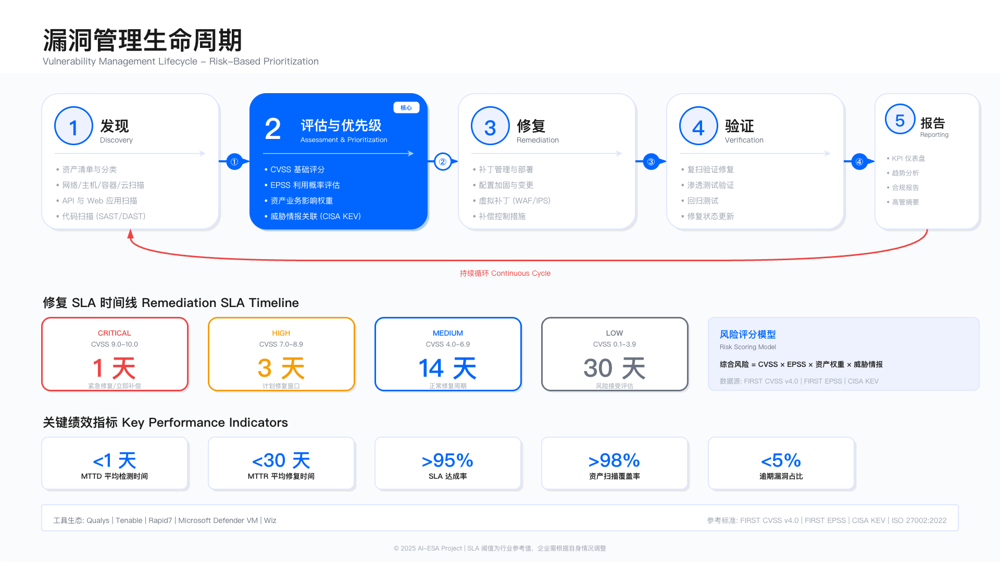

# 11.8　漏洞管理

漏洞管理是 SOC 的持续性工作，负责从资产发现、漏洞扫描、风险评估到补丁修复的完整闭环。有效的漏洞管理不是追求零漏洞——这在复杂环境中并不现实——而是确保高风险漏洞在合理时间窗口内得到修复或缓解，使攻击者无法利用已知弱点在系统中立足。

核心挑战在于：扫描工具产生的发现数量远超团队修复能力。如果不加区分地要求修复所有漏洞，会造成业务中断、团队疲劳和优先级错位。基于风险的优先级排序（Risk-Based Vulnerability Management，RBVM）因此成为现代漏洞管理的核心方法。



---

## 11.8.1 漏洞管理生命周期

漏洞管理的行业痛点不在于缺乏流程定义，而在于流程各环节之间的断裂。

典型的问题模式：扫描团队完成扫描后将报告发送给安全团队，安全团队评估后将修复任务分配给 IT 运维，IT 运维在变更窗口后完成修复，但无人验证修复是否成功。数周后，同一漏洞再次出现在扫描报告中——可能是补丁回退、配置漂移或部署不完整。更糟糕的是，如果扫描与修复之间没有跟踪机制，团队甚至无法确定这是"老漏洞未修复"还是"新漏洞出现"。

另一个常见问题是"前重后轻"：组织在扫描和评估环节投入大量资源，但在修复和验证环节缺乏投入——修复依赖业务团队的"自觉"，验证依赖下一次扫描的"碰运气"。这种不平衡导致扫描报告越积越多，但实际风险降低有限。

有效的漏洞管理需要完整的闭环：每个阶段的输出必须成为下一阶段的输入，每次修复必须有验证，每个例外必须有跟踪。

### 阶段 1：资产发现与清点

修复漏洞的前提是知道哪些资产存在。资产清单需要包含业务属性（所属业务线、数据分类、合规要求）和技术属性（操作系统版本、运行服务、网络位置）。

适用边界：传统资产清单工具适用于有固定网络边界的环境。对于频繁变化的容器集群或无服务器函数，需要结合 Kubernetes API 或云原生工具实时获取资产状态——传统工具的刷新周期可能是天级，而容器的生命周期可能是分钟级。

常见误区：认为资产清单只需在项目初期建立一次。资产会因业务扩张、DevOps 自动化部署、影子 IT 而不断变化，清单过时会使扫描覆盖率下降，盲点资产成为攻击入口。

验证方法：定期抽查业务系统，对比资产清单与实际在线资产（通过网络扫描或云 API 查询），检查遗漏率。遗漏率超过预设阈值时，触发资产发现流程改进。

### 阶段 2：漏洞扫描与发现

扫描频率取决于资产变更速度和风险承受度：互联网暴露资产每周扫描是常见做法；内部开发环境每月扫描可能已足够；容器镜像应在 CI/CD 流水线中每次构建时扫描，而不是等部署后再扫描。

关键约束：扫描会产生网络流量和主机负载，生产环境需要限速或选择低峰时段。某些老旧系统（如工控设备）可能因扫描探测而崩溃，需要使用被动监测或人工审查代替主动扫描。

常见误区：认为扫描频率越高越安全。过度扫描会产生重复告警、消耗修复团队精力、影响业务稳定性。扫描频率应与修复能力匹配——如果团队每月只能修复 100 个漏洞，每天扫描的意义不大。

### 阶段 3：漏洞评估与分类

扫描工具输出的原始结果包含大量噪音（误报、低危漏洞、已知例外）。评估阶段需要确认漏洞是否真实存在、是否可被利用、影响哪些业务。

分类维度：严重性（Critical/High/Medium/Low）、可利用性（是否有公开 PoC）、资产暴露面（互联网暴露/内网隔离/生产/测试）、业务影响（核心业务/支撑系统/开发环境）。

常见误区：完全依赖 CVSS 评分决定优先级。CVSS 反映漏洞的技术特性，但不考虑特定环境上下文。一个 CVSS 9.8 的 RCE 漏洞如果存在于完全隔离的测试环境，其实际风险可能低于 CVSS 7.5 的漏洞存在于互联网暴露的生产系统。

### 阶段 4：修复与缓解

修复方式包括打补丁、升级版本、配置加固、隔离风险资产或应用虚拟补丁。当系统无法立即打补丁时（如关键业务系统需要变更窗口、老旧系统无补丁可用），缓解措施是必要的过渡手段：网络层隔离、WAF 规则阻断已知攻击模式、禁用易受攻击功能、增强监控（对无法立即修复的资产加强日志审计和异常检测）。

关键约束：补丁部署需要业务团队配合（变更窗口、回归测试）。安全团队无法单方面决定何时重启生产系统或升级数据库版本。修复 SLA 需要与业务团队协商，而非单方面强制执行。

常见误区：认为安全团队应对漏洞修复负全责。漏洞修复涉及业务系统变更，责任主体是业务系统所有者或 DevOps 团队。安全团队的角色是发现漏洞、评估风险、提供修复建议和技术支持，并跟踪修复进度。

### 阶段 5：验证与复测

修复完成后需要验证漏洞是否真正消除。对于高危漏洞，应由安全团队或第三方进行独立验证，而非仅依赖业务团队的自我确认。

常见误区：认为补丁部署后漏洞一定消失。补丁可能因回退、配置错误或部署不完整而失效——集群环境中只有部分节点应用了补丁、负载均衡器未更新健康检查导致新节点未启用，这些都是真实发生过的案例。

### 阶段 6：持续监控与闭环

新漏洞通过 CVE 公告、威胁情报、供应商通知等渠道不断出现，需要每日检查是否影响现有资产。对于高关注度漏洞（如 Log4Shell 等广泛利用的漏洞），应在较短时间内完成影响评估并发布内部通报。

---

## 11.8.2 漏洞扫描策略

### 扫描策略对比

| 扫描类型 | 适用场景 | 核心优势 | 核心约束 | 不适用场景 |
|---------|---------|---------|---------|-----------|
| 网络扫描 | 有固定 IP 的服务器、网络设备 | 无需安装 Agent、覆盖范围广 | 依赖网络可达性、无法发现应用层漏洞 | 容器、NAT 环境、隔离网段 |
| Agent 扫描 | 终端、服务器、移动办公设备 | 信息准确、不受网络限制 | 需安装维护 Agent、消耗主机资源 | 工控设备、嵌入式系统 |
| 容器镜像扫描 | 容器化应用、DevSecOps | 左移安全、阻断风险镜像 | 仅覆盖构建时、需定期重扫 | 非容器化应用 |
| 云配置扫描（CSPM） | IaaS、PaaS、SaaS 资源 | 发现配置错误、合规检查 | 依赖 API 权限、多云需统一工具 | 自建数据中心 |
| DAST | Web 应用、API | 黑盒测试、发现运行时漏洞 | 受爬虫能力限制、可能触发 WAF | 非 Web 应用 |
| IAST | 测试环境、QA 阶段 | 深度代码路径覆盖 | 影响性能、不适用于生产 | 生产环境 |

### 扫描频率建议

| 资产类型 | 建议频率 | 说明 |
|---------|---------|------|
| 互联网暴露资产 | 每周 | 暴露面大、攻击窗口短 |
| 核心业务系统 | 每周至每月 | 平衡扫描负载与风险暴露 |
| 内部开发环境 | 每月 | 风险相对可控 |
| 容器镜像 | 每次构建 + 每周重扫 | 新漏洞可能影响已发布镜像 |
| 云资源配置 | 持续（实时 API） | 配置变更频繁、需实时检测 |

### SAST 与运行时漏洞管理的关系

SAST（Static Application Security Testing）在开发阶段发现代码级缺陷，与运行时漏洞管理形成互补而非替代：

| 维度 | SAST | 运行时漏洞管理（DAST/SCA/VM） |
|------|------|------------------------------|
| 检测时机 | 开发/构建阶段（左移） | 测试/生产阶段 |
| 检测对象 | 源代码、字节码 | 运行时行为、已知 CVE |
| 典型发现 | 硬编码凭证、SQL 拼接、不安全反序列化 | 已知 CVE、配置错误、运行时注入 |
| 修复成本 | 低（代码未上线） | 高（已部署需变更） |
| 责任方 | 开发团队 | 开发 + 运维共担 |

SAST 的价值在于"早发现、低成本"，但无法替代运行时漏洞管理对已知 CVE 的持续监控。漏洞修复成本随开发阶段呈指数级增长（业界经验数据）：设计阶段 1×、开发阶段 5×、测试阶段 10×、生产阶段 30×、事件响应阶段 100×+。这个数量级关系虽非精确，但"越晚发现成本越高"的趋势具有普遍性。

集成建议：将 SAST 发现导入漏洞管理平台，与 SCA/DAST 结果关联。当 SAST 发现的 CWE 与 SCA 发现的 CVE 指向同一代码路径时，修复优先级应显著提升。

---

## 11.8.3 基于风险的优先级排序

漏洞优先级排序是漏洞管理中最具争议性的环节。安全团队与业务团队对同一漏洞可能有截然不同的判断——安全团队依赖 CVSS 评分，业务团队依赖业务影响，双方使用不同的"语言"讨论同一个问题。更隐蔽的问题是"优先级通胀"：当安全团队习惯性地将大量漏洞标记为 Critical 时，业务团队会逐渐"脱敏"，最终真正的高危漏洞也得不到应有的重视。

有效的优先级排序需要建立安全团队与业务团队共同认可的决策框架，将技术严重性、可利用性、资产关键性和业务上下文整合为可执行的修复决策。

### 优先级因子

CVSS 评分（初始筛选）

CVSS 提供标准化评估，作为初始筛选条件（如优先处理 CVSS ≥7.0 的漏洞），但不作为唯一决策依据。现行版本为 FIRST 于 2023 年 11 月发布的 CVSS v4.0[1]。CVSS 的局限是不考虑特定环境上下文：某些高 CVSS 评分的漏洞可能因攻击条件苛刻（需要本地访问、需要特定配置）或资产隔离而实际风险较低。

EPSS 可利用性预测

EPSS（Exploit Prediction Scoring System）使用机器学习预测漏洞在未来 30 天内被利用的概率（0-100%），由 FIRST 组织维护，通过 API 可查询。使用原则：EPSS 较高的漏洞应优先修复，即使 CVSS 评分不高；EPSS 较低且 CVSS 也较低的漏洞可降低优先级。

EPSS 的关键价值是将"潜在危险"转化为"实际危险概率"——公开发布的漏洞中真正被在野利用的只占很小一部分：EPSS 原始论文对 25,159 个漏洞的观测显示，披露后 12 个月内被观测到在野利用的比例为 3.7%[2]；FIRST 在模型文档中给出的另一组口径是某 30 天窗口内约 2.7% 的 CVE 有利用活动[3]。EPSS 的作用就是帮助识别这一小部分里哪些已进入攻击者的工具库。

CISA KEV（最高优先级信号）

CISA KEV 是优先级排序中最权威的"在野利用"信号源[5]。KEV 中的漏洞已被证实在真实攻击中被利用，无论 CVSS 评分如何，都应立即完成影响评估。

```python
# 每日同步 CISA KEV 并更新漏洞优先级
import requests
import logging
from requests.adapters import HTTPAdapter
from urllib3.util.retry import Retry

logger = logging.getLogger(__name__)

def create_session_with_retry():
    """创建带重试机制的 session——外部 API 不可用是常态"""
    session = requests.Session()
    retry_strategy = Retry(
        total=3,
        backoff_factor=1,           # 退避：1s, 2s, 4s
        status_forcelist=[429, 500, 502, 503, 504],
        allowed_methods=["GET"]
    )
    session.mount("https://", HTTPAdapter(max_retries=retry_strategy))
    return session

def sync_cisa_kev():
    """
    同步 CISA KEV 目录并更新漏洞优先级。
    返回: (success_count, error_count, error_details)
    
    关键设计：单条处理失败不中断整体同步，
    因为 KEV 目录中未匹配本地漏洞的条目不需要失败告警。
    """
    kev_url = "https://www.cisa.gov/sites/default/files/feeds/known_exploited_vulnerabilities.json"
    session = create_session_with_retry()

    try:
        response = session.get(kev_url, timeout=(10, 30))  # 连接超时10s，读取超时30s
        response.raise_for_status()
    except requests.exceptions.Timeout:
        logger.error("CISA KEV 同步超时")
        return (0, 0, "timeout")
    except requests.exceptions.RequestException as e:
        logger.error(f"CISA KEV 请求失败: {str(e)}")
        return (0, 0, str(e))

    try:
        vulnerabilities = response.json().get('vulnerabilities', [])
    except (ValueError, KeyError) as e:
        logger.error(f"KEV JSON 解析失败: {str(e)}")
        return (0, 0, "json_parse_error")

    success_count, error_count = 0, 0
    for vuln in vulnerabilities:
        try:
            cve_id = vuln.get('cveID')
            if not cve_id:
                continue

            is_ransomware = vuln.get('knownRansomwareCampaignUse', 'Unknown')
            matched_vulns = vuln_mgmt.search(cve=cve_id)

            for v in matched_vulns:
                v.priority = 'Critical'
                v.tags.add('CISA-KEV')
                if is_ransomware == 'Known':
                    # 勒索软件关联漏洞需要额外的 CISO 知会
                    v.tags.add('Ransomware-Associated')
                    v.escalate_to_ciso = True
                v.save()
                success_count += 1

        except Exception as e:
            error_count += 1
            logger.warning(f"处理 {cve_id} 失败: {str(e)}")
            continue  # 单条失败不影响整体同步

    logger.info(f"CISA KEV 同步完成: 成功 {success_count}, 失败 {error_count}")
    return (success_count, error_count, None)
```

`knownRansomwareCampaignUse` 字段是 KEV 数据中最值得关注的字段之一——被勒索软件利用的漏洞意味着攻击者已将利用能力商业化，危害范围极广，需要额外的通报和处置流程。

资产关键性（业务上下文）

将资产分为 Tier 1（关键业务系统）、Tier 2（重要支撑系统）、Tier 3（一般系统）。Tier 1 资产的 High 级别漏洞优先级高于 Tier 3 资产的 Critical 级别漏洞。每年需与业务团队确认资产分类，业务架构变化后必须更新。

### 优先级评估模型对比

| 评估方法 | 适用场景 | 核心优势 | 核心约束 |
|---------|---------|---------|---------|
| 纯 CVSS | 快速初筛、资源有限 | 标准化、数据易获取 | 不考虑环境上下文、无法区分实际风险 |
| CVSS + 资产分级 | 有资产分类的组织 | 结合业务影响 | 需维护资产分类数据 |
| CVSS + EPSS | 关注实际利用概率 | 预测被利用可能性 | EPSS 数据更新周期、新漏洞数据不足 |
| CVSS + EPSS + 威胁情报 | 成熟 SOC | 最全面的风险视角 | 集成复杂度高、需多数据源 |

### 修复 SLA 参考框架

| 漏洞类型 | Critical SLA | High SLA | 说明 |
|---------|-------------|---------|------|
| 互联网暴露 Web 应用 | 24-72h | 7 天 | 攻击面最大，优先修复 |
| 容器镜像 | 24h 阻断部署 | 7 天修复并重建 | CI/CD 门禁自动阻断 |
| 内部基础设施 | 7 天 | 30 天 | 需协调变更窗口 |
| 移动客户端 | 下一发版周期 | 2 个发版周期 | 受 App Store 审核约束 |
| 开发/测试环境 | 30 天 | 90 天 | 风险相对可控 |

SLA 核心原则：攻击面越大、SLA 越紧，而非统一标准。容器镜像的"24h 阻断部署"可以通过 CI/CD 门禁自动执行，是成本最低、效果最好的强制机制。

这张表按**资产类别**切分，它需要与另一个维度叠加使用：**该漏洞是否已被实际利用**。两条规则：

1. **已被实际利用的漏洞走加速通道，覆盖本表的类别时限。**判据取自公开的已知利用漏洞目录（CISA KEV，其修复时限要求源自 BOD 22-01）与威胁情报。已被大规模利用且落在互联网暴露资产上的，目标时限压到 24 至 72 小时并允许跳过分环发布；已被利用但只在内部资产上的，7 天。
2. **未被利用时，按资产类别取本表，操作系统与第三方应用补丁另有一张更宽的表**——[15.6.3](../../第05部分_身份网络与业务连续性/第15章_网络基础设施与终端安全/15.6_统一终端管理与补丁运营.md) 给出的是"高危未被利用 + 互联网暴露 = 14 天"。它比本表的 7 天宽一倍，这个差是有理由的：Web 应用与容器镜像的修复走 CI/CD，重建即生效；操作系统补丁要过环形发布、变更窗口与重启合规，**"已安装"与"已生效"之间还隔着一次重启**。两张表各自适用于自己的修复通道，同一漏洞若两条通道都涉及，取更短的那个。

按 CVSS 分数一刀切的 SLA 之所以失效，正是因为它缺了"是否被利用"这一维——CVSS 与实际风险的相关性有限，而这两项输入（利用情况来自情报与 KEV、暴露情况来自暴露面管理）必须先打通，SLA 分级才有意义。

---

## 11.8.4 供应链漏洞情报

软件供应链漏洞（开源组件投毒、恶意包）需要专项情报源支持，与传统 CVE 管理有三个关键差异：

1. 修复责任方不同：修复通常需要开发团队升级依赖版本，而非运维团队打补丁
2. 检测时机不同：应在开发/构建阶段检测（左移），而非部署后扫描
3. 影响范围评估：需要 SBOM（软件物料清单）支持，识别哪些应用使用了受影响组件

| 情报源 | 类型 | 覆盖范围 | 集成场景 |
|--------|------|----------|---------|
| 墨菲安全 | 商业（国产） | PyPI/npm/Maven 恶意包 | CI/CD 流水线扫描、SBOM 风险评估 |
| Snyk | 商业（国际） | 开源组件漏洞+恶意包 | IDE 插件、CI/CD 集成 |
| Phylum | 商业（国际） | 开源包恶意行为检测 | 开发环境实时告警 |
| Socket.dev | 商业（国际） | npm/PyPI 供应链风险 | GitHub App 集成、PR 检查 |

常见误区：认为威胁情报只适用于 APT 防御。供应链投毒攻击针对开发者的定向威胁，大规模自动化攻击（僵尸网络、加密货币挖矿）同样会快速利用已披露漏洞——威胁情报对这些场景同样有价值。

---

## 11.8.5 虚拟补丁策略

当无法立即修复漏洞（如老旧系统无补丁、变更窗口未到、第三方依赖待更新），虚拟补丁通过在漏洞前增加防护层阻断利用，而无需修改底层系统。

虚拟补丁的本质是时间换空间：在真实补丁到来之前，通过外部控制措施降低被利用风险。它不是终态，而是过渡手段。

| 防护层 | 虚拟补丁方式 | 适用场景 | 局限性 |
|--------|------------|---------|--------|
| WAF | 针对漏洞特征的请求过滤规则 | Web 漏洞（SQLi、RCE via HTTP） | 仅覆盖 HTTP 流量，绕过风险 |
| IPS/NDR | 基于漏洞 PoC 的网络签名 | 已知漏洞的网络层利用 | 加密流量无法检测 |
| 网络隔离 | 限制漏洞资产的网络访问 | 无法打补丁的老旧系统 | 可能影响业务功能 |
| 权限限制 | 降低运行权限、禁用危险功能 | 权限提升类漏洞 | 可能影响功能完整性 |
| 增强监控 | 针对漏洞利用特征的检测规则 | 所有无法立即修复的漏洞 | 检测不阻断，只告警 |

虚拟补丁的关键流程：

1. 评估虚拟补丁的有效性（能否真正阻断利用路径？还是只能降低概率？）
2. 记录虚拟补丁的有效期（与真实补丁的预期时间线关联）
3. 定期验证虚拟补丁仍然有效（不因环境变化而失效）
4. 确保虚拟补丁到期前真实补丁已就绪

漏洞管理与 SOC 检测的联动：漏洞管理不应孤立运行，应与 SOC 检测引擎集成：

- 对 CISA KEV 中的漏洞，自动在 SIEM 中生成对应的利用行为检测规则（作为补丁前的补偿控制）
- 对无法修复的 Critical 漏洞，自动提升相关资产的监控级别（告警阈值降低 50%）
- 修复完成后，通知 SOC 更新检测规则（避免继续消耗资源监控已修复的漏洞）

---

## 11.8.6 漏洞管理与 SOC 集成

漏洞管理不是独立运营，而是与 SOC 其他能力（威胁检测、事件响应、威胁情报）深度集成的闭环流程。

### SOC 能力集成矩阵

| 集成场景 | 数据流向 | 集成价值 | 技术实现 |
|---------|---------|---------|---------|
| 漏洞 → SIEM | 漏洞管理平台 → SIEM 资产上下文 | 告警优先级增强 | API 定期同步、CEF/STIX 格式 |
| 威胁情报 → 漏洞优先级 | TIP → 漏洞管理平台 | 活跃利用漏洞提权 | CISA KEV 订阅、自动标签 |
| 漏洞 → SOAR | 高危漏洞触发 → SOAR Playbook | 自动化响应流程 | Webhook 触发、工作流编排 |
| 事件响应 → 漏洞管理 | 事件复盘 → 漏洞优先级调整 | 闭环改进 | 手动反馈、规则更新 |

### 集成场景详解

场景 1：CISA KEV 驱动的自动化工作流

```
触发：每日 CISA KEV 同步检测到新增 CVE 且内部存在受影响资产
    │
    ├─→ 自动创建高优先级漏洞工单
    ├─→ 触发威胁狩猎 Playbook（查询 EDR/SIEM/NDR）
    ├─→ 若 knownRansomwareCampaignUse == "Known" → 升级 CISO，启动勒索软件应急预案
    └─→ 通知资产所有者，启动紧急修复流程
```

场景 2：漏洞上下文增强告警优先级

SIEM 接收到某主机的可疑行为告警时，自动查询该主机漏洞状态：存在未修复 RCE 漏洞 → 告警优先级自动提升至 Critical；存在未修复权限提升漏洞 → 相关进程创建告警优先级提升；已完全修复 → 保持原始优先级。

场景 3：漏洞修复触发安全验证

补丁部署完成后，SOAR 自动调用漏洞扫描器重新扫描，扫描结果自动更新漏洞管理平台状态；若漏洞仍存在，自动创建 Jira 任务并升级至安全负责人。

### 常见误区

| 误区 | 后果 | 纠正方法 |
|------|------|---------|
| 追求零漏洞 | 资源浪费在低价值 Low 漏洞，忽略 Critical | 聚焦高风险漏洞控制，接受可接受残余风险 |
| 完全依赖自动化工具 | 误报堆积，业务上下文缺失 | 工具输出 + 人工评估组合 |
| 安全团队对修复负全责 | 修复 SLA 长期不达标 | 明确责任分工：安全发现评估，业务修复 |
| 虚拟补丁替代真实补丁 | 技术债务累积，绕过风险增加 | 虚拟补丁设置过期时间，推动实际修复 |
| 仅依赖 CVSS 排优先级 | 高 CVSS 低实际风险浪费资源 | CVSS + EPSS + 威胁情报 + 资产分级综合评估 |

---

## 11.8.7 运行指标与持续改进

以下指标为参考目标值，企业应根据自身风险偏好、修复能力和业务约束调整具体数值。

| 指标 | 定义 | 目标参考 |
|------|------|---------|
| 修复 SLA 达标率 | 在 SLA 内修复漏洞数 / 应修复漏洞总数 | 组织自定（建议 >85%） |
| 高危漏洞 MTTR | 从漏洞发现到修复完成的平均时间 | 持续缩短 |
| 新漏洞响应时间 | CVE 公开到完成内部影响评估的时间 | Critical: <24h |
| 扫描覆盖率 | 定期扫描资产 / 资产清单总数 | 尽可能接近 100% |
| 误报率 | 误报数量 / 扫描报告总数 | 组织设定阈值 |

持续改进机制：定期召开漏洞管理回顾会议，分析指标趋势和修复阻塞点；改进措施包括调整优先级评分模型、优化补丁测试流程、加强与业务团队协作。

---

## 11.8.8 CTEM：持续威胁暴露管理

Gartner 在 2022 年发布的研究《Implement a Continuous Threat Exposure Management (CTEM) Program》中提出 CTEM（Continuous Threat Exposure Management，持续威胁暴露管理）框架[4]，将评估范围从 CVE 漏洞扩展至配置错误、过度权限、暴露凭证、可利用攻击路径等"暴露"全域。

### CTEM vs 传统漏洞管理

| 维度 | 传统漏洞管理 | CTEM |
|------|-------------|------|
| 范围 | CVE 漏洞 | CVE + 配置错误 + 暴露凭证 + 攻击路径 |
| 视角 | 资产为中心 | 攻击者为中心 |
| 优先级依据 | CVSS + 资产等级 | 可利用性 + 攻击路径 + 业务影响 |
| 验证方式 | 扫描复测 | 红队验证 + BAS 模拟 |
| 周期 | 周期性扫描 | 持续评估 |

### CTEM 五阶段

阶段 1：范围界定（Scoping）：定义评估边界，聚焦业务关键领域——外部攻击面、SaaS 暴露、身份基础设施、数字供应链。

阶段 2：发现（Discovery）：全面发现各类暴露，CVE 漏洞（漏洞扫描器）、配置错误（CSPM）、暴露凭证（暗网监控/代码仓库扫描）、攻击路径（攻击路径分析工具）、身份风险（ITDR）。

阶段 3：优先级排序（Prioritization）：基于攻击者视角——核心问题是"这个暴露是否可被实际利用？"

```yaml
ctem_prioritization_factors:
  exploitability:
    has_public_poc: true          # 是否有公开 PoC
    in_wild_exploitation: true    # 是否有在野利用（CISA KEV）
    attack_path_exists: true      # 是否存在可达攻击路径
  business_impact:
    asset_criticality: "Tier1"
    data_sensitivity: "PII"
    regulatory_scope: ["GDPR", "PCIDSS"]
  compensating_controls:
    network_segmented: true
    edr_coverage: true
    mfa_enabled: true
  priority_score: "exploitability × business_impact ÷ compensating_controls"
```

阶段 4：验证（Validation）：验证暴露是否可被实际利用——红队验证（高价值资产、复杂攻击链）、BAS 攻击模拟（持续验证、覆盖度检查）、渗透测试（年度评估、合规要求）。

阶段 5：动员（Mobilization）：驱动跨职能团队完成修复——清晰的修复指导（具体步骤而非"请修复 CVE-XXXX"）、用业务语言沟通风险、建立修复 SLA 并透明跟踪、修复后重新验证。

### CTEM 运行指标

| 指标 | 定义 | 目标参考 |
|------|------|---------|
| 暴露发现覆盖率 | 已发现暴露类型数 / 范围内暴露类型总数 | >90% |
| 验证率 | 已验证暴露数 / 高优先级暴露总数 | >80% |
| 修复动员成功率 | 在 SLA 内完成修复的暴露比例 | >70% |

---

## 11.8.9 攻击面管理（ASM）

攻击面管理（Attack Surface Management，ASM）是 CTEM 框架"发现"阶段的核心能力，以攻击者视角持续发现"你不知道你有的资产"——影子 IT、被遗忘的子域名、云上临时资源、第三方托管资产等。

### 外部攻击面管理（EASM）

| 发现维度 | 发现方法 | 工具示例 |
|---------|---------|---------|
| 域名/子域名 | 证书透明度日志、DNS 枚举 | Censys、SecurityTrails |
| IP 资产 | WHOIS 关联、ASN 映射、端口扫描 | Censys、RiskIQ、Shodan |
| 云资产 | 云厂商 API、标签扫描 | Wiz、Orca、Prisma Cloud |
| 代码泄露 | GitHub 监控、代码搜索 | GitGuardian、TruffleHog |

### ASM vs 传统资产管理

| 维度 | 传统资产管理（CMDB） | ASM |
|------|---------------------|-----|
| 数据来源 | 人工录入、采购流程 | 自动发现、外部视角 |
| 更新频率 | 周期性更新 | 持续监控 |
| 覆盖范围 | 已知资产 | 已知 + 未知资产 |
| 发现能力 | 无法发现影子 IT | 可发现影子 IT |

### ASM 运行指标

| 指标 | 定义 | 目标参考 |
|------|------|---------|
| 多源交叉覆盖率 | 至少被两个独立数据源观测到的资产占比 | 逐季上升 |
| 外部暴露未登记数 | EASM 发现但不在资产库中的对外服务数 | 归零并保持 |
| 归属完整率 | 有有效技术责任人与业务责任人的资产占比 | 按持有团队拆解呈现 |
| 高风险暴露 MTTR | 从确认到修复或下线 | <7 天 |
| 归属确认响应时长 | 从发出确认请求到候选责任人响应 | 按分布看，不看均值 |

上面这张表相比常见写法做了两处替换，理由都来自 [15.11.7](../../第05部分_身份网络与业务连续性/第15章_网络基础设施与终端安全/15.11_资产与暴露面治理.md) 的口径检查。**"资产发现准确率 >95%"被删掉**：它的分母如果取自资产库自身的记录数，这个比率天然接近 100%，不携带任何信息；有效的分母必须来自资产库之外，例如网络上实际观测到的设备数，所以这里改用多源交叉覆盖率与外部暴露未登记数。**"资产归属确认时效 <24 小时"也被删掉**：归属是组织问题而非技术问题，它的机制是自动推导出候选责任人、发出带截止日期的确认请求、超期未响应默认接受，存量资产还需要较长过渡期；给它压一个全局 24 小时 SLA，只会催生"填一个部门名交差"这种敷衍，而部门不会做决定。归属模型的四条设计（落到能做决定的单位、区分技术责任人与业务责任人、自动推导与自动校验、创建时强制而非事后补）与配套的五项考核设计见 [15.11.4](../../第05部分_身份网络与业务连续性/第15章_网络基础设施与终端安全/15.11_资产与暴露面治理.md)。

ASM 的产出要落到资产台账上才有用，而资产台账不准是常态。CAASM 与 EASM 的视角分工、EASM 的典型发现按危险程度排序（未登记的对外服务、子域名接管、过期或错配的证书）、以及外部发现如何回写到内部资产系统并确认归属，见 [15.11.6](../../第05部分_身份网络与业务连续性/第15章_网络基础设施与终端安全/15.11_资产与暴露面治理.md)。

---

## 11.8.10 SBOM 与软件供应链漏洞管理

软件物料清单（Software Bill of Materials，SBOM）是供应链漏洞管理的核心能力。Log4Shell（CVE-2021-44228）事件暴露了行业痛点：漏洞披露时，多数组织无法快速回答"我们是否使用了这个组件？用在哪里？"

有 SBOM：新 CVE 披露 → 查询 SBOM 数据库 → 秒级定位受影响应用。
无 SBOM：新 CVE 披露 → 扫描所有系统 → 等待结果 → 逐一确认 → 耗时数天。

### SBOM 格式标准与工具

| 格式 | 特点 | 适用场景 |
|------|------|---------|
| CycloneDX（OWASP） | 安全导向、漏洞关联 | 安全漏洞管理（推荐） |
| SPDX（Linux Foundation） | 开源许可证合规导向 | 开源合规、法律审计 |

| 工具 | 类型 | 覆盖范围 |
|------|------|---------|
| Syft | 开源 | 多语言容器镜像 |
| Trivy | 开源 | 容器、文件系统、Git 仓库 |
| cdxgen | 开源 | 多语言项目 |

CI/CD 集成示例：

```yaml
sbom-generate:
  stage: build
  image: anchore/syft:latest
  script:
    - syft ${CI_REGISTRY_IMAGE}:${CI_COMMIT_SHA} -o cyclonedx-json > sbom.json
    - |
      curl -X POST "${SBOM_PLATFORM_URL}/api/sbom" \
        -H "Authorization: Bearer ${SBOM_API_TOKEN}" \
        -F "sbom=@sbom.json" -F "project=${CI_PROJECT_NAME}"
  artifacts:
    paths: [sbom.json]
    expire_in: 1 year  # SBOM 需长期保留用于审计
```

### 供应链漏洞应急响应

```
T+0：漏洞披露
    │
    ├─ 影响评估（T+1h）：查询 SBOM 数据库，确认受影响应用和版本范围
    ├─ 缓解措施（T+4h）：部署 WAF 规则、网络层隔离高风险资产、增强 SIEM 检测规则
    ├─ 修复推进：通知应用负责人，优先修复互联网暴露 + Tier1 资产，每日汇报进度
    └─ 验证闭环：重新扫描验证，更新 SBOM，事后复盘响应时效
```

### SBOM 运行指标

| 指标 | 目标参考 |
|------|---------|
| SBOM 覆盖率（有 SBOM 的应用 / 生产应用总数） | >90% |
| 新 CVE 影响查询时效 | <4 小时 |
| SBOM 新鲜度（滞后于代码变更的平均时间） | <24 小时 |

---

## 本节小结

漏洞管理的价值不在于消除所有漏洞，而在于系统性地降低攻击者可利用的窗口期。RBVM 框架（CVSS + EPSS + 威胁情报 + 资产关键性）将有限资源集中在真正高风险的漏洞上，是现代漏洞管理的核心方法论。

与 SOC 检测能力的联动（KEV→检测规则、无法修复漏洞→增强监控）是漏洞管理从"合规驱动"转向"风险驱动"的关键一步——详见 11.3.4 三维度框架中的"资产脆弱性覆盖率"指标。

2025 年漏洞管理向"暴露管理"演进，呈现三大趋势：CTEM 将范围从 CVE 扩展至配置错误、暴露凭证、攻击路径；ASM 以攻击者视角持续发现未知资产；SBOM 实现供应链组件可见性，支撑秒级漏洞影响评估。

### AI 在漏洞管理本域的落点形态

漏洞管理的核心矛盾是"发现数量远超修复能力"，所以本域 AI 落点几乎都服务于同一目标：把有限的修复力气更准地投到真正会被利用的漏洞上。落点集中在三处，都嵌在前面讲过的优先级与影响评估环节里。

第一处是 EPSS 与攻击路径分析驱动的优先级。11.8.3 已用 CVSS + EPSS + KEV + 资产分级搭出 RBVM 骨架，其中 EPSS 本身就是机器学习模型对"未来 30 天被利用概率"的预测——这是 AI 在本域最成熟、也最该直接采信的落点，它把"潜在危险"换算成"实际危险概率"。在此之上，AI 还能做 11.8.8 CTEM 里"攻击路径是否可达"的分析：把单个漏洞放回资产拓扑，判断它是否处在一条从暴露面通向关键资产的可达链路上，从而把"孤立的高 CVSS"和"攻击链上的中危漏洞"区分开。产出的是排序建议，最终 SLA 仍按 11.8.3 的框架与业务团队协商。

第二处是 SBOM 影响面分析。11.8.10 强调有 SBOM 才能在新 CVE 披露时秒级定位受影响应用，AI 补的是 SBOM 数据不规整时的匹配——组件命名不统一、版本区间表述各异、间接依赖未显式声明，精确字符串匹配会漏掉这些，而 AI 能做更宽松的语义匹配，扩大影响面查询的召回，压缩供应链应急响应里"影响评估"那一步的耗时。

第三处是修复建议起草。给每个漏洞写清"具体怎么修"是 11.8.8 动员阶段强调的事，也最耗人力。AI 能根据漏洞类型、受影响组件、部署环境起草修复步骤草稿，把泛泛的"请修复 CVE-XXXX"变成可操作的指引。

这三处落点共享同一条边界：可利用性判断仍需验证。AI 给出的利用概率、攻击路径可达性、影响面匹配都是概率性结论而非确证——EPSS 高不等于本环境一定可被利用，攻击路径分析可能因拓扑数据滞后而误判，宽松匹配会带来假阳。所以本域 AI 的产出定位是"优先级建议"和"影响面候选"，真正决定投不投人力去修的那道验证——尤其对高价值资产——仍应回到 11.8.8 的红队验证与 BAS 模拟。评估方法与人在回路设计见 17.3。

> 与 AI 能力的融合：AI 在漏洞优先级排序、攻击路径分析、SBOM 智能关联等场景展现重要价值，详见 [第 17.3 节 AI for SecOps](../../第06部分_AI驱动的安全创新/第17章_AI驱动网络安全/17.3_AIforSecOps_AI安全运营.md)。

下一节（11.9）转向 SOC 指标与报告——如何将 SOC 的运营数据转化为面向不同受众的可量化价值证明。

---

## 参考文献

| # | 来源 | 标题 | 日期 | 链接 |
| --- | --- | --- | --- | --- |
| [1] | FIRST | Common Vulnerability Scoring System v4.0 Specification Document（2023-11-01 正式发布） | 2023-11 | <https://www.first.org/cvss/v4-0/specification-document> |
| [2] | J. Jacobs, S. Romanosky, B. Edwards, M. Roytman, I. Adjerid | Exploit Prediction Scoring System (EPSS)（对 25,159 个漏洞的观测：披露后 12 个月内被观测到在野利用的比例为 3.7%） | 2019 | <https://arxiv.org/abs/1908.04856> |
| [3] | FIRST | EPSS Model 说明（某 30 天窗口内约 2.7% 的 CVE 存在利用活动） | 持续更新 | <https://www.first.org/epss/model> |
| [4] | Gartner | Implement a Continuous Threat Exposure Management (CTEM) Program（文档号 4016760，CTEM 五阶段：范围界定 / 发现 / 优先级 / 验证 / 动员） | 2022 | <https://www.gartner.com/en/documents/4016760> |
| [5] | CISA | Known Exploited Vulnerabilities (KEV) Catalog 与 Binding Operational Directive 22-01 | 2021-11 起持续更新 | <https://www.cisa.gov/known-exploited-vulnerabilities-catalog> |

---

## 导航

[← 上一节：11.7 安全监控](./11.7_安全监控.md) | [返回章节目录](./README.md) | [下一节：11.9 SOC 指标与报告 →](./11.9_SOC指标与报告.md)

---

© 2025-2026 AISecOps Project. Licensed under CC BY-NC-SA 4.0
