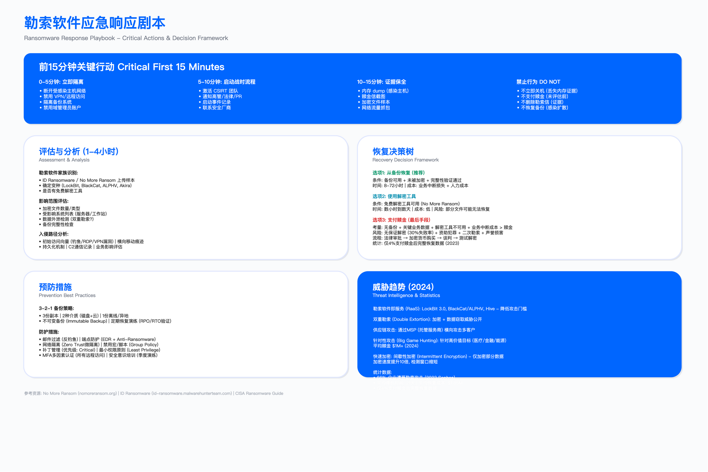
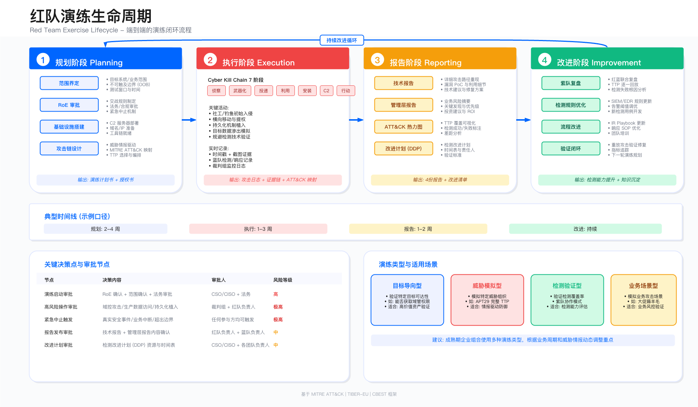

# 12.5　紫队协作与检测能力建设

> 导读：红队演练的技术价值，在很大程度上取决于演练结束后检测体系发生了什么变化。如果攻击 TTP 仅停留在报告里、蓝队没有将发现转化为可运行的检测规则，那么下一次演练大概率会重蹈同样的覆辙。本节聚焦这个"转化"环节：三种紫队协作模式的适用场景、从单个 TTP 到 Sigma 规则再到 SPL 查询的完整开发链路，以及让改进持续落地的 DDP 文档机制。代码块密集，每段都附有"为什么这样写"的解释，规则本身与规则背后的检测逻辑同等重要。

---

## 12.5.1 紫队的定位与三种协作模式

### 紫队不是新团队

"紫队"（Purple Team）这个词容易让人误解为需要设立一个独立的新团队。实际上，紫队是一种协作模式：红队和蓝队在同一框架下工作，红队负责执行攻击 TTP，蓝队负责验证检测，双方的发现在统一的改进文档（DDP）里汇聚。目前业内可公开引用的方法论基线是 SCYTHE 的《Purple Team Exercise Framework》（PTEF），它把紫队定义为一种跨红蓝的对手模拟演练标准，覆盖计划与定范围、执行、度量与评分、检测工程、成熟度跟踪五段生命周期[1]——本节的协作模式划分与 DDP 机制可视为该生命周期在具体组织中的落地形态。

这个区分很重要，因为它决定了资源投入方式。大多数企业不需要雇用"紫队工程师"，而是需要为现有红蓝团队建立协作机制：固定的联合会议节奏、统一的 TTP 执行日志格式、以及一个可追踪的检测改进任务板。

### 三种协作模式

模式一：实时协作（Concurrent Purple Team）

红蓝双方在同一时间进入协作会议室（或视频会议）。红队执行攻击操作，蓝队实时在 SIEM/EDR 中查找告警。这种模式的节奏是：攻击-查询-分析-再攻击，可以在一天内完成 5-10 个 TTP 的验证循环。

适合场景：针对特定 TTP 的深度检测调优，例如在 12.3 中介绍的 Cobalt Strike Malleable C2 Profile 特征识别——攻击者调一个参数，检测规则立刻响应，双方可以快速定位规则的盲区边界。

局限：需要红蓝双方同时投入时间，且蓝队知道攻击何时发生，无法评估"冷状态"下的告警响应能力。

模式二：先红后紫（Blind Red Then Purple）

红队独立执行演练（蓝队不知情），结束后双方一起复盘：逐条比对红队操作日志与 SIEM 告警，找出漏检的技术。这是最接近真实攻击的验证方式，能够评估 SOC 在压力下的真实决策质量。

这种模式产出两类信息：一类是"工具在，但未告警"——规则问题；另一类是"工具告警了，但 SOC 没响应"——流程问题。两类问题的修复路径完全不同，前者改规则，后者改 Playbook 和升级机制。

适合场景：季度全场景演练后的复盘（参见 12.4 的 8 周演练设计），以及组织需要评估 SOC 真实响应能力时。

局限：周期长，发现问题后修复验证需要等到下次演练才能闭环。

模式三：自动化紫队（BAS 驱动）

将已验证的 TTP 转化为 BAS（Breach and Attack Simulation）剧本，持续自动执行。BAS 平台每周运行一次，将检测结果与上周对比，一旦覆盖率下降（某条规则失效或日志采集中断），立即告警。

这解决了检测规则"腐化"（decay）的问题：安全团队辛苦建立的 Sigma 规则，可能因为 Sysmon 版本升级、日志格式变更或云平台配置漂移而悄然失效，而没有人知道。详见 12.6 的 BAS 实施框架。

适合场景：已积累 50+ TTP 验证结果、希望从"一次性演练"升级为"持续验证"的组织。

---

## 12.5.2 检测覆盖矩阵

紫队工作的起点是把当前的检测状态可视化。下表是一个检测覆盖矩阵的示例——横轴是已验证的 ATT&CK 技术，纵轴是检测指标，每次演练后更新。

| ATT&CK 技术 | 工具 | MTTD | 误报率 | 状态 |
|-------------|------|------|--------|------|
| T1003.001 LSASS Memory | Mimikatz | 未检测 | N/A | 红色（无覆盖） |
| T1059.001 PowerShell | Cobalt Strike | 8 分钟 | 12% | 黄色（覆盖但误报高） |
| T1021.002 SMB/Admin Shares | CrackMapExec | 3 分钟 | 3% | 绿色（覆盖良好） |
| T1055.001 Process Injection | Custom shellcode | 未检测 | N/A | 红色（无覆盖） |
| T1566.001 Spearphishing | GoPhish | 15 分钟 | 8% | 黄色（MTTD 偏高） |
| T1547.001 Registry Run Key | SharPersist | 2 分钟 | 1% | 绿色（覆盖良好） |

矩阵中，红色项是优先开发新检测规则的目标；黄色项需要调优现有规则（降误报率或减少 MTTD）；绿色项纳入 BAS 持续验证，防止腐化。矩阵的价值不在于数字本身，而在于每次演练后的变化趋势——红色减少的速度，是紫队工作实际效果的最直接指标。

---

## 12.5.3 从 TTP 到检测规则：完整开发链路

以 T1003.001（LSASS 内存转储）为例，展示从"红队执行"到"检测规则上线"的 5 步工作流。

### 步骤 1：行为分析

首先需要理解这个 TTP 的行为特征：LSASS（Local Security Authority Subsystem Service）是 Windows 存储凭证的核心进程。攻击者通过请求对 LSASS 的内存读取权限，将凭证数据转储到文件或内存中。

不同工具的行为略有差异：

- Mimikatz：调用 OpenProcess 访问 LSASS，GrantedAccess 通常为 `0x1F0FFF` 或 `0x1F1FFF`（全权限）
- Procdump：以调试标志打开 LSASS，GrantedAccess 为 `0x1410`
- Comsvcs.dll（无文件转储）：通过 `MiniDump` 函数，GrantedAccess 为 `0x1F0FFF`
- Direct syscall 变体：直接调用 NtReadVirtualMemory，绕过用户态 API hook，部分 EDR 可能无法检测

这种差异决定了检测规则的设计思路：不能只检测"Mimikatz"这个工具名（攻击者可以改名），而应检测行为模式——哪个进程以什么权限访问了 LSASS。

### 步骤 2：确定数据源

检测 LSASS 访问的最佳数据源是 Sysmon Event ID 10（ProcessAccess）。这个事件在有权限的进程访问另一个进程时生成，包含以下关键字段：

- `SourceImage`：发起访问的进程路径
- `TargetImage`：被访问的进程路径（这里是 lsass.exe）
- `GrantedAccess`：请求的访问权限掩码（十六进制）
- `CallTrace`：调用栈，可区分正常系统调用与可疑行为

关键前置条件：Sysmon 必须配置 ProcessAccess 事件，且 lsass.exe 必须在监控范围内。默认 Sysmon 配置不一定启用这条规则——这是许多企业的检测盲区所在（见 12.7 案例中 DESKTOP-FIN-023 的 Sysmon 配置缺失问题）。

### 步骤 3：开发 Sigma 规则

Sigma 是一种平台无关的检测规则语言（由 SigmaHQ 社区维护，规则库以 Detection Rule License 1.1 授权），可以转译为 Splunk SPL、Elastic EQL、Microsoft Sentinel KQL 等[2]。先写 Sigma，再转译，是团队知识资产最大化的做法——规则只需维护一份，多平台复用。

```yaml
# 文件：sigma/rules/credential_access/lsass_memory_access.yml
# 规则 ID 使用 UUID 便于跨平台引用

title: LSASS Memory Access - Credential Dumping
id: 5e3b4c8d-1a2f-4e5a-b7c8-d9e0f1a2b3c4
status: production
description: |
  检测对 LSASS 进程的内存读取行为，覆盖 Mimikatz、Procdump、
  Comsvcs.dll 以及使用合法调试权限的变体工具。
  不覆盖 direct syscall 绕过（需独立规则）。
references:
  - https://attack.mitre.org/techniques/T1003/001/
  - https://docs.microsoft.com/sysinternals/downloads/sysmon
author: Red Team
date: 2025/07/04
tags:
  - attack.credential_access
  - attack.t1003.001
logsource:
  category: process_access
  product: windows
  # 数据源：Sysmon Event ID 10
detection:
  selection_target:
    # 目标必须是 lsass.exe
    TargetImage|endswith: '\lsass.exe'
  selection_access:
    # 这里是规则的核心逻辑：
    # GrantedAccess 是权限掩码，各位含义如下：
    #   0x0010 = PROCESS_VM_READ（读取内存，转储凭证的必要权限）
    #   0x1000 = PROCESS_QUERY_LIMITED_INFORMATION
    #   0x0400 = PROCESS_QUERY_INFORMATION
    #   0x001F = 低五位进程权限之和（TERMINATE|CREATE_THREAD|SET_SESSIONID|VM_OPERATION|VM_READ），并非 PROCESS_ALL_ACCESS
    #
    # 合法系统进程访问 LSASS 通常使用精确的最小权限（如 0x1000）
    # 攻击工具倾向于请求宽泛权限以确保操作成功
    #
    # 局限说明：此处用 |contains 对十六进制字符串做子串匹配，而非按位与(AND)判断——
    # 既可能漏报（同一权限集合的其它十六进制写法不含这些子串），也可能误报（子串巧合命中）。
    # 生产环境应在 SIEM 侧以数值按位运算（如 GrantedAccess & 0x10 != 0）复核，此规则仅作行为线索。
    GrantedAccess|contains:
      - '0x1010'   # PROCESS_VM_READ | PROCESS_QUERY_LIMITED_INFORMATION
      - '0x1410'   # Procdump 常用：含 PROCESS_VM_READ + QUERY_INFORMATION
      - '0x1F0FFF' # Mimikatz 默认：接近全权限
      - '0x1F1FFF' # 另一个 Mimikatz 变体常见值
  filter_system_processes:
    # 以下合法进程确实需要访问 LSASS，排除以降低误报：
    # - werfault.exe：Windows 错误报告，合法调试用途
    # - System：内核级操作
    # - csrss.exe：客户端服务器运行时，系统级别
    # - 安全软件（EDR/AV）：自身工作机制涉及进程监控
    SourceImage|endswith:
      - '\werfault.exe'
      - '\werfaultsecure.exe'
    SourceImage|contains:
      - 'C:\Windows\System32\'
      - 'C:\Windows\SysWOW64\'
    # 注意：不在 System32 中的"假冒"进程不会被此 filter 排除
    # 这是规则的刻意设计：ProcessHollowing 后的进程路径会暴露异常
  condition: selection_target and selection_access and not filter_system_processes
falsepositives:
  # 以下场景可能触发误报，遇到时应结合 CallTrace 和源进程路径判断：
  - 安全软件（AV/EDR/SIEM Agent）的合法 LSASS 访问
  - IT 运维脚本使用 Procdump 进行合法的崩溃转储分析
level: high  # 高危：误报可控，漏报代价高
```

规则设计的三个关键决策：

1. 为什么用 GrantedAccess 而不是 SourceImage：工具名可以改（重命名 mimikatz.exe 为 svchost.exe），但权限请求模式更难伪装，且更稳定地反映意图。

2. 为什么 filter 只排除 System32 路径而不是进程名：如果攻击者将恶意工具放在 `C:\Windows\System32\` 下（需要管理员权限，但不罕见），进程名过滤会被绕过；路径过滤配合 CallTrace 分析更鲁棒。

3. 为什么 level 设为 high 而非 critical：合法安全软件确实会产生误报，标注 high 而非 critical 允许 SOC 在收到告警时先做 5 分钟上下文调查再升级，而不是立即触发高优先级响应流程（后者会导致告警疲劳）。

### 步骤 4：转译为 Splunk SPL

Sigma 规则通过工具（如 sigma-cli）转译，但了解 SPL 等价物有助于调优：

```splunk
# Splunk SPL 版本 - LSASS 内存访问检测
# 数据源：Sysmon Event ID 10，需已配置 TA-for-Sysmon

index=sysmon EventCode=10
    TargetImage="*\\lsass.exe"
    (GrantedAccess="0x1010" OR
     GrantedAccess="0x1410" OR
     GrantedAccess="0x1F0FFF" OR
     GrantedAccess="0x1F1FFF")
    NOT (SourceImage="*\\werfault.exe" OR
         SourceImage="*\\werfaultsecure.exe" OR
         SourceImage="C:\\Windows\\System32\\*" OR
         SourceImage="C:\\Windows\\SysWOW64\\*")

| table _time SourceImage TargetImage GrantedAccess CallTrace host

| eval
    risk_score=case(
        GrantedAccess="0x1F0FFF", 95,  /* Mimikatz 全权限：几乎可以确定是恶意行为 */
        GrantedAccess="0x1F1FFF", 95,
        GrantedAccess="0x1410",   70,  /* Procdump 权限：可能合法（调试），需结合上下文 */
        GrantedAccess="0x1010",   60,  /* 只读权限：可能是轻量探测工具 */
        true(),                   50
    ),
    access_type=case(
        GrantedAccess="0x1F0FFF" OR GrantedAccess="0x1F1FFF",
            "Full Access (Mimikatz-class)",
        GrantedAccess="0x1410",
            "Debug+Read (Procdump-class)",
        GrantedAccess="0x1010",
            "Read+Query (lightweight)",
        true(), "Unknown"
    )

| where risk_score >= 60  /* 过滤低风险告警，减少噪音 */

| sort -risk_score
```

SPL 设计要点：

- `risk_score` 分级而非单一阈值，让 SOC 分析师一眼区分"高确信度 Mimikatz"和"可能是 Procdump 的合法调试"，避免所有告警都以相同优先级处理。
- `CallTrace` 字段在表格中保留：这是区分正常系统调用（`ntdll.dll+...`）与 direct syscall 绕过（调用栈异常短或指向非标准模块）的关键线索，不能丢弃。
- `where risk_score >= 60` 不等于"60分以下不需要关注"——只是把低风险事件从实时告警中移到猎杀（hunting）查询里，避免告警队列溢出。

### 步骤 5：DDP 文档化

DDP（Detection Development Plan）是紫队工作的正式交付物。它把"我们发现了检测缺口"转化为"谁在什么时间用什么标准修复了这个问题"。

```markdown
# DDP-2025-007：T1003.001 LSASS Memory 检测规则开发

**状态**：已完成
**优先级**：P0（高危，直接影响凭证安全）
**负责人**：蓝队工程师 李明
**创建时间**：2025-07-04
**完成时间**：2025-07-18

## 触发背景

2025 季度红队演练（演练编号 RT-2025-Q3）期间，红队于 10:32:44
使用定制 Mimikatz 变体（direct syscall 版本）成功提取 LSASS
凭证，全程无任何 EDR/SIEM 告警。调查发现：

1. Sysmon 配置文件版本为 2023-11，未包含 ProcessAccess 监控规则
2. EDR 的 LSASS 保护为被动模式（仅 PPL 保护，无主动阻断）
3. 无任何行为检测规则覆盖 LSASS 访问

## 根因分析

Sysmon 配置从未针对凭证转储场景专项调优。现有配置
来自 2023 年初始部署，未随攻击技术演进更新。

## 改进项清单

| 项目 | 说明 | 负责人 | 截止时间 | 状态 |
|------|------|--------|----------|------|
| 更新 Sysmon 配置 | 启用 ProcessAccess 监控，过滤高频合法进程 | 蓝队工程师 | 2025-07-10 | 已完成 |
| 部署 Sigma 规则 | 转译并部署至 Splunk，设置告警级别 High | 蓝队工程师 | 2025-07-14 | 已完成 |
| 配置告警自动化 | 关联 Playbook，High 级告警 15 分钟内创建 Ticket | SOC 工程师 | 2025-07-16 | 已完成 |
| 加入 BAS 验证 | 将 Mimikatz/Procdump 场景加入周度 BAS 验证 | 红队工程师 | 2025-07-18 | 已完成 |

## 验收测试

2025-07-18 验收测试记录：

- 执行 Mimikatz sekurlsa::logonpasswords（标准版）→ SIEM 告警，risk_score=95，延迟 12 秒 ✓
- 执行 Procdump -ma lsass.exe → SIEM 告警，risk_score=70，延迟 15 秒 ✓
- 执行 direct syscall 变体 → SIEM 未告警（预期，此变体绕过 Event ID 10）→
  记录为残余风险，待 EDR 内核级检测能力升级后再验证

## 残余风险记录

Direct syscall 变体（T1003.001 的高级变体）当前无检测覆盖。
根因：绕过用户态 Sysmon hook，Event ID 10 不生成。
缓解路径：EDR 内核驱动级别的行为检测，计划 2025 Q4 评估。
```

---

## 12.5.4 紫队培训：角色互换机制

培训的最有效方式之一是让红队工程师做一周蓝队，反之亦然。这轮转带明确任务目标，不是走过场式的体验：

红队工程师轮转至蓝队时：负责处理当周 SIEM 告警队列，参与至少一次 Incident Response 案例复盘。目标不是提升蓝队技能，而是让红队理解"一个告警从生成到 SOC 分析师拿到手，经历了多少过滤、延迟和上下文损失"——这直接影响红队未来演练时对工具噪音和检测粒度的判断。

蓝队工程师轮转至红队时：参与一次完整的 TTP 执行（选择低风险技术如 OSINT 或隔离环境攻击），重点观察工具如何绕过检测、日志在哪个环节丢失。目标是让蓝队工程师建立"攻击者视角"，写规则时能预判攻击者的绕过策略。

角色互换的制度化：建议每季度安排一次，持续 3-5 天。不需要全员参与，每次 1-2 人轮转即可。轮转结束后输出一份"我在对方岗位学到的最反直觉的一件事"——这是知识库的宝贵原始素材。

---

## 12.5.5 紫队知识库结构

紫队协作产生的知识需要结构化存储，否则每次演练都从零开始。推荐目录结构：

```
purple-team-kb/
├── ttp-library/
│   ├── T1003.001-lsass-memory/
│   │   ├── red-playbook.md        # 红队执行步骤
│   │   ├── sigma-rule.yml         # Sigma 检测规则
│   │   ├── splunk-query.spl       # Splunk 查询
│   │   ├── ddp-2025-007.md        # DDP 改进文档
│   │   └── bas-scenario.yaml      # BAS 自动化剧本
│   ├── T1059.001-powershell/
│   └── T1021.002-smb-lateral/
├── coverage-matrix/
│   ├── 2025-Q1-matrix.xlsx        # 季度覆盖率快照
│   └── 2025-Q3-matrix.xlsx
├── training/
│   ├── role-swap-reports/         # 角色互换报告
│   └── joint-exercises/           # 联合演练记录
└── ddp-tracker/
    └── ddp-index.md               # 所有 DDP 的状态汇总
```

知识库的维护原则：每个 TTP 目录必须包含 sigma-rule.yml 才算"完整"，否则只有攻击记录而无检测规则，无法驱动 BAS 自动化。`ddp-index.md` 是季度向管理层汇报检测能力改进进展的数据来源。

---

## 12.5.6 联合演练场景：勒索软件模拟

以下是一个将多个 TTP 串联的联合演练场景设计，覆盖勒索软件的完整攻击链：


*图 12.6：勒索软件响应 Playbook——从初始访问、横向移动、数据外带到加密的检测与处置节点*

场景背景：模拟 Conti 组织的 TTP，从初始钓鱼到数据外带再到加密，全程红蓝协作验证每个阶段的检测覆盖。

演练阶段与验证点：

| 阶段 | 攻击 TTP | 检测工具 | 验证问题 |
|------|----------|----------|----------|
| 初始访问 | T1566.001 钓鱼+宏 | 邮件网关+EDR | 邮件是否拦截？宏执行是否告警？ |
| 执行 | T1059.001 PowerShell | EDR+Sysmon | 混淆命令是否检测？下载行为是否阻断？ |
| 持久化 | T1547.001 注册表 | EDR+SIEM | 自启动项写入是否告警？响应时效？ |
| 凭证获取 | T1003.001 LSASS | Sysmon+SIEM | 前述规则是否触发？risk_score 是否合理？ |
| 横向移动 | T1021.002 SMB | NDR+SIEM | Pass-the-Hash 是否检测？时延多少？ |
| 数据收集 | T1005 本地数据收集 | DLP+EDR | 批量文件读取是否触发告警？ |
| 数据外带 | T1048 DNS 隧道 | NDR | DNS 查询频率是否异常？是否告警？ |
| 影响 | T1486 加密 | EDR+备份系统 | 加密行为是否阻断？备份是否可用？ |

联合演练结束后的输出：检测覆盖矩阵更新 + 各阶段 DDP 任务 + BAS 场景脚本化。整个演练通常需要 2 天：第 1 天执行和检测，第 2 天复盘和规则开发。

这个场景在"影响"一行就停住了——验证问题只问到"加密行为是否阻断？备份是否可用？"。**它没有回答加密真的发生之后能不能回来**，而那是另一条完全不同的能力链。一个成本可控的扩展方式是接力：紫队打到取得域管理员权限并触及备份系统为止（不实际破坏），恢复类演练从"假设备份已被破坏"接着往下走，这样一次投入就能验证从入侵到恢复的完整链路。两类演练的分工（验证对象、参与方、典型结论）与接力设计见 [16.7.7](../../第05部分_身份网络与业务连续性/第16章_业务连续性与灾难恢复/16.7_演练体系设计.md)；这里可以直接照搬的一条建议是**在紫队演练范围里显式加入"尝试触及备份与恢复能力"**，因为多数演练以拿到域管理员或皇冠数据为终点，而攻击者的下一步恰恰是打备份。



---

## 本节小结

紫队的核心价值在于打通红队 TTP 执行与蓝队检测能力提升之间的转化链路。三种协作模式（实时协作/先红后紫/BAS 驱动）针对不同验证需求，实际部署中通常混合使用：月度实时协作针对特定 TTP 调优，季度先红后紫评估 SOC 整体能力，BAS 持续验证防止规则腐化。

从 TTP 到 Sigma 规则再到 SPL 查询的开发链路，以及 DDP 文档化机制，是把攻防知识固化为组织资产的工程化路径。角色互换机制解决红蓝视角的隔离问题，知识库结构确保每次演练的成果可积累、可引用。

检测能力建设的终极验证标准是：当类似 Target 2013 的 FireEye 高危告警出现在 SOC 队列中，能否在 SLA 内做出正确判断而非误判为误报（该事件的告警被判为误报的经过，见美国参议院商务委员会 2014 年的调查报告[3]）。紫队的目标，是让这个问题的答案从"不确定"变成"有数据支撑的能"。

---

## 常见误区与适用边界

误区一：追求覆盖率数字而忽视检测质量。检测覆盖率 90% 但误报率 40% 的团队，实际效能可能低于覆盖率 60% 但误报率 3% 的团队——告警疲劳会系统性降低 SOC 的响应意愿。

误区二：紫队协作是一次性项目。检测规则需要随攻击技术演进持续维护；停止紫队协作就意味着检测能力开始缓慢腐化。

误区三：认为紫队协作会暴露蓝队的"弱点"，影响团队士气。成熟的紫队文化强调"改进"而非"评分"——告警矩阵里的红色格子是改进机会，不是失职记录。

适用边界：紫队协作对已建立 SIEM/EDR 基础设施、且蓝队具备规则开发能力的组织效果最佳。对于尚未完成基础日志采集的组织，优先完成 Sysmon 部署、SIEM 接入，再开展紫队协作，否则无法形成有意义的检测验证闭环。

---

## 参考文献

| # | 来源 | 标题 | 日期 | 链接 |
| --- | --- | --- | --- | --- |
| [1] | SCYTHE | Purple Team Exercise Framework（PTEF，开源紫队演练方法论） | 访问于 2026-07 | <https://www.scythe.io/ptef> |
| [2] | SigmaHQ | Sigma — Generic Signature Format for SIEM Systems（规则库以 Detection Rule License 1.1 授权） | 持续更新 | <https://github.com/SigmaHQ/sigma> |
| [3] | 美国参议院商务委员会 | A "Kill Chain" Analysis of the 2013 Target Data Breach | 2014-03 | <https://www.commerce.senate.gov/wp-content/uploads/media/doc/2014%200325%20Target%20Kill%20Chain%20Analysis.pdf> |

---

## 导航

[← 上一节：12.4 演练设计](./12.4_红队演练设计.md) | [返回章节目录](./README.md) | [下一节：12.6 BAS 自动化 →](./12.6_攻击模拟与BAS自动化.md)

---

© 2025-2026 AISecOps Project. Licensed under CC BY-NC-SA 4.0
