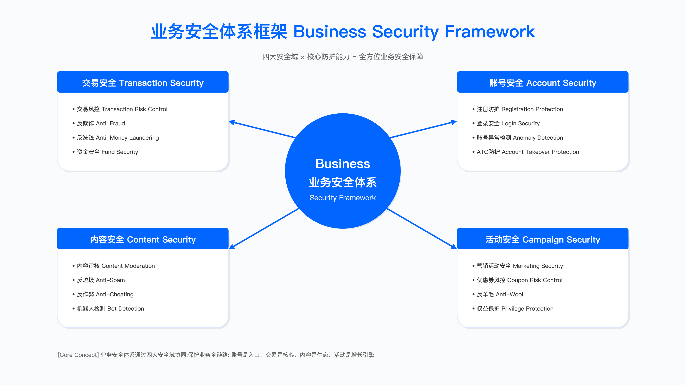
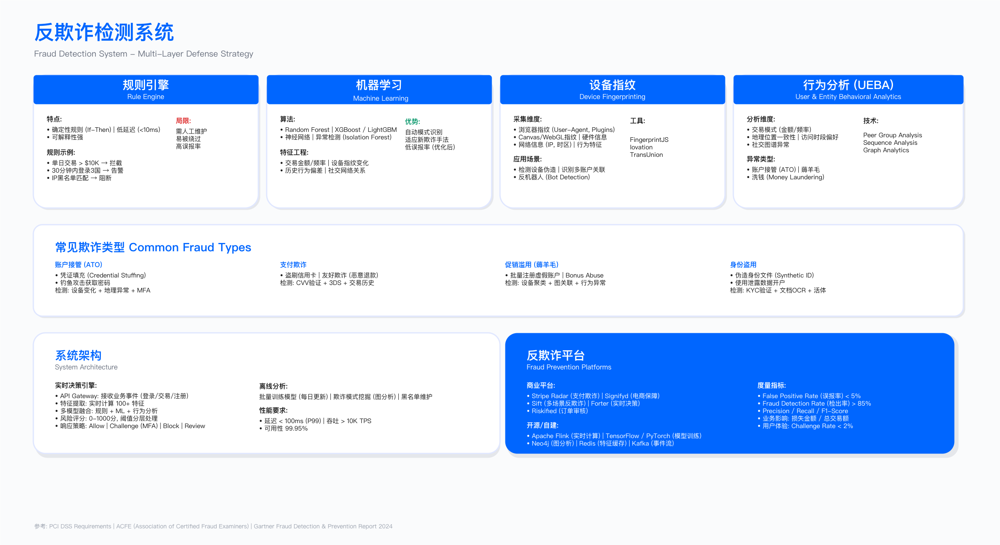

# 13.1　业务安全体系概览

## 13.1.1　决策约束：误拦成本与黑产损失的权衡

业务安全的核心矛盾，是风险控制与用户体验之间无法消除的张力。在某电商平台大促前的风控策略评审中，三个部门的利益冲突暴露得一览无余：

业务负责人的关注点是 GMV 影响。误拦导致的订单损失直接计入业务损失——即使这些订单中部分可能是真实欺诈，在财务核算上仍然被视为收入缺口。

风控负责人需要对抗有组织的黑灰产团伙。这类团伙通过设备指纹伪装、行为模拟、分布式账号等手段绕过检测，单纯放宽策略会导致损失扩大。

客服负责人承担误拦带来的投诉处理成本。正常用户被拦截后的申诉流程，需要增加客服人力、延长响应时间，间接影响用户满意度。

典型的决策框架包含三个方案维度：严格风控方案设定较低风险阈值，预期误拦率上升但黑产拦截效果提升；适度放宽方案提高风险阈值降低误拦，但黑产可能利用更宽松的窗口；分层策略方案则根据用户分层（VIP 用户、新用户、活动高峰期）动态调整阈值。

最终采用分层策略的企业往往更多，但其有效性取决于三个前提：用户分层模型的准确性（VIP 用户标签、历史信用评分）、人工介入的响应速度（高峰期能否及时处理边缘案例），以及实时监控能力（能否在黑产攻击开始后数小时内调整策略）。



*图：业务安全体系框架，展示账号安全、交易风控、内容审核、活动防护四大支柱及其控制点*

## 13.1.2　定位约束：业务安全的组织困境

业务安全在企业中的尴尬处境源于其跨职能特性。不同于技术安全有明确的漏洞修复标准，业务安全的成功标准是灰度的。

与业务方的约束体现在三个层面。首先，风控策略影响转化率，但转化率下降不一定由风控导致（也可能是产品体验、价格竞争等因素），这使得责任归属变得模糊。其次，业务方期望风控"仅拦截黑产"，但黑产行为与正常用户行为在统计上存在重叠区域，完美分离在技术上不可行。最后，大促等关键时期，业务方倾向于放宽风控以保证 GMV，但这正是黑产集中攻击的窗口期，形成天然矛盾。

与技术方的约束同样存在三重张力：规则引擎需要低延迟（通常要求 P99 < 100ms），但复杂规则（如图关系查询）难以满足；ML 模型需要大量特征工程，但特征计算本身增加系统复杂度和延迟；风控系统需要 7×24 小时高可用，但频繁的策略变更增加稳定性风险。

与合规方的约束涉及数据处理的合法性边界。设备指纹、行为追踪等技术可能涉及用户隐私，需获得用户同意或在隐私政策中明确。风控模型使用的用户画像（地理位置、消费习惯）可能被视为敏感数据处理，需符合 GDPR、PIPL 等数据保护法规，且跨境场景下各国要求不同，合规复杂度进一步上升。

### 业务安全与技术安全的本质差异

| 维度     | 技术安全                         | 业务安全                                         |
| -------- | -------------------------------- | ------------------------------------------------ |
| 目标对象 | 系统漏洞、配置缺陷               | 业务逻辑滥用、经济利益驱动行为                   |
| 对抗特征 | 攻击者寻找漏洞利用点             | 黑产寻找成本收益比最优的滥用路径                 |
| 防御方式 | 修复漏洞后相对稳定               | 对抗持续演化，黑产会快速适应新规则               |
| 成功标准 | 漏洞修复率、渗透测试通过率       | 损失率与误拦率的平衡点                           |
| 验证方法 | 安全扫描、渗透测试               | A/B 测试、人工抽样、用户投诉率                   |

技术安全面对的是技术漏洞，修复后相对稳定；业务安全面对的是经济博弈，攻防双方持续演进。这一差异决定了业务安全团队需要不同的能力结构和运营模式。

技术安全团队转型做业务安全时，最大的障碍在于思维模式切换。技术漏洞有明确的 CVE 编号、CVSS 评分、修复方案，而业务安全面对的是灰度风险：同一行为在不同上下文中的风险等级不同（新用户首单大额消费 vs. 老用户日常购买）。某团队曾招聘渗透测试专家负责业务安全，其在首月提交了大量有效的应用安全漏洞，但当黑产利用"正常用户行为模拟"绕过所有技术防护时，传统的漏洞挖掘思路无法应对。转型的关键在于理解攻击者的经济动机：黑产的成本结构（接码平台费用、设备成本、人力成本）与收益模型（优惠券变现、虚假流量售卖）。

## 13.1.3　组织困境：谁为误拦买单

### 决策博弈中的利益分配

| 角色       | 核心诉求       | 关注指标                         | 典型立场                               |
| ---------- | -------------- | -------------------------------- | -------------------------------------- |
| 业务负责人 | GMV 最大化     | 订单转化率、误拦导致的订单损失   | 倾向于放宽风控策略                     |
| 风控负责人 | 损失可控       | 黑产损失金额、风险事件数量       | 倾向于收紧策略                         |
| 客服负责人 | 投诉量最小化   | 客服工单量、用户满意度           | 中立偏反对收紧（因误拦增加投诉）       |
| CTO        | 系统稳定性     | 系统可用性、延迟、变更风险       | 关注策略变更对系统的影响               |

风控决策本质上是多方博弈的结果，而非纯技术判断。实践中常见三类决策误区：风控团队强推策略被业务方抵制导致策略无法上线；风控团队完全妥协导致黑产损失大幅上升事后被追责；缺乏量化数据支撑使决策基于主观判断、事后难以复盘。

可行的决策机制包含三个要素：数据量化——将各方案的预期损失（黑产损失、GMV 损失、客服成本）量化提供决策依据；责任共担协议——明确各方承担的成本（业务方承担部分误拦导致的 GMV 损失，风控方承担超出预期的黑产损失）；联合指挥部——大促期间建立跨部门联合指挥机制，根据实时数据动态调整策略。

某平台的责任共担机制将各方利益绑定：业务方承诺将一定比例的误拦 GMV 损失记为风控成本，不计入业务 KPI；风控方承诺如果误拦率超过约定阈值，需补偿业务方部分 GMV 损失；客服方承诺提前扩充人力；技术方承诺提供专项支持保障策略变更的稳定性。这一机制的核心是让各方在决策中有"皮肤在游戏中"（skin in the game），而非仅从自身 KPI 出发。

## 13.1.4　冷启动陷阱：无数据场景的建模约束

### 冷启动期的核心矛盾

新业务或新平台在上线前通常要求部署风控系统，但此时面临三重约束：无历史交易数据导致无法训练监督学习模型；无黑产样本导致不知道应该拦截哪些行为模式；无正常用户基线导致无法评估误拦率的合理范围。

某跨境电商平台在冷启动期对比了多种方案：

| 方案         | 实施成本        | 主要约束                                                       | 效果评估                             |
| ------------ | --------------- | -------------------------------------------------------------- | ------------------------------------ |
| 采购黑名单   | 年费数十万      | 黑名单覆盖率有限，黑产会使用新设备、新 IP                      | 仅覆盖已知黑产，对新型攻击无效       |
| 借鉴同行规则 | 人力成本        | 业务差异导致规则不适用（客单价、用户行为路径不同）             | 误拦率高，需要大量调优               |
| 接入第三方   | 年费数百万      | 成本高，且无法针对业务特性定制                                 | 效果依赖第三方数据质量               |
| 宽松策略观察 | 接受黑产损失    | 需要管理层同意接受一定损失以积累数据                           | 可积累真实样本，但损失需可控         |

没有单一方案能完美解决冷启动问题，实际上需要组合使用多种方案，并随时间演进逐步过渡到自建能力。该平台最终采用的组合方案分阶段推进：第 1-2 个月采购基础黑名单和设备指纹服务，同时允许一定程度的黑产攻击以积累样本（需控制损失在可接受范围）；第 3 个月基于积累的样本训练初版逻辑回归模型（AUC 可能不理想但可用）；第 4-5 个月通过 A/B 测试持续迭代规则和模型；第 6 个月模型基本稳定，开始引入 XGBoost 等更复杂的模型。

关键约束在于：冷启动期必须接受适度损失，这需要提前与管理层沟通预期；样本积累速度取决于业务量，低频业务冷启动期会更长；初期误拦率会较高，需要建立快速申诉和人工审核机制。

## 13.1.5　技术军备竞赛：黑产对抗的演进速度

### 攻防演进的时间窗口压缩

| 时期      | 黑产主要手法         | 防御措施             | 黑产破解时间窗口 | 防御响应时间要求       |
| --------- | -------------------- | -------------------- | ---------------- | ---------------------- |
| 2015-2017 | 手动操作、简单脚本   | IP 限制、手机号验证  | 数天至数周       | 数周内更新规则         |
| 2017-2019 | 自动化脚本、打码平台 | 验证码、设备指纹     | 数天             | 数天内部署新检测       |
| 2019-2021 | 众包分布式、设备群控 | 行为分析、关系图谱   | 24 小时内        | 3 天内更新模型         |
| 2021-2023 | AI 生成仿真行为      | 深度学习异常检测     | 12 小时内        | 1 天内紧急策略         |
| 2023-现在 | LLM 辅助、多模态伪造 | 多模态检测、实时对抗 | 数小时           | 2 小时内（接近极限）   |

黑产破解时间从"周"级别压缩到"小时"级别，对风控能力提出了全新要求：7×24 小时值班机制（不是口号，需要凌晨响应）；策略发布流程必须极简化（申请→审批→上线在 2 小时内完成）；自动化程度必须极高（人工操作无法满足响应速度要求）。

某平台在大促凌晨检测到新型黑产攻击，需要紧急更新模型，面临时间约束——模型训练需要 1 小时，模型审核需要 30 分钟（合规要求），模型上线需要 30 分钟（灰度发布），总计 2 小时，接近响应极限。针对这一瓶颈，改进措施包括：紧急策略通道（高风险场景下先上线规则拦截，5 分钟生效，再等模型上线）；在线学习（模型可以小批量实时更新，无需完整重训练）；自动化 A/B 测试（新策略自动灰度→评估→全量，需设置自动回滚机制）。

## 13.1.6　业务安全的四大支柱：工程约束与验证

### 支柱 1：账号安全——二八法则与边际效应

某平台分析了过去三年拦截的百万级恶意账号，发现帕累托法则在账号安全中显著体现：

| 拦截策略       | 拦截占比（估算）  | 误拦率（估算） | 实施成本              | 边际成本 |
| -------------- | ----------------- | -------------- | --------------------- | -------- |
| 设备指纹黑名单 | 约 40-50%         | 低             | 低（第三方服务）      | 低       |
| IP 风险评分    | 约 20-30%         | 中等偏低       | 低（第三方服务）      | 低       |
| 注册行为异常   | 约 10-20%         | 中等           | 中（需数据分析团队）  | 中       |
| 手机号黑产库   | 约 5-15%          | 低             | 中（采购+维护）       | 中       |
| 深度学习模型   | 约 5-10%          | 较高           | 高（算法团队+GPU）    | 高       |

前几项"简单策略"可能覆盖大部分恶意账号，而深度学习模型成本最高但贡献最小。这并非意味着深度学习模型无用，而是应在前面策略不够用时才考虑。中小平台（日注册量 < 10 万）前 3 项策略足够；大型平台（日注册量 > 100 万）前 4 项可能已到瓶颈，需要深度学习捕捉复杂模式。

实施建议按阶段推进：第一阶段（3 个月）实施设备指纹 + IP 风险评分；第二阶段（6 个月）引入注册行为分析 + 手机号库；第三阶段（12 个月）在前面策略无法满足时才引入深度学习模型。每个策略需单独 A/B 测试评估增量拦截率和增量误拦率，人工抽样复核拦截账号确认识别准确性。

### 支柱 2：交易安全——总体成本优化

某支付平台的案例展示了误拦成本远高于黑产损失的典型场景：

业务方要求将欺诈率从 0.8% 降至 0.5% 以下。激进方案 A 收紧策略，预期欺诈率降至 0.4%，但误拦率可能从 0.3% 升至 0.8%。计算总体成本后：欺诈损失减少 0.4%，但误拦损失增加 0.5%，加上客服成本和用户流失（CLV 损失），总体损失反而增加。

最终采用的分层方案按风险分级处理：风险分 > 95 直接拦截；风险分 85-95 进入人工审核；风险分 70-85 触发增强验证（短信/人脸识别），不直接拦截；风险分 < 70 直接放行。

这一设计的核心逻辑是：风险高的用户拦截代价低（黑产），风险中等的用户直接拦截代价高（正常用户误拦的申诉成本、用户流失），因此用"增强验证"代替"拦截"处理中等风险，既控制风险又保护用户体验。



*图：欺诈检测系统架构，展示实时决策引擎、规则引擎、机器学习模型及人工审核的协同*

### 支柱 3：内容安全——误判容忍度与申诉机制

| 审核方式        | 日处理量  | 准确率（估算） | 成本 | 适用场景                             |
| --------------- | --------- | -------------- | ---- | ------------------------------------ |
| 纯机器审核      | 百万级    | 约 80-90%      | 低   | 文本、明确违规（如色情、暴力）       |
| 机器初筛 + 人工 | 十万级    | 约 90-95%      | 中   | 图片、视频                           |
| 纯人工审核      | 万级      | 约 95-98%      | 高   | 敏感内容、申诉复核                   |

机器审核准确率难以达到 100%，如何处理剩余的误判？某平台对比了两种方案：方案 1 追求将机器准确率从 85% 提升至 95%，经过 6 个月优化仅提升至 88%，边际收益递减，ROI 不理想；方案 2 接受误判、建立高效申诉机制，扩充客服团队并将申诉响应时间从 2 天缩短至 2 小时，用户满意度显著提升。

关键洞察：用户不期待平台"零误判"，他们期待的是"误判后能快速纠正"。将申诉响应时间从 2 天缩短至 2 小时，用户满意度提升远超同期的准确率提升努力。验证方法包括申诉成功率（目标 > 80%，表明大部分申诉确实是误判）和申诉响应时间（目标 < 2 小时）。

### 支柱 4：活动安全——成本收益对抗

某电商平台 618 活动规则为"新用户注册送 50 元无门槛优惠券"。羊毛党成本结构极低：手机号验证约 0.1 元/个（接码平台），设备指纹约 50 元/设备（可重复使用），IP 限制通过住宅代理约 0.5 元/IP，行为分析通过真人众包约 5 元/单——羊毛党总成本约 6 元/单，收益 50 元，净利润约 44 元/单。

反击策略经历三个版本的演进。第一版（失败）单纯提高技术门槛（增加验证码和设备指纹限制），打码平台破解、群控模拟器绕过，无效。第二版（部分成功）降低羊毛收益（优惠券改为"满 100 减 50"并限制品类），羊毛党凑单成本增加、变现难度增加，数量减少约 60%。第三版（基本成功）提高羊毛成本（新用户需完成多个任务才能领券，总计约 10 分钟；优惠券延迟生效 7 天），羊毛党单账号操作成本从 6 元提升至约 15 元，部分放弃。

关键约束：技术对抗是军备竞赛，黑产会持续升级工具；降低羊毛收益或提高羊毛成本，比单纯技术对抗更有效；最优策略是让羊毛成本接近收益（利润空间压缩至黑产不愿投入）。

## 13.1.7　组织架构：集中式与分布式的权衡

### 模式演进中的约束

模式 1：集中式（某平台 2018-2020 年）

成立独立"业务安全部"集中管理所有风控能力。面临三重约束：业务方提需求到风控上线数周，无法满足业务快速迭代需求；风控团队不理解业务细节，策略误拦率高；业务方觉得风控"不接地气"，矛盾激化。失败案例：某次大促前风控团队以风险过大为由拒绝业务方放宽限制的需求，大促当天误拦导致业务方损失大量 GMV，业务方直接向 CEO 投诉。

模式 2：分布式（某平台 2020-2021 年）

拆分风控团队，每个业务线配备专职风控人员。约束：每个业务线都建自己的风控平台，重复建设显著；不同业务线使用不同规则引擎和模型框架，工具碎片化；设备指纹等服务各自采购，年成本显著增加；某业务线发现的新型黑产手法未及时通知其他业务线。失败案例：社交业务线发现新型黑产手法，但未及时通知电商业务线，导致电商也被攻击，损失大量资金。

模式 3：混合式（某平台 2021 年至今）

建立"风控中台 + BISO"模式：中台提供统一的规则引擎、模型平台、设备指纹、数据平台；BISO（业务安全伙伴）深入各业务线定制化策略。

效果：基础能力成本降低约 40%；BISO 机制让风控更贴近业务，误拦率显著降低；跨业务线威胁情报共享，响应速度提升。新问题包括：BISO 的汇报线模糊（向业务方汇报还是风控中台）；BISO 容易被业务方"绑架"，过度妥协风险要求。解决方案：明确 BISO 考核由风控中台和业务方共同决定（双线汇报）；设置红线——AML、合规要求等策略不可妥协，BISO 无权放宽；定期轮岗，每 2 年轮换业务线，避免过度本地化。

### 行业企业组织架构对比案例

> 以下案例基于公开行业报告、企业安全团队分享会议及作者对多家企业的调研访谈整理而成。企业名称已做匿名化处理，具体数字为近似值或区间估算，反映行业典型情况而非精确统计。

| 企业类型       | 组织模式              | 团队规模           | 汇报线       | 核心优势               | 主要挑战               |
| -------------- | --------------------- | ------------------ | ------------ | ---------------------- | ---------------------- |
| 头部电商 A     | 混合式（中台+BISO）   | 200+ 人            | 双线汇报     | 能力复用、业务贴合     | BISO 归属模糊、协调成本高 |
| 头部电商 B     | 集中式（风控部）      | 150+ 人            | CRO          | 统一标准、资源集中     | 业务响应慢、容易脱节   |
| 金融科技 C     | 分布式（事业部制）    | 各 BU 15-30 人     | 各 BU 负责人 | 业务理解深、响应快     | 重复建设、标准不一     |
| 社交平台 D     | 集中式+嵌入式         | 100+ 人            | CSO          | 统一能力、灵活部署     | 人员调配复杂           |
| 跨境电商 E     | 外包+核心团队         | 核心 20 人         | COO          | 成本可控、灵活         | 能力积累慢、依赖供应商 |
| 游戏公司 F     | 项目制                | 按项目配置         | 项目负责人   | 高度定制、灵活         | 经验难以复用           |

组织模式选择决策树：

```
业务线数量 ≤ 3？
├── 是 → 集中式（统一管理，效率高）
└── 否 → 业务线差异大吗？
    ├── 是 → 混合式（中台+BISO）
    └── 否 → 分布式或集中式均可
        └── 成本敏感？
            ├── 是 → 集中式（避免重复建设）
            └── 否 → 分布式（业务响应更快）
```

组织转型路径建议：

| 当前状态     | 目标状态 | 转型周期   | 关键动作                           |
| ------------ | -------- | ---------- | ---------------------------------- |
| 无专职团队   | 集中式   | 6-12 个月  | 招聘核心团队、接入第三方服务       |
| 集中式       | 混合式   | 12-18 个月 | 建立中台能力、培养 BISO 人才       |
| 分布式       | 混合式   | 18-24 个月 | 统一基础平台、明确 BISO 职责       |
| 外包依赖     | 自建团队 | 12-24 个月 | 渐进式自建、平滑过渡               |

## 13.1.8　团队能力：业务理解比算法能力更稀缺

某平台 2020 年招聘复盘揭示了业务安全人才的独特需求：

| 候选人背景        | 预期 | 6 个月后实际表现                                     | 核心约束                     |
| ----------------- | ---- | ---------------------------------------------------- | ---------------------------- |
| 名校 ML 博士      | 高   | 模型设计优秀，但特征工程依赖他人，业务理解不足       | 缺乏业务直觉，难以设计有效特征 |
| BAT 高级开发      | 高   | 规则引擎、实时计算设计优秀，但缺乏业务直觉           | 技术能力强，但不懂黑产手法   |
| 电商运营转风控    | 中   | 最懂黑产，能快速识别新型攻击，与业务沟通无障碍       | 技术能力需培养               |
| 前黑产从业者      | 未知 | 对黑产手法了如指掌，是团队的"黑产顾问"               | 需要合规审查                 |

业务理解和黑产研究能力远比算法能力更稀缺。算法能力可以通过培训和工具弥补，但业务直觉需要长期积累。基于这一洞察，招聘策略调整为：算法岗不再要求顶会论文，但要求快速理解业务（给真实案例，1 周内提出可行方案）；策略岗优先考虑有运营/产品/黑产背景的人；最稀缺的是懂业务 + 懂技术 + 懂黑产的"三栖人才"。

## 13.1.9　从 0 到 1 的实施路径：阶段性约束

### 第一阶段（0-6 个月）：快速止血

第 1 个月快速接入第三方服务：接入设备指纹服务（选择接入速度快、文档完善的供应商），成本约年费数十万，效果是可拦截已知黑产设备，约束是误拦率可能较高（约 3%），需要业务方理解和支持。

第 2 个月建立基础规则：编写基础规则（IP 黑名单、频率限制、异常行为检测），初期可用脚本快速上线，无需引入规则引擎。约束是规则写死在代码里，修改需要发布代码（响应慢）。

第 3 个月搭建规则引擎：技术选型可采用开源规则引擎（如 Drools），将现有规则迁移进去，策略发布时间从数天缩短至数小时。约束是开源规则引擎性能可能不够（如 P99 延迟 > 100ms），需要优化。

第 4 个月优化性能：引入缓存（如 Redis）减少规则引擎查询延迟。约束是缓存更新延迟可能导致黑产绕过（缓存一致性问题）。

第 5-6 个月建立监控和反馈：搭建监控大盘（如 Grafana）和告警（钉钉、PagerDuty），实时看到拦截率、误拦率、风险事件。里程碑：欺诈损失率从高水平降至中等水平，误拦率约 1%。

第一阶段存在三重约束：技术债务严重（规则引擎性能问题、缓存架构不合理）；团队人力紧张，7×24 值班压力大；但可快速见效，为后续投入争取支持。

### 第二阶段（6-12 个月）：建立模型

第 7 个月数据准备：约束是训练模型需要标注样本但初期无标注数据，方案是用现有规则拦截的样本作为"正例"、随机抽取放行样本作为"负例"，需人工复核样本确认标注准确率 > 90%。

第 8 个月特征工程：不知道应该使用哪些特征时，先列出所有可能特征（如 200 个）后用特征重要性筛选（保留 50 个）。关键发现是某些特征（如设备关联账号数、注册到首次交易时间）对模型贡献最大。

第 9-10 个月模型训练与 A/B 测试：从逻辑回归（基线，可解释性强）逐步过渡到 XGBoost，灰度 10% 流量 2 周监控拦截率、误拦率、系统延迟。如果拦截率提升且误拦率不增加则全量上线。

第 11-12 个月持续迭代：模型每周或每月自动重训练，持续迭代特征（新增特征和淘汰无效特征）。

### 第三阶段（12-18 个月）：体系化

第 13-14 个月图神经网络（可选）：业务需求是检测团伙欺诈（多个账号共享设备/IP/地址），技术方案是构建关系图谱（如 Neo4j）并训练 GNN 模型（如 GraphSAGE[1]）。约束是 GNN 推理延迟高（如 500ms），无法用于实时决策，可用于离线批处理。

第 15-16 个月实时特征平台：用流处理框架（如 Flink）统一计算实时特征并存储在高速数据库（如 Redis/Aerospike），特征计算延迟降低、复用率提升。

第 17-18 个月全链路风控：事前黑名单预防和风险预警，事中实时拦截和分级处理，事后损失追回和黑产打击（与执法部门合作）。

## 13.1.10　效果评估：指标设计的约束

### 指标设计中的常见陷阱

| 指标       | 理想定义                    | 现实约束                                                     | 实际做法                                                       |
| ---------- | --------------------------- | ------------------------------------------------------------ | -------------------------------------------------------------- |
| 欺诈损失率 | 欺诈损失/总 GMV             | 分母可以"做大"来降低比率，掩盖绝对损失                       | 同时看绝对值和比率，设置红线（绝对损失超过阈值必须解释）       |
| 拦截率     | 拦截欺诈订单数/总欺诈订单数 | 无法精确知道"总欺诈订单数"（只能估计）                       | 用人工抽样校准，承认统计误差                                   |
| 误拦率     | 误拦正常订单/总正常订单     | 部分用户被误拦后不会投诉，误拦被低估                         | 用客服投诉 + 人工回访双重验证                                  |
| ROI        | (损失减少-成本)/成本        | "损失减少"是假设值，无法验证                                 | 保守估计，向上汇报时说明假设前提                               |

这些陷阱揭示了业务安全指标的根本困境：理想指标难以精确测量，实际做法需要接受不确定性。某季度风控汇报存在两个版本——对外汇报展示欺诈损失率从 0.8% 降至 0.5%，ROI 约 10:1；内部复盘则更为审慎：GMV 增长了 50%（分母变大），拦截金额包含一定比例误拦，ROI 基于假设计算。这一案例说明的原则是：对外汇报适度包装但不撒谎（数据可验证），对内复盘实事求是、承认局限性（便于改进）。

### A/B 测试：最诚实的评估方法

标准 A/B 测试配置：实验组与基线组各 50%（按用户 ID 哈希确保同一用户始终在同一组）；主要指标（欺诈损失率、误拦率）+ 次要指标（客服投诉量、用户转化率）+ 护栏指标（系统可用性、P99 延迟）；实验周期 14 天（包含 2 个周末，覆盖不同流量模式）。

某新模型 A/B 测试结果（14 天）：

| 指标       | 基线组  | 实验组  | 差异    | 统计显著性   |
| ---------- | ------- | ------- | ------- | ------------ |
| 欺诈损失率 | 0.52%   | 0.48%   | -7.7%   | 显著         |
| 误拦率     | 0.61%   | 0.58%   | -4.9%   | 接近显著     |
| 客服投诉   | 基准值  | 略下降  | -1.7%   | 不显著       |
| P99 延迟   | 45ms    | 52ms    | +18.6%  | 显著         |

决策结果：欺诈损失率降低，但 P99 延迟增加 18.6%（从 45ms 到 52ms），趋势不好。最终决策是暂缓全量上线，先优化延迟问题，2 周后重新测试。护栏指标（延迟、可用性）同样重要，有时候"不上线"也是正确的决策。

## 13.1.11　常见挑战：误判检测与跨部门协作

### 挑战：误拦率被低估

核心约束：如何知道真实的误拦率？

三种检测方法各有局限。方法 1 依赖客服投诉（被动，严重滞后）：仅有约 30% 被误拦用户会投诉，误拦率被严重低估。方法 2 采用人工抽样（主动，但成本高）：每天随机抽取拦截订单进行人工复核。方法 3 使用用户召回率（间接指标）：观察被拦用户的后续行为，但部分真实用户也会直接放弃。

综合方案按风险等级分层处理：

| 风险等级             | 处理方式             | 误拦检测方法             | 响应时间要求 |
| -------------------- | -------------------- | ------------------------ | ------------ |
| 高风险（>90 分）     | 直接拦截             | 100% 人工抽样复核        | 2 小时内     |
| 中风险（70-90 分）   | 人工审核             | 审核员复核 + 用户申诉    | 30 分钟内    |
| 低风险（50-70 分）   | 增强验证（不直接拦截）| 用户完成验证率监控       | 实时         |
| 正常（< 50 分）      | 直接放行             | 事后抽样（约 1%）        | 1 天内       |

### 挑战：跨部门协作中的利益冲突

| 部门   | 核心诉求       | 与风控的冲突                             |
| ------ | -------------- | ---------------------------------------- |
| 业务方 | GMV 最大化     | 风控策略影响转化率                       |
| 客服方 | 投诉量最小化   | 误拦导致投诉激增                         |
| 技术方 | 系统稳定性     | 风控策略导致系统复杂度和延迟增加         |
| 法务方 | 合规零风险     | 风控策略可能涉及隐私问题（设备指纹、行为追踪）|

可行的协作机制分三步：第 1 步数据量化，将各方案的预期影响量化（黑产损失、GMV 损失各多少）；第 2 步责任共担协议，让各方对决策结果有实际约束；第 3 步建立联合指挥部，大促期间跨部门联合值班，每 2 小时同步数据，异常情况 30 分钟内联合决策。

跨部门协作的本质是利益协调而非技术问题；用数据量化利弊让各方理性决策；责任共担让各方都有"皮肤在游戏中"。

## 13.1.12　常见误区与澄清

误区一：技术防护越强越好

过度的技术防护会显著提升正常用户的使用摩擦，导致误拦率上升。有效策略是分层处理：对高风险用户实施强验证，对低风险用户尽量无感通过。

误区二：算法团队是业务安全的核心

业务理解能力和黑产研究能力比算法能力更稀缺。优秀的业务安全团队需要算法工程师、策略分析师、业务专家的组合，而非纯算法导向。

误区三：规则引擎已过时，应全面转向机器学习

规则引擎覆盖大部分场景（黑名单、频率限制、合规规则），响应速度快（毫秒级），可解释性强。ML 模型作为补充处理边界模糊的案例。完全依赖机器学习会丧失可解释性和快速响应能力。

误区四：A/B 测试只是走形式

A/B 测试是评估风控策略效果的最可靠方法。有效的 A/B 测试需要明确的评估指标、足够的样本量、合理的实验周期，并且要严格按照数据结果决策，护栏指标（如系统延迟）同样重要。

误区五：ROI 计算可以精确量化

"如果没有风控系统，损失会是多少"——这一假设无法验证，ROI 数字本质上是估算值。对外汇报时可以适度包装（但数据需可验证），对内复盘时应实事求是，承认计算的局限性。

## 13.1.13　黑灰产情报获取渠道与应用实践

业务安全的核心对抗对象是有组织的黑灰产团伙。与技术安全依赖漏洞情报不同，业务安全需要黑灰产情报来预判攻击手法、识别攻击资源、追踪团伙动态。

适用边界：电商、金融、社交、游戏等面临黑灰产攻击的企业；不适用于 To B 企业或无直接用户交互的基础设施服务商。

### 情报获取渠道分类

公开情报源（OSINT）：

| 渠道类型     | 具体来源                                             | 情报价值                           | 获取成本       |
| ------------ | ---------------------------------------------------- | ---------------------------------- | -------------- |
| 安全社区     | 先知社区、FreeBuf、SecWiki、T00ls、看雪论坛          | 漏洞情报、攻击手法、工具分析       | 低             |
| 威胁情报平台 | 微步在线、奇安信 TI、安恒威胁情报、360 威胁情报      | IP/域名/样本 IOC、APT 报告         | 中             |
| 暗网监控     | 暗网论坛、Telegram 群组、Discord 服务器              | 数据泄露、攻击预警、黑产交易       | 高（需专业工具）|
| 代码仓库     | GitHub、Gitee（搜索敏感关键词）                      | 密钥泄露、内部代码、配置文件       | 低             |
| 社交媒体     | Twitter/X、微信公众号、知乎、V2EX                    | 安全事件、新型攻击、行业动态       | 低             |

以下是 GitHub 敏感信息监控的典型配置。这段配置列出了需要持续扫描的关键词类型——覆盖密码、密钥、内网地址等最易泄露的字段，并明确了工具选型（GitGuardian 自动化程度最高，其余为开源可自建）和响应 SLA：

```yaml
# GitHub 敏感信息监控
monitoring_keywords:
  - "{公司名} password"
  - "{公司名} secret"
  - "{公司域名} api_key"
  - "{公司产品名} token"
  - "jdbc:mysql://{内网 IP 段}"
  - "{公司名} AWS_ACCESS_KEY"
tools:
  - GitGuardian（商业，自动化程度高）
  - Gitrob（开源，需自建）
  - truffleHog（开源，支持熵检测）
  - gitleaks（开源，规则丰富）
frequency: 每日扫描
response_sla: 发现后 4 小时内评估并处置
alert_channel: 安全运营群 + 工单系统
```

实际运营中，这份配置的关键词需要持续更新（随着产品名、内网 IP 段变化），response_sla 是量化承诺而非参考值——超出 SLA 应触发升级流程。

商业情报服务：

| 服务商     | 核心能力                             | 适用场景                         | 年度成本参考 |
| ---------- | ------------------------------------ | -------------------------------- | ------------ |
| 微步在线   | 威胁情报 API、溯源分析、情报订阅     | IP/域名信誉查询、APT 追踪        | 30-100 万    |
| 永安在线   | 业务风险情报、黑产监控、薅羊毛预警   | 账号安全、活动风控、虚假流量     | 50-200 万    |
| 威胁猎人   | 黑产情报、攻击溯源、团伙画像         | 账号安全、数据泄露、欺诈检测     | 50-150 万    |
| 知道创宇   | 威胁情报、暗网监控、品牌保护         | 品牌仿冒、数据泄露、钓鱼监测     | 30-80 万     |
| 天际友盟   | 威胁情报聚合、情报共享平台           | 多源情报整合、行业情报共享       | 20-60 万     |

关键约束：商业情报服务的价值高度依赖于与自身业务场景的匹配度；建议先 POC 测试 1-3 个月评估情报命中率后再正式采购；大型企业通常采购 2-3 家形成互补。

### 情报应用实践

以下是情报联动风控规则的典型结构。规则的核心设计是"多源叠加 + 置信度分级"：单一情报源误报率较高，叠加商业库、自建黑名单、行业共享后，置信度 ≥80 才触发拦截，50-80 区间触发增强验证而非直接拦截，这样既利用了情报价值，又控制了误杀率：

```yaml
# 情报联动风控规则示例
rule_name: 黑产手机号实时拦截
trigger: 用户注册/登录/交易
intelligence_source:
  - type: 商业情报库
    provider: 永安在线
    field: phone_number
  - type: 自建黑名单库
    source: 历史攻击沉淀
  - type: 行业共享库
    source: 互联网安全联盟
logic:
  if: phone_number in blacklist
  confidence: ">= 80"
  then:
    - action: 拦截操作
    - action: 触发人工审核
    - action: 记录情报命中日志
  elif: phone_number in graylist
  confidence: "50-80"
  then:
    - action: 增强验证（短信/人脸）
    - action: 标记观察
metrics:
  - 命中率监控（目标 >5%）
  - 误杀率监控（目标 <0.1%）
```

情报的 TTL（生存时间）管理同样关键——不加 TTL 的情报库会积累大量失效条目，提升误杀率。以下配置展示了针对不同情报类型的差异化 TTL 策略：恶意 IP 变化快（3 天基础 TTL），黑名单手机号相对稳定（60 天），设备指纹则根据特征变化程度动态失效：

```yaml
# 情报 TTL 管理策略
ttl_policy:
  - type: "malicious_ip"
    default_ttl: 3  # 天
    extend_condition: "命中次数 >3"
    extend_ttl: 7
    max_ttl: 30

  - type: "blacklist_phone"
    default_ttl: 60
    review_condition: "30 天无命中"
    action: "降级为 graylist"

  - type: "device_fingerprint"
    default_ttl: 14
    invalidate_condition: "设备特征变化 >30%"
```

### 情报有效性评估

| 情报类型     | 典型有效期    | 验证方法           | 淘汰条件               |
| ------------ | ------------- | ------------------ | ---------------------- |
| 恶意 IP      | 24-72 小时    | 持续命中率监控     | 连续 7 天无命中         |
| 黑产手机号   | 30-90 天      | 抽样人工验证       | 正常用户误杀 >0.1%     |
| 恶意设备指纹 | 7-30 天       | 行为分析验证       | 指纹特征变化/设备换手  |
| 攻击工具 IOC | 7-14 天       | 沙箱动态分析       | 工具版本更新           |
| 团伙情报     | 30-180 天     | 关联分析验证       | 团伙解散或转型         |

### 常见误区

1. 采购情报服务后直接全量应用于拦截：商业情报存在误报，必须先在旁路验证命中率和误杀率（建议 2 周观察期），再逐步应用于拦截决策。

2. 情报只用于事后分析，不用于实时防御：情报最大价值在于实时阻断，应通过 API 集成到风控系统实现秒级联动，而非仅作为调查工具。

3. 只关注外部情报，忽视内部沉淀：自身业务攻防中沉淀的情报精准度远高于外部情报（针对性强、误报率低），应建立情报反哺机制。

4. 情报采购后"一劳永逸"：黑产手法持续演进，情报服务需要持续评估 ROI，每季度审查命中率和价值贡献。

### 验证方法

| 验证维度       | 方法                                           | 目标值  |
| -------------- | ---------------------------------------------- | ------- |
| 情报覆盖率     | 使用历史攻击事件验证情报命中率                 | ≥30%    |
| 情报时效性     | 监控新型攻击出现后情报入库时间                 | ≤24 小时|
| 误杀率         | 抽样 10000 正常用户，计算情报误杀率            | ≤0.1%   |
| ROI            | 情报阻断损失金额 / 情报采购成本                | ≥3:1    |

---

## 本节小结：业务安全的核心约束

基于实践经验，业务安全面临十大核心约束：误拦成本约束（误拦成本往往高于黑产损失）；业务理解约束（业务理解比算法能力更重要）；冷启动约束（冷启动期必须接受适度损失以积累数据）；二八法则约束（约 80-90% 的效果来自少数简单策略）；模型衰减约束（模型会衰减，必须建立持续监控和更新机制）；误拦检测约束（真实误拦率往往被低估，需要主动检测）；跨部门协作约束（利益协调比技术难度更高）；成本收益对抗（让羊毛成本接近收益是有效策略）；ROI 约束（ROI 计算基于假设，需要承认局限性）；响应速度约束（黑产破解时间缩短至小时级，风控响应必须极快）。

适用边界：本节内容主要适用于有一定规模的互联网业务（日活 > 10 万或 GMV > 千万级）；小型企业可先采用第三方风控服务，待业务规模增长后再自建；B2B 业务与 C2C 业务的风控策略有显著差异，需要根据业务特性调整。

验证方法：定期 A/B 测试评估策略效果；人工抽样复核拦截样本；监控用户投诉率和申诉成功率；建立 ROI 模型评估投入产出比。

运行指标：欺诈损失率（目标根据业务可接受范围设定）；误拦率（目标 < 1%）；拦截率（目标 > 80% 已知欺诈）；响应速度（检测到攻击后首次响应时间 < 30 分钟）；客服投诉率（目标不因风控策略导致投诉激增）。

---

## 参考文献

| # | 来源 | 标题 | 日期 | 链接 |
| --- | --- | --- | --- | --- |
| [1] | W. L. Hamilton, R. Ying, J. Leskovec | Inductive Representation Learning on Large Graphs (GraphSAGE), NeurIPS 2017 | 2017-06 | <https://arxiv.org/abs/1706.02216> |

---

## 导航

[← 上一节：13.0 执行摘要](./13.0_执行摘要.md) | [返回章节目录](./README.md) | [下一节：13.2 账号安全 →](./13.2_账号安全与反撞库.md)

---

© 2025-2026 AISecOps Project. Licensed under CC BY-NC-SA 4.0
