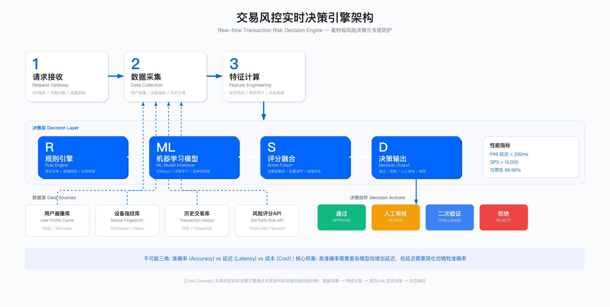

# 13.3　交易风控与反欺诈

> 导读：交易风控是业务安全体系中技术密度最高、工程复杂度最大的能力域。本节以"不可能三角"作为分析框架，重点拆解三个关键问题：为什么离线测试结果在生产中会大幅衰减；AML 规则引擎的七条规则各自针对什么欺诈模式，关键参数如何设定；GNN 在团伙欺诈识别中的实际 ROI 边界在哪里。如果你的团队正在评估是否引入 GNN，建议重点阅读 13.3.4。本节末尾新增"基础模型时代的风控"，讨论从"每类欺诈训一个专用模型"转向"一个基础模型迁移到多任务"的范式转变，以及它对特征工程、冷启动、可解释性的重新分配——如果你在评估要不要跟进基础模型路线，这一节给出的是收益与前提条件的边界。

## 13.3.1　交易风控的核心困境

交易风控系统需要在毫秒级内对交易请求做出放行或拦截决策，同时平衡三个相互冲突的目标：高准确率（减少欺诈损失）、低延迟（不影响用户体验）与可控成本。这三者构成了风控系统设计的核心约束，也是大多数风控系统失败的根本原因。

### 不可能三角：准确率、延迟与成本

任何实时风控系统都面临相同的权衡困境。提高准确率通常需要更复杂的特征计算和模型推理，这会增加延迟；降低延迟可以使用简单规则，但会牺牲准确率；高性能基础设施会显著增加成本。

从业务视角看，高峰期的系统表现与日常测试结果往往存在显著差距。在流量激增时，数据库查询延迟上升、缓存命中率下降、CPU 竞争加剧，这些因素叠加后，原本设计为 100ms 的决策延迟可能膨胀至 200-300ms，超过用户耐受阈值，直接导致支付成功率下降。

适用边界：实时交易风控适用于日活跃交易量在万级以上的平台，这类平台面临明确的欺诈损失与用户体验压力，投入风控系统具有正向 ROI。对于低频交易场景（如 B2B 采购）或对延迟不敏感的后台审核流程，复杂的实时风控系统可能成本过高，使用异步审核或人工抽查更为经济。

关键约束：实时决策场景通常要求 P99 延迟低于 200ms，否则会影响支付成功率。高并发下的特征计算、模型推理与数据存储成本线性增长，需要权衡精度与资源投入。误拦率每提高 1 个百分点，可能导致大量正常用户流失。此外，风控系统的建设与运营需要跨职能团队（算法、工程、业务、运营）协作，组织能力不足是常见的落地障碍。



*图：交易风控实时决策引擎架构，展示从请求接收、数据采集、特征计算到规则引擎与ML模型混合决策的完整流程*

### 实时决策引擎的架构设计

典型的实时风控决策引擎包含以下核心环节：请求接收、数据采集、特征计算、规则引擎判断、ML 模型推理、决策输出。每个环节的延迟累加后，构成端到端的决策时间。

数据采集阶段通常需要从多个数据源（用户画像缓存、设备指纹库、历史交易记录、第三方风险评分 API）获取上下文信息。在高并发场景下，数据库与缓存的查询延迟会从个位数毫秒上升至数十毫秒，这是 P99 延迟超标的主要原因之一。

特征计算阶段需要对原始数据进行聚合与转换，生成供模型使用的特征。常见特征包括：用户最近 N 天的交易统计、设备关联账号数量、IP 地址风险评分等。复杂特征（如图谱关系、序列行为）的计算成本较高，需要权衡特征价值与计算开销。

规则引擎与模型推理采用混合决策架构。规则引擎处理明确的黑白名单逻辑与合规要求，响应快且可解释性强；ML 模型处理复杂的模式识别任务，准确率更高但推理时间较长。两者结合可以在延迟与准确率之间取得平衡。

验证方法：风控策略上线前需要经过多层验证。离线测试在历史数据上评估模型 AUC、准确率、召回率，但需注意离线指标与线上表现存在差距。小流量 A/B 测试在 5-10% 的真实流量上验证新策略，监控误拦率、漏放率与延迟变化。压力测试模拟高峰期流量，评估系统在极端 QPS 下的 P99 延迟与资源消耗。红队测试由攻击模拟团队尝试绕过风控策略，发现规则盲区。

运行指标：风控系统的运行指标分为三类：性能指标（P50/P99 延迟、QPS 处理能力与系统可用性）、准确性指标（误拦率 FPR、漏放率 FNR 与模型 AUC）、业务指标（欺诈损失金额占交易额比例与用户投诉率）。

### 常见误区

误区一：过度依赖离线测试结果。离线测试中的 AUC 可能高达 0.90-0.95，但上线后由于数据分布漂移、特征泄漏或对抗性攻击，实际效果可能下降至 0.70-0.80。必须在真实流量上进行 A/B 测试，并持续监控线上指标。

误区二：忽略高峰期性能表现。日常测试环境的 QPS 往往远低于业务高峰期，导致延迟评估严重失真。在大促、节假日等场景下，系统负载可能是平时的 10-100 倍，必须提前进行压力测试并准备降级预案。

误区三：误拦成本被低估。拦截一笔欺诈交易可以避免数百至数千元损失，但误拦一笔正常交易会导致用户流失、投诉与补偿成本。在业务增长期，误拦成本往往高于欺诈损失，需要动态调整风控阈值。

误区四：特征泄漏未被识别。训练数据中包含未来信息（如使用交易完成后的拒付标签、人工审核结果等）会导致模型在离线测试中表现优异，但上线后完全失效。必须严格检查特征的时间依赖性，确保特征在预测时刻可获得。

误区五：对抗性攻击准备不足。黑产团伙会通过 A/B 测试等方式探测风控策略边界，并针对性地调整攻击手段。风控模型需要频繁更新（周级别），并引入随机性与多样性以增加攻击成本。

---

## 13.3.2　特征工程：从理论到生产可用

特征工程是风控模型效果的决定性因素。设计优质特征需要对业务逻辑、用户行为与黑产手法的深刻理解，同时必须考虑特征的计算成本、稳定性与对抗性。

### 特征设计的核心原则

业务可解释性：每个特征都应该能用业务语言解释其与欺诈行为的关联。例如，"设备关联账号数"反映了设备复用的异常行为，"账号年龄"反映了新注册账号的高风险特征。可解释性不仅有助于模型调试，也是向业务方与监管机构证明决策合理性的基础。

计算成本可控：特征计算不应占用过多的决策延迟与存储资源。需要优先选择低成本特征（如账号年龄、交易金额），对于高成本特征（如多跳图谱关系、长时间窗口聚合）需要进行离线预计算或仅在高风险请求中使用。

对抗性稳定：特征应尽量难以被黑产团伙伪造或规避。例如，基于设备指纹、行为序列的特征比单纯依赖 IP 地址更难被绕过。同时，需要定期更新特征，避免黑产摸清规律后批量绕过。

时间稳定性：特征的分布不应随时间发生剧烈变化。疫情、大促等特殊时期可能导致用户行为模式改变，需要建立特征监控机制，及时发现分布漂移并重新训练模型。

### 生产环境的特征分类

用户画像特征：账号注册时长、历史交易次数、平均交易金额、信用评分等。这类特征计算成本低，可从用户画像缓存中快速获取，适合作为基础特征。

设备与网络特征：设备指纹、设备关联账号数、IP 地址风险评分、地理位置异常等。设备指纹需要客户端 SDK 采集，IP 风险评分通常依赖第三方数据。这类特征对机器注册、撞库攻击有较强识别能力。

交易行为特征：交易金额、交易时间、收货地址变更、浏览到下单时长等。需要注意时间窗口的选择：过短的窗口（如最近 1 小时）会受到流量波动影响，过长的窗口（如最近 30 天）会延迟对新攻击的响应。

关系图谱特征：用户-设备-IP-地址的关联关系、资金流转路径等。图谱特征对团伙欺诈识别效果显著，但计算成本高，通常用于离线分析或高风险场景的二次决策。

### 特征泄漏的识别与规避

特征泄漏是模型上线失败的最常见原因，有三种典型场景：

未来信息泄漏：训练时使用了预测时刻之后的数据。例如，使用交易完成后 30 天内是否发生拒付作为标签，但特征中包含"交易状态"字段（已发货/已签收），这些状态在预测时刻尚未产生。

人工审核结果泄漏：将人工审核标记（已审核/未审核）作为特征，但审核本身就是基于风险判断，与标签强相关。这会导致模型学习到"被审核 = 高风险"的虚假模式。

样本选择偏差：训练数据仅包含已拦截的交易，未拦截的交易中可能存在大量未被发现的欺诈案例。应定期对放行样本进行人工抽检与标注。

规避方法：严格的时间切分（训练集与测试集按时间顺序分割）；特征可用性检查（对每个特征标注其在预测时刻的可用状态）；离线-在线一致性测试（在线上环境记录特征实际值，与离线训练数据对比）。

### 特征分布漂移的监控与应对

特征分布会因用户行为变化、业务策略调整、黑产手法演进而发生漂移，需要建立特征监控体系：定期计算特征的均值、方差、分位数与历史基线对比（显著偏离应触发告警）；监控线上模型 AUC（性能下降超过阈值应触发模型重训练）；结合威胁情报与人工分析识别新型攻击模式。

应对策略：自动化重训练（每周或每两周使用最新数据重训练模型）；在线学习（引入增量学习机制，但需防止对抗样本污染）；特征衰减权重（对历史数据应用时间衰减，使模型更关注近期模式）。

---

## 13.3.3　机器学习模型的工程化落地

### 离线训练与在线推理的差距

离线测试环境与生产环境存在多方面差异：

数据分布差异：训练数据通常是历史数据，但线上数据的分布可能因季节性、营销活动、黑产策略变化而显著不同。需要尽可能使用近期数据训练，并在测试集中模拟线上流量特征。

特征一致性问题：离线训练时使用批处理计算特征，线上推理时使用实时计算，两者的实现逻辑可能不一致（聚合窗口定义、缺失值填充策略等）。必须建立特征平台，统一离线与在线的特征计算逻辑。

延迟与资源约束：离线训练可以使用大规模集群与复杂模型，但线上推理受限于毫秒级延迟要求与单机资源。需要进行模型压缩（剪枝、量化）或使用轻量级模型（逻辑回归、浅层 XGBoost）。

### 模型选型与权衡

| 模型             | 推理速度    | 可解释性 | 准确率   | 适用场景                         |
| ---------------- | ----------- | -------- | -------- | -------------------------------- |
| 逻辑回归         | 微秒级      | 极强     | 中       | 基线模型、合规解释要求高的场景   |
| XGBoost/LightGBM | 毫秒级      | 中（SHAP）| 高      | 风控主力模型，表格数据首选       |
| 深度学习         | 数十毫秒    | 差       | 很高     | 离线分析或二次决策，较少实时使用 |
| GNN              | 百毫秒+     | 差       | 高（关系）| 团伙欺诈离线挖掘，不适合实时    |

模型选型的核心判断：不同模型各有优劣，不是"越复杂越好"。逻辑回归作为基线，可解释性强，便于合规审查，应始终保留；XGBoost[3]/LightGBM[4] 是风控场景的主流选择，在表格数据上效果优异，推理速度满足实时要求；深度学习和 GNN 对特定场景有价值，但工程成本高，只在 ROI 为正时才值得投入。

### 模型迭代与 A/B 测试

典型迭代流程包括：离线评估（设定准入门槛，如 AUC 不低于当前模型或提升超过特定阈值）→ 小流量灰度（在 5-10% 的线上流量上部署，监控误拦率、漏放率、延迟，异常时自动回滚）→ 人工审核卡点（确认新模型没有引入系统性偏差或逻辑错误）→ 全量上线与持续监控。

验收标准：离线测试 AUC 不低于旧模型，或提升超过预设阈值（如 0.02）；小流量测试误拦率、漏放率、P99 延迟均未显著劣化（劣化幅度小于 10%）；人工审核抽查样本，确认决策逻辑符合业务预期。

---

## 13.3.4　图神经网络（GNN）在团伙欺诈识别中的应用

图神经网络通过建模用户-设备-IP-地址等实体间的关联关系，能够识别传统模型难以发现的团伙欺诈模式。但 GNN 的工程化落地面临数据构建、计算成本与实时性等挑战。

### 图数据的构建与维护

节点定义：用户、设备、IP 地址、收货地址、支付账户等实体作为图的节点，每个节点有自身的属性特征（如用户的注册时长、设备的首次出现时间）。

边定义：实体间的关联关系作为图的边（用户与设备之间的登录关系、用户与 IP 之间的访问关系等）。边可以有权重（关联次数）与时间戳。

图规模控制：完整的用户关系图可能包含数亿节点与数十亿边，存储与查询成本极高。需要进行裁剪：仅保留活跃节点（如最近 30 天有交易行为）、限制边的跳数（如仅保留 2 跳关系）、定期删除过期数据。

图数据库选型：Neo4j 成熟度高、文档丰富，但并发性能受限，难以支撑高 QPS 的实时查询；JanusGraph 支持高并发与分布式部署，但运维复杂，学习曲线陡峭；自研图存储可定制化，但开发周期长。需要根据团队能力与业务规模选择合适的方案。

### GNN 模型的训练与推理

训练流程：从图数据库中抽取子图样本，为每个节点生成标签（正常/欺诈）。通过 GNN 模型学习节点的嵌入表示，并基于嵌入进行分类。常用架构包括 GraphSAGE（对邻居采样后聚合，支持归纳式学习，避免全图计算）[1]、GAT（用注意力机制对邻居加权聚合）[2]。这两篇原始论文都不是为欺诈检测提出的，把它们迁到风控场景时，图的构建方式（哪些实体建节点、哪些共享关系建边）对效果的影响往往大于模型结构的选择。

推理挑战：实时决策场景需要在毫秒级内完成推理，但 GNN 需要查询多跳邻居并进行图卷积计算，延迟较高。常见优化方法包括：预计算嵌入（离线为所有活跃节点计算嵌入向量，在线推理时直接查询，避免实时图卷积）；限制邻居采样数量（仅采样固定数量的邻居如每跳 10 个，牺牲部分准确率换取推理速度）；异步推理（对于低风险请求直接放行，仅对高风险请求进行 GNN 推理，结果用于事后审核）。

### GNN 的适用场景与 ROI 评估

适用场景：GNN 在团伙欺诈识别中具有独特优势，能够发现多个账号共享设备、IP 或地址形成的紧密关联网络；资金链路追踪通过多层转账关系识别洗钱行为；异常关系检测可发现不符合常规的关联模式。

不适用场景：单笔交易的实时决策场景中，GNN 推理延迟高，难以满足毫秒级响应要求。孤立节点的风险评估中，GNN 依赖节点间的关联关系，对孤立节点效果有限。

ROI 考量：GNN 的开发与运维成本（包括图数据库、模型训练、人力投入）较高。在实践中，GNN 更适合作为离线分析工具，用于定期挖掘团伙并加入黑名单，而非直接用于实时决策。评估 GNN ROI 的关键问题：团伙欺诈在总欺诈损失中占多大比例？现有规则引擎已经能识别多少团伙？GNN 的增量发现能带来多少额外损失防护？这些问题的答案决定了 GNN 是否值得投入。

---

## 13.3.5　基础模型时代的风控

前面几节讨论的都是"每类欺诈训一个专用模型"的范式：撞库检测一个模型，盗卡试探一个模型，退款欺诈又一个模型，特征工程、标注、上线、监控各自独立。这套范式在过去十年被反复验证有效，但它有一个结构性的天花板——每个模型只能看到自己那一小块标签数据，冷启动慢，跨欺诈类型的信号无法共享。当支付网络本身能观测到覆盖多种欺诈形态的海量交易时，把这些信号割裂在几十个专用模型里，其实是一种浪费。基础模型给风控带来的变化，就是从"多个专用模型"转向"一个基础模型迁移到多任务"。

### 从专用模型到基础模型的范式转变

Stripe 在 2025 年 5 月披露了它的 Payments Foundation Model，这是目前可引用的、把基础模型思路用于交易风控的公开案例。厂商称，它用一个 transformer 架构的基础模型替代了原先针对具体任务分别训练的模型：把每一笔支付表示成一个高维向量（类似语言模型把词表示成 embedding），在其自有支付网络的大规模交易序列上做自监督预训练，让模型学到支付行为的通用表示，再迁移到具体的欺诈检测任务上。

按 Stripe 的披露口径，最直接的收益体现在 card-testing（盗卡试探，即攻击者拿批量盗刷卡号做小额试探性扣款、验证卡是否可用）这一场景：检测率从原先专用模型的 59% 提升到 97%，且这一提升是在误报零增加的前提下取得的，单次决策延迟约 100ms。需要区分事实层级——59%→97% 与"误报零增加"是 Stripe 自己披露的口径，属于厂商单方数据，不是独立第三方复现的结论；但它作为"基础模型在真实支付网络上跑通并显著提升某一具体欺诈场景检测率"的公司披露，是可以直接引用的。

这个数字之所以值得留意，不在于绝对值有多高，而在于它揭示的迁移能力。card-testing 是一种攻击特征相对稀疏、且形态快速变化的欺诈——攻击者不断更换卡号来源、试探金额、频率节奏。专用模型面对这种稀疏且漂移的标签，很难训练充分。而基础模型在预训练阶段已经从全网交易里学到了"正常支付序列长什么样"，card-testing 作为对正常序列的偏离，被迁移学习放大了区分度。同样的预训练表示，理论上可以迁移到退款欺诈、账户盗用、洗钱等其他任务，而不需要每个任务从零积累标签。

### 这套范式对工程实践意味着什么

基础模型不是把前面几节讲的特征工程、冷启动、可解释性问题解决了，而是重新分配了这些问题的位置。

对特征工程的影响是"下沉"而非"消失"。专用模型时代，特征工程是算法工程师最重的工作——手工构造"用户最近 N 天交易统计""设备关联账号数"这类特征，每个特征都要论证业务含义、计算成本、对抗稳定性（参见前文特征工程一节）。基础模型把大量这类手工特征替换成了预训练学到的表示，工程师不再需要为每个新场景重新设计几十个特征。但这不等于特征工程消失了：一是模型的输入表示（怎么把一笔支付编码成向量、包含哪些字段）本身是一项需要精心设计的工程，只是从"几十个标量特征"变成了"一个结构化的序列表示"；二是前文强调的特征泄漏、时间切分、离线-在线一致性等纪律一条都不能少——基础模型同样会因为输入里混进了预测时刻不可得的信息而在离线测试中虚高、上线后失效。

对冷启动的影响是最正面的。专用模型面对一类新欺诈，往往要先积累数周到数月的标注样本才能训练出可用模型，这段窗口期正是攻击方获利的窗口。基础模型因为预训练阶段已经学到了通用的支付行为表示，迁移到新任务时所需的标注样本量大幅下降，冷启动窗口被压缩。这对"黑产手法变化快、风控必须快速迭代"这一现实（前文反复强调过）是直接的缓解——新欺诈形态出现时，不必从零训练。

对可解释性的影响则是负面的，需要正视。前文的模型选型表里，逻辑回归"可解释性极强"、XGBoost"可用 SHAP[5] 中等解释"，深度学习和 GNN 都标着"可解释性差"。基础模型属于后者，甚至更难解释——一个在全网交易上预训练、再迁移到多任务的大模型，很难向业务方或监管机构逐条说明"为什么这笔交易被判为欺诈"。这在受强监管的支付、信贷场景里是硬约束：AML 上报、拒付争议、监管审计都可能要求给出可追溯的决策依据。现实的做法通常是分层——基础模型负责召回和排序，把高风险交易筛出来；再用可解释的规则引擎或轻量模型对被拦截的交易补一层可解释的判据，或者用事后归因方法（如对关键输入字段做扰动分析）生成近似解释。可解释性不会因为换了基础模型就自动满足，它变成了一个必须单独设计的配套环节。

### 生成式能力用于风险汇总

基础模型的另一条落地路径是替代分析师的部分归纳工作，而非替代检测模型。Sift 的 ActivityIQ 是这方面可引用的厂商案例：它用生成式能力做跨账户的风险汇总——把分散在多个账户、多个会话里的关联信号（同一批设备、同一资金流向、相似的行为节奏）汇总成一份可读的风险叙述，供风控运营人员快速判断，而不必自己在几十个维度的原始数据里逐一比对。这与 13.3 前文 GNN 团伙识别解决的是同一类问题——发现跨实体的关联——但路径不同：GNN 用图卷积算出团伙结构，生成式汇总则把已经关联上的信号用自然语言归纳出来。两者可以互补，GNN 负责"找出谁和谁有关联"，生成式汇总负责"把这层关联讲清楚给人看"。

需要提醒的是，生成式汇总的输出是给人做二次判断用的中间产物，不应直接作为拦截决策的依据。生成式模型会产生看似合理但并不准确的归纳（这一机理属于 LLM 自身的可靠性问题，见 18.3），如果把它的叙述当成事实直接触发冻结或上报，会引入新的误判来源。稳妥的定位是"辅助分析师提效"，而非"替分析师做决策"。

适用边界：基础模型风控的正向 ROI 高度依赖数据规模。Stripe 能训出有效的支付基础模型，前提是它作为支付网络本身握有覆盖多商户、多形态的海量交易数据；对于交易量有限、只能看到自己一小块业务的中小平台，自建支付基础模型既没有足够的预训练数据，也难以摊平算力成本，更现实的选择是继续用 XGBoost 类主力模型，或接入第三方已经训好的基础模型能力。范式转变值得关注，但不等于每家都该自己训一个基础模型。

关键约束：基础模型不豁免前文所有工程纪律——离线到在线的性能衰减、特征泄漏、模型随时间漂移、对抗方探测边界，这些问题一个都不会因为换了架构而消失，只是表现形式变了。可解释性缺口必须单独补配套环节，尤其在受监管场景。厂商披露的检测率提升口径应作为方向性参考而非验收标准，落地效果仍需在自己的流量上用前文的验证方法（离线回测、小流量 A/B、压力测试、红队）重新确认。

运行指标：评估基础模型是否真的带来价值，要盯的指标和专用模型时代不完全重叠，重点在于量出"迁移能力"和"配套代价"。冷启动所需样本量降幅，对比新欺诈形态下基础模型迁移达到可用效果所需的标注样本量与专用模型从零训练的样本量，这是基础模型最核心的收益，直接对应前文强调的"冷启动窗口就是攻击方获利窗口"。基础模型对多任务的迁移覆盖率，统计一个预训练表示能有效迁移的欺诈任务数占目标任务总数的比例，用来判断"一个基础模型顶多个专用模型"这个前提在自己业务上成立到什么程度，而不是想当然地假设它能覆盖所有场景。可解释配套覆盖率，统计被基础模型拦截的交易中，能由规则引擎、轻量模型或事后归因补上可追溯判据的占比，它把前文"可解释性变成必须单独设计的配套环节"落成一个可考核的数字，在受监管场景尤其要看。误报率对照则是一条红线指标：迁移后新任务的误报率必须与被替换的专用模型逐任务对照，确认检测率提升不是靠放宽误报换来的——Stripe 披露的"误报零增加"正是这一对照的意义所在。以上指标只界定"该量什么"，具体目标值依赖自身数据规模与业务形态，须用前文的验证方法在本地流量上标定。

---

## 13.3.6　反洗钱（AML）合规要求与实施挑战

反洗钱（AML）是金融与支付行业的强制性合规要求，其规则的复杂性与人工审核的高成本给企业带来显著负担。

### AML 合规的核心要求

大额交易报告：单笔或 24 小时内累计超过特定金额的交易需要向监管机构报送（各国标准不同，如 5 万元人民币、1 万美元）。需要建立自动化上报系统，确保报送的及时性与完整性。

可疑交易监测：建立规则引擎，覆盖快进快出、频繁小额、异常跨境汇款、虚拟货币交易等可疑场景。触发规则的交易需要进入人工审核流程，并根据审核结果决定是否上报。

客户尽职调查（KYC）：对客户进行身份核验、风险分级，高风险客户（政治公众人物 PEP、来自高风险国家的客户）需要进行强化尽职调查（EDD）。

交易记录保存：所有交易记录与客户资料需要保存至少 5 年，用于应对监管审计与执法调查。对于高交易量平台，数据存储成本显著。

### 可疑交易监测规则的设计困境

监管机构要求覆盖多种可疑交易场景，但实际应用中面临误报率高与漏报风险并存的困境。规则过严会将正常的小商贩、代购业务误判为可疑；规则过松则黑产会针对性地规避（如将大额拆分为多个小额、使用多个账号分散交易）；每日触发规则的可疑交易可能达到数百至数千笔，但真实可疑率往往低于 5%，大部分审核工作是"无用功"，但出于合规要求无法省略。

### AML 可疑交易监测规则示例

以下 `AMLRuleEngine` 是生产环境中常见的 AML 规则引擎实现，覆盖了 FATF 建议和央行反洗钱指引要求的核心场景。

为什么是七条规则，而不是更少或更多：七条规则并不是随机选择，而是覆盖了监管机构最关注的几类典型洗钱手法：大额拆分、快进快出、资产转移掩盖、以及利用高风险司法管辖区。每条规则对应一种具体的洗钱场景，不能合并也不能随意删减（监管审计时需要逐条说明规则覆盖情况）。

规则 1 和规则 2 的关系：大额交易（单笔超阈值）和 24 小时累计大额是两条独立规则，而非一条"二选一"规则。原因是洗钱者会故意把单笔交易控制在阈值以下（这就是"拆分"手法），但累计金额仍会超标。两条规则缺一不可，需要同时运行。

规则 5（大额拆分检测）的技术细节：`structuring_range` 设置为阈值的 70%-99%，覆盖的是"贴着阈值下沿拆分"这一种最省事的行为。7 天内 3 笔以上才触发，是为了过滤偶然的巧合（正常用户也可能碰巧有几笔接近阈值的交易）。

这条规则有一个必须显式承认的威胁建模盲区：它和规则 4（`check_frequent_small_tx`，要求 24h 内 ≥20 笔且均值 <1000）之间留下了一整段可被攻击者精确计算并规避的连续区间。只要洗钱者把大额拆成若干笔 3 万元（约 60% 档），就同时逃逸两条规则——既不落入规则 5 的 70%-99% 区间，也远达不到规则 4"20 笔小额"的门槛。正文原先"洗钱者不会控到 10% 以下、所以只需盯 70%-99%"的假设经不起真实对抗：中间档（40%-70%）恰恰是最舒适的规避区，实战中极常见。这暴露了单条阈值规则的通病——任何以"单笔金额落在某区间"为判据的规则，其区间边界外侧必然留下可被优化规避的连续空档。稳健的做法是以"累计 + 关系"而非"单笔区间"为主：在滑动窗口内对"接近但低于阈值的多笔金额/笔数"做联合累计判定，或引入按对手方/收款账户聚合的图特征（呼应 13.3 GNN 团伙识别），让拆分越细、涉及账户越多反而越容易暴露。落地这条规则时，应在文档和监控中明确标注这一盲区，避免团队误以为部署了规则 5 就覆盖了拆分场景。

规则 6（异常时间）的设计意图：凌晨大额交易本身不违法，但结合用户历史习惯的偏差，是一个重要的风险信号。这条规则权重最低（`LOW_SUSPICIOUS`），不会单独触发上报，而是作为辅助信号进入人工审核队列，由审核员结合其他信息综合判断。

生产坑位：`check_cumulative_large` 中的 `redis.setex` 存在一个微妙的竞态条件——如果多个请求同时到达，累计值可能被多次覆盖而非累加。生产环境应使用 `redis.incrbyfloat` 和单独的 `expire` 命令，或使用 Lua 脚本保证原子性。另外，`user_profile.get('transactions_7d')` 在规则 5 中加载了 7 天的全量交易记录，当用户交易频繁时（如日均数百笔的商户），这个查询会产生大量 I/O，需要提前离线计算并缓存。

```python
class AMLRuleEngine:
    """
    反洗钱可疑交易监测规则引擎
    规则设计原则：符合 FATF 建议与央行反洗钱指引
    """

    def __init__(self, config):
        self.config = config
        self.redis_client = redis.Redis(host='cache-server')
        self.alert_queue = AlertQueue()

    def evaluate_transaction(self, transaction, user_profile):
        """
        评估单笔交易是否触发 AML 规则
        返回：触发的规则列表与风险等级
        """
        triggered_rules = []

        # 规则 1：大额交易报告（强制上报）
        if self.check_large_transaction(transaction):
            triggered_rules.append({
                'rule_id': 'AML_LARGE_TX',
                'risk_level': 'REPORT_REQUIRED',
                'action': 'AUTO_REPORT',
                'reason': f"单笔交易金额超过报告阈值"
            })

        # 规则 2：24 小时累计大额（强制上报）
        if self.check_cumulative_large(transaction, user_profile):
            triggered_rules.append({
                'rule_id': 'AML_CUMULATIVE_LARGE',
                'risk_level': 'REPORT_REQUIRED',
                'action': 'AUTO_REPORT',
                'reason': f"24 小时内累计交易金额超过报告阈值"
            })

        # 规则 3：快进快出（可疑交易）
        if self.check_rapid_in_out(transaction, user_profile):
            triggered_rules.append({
                'rule_id': 'AML_RAPID_INOUT',
                'risk_level': 'SUSPICIOUS',
                'action': 'MANUAL_REVIEW',
                'reason': "短时间内发生大额入金后快速转出"
            })

        # 规则 4：频繁小额交易（可疑交易）
        if self.check_frequent_small_tx(transaction, user_profile):
            triggered_rules.append({
                'rule_id': 'AML_FREQUENT_SMALL',
                'risk_level': 'SUSPICIOUS',
                'action': 'MANUAL_REVIEW',
                'reason': "频繁小额交易，疑似规避大额报告"
            })

        # 规则 5：大额拆分检测（可疑交易）
        if self.check_structuring(transaction, user_profile):
            triggered_rules.append({
                'rule_id': 'AML_STRUCTURING',
                'risk_level': 'HIGH_SUSPICIOUS',
                'action': 'MANUAL_REVIEW',
                'reason': "多笔接近报告阈值的交易，疑似拆分"
            })

        # 规则 6：异常时间交易（可疑交易）
        if self.check_unusual_time(transaction, user_profile):
            triggered_rules.append({
                'rule_id': 'AML_UNUSUAL_TIME',
                'risk_level': 'LOW_SUSPICIOUS',
                'action': 'FLAG_FOR_REVIEW',
                'reason': "交易时间与用户历史习惯显著不符"
            })

        # 规则 7：高风险地区关联（可疑交易）
        if self.check_high_risk_jurisdiction(transaction):
            triggered_rules.append({
                'rule_id': 'AML_HIGH_RISK_JURISDICTION',
                'risk_level': 'HIGH_SUSPICIOUS',
                'action': 'MANUAL_REVIEW',
                'reason': "交易涉及高风险国家/地区"
            })

        return triggered_rules

    def check_large_transaction(self, transaction):
        """
        规则 1：大额交易检测
        阈值：参照各国监管要求设定（如中国 5 万元、美国 1 万美元）
        """
        threshold = self.config.get('large_tx_threshold', 50000)
        return transaction['amount'] >= threshold

    def check_cumulative_large(self, transaction, user_profile):
        """
        规则 2：24 小时累计大额检测
        防止通过拆分交易规避大额报告
        注意：生产环境中应使用 redis.incrbyfloat 保证原子性，
        避免并发请求导致累计值计算错误。
        """
        threshold = self.config.get('cumulative_threshold', 50000)

        # 获取 24 小时内累计金额
        cache_key = f"aml:cumulative:{user_profile['user_id']}"
        cumulative = float(self.redis_client.get(cache_key) or 0)
        new_cumulative = cumulative + transaction['amount']

        # 更新累计金额（设置 24 小时过期）
        self.redis_client.setex(cache_key, 86400, new_cumulative)

        return new_cumulative >= threshold

    def check_rapid_in_out(self, transaction, user_profile):
        """
        规则 3：快进快出检测
        入金后短时间内大部分转出，典型洗钱行为
        """
        if transaction['type'] != 'TRANSFER_OUT':
            return False

        # 检查最近入金时间
        recent_deposits = user_profile.get('recent_deposits', [])
        if not recent_deposits:
            return False

        # 最近一笔大额入金在 24 小时内
        latest_deposit = recent_deposits[-1]
        time_diff = transaction['timestamp'] - latest_deposit['timestamp']

        # 24 小时内入金后转出超过入金的 80%
        if (time_diff < 86400 and
            transaction['amount'] >= latest_deposit['amount'] * 0.8 and
            latest_deposit['amount'] >= self.config.get('rapid_threshold', 10000)):
            return True

        return False

    def check_frequent_small_tx(self, transaction, user_profile):
        """
        规则 4：频繁小额交易检测
        短时间内大量小额交易，可能是规避监控或洗钱
        """
        # 获取 24 小时内交易次数
        tx_count_24h = user_profile.get('tx_count_24h', 0)
        avg_amount_24h = user_profile.get('avg_amount_24h', 0)

        # 24 小时内超过 20 笔交易，且平均金额较小
        small_tx_threshold = self.config.get('small_tx_threshold', 1000)
        frequent_threshold = self.config.get('frequent_tx_count', 20)

        return (tx_count_24h >= frequent_threshold and
                avg_amount_24h < small_tx_threshold)

    def check_structuring(self, transaction, user_profile):
        """
        规则 5：大额拆分检测（Structuring）
        多笔接近报告阈值的交易，疑似故意规避大额报告
        70%-99% 的区间设计：覆盖故意控制在阈值以下的行为，
        同时过滤偶然接近阈值的正常交易（需 7 天内 3 笔以上才触发）
        """
        threshold = self.config.get('large_tx_threshold', 50000)
        structuring_range = (threshold * 0.7, threshold * 0.99)

        # 获取 7 天内的交易记录
        recent_transactions = user_profile.get('transactions_7d', [])

        # 统计接近阈值的交易
        near_threshold_count = sum(
            1 for tx in recent_transactions
            if structuring_range[0] <= tx['amount'] < structuring_range[1]
        )

        # 7 天内 3 笔以上接近阈值的交易，触发规则
        return near_threshold_count >= 3

    def check_unusual_time(self, transaction, user_profile):
        """
        规则 6：异常时间交易检测
        交易时间与用户历史习惯显著不符
        此规则为辅助信号（LOW_SUSPICIOUS），不单独触发上报，
        与其他规则组合使用时权重加成
        """
        tx_hour = datetime.fromtimestamp(transaction['timestamp']).hour
        usual_hours = user_profile.get('usual_trading_hours', list(range(8, 22)))

        # 凌晨交易且金额较大
        unusual_hours = [0, 1, 2, 3, 4, 5]
        amount_threshold = self.config.get('unusual_time_amount', 5000)

        return (tx_hour in unusual_hours and
                tx_hour not in usual_hours and
                transaction['amount'] >= amount_threshold)

    def check_high_risk_jurisdiction(self, transaction):
        """
        规则 7：高风险地区检测
        参照 FATF 高风险国家/地区名单（需定期更新）
        注意：下面的硬编码清单仅为占位示例，生产中必须实时联动
        OFAC/联合国制裁名单与 PEP 库，而非写死 6 国——制裁名单变动频繁，
        硬编码会导致合规覆盖不足（漏掉新增管辖区）或误拦（保留已解除的）。
        """
        # 生产实现应改为: high_risk_countries = self.sanction_list.get_current()
        high_risk_countries = self.config.get('high_risk_countries', [
            'AF', 'MM', 'KP', 'IR', 'SY', 'YE'  # 占位示例，切勿直接沿用；须接实时制裁/PEP 数据源
        ])

        # 检查交易对手或 IP 来源地区
        counterparty_country = transaction.get('counterparty_country', '')
        ip_country = transaction.get('ip_country', '')

        return (counterparty_country in high_risk_countries or
                ip_country in high_risk_countries)
```

---

以下是规则触发阈值的参考和监控指标，是规则引擎运营的重要工具。

规则触发阈值参考：

| 规则类型       | 阈值参数         | 典型值          | 调整依据     |
| -------------- | ---------------- | --------------- | ------------ |
| 大额交易报告   | 单笔金额         | ≥5 万元（中国） | 央行规定     |
| 24 小时累计    | 累计金额         | ≥5 万元         | 央行规定     |
| 快进快出       | 时间窗口         | 24 小时内       | 行业实践     |
| 快进快出       | 转出比例         | ≥80% 入金       | 可调整       |
| 频繁小额       | 交易次数         | ≥20 笔/日       | 业务特点     |
| 大额拆分       | 接近阈值范围     | 70%-99%         | FATF 建议    |
| 大额拆分       | 时间窗口         | 7 天            | 可调整       |
| 高风险地区     | 国家名单         | FATF 名单       | 定期更新     |

表中"央行规定"类阈值为强制性要求，不可调整；"行业实践"与"可调整"类阈值需根据实际误报率与漏报率反馈进行优化。

运行指标与触发阈值：

| 指标           | 计算方法                               | 目标值   | 触发阈值  | 触发动作                       |
| -------------- | -------------------------------------- | -------- | --------- | ------------------------------ |
| 规则误报率     | 人工审核后确认非可疑占比               | <95%     | >98%      | 规则阈值过严，需调松           |
| 可疑交易上报率 | 审核后上报占触发规则总数               | >5%      | <2%       | 规则阈值过松，需调紧           |
| 人工审核积压   | 待审核队列长度                         | <100 笔  | >500 笔   | 增加审核人力或调整规则         |
| 规则覆盖率     | 已覆盖场景占 FATF 建议                 | >80%     | <60%      | 补充规则场景                   |

目标值基于持牌金融机构的 AML 合规要求。调整因素包括业务类型（支付机构误报率容忍度高于银行）、监管区域（香港、新加坡对上报率要求更严格），以及交易规模（高频交易平台需更高自动化率）。

### AML 的成本结构与业务影响

AML 合规的主要成本项包括：人工审核团队（根据交易量与规则复杂度，审核团队规模可能从数人至数十人不等）；系统开发与维护（规则引擎、监测平台、上报接口、数据存储等）；数据存储（5 年的交易记录存储，对于高频交易平台可达 TB 至 PB 级别）；合规审计与咨询（每年可达数十万至数百万元）；以及罚款风险准备金。

AML 合规是纯成本投入，没有直接收益，但不合规的代价更高。企业需要在合规要求与业务效率之间寻找平衡，通过自动化、规则优化与 AI 辅助审核等手段降低成本。

---

## 13.3.7　交易风控的实战经验总结

### 核心原则

业务理解优先于算法优化。最有效的风控策略往往来自对业务逻辑与黑产手法的深刻理解，而非单纯的算法创新。算法工程师需要与业务方、风控运营团队紧密协作，将业务洞察转化为特征与规则。

快速迭代胜过完美方案。黑产手法变化快，风控策略必须频繁更新。与其花费数月开发复杂模型，不如先上线简单规则，通过快速迭代逐步优化。

误拦成本不可忽视。在业务增长期，误拦正常用户导致的流失与投诉成本可能高于欺诈损失。需要动态调整风控阈值，在风险与体验之间取得平衡。

人机协同是长期模式。规则引擎处理明确逻辑，模型处理复杂模式，人工审核处理边界情况，三者协同是现实可行的方案——完全依赖规则会导致复杂场景误报高，完全依赖模型会失去可解释性与业务信任。

### 关键成功要素

数据质量：高质量的标注数据是模型效果的基础。需要建立标注团队，确保样本标签准确且正负样本比例合理。

特征平台：统一离线与在线的特征计算逻辑，避免一致性问题。支持特征复用，降低重复开发成本。

自动化流程：从数据获取、模型训练、离线评估、灰度上线到监控告警，尽可能自动化，减少人工干预。

监控与告警：建立全链路监控，覆盖特征分布、模型性能、业务指标。异常情况自动告警，并具备自动回滚能力。

跨团队协作：风控涉及算法、工程、业务、运营、合规等多个团队，需要建立清晰的沟通机制与责任边界。

---

## 参考文献

| # | 来源 | 标题 | 日期 | 链接 |
| --- | --- | --- | --- | --- |
| [1] | W. L. Hamilton, R. Ying, J. Leskovec | Inductive Representation Learning on Large Graphs (GraphSAGE), NeurIPS 2017 | 2017-06 | <https://arxiv.org/abs/1706.02216> |
| [2] | P. Veličković et al. | Graph Attention Networks (GAT), ICLR 2018 | 2017-10 | <https://arxiv.org/abs/1710.10903> |
| [3] | T. Chen, C. Guestrin | XGBoost: A Scalable Tree Boosting System, KDD 2016 | 2016-03 | <https://arxiv.org/abs/1603.02754> |
| [4] | G. Ke et al. (Microsoft Research) | LightGBM: A Highly Efficient Gradient Boosting Decision Tree, NeurIPS 2017 | 2017-12 | <https://proceedings.neurips.cc/paper/2017/file/6449f44a102fde848669bdd9eb6b76fa-Paper.pdf> |
| [5] | S. Lundberg, S.-I. Lee | A Unified Approach to Interpreting Model Predictions (SHAP), NeurIPS 2017 | 2017-05 | <https://arxiv.org/abs/1705.07874> |

---

## 导航

[← 上一节：13.2 账号安全](./13.2_账号安全与反撞库.md) | [返回章节目录](./README.md) | [下一节：13.4 内容安全 →](./13.4_内容安全与反作弊.md)

---

© 2025-2026 AISecOps Project. Licensed under CC BY-NC-SA 4.0
