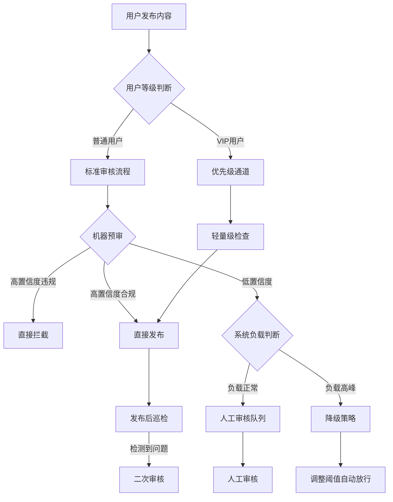

# 13.4　内容安全与反作弊

> 导读：内容安全不是一个纯技术问题——它本质上是四方利益的博弈均衡。本节先剖析这个博弈结构，再拆解关键技术实现（UGC 审核流程、基于 BERT 的文本分类模型、六级降级策略、反垃圾三代演进），最后以刷单检测 18 个月失败案例收尾，说明在真人兼职场景下 ROI 为何会跌入负区间。阅读本节前建议先读 13.3（交易风控）了解决策引擎底层，读完后参阅 13.5（营销活动安全）了解促销场景下的内容对抗。

---

## 13.4.1　内容安全系统的四方博弈约束

内容安全系统的核心矛盾，可以用四个方向来描述：监管合规要求高拦截率、用户体验要求低误拦率、商业部门要求低成本、技术团队受限于 AI 的实际能力上限。这四个方向在数学上无法同时最优——收紧监管合规就会伤害用户体验，降低误拦率就要放宽阈值或加投人工成本，而 AI 在边缘案例上的判断力仍然有限。任何实际运行的内容安全系统，都是在这四方利益之间找到"各方不满意但能接受"的平衡点，而不是找到最优解。

这个判断有直接的工程含义：当产品要求把拦截率从 85% 提到 95% 时，工程师需要知道代价是什么（误拦率上升、人工队列积压），而不是直接调阈值了事。

### 典型误判事件的系统性影响

内容安全模型升级时，最危险的场景不是新模型性能差，而是新模型对头部创作者的误封没有被监控提前截住。以下是某视频平台一次审核模型升级中发生的连锁反应：

| 时间节点 | 事件 | 系统状态 | 决策响应 |
|---------|------|---------|---------|
| 00:00 | 新版审核模型上线 | 预期拦截率提升 | 按计划发布 |
| 06:00 | 误封头部创作者账号 | 误封 3 个百万粉丝账号 | 监控系统未及时发现 |
| 10:00 | 引发舆情 | 社交媒体话题阅读量上升 | 启动公关应急流程 |
| 12:00 | 管理层介入 | 要求立即解封并说明 | CTO 被要求说明情况 |
| 18:00 | 系统回滚 | 恢复旧版模型 | 新模型暂停使用 |

这个案例的教训不在于"不应该升级模型"，而在于：新模型上线前，头部账号的误拦率必须单独作为卡点指标，而不是合并在整体误拦率里被稀释掉。一个头部创作者的误封，舆情影响远大于一千个普通用户的误封。上线灰度策略应先对普通用户开放，头部账号最后切换，中间留足人工复核窗口。

适用边界：此类误封风险在以下场景尤为突出——UGC 平台存在头部创作者、审核模型调整阈值以快速满足合规要求、缺少分级审核机制（所有用户统一标准）。

### 对外披露指标与实际运营数据的差距

指标口径的差异是内容安全行业的普遍现象，理解这个差距有助于正确评估自己系统的真实状态：

| 指标 | 对外披露 | 实际运营数据 | 差异原因 |
|------|---------|-------------|---------|
| 拦截率 | 声称高拦截 | 通常低于披露值 | 对外统计"已识别违规中的拦截比例"，内部统计"全部违规（含未识别）中的拦截比例" |
| 误拦率 | 声称低误拦 | 实际高于披露值 | 日均误拦正常内容数量通常不对外披露 |
| 机器审核占比 | 声称高自动化 | 实际包含大量人工 | 对外统计初审环节，内部含复审、申诉等全流程 |
| 响应时延 | 声称毫秒级 | P99 通常为数百毫秒 | 对外用 P50 或均值，内部用 P99 衡量极端情况 |
| 申诉处理时长 | 声称 24 小时内 | 实际平均数天 | 申诉积压量通常不对外披露 |

对工程团队的含义：建立内部指标体系时，要用反映真实运营状态的口径（P99 时延、真实拦截率、申诉积压量），而非对外披露口径。否则内部决策会被美化数据误导。

---

## 13.4.2　内容安全的三个核心挑战

### 挑战 1：准确率与用户体验的平衡

这个挑战在监管合规压力突然上升时最为激烈。48 小时内必须提升拦截率，但没有时间重训模型，只能调阈值。

某短视频平台因监管要求需在 48 小时内提升低俗内容拦截率，面临三个方案：

| 方案 | 技术参数 | 预期效果 | 资源需求 |
|------|---------|---------|---------|
| 方案 A：提高阈值严格度 | 阈值从宽松调整为严格 | 拦截率大幅提升，误拦率上升 | 无需额外资源 |
| 方案 B：维持现有策略 | 阈值保持不变 | 拦截率维持现状 | 无需额外资源 |
| 方案 C：分级审核策略 | 头部创作者人工审核，普通用户机器审核 | 拦截率提升，误拦率可控 | 需增加审核团队 |

实际情况是，大多数平台在时间压力下选择方案 A，结果 48 小时后：

| 指标 | 实际数据 | 业务影响 |
|------|---------|---------|
| 拦截率 | 接近目标但未完全达标 | 监管要求基本满足 |
| 误拦正常内容数 | 大量正常内容被拦截 | 创作者投诉量暴增 |
| DAU 变化 | 日活跃用户下降 | 日均 GMV 显著下降 |
| 申诉积压 | 申诉量激增 | 审核团队处理能力饱和 |

方案 A 的代价是可预见的。正确做法是：策略变更前在 5% 流量做 A/B 测试，同时建立头部账号误拦率的独立监控。当误拦投诉超过阈值时，有自动回滚或人工介入机制。

常见误区：认为提高阈值可立即达到合规要求，忽视误拦率上升对业务的影响；未建立分级审核机制，头部用户与普通用户共用相同拦截标准。

### 挑战 2：审核人员的职业健康管理

内容审核岗位具有特殊的职业健康风险：日均审核量在数千条以上，其中包含比例不低的暴力、血腥、色情内容，长期暴露可能导致 PTSD。这不是"软性问题"，而是会直接影响审核质量和团队稳定性的运营风险。

某内容平台审核团队离职率数据（示例）：

| 岗位类型 | 年离职率 | 主要离职原因 |
|---------|---------|-------------|
| 政治敏感内容审核 | 较高 | 心理压力、职业倦怠 |
| 暴力血腥内容审核 | 很高 | PTSD 症状、心理健康问题 |
| 色情低俗内容审核 | 中等 | 职业发展受限、社会认同度低 |
| 诈骗信息审核 | 一般 | 工作强度高 |

行业普遍现象是通过 BPO 外包模式规避直接雇佣关系，基层审核员薪资处于较低水平，心理健康支持资源有限。高离职率意味着持续的招聘培训成本，以及新人熟悉期内的审核质量下降。

验证方法：每季度对审核员进行心理健康筛查；监控各岗位离职率，当离职率超过阈值时调整岗位设置；建立高危内容审核岗位的定期轮岗机制，避免长期暴露。

### 挑战 3：对抗性内容的检测升级

> 说明：本节案例数据为脱敏示例，用于说明典型攻防演进模式，具体数值因平台规模、业务场景、攻击强度差异较大。

内容安全是典型的攻防对抗领域，而且攻击方的资源不对称优势明显：平台方需要大规模 GPU 集群和持续训练投入，攻击方只需要调用公开 API 生成内容、用低成本云手机群控规避设备指纹。对抗周期已经从"月"级缩短至"周"级甚至"天"级。

某社交平台反垃圾营销对抗时间线（示例）：

| 周次 | 平台策略 | 攻击方应对 | 拦截效果 |
|------|---------|-----------|---------|
| Week 1 | 上线文本分类模型 | 未发现策略变化 | 拦截率高 |
| Week 2 | 维持原策略 | 使用变体字、拼音绕过 | 拦截率下降 |
| Week 3 | 增加变体字检测与 OCR | 改用图片加文字扭曲 | 拦截率继续下降 |
| Week 4 | 部署图片哈希指纹 | 使用图片加噪技术 | 拦截率大幅下降 |
| Week 5 | 引入图像分类模型 | 使用 AI 生成仿真内容 | 拦截率低位 |

AI 生成内容让传统规则引擎几乎失效：生成内容语言自然、接近真实用户表达，刻意避开敏感词，改用诱导性话术。这意味着规则覆盖的边界在快速收窄，对抗的核心逐渐转向行为模式分析而非内容分析。

验证方法：每周红队演练，由红队模拟黑产绕过手段验证检测能力；拦截率趋势监控，当拦截率持续下降时触发策略更新；收集黑产工具和账号来源情报，反向工程检测特征。

---

## 13.4.3　UGC 内容审核架构

### 审核流程设计

把前面的四方博弈落到架构上，第一个要回答的问题是：内容进来之后，走哪条路。一个天真的设计是"所有内容统一进同一条审核流水线"，但这在成本和体验上都站不住脚——头部创作者和普通用户不能同权，机器高置信度的判断没必要再排队走人工，系统高峰和低谷时能承受的审核标准也不一样。下面这张流程图把内容按用户等级、机器置信度、系统负载三个维度分叉，每一个分叉背后都是一次成本与风险的取舍。



这个流程中有几个关键的权衡点值得说明：

VIP 优先通道：理想状态是统一标准，但对头部创作者误封的业务代价远高于普通用户，因此设计上主动接受这个不对称。VIP 用户走轻量检查（敏感词 + 规则引擎），跳过耗时的 AI 模型推理，代价是准确率略有下降，收益是头部账号的误封风险大幅降低。

高峰降级：当系统负载高时，低置信度内容不进人工队列，而是自动放行或降低审核标准。这是用漏审率换取系统响应性能的有意选择，需要配合发布后巡检机制补偿漏审风险。

先发后审：中低风险内容发布后再做巡检，而不是发布前审核。这对纯文本内容可行，但金融、医疗等高风险领域不适用。

| 设计点 | 理想方案 | 实际实现 | 权衡原因 |
|-------|---------|---------|---------|
| 用户分级 | 统一标准审核 | VIP 优先通道 | 降低头部创作者误封风险 |
| 高峰处理 | 维持审核标准 | 先发后审 | 保证系统响应性能 |
| 队列积压 | 增加人力处理 | 自动降低阈值 | 控制运营成本 |
| 申诉处理 | 快速响应 | 平均数天 | 审核团队规模限制 |

---

## 13.4.4　文本内容审核技术实现

### 基础模型架构

下面这段代码是教科书版本的简化实现，展示 BERT 文本分类模型的核心结构。生产实现会有很多额外处理（量化、截断、异步推理），但基本架构不变：`bert-base-chinese` 输出 768 维 pooled representation → dropout 防止过拟合 → Linear(768, num_classes) 输出各类别 logit。

```python
import torch
import torch.nn as nn
from transformers import BertTokenizer, BertModel

class TextModerationModel(nn.Module):
    def __init__(self, num_classes=8):
        super(TextModerationModel, self).__init__()
        self.bert = BertModel.from_pretrained('bert-base-chinese')
        self.dropout = nn.Dropout(0.3)
        self.classifier = nn.Linear(768, num_classes)

    def forward(self, input_ids, attention_mask):
        outputs = self.bert(input_ids=input_ids, attention_mask=attention_mask)
        pooled_output = outputs.pooler_output
        x = self.dropout(pooled_output)
        logits = self.classifier(x)
        return logits
```

使用这个结构时有几个现实数字要记住：BERT 推理延迟在 GPU 上约为 30-80ms/条，P99 可到数百毫秒；离线测试集准确率通常比线上高 5-15%，因为线上内容分布会持续偏移；max_length 从 512 降到 128 可以把推理速度提升约 3 倍，代价是长文本尾部信息丢失。

适用边界：适用于中文文本审核，不适用于多语言混合场景（需要多语言模型）；适用于通用文本分类，领域特定任务（如医疗文本）需要专门 fine-tune。

### 生产环境实现：六级降级策略

生产实现的核心不是让 AI 模型更准，而是在 AI 不可用时保证服务不中断。`ProductionTextModerator.moderate()` 实现了一个六级降级漏斗：每一级都比下一级更快更轻量，只有前面几级都放行的内容才走到重量级的 AI 模型推理。

为什么这样设计：内容审核的流量峰值可以比均值高 10 倍，而 GPU 推理资源通常是按均值容量配置的。如果每条内容都走 AI 模型，峰值时延会直接爆炸。六级漏斗的设计思路是：用"确定性高、速度快"的手段先过滤掉大部分明显案例，把 AI 模型的容量留给真正需要判断的边界案例。

```python
class ProductionTextModerator:
    """
    生产环境文本审核系统
    包含多级降级策略以保证服务可用性
    """

    def __init__(self, config):
        self.config = config

        # 多级缓存系统
        self.redis_client = redis.Redis(host='cache-server')
        self.bloom_filter = BloomFilter(size=10000000)

        # 降级开关
        self.enable_ai_model = True
        self.bert_model = None
        self.rule_engine = RuleEngine()

        # 敏感词库
        self.sensitive_words = self.load_sensitive_words()
        self.variant_mapper = VariantMapper()

        # 用户分级
        self.user_tier_cache = {}

        # 监控指标
        self.metrics = {
            'rt_p99': 0,
            'queue_length': 0,
            'current_qps': 0
        }

    def moderate(self, text, user_id, context):
        """
        多级降级的审核流程
        """
        start_time = time.time()

        # 策略 1: VIP 用户快速通道
        user_tier = self.get_user_tier(user_id)
        if user_tier == 'VIP' and not context.get('force_review'):
            return {
                'action': 'PASS',
                'method': 'VIP_WHITELIST',
                'confidence': 1.0
            }

        # 策略 2: 布隆过滤器（已知违规内容）
        text_hash = hashlib.md5(text.encode()).hexdigest()
        if text_hash in self.bloom_filter:
            return {
                'action': 'BLOCK',
                'method': 'BLOOM_FILTER',
                'confidence': 1.0,
                'rt': time.time() - start_time
            }

        # 策略 3: 缓存查询
        cache_key = f"moderation:{text_hash}"
        cached_result = self.redis_client.get(cache_key)
        if cached_result:
            result = json.loads(cached_result)
            result['method'] = 'CACHE'
            result['rt'] = time.time() - start_time
            return result

        # 策略 4: 敏感词检测
        sensitive_result = self.detect_sensitive_words(text)
        if sensitive_result['has_sensitive']:
            result = {
                'action': 'BLOCK',
                'reason': f"敏感词: {sensitive_result['matched_words'][:3]}",
                'confidence': 0.95,
                'method': 'SENSITIVE_WORDS',
                'rt': time.time() - start_time
            }
            self.cache_result(cache_key, result)
            return result

        # 策略 5: 规则引擎（高峰期或 AI 模型关闭时）
        if not self.enable_ai_model or self.is_high_load():
            rule_result = self.rule_engine.evaluate(text, user_id, context)
            rule_result['method'] = 'RULE_ENGINE'
            rule_result['rt'] = time.time() - start_time

            # 高峰期降低标准
            if rule_result['action'] == 'MANUAL_REVIEW':
                if self.metrics['queue_length'] > 5000:
                    rule_result['action'] = 'PASS'
                    rule_result['reason'] += ' (高峰期降级放行)'

            self.cache_result(cache_key, rule_result)
            return rule_result

        # 策略 6: AI 模型推理
        try:
            ai_result = self.ai_moderate(text)
            ai_result['method'] = 'AI_MODEL'
            ai_result['rt'] = time.time() - start_time

            # 超时保护
            if ai_result['rt'] > 0.5:
                self.enable_ai_model = False
                logger.warning("AI 模型超时，切换至规则引擎")
                return self.rule_engine.evaluate(text, user_id, context)

            self.cache_result(cache_key, ai_result)
            return ai_result

        except Exception as e:
            # 异常降级
            logger.error(f"AI 模型异常: {e}")
            return {
                'action': 'MANUAL_REVIEW',
                'reason': 'AI 模型异常，转人工审核',
                'confidence': 0.0,
                'method': 'FALLBACK',
                'rt': time.time() - start_time
            }

    def detect_sensitive_words(self, text):
        """
        敏感词检测（处理对抗手段）
        """
        # 预处理：繁简转换、变体字标准化、拼音还原等
        text = self.variant_mapper.normalize(text)

        # DFA 算法检测
        matched_words = []
        i = 0
        while i < len(text):
            node = self.sensitive_words_trie
            j = i
            matched_word = ""

            while j < len(text) and text[j] in node:
                matched_word += text[j]
                node = node[text[j]]
                j += 1

                if node.get('is_end', False):
                    matched_words.append(matched_word)
                    i = j
                    break  # 此处为最短匹配：遇到首个 is_end 即停止内层循环。
                           # 若词库有 "ab" 和 "abc"，文本 "abc" 只会匹配 "ab"。
                           # 需最长匹配时，应继续下探直至无 is_end 子节点，
                           # 并在结束后取最后记录的 matched_word。
            else:
                i += 1

        return {
            'has_sensitive': len(matched_words) > 0,
            'matched_words': matched_words
        }

    def is_high_load(self):
        """
        判断系统负载状态
        """
        return (
            self.metrics['rt_p99'] > 0.5 or
            self.metrics['queue_length'] > 5000 or
            self.metrics['current_qps'] > 10000
        )

    def ai_moderate(self, text):
        """
        AI 模型推理
        """
        if self.bert_model is None:
            self.bert_model = self.load_bert_model()

        encoding = self.tokenizer(
            text,
            max_length=128,  # 从 512 降至 128 以提升速度
            padding='max_length',
            truncation=True,
            return_tensors='pt'
        )

        input_ids = encoding['input_ids'].to(self.device)
        attention_mask = encoding['attention_mask'].to(self.device)

        with torch.no_grad():
            logits = self.bert_model(input_ids, attention_mask)
            probs = torch.softmax(logits, dim=1)
            predicted_class = torch.argmax(probs, dim=1).item()
            confidence = probs[0][predicted_class].item()

        category = self.categories[predicted_class]

        # 决策逻辑
        if category == 'normal':
            action = 'PASS'
        elif category in ['political', 'pornographic', 'violent', 'illegal']:
            # 阈值调整以降低误拦率
            action = 'BLOCK' if confidence > 0.7 else 'MANUAL_REVIEW'
        else:
            action = 'BLOCK' if confidence > 0.6 else 'MANUAL_REVIEW'

        return {
            'category': category,
            'confidence': float(confidence),
            'action': action
        }
```

六级策略的设计逻辑，从前到后依次解释：

1. VIP 白名单：最快路径，O(1) 查缓存直接放行。代价是对 VIP 用户完全放弃 AI 判断，但 VIP 用户违规的绝对数量极少，这笔交换合算。注意 `context.get('force_review')` 保留了一个手动触发全量审核的出口，用于举报场景。

2. Bloom filter：内存命中判断已知违规内容，近似但极快（微秒级）。这里要纠正一个常见的错误直觉——"Bloom filter 只有假阳性没有假阴性，所以用在拦截侧是安全的"。实际上恰恰相反：该过滤器存的是"已知违规内容哈希"，它的假阳性意味着一条正常内容碰巧命中过滤器 → 被直接 BLOCK，也就是误拦正常用户，这算不上"安全"，是需要评估误拦率是否可接受的风险点。因此这一层只适合定位为"加速命中已知精确违规内容"，而非核心拦截手段；命中后仍应给出低摩擦申诉入口。更要命的是它基于全文精确哈希：攻击方只要加一个空格、零宽字符或标点，哈希就完全改变从而绕过，对抗价值非常有限。正确做法是把精确命中放到 `variant_mapper.normalize()` 归一化之后，再配合局部指纹/SimHash 之类的近似指纹来对付变形内容，而不是指望全文哈希黑名单。

3. Redis 缓存：相同文本不重复调用 AI。高频重复内容（垃圾广告模板、转发链内容）缓存命中率通常很高，可过滤掉 30-50% 的 AI 调用量。

4. DFA 敏感词：确定性规则，毫秒级。`variant_mapper.normalize()` 是关键——在进 DFA 之前先还原变体字、繁体字、谐音，否则绕过成本极低。这一层的精确率接近 100%，召回率受限于词库覆盖范围。

5. 规则引擎兜底：`is_high_load()` 触发时，AI 模型自动降级到规则引擎。注意这里有一个有意识的"降级放行"：当人工审核队列超过 5000 时，MANUAL_REVIEW 自动变成 PASS。这是在接受漏审风险的前提下保护系统可用性的选择，需要配合发布后巡检来补偿。

6. AI 模型：只有前五级都未命中的内容才到这里。超时保护（>500ms 关闭 AI）防止单个慢请求拖垮整个服务。异常时兜底到 MANUAL_REVIEW 而非 PASS，保守策略。

生产陷阱：`self.enable_ai_model = False` 是一个全局状态，设置后除非手动重置，否则整个实例都不再使用 AI 模型。生产中更好的做法是使用带超时计数器的熔断器（如 5 分钟内超时率 > 10% 才关闭），避免单次抖动导致长时间降级。

`detect_sensitive_words` 的实现要点：这一层看起来是普通的字符串匹配，实际用的是 Trie（字典树）上的 DFA 遍历，目的是把"一段文本命中词库中任意敏感词"的复杂度压到与文本长度成正比，而不是随词库大小线性增长——这是敏感词库动辄上万条时唯一能扛住高并发的做法。这一思路的经典出处是 Aho 与 Corasick 1975 年的多模式匹配算法：在 Trie 上补齐失配指针构成有限自动机，一遍扫描即可报告全部命中，时间复杂度与文本长度加命中数成正比、与模式集规模无关[1]。本节代码为便于阅读只做了朴素的 Trie 回退（失配即起点后移一位），生产环境应直接使用带失配指针的 Aho-Corasick 实现。代码的核心是外层 `while i < len(text)` 逐字符起扫、内层 `while` 顺着 `node = node[text[j]]` 在树上往下走：一旦某个节点带 `is_end` 标记，就说明从 `i` 到 `j` 这段正好是一个完整敏感词，记录后把起点 `i` 跳到 `j` 继续。这里有个容易被忽略的 Python 技巧——内层 `while...else` 的 `else` 只在循环"自然走完（没 break）"时执行，也就是当前起点没匹配到任何词时才 `i += 1` 往后挪一位。真正的对抗强度不在这段匹配逻辑里，而在它前面那行 `variant_mapper.normalize(text)`：如果不先把繁体、变体字、谐音、全角/半角统一还原成标准形态，攻击方只要把"微信"写成"微❤信"就能零成本绕过整棵树，DFA 再快也白搭。

各层的实现权衡对比：

| 优化点 | 理论最优 | 实际实现 | 代价 |
|-------|---------|---------|------|
| VIP 白名单 | 统一标准 | 快速通道 | 准确率有所下降 |
| 布隆过滤器 | 精确匹配 | 概率匹配 | 假阳性=误拦正常内容，且全文哈希对变形无效 |
| 结果缓存 | 实时审核 | 短时缓存 | 内容更新后有窗口期 |
| 高峰降级 | 始终用 AI | 切换规则引擎 | 准确率显著下降 |
| 队列放行 | 严格审核 | 自动放行 | 漏审率上升 |
| 置信度阈值 | 高阈值 | 中等阈值 | 误拦率下降，漏放率上升 |
| 文本截断 | 全文本 | 128 token | 长文本尾部信息丢失 |

验证方法：离线测试在测试集上验证准确率、召回率、F1；在线 A/B 测试小流量验证误拦率、漏审率、响应时延；每周人工抽样验证 AI 判断准确性，校准模型。关键监控指标：P99 响应时延超过阈值时触发扩容或降级；降级触发次数频繁时需优化模型或扩容；人工审核队列积压超过阈值时增加审核人力或调整阈值。

---

## 13.4.5　图片内容审核对抗演进

### 对抗技术演进

图片审核比文本审核更能暴露"攻防不对称"的本质。文本的对抗空间受限于语言本身，而图片是连续信号，攻击方可动的自由度（噪声、扭曲、隐写、生成）远大于文本，这决定了图片对抗的代际会更多、每一代逼平台方投入的技术梯度也更陡。下表展示了各代攻防演进：每往下一代，攻击方的应对成本几乎没变（都是调用现成工具），平台方却要从"图像分类"一路升级到"GAN 检测与频域分析"，投入从"较低"爬到"很高"，技术成本的持续攀升是判断是否继续在检测层加码的核心依据。

| 时期 | 攻击方手段 | 平台应对策略 | 拦截效果 | 技术成本 |
|------|----------|------------|---------|---------|
| Gen 1.0 | 直接文字图片 | 图像分类 | 高拦截率 | 较低投入 |
| Gen 2.0 | 使用变体字 | OCR 与变体字检测 | 中等拦截率 | 中等投入 |
| Gen 3.0 | 图片加噪 | 图像去噪与 OCR | 下降拦截率 | 较高投入 |
| Gen 4.0 | 文字扭曲与背景干扰 | 深度学习 OCR | 较低拦截率 | 高投入 |
| Gen 5.0 | AI 生成与隐写术 | GAN 检测与频域分析 | 低拦截率 | 很高投入 |

Gen 5.0 是当前的技术前沿：攻击方使用 Stable Diffusion 生成看似正常的图片，将广告文字嵌入图片 LSB（最低有效位），用户下载后用专用工具提取隐藏信息。传统 OCR 完全无效，频域分析误报率高，ROI 为负。平台方能做的更多是行为层面的应对：监控用户下载行为异常（短时间下载大量图片）、结合用户举报、限制高风险账号的发布频率。

这个案例的含义不是"图片审核没有价值"，而是：在 Gen 5.0 对抗场景下，继续投入技术提升拦截率的边际 ROI 已经为负，应当把重点从内容检测转向行为检测。

---

## 13.4.6　视频内容审核成本优化

### 审核成本结构

视频审核的成本压力远高于文本和图片，因为视频要逐帧处理。全量高频抽帧方案通常在中等规模平台就会产生较高年度成本。

优化方案核心思路是按风险分层：视频越长、单条被看到的概率密度越低，逐帧全审的边际价值就越低，因此可以把审核力度和内容的"风险×曝光"匹配起来分配。成本节省与漏审率变化始终同向恶化——越省成本漏审越多，从短视频到长视频，审核策略沿这条 trade-off 曲线依次收缩：短视频审首尾片段，长视频退到用户举报后才审，主动审核逐步让位于被动兜底。

| 内容类型 | 优化策略 | 成本节省 | 漏审率变化 |
|---------|---------|---------|---------|
| 短视频 | 仅审核首尾片段 | 成本大幅下降 | 漏审率上升 |
| 中视频 | 首段加随机抽帧 | 成本大幅下降 | 漏审率较大上升 |
| 长视频 | 用户举报后审核 | 成本显著下降 | 漏审率大幅上升 |

成本收益分析：即使计入因漏审率上升导致的监管罚款，优化方案通常仍比全量审核节省成本。但这个结论依赖于监管罚款力度维持在可预测水平，当监管政策收紧时需要重新评估。

关键约束：不追求"零漏审"，而是找到"监管罚款 + 审核成本"总和最低的平衡点。这个平衡点需要定期评估，不是一次性决策。

---

## 13.4.7　反垃圾（Anti-Spam）系统迭代

### 三代系统对比

某社交平台 spam 检测系统的三代演进，是从规则到机器学习的标准路径，也是"规则越来越多最终难以维护"问题的典型解法。

#### V1.0：严格规则（运行 1 周后回滚）

```python
def is_spam_v1(message):
    """
    初版规则：包含联系方式即判定为 spam
    """
    if re.search(r'\d{11}|微信|QQ', message['content']):
        return True
    return False
```

V1.0 的问题是规则过于粗暴：包含手机号或微信的消息，绝大多数是正常社交对话（"我微信号是 xxx"）。拦截率确实很高，但误拦率同样很高，导致用户投诉量暴增，上线 1 周就回滚。教训：准确率和召回率必须同时考虑，只追求拦截率等于不设边界。

#### V2.0：组合规则（运行 3 个月）

```python
def is_spam_v2(message, user_profile):
    """
    改进版：联系方式加营销关键词组合判断
    """
    has_contact = re.search(r'\d{11}|微信|QQ', message['content'])
    has_marketing = any(
        keyword in message['content']
        for keyword in ['赚钱', '兼职', '优惠', '限时']
    )

    if has_contact and has_marketing:
        return True

    # 高频发送检测
    if user_profile['messages_sent_1h'] > 20:
        return True

    return False
```

V2.0 用 AND 逻辑把误拦率降到可接受范围：要同时有联系方式 AND 营销关键词才判定为 spam。拦截率有所下降，但用户体验明显改善。高频发送检测（1 小时内 > 20 条）补充了纯内容规则的盲区。问题是运行 3 个月后拦截率开始下降——攻击方学会了规避关键词。教训：规则系统在对抗场景下有明确的生命周期，需要持续维护关键词库。

#### V3.0：机器学习模型（当前版本）

```python
class AntiSpamModelV3:
    """
    基于 XGBoost 的 spam 检测模型
    """
    def predict(self, message, user_profile):
        features = self.extract_features(message, user_profile)
        # 注意: sklearn XGBClassifier.predict() 返回类别标签而非概率;
        # 与 0.6/0.8 阈值比较须改用 predict_proba(features)[:,1] 或原生 Booster.predict()
        spam_score = self.xgboost_model.predict_proba(features)[:, 1]

        # 动态阈值调整
        threshold = 0.8 if is_peak_hour() else 0.6

        return spam_score > threshold
```

V3.0 用 XGBoost 替代手工规则，特征工程覆盖内容特征和用户行为特征。动态阈值设计合理：高峰期（0.8）收紧，避免大量误拦影响正常用户体验；低峰期（0.6）放松，提升拦截率。

为什么用 XGBoost 而不是 BERT：spam 检测的核心信号不在于文本语义理解，而在于跨维度的特征组合（内容 + 账号历史 + 发送频率 + 设备信息）。XGBoost 在表格型特征上的训练速度和可解释性均优于 BERT，而且模型更新周期可以缩短到天级，更适合对抗场景。

三个版本的真正主线不是"拦截率越来越高"，而是 ROI 列的符号变化：V1.0 拦截率和误拦率同时很高，最终是负 ROI；V2.0 用一个 AND 逻辑就把误拦率压回可接受区间，成本几乎没涨，反而成了 ROI 最划算的一代；V3.0 拦截率再往上抬，但成本抬得更快，落到"正 ROI 但边际收益递减"。每一代的技术选择都是被当时的约束条件逼出来的，更新的版本不等于更适合当前场景。

| 版本 | 拦截率 | 误拦率 | 用户体验 | 成本 | ROI |
|------|-------|--------|---------|------|-----|
| V1.0 | 很高 | 很高 | 差，用户流失 | 低 | 负 ROI |
| V2.0 | 中等 | 低 | 可接受 | 低 | 正 ROI |
| V3.0 | 较高 | 低 | 良好 | 较高 | 正 ROI 但边际收益递减 |

适用边界：V1.0 适用于紧急场景（需快速上线），但不可长期使用；V2.0 适用于资源有限场景，ROI 较好；V3.0 适用于有 ML 能力且愿意投入的场景。从 V2.0 到 V3.0 的额外投入（模型训练成本、GPU 推理成本），需要与拦截率提升带来的业务价值仔细对比，V3.0 并非在所有场景都值得。

---

## 13.4.8　刷单检测系统实施案例

> 说明：以下案例数据已脱敏处理，具体数值仅用于说明刷单检测的典型挑战与权衡逻辑，不代表任何特定平台的真实指标。

### 某电商平台 18 个月实施总结

刷单检测是内容安全中 ROI 计算最复杂的场景。不同于账号安全或文本审核，刷单行为在外部表现上可以与真实购物完全相同，这决定了检测的技术上限。

初期目标：

| 指标 | 现状 | 目标 | 方案 |
|------|------|------|------|
| 虚假交易占比 | 较高占比 | 目标降至低位 | 图数据库加机器学习 |
| 涉及商家数 | 大量商家 | 目标降至低位 | 关联分析加行为建模 |
| 年度投入 | - | 计划投入 | 团队加技术系统 |

18 个月后实际结果：

| 指标 | 目标 | 实际 | 差距 |
|------|------|------|------|
| 虚假交易占比 | 低位目标 | 实际高于目标 | 未达标 |
| 检测准确率 | 高准确率 | 实际低于目标 | 未达标 |
| 误封正常商家 | 低误封率 | 实际高于目标 | 未达标 |
| 商家投诉数量 | 预估值 | 实际远高于预估 | 投诉量激增 |
| 系统成本 | 预算 | 实际超预算 | 成本超支 |

失败原因 1：刷单技术升级至真人兼职

早期刷单特征（可被检测）：批量虚拟账号、规律性操作行为、虚假物流信息。

当前刷单特征（难以检测）：真人兼职参与、模拟真实购物流程（浏览、比价、咨询）、真实物流配送、延迟评价（收货后数天）。

当刷单从"机器操作"演进到"真人兼职"，所有基于行为异常的检测手段都失效：
- 基于行为模式的检测失效（真人购物行为本来就是随机的）
- 基于设备关联的检测失效（真人用自己的手机下单）
- 基于物流异常的检测失效（确实发货收货）

失败原因 2：误判导致商家流失

| 场景类型 | 误判特征 | 实际情况 | 影响 |
|---------|---------|---------|------|
| 工厂直销 | 同地址发货，同 IP 登录 | 员工共用办公 WiFi | 商家投诉 |
| 促销活动 | 短时大量订单，高好评率 | 明星代言加直播带货 | 公关危机 |
| 社区团购 | 大量同小区地址 | 团长代购加分发 | 用户流失 |

系统的判断逻辑对合理商业行为缺乏区分能力，导致大量商家被误封。商家申诉积压量大，平均处理时长达数天，部分商家直接流失到竞争平台。

失败原因 3：ROI 为负

| 成本项 | 说明 |
|-------|------|
| 团队人力 | 实际超出预算 |
| 技术系统 | 实际超出预算 |
| 误判赔偿 | 未预算，实际发生 |
| 商家流失隐性成本 | 未纳入 ROI 计算 |

收益评估：

| 收益项 | 达成率 |
|-------|--------|
| GMV 提升 | 低达成率 |
| 平台佣金增加 | 低达成率 |
| 净收益 | 微正或负 |

如果计入商家流失的隐性成本，实际 ROI 为负。

后续决策：维持现有系统运营，不再增加投入，接受虚假交易一定占比的现状。

关键约束：

- 技术约束：真人刷单难以通过技术手段检测，这不是投入不够的问题，而是问题本身的技术上限
- 成本约束：提升检测准确率需大量投入，ROI 低
- 业务约束：误判会导致商家流失，影响平台生态

适用边界：刷单检测适用于电商平台，但必须在立项前评估 ROI。当刷单技术已升级为真人兼职时，需要在技术检测成本和误判风险之间做明确权衡，而不是假设"投入更多就能检测出来"。

验证方法：每月抽样验证，人工验证检测准确性；商家投诉监控，当投诉量超过阈值时调整策略；每季度评估成本与收益，决定是否继续投入。

常见误区：误区 1——认为投入更多资源可显著提升检测准确率，忽略真人刷单的技术上限；误区 2——忽略误判对平台生态的长期影响，只关注拦截率指标。

---

## 13.4.9　内容安全指标体系

### 对外披露指标与内部运营指标的差异

指标口径的差异有结构性原因，并非偶然。了解这些原因有助于建立正确的内部评估体系：

拦截率计算口径：对外用"已识别违规内容中的拦截比例"，内部用"全部违规内容（含未识别）中的拦截比例"，两者可以相差超过 20 个百分点。

机器审核占比：对外统计初审环节机器处理比例，内部含复审、申诉等环节后的总体人工占比，后者通常低得多。

响应时延：对外用 P50 或均值，内部用 P99 衡量极端情况。

申诉响应时长：对外承诺时长，内部实际平均处理时长，积压申诉数量通常不对外披露。

### 科学的评估指标体系

下面这张指标表和常见的"KPI 看板"有一个本质区别：它多了触发阈值和触发动作两列。绝大多数团队的指标体系停在"目标值"就不写了，结果指标只用来事后复盘、不驱动实时决策。这张表让每一个指标都自带"越线该做什么"的预案——误拦率 ≥5% 就立即放宽阈值、P99 时延 ≥500ms 就触发降级或扩容、申诉通过率 >60% 反而要回头查是不是误拦太多。真正有工程价值的不是目标值，而是"触发阈值→触发动作"这条从数字到行动的链路，它把前面几节讲的降级、灰度、回滚机制都挂到了具体的可观测信号上。

| 指标类别 | 指标名称 | 定义 | 目标值 | 触发阈值 | 触发动作 |
|---------|---------|------|--------|---------|---------|
| 准确性 | 真实拦截率 | 人工抽样验证的拦截比例 | ≥85% | <75% | 触发模型重训练，增加特征维度 |
| | 误拦率 | 正常内容被误判比例 | <3% | ≥5% | 立即放宽阈值，人工复核高频命中规则 |
| 效率 | P99 响应时延 | 99% 请求的响应时间 | <200ms | ≥500ms | 触发降级策略或系统扩容 |
| | 机器审核实际占比 | 全流程机器处理占比 | ≥70% | <50% | 评估模型效果，考虑增加自动化覆盖 |
| 用户体验 | 申诉平均处理时长 | 从申诉到处理完成时间 | <24h | ≥48h | 增加审核人力或调整优先级策略 |
| | 申诉通过率 | 申诉成功比例 | 30-50% | >60% | 检查误拦率是否过高，复核审核标准 |
| 运营健康度 | 审核员年离职率 | 审核团队年度流失率 | <30% | ≥50% | 调整岗位设置，增加心理健康支持 |
| | 申诉队列积压量 | 待处理申诉数量 | <1000 | ≥3000 | 临时扩充审核团队或启用自动降级 |
| 财务 | ROI | （减少损失-成本）/成本 | >0 | <-20% | 评估是否继续投入，考虑调整策略 |
| | 人均审核量 | 人工审核员日均处理量 | 2000-4000 | <1500 或 >5000 | 调整工作负载，避免效率过低或过劳 |

> 参考说明：上述目标值基于 UGC 平台（短视频、社交、电商评论）的内容审核运营经验。调整因素包括：
> 1. 内容类型：纯文本审核人均处理量可达 4000+，图片/视频审核则降至 1000-2000
> 2. 合规要求：涉及敏感领域（政治、宗教）时，误拦率容忍度可适当提高，优先保障合规
> 3. 平台阶段：初创平台可先保障响应时延，成熟平台再追求申诉处理时长等体验指标

---

## 13.4.10　行业现状观察

> 行业基准数据来源：
> - Content Authenticity Initiative (CAI) [内容真实性标准](https://contentauthenticity.org/) — Adobe 联合发起的内容来源验证标准
> - Stanford Internet Observatory [平台透明度报告](https://cyber.fsi.stanford.edu/io) — 斯坦福大学互联网观察实验室的平台治理研究
> - MIT Media Lab [AI 生成内容检测研究](https://www.media.mit.edu/) — AI 生成图像/视频检测技术前沿
> - Gartner [内容审核技术成熟度曲线](https://www.gartner.com/) — 内容审核技术市场分析与预测

内容安全行业有几个系统性约束，不了解这些约束就很难做出合理的技术决策：

四方博弈的结构性冲突：

| 利益相关方 | 核心诉求 | 冲突点 |
|-----------|---------|--------|
| 监管部门 | 高拦截率，零容忍 | 与用户体验冲突 |
| 用户 | 低误拦率，表达自由 | 与监管合规冲突 |
| 商业部门 | 低成本 | 与技术投入冲突 |
| 技术团队 | AI 不完美，需人工兜底 | 与成本控制冲突 |

行业共识：这四个要求在数学上无法同时满足。任何实际系统都是四方妥协的结果，需要找到"各方不满意但能接受"的平衡点。某平台平衡点示例：拦截率达到监管可接受水平、误拦率控制在用户投诉可管控的范围、成本在商业预算内、技术采用机器加人工混合模式。

审核人员职业健康：行业普遍现象是通过 BPO 外包规避直接雇佣，基层审核员薪资偏低，心理健康支持资源有限，年离职率高。这是一个长期运营风险，会导致审核质量波动和持续的招聘培训成本。

对抗周期加速：攻击方采用轻资产快速迭代模式，对抗周期已从"月"级缩短至"周"级甚至"天"级。平台方需要持续投入维持防御能力，部分先进技术实际 ROI 为负，但属于必要的合规投入。

---

## 13.4.11　实施建议

### 阶段 1：基础能力建设（Month 1-3）

目标：快速建立基础审核能力，不追求最优。

优先级任务：
1. 接入第三方内容审核 API（阿里云 / 腾讯云）：快速上线，按调用量计费，无需自研
2. 部署开源敏感词库：免费，可拦截明显违规内容，但易被对抗绕过
3. 建立人工审核流程：小规模起步，处理疑难案例

注意事项：
- 不建议一开始就自研 AI 模型（周期长、成本高）
- 不设定过高的准确率目标（务实优先）
- 需要建立申诉机制（避免用户体验问题）

### 阶段 2：自研系统建设（Month 4-12）

目标：提升准确率，降低长期成本。

技术选型建议：
- 文本审核：BERT base 模型，不建议使用更复杂模型（ROI 低）
- 图片审核：ResNet50，可与文本审核共用 GPU 资源
- 视频审核：抽帧加图片审核，不建议视频专用模型（成本高）

注意事项：
- 不追求 SOTA 模型（实际 ROI 低）
- 需要灰度发布（避免大规模误判）
- 建立线上监控（准确率会持续下降）

### 阶段 3：持续优化（Year 2+）

目标：在 ROI 和效果之间找到平衡，不盲目追求技术先进性。

重点工作：
1. 对抗黑产（每季度迭代）：攻击方持续演进，需持续投入
2. 用户分级策略：VIP 用户优先通道，降低头部创作者误封风险
3. 申诉机制优化：目标申诉处理时长降低，提升用户体验
4. 监控体系：准确率实时监控、黑产手法预警

### 长期运营建议

- 技术层面：关注 ROI 而非技术先进性，BERT + ResNet 组合通常是 ROI 较优解，定期评估新技术的实际收益
- 组织层面：重视审核人员心理健康（长期运营风险），建立合理的人员流动和培训机制
- 合规层面：与监管部门保持良好沟通，理解监管要求与业务现实的差距，建立应急响应机制
- 用户体验：建立有效的申诉渠道，对误判情况及时响应，透明化审核标准和流程

---

## 13.4.12　效果评估指标

### 避免虚荣指标

不推荐的指标（看似好但不反映真实情况）：

| 指标 | 常见数值 | 问题 |
|------|---------|------|
| 拦截率 | 声称很高 | 可能存在统计口径问题 |
| 机器审核占比 | 声称很高 | 未包含全流程人工工作量 |
| 审核时延 | 声称很低 | 可能只统计 P50 而非 P99 |

### 推荐的评估指标

反映实际运营效果的指标：

| 指标 | 定义 | 可接受目标 | 优秀目标 |
|------|------|-----------|---------|
| 线上拦截率 | 人工抽样验证的实际拦截比例 | 大于某个值 | 大于更高值 |
| 误拦率 | 正常内容被误判的比例 | 小于某个值 | 小于更低值 |
| P99 响应时延 | 99% 请求的响应时间 | 小于某个值 | 小于更低值 |
| 申诉处理时长 | 从申诉到处理完成的平均时间 | 小于某个值 | 小于更低值 |
| 审核员离职率 | 年度离职人数/平均在职人数 | 小于某个值 | 小于更低值 |
| ROI | （减少损失-投入成本）/投入成本 | 大于 0 | 大于更高值 |

### 评估方法建议

1. 拦截率评估：采用人工抽样方法，每月一定规模，由独立团队完成标注
2. 误拦率评估：分析用户投诉和申诉数据，定期抽样验证，关注误判案例类型
3. 用户体验评估：申诉处理时长统计、申诉通过率分析、用户满意度调研
4. 运营健康度：审核团队流失率、申诉队列积压情况、系统稳定性指标

---

## 本节小结

内容安全体系的核心认知：它是一个在四方利益约束下的工程优化问题，而不是一个有最优解的技术问题。

核心发现：

1. 准确率挑战：对外披露与实际运营存在系统性差距。线上准确率通常比离线测试低 5-15%。需要在拦截率和误拦率之间明确取舍，而不是同时追高。

2. 审核人员管理：高离职率是行业普遍问题，直接影响审核质量稳定性。心理健康支持投入相对不足，外包模式下人员权益保障有限，是长期运营风险。

3. 技术对抗持续性：攻击方迭代速度已到达周级甚至天级，平台需持续投入维持防御能力。部分先进技术（如刷单检测中的 GNN）在真人兼职场景下实际 ROI 为负。

4. 系统性约束：监管、用户、商业、技术四方要求存在根本冲突。任何实际系统都是妥协的产物，需要找到各方可接受的平衡点。

实施建议要点：

- 阶段 1（1-3 月）：快速建立基础能力，接入第三方 API，不追求自研
- 阶段 2（4-12 月）：自研核心系统，BERT + ResNet 组合，灰度发布
- 阶段 3（Year 2+）：持续优化，关注 ROI 而非技术先进性
- 贯穿始终：建立反映真实运营状态的内部指标体系，避免虚荣指标误导决策

---

## 参考文献

| # | 来源 | 标题 | 日期 | 链接 |
| --- | --- | --- | --- | --- |
| [1] | A. V. Aho, M. J. Corasick | Efficient string matching: an aid to bibliographic search, Communications of the ACM 18(6): 333-340 | 1975-06 | <https://dl.acm.org/doi/10.1145/360825.360855> |

---

## 导航

[← 上一节：13.3 交易风控](./13.3_交易风控与反欺诈.md) | [返回章节目录](./README.md) | [下一节：13.5 营销活动安全 →](./13.5_营销活动安全.md)

---

© 2025-2026 AISecOps Project. Licensed under CC BY-NC-SA 4.0
