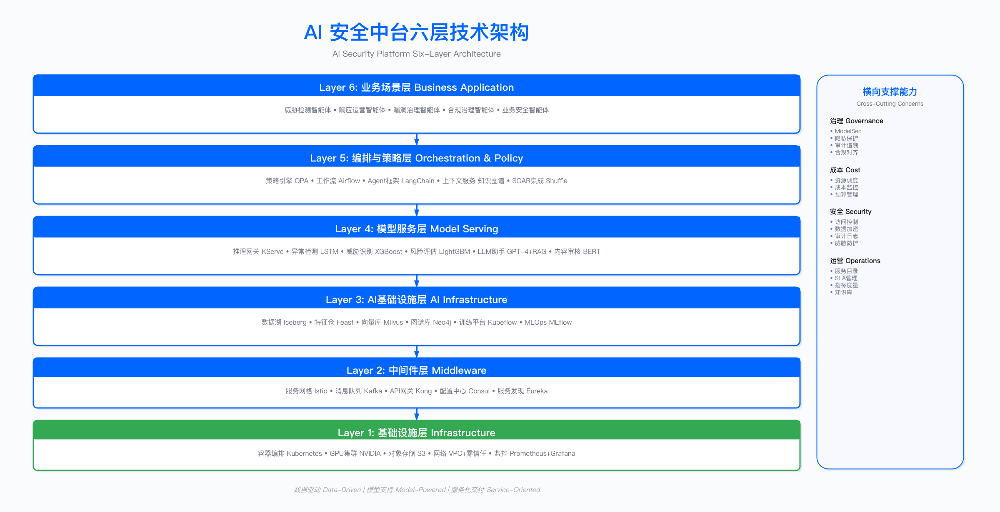

# 17.0　执行摘要

## 本章讲什么

本章讲如何用 AI——尤其是能自主规划、调查、行动的智能体——来做网络安全。全章围绕一把标尺展开：自主等级 L0–L5，用它刻画在一次安全判断里机器能替人承担到哪一步——从只做提示（L2），到自主执行、人来监督（L3），再到自主调查、人管例外（L4）。

*图 17.1：AI 安全平台六层架构——从基础设施、模型服务、智能体运行时到安全控制与治理的分层视图*

在这把标尺上，本章交付四样内容：

- Agentic 安全智能体架构：智能体如何规划、记忆、经 MCP 调用安全工具、接受人在回路的管控，以及如何评估效果与控制成本。
- 各安全域的 AI 落地：SecOps、应用安全、GRC、数据安全、业务安全各自当前能爬到哪一级、前沿在哪。
- 一套落地方法论：选型、数据、评估、ROI，以及中小团队与大厂两条不同的落地路径。
- 一条真实的告警研判轨迹：以 SecOps 为旗舰，展示智能体从收到告警到结案的完整多步调查、人工批准点与失败回滚。

---

## 一根主线：自主等级 L0–L5

刻画 AI for Security 的尺子是自主等级（Levels of Autonomy）——它借自自动驾驶领域成熟的 L0–L5 分级思路，2025–2026 年间被安全业界广泛借用来描述"自主 SOC"的成熟度。

全章只用这一套分级。其他成熟度模型（四级、AISC 四阶段等）描述的是同一件事的不同侧面，一律收敛到这一根主线上，避免同一件事有多套互相打架的说法。

自主等级衡量的是同一件安全工作里，人和 AI 各自站在什么位置：

| 自主等级 | 人机关系 | 当代典型形态 |
|---------|---------|-------------|
| L0–L1 | 全人工 / 规则告警 | 传统规则引擎、机器学习分类器 |
| L2 辅助 | 人做决策，AI 提示 | 检索增强的安全助手（RAG / Copilot） |
| L3 有条件自动 | AI 执行，人监督 | 工作流编排的半自动流程 |
| L4 高度自主 | AI 自主，人管例外 | 安全智能体（agentic）自主运行 |
| L5 完全自主 | 罕见、审慎采用 | 前沿推理模型逼近，尚不普遍 |

关于这把尺子，有三点必须先说清楚，它们贯穿全章：

第一，向上爬是有因果的。 从 L2 爬到 L4，靠的是三级实实在在的技术台阶：可靠的函数调用让模型能稳定操作工具，MCP 之类的工具协议标准化让它接得上一整套安全系统，推理模型带来的自主性让它能自己拆解并推进一次调查。理解了这条因果链，就能判断下一次跃迁会从哪来。

第二，各等级叠加共存，不是新的替代旧的。 2026 年的真实企业里，L2、L3、L4 是同时存在的。一条告警该停在哪一级，由它的价值、风险和可逆性决定——不是越自主越好，而是该自主的地方才自主。

第三，能用一条规则解决的就别请智能体。 这一章凡是主张上智能体的地方，都会先交代它为什么不用更便宜的规则或机器学习分类器。

至于"你的企业能把哪类场景推到哪一级"，这取决于你的组织能力、数据基础和 LLMOps 成熟度——它是一个采用就绪度的维度，附着在这根主线上，而不是另立一套和自主等级打架的分级。

---

## 各节导航

17.1 演进主线与自主等级——L0–L5 各级的含义，三代技术使能者如何推动能力向上爬，以及演进背后的因果机制。参见 [17.1](./17.1_演进主线与自主等级.md)。

17.2 Agentic 安全智能体架构——从集中式中台退场讲起，解剖一个安全智能体的构成（规划、推理、记忆与上下文工程、经 MCP 调用工具、人在回路），再深入三块常被忽略的硬骨头：评估与回归、工具层与 MCP、成本与延迟的分层架构。参见 [17.2](./17.2_Agentic安全智能体架构.md)。

17.3 AI for SecOps（旗舰节）——围绕一条真实告警，完整展示多步工具调用的轨迹、人在回路的审批关卡、便宜过滤加昂贵研判的成本分层、以及一次失败回滚的处置，最后交代这个 agent 该如何被评估。SOAR 在 SOC 值班流程里的具体落地与第11章精确交叉引用。

17.4–17.7 AI for AppSec / GRC / DataSec / BusinessSec——分域看 AI 能力：每个安全域当前处在哪个自主等级、前沿在哪、选型如何取舍。具体如何嵌入该域的工作流，交给对应的域章（第 6、8、11、13 章）。

17.8 编程智能体：把安全嵌进研发与业务流程——用 Claude Code、Codex 这类编程智能体，把 PR 安全门禁、SAST 扫描修复复验、IaC 左移、检测即代码等安全动作嵌进研发流水线。这是工程侧的 AI 落地，与 17.3 的 SOC 侧研判互补。参见 [17.8](./17.8_编程智能体与研发安全.md)。

17.9 AISecOps 落地方法论——选型、数据、评估、ROI，以及会拖垮 AI 项目的那些反模式，并给出中小团队与大厂两条不同路径（自建 / 采购 / 混合的取舍、成本量级、组织能力要求）。

17.10 演进与展望——如何持续跟上：识别下一个拐点的信号清单（工具调用可靠性、长程任务成功率、自主纠错能力），以及一套可操作的跟进机制（季度性的 agent 回归、模型升级 checklist）。参见 [17.10](./17.10_演进与展望.md)。

17.11 案例——三个跨域案例，用同一把自主等级标尺演示"该停在哪一级"：钓鱼研判（L4）、审计取证（L3）、反欺诈（上错等级的反面教材）。参见 [17.11](./17.11_AI安全综合案例研究.md)。

---

## 与第18章的分工

这一章讲如何用 AI 做安全（AI for Security）；第18章讲如何守护 AI 本身（Security for AI）。二者容易在"智能体"这个话题上撞车，所以先划清边界：

- 本章 17.2 只讲"落地一个安全 agent 时，你必须消费哪些安全控制"（权限最小化、沙箱、审计、成本闸门），点到为止。
- 智能体自身的攻防深度——提示注入、工具滥用、供应链后门、MCP 信任边界的防御设计——归第18章。本章遇到这些话题一律交叉引用过去，不展开。

换句话说，本章把 agent 当作防守方的武器来用；第18章把 agent 当作需要被防守的资产来护。两个视角互补，不重叠。

---

## 三条贯穿全章的判断

判断一：自主不是目的，价值、风险、可逆性才是。别因为"能上 L4"就把每条告警都推到 L4。爆炸半径大、不可逆的操作，就该留在低自主等级、留一道人在回路的关卡。这三个维度决定一条告警该停在哪一级。

判断二：跟上演进需要机制，不是一次性投入。模型会再次跃迁，今天调好的 agent 会在下一代模型上出现行为漂移。没有季度回归、没有模型升级 checklist，再好的落地也会慢慢腐化。17.10 专门讲这套持续跟进的机制。

判断三：演进由底层模型能力驱动。AI for Security 能走到哪一步，根本上取决于底层大模型能力的进步——模型每强一分，能安全地交给 AI 自主的边界就前移一格。当前最鲜明的例证是 Claude Mythos 这类前沿推理模型：它把"让智能体自主调查一条告警"从设想推成了可落地的工程（17.1.4 展开）。

---

下一节预告：[17.1 演进主线与自主等级](./17.1_演进主线与自主等级.md)

从 L0 到 L5，把这根主线交代清楚：三代技术使能者如何一级一级把安全能力推上自主等级，演进背后的因果机制是什么，以及你该如何给自己当前的位置定位。

---

## 导航

[← 返回章节目录](./README.md) | [返回章节目录](./README.md) | [下一节：17.1 演进主线与自主等级 →](./17.1_演进主线与自主等级.md)

---

© 2025-2026 AISecOps Project. Licensed under CC BY-NC-SA 4.0
