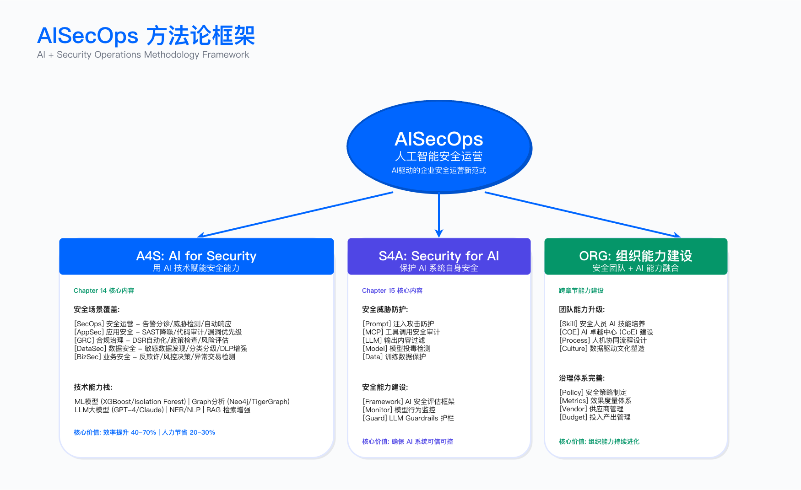
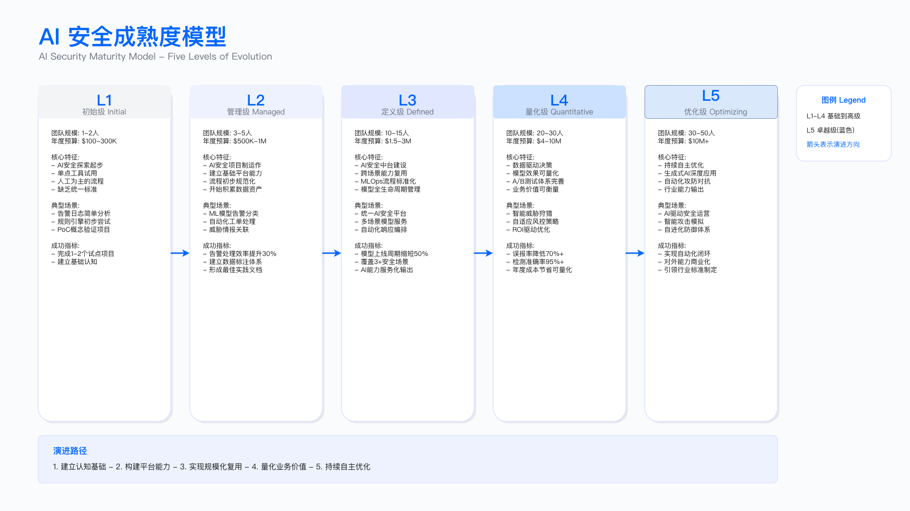

# 17.1　演进主线与自主等级

> 本节建立贯穿全书的唯一分级标尺——自主等级 L0–L5，讲清能力为什么会沿它往上爬，以及当前前沿停在哪里。
> 目标读者：CISO、安全负责人、架构师、AI 安全工程师

---

## 17.1.1 自主等级：AI 在安全判断中的参与程度

衡量 AI 在安全工作中走到了哪一步，核心问题只有一个：在一次安全判断里，机器能替人承担到哪一步？ 是只做提示、人来决策，还是能自己动手、人来监督，还是能自主到人只需要管例外？

本书用自主等级（Levels of Autonomy）回答这个问题。全书统一使用这一套 L0–L5 标尺：能力沿自主等级向上爬，底层技术范式是推动它往上爬的台阶，组织就绪度决定你敢把哪类场景推到哪一级。

先把这把尺子的来历说清楚，避免读者高估它的权威性。**它是本书自建的分析框架，不是任何标准组织发布的分级。** 借用的只是 SAE J3016 自动驾驶分级的外壳——"用统一刻度描述人机决策权重"这个思路，以及 L0–L5 的六档记号；每一档的具体定义、技术使能者与适用场景，都是本书按安全场景重新写的，与 J3016 的条款没有对应关系。这样做的价值在于给"上 AI"这件事一把可对照的尺子，代价是它没有外部认证效力：**不要把它写进合同或对外宣称，也不要拿厂商标称的"L4"直接当本书定义的 L4** ——厂商的分级各说各话，落地时唯一可靠的做法是按本书 17.1.2 的定义逐条核对它到底自己做了哪几步、人在哪里介入。

> 记号约定：本书的 L0–L5 专指自主等级。云安全成熟度用 M1–M5（5.1.4），人员分层用一线/二线/三线，SLSA 等外部标准的等级一律带标准名前缀（如"SLSA Build L3"）。见到裸的 L 记号，指的就是自主等级。

---

## 17.1.2 自主等级 L0–L5：全书唯一的标尺

自主等级衡量的是在一类安全场景里，AI 相对于人的决策权重。级别越高，机器承担的判断和动作越多，人退到监督和例外处理的位置。

| 自主等级 | 人机关系 | 一句话刻画 | 典型技术使能者 |
| -------- | -------- | ---------- | -------------- |
| L0 全人工 | 人做全部判断与动作 | 分析师逐条看日志、逐条查 | 无 AI，纯人力 + 检索工具 |
| L1 规则告警 | 系统按规则报警，人处理 | 规则/签名命中即告警，人核实 | 传统规则引擎、SIEM 关联规则 |
| L2 辅助 | 人决策，AI 提示 | AI 帮你把材料查齐、把要点讲清，人做决定 | 检索增强（RAG）/ 安全 Copilot |
| L3 有条件自动 | AI 执行，人监督 | AI 按预设流程跑完多步动作，人守在关键节点 | 工作流编排（把若干模型/工具串成流程） |
| L4 高度自主 | AI 自主，人管例外 | AI 自己规划、自己调工具、自己纠错，人只处理它兜不住的 | 安全智能体（Agent 运行时 / Agent SDK） |
| L5 完全自主 | 罕见，且需审慎 | 全流程无人干预，人只做事后审计 | 前沿推理模型逼近（见 17.1.4） |

这张表的用处不在于把每类场景精确归格，而在于说明"上 AI"从来是一个刻度盘，不是一个开关。 同一个 SOC 里，"钓鱼邮件研判"可能已经跑到 L4，"重大事件的处置决策"却还停在 L2——因为后者出错的代价高、可逆性差，你不敢放手。哪条告警停在哪一级，由三件事决定：这次判断的价值有多高、出错的风险有多大、动作是否可回退。

### 每一级的留存形态

自主等级不是"新的替代旧的"。到 2026 年，L1 到 L4 在同一家企业里同时存在、各管一摊。下面逐级说明它今天还活在什么地方。

L0–L1：规则与人力，仍是地基

规则告警没有消失，也不该消失。签名匹配、关联规则对于已知的、边界清晰的威胁依然是最便宜、最可解释、最可靠的手段。AI 在这一层的位置是补位：它接手规则处理不了的部分——未知模式、海量噪声、需要上下文推理的判断。一条稳定的规则就能可靠处理的告警，留在 L1，不必浪费更贵的 AI。

L2 辅助：检索增强，今天的默认起点

L2 是绝大多数企业真正落地并产生价值的第一站。它的形态是"会查资料的助手"：分析师面对一条告警，AI 把相关日志、历史工单、威胁情报、处置知识一次性检索齐全并归纳成要点，分析师在此基础上快速判断。决策权始终在人手里，AI 只负责把材料备齐、把上下文讲清楚。它风险低、见效快，是投入产出比最高的入门场景（例如告警上下文聚合、处置知识问答）。分析师每天耗在"搜集和拼凑上下文"上的时间，正是 L2 能立刻接手的部分。

L3 有条件自动：工作流编排，把多步固化下来

当一类处置动作足够标准化，可以把"查—判—处置"的若干步骤固化成一条流程，让 AI 按流程自动跑完，人只守在几个关键决策点上放行或叫停。它比 L2 前进了一步——AI 开始真正执行动作，而不只是提示；但流程是人预先设计死的，AI 不会自己改变步骤。这一级适合边界清晰、变化不大的重复处置——那些"每次都走同样几步"的处置正是 L3 的对象。

L4 高度自主：安全智能体，当前前沿的落地形态

L4 是本章的重心。它和 L3 的本质区别在于：流程不再是人写死的，而是智能体自己规划出来的。 面对一条告警，智能体自己决定先查什么、再查什么，根据中间结果调整方向，自己调用工具、自己纠正错误的假设，最后给出研判结论——人退到监督和例外处理的位置，只在爆炸半径大、不可逆的动作前把关。这一级之所以到 2025—2026 才真正可行，靠的是 17.1.3 要讲的那三级技术台阶。它的用武之地，是那类今天仍靠资深分析师"凭经验一步步查"、且难以固化成死流程的判断——但前提是更便宜的 L2/L3 确实兜不住。

L5 完全自主：审慎对待，不是目标

L5 意味着全流程无人干预，人只做事后审计。在安全领域，绝大多数场景不该、也不需要追求 L5——安全判断的代价决定了"人管例外"这个环节几乎总是划算的。L5 是一个方向，而不是一个要冲的终点。多数企业在 L4 就已经拿到了 AI 安全的绝大部分价值。

### 一个必须写在这里的反面证据：模型不知道什么时候不该动手

上面这张表有一个隐含假设需要挑明：L4 的"人管例外"能成立，前提是 AI 自己知道哪些情况属于例外、该停下来交给人。**当前的公开测量结果不支持这个假设。**

OpenSec 事件响应校准基准的做法是给模型一批事件，其中掺入证据不足或指向错误的情形，看它会不会克制。在合成环境、每个模型 40 个 episode 的规模下，表现最"积极"的模型对**全部**事件都采取了遏制动作（遏制率 100%），而其中 82.5% 的 episode 里至少有一次遏制动作打在了无关实体上；其余几个模型的遏制率在 62.5%–92.5%，错误遏制比例 45%–65%。作者的结论是模型的短板不在检测而在**克制**。

引用这组数字必须带住口径：**这是合成环境的小样本（每模型 40 个 episode）、单作者、未见同行评议，不能当作产品选型依据**；错误遏制的定义是"该 episode 中至少出现一次针对无关实体的遏制动作"，涵盖封错域名、重置错账号等，不是通常意义上的"误隔离率"。

即便打足折扣，它指出的方向对本章的分级有直接影响：**"AI 自主、人管例外"这句话里，"例外"的识别能力目前主要还在人这一侧，不在模型这一侧。** 这不是把 L4 从阶梯上划掉的理由，而是说明 L4 的落地形态必须是"AI 自主调查 + 处置动作走人工闸门"，而不是"AI 自主判断什么时候该叫人"。17.3 第四节把这条要求落成了具体的审批设计，5.8.8 的红线清单同理。谁要是把 L4 理解成"配好红线就可以让 agent 自己决定越不越线"，方向就反了——红线必须由编排层强制，不能交给模型自觉。

> 出处：Barnes, J.，《OpenSec: Measuring Incident Response Agent Calibration Under Adversarial Evidence》，arXiv:2601.21083，2026-01-28，<https://arxiv.org/abs/2601.21083>。**单作者、未见同行评议、合成环境小样本，作为方向性参考而非结论性证据引用。**

---

## 17.1.3 演进因果：三级技术台阶如何把能力推上自主等级

只列出 L0 到 L5 六个格子还不够，关键是因果：是什么让能力从 L2 一路爬到了 L4？ 讲清这条因果链，才能在出现新技术时判断它会把能力推到哪一级。


*图 17.2：AISecOps 方法论框架——AI for Cybersecurity 与 Security for AI 两条主线的关系*

推动这轮跃迁的，是三级环环相扣的技术台阶：

```
可靠的 function-calling  →  MCP 工具生态标准化  →  reasoning 模型驱动的自主性
     （能动手）              （动手不必重复造轮子）        （知道该动哪只手）
        ↓                          ↓                            ↓
   从"只会说"到"会做"      从"每个集成手写"到"即插即用"    从"按流程走"到"自主决策"
     L2 → L3 的地基            L3 → L4 的加速器              L4 得以成立的关键
```

台阶一：可靠的 function-calling——让模型从"只会说"变成"会做"。 早期大模型只能输出文本，你没法信任它去真正触发一个动作。当模型能够稳定地、格式正确地调用外部函数（查一个 IP 的信誉、拉一段 EDR 进程树、开一张工单），AI 才第一次具备了"执行"而非"建议"的能力。这是从 L2（只提示）迈向 L3（能执行）的地基：没有可靠的工具调用，一切自动化都只是空谈。

台阶二：MCP 工具生态标准化——让"接工具"不再是重复造轮子。 光能调用工具还不够。如果每接一个 SIEM、一个 EDR、一个威胁情报源都要手写一套专属集成，智能体的能力边界就被集成成本死死卡住。工具协议（以 MCP 为代表的模型上下文协议）把"AI 如何消费一个工具"标准化，让新工具即插即用。这一步看似只是工程便利，实则是量变到质变的关键：只有当接入任意工具的成本足够低，智能体才可能拥有足够广的行动空间去自主完成复杂调查。 它是 L3 到 L4 的加速器。工具层与 MCP 的具体架构，17.2.3 展开。

台阶三：reasoning 模型驱动的自主性——让 AI 从"按流程走"到"知道该动哪只手"。 前两级台阶解决了"能动手、动手方便"，但没解决"该先动哪只手"。L3 的工作流靠人预先设计好步骤，AI 只是执行者。真正让 AI 迈进 L4 的，是推理模型的自主规划能力：面对一条陌生告警，它能自己拆解问题、自己决定调查顺序、根据中间证据调整假设、发现走错了能自己纠偏。这一步把"流程的作者"从人换成了模型本身——这正是 L4"高度自主"的定义所在。

三级台阶合起来，解释了为什么"让智能体自主研判告警"这件在 2023 年还像科幻的事，到 2025—2026 年成了可落地的工程。也正因为这条因果链清晰，你可以拿它当尺子去量任何一项新技术：它是在强化哪一级台阶？它会把哪类场景往上推一格吗？

> 一句提醒贯穿全章：三级台阶让 L4 成为可能，不等于什么都该上 L4。把一个场景往上推一格之前，先看更便宜、更可解释的规则（L1）或检索助手（L2）能不能兜住；只有低级别确实兜不住时，更高自主性的成本与风险才值得付。

---

## 17.1.4 前沿拐点：从"检索问答"到"自主调查"

自主等级的阶梯上，有一个正在发生的关键拐点。

耐久的命题是这样的：当推理与智能体模型的自主调查能力跨过某个可靠性阈值，两件事会发生质变——

- 告警研判从"检索问答"跃迁为"自主因果调查"：过去 AI 只能把相关材料查给你看（L2），跨过阈值后它能自己顺着证据链一路追问下去，还原出"谁、在什么时候、通过什么路径、做了什么"的因果链条（L4）。
- 威胁狩猎从"人工假设驱动"跃迁为"智能体自主探索假设空间"：过去是资深猎手先提出"也许攻击者在用某种手法"的假设、再去验证；跨过阈值后，智能体能自己生成并逐一检验大量假设，覆盖人力顾不上的搜索空间。

这个规律不依赖任何具体产品：能力跨过阈值就带来范式跃迁，换任何一个模型来实现它，规律依然成立。当前最接近这个阈值的，是以 Claude Mythos 为代表的前沿推理模型。

判断一项新模型是否正在跨越阈值，盯住三个可观察的指标：

1. 工具调用可靠性：在真实的多工具环境里，它调用工具的成功率和格式正确率是否稳定到可以托付执行——这决定它能不能真正"动手"。
2. 长程任务成功率：面对需要十几步、几十步才能完成的调查任务，它能否走到底而不半途跑偏——这决定它能不能"自主走完全程"。
3. 自主纠错能力：当中间某一步出错或假设被证伪，它能否自己发现并回头修正，而不是一条道走到黑——这决定它能不能"在无人盯着时被信任"。

这三个信号构成识别下一个拐点的清单。17.10 会把它落成可操作的机制（季度智能体回归、模型升级检查清单）。

---

## 17.1.5 企业采用就绪度：决定场景能推到哪一级的三个条件

技术台阶决定了能力能爬到哪一级，但该不该把你的某个场景推上去，取决于你的组织就绪度。它不是又一套独立的成熟度模型，只是自主等级的一个约束维度——回答的是同一个刻度盘上"手能拧到哪一格"。


*图 17.3：AI 安全成熟度模型——各能力域在 L0–L5 自主等级上的分布与就绪度判断*

三个决定就绪度的因素：

- 组织能力：你有没有既懂安全又懂 AI 的人来运维更高自主级别的系统？自主等级越高，出问题时的排障越依赖跨界能力。团队跟不上，硬推 L4 只会制造无人能管的黑盒。
- 数据成熟度：更高的自主等级需要智能体能消费到干净、齐全、可信的数据与工具接口。日志采集残缺、工单散落各处、威胁情报没接进来，智能体就算会规划也无米下锅。
- LLMOps 成熟度：能不能对智能体做轨迹级的评估、监控行为漂移、在模型升级后做回归。没有这套工程能力，就无从知道一个跑在 L4 的智能体今天是否还和上线时一样可靠——而这正是放手的前提。

把这三条对照到具体场景，就能回答本章反复追问的那个问题：同样一条告警，该把它的研判交到哪一级。 价值高、风险大、不可逆的场景，即便技术上能上 L4，组织就绪度不足时也应该退回 L2/L3，让人守住关键节点。低级别不是落后，而是与你当前承受力相匹配的理性选择。

各安全域（SecOps、AppSec、GRC、数据安全、业务安全）该把自己的场景推到哪一级、当前前沿在哪、选型如何取舍，17.4 到 17.7 会分别给出判断；智能体架构与评估、成本分层等落地能力，17.2 展开；完整实操——一条真实告警从头到尾的智能体自主研判——在 17.3。

---

## 本节小结

- 全书只有一套标尺：自主等级 L0–L5，衡量在一类安全场景里 AI 相对于人的决策权重。其他多套成熟度框架统一收敛到这里。
- 演进三代范式（RAG → 工作流 → Agentic）不是第四套成熟度，而是推动能力沿自主等级向上爬的技术使能者。
- 因果链讲清了跃迁的道理：可靠的 function-calling（能动手）→ MCP 工具生态标准化（动手方便）→ reasoning 模型的自主规划（知道该动哪只手），三级台阶把能力从 L2 推到 L4。
- 各级叠加共存：到 2026 年，L1 到 L4 在同一家企业里同时存在；哪条告警停在哪一级，由价值、风险、可逆性决定。
- 前沿拐点：推理/agentic 模型跨过自主调查阈值即发生范式跃迁，Claude Mythos 是当前最接近该阈值的代表。识别下一个拐点，盯住工具调用可靠性、长程任务成功率、自主纠错能力三个信号。
- 就绪度决定放手的边界：组织能力、数据成熟度、LLMOps 成熟度共同决定能把哪类场景推到哪一级。低级别不是落后，是与承受力匹配的理性选择。

---

## 下一节预告

[17.2 Agentic 安全智能体架构](./17.2_Agentic安全智能体架构.md) 将从"自主等级"落到"怎么把一个 L4 智能体真正建出来"：

- 从集中式中台到智能体：为何 agentic 时代集中式中台退场
- 安全智能体的解剖：规划、推理、记忆与上下文工程、工具（经 MCP）、人在回路
- 工具层与 MCP：安全智能体如何消费 SIEM/EDR/威胁情报/工单，以及 MCP server 的信任边界
- 单体 vs 多智能体编排，以及"何时不要用多智能体"
- 评估与回归、成本与延迟分层架构、生产工程与分级 gating

---

## 导航

[← 上一节：17.0 执行摘要](./17.0_执行摘要.md) | [返回章节目录](./README.md) | [下一节：17.2 Agentic 安全智能体架构 →](./17.2_Agentic安全智能体架构.md)

---

© 2025-2026 AISecOps Project. Licensed under CC BY-NC-SA 4.0
