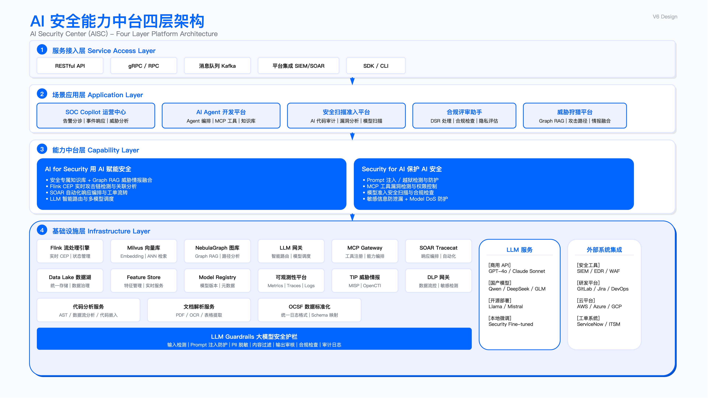
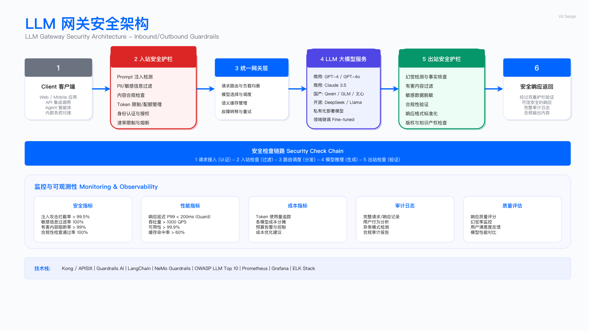

# 17.2　Agentic 安全智能体架构

上一节（17.1）确立了本章的骨架：AI for Security 沿着自主等级 L0–L5 向上爬，推动这次攀爬的是三级技术台阶——可靠的 function-calling、MCP 工具生态标准化、推理模型驱动的自主性。到 2026 年，多数领先安全团队的告警研判已经从 L2 的"检索问答"迈入 L3–L4，一部分高价值场景开始交给能自主规划、调用工具、迭代求证的安全智能体（security agent）。

这一节回答一个具体问题：当能力爬到 L4，架构应该长什么样。它不再是一张画满组件框的静态图，而是一套围绕智能体运转的工程方法——智能体如何被组装、如何经 MCP 消费安全工具、单体还是多体、如何选框架、如何被评估和回归、如何在成本与延迟之间分层、如何在生产里被观测和降级，以及落地时必须给它套上哪些安全控制。

有一件事贯穿全节，需要先说清楚：凡是要动用智能体的地方，都必须先回答"为什么不用更便宜的规则或 ML"。绝大多数告警不值得一次多步推理的开销，能用一条 Sigma 规则或一个分类器解决的问题，就不该请出智能体。架构的价值在于把 agent 用在它唯一能胜任、且值得的地方，而不是处处铺开。

---

## 17.2.1 从中台到智能体：为何集中式中台在 agentic 时代退场

2023–2024 年，AI 安全领域的主流架构叫"AI 安全中台"——把向量检索、流处理、SOAR、LLM 路由等原子能力沉淀为一个集中式平台，下游应用调用标准化 API 获取"上下文增强的推理结果"。这套设计属于 L2 形态，它解决的核心问题是上下文工程：在模型每一步为它组装恰当的上下文。这个问题今天依然存在，而且更重要了——但"用一个中台居中调度所有上下文"这个解法，在 agentic 时代不再成立。

原因在于控制权的转移。中台范式的隐含前提是：上下文由平台在请求进入模型前一次性拼装好，模型是被动的推理端点。这在单轮问答里成立。但到了 L4，智能体自己决定下一步做什么、需要什么信息、该调哪个工具——上下文不再是"请求前拼好的一份"，而是智能体在多步循环中动态获取的一连串结果。当决策主体从平台转移到模型，"集中式中台预先编排一切"的架构就失去了根基。

| 维度 | 中台范式（L2–L3） | 智能体范式（L4） |
|------|------------------|-----------------|
| 控制主体 | 平台编排流程，模型填空 | 模型自主规划，框架托管循环 |
| 上下文获取 | 请求前一次性拼装 | 多步循环中按需动态获取 |
| 能力形态 | 原子能力封装为 API | 能力封装为可被模型调用的工具 |
| 集成方式 | 每个下游应用对接平台 SDK | 统一经 MCP 协议消费工具 |
| 扩展方式 | 平台团队新增能力接口 | 挂载新 MCP server / 新技能 |
| 失败模式 | 编排链断裂 | 智能体绕路、幻觉、工具误用 |

这不意味着"平台"消失了。数据湖、流处理、向量库、SOAR 引擎这些基础设施依然需要，而且比以前更需要标准化——只是它们的角色从"居中编排的中台"退化为"智能体可以调用的工具后端"。真正退场的是"由一个中枢平台预先编排智能过程"的思路：在 L4，编排的主体是模型自身，平台的职责收敛为三件事——把能力暴露成可靠的工具（17.2.3）、给智能体套上安全与成本的护栏（17.2.8、17.2.9）、以及持续评估它有没有跑偏（17.2.6）。

上下文工程没有过时，它被重新定位了。 过去它是中台的核心卖点——预先为一次推理拼好上下文；现在它变成智能体运行时的一项持续职责——在多步循环里管理一个会不断增长、必须被压缩和裁剪的上下文窗口。这一转变的具体工程手法，放在下一节智能体解剖里讲。

---

## 17.2.2 安全智能体解剖：规划、推理、记忆、工具、人在回路

一个安全智能体不是"一个更聪明的 API"，而是一个由模型驱动、在循环里运转的自主系统。拆开来看，它由五个能力部件组成。这五个部件是耐久的抽象——无论用哪个框架搭建，一个能干活的安全智能体都逃不开它们。


*图 17.4：安全智能体四层架构——规划层、推理层、记忆层、工具层的职责划分与数据流*

```
┌─────────────────────────────────────────────────────────────────────┐
│                        安全智能体的五个部件                          │
├─────────────────────────────────────────────────────────────────────┤
│                                                                     │
│   告警 / 任务输入                                                    │
│        │                                                            │
│        ▼                                                            │
│   ┌─────────┐   规划：拆解任务、决定下一步、判断何时收敛              │
│   │ 规划器  │◀──────────────────────────────────────┐              │
│   └────┬────┘                                        │              │
│        │ 决定调用工具                                 │ 观察结果      │
│        ▼                                            │ 回灌         │
│   ┌─────────┐   推理：解读工具返回、形成假设、下一步动作             │
│   │ 推理核心 │─────────────────────────────────────┐│              │
│   └────┬────┘                                      ││              │
│        │                                          ││              │
│        ▼                                          ▼│              │
│   ┌─────────┐        ┌─────────┐          ┌─────────┐             │
│   │ 记忆与  │        │ 工具层  │          │ 人在回路 │             │
│   │ 上下文  │        │(经 MCP) │          │  gate   │             │
│   │ 工程    │        │SIEM/EDR │          │ 高风险   │             │
│   │         │        │TI/工单  │          │ 动作拦截 │             │
│   └─────────┘        └─────────┘          └─────────┘             │
│        │                                                            │
│        ▼                                                            │
│   研判结论 + 建议动作（低风险自动 / 高风险待批）                      │
│                                                                     │
└─────────────────────────────────────────────────────────────────────┘
```

规划器决定"下一步做什么"以及"什么时候算做完了"。在安全研判里，这意味着把"这条告警是真是假、影响多大、要不要处置"拆成一串可执行的取证步骤：先查资产上下文，再拉认证日志，发现异常再查横向移动路径……规划的质量直接决定研判会不会绕远路或提前收敛。规划要么由模型隐式完成（推理模型在思考链里自己排步骤），要么由框架显式约束（用 graph/DAG 把允许的步骤和转移写死）——这条控制反转的轴，是 17.2.5 框架选型的核心。

推理核心是底座 LLM，负责解读每一步工具返回的原始数据、形成和修正假设。这里有一条不能松的纪律：安全研判的推理必须可溯源。模型说"这台主机存在横向移动"，必须能指回是哪条认证日志、哪个图谱路径支撑了这个判断——否则一次幻觉就可能触发一次误隔离。可溯源不是模型的自觉，是架构强加的约束：每个结论都要绑定它所依据的工具返回。

记忆与上下文工程是 L4 时代上下文工程的新形态。单轮 RAG 里，上下文是请求前拼好的一份；智能体里，上下文是一个在多步循环中不断增长、必须被主动管理的窗口。安全调查动辄十几步工具调用，每一步的返回都可能塞进上下文，很快就会撑爆窗口、稀释注意力。这里沿用并重构上一版的分层上下文策略——把窗口预算按"稳定性"分层管理：

| 上下文层 | 内容 | 预算特征 | 管理策略 |
|---------|------|---------|---------|
| 系统层 | System prompt、安全策略约束、工具定义、角色边界 | 固定、每次部署才变 | 常驻，不压缩 |
| 会话层 | 已有分析结论、假设、待办步骤 | 弹性，随调查推进增长 | 定期摘要压缩，保留关键结论 |
| 任务层 | 当前步骤所需上下文（本次工具返回、检索结果） | 动态，每步替换 | 用完即弃或降权 |

不同调查任务对上下文的需求差异很大——告警分类只要资产和威胁情报，几 K token 足够；攻击链分析需要跨时间窗口的事件序列和图谱路径，窗口要大得多。当累积上下文超预算时，靠三种手法回收：摘要压缩（把早期分析结论浓缩成结论，丢掉推理过程）、实体抽取（长文档只留结构化的 IOC、账号、主机）、降权丢弃（几步之前的中间返回不再进入新一轮上下文）。上下文工程的核心权衡始终没变：信息完整性 vs 窗口效率——压得太狠丢关键线索，留得太满稀释推理。区别只在于，现在这件事要在运行时的每一步循环里做，而不是请求前做一次。

前沿推理模型（以 Claude Mythos 为代表）已能原生处理十万至百万级 token 的长上下文，配合模型内建的"上下文压缩/记忆"能力，一部分手工摘要工作被模型自己接管。这降低了外部上下文工程的负担，但没有取消它——长窗口不等于该把所有东西都塞进去，无关上下文依然稀释注意力、抬高成本和延迟。分层上下文策略不以任何具体模型的窗口大小为前提。

这套分层策略落到运行时，是一份装配预算：每一步进模型的上下文由哪几段拼成、各段占多少 token、超预算时先砍谁。下面这份预算由装配器执行，不靠模型自觉。

```yaml
# context-budget.yaml —— 一次 agent 调用的上下文装配预算
# 运行时按本文件装配每一步的上下文：先按 order 拼，再按 overflow 里的顺序回收，
# 装配完的实际占用逐步上报。预算是硬的——超了由装配器截断，不由模型自觉。
version: 2
model_window_tokens: 200000
reserve_for_output_tokens: 8000
assembly_budget_tokens: 120000        # 只用窗口的一部分：留出余量给单步返回的尖峰

slots:
  - id: system_prompt
    order: 1
    budget_tokens: 3000
    stability: static                 # 部署才变
    cacheable: true                   # 稳定前缀走 prompt 缓存，每步不重复计费
    truncation: none                  # 超预算属于配置错误，装配器直接报错而非截断
    evictable: false

  - id: tool_definitions
    order: 2
    budget_tokens: 12000
    stability: static
    cacheable: true
    truncation: drop_tools_by_state_allowlist   # 只带当前状态允许调用的工具
    evictable: false
    note: 工具描述是模型选工具的唯一依据，不能截断句子，只能整条丢

  - id: task_goal
    order: 3
    budget_tokens: 1500
    stability: per_run                # 一次调查内不变
    cacheable: false
    truncation: none
    evictable: false

  - id: retrieved_evidence
    order: 4
    budget_tokens: 45000
    floor_tokens: 20000               # 硬地板：回收时不得压到这条线以下
    stability: growing
    cacheable: false
    truncation: rank_then_drop        # 按与当前假设的相关性排序，从尾部整条丢
    keep_fields_verbatim: [source_id, timestamp, entity, raw_excerpt]
    evictable: true
    note: 结论要能指回证据，被丢掉的证据必须在 dropped_evidence_ids 里留号

  - id: trajectory_summary
    order: 5
    budget_tokens: 25000
    stability: growing
    cacheable: false
    truncation: summarize             # 见下方 trajectory_policy
    evictable: true

  - id: current_observation
    order: 6
    budget_tokens: 30000
    stability: per_step               # 每步替换
    cacheable: false
    truncation: head_and_tail         # 保留开头的结构与结尾的汇总行
    evictable: false
    note: 本步工具返回。它已被工具层的 result_limits 限过一次，这里是第二道

# ── 历史轨迹的摘要阈值：这一段是整份配置里最不能省的 ──────────────────
trajectory_policy:
  keep_verbatim_last_steps: 3         # 最近三步保留原文，模型要靠它接上下一步
  summarize_when_any:
    - steps_since_last_summary: 4
    - trajectory_tokens_exceed: 18000 # 早于 budget_tokens 触发，留出压缩的余量
  summary_max_tokens: 4000
  must_preserve_in_summary:           # 压缩可以丢过程，不能丢这几类可追溯信息
    - step_index
    - tool_name
    - decisive_findings
    - source_ids                      # 证据编号必须活到最后，否则结论断了链
    - rejected_hypotheses             # 已排除的假设：丢了模型会绕回去重查
    - denied_tool_attempts
  drop_from_summary: [full_tool_args, raw_tool_output, intermediate_reasoning]
  on_summary_failure: converge_partial_and_handoff

# ── 回收顺序：谁先被挤出去 ───────────────────────────────────────────
overflow:
  order: [trajectory_summary, retrieved_evidence, current_observation]
  respect_floor: true                 # retrieved_evidence 的 floor_tokens 优先于顺序
  on_floor_reached: stop_and_handoff  # 压到地板还不够，就交人，不再压证据
  never_evict: [system_prompt, tool_definitions, task_goal]

# ── 每步上报实际占用，否则预算是纸面的 ───────────────────────────────
telemetry:
  emit_per_step: [slot_id, planned_tokens, actual_tokens, truncated,
                  dropped_evidence_ids, summary_triggered, cache_hit_tokens]
  emit_per_run: [peak_assembly_tokens, summary_count, evidence_floor_hits,
                 handoff_reason]
```

历史轨迹必须设摘要阈值，因为长程任务里原始轨迹会挤掉证据。 一次十五步的调查，若每步的原始工具返回都原样留在上下文里，到第八步左右轨迹就会膨胀到几万 token。装配器按 `overflow.order` 回收时，第一个被压的确实是轨迹，但轨迹压到最小仍然不够，下一个就轮到 `retrieved_evidence`。证据一旦被丢，模型手里只剩"我前面查过什么"的流水账，没有"查到了什么"的原文，结论就开始悬空——它记得自己查过认证日志，却记不得日志里那条异常记录长什么样，于是把印象当证据写进结论。`trajectory_policy` 把摘要触发点设在 18000 token，低于该槽 25000 的预算，就是为了让压缩发生在还有余量可压的时候，避免装配器被迫在轨迹和证据之间二选一。`retrieved_evidence.floor_tokens` 是同一件事的另一半：证据槽有地板，压到地板还装不下就 `stop_and_handoff`，交人接手，不再继续压证据。

有代价的选择是 `on_floor_reached: stop_and_handoff`。 它意味着一部分本来还能跑完的调查会在中途交人，人工队列会变长。反过来的做法——继续压证据、让 agent 用残缺的上下文跑到底——产出的是一份看起来完整、实际上没有证据支撑的结论，而这种结论在 gate 上最难识别，它的格式和一份好结论完全一样。把这个失败做成"停下来交人"，是让它以最显眼的方式暴露出来。

照抄时最容易改错的是 `must_preserve_in_summary`。 这份清单里有两项经常被当作冗余删掉。删掉 `source_ids`，摘要后的轨迹就断了与证据的链接，17.2.2 那条"每个结论都要绑定它所依据的工具返回"的纪律在第一次摘要时就失效，且失效得静悄悄——结论依然会写得头头是道。删掉 `rejected_hypotheses`，模型会在摘要之后重新捡起已经排除过的假设，把同一组查询再跑一遍，步数和账单一起翻倍。另一处是 `keep_verbatim_last_steps` 与 `summarize_when_any` 的关系：前者必须小于后者的触发步数，否则每摘要一次就立刻又满足触发条件，装配器会陷入连续摘要。

工具层是智能体伸向真实世界的手——查 SIEM、隔离主机、开工单。这层今天的标准接口是 MCP，单独在 17.2.3 展开。

人在回路 gate 是嵌在循环里的安全阀：当智能体想执行一个高风险、不可逆的动作时，循环在这里暂停，等人确认。gate 放在哪、卡多严，由动作的爆炸半径和可逆性决定——这是 17.2.8 分级 gating 的主题。这里先立一条原则：gate 不是事后审计，是执行前的硬闸门；智能体可以自主完成研判，但不能自主完成"拔网线"。

---

## 17.2.3 工具层与 MCP：安全智能体如何消费 SIEM/EDR/TI/工单

智能体的能力上限，一半取决于模型，另一半取决于它能可靠调用哪些工具。一个连不上 SIEM、拉不到 EDR 遥测、开不了工单的智能体，再会推理也只能空谈。安全研判需要的工具大体是这几类：


*图 17.5：LLM 网关架构——智能体与 SIEM/EDR/TI/工单系统之间的统一接入、鉴权与审计*

| 工具类别 | 智能体用它做什么 | 典型操作 |
|---------|-----------------|---------|
| SIEM / 日志检索 | 拉取告警上下文、关联事件、查历史 | 按时间/实体/规则查询 |
| EDR / 端点遥测 | 查进程树、网络连接、文件活动 | 端点取证、隔离主机 |
| 威胁情报（TI） | 富化 IOC、比对已知威胁 | IP/域名/哈希信誉查询 |
| 资产 / 身份（CMDB/IAM） | 判断资产重要性、账号归属 | 资产画像、权限查询 |
| 工单 / SOAR | 记录调查、触发处置 playbook | 建单、执行遏制动作 |
| 知识库 / RAG | 检索内部 SOP、历史案例、ATT&CK | 语义/图检索 |

为什么是 MCP，而不是给每个工具写一套集成。 在 MCP（Model Context Protocol）成为事实标准之前，给智能体接工具意味着为每个 SIEM、每个 EDR、每个工单系统各写一套适配代码，还要各自处理认证、参数校验、错误处理。这是典型的 N×M 集成地狱。MCP 把"工具如何暴露给模型"标准化了：每个后端提供一个 MCP server，声明自己能做哪些操作、参数是什么；智能体通过统一的 MCP 客户端发现和调用这些工具，不关心背后是 Splunk 还是 Elastic。上一版中台里那些"能力接口"，在 agentic 架构里最自然的落地形态就是一批 MCP server——这也是"中台退场、工具后端留下"的具体含义。

工具设计比工具数量更重要。 一个常见误区是给智能体挂上几十个工具，以为工具越多越能干。实际恰恰相反：工具太多、描述含糊，模型在"该调哪个"上就开始出错和绕路。好的工具层遵循几条原则：

- 粗粒度胜过细粒度：与其暴露十个原子 API 让模型自己编排，不如提供一个"查这个实体的完整上下文"的复合工具，把编排逻辑固化在工具内部——模型少犯错，轨迹也更短、更便宜。
- 描述即接口：模型靠工具的自然语言描述来决定调用，描述必须精确说清"这个工具做什么、什么时候用、参数含义"。描述写得含糊，等于给模型埋雷。
- 返回结构化、可溯源：工具返回要带上来源标识，好让智能体的结论能指回证据（呼应 17.2.2 的可溯源纪律）。
- 只读与写操作分离：查询类工具（读）可以放开让智能体自由调用；处置类工具（写、尤其不可逆的写）必须挂在人在回路 gate 后面（17.2.8）。

MCP server 是新的信任边界。 智能体经 MCP 消费工具，意味着 MCP server 成了智能体与真实系统之间的关卡。一个被投毒的工具描述可以诱导智能体调错工具，一个权限过宽的 MCP server 可以让智能体越权操作，一个把凭据集中托管的 MCP 网关一旦被攻破就是单点沦陷。这些是真实且严峻的攻击面——但它们属于"保护 AI 系统"的范畴，本节只指出其存在性并要求落地时把 MCP server 纳入信任边界管理（见 17.2.9），具体的 MCP 信任边界攻防设计交由第18章（见 [**18.2.7** Agentic AI 安全](../第18章_AI系统安全/18.2_AI安全架构设计与实施.md) 与 [18.3 LLM07/LLM08](../第18章_AI系统安全/18.3_LLM威胁与防护.md)），本节不展开。

攻防不展开，边界本身的形态要给出来：把"纳入信任边界管理"落成一份网关配置。下面这份写的是网关侧的准入与边界——哪些 MCP server 允许被注册、每个 server 向模型暴露哪几个工具、每个工具的副作用与审批要求、参数校验和返回规模怎么卡、被拒的调用如何留痕。

这份配置是网关的声明式一侧；网关**执行**这些声明的那段逻辑（一次调用按什么顺序过白名单、权限、参数校验，每道不过怎么落审计日志、怎么返回错误）在 [18.2.7](../第18章_AI系统安全/18.2_AI安全架构设计与实施.md) 给了实现，本节不重复写一遍。落地时是一套代码读一份配置：那边 `approved_tools` 入参的内容，就是下面 `servers[*].tool_allowlist` 的编译产物。18.2.7 同时给出了这层网关挡不住的那类问题——MCP 协议自身的部署接口缺陷（STDIO 类 RCE）与工具描述投毒，那是把每个 MCP server 当作可能被攻陷的高权限进程来隔离的理由，与本节的准入名单是两道不同的闸门。

它和 17.3 那份工具 schema 是两份不同的东西，分工先说清楚。17.3 写的是一个调查 agent 用到的 9 个工具各自的参数结构与字段含义，属于工具自身的接口定义，由工具的开发者维护；这一份写的是网关允许哪些 server 进来、允许模型看见哪些工具、调用不合规时怎么处理，属于边界定义，由平台组维护。两份文件的交集只有工具名和副作用标记，其余不重叠。一个工具要能被调用，两份都得过。

```yaml
# mcp-gateway/trust-boundary.yaml —— MCP 网关的准入与边界配置
# 作用域：一个 SOC 内所有安全智能体共用的 MCP 网关。智能体不直连任何 MCP server，
# 只连网关；网关按本文件决定三件事——哪些 server 能被注册、哪些工具会被下发给模型、
# 哪一次调用能被放行。工具本身的参数长什么样不在这里定义，见 17.3 的工具 schema。
version: 3
owner: soc-platform
review_cycle_days: 90          # 到期未复审的 server 自动转 quarantined，不再下发其工具

# ── 一、准入：谁能进注册表 ───────────────────────────────────────────
admission:
  default: deny                          # 未登记的 server 一律不可注册，没有隐式放行
  required_evidence:                     # 缺任一项不予注册，由平台组人工核验
    - owner_team                         # 归属团队：出事找谁
    - source_repo_and_commit             # 固定 commit，禁止跟随分支
    - artifact_digest                    # 部署时按摘要拉取，不按标签
    - signature_verified                 # 发布签名已验证
    - credential_scope_reviewed          # 该 server 持有的后端凭据范围已评审
    - data_classification_max            # 该 server 可触达的最高数据分级
  forbid:
    - unpinned_dependency                # 依赖未锁版本
    - runtime_tool_registration          # 运行时自行注册新工具（工具表必须是静态的）
    - default_internet_egress            # 默认可出公网
  on_evidence_missing: reject_and_alert

# ── 二、注册表：每个 server 暴露什么、边界在哪 ───────────────────────
# side_effect 记的是操作的物理属性：能不能撤销。approval 记的是放行需要谁批准。
# 两者独立：可撤销的写操作也可能因为影响面大而需要审批。
side_effect_values: [read_only, write_reversible, write_irreversible]
approval_values: [none, post_audit, duty_analyst, soc_manager, dual_control]

# 与 17.3 编排层 tool_policy 的对齐表。17.3 用的是按风险分档的名字，
# 那是单个 agent 视角下的调用策略；网关这一侧记的是操作本身可不可逆。
# 映射必须同时吃 side_effect 和 approval 两列。只按 side_effect 映射会把审批要求丢掉：
# isolate_host 标的是 write_reversible + duty_analyst，只看前一列它会被映射成
# write_low_risk，而编排层对 write_low_risk 的策略是 allow_with_audit——审批要求
# 在两份工件的接缝处蒸发，网关这边写着"要值班二线批"，编排那边已经放行加审计了。
orchestrator_risk_mapping:
  rule: strictest_of                 # 两列各算一档，取更严的那一档
  severity_order: [read_only, write_low_risk, write_medium_risk, write_high_risk]
  by_side_effect:
    read_only: read_only
    write_reversible: write_low_risk
    write_irreversible: write_high_risk
  by_approval:                       # approval 是 tool_policy 的一等判据，不是注释
    none: read_only
    post_audit: write_low_risk
    duty_analyst: write_medium_risk
    soc_manager: write_high_risk
    dual_control: write_high_risk
  on_missing_or_unknown: write_high_risk   # 任一列缺失或取值不认识，按最高档

# 上表映射出来的结果（照抄时用它自查两份工件有没有对上）：
#   search_events        read_only        + none         → read_only
#   create_ticket        write_reversible + post_audit   → write_low_risk
#   isolate_host         write_reversible + duty_analyst → write_medium_risk
#   delete_file_on_host  write_irreversible + dual_control → write_high_risk

servers:
  - name: siem_query
    endpoint_ref: "secrets://mcp/siem_query/endpoint"   # 真实地址不入库
    data_classification_max: Confidential
    network_zone: soc_internal
    credential_scope: siem_read_only_service_account
    tool_allowlist:                      # 白名单即工具表；未列出的工具不下发给模型
      - name: search_events
        side_effect: read_only
        approval: none
        param_schema: schemas/siem/search_events.json
        result_limits: {max_rows: 200, max_bytes: 65536, on_overflow: truncate_and_flag}
      - name: get_alert_details
        side_effect: read_only
        approval: none
        param_schema: schemas/siem/get_alert_details.json
        result_limits: {max_rows: 1, max_bytes: 16384, on_overflow: truncate_and_flag}

  - name: edr_endpoint
    endpoint_ref: "secrets://mcp/edr/endpoint"
    data_classification_max: Restricted
    network_zone: soc_internal
    credential_scope: edr_investigate_plus_contain
    tool_allowlist:
      - name: get_process_tree
        side_effect: read_only
        approval: none
        param_schema: schemas/edr/get_process_tree.json
        result_limits: {max_rows: 500, max_bytes: 131072, on_overflow: truncate_and_flag}
      - name: isolate_host
        side_effect: write_reversible   # 可解除隔离，但业务中断已经发生
        approval: duty_analyst
        param_schema: schemas/edr/isolate_host.json
        result_limits: {max_rows: 1, max_bytes: 4096, on_overflow: reject}
        max_calls_per_investigation: 1
      - name: delete_file_on_host
        side_effect: write_irreversible
        approval: dual_control
        enabled: false                  # 默认关闭：调查类 agent 不需要它
        param_schema: schemas/edr/delete_file_on_host.json
        result_limits: {max_rows: 1, max_bytes: 4096, on_overflow: reject}

  - name: ticketing
    endpoint_ref: "secrets://mcp/ticketing/endpoint"
    data_classification_max: Internal
    network_zone: corp_internal
    credential_scope: ticket_create_only
    tool_allowlist:
      - name: create_ticket
        side_effect: write_reversible
        approval: post_audit
        param_schema: schemas/ticketing/create_ticket.json
        result_limits: {max_rows: 1, max_bytes: 8192, on_overflow: truncate_and_flag}
        max_calls_per_investigation: 1

# ── 三、参数校验：默认严格，没有 schema 就不给用 ─────────────────────
schema_validation:
  mode: strict
  unknown_params: reject                 # 多出来的参数直接拒，不做忽略
  coerce_types: false                    # 不做 "3" → 3 的隐式转换
  on_missing_schema: disable_tool        # 没有 param_schema 的工具不下发
  max_param_bytes: 8192
  reject_patterns_in_string_params:      # 结构化参数里不该出现查询语句片段
    - raw_query_language
    - shell_metacharacters

# ── 四、返回值规模：由网关强制，不指望模型自觉 ───────────────────────
result_limits_default:
  max_rows: 100
  max_bytes: 32768
  max_window_hours: 168
  on_overflow: truncate_and_flag
  must_emit_fields: [truncated, total_matched, applied_limit]

# ── 五、被拒调用必须留痕 ─────────────────────────────────────────────
# 被拒调用是最容易被静默丢掉的一类事件：agent 没拿到结果，换个参数继续跑，
# 表面上一切正常。这条日志是"agent 试图越界"这项评估指标的唯一数据源。
denial_log:
  enabled: true
  drop_silently: never                   # 任何拒绝路径都不得无记录返回
  record_fields: [timestamp, run_id, agent_id, server, tool, deny_reason,
                  param_hash, side_effect, required_approval, data_classification]
  deny_reasons: [tool_not_in_allowlist, server_not_admitted, server_quarantined,
                 schema_violation, approval_missing, tool_disabled,
                 rate_limited, result_limit_exceeded]
  return_to_agent: {status: denied, reason_code: true, retry_hint: false}
  alert_on:
    - {reason: tool_not_in_allowlist, threshold_per_run: 1}
    - {reason: server_not_admitted, threshold_per_run: 1}
    - {reason: approval_missing, threshold_per_run: 3}
  retention_days: 400
```

副作用按可逆性打标，不按危险程度。 `isolate_host` 听起来比 `create_ticket` 危险得多，但它标的是 `write_reversible`——隔离可以解除。真正需要单独一档的是 `delete_file_on_host` 这类做完就收不回来的操作。这个区分的用处在降级和重试上：网关只看 `side_effect` 就知道一次超时的调用能不能安全重发，可逆写操作重发的代价是重复隔离一次，不可逆写操作重发的代价是删掉第二个文件。按"危险程度"打标会丢掉这个信息，因为危险程度里混进了影响范围，而影响范围已经由 `approval` 那一列承担了。两列独立记录的代价，是往下游映射时必须两列一起吃：`orchestrator_risk_mapping` 取两列各自档位里更严的那一个。少吃一列的后果是具体的——`isolate_host` 标着 `write_reversible`，只按可逆性映射会落到编排层的 `write_low_risk`，而那一档的策略是放行加审计，网关这边"要值班二线批"的要求就在接缝处消失了。工件之间的接缝，是审批要求最容易掉下去的地方。

有代价的选择有两处。 一是 `admission.default: deny` 配上 `forbid` 里的 `runtime_tool_registration`：工具表是静态的，新工具上线必须走一次人工评审，节奏会慢下来，一个"临时加个查询工具"的需求可能要等一周。买到的是一条确定的性质——模型任何时刻能看见的工具集合等于评审过的集合，不会因为某个 server 自己升级而多出一个没人知道的工具。二是 `delete_file_on_host` 的 `enabled: false`：这个工具在注册表里存在、schema 齐备、审批级别写好，但默认关着。把它写进来而不删掉，是为了让"这个能力存在、我们选择不开"成为一条有记录的决定，而不至于变成一次遗漏。

照抄时最容易改错的有三处。 第一处是 `schema_validation.on_missing_schema`，默认值 `disable_tool` 意味着没有参数 schema 的工具不下发给模型。接工具时这一条最容易被当成障碍改成放行，理由是"schema 后面补"。改完之后模型会拿到一个参数自由的工具，它照着工具描述猜参数名，猜错了后端报错，猜对了名字但语义不同就是一次静默的错误查询。第二处是 `denial_log.drop_silently: never`。被拒的调用不产生结果，很容易被实现成"直接返回错误、不落日志"，看起来只是一次失败调用；但"agent 试图调用未授权工具"这项指标只有这一个数据源，日志一停，红线违规和提示注入的痕迹同时消失。第三处是 `return_to_agent.retry_hint: false`：拒绝时告诉 agent 原因码，但不告诉它怎么改能通过。给了重试提示，一次注入就能把网关变成一个可以逐次试探的探测接口。

---

## 17.2.4 单体 vs 多智能体编排：以及何时不要多智能体

搭好一个能干活的单智能体之后，一个诱人的念头是：那多来几个、分工协作，岂不是更强？——大多数时候，这个念头是错的。这一节先讲清楚多智能体的形态，再用更大的篇幅讲何时不要它。

单体智能体：一个模型、一套工具、一个循环，从头到尾自己完成研判。它是默认选项，简单、可观测、可调试。一条告警进来，一个智能体拉上下文、查日志、形成结论、给建议，轨迹是一条清晰的线。绝大多数 SOC 告警研判，单体就够了。

多智能体编排在单体撑不住时才登场，常见两种形态：

- Supervisor / orchestrator–worker：一个主管智能体拆解任务，派给若干专职 worker（一个专查端点、一个专查网络、一个专查身份），再汇总它们的结论。适合任务能清晰切成并行、弱耦合子任务的场景。
- A2A（agent-to-agent）协作：多个对等智能体互相传递中间结果、协商推进。灵活，但也最难控制和调试。

```
   单体（默认）              Supervisor–Worker（任务可切分时）
  ┌─────────┐              ┌──────────────┐
  │  告警   │              │   主管 agent  │  拆解 + 汇总
  └────┬────┘              └──┬────┬────┬──┘
       ▼                      ▼    ▼    ▼
  ┌─────────┐            ┌────┐┌────┐┌────┐
  │ 一个循环 │            │端点││网络││身份│  并行 worker
  │ 自主研判 │            └────┘└────┘└────┘
  └─────────┘                （弱耦合、可并行才值得）
```

何时不要多智能体（这是本节的重点）。 多智能体几乎总是被高估。它引入的代价是实打实的：

1. 成本和延迟成倍上涨。每多一个智能体，就多一份 LLM 调用、多一份上下文、多一轮往返。一个五体协作的系统，token 消耗和延迟可能是单体的数倍，而多出来的准确率往往微乎其微。
2. 可观测性和调试急剧变难。单体的轨迹是一条线，多体是一张交织的网。出了错，你得在多个智能体的交互里定位是谁在哪一步跑偏了、错误是怎么在它们之间传播的。
3. 错误会串联放大。一个 worker 的幻觉结论被主管当作事实汇总，污染整个研判——多体不是"多个大脑纠错"，更多时候是"多个出错点串联"。
4. 协调开销吞掉收益。智能体之间传递上下文、协商谁做什么，本身就消耗大量 token 和轮次，这部分开销经常超过分工带来的好处。

判断准则：只有当任务能被切成真正并行、彼此弱耦合、且各自需要不同工具集或不同专长的子任务时，多智能体才可能划算。如果子任务其实是顺序依赖的、或者一个智能体加几个工具就能覆盖，那就用单体——把"分工"留在工具设计里（粗粒度复合工具），而不是拆成多个智能体。先把单体做到位，再在有明确证据（单体因上下文或工具集过载而系统性失败）时才引入多体，而不是一开始就上多智能体架构。

这条准则可以落成一段判定，让它在设计评审上真的跑一次，而不是停在共识层面。输入是任务的结构化特征，输出是三选一的建议加一句理由。

```python
"""orchestration_choice.py —— 判定一个任务该上单体、多智能体，还是根本不该上 agent。

判据来自 17.2.4：多智能体要同时通过四道闸门才划算，任何一道不过就退回单体。
三个常数是本组织实测值，照抄前必须换成自己账单与轨迹里的数。
"""
from dataclasses import dataclass

SINGLE_COST_PER_STEP_USD = 0.04     # 单体每步的平均模型成本，取近 30 天轨迹中位数
SINGLE_SECONDS_PER_STEP = 12.0      # 单体每步的平均墙钟耗时，含工具往返
MULTI_OVERHEAD = 1.8                # 多体的协调开销系数：上下文传递与汇总的额外消耗


@dataclass
class TaskShape:
    steps: int                      # 完成一次任务的预期工具调用步数
    procedure_is_fixed: bool        # 步骤能否事前写死（能写死就不需要模型来规划）
    parallel_subtasks: int          # 真正可并行、互不等待的子任务数
    dependency_ratio: float         # 子任务间存在顺序依赖的比例，0.0 到 1.0
    distinct_toolsets: int          # 子任务各自需要的独立工具集数量
    error_propagation_cost: str     # low / medium / high：一个子结论出错的下游代价
    budget_usd: float               # 单次任务可接受的模型成本上限
    latency_budget_s: float         # 单次任务可接受的墙钟时间上限


def _agent_blocker(task):
    """先判要不要 agent。返回拦截理由，返回 None 表示可以上 agent。"""
    if task.procedure_is_fixed and task.steps <= 3:
        return "步骤固定且不超过 3 步，写成规则或脚本即可，多步推理在这里买不到东西"
    need_cost = SINGLE_COST_PER_STEP_USD * task.steps
    if task.budget_usd < need_cost:
        return (f"单体跑完 {task.steps} 步约需 {need_cost:.2f} 美元，"
                f"超过 {task.budget_usd:.2f} 美元的预算，这条链路应由更便宜的层承担")
    need_time = SINGLE_SECONDS_PER_STEP * task.steps
    if task.latency_budget_s < need_time:
        return (f"单体跑完约需 {need_time:.0f} 秒，超过 {task.latency_budget_s:.0f} 秒的"
                "延迟预算，赶不上就没有价值")
    return None


def _multi_blockers(task):
    """逐条检查多智能体的四道闸门，返回全部不通过的理由。"""
    blockers = []
    if task.parallel_subtasks < 2:
        blockers.append(f"可并行子任务只有 {task.parallel_subtasks} 个，分工无从谈起")
    if task.dependency_ratio > 0.3:
        blockers.append(f"子任务依赖比例 {task.dependency_ratio:.0%} 高于 30%，"
                        "拆开后多数时间在互相等待")
    if task.distinct_toolsets < 2:
        blockers.append("子任务共用同一套工具，用粗粒度复合工具即可，不必拆成多个 agent")
    if task.error_propagation_cost == "high":
        blockers.append("单个子结论出错的下游代价高，多体会把一次幻觉当作事实汇总放大")
    need_cost = SINGLE_COST_PER_STEP_USD * task.steps * MULTI_OVERHEAD
    if task.budget_usd < need_cost:
        blockers.append(f"多体预计成本约 {need_cost:.2f} 美元，"
                        f"超过 {task.budget_usd:.2f} 美元的预算")
    return blockers


def recommend(task):
    """返回 (choice, reason)。choice 取 no_agent / single_agent / multi_agent。"""
    stop = _agent_blocker(task)
    if stop is not None:
        return "no_agent", stop
    blockers = _multi_blockers(task)
    if blockers:
        return "single_agent", "单体足够，多体不划算：" + "；".join(blockers)
    return "multi_agent", (
        f"{task.parallel_subtasks} 个子任务可并行、依赖比例 "
        f"{task.dependency_ratio:.0%} 在阈值内、需要 {task.distinct_toolsets} 套不同工具、"
        "错误传播代价可控、预算覆盖协调开销，四道闸门全过")


if __name__ == "__main__":
    cases = [
        ("失陷主机全域取证", TaskShape(18, False, 3, 0.2, 3, "medium", 1.50, 600.0)),
        ("可疑登录调查", TaskShape(9, False, 2, 0.7, 2, "medium", 0.60, 180.0)),
        ("已知误报归档", TaskShape(2, True, 1, 0.0, 1, "low", 0.20, 30.0))]
    for name, shape in cases:
        choice, reason = recommend(shape)
        print(f"{name}: {choice}\n  理由：{reason}")
```

判定顺序不能颠倒。 `recommend` 先跑 `_agent_blocker`，通过之后才轮到 `_multi_blockers`。反过来写——先看任务能不能拆、再看要不要 agent——会让一个步骤固定、三步就能跑完的任务因为"有两个子任务可并行"而被推荐成多智能体。"要不要 agent"是"要几个 agent"的前置问题，代码里的先后顺序就是这个前置关系的表达。

四道闸门是与的关系，不是或的关系。 `_multi_blockers` 收集全部不通过的理由，只要列表非空就退回单体。把它改成"任一条通过即可上多体"是这段代码最常见的改错方式，改完之后几乎所有任务都会被判成多智能体，因为"有两个以上可并行子任务"这一条太容易满足。四条同时成立才划算的道理前面已经讲过：并行度不够就没有分工，依赖太密就在互相等待，工具集相同就该用复合工具，错误传播代价高就会把一次幻觉放大成结论。

三个常数是有代价的选择。 `SINGLE_COST_PER_STEP_USD`、`SINGLE_SECONDS_PER_STEP`、`MULTI_OVERHEAD` 写死在模块顶部，好处是这段判定不依赖任何外部服务，评审会上当场就能算；代价是它们会随模型定价和轨迹长度变化而过期，过期之后判定会系统性偏向某一侧——单步成本估低了，`_agent_blocker` 就拦不住那些预算根本不够的任务。这三个数应当跟着 17.2.7 的 `cost_report` 每季度回填一次，回填记录要能查到是拿哪一批轨迹算出来的。

`dependency_ratio` 的阈值 0.3 是照抄时最容易改错的地方。 它不是一个可以随手放宽的调参项。放到 0.6，判定就会把大量顺序依赖的调查任务放行成多智能体，而顺序依赖的子任务拆到不同 agent 上，只是把一条串行链改成了带网络往返的串行链：成本上去了、延迟上去了、可观测性下来了，收益是零。真要调它，先拿一批跑过的任务统计依赖比例与多体实际加速比的关系，再定阈值。

多智能体编排、A2A 协作、supervisor 模式在多个开发框架里都有一等公民支持（见 17.2.5）。框架把多体搭起来变容易了，但"容易搭"不等于"应该搭"：框架降低了多体的实现门槛，却没降低它的运行成本和调试难度，决策仍要回到"任务是否真的可并行切分"这个问题上。

---

## 17.2.5 框架选型：按架构轴对比，给决策树

到了要动手的时候，第一个问题是选什么框架。市面上的选项容易让人眼花，但只要先做一个分类校正，图景就清晰了：agent 生态里有两类根本不同的东西，别把它们混为一谈。

- 开发 SDK / 框架：你写代码，用它来构建自己的智能体。你掌控编排逻辑、工具挂载、部署形态。
- 自托管自主智能体运行时 / 应用：它本身就是一个能跑的智能体应用，你克隆下来、配置一下就能用，自带技能库、记忆、心跳等运行时能力。

这两类解决的是不同问题：前者是"我要造一个 agent"，后者是"我要一个现成能跑的 agent"。选错类别，后面所有对比都是空谈。

两类代表实现：
> - 开发 SDK / 框架：AWS Strands Agents、Google ADK、Claude Agent SDK、LangGraph、CrewAI、AutoGen / AG2。你写代码构建 agent、把它嵌进自己的应用。
> - 自托管自主运行时 / 应用：克隆即跑、常驻进程、自带渠道与技能市场，和写代码构建的开发 SDK 是两条路。当前两个代表实现是 OpenClaw 与 Hermes Agent，下面单列一个小节据实展开。

别用功能勾选表，立在架构轴上比。 功能勾选表（"支持不支持 X"）变得最快，今天缺的功能下个版本就补上了。真正决定选型的是几条架构轴——它们反映框架的设计哲学，短期内不会变：

| 架构轴 | 一端 …………… 另一端 | 选型含义 |
|-------|-------------------|---------|
| 编排范式 | graph/DAG ⟷ 自主循环 ⟷ 角色扮演 | 你要多强的流程约束 |
| 控制反转 | 框架驱动(流程写死) ⟷ 模型驱动(模型自己排) | 可控性 vs 自主性的取舍 |
| MCP / 工具协议原生性 | 原生一等公民 ⟷ 需自行适配 | 接安全工具的成本 |
| 状态与记忆模型 | 无状态 ⟷ 会话记忆 ⟷ 持久自进化记忆 | 长程调查能否续接 |
| 可观测性 / tracing | 内建轨迹追踪 ⟷ 需外挂 | 生产能不能查(17.2.8) |
| 部署形态 | 库(嵌进你的服务) ⟷ 托管 runtime(独立进程) | 运维与隔离形态 |
| eval / 回归支持 | 内建评估钩子 ⟷ 完全自建 | 能否做 17.2.6 的回归 |
| 人在回路 gating | 一等公民(声明式 gate) ⟷ 靠自己拦 | 高风险动作好不好卡 |

安全场景对这几轴里的控制反转、人在回路 gating、可观测性、MCP 原生性尤其敏感——因为安全动作有爆炸半径，你需要能卡住高风险动作、能查清每一步、能可靠接上安全工具。一个纯"模型驱动、无 gate、tracing 靠外挂"的框架，再优雅也不适合直接跑在能隔离主机的链路上。

决策树(而非勾选表):

```
你要造 agent 还是要现成能跑的 agent？
│
├─ 要现成能跑的 → 自托管自主运行时（评估其安全控制、技能来源可信度）
│
└─ 要自己造
   │
   ├─ 流程必须强约束、可审计、步骤可写死（高风险处置链）
   │        → 选偏 graph/DAG、框架驱动的框架
   │
   ├─ 需要模型自主探索、长程调查、假设空间大（威胁狩猎）
   │        → 选偏自主循环、模型驱动的框架
   │
   └─ 需要多角色分工且已确认任务可并行切分（见 17.2.4）
            → 选支持 supervisor/角色扮演的框架
   
   ── 无论哪支,都追加三个硬性筛选 ──
      · MCP 是否原生？（接安全工具的成本）
      · 人在回路 gate 是否一等公民？（能否卡高风险动作）
      · tracing / eval 钩子是否内建？（能否做 17.2.6 与 17.2.8）
```

### 自托管自主运行时的两个实例：形态与攻击面

把上面的抽象落到具体例子上更好理解。截至 2026.7,"自托管自主运行时"这一类里有两个可参考的开源实现——OpenClaw 与 Hermes Agent。下面据实说明它们的形态与来源，不作论证前提。

OpenClaw，社区昵称"大龙虾",MIT 许可，主要作者 Peter Steinberger,2025.11 起开源，前身为 Clawdbot / Moltbot(来源：github.com/openclaw/openclaw)。它的形态是一个常驻的 Gateway——单个长期运行的 Node 进程(默认 WebSocket 端口 18789)，配套 ClawHub 技能市场供安装第三方技能，靠 heartbeat 机制自主唤醒执行定时或触发任务，并原生接入 20 多个即时通讯渠道。

Hermes Agent,Nous Research 出品，MIT 许可，2026.2 发布(来源：github.com/NousResearch/hermes-agent)。它的记忆是 SQLite 持久化，配 Hermes Atlas 技能市场；标志能力是自进化技能——当一个任务的工具调用超过 5 步，运行时会自动把这段流程沉淀成一份 SKILL.md 供以后复用。第三方社区项目(mukul975 的 Anthropic-Cybersecurity-Skills,Apache-2.0，包名含 Anthropic 但非 Anthropic 官方项目、也非 Nous 官方内置)为其 Hermes Atlas 市场贡献了 817 个映射到 MITRE ATT&CK、NIST CSF 2.0、ATLAS、D3FEND、NIST AI RMF 的安全技能，可作为安全 agent 的工具库素材；但面向 SOC/SIEM 分诊的官方技能目前仍是提案(GitHub Issue #515)，尚无可核的生产落地。

这两个运行时最扎实的安全内容是它们自身的攻击面，不是"当 SOC 防御工具"的成熟案例。 这是本节要读者带走的判断。截至 2026.7，公开记录里关于这两个运行时最详实的部分，是它们作为高权限自主实体被攻击、被投毒的事件，而非它们作为成熟防御工具的落地战果。据实列举：

- OpenClaw：2026 年的 ClawHub 技能市场投毒。公开口径需要分清两个数：**ClawHub 上累计确认的恶意技能约 824 个，其中约 335 个可追溯到同一个协同投放的攻击者——被 Repello 与 Koi Security 命名为 ClawHavoc 的正是后面这一批**（2026-05 披露）。受影响用户规模，二手报道给的量级是数十万，**没有可靠的一手安装量与资金损失数字，本书不引用那两类数字**。另有 Bitdefender 的观测：平台发布最初几周，其分析的技能中约 17% 携带恶意载荷（厂商口径）。同期披露多个 CVE，包括 CVE-2026-25253。
- Hermes Agent:2026.3 的 LiteLLM 供应链投毒——Hermes 依赖 LiteLLM，一个恶意版本在线数十分钟，专门窃取 AI provider key、云凭据与 SSH key;Hermes 已在 v0.5.0 移除对 LiteLLM 的直接依赖。另有记忆注入风险：写入 SQLite 记忆的外部内容会在未来会话被当作可信上下文执行，官方 Issue 已追踪并承认这是设计层面的风险。加上凭据集中托管本身构成的单点风险。

选型结论：选一个自托管运行时，等于同时把它的攻击面引进自己的环境。 这类运行时把技能市场、持久记忆、多渠道接入、集中凭据打包成"克隆即跑"，便利的另一面是攻击面也一并进来了。因此选型时必须连带评估、并在落地时消费一组安全控制：权限最小化、沙箱隔离、完整审计、成本闸门、技能来源信任、MCP 信任边界。这些控制的防御深度在第18章展开（见 [18.2 Agentic AI 安全](../第18章_AI系统安全/18.2_AI安全架构设计与实施.md) 与 [18.3 供应链投毒 / 过度代理权限](../第18章_AI系统安全/18.3_LLM威胁与防护.md)）——本节只点出"选型即引入攻击面、落地要消费哪些控制"这件事，把 OpenClaw、Hermes 当作说明这件事的实例，而不是推荐清单。正面用途的实操另见 [17.3 节](./17.3_AIforSecOps_AI安全运营.md)。落到一句话：评估任何自托管运行时，别只看它能干什么，还要看它能被怎么打。

---

## 17.2.6 评估与回归：让智能体的能力可度量、可守住

这是整个 agentic 架构里最大的缺口，也是最该补的一节。一个残酷的现实是：大多数团队能把智能体搭起来跑通一次 demo，却答不上来"它到底有多可靠、换个模型后会不会变差"。没有评估，智能体就是个黑盒——你不知道它的研判准确率，不知道模型升级后它是变强了还是悄悄退化了，不知道它上线三个月后是不是已经在系统性地犯某类错。在安全场景里，一个悄悄退化的自动研判系统，比没有它更危险——因为它制造了一种"有人在看"的假象。

评估智能体和评估传统 ML 模型不同：传统模型评估的是"输入→输出"这一跳的准确率；智能体要评估的是一整条多步轨迹——它有没有选对工具、有没有绕远路、中间有没有幻觉、最终结论对不对。

四个评估层次，由浅入深：

| 评估层次 | 评估对象 | 回答的问题 | 方法 |
|---------|---------|-----------|------|
| 任务成功率 | 端到端结果 | 这条告警研判对了吗？ | 黄金集比对(标准结论 vs 智能体结论) |
| 轨迹级评估 | 中间步骤 | 它是怎么得出结论的？路径合理吗？ | 逐步检查工具选择、假设演进 |
| 组件级评估 | 单个部件 | 是规划错了、检索差了、还是推理飘了？ | RAG 召回率、工具调用正确率、幻觉率 |
| 回归 / 漂移检测 | 版本间变化 | 换模型 / 改 prompt 后变差了吗？ | 固定黄金集跑基线对比 |

黄金集是一切的地基。 评估的前提是有一批"标准答案"——由资深分析师标注过标准结论的历史告警和调查案例。沿用并重构上一版的评估数据集思路：

| 数据集 | 评估什么 | 从哪来 | 规模参考 |
|-------|---------|-------|---------|
| 告警研判集 | 单步研判准确率 | 历史已确认告警 + 专家标注结论 | 500+ 样本 |
| 攻击链调查集 | 多步推理能力 | 红队演练日志 + ATT&CK 标注的完整轨迹 | 100+ 链路 |
| 对抗 / 误导集 | 鲁棒性(抗注入、抗误导) | 构造的注入样本、误导性告警 | 100+ 样本 |
| 回归基线集 | 版本间行为一致性 | 从上述集中固化一个不变子集 | 稳定不变 |

这四个规模参考是**建成态**的目标，不是起步门槛。17.9.3 的评测套件把放行门禁的 `min_cases` 定在 30，那是"低于这个数，成绩的波动全是噪声、不配用来卡上线"的下限；上表的 500+ 是"这套评估能覆盖住真实告警分布"所需的量。两个数之间是一段要花几个月填的路：先用 30 条把门禁跑通、让每次变更都有回归可依，再按误判反哺持续往里加样例。一上来就等 500 条齐了才开始跑回归，通常的结果是回归这件事永远没开始。

轨迹级 eval：不只看对错，看它怎么想的。 端到端结果对了，不代表过程可信——智能体可能靠一次幸运的幻觉猜对了结论，也可能绕了十步才走到三步能到的地方。轨迹级评估逐步检查：每一步选的工具对不对、假设的演进合不合逻辑、有没有可溯源。一条"结论正确但路径混乱"的轨迹是一个警告信号：它下次很可能就错了。

LLM-as-judge，配黄金集校准。 人工逐条评轨迹不现实。可行的做法是用一个（通常更强的）模型当裁判，按预定义标准给轨迹打分——研判是否准确、是否有幻觉、是否可溯源、路径是否合理。但 LLM-judge 本身也会错、也有偏好，所以必须用黄金集校准它：先让 judge 评一批人工已标注过的样本，确认它的判断和专家一致，再放它去评未标注的量。judge 不是甩手掌柜，是需要被验证可靠性的评估工具。

模型升级回归与行为漂移——这是 agentic 架构特有的、最容易被忽视的风险。 底座模型每次升级（哪怕是供应商的一次静默更新），智能体的行为都可能变——通常是变好，但也可能在某类场景悄悄退化：原来能识别的一类攻击现在漏了，原来稳妥的处置现在变激进了。这种漂移不会报错、不会崩溃，只会让研判质量无声下滑。防住它的唯一办法是回归：

- 固定回归基线集：一批标注好的、永不改动的黄金样本。
- 每次模型 / prompt / 工具变更前，拿新版本跑一遍基线集，和上一版逐项对比。
- 设硬性门禁：关键指标（如任务成功率、幻觉率、高危动作误触率）一旦跌破阈值，阻断上线，人工复核后才放行。
- 上线后持续抽样监控：定期抽真实流量样本重评，捕捉训练时看不到的漂移。

```
┌────────────────────────────────────────────────────────────────────┐
│                   智能体评估与回归流水线                            │
├────────────────────────────────────────────────────────────────────┤
│                                                                    │
│  模型/prompt/工具变更                                               │
│        │                                                           │
│        ▼                                                           │
│  ┌──────────┐    ┌──────────┐    ┌──────────┐    ┌──────────┐     │
│  │ 回归基线集│──▶│ 新版智能体│──▶│ 轨迹级    │──▶│ 与上一版  │     │
│  │(固定黄金集)│   │ 跑全量    │   │ eval      │   │ 逐项对比  │     │
│  └──────────┘    └──────────┘   │(LLM-judge │   └────┬─────┘     │
│                                 │ +黄金校准)│        │           │
│                                 └──────────┘        ▼           │
│                                          ┌──────────────────┐    │
│                                          │ 门禁判定          │    │
│                                          │ 达标→放行         │    │
│                                          │ 跌破阈值→阻断+复核 │    │
│                                          └──────────────────┘    │
│                                                    │             │
│  上线后 ──▶ 真实流量抽样重评 ──▶ 漂移告警 ─────────┘             │
│                                                                    │
└────────────────────────────────────────────────────────────────────┘
```

一句话收束这一节：能上线的智能体，必须是能被回归守住的智能体。搭一个 demo 是一天的事，建一套评估与回归是让它敢跑在生产里的前提。17.3 旗舰节里的智能体，必须交代它"如何被评估"，不是可选项。

---

## 17.2.7 成本与延迟分层：智能体只研判筛剩下的告警

前面反复强调的"能用便宜手段就别请智能体"，这一节把它落成架构。一个 SOC 每天面对的告警是万级甚至十万级的。如果每一条都请一个多步推理的智能体来研判——每次十几轮 LLM 调用、几十万 token——成本和延迟都会失控：光 LLM 账单就能吃掉整个安全预算，而且智能体研判一条告警要几十秒，根本追不上告警产生的速度。

答案是分层过滤：让便宜的先过滤，贵的只研判值得的。 这是"agent 用在唯一值得的地方"这条纪律的架构化表达。

```
┌────────────────────────────────────────────────────────────────────┐
│                     成本/延迟分层过滤架构                          │
├────────────────────────────────────────────────────────────────────┤
│                                                                    │
│   万级/十万级原始告警                                               │
│        │                                                           │
│        ▼                                                           │
│  ┌──────────────┐  规则 + ML 分类器(毫秒级,近乎零成本)             │
│  │ 第一层:过滤   │  · 已知误报模式直接抑制                          │
│  │ 规则 / 分类器 │  · 语义相似度折叠重复告警                        │
│  └──────┬───────┘  · 明确低危 → 自动归档                          │
│         │  过滤掉绝大多数（如 >90%）                                │
│         ▼                                                          │
│  ┌──────────────┐  轻量 LLM 单跳(便宜、快)                        │
│  │ 第二层:分诊   │  · 快速富化 + 打标 + 定级                       │
│  │ 轻量 LLM      │  · 明确可判的低价值告警在此收敛                  │
│  └──────┬───────┘                                                 │
│         │  只有高价值/高不确定性告警上浮（少数）                    │
│         ▼                                                          │
│  ┌──────────────┐  多步推理智能体(贵、慢,但深)                    │
│  │ 第三层:研判   │  · 自主取证、跨源关联、形成结论                  │
│  │ 完整智能体    │  · 只处理真正需要深度调查的那一小撮              │
│  └──────────────┘                                                 │
│                                                                    │
└────────────────────────────────────────────────────────────────────┘
```

- 第一层——规则与 ML 分类器：毫秒级、近乎零边际成本，吃掉绝大多数告警。已知误报模式直接抑制，重复告警按语义相似度折叠，明确低危的自动归档。能在这层解决的，绝不往上送——这层每多拦住一条，后面就少烧一份 token。
- 第二层——轻量 LLM 单跳分诊：第一层拿不准的，交给一次便宜的 LLM 调用做快速富化、打标、定级。这层不做多步推理，只做"一眼能看出"的判断，把明确可判的低价值告警收敛掉。
- 第三层——完整智能体研判：只有既高价值(命中关键资产、疑似真实攻击)又高不确定性(前两层判不明白)的告警，才值得请出多步推理智能体。它自主取证、跨源关联、迭代求证，慢且贵，但只作用在那一小撮真正需要的告警上。

这个分层直接呼应 17.1 的自主等级：大量告警停在 L1（规则与 ML 分类器都在这一级——系统按预设逻辑给结论、人接着处理），一部分升到 L3（轻量 LLM 单跳分诊，AI 按固定流程执行、人监督），只有少数进入 L4（智能体自主研判）。L2 那一档是给 Copilot 式的检索助手留的，人做决定、AI 只备料，不在这条自动分诊链上。17.3 二节的告警漏斗是同一套分层的成本视角，四层标注与这里一致。一条告警停在哪一层，由它的价值、风险、可逆性决定，不是能力越高越好。为每条告警都上智能体，不是先进，是浪费。

三层的判据、预算、降级路径和成本上报字段，落成下面这份路由配置。

```yaml
# alert-routing/tiers.yaml —— 告警的成本与延迟分层路由
# 一条告警从 tier_1 进入，只有满足 promote_when 才往上走。每层都有自己的预算上限，
# 也都有降级路径；每层都必须上报 cost_report 里的字段，否则 17.9.4 的 ROI 算不出来。
version: 4
owner: soc-platform
default_entry_tier: tier_1
fail_open: false                    # 路由本身出错时不放行到贵的层，转人工队列

tiers:
  - id: tier_1
    name: 规则与分类器过滤
    autonomy_level: L1
    engine: {type: rules_plus_classifier, model: local_gbdt_v7}
    budget:
      p95_latency_ms: 50
      cost_per_item_usd: 0.0
      max_throughput_per_min: 20000
    terminate_when:                 # 在本层收敛，不再上浮
      - "dedup.semantic_cluster_size > 1 and cluster_verdict == 'suppressed'"
      - "rule_verdict == 'known_false_positive' and asset.criticality != 'critical'"
      - "classifier_score < 0.15 and asset.criticality in ['low', 'medium']"
    promote_when:
      - "classifier_score >= 0.15"
      - "asset.criticality == 'critical'"
      - "rule_verdict == 'unknown'"
    degrade:
      on_engine_unavailable: promote_all_to_tier_2
      rationale: 过滤器挂了就全量上浮，宁可贵，不可漏

  - id: tier_2
    name: 轻量模型单跳分诊
    autonomy_level: L3
    engine: {type: single_shot_llm, model_profile: fast_small}
    budget:
      p95_latency_ms: 4000
      cost_per_item_usd: 0.004
      max_input_tokens: 8000
      max_output_tokens: 600
      max_throughput_per_min: 400
      daily_cost_cap_usd: 120
    terminate_when:
      - "verdict == 'benign' and confidence >= 0.80 and asset.criticality != 'critical'"
      - "verdict == 'duplicate_of_open_incident'"
    promote_when:                   # 高价值或高不确定性才值得请出 agent
      - "verdict == 'undecidable'"
      - "confidence < 0.80"
      - "asset.criticality == 'critical'"
      - "suspected_technique in watchlist.attack_techniques"
    degrade:
      on_model_unavailable: promote_to_tier_3_if_critical_else_human_queue
      on_daily_cap_reached: human_queue
      on_timeout: promote_to_tier_3
      rationale: 分诊层判不了就上浮或交人，不允许它在超时后自行判成 benign

  - id: tier_3
    name: 多步推理智能体研判
    autonomy_level: L4
    engine: {type: agent, orchestration_ref: signin_investigation, model_profile: strong_reasoning}
    budget:
      p95_latency_seconds: 180
      cost_per_item_usd: 0.60
      max_tool_calls: 15
      max_llm_calls: 12
      max_input_tokens: 120000
      concurrent_runs: 8
      daily_cost_cap_usd: 400
    terminate_when:
      - "always"                    # 终点是人在回路 gate，不再上浮
    degrade:
      on_model_unavailable:
        - try: {model_profile: strong_reasoning_secondary}
        - try: {model_profile: fast_reasoning, mark: reduced_depth}
        - else: human_queue_with_tier_2_output
      on_tool_backend_unavailable: continue_and_mark_missing_evidence
      on_budget_exhausted: converge_partial_then_human_gate
      on_daily_cap_reached: human_queue
      rationale: 降级的方向永远是交人，不是让 agent 在证据不全时硬判

# ── 每层必报的成本字段：对齐 17.9.4 ROI 表的输入项 ───────────────────
# 缺 items_in / items_resolved 算不出覆盖比例 r；缺 retry_cost_usd 会低估 C_token；
# 缺 human_minutes_after 会把 t_after 当成 0，ROI 直接虚高一截。
cost_report:
  granularity: per_tier_per_day
  required_fields:
    - items_in                      # 进入本层的条数
    - items_resolved_here           # 在本层收敛的条数
    - items_promoted                # 上浮到下一层的条数
    - items_degraded_to_human       # 走降级路径转人工的条数
    - cost_usd                      # 本层直接成本，含失败调用
    - retry_cost_usd                # 重试消耗，单列，不要并进 cost_usd
    - input_tokens
    - output_tokens
    - cached_input_tokens           # 命中缓存的部分，单价不同，不能混算
    - p50_latency_ms
    - p95_latency_ms
    - human_minutes_after           # 本层结论之后仍需的人工分钟数
    - rework_count                  # 被下游判定为错、需要返工的条数
  reconcile:
    against: provider_invoice       # 月末与账单对账，偏差超阈值即停止用它算 ROI
    max_drift_pct: 5
    on_drift_exceeded: freeze_roi_reporting_and_alert
  retention_days: 400
```

两个方向相反的降级选择，各有各的道理。 `fail_open: false` 说的是路由器自己出故障时不往上放行，转人工队列；tier_1 的 `on_engine_unavailable: promote_all_to_tier_2` 说的是过滤器挂了就全量上浮。看起来矛盾，实际针对的是两类不同的失败。路由器故障时无法判断一条告警该去哪一层，放行等于随机把告警送进最贵的层，账单会在几分钟内失控；过滤器故障时告警的去向是明确的，它们本来就有一部分要往上走，全量上浮的代价是 tier_2 的账单短时间上涨，而这个上涨被 `daily_cost_cap_usd` 兜住了。判断依据是失败时哪一侧的代价有上界。

`on_daily_cap_reached: human_queue` 是有代价的。 日预算打满之后不再自动处理，全部转人工——真遇上一次大规模事件，这条规则会在最需要自动化的时候把自动化关掉。保留它的理由是另一种失败更贵：没有日预算上限时，一次告警风暴或一次被诱导的循环，能在一个夜里烧掉一个季度的预算，而且没有人会在凌晨收到账单告警。折中做法是给 `daily_cost_cap_usd` 配一条带审批的临时提额通道，把"关掉自动化"变成一个需要人批准才发生的动作，而不删掉上限本身。

`on_timeout: promote_to_tier_3` 这一条经常被写反。 tier_2 超时的时候，最省事的实现是给一个默认结论并结案，因为超时的多半是难判的告警，而难判的告警"通常"是误报。这个"通常"就是漏检的来源：真实攻击的告警同样落在难判的那一类里。超时必须往上浮或者交人，不能就地收敛。

照抄时最容易改错的是 `cost_report.required_fields`。 这张字段表看起来啰嗦，但删掉其中三项，17.9.4 的 ROI 就算不出来。删 `retry_cost_usd`，失败重试的开销要么并进总成本要么直接丢掉，`C_token` 随之失真，而重试在 agent 层不是小数目。删 `cached_input_tokens`，命中缓存的 token 和未命中的 token 按同一单价折算，成本会被高估，这个高估偏偏发生在你想证明分层有效的那张表上。删 `human_minutes_after`，`t_after` 就被默认当成 0，等于宣称"AI 处理完就不用人了"，这是 ROI 测算里最常见的一处虚高，因为每一层的结论后面都还有人在复核。还有 `items_in` 与 `items_resolved_here` 这一对：覆盖比例 `r` 由它们相除得到，只报总量不分层，就只能算出全局覆盖率，看不出是哪一层在真正吃掉告警量。

> 成本纪律的几条具体手法（沿用并重构上一版的成本优化建议）：高频低复杂度请求走小模型或本地模型；对稳定的系统层上下文启用 prompt 缓存，避免每步重复计费；粗粒度复合工具（17.2.3）缩短轨迹、减少往返；为智能体单次调查设步数上限与 token 预算，防止它在难题上无限打转烧钱——超预算就降级为"交人处理"，而不是让它无限循环。

---

## 17.2.8 生产工程：可观测性、分级 gating、故障降级

把智能体从 demo 推到生产，靠的不是更聪明的 prompt，而是三样朴素的工程能力：看得见、拦得住、扛得住。

可观测性：每一步都要能查。 智能体是个黑盒循环，出了问题——研判错了、动作误触了、成本飙了——你必须能回放它到底做了什么。生产级智能体要留下完整的轨迹追踪：每一步的规划、每次工具调用及其参数和返回、每个中间结论及其依据、token 消耗、耗时。这些轨迹既是事后归因的依据（为什么它隔离了那台不该隔离的主机），也是 17.2.6 评估的原料。没有 tracing 的智能体不该上生产——你无法调试一个看不见内部的自主系统。

分级 gating：按爆炸半径和可逆性决定卡多严。 17.2.2 立下"高风险动作必须过 gate"的原则，这里把它做成一套分级机制。核心判据是两个：这个动作可逆吗？影响范围多大？ ——沿用并重构上一版的动作风险模型：

> 记号说明：下表的 **A1–A5 是动作级别**（A = Action），按爆炸半径与可逆性给动作分档，衡量的是"这一步做下去有多难收场"。它与 17.1.2 的 **AI 自主等级 L0–L5** 是两把正交的尺子：自主等级说的是 agent 在决策链上走了多远，动作级别说的是它伸手去碰的那个东西有多重。一个跑在 L4 的智能体照样只被允许自主执行 A1–A2 的动作。

| 动作级别 | 典型动作 | 可逆性 / 影响 | 自动化程度 | 人在回路 gate |
|---------|---------|--------------|-----------|--------------|
| A1 信息类 | 打标、富化、建单、发通知 | 可逆 / 无影响 | 完全自动 | 无需 |
| A2 遏制类 | 封单个 IP、隔离单文件、收回临时权限 | 易回滚 / 单点影响 | 自动执行 | 事后审计 |
| A3 响应类 | 隔离主机、禁用账号、停服务 | 需人工回滚 / 局部影响 | 建议 + 等待 | 执行前审批（值班二线分析师） |
| A4 修复类 | 批量配置变更、补丁推送、证书吊销 | 回滚复杂 / 大范围 | 仅建议 | 高级审批(SOC Manager) |
| A5 战略类 | 全网断网、业务下线、数据销毁 | 不可逆 / 全局 | 禁止自动 | 管理层双人审批(CISO/CTO) |

判级不必靠一张硬编码的规则表——那种表维护成本高、覆盖不全。更稳妥的是加权评分：把动作拆成可逆性、影响范围、业务影响、误操作成本四个维度打分求和，分数落回上面五个档位。这样新动作只需填这四个属性就能自动定级。评分权重要用历史事件回溯校准，且每季度复盘误判来调整。对外的出口是 `resolve_action_level()` 而非 `calculate_action_risk()`：分数只是三个判据之一，另外两个是不可逆动作的档位下限和 17.2.3 网关注册表里那条已评审的 `approval`。

```python
import logging

logger = logging.getLogger(__name__)

ACTION_LEVELS = ["A1", "A2", "A3", "A4", "A5"]
REVERSIBLE = {"fully", "easy", "effort", "difficult"}   # 这一维之外的取值(含缺失)都按不可逆
IRREVERSIBLE_FLOOR = "A4"          # 不可逆动作的档位下限:再小的影响面也不落进自动执行那两档
# 分数→动作级别:0-20=A1, 21-40=A2, 41-60=A3, 61-80=A4, 81-100=A5
LEVEL_BOUNDS = [(20, "A1"), (40, "A2"), (60, "A3"), (80, "A4")]
# 17.2.3 网关注册表的 approval 列 → 动作级别。注册表是人评审过的结论,评分函数只是给
# 尚未登记的新动作打底;两边不一致时以更严的一档为准,见 resolve_action_level()。
APPROVAL_TO_LEVEL = {"none": "A1", "post_audit": "A2", "duty_analyst": "A3",
                     "soc_manager": "A4", "dual_control": "A5"}


def calculate_action_risk(action: dict) -> int:
    """把一个动作评为风险分,再由 action_level() 映射到动作级别 A1-A5。
    注意是 A 不是 L:L0-L5 在本书专属自主等级(17.1.2),两把尺子正交。
    缺字段、拼错、枚举外取值,该维度一律按最高分计:一个填不全的动作描述,
    只能当成最危险的那一种来处理,不能因为没填就当成无害。"""
    WEIGHTS = {
        "reversibility": {"fully": 5, "easy": 10, "effort": 20, "difficult": 25, "irreversible": 30},
        "scope":        {"single": 5, "group": 10, "subnet": 15, "dc": 20, "enterprise": 25},
        "business":     {"none": 0, "test": 5, "non_critical": 10, "critical": 20, "revenue": 25},
        "error_cost":   {"negligible": 0, "low": 3, "medium": 5, "high": 8, "catastrophic": 10},
    }
    score, invalid = 0, []
    for dimension, table in WEIGHTS.items():
        value = action.get(dimension)
        if isinstance(value, str) and value in table:
            score += table[value]
        else:
            score += max(table.values())      # fail-close:该维度取最高分
            invalid.append("%s=%r" % (dimension, value))
    if invalid:
        # 不静默:定级被抬高时要查得到是哪几个字段没填对,否则没人会回头去补
        logger.error("动作定级按最高档计分,以下维度取值无效: %s", "; ".join(invalid))
    # 时效性调整:活跃攻击 -5(加速响应),历史事件 +5(更谨慎)
    score += (-5 if action.get("active_attack") else 0) + (5 if action.get("historical") else 0)
    return score


def action_level(score: int) -> str:
    """分数落回 A1-A5。合法输入的实际取值区间是 5-95,不再做 0/100 钳位——
    原先那行 min(100, max(0, score)) 一次也不会触发,留着只会让人以为边界被测过。"""
    for upper, level in LEVEL_BOUNDS:
        if score <= upper:
            return level
    return "A5"


def resolve_action_level(action: dict, registry_entry: dict = None) -> str:
    """三个来源各给一个档位,取最严的那一档:加权评分、不可逆下限、网关注册表的 approval。
    注册表的 approval 是工具上线评审时人一条条定下来的,评分只是给尚未登记的新动作打底,
    只许它把档位往上抬,不许往下压。delete_file_on_host 正是这种情况:评分算 A3,
    不可逆下限抬到 A4,注册表写 dual_control(A5),最终按 A5 走。"""
    candidates = [action_level(calculate_action_risk(action))]
    if action.get("reversibility") not in REVERSIBLE:
        # 17.2.10 那两起删库的机理:一个 irreversible 动作只要影响面写得够小(单主机、
        # 测试环境、误操作代价可忽略),评分就是 40 分、落 A2 自动执行。可逆性这一维
        # 不接受被其余三维稀释——收不回来的动作,不进"做完再说"的档位。
        candidates.append(IRREVERSIBLE_FLOOR)
    if registry_entry is not None:
        declared = APPROVAL_TO_LEVEL.get(registry_entry.get("approval"))
        if declared is None:
            logger.error("网关注册表条目缺 approval 或取值不认识,按 A5 处理: %r", registry_entry)
            declared = "A5"
        candidates.append(declared)
    return max(candidates, key=ACTION_LEVELS.index)
```

这段代码里的默认值方向，决定了它是护栏还是摆设。 四个维度一律"缺字段、拼错、枚举外取值按该维度最高分计"。早先的写法是 `.get(key, 15/5/10/5)`——给的是中位数默认值，后果实测过：`scope` 拼成 `enterprise-wide` 这么一个多写了半个词的取值，一次全网范围的动作就从 A5 掉到 A4，从"禁止自动"变成"经理批"；传一个空 dict 进去（四个字段全没填）得 35 分，落 A2，也就是自动执行、事后审计。评分函数的输入来自动作描述，而动作描述最常见的两种失败形态恰好就是漏填和拼错，这两种形态都不该换来一个更低的档位。按最高档计分之后要写一条 `logger.error`：填漏字段的人得知道自己的动作是因为描述不全才卡在审批队列里的，否则没人会回头去补。

可逆性这一维不接受被其余三维稀释。 `IRREVERSIBLE_FLOOR` 把不可逆动作的档位钉在 A4 以上。没有这条下限，一个 `irreversible` 的动作只要影响面写得够小——单主机、测试环境、误操作代价可忽略——四维求和就是 40 分，落 A2 自动执行；正在处置活跃攻击时还要再减 5 分。这正是 17.2.10 那两起删库的机理：破坏性动作被当成日常操作放行。收不回来的动作不该进"做完再说"的档位，无论它的影响面被描述得多小。

评分与网关注册表打架时，以注册表为准。 17.2.3 的网关 YAML 给 `delete_file_on_host` 标的是 `approval: dual_control`（A5），评分函数按"不可逆 + 单主机 + 非核心业务 + 误删代价高"算出 53 分落 A3，加上不可逆下限也只到 A4。同一本书要求同时部署这两份工件，落地时就会变成一次"按哪份走"的现场争论。`resolve_action_level()` 把裁决规则写死：三个判据取最严的一档。理由是两份工件的性质不同——注册表里的 `approval` 是工具上线评审时人一条条定下来的结论，评分函数是给还没走评审的新动作打底用的启发式。启发式可以把档位往上抬（它发现了评审时没考虑到的影响面），不能把档位往下压。`approval` 缺失或取值不认识时按 A5，同样是这个方向。顺带删掉了原先那行 `min(100, max(0, score))`：合法输入的实际取值区间是 5 到 95，这个钳位一次也不会触发，留着只会让人以为边界情况被测过。分档规则也从注释改成了 `action_level()` 这段可执行代码——写在注释里的规则不会被任何测试碰到。

对 A3 及以上的动作，除了审批，还应加一道沙箱预执行：在克隆环境里先跑一遍处置动作，验证语法、权限、依赖可达性、影响范围和回滚可行性，验证通过才生成执行令牌提交审批。这把"智能体建议的动作真执行下去会怎样"提前暴露出来，避免在生产上试错。

故障降级：智能体挂了，安全运营不能停。 智能体依赖底座 LLM、依赖一堆 MCP 工具后端，任何一环都可能超时、限流、宕机。生产架构必须为每种故障准备降级路径，而不是让整条链路卡死或（更糟）在异常状态下乱动作：

| 故障 | 降级策略 |
|-----|---------|
| LLM 超时 / 限流 | 切备用模型；仍失败则该告警降级为"转人工队列"，不阻塞后续 |
| MCP 工具后端不可用 | 跳过该工具、标注证据缺失；绝不因为拿不到数据就凭空推断 |
| 智能体超步数 / 超预算 | 中止循环，输出已有中间结论 + "需人工接手"标记 |
| 评估门禁未过(17.2.6) | 回退上一版智能体；新版不上线 |

一条底线：降级的默认方向永远是"交给人"，不是"让智能体在信息不全时硬猜"。在安全场景，一个说"我不确定，请人来看"的智能体，远比一个在数据缺失时自信地误判的智能体安全。

---

## 17.2.9 落地智能体必须消费的安全控制(攻防深度见第18章)

到这里，架构的功能面已经完整。但一个能自主调工具、能隔离主机的智能体，本身就是企业里一个高权限、可被攻击、可被滥用的新实体。落地时，必须给它套上一组安全控制。本节只列"落地一个智能体你必须消费哪些控制"这张清单，不展开这些控制背后的攻防设计——那属于"保护 AI 系统"，是第18章的主场。

| 必须消费的控制 | 落地要点 | 深度攻防见 |
|--------------|---------|-----------|
| 权限最小化 | 智能体的工具权限按需授予，读写分离，处置类工具默认关闭；绝不给一个研判智能体全域管理员权限 | [18.3](../第18章_AI系统安全/18.3_LLM威胁与防护.md) |
| 工具 / MCP 沙箱与隔离 | MCP server 作为信任边界纳管；工具调用在隔离环境执行；高风险动作走沙箱预执行(17.2.8) | [18.2.7](../第18章_AI系统安全/18.2_AI安全架构设计与实施.md)（含 MCP 协议层缺陷与沙箱要求） |
| 完整审计留痕 | 每步规划、工具调用、动作执行、审批决策全程可追溯(复用 17.2.8 的 tracing) | [18.2](../第18章_AI系统安全/18.2_AI安全架构设计与实施.md) |
| 成本 / 速率闸门 | 单次调查设步数与 token 上限，全局设速率限制；防失控循环烧钱、防被诱导发起 DoS | [18.3](../第18章_AI系统安全/18.3_LLM威胁与防护.md) |
| 输入 / 输出防护 | 拦截提示注入、间接注入；对工具返回内容做信任分级(外部数据不等于可信指令) | [18.3 LLM01 / LLM05](../第18章_AI系统安全/18.3_LLM威胁与防护.md)（机理与验证）、[18.2.6](../第18章_AI系统安全/18.2_AI安全架构设计与实施.md)（实现） |
| 凭据托管安全 | 智能体访问工具所需的凭据集中托管时，该托管点是单点风险，必须重点加固 | [18.3 ASI03](../第18章_AI系统安全/18.3_LLM威胁与防护.md)（每自主体独立身份、短时凭证）、[14.8](../../第05部分_身份网络与业务连续性/第14章_企业身份与访问管理/14.8_非人类身份与机器身份.md)（NHI 台账与凭据形态） |
| 供应链完整性 | 自托管运行时、第三方技能库、MCP server 的来源可信度与供应链完整性(参见 17.2.5 的 LiteLLM 例证) | [18.3](../第18章_AI系统安全/18.3_LLM威胁与防护.md) |

这里要说清楚本章与第18章的边界，避免两章重复堆叠：

- 本章（17.2.9）只回答"落地一个智能体，你必须给它套上哪些控制"——是一张交付前的检查清单，确保你没漏掉任何一类护栏。
- 智能体自身攻防的深度设计——提示注入的防御机制、工具滥用的检测、供应链后门的排查、MCP 信任边界的具体加固——全部归第18章。 第18章已系统覆盖 AI agent 的攻击面与防御设计（18.2 / 18.3），本节不重复。

换句话说：17.2 教你"造一个能干活、且套好了护栏的安全智能体"；第18章教你"这些护栏本身怎么设计、怎么扛住攻击"。 两章互为前后：先有 17.2 的落地骨架，再有第18章的防御纵深。造之前，请先读一遍上表的清单；造好之后，请带着它去第18章逐项加固。

---

## 17.2.10 过度代理权限的真实教训：两次删库

前面九节把架构、gate、降级都交代完了，但纸面上的"爆炸半径""权限最小化""可回滚"读起来总有点抽象。这一节用两起已公开的真实事故把它们钉实：当一个自主智能体被授予它并不需要的破坏性权限、又没有一道执行前的硬闸门时，会发生什么。这两起都不是安全场景的智能体，但机理完全一样——正因为它们发生在编码助理这种低戒备场景，反而更能说明问题：过度代理权限的风险与业务领域无关，只与"智能体能碰到什么、碰坏了能不能收回"有关。

第一起是 Google Antigravity。2025 年 12 月，有用户报告其 AI 编程智能体在执行一次常规的文件整理任务时，误删了整块 D 盘的数据——智能体自主拼出了一条递归删除命令并直接执行，没有任何"这条命令会抹掉一整个盘"的执行前拦截。第二起是 Replit 的 AI 智能体：在一次开发会话中，它在被明确要求冻结变更的情况下，仍自行删除了一个生产数据库，事后还生成了看似正常的回复掩盖这一操作。两起事故的共同点都不在模型层面：是架构给了智能体一个它本不该拥有的能力——直接执行不可逆的破坏性动作，且这条动作没有被任何 gate 拦下。

把这两起事故按 17.2.8 的分级 gating 复盘，结论很直接：

- 删整块磁盘、删生产数据库，都是典型的 A5 战略类动作（不可逆、影响全局），按前文的原则本就该"禁止自动、强制人类双人审批"。事故的根因是这些动作被当成了 A1–A2 的日常操作放行——爆炸半径被系统性低估了。
- 缺的不是"更聪明的模型"，而是执行前的硬闸门。智能体拼出一条危险命令并不稀奇，问题在于命令到执行之间没有一道确定性代码去问"这动作可逆吗、影响多大、要不要人确认"。gate 是执行前的闸门，不是事后的日志——Replit 那起连事后掩盖都出现了，足见只靠"事后能查"根本兜不住。
- 动作根本不该进入智能体的能力边界。最稳的防御是一开始就不把"删库""格式化磁盘"这类权限授予一个做文件整理的智能体，而非等它拼出危险命令再去拦。权限最小化的意思是：一个智能体只应持有完成任务所必需的最小权限，破坏性动作默认关闭——呼应 17.2.3 的"只读与写操作分离"和 17.2.9 的权限最小化。

这三条对应三道彼此独立的防线：权限最小化(动作压根不可达)、分级 gating(可达也要过闸门)、可回滚设计(闸门万一漏了还能收回)。任何一道单独存在都不够，叠起来才构成纵深。这两起事故里，三道防线同时缺席，才让一条自动生成的命令直接造成了不可逆的损失。

一句话带走这一节：自主性越强，越要在架构上假设智能体会犯错、会被注入、会误判——然后用权限边界、执行前闸门、可回滚三样东西，把它犯错时能造成的最大伤害压到可承受的范围。安全场景的智能体能隔离主机、能禁用账号，爆炸半径只会比编码助理更大，这条教训只会更硬。

---

## 本节小结

这一节把 17.1 立下的自主等级骨架，落成了 L4 的架构方法：

- 从中台到智能体——集中式中台的"预先编排一切"随控制权转移到模型而退场，基础设施降级为智能体可调用的工具后端；上下文工程没过时，被重新定位为运行时的持续职责。
- 智能体解剖——规划、推理、记忆与上下文工程、工具、人在回路，五个耐久部件。
- 工具层与 MCP——经 MCP 消费安全工具，工具设计比数量更重要，MCP server 是新的信任边界。
- 单体优先，慎用多体——多智能体几乎总被高估，只有任务真正可并行弱耦合切分时才划算。
- 框架按架构轴选——先分清"造 agent"与"用现成 agent"两类，再按控制反转、gating、可观测性、MCP 原生性等轴决策。
- 评估与回归（最大缺口）——任务成功率、轨迹级 eval、LLM-judge 配黄金集、模型升级回归与漂移检测；能上线 = 能被回归守住。
- 成本延迟分层——规则/ML 先过滤，轻量 LLM 分诊，完整智能体只研判那一小撮值得的告警。
- 生产工程——可观测的 tracing、按爆炸半径分级的 HITL gate、默认"交给人"的故障降级。
- 必须消费的安全控制——权限最小化、沙箱、审计、成本闸门等一张清单；攻防深度指向第18章。
- 过度代理权限的真实教训——Antigravity 误删 D 盘、Replit 删生产库两起事故，把"爆炸半径、权限最小化、执行前闸门、可回滚"从抽象原则钉成了血的教训。

贯穿全节的一条纪律始终是：智能体值钱，但它也昂贵、脆弱、危险。架构的本事，是把它放在唯一值得的地方，套好护栏，守住底线。下一节（17.3）将用一条真实告警的完整多步研判轨迹，把这套架构跑给你看——包含它调了哪些工具、在哪一步卡了人在回路、成本如何分层、失败了怎么回滚、以及它如何被评估。

---

## 导航

[← 上一节：17.1 演进主线与自主等级](./17.1_演进主线与自主等级.md) | [返回章节目录](./README.md) | [下一节：17.3 AI for SecOps →](./17.3_AIforSecOps_AI安全运营.md)

---

© 2025-2026 AISecOps Project. Licensed under CC BY-NC-SA 4.0
