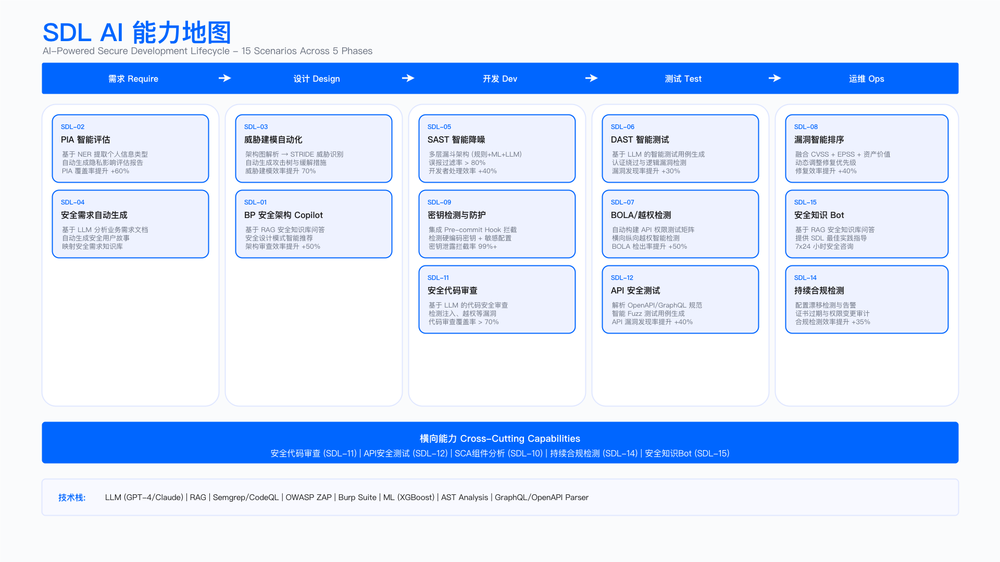
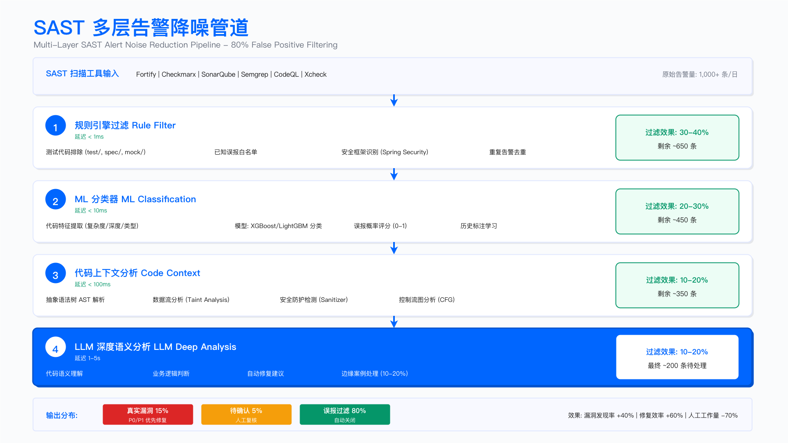

# 17.4　AI for AppSec：应用安全的自主等级演进

> English Title: AI for Application Security: Autonomy-Level Evolution
> 目标读者: AppSec Engineer, Security Architect, DevSecOps, SDL Manager

> 本节定位：本节从 AppSec 这个安全域回望 [17.1 的自主等级主线](./17.1_演进主线与自主等级.md)，回答四个问题——AI 在应用安全里怎么一路演进过来的、今天的各类工作分别停在哪一级、前沿正把哪条线往上顶、选型时该怎么取舍。至于每项能力如何嵌进具体的 SDL 流程与工具链（SAST 调优、DAST 门禁、SCA 准入、威胁建模评审……），是 [第6章应用安全架构](../../第02部分_技术架构与基础设施安全/第06章_应用安全架构/README.md) 的职责，本节只做精确交叉引用，不重复铺陈实现细节。

---

## 执行摘要 | Executive Summary

应用安全是企业防护的第一道关口，也是最早、最深地被 AI 改造的安全域之一——因为它的工作对象（代码、依赖、API 定义、设计文档）天然就是"文本 + 结构"，正好落在大模型的能力区间里。但正因为改造早、场景多，AppSec 也最容易掉进两个坑：一是把"AI 能读代码"直接当成"AI 能守住代码"，二是被一波又一波的新范式（先是 RAG Copilot，再是工作流编排，如今是安全智能体）牵着跑，却说不清自己到底进到了哪一步、下一步该不该迈。

本节不再给一张"传统 vs AI"的更快更准对比表，而是沿 17.1 确立的自主等级 L0–L5，把 AppSec 的核心工作——设计评审、漏洞检测、告警降噪、代码修复、供应链分析——各自摆到它今天合理停靠的等级上，讲清它是怎么爬上来的、还能不能再往上、以及往上一级要付出什么代价。一条贯穿始终的判断是：AppSec 里的 AI 不是取代传统扫描器，而是叠在扫描器之上——SAST/DAST/SCA 依然负责"把可疑点扫出来"，AI 负责扫描之后的"降噪、可达、语义判断、修复生成"，越往高等级走，AI 承担的判断越多，但没有哪一级能把人从最终的安全裁量里彻底拿掉。

---

## 一、AppSec 各类工作的自主等级分布

传统的"人工审计 vs AI 检测"叙事，最大的问题是把整个应用安全当成一件均质的事去"上 AI"。真实的 AppSec 里，"过滤一条已知模式的 SAST 误报"和"判断一个 API 是否存在越权访问"是两类完全不同的工作：前者有确定的代码模式可匹配，后者需要理解业务语义、还得发真实请求验证。它们该停靠的自主等级差着好几档。


*图 17.8：SDL AI 能力图谱——安全开发生命周期各环节的 AI 能力落点与自主等级*

下表把应用安全的核心工作按 17.1 的 L0–L5 摆开。读它的正确方式是认清每类工作今天合理的停靠点，以及把它再往上推一级需要付出什么，而非直奔"最高那一档"。

| 自主等级 | 人机关系 | AppSec 里的典型工作 | 今天的技术使能者 |
|---------|---------|--------------------|-----------------|
| L0–L1 规则与人力 | 系统按规则报警，人处理 | 正则/签名规则匹配、SAST 原始告警、CVE 版本匹配、人工代码审计 | 传统规则引擎、扫描器内置规则 |
| L2 辅助 | 人决策，AI 提示 | 设计评审草稿、SAST 误报降噪、修复建议生成、安全知识问答 | 检索增强（RAG）/ 代码 Copilot |
| L3 有条件自动 | AI 执行，人监督 | 固定流水线里的多步分析（扫描→降噪→建单）、SCA 可达性分析、PIA 评估编排 | 工作流编排（把模型/工具串成流程） |
| L4 高度自主 | AI 自主，人管例外 | 一个漏洞的自主复现与验证、跨文件的越权逻辑自主调查、按证据决定下一步测什么 | 应用安全智能体（Agent 运行时 / SDK） |
| L5 完全自主 | 罕见，且需审慎 | 端到端"发现→验证→修复→回归"全自动闭合 | 前沿推理模型逼近（见第四节） |

这张表要传达的第一件事是："给 AppSec 上 AI"从来是一个刻度盘，不是一个开关。 同一条流水线里，"SAST 误报降噪"可能已经稳稳跑在 L2，"越权漏洞的自主验证"却还在 L3 往 L4 爬的路上——因为后者要发真实请求、可能触碰真实数据，出错代价高、可逆性差，你不敢完全放手。哪类工作停在哪一级，由三件事决定：这次判断的价值有多高、出错的风险有多大、动作是否可回退。

第二件事是这几级叠加共存，不是新的取代旧的。到 2026 年，同一个 AppSec 团队里，L1 的规则扫描、L2 的降噪 Copilot、L3 的可达性流水线、L4 的漏洞验证 agent 是同时在跑的。这不是过渡态的混乱，而是合理的成本结构——把便宜、确定的工作压在低等级，把昂贵的自主推理省给真正需要它的少数场景。

---

## 二、演进因果：AppSec 的 AI 是怎么一级级爬上来的

AppSec 的 AI 演进不是"换了个更聪明的模型"这么简单，而是被三级技术台阶一步步顶上去的——这三级台阶与 17.1 讲的全章演进机制同源，只是落在应用安全这个域里有它自己的具体表现。

第一级台阶：从"关键词匹配"到"读得懂代码语义"（L1 → L2）。
传统 SAST 的本质是模式匹配——它能抓到"字符串拼接进 SQL"这种有语法特征的漏洞，却抓不到"这个 `id` 本应属于当前登录用户"这种授权语义缺陷。当代码模型（把代码当成有结构的语言来理解，而非纯文本）和大模型能读懂一段代码"想干什么"时，AI 第一次能做两件规则做不到的事：一是判断一条 SAST 告警在具体上下文里是不是真漏洞（降噪），二是理解一个 API 的语义意图从而推断"这里本该有一道授权检查却没有"。这一步把 AppSec 从 L1 的"报一堆你得自己筛的告警"推到 L2 的"帮你筛完、讲清理由、由你定案"。

第二级台阶：从"单点判断"到"把工具串成可靠流程"（L2 → L3）。
单个模型判断一条告警是 L2；但真实的漏洞治理是多步的：扫描→规则过滤→ML 分类→上下文分析→建单→通知。当这套流程能被稳定地编排起来、每一步的工具调用足够可靠时，AI 就从"辅助单点"变成"按预设流程自动跑完多步"。SCA 的可达性分析是这一级的典型——它要先构建调用图、再判定漏洞函数是否被实际调用、再结合 EPSS 和资产暴露排优先级，是一条固定的多步流程，人守在关键节点（比如可达性不确定时的复核）。

第三级台阶：从"人写好流程、AI 填空"到"AI 自己决定流程"（L3 → L4）。
L3 的流程是人预先编排死的，遇到没预想到的分支就抓瞎。只有当推理模型能在多步之间自己判断"上一步测出来的东西意味着什么、下一步该测什么"时，检测才真正跃迁为自主调查。以越权（BOLA/IDOR）验证为例：L3 你得预先写好"识别 ID 参数→找授权点→替换他人 ID 测试"的固定步骤；而 L4 的 agent 会根据 Step 2 查到的授权模型（是 RBAC 还是 ABAC、Token 里带不带 user_id）临时决定 Step 3 到底构造哪种越权请求、返回 200 之后还要不要再追一步验证是否读到了真实他人数据。下一步测什么，由上一步测到什么决定——这就是 L4 相对 L3 的分水岭。

这三级台阶——读懂代码语义 → 可靠地串起多步工具 → 推理驱动的自主决策——正是把 AppSec 的能力从 L1 一路顶到 L4 的动力。据此可以判断任何一款"AI AppSec 产品"究竟站在哪一级台阶上：它是真把某类工作推上了一级，还是只把同一级的事包装得更好看。

---

## 三、逐级细看：每类工作今天停在哪、为什么

下面按自主等级，逐一说清 AppSec 里几类代表性工作今天的合理停靠点、背后的取舍，以及"上 AI 之前先问：为什么不用更便宜的规则"。这一节只讲判断，对应的工程实现（配置、门禁、集成）交由 第6章，文中随处给出精确锚点。


*图 17.9：SAST 降噪流水线——从原始扫描结果到可派单缺陷的多级过滤与 AI 复核*

### L1 仍是地基：规则与扫描器不会被 AI 取代

不要因为大模型能读代码，就把所有判断都塞给它。大量 AppSec 工作用一条稳定规则就能可靠、极廉价地完成：测试文件排除、已知误报模式命中、框架级防护识别（Django ORM、MyBatis PreparedStatement 天然参数化）。这些用确定性规则一毫秒内就能处理，没有任何理由动用 ML 推理、更别提 LLM。SAST/SCA/DAST 扫描器本身、以及它们的调优与门禁，是应用安全的地基，其落地实践见 [6.4 安全工程工具链](../../第02部分_技术架构与基础设施安全/第06章_应用安全架构/6.4_安全工程工具链.md)（含 6.4.3 SAST/SCA/密钥扫描、6.4.4 DAST/API/IAST 的门禁与调优）。

一条稳定的过滤规则就能可靠处理的 SAST/SCA 告警，留在 L1，不必浪费更贵的 AI。

### L2 辅助：AppSec 里投入产出比最高的一级

L2 是应用安全团队最容易落地、最快见效的一站。三个代表场景：

SAST 告警降噪。 SAST 最大的问题不是漏报而是误报——大量告警是误报，开发者一旦形成"告警免疫"，真漏洞就被淹没。这里最该记住的工程判断是成本梯度过滤：按处理成本从低到高排队——规则过滤（毫秒级）→ 轻量 ML 分类（十毫秒级，如 XGBoost/LightGBM 输出误报概率）→ 代码上下文/数据流分析（百毫秒级）→ 只对置信度处在灰色区间的少数告警调用 LLM（秒级）。越贵的手段覆盖越少的告警，这样总延迟和成本才可控。这里的核心取舍是召回优先于精确：ML 的过滤阈值要设得保守（宁可多留疑似误报，也不冒险过滤掉真漏洞），因为漏掉一个真漏洞的代价远高于多留几条待人复核的噪声。SAST 工具本身的选型、调优与门禁配置见 [6.4.3.2 SAST 白盒代码扫描](../../第02部分_技术架构与基础设施安全/第06章_应用安全架构/6.4_安全工程工具链.md)。

代码级修复建议。 传统安全报告给开发者的是"用参数化查询替代字符串拼接"这类抽象建议，开发者得自己理解上下文、查框架文档、写修复代码、再验证不破坏功能——耗时且容易引入新 bug。L2 的价值是把抽象建议翻译成"可以直接用"的具体代码，并按工期/风险给出快速修复、标准修复、架构重构几档让开发者选。但这里有个不可省的边界：LLM 生成的修复不保证功能正确，必须配套生成单元测试并在 CI 里验证，还要在提示里注入项目实际依赖版本，否则它可能给你一段基于旧版框架 API 的"修复"。修复如何嵌进 SDL 的测试与门禁环节，见 [6.3.7 执行安全测试](../../第02部分_技术架构与基础设施安全/第06章_应用安全架构/6.3_SDL落地十项关键措施.md)。

设计评审草稿与安全知识问答。 安全 BP 人力有限，一人常要覆盖数十个项目，人工评审覆盖率天然受限。RAG + LLM 的价值不是替代专家，而是把专家知识编码进检索库，让系统在无人值守时完成初筛，把人力集中到高风险项目和边界判断。核心难点在检索质量：粒度太粗会超出上下文窗口、太细会丢失控制措施之间的逻辑关联，实践中多用"先按技术栈/业务类型粗检索、再对关键风险点细检索"的分层策略。评审如何落进 SDL 流程，见 [6.3.3 安全评审与威胁建模](../../第02部分_技术架构与基础设施安全/第06章_应用安全架构/6.3_SDL落地十项关键措施.md)。

开发者耗在"看一堆分不清真假的告警"和"把抽象修复建议翻译成能跑的代码"上的时间，正是 L2 能立刻接手的两块。

上面三个场景里，降噪和修复这两块能直接落成配置。下面四小节给出对应的工件：分流配置、复判 prompt 与它的输出契约、修复补丁的合入闸门、以及一份度量脚本。它们都停在 L2——AI 出判断，人定案。

### SAST 分流配置：哪条告警直接丢、哪条送 LLM、哪条直接给人

成本梯度过滤落到工程上是一份分流配置。一条告警进来，出口只有三个：直接丢弃、送 LLM 复判、绕过 LLM 直接进人工队列。第三个出口最容易被漏掉，而它承担的是两类告警——送给 LLM 纯属浪费的，和 LLM 结构性判不了的。

```yaml
# sast_triage.yaml —— SAST 告警的分流配置
# 四段自上而下执行，段内第一条命中即生效。每条告警最终落到三个出口之一：
#   drop（丢弃，按比例进抽样审计）/ llm（送复判）/ human（进人工队列，不经 LLM）
version: 3
pipeline: sast-alert-triage
owner: appsec-engineering
autonomy_level: L2                # AI 出判断、人定案，等级定义见 17.1.2

intake:
  scanners: [sast_primary, sast_secondary, secret_scanner]
  required_fields: [finding_id, rule_id, cwe, severity, file_path, line,
                    source_symbol, sink_symbol, commit_sha, scan_id]
  dedup:
    key: [rule_id, file_path, code_hash]   # 不用行号做键，无关改动会让整个文件的行号漂移
    window: per_scan
  preexisting:
    suppress: false                        # 存量告警只降优先级，不自动压掉

# 第一段：规则本身就是噪声源的整条丢。判据是可核对的统计，不是印象。
drop_by_rule:
  require_evidence:
    min_samples: 200                       # 样本不足 200 条的规则不许进这张表
    max_true_positive_rate: 0.02
    approvals: 2                           # 两人复核，单人不能往这张表里加规则
    reeval_days: 90                        # 代码库在变，规则的误报率跟着变
  entries:
    - rule_id: RULE-XSS-REFLECT-TEMPLATE
      reason: framework_escaping_by_default
      evidence: "近四个季度 612 条，人工确认真阳 3 条"
      added_on: 2026-03-11
    - rule_id: RULE-SQLI-CONCAT-ORM-LAYER
      reason: orm_parameterized_by_default
      evidence: "近四个季度 438 条，人工确认真阳 0 条"
      added_on: 2026-04-02
  by_path:
    - pattern: "**/test/**"
      except_rule_class: [hardcoded_secret]   # 测试目录里的硬编码凭据照报不误
    - pattern: "**/generated/**"
    - pattern: "**/third_party/**"

# never_drop 压倒上面所有丢弃判据，包括路径排除
never_drop:
  cwe: [CWE-78, CWE-89, CWE-287, CWE-502, CWE-611, CWE-798, CWE-863]
  touches_data_grade: [Restricted, Confidential]
  rule_age_days_below: 30                  # 新规则没有历史统计，不具备被丢的资格
  file_changed_in_commit: true             # 本次提交动过的文件，宁可多看一眼

# 第二段：绕过 LLM 直接进人工。这些告警送 LLM 要么浪费，要么它结构性判不了。
bypass_llm:
  - id: BP-1
    when: "rule_class == 'hardcoded_secret'"
    reason: 真伪取决于这串凭据在目标系统上还能不能用，是一次校验调用而非语义判断
    route: human_queue
    priority: P1
  - id: BP-2
    when: "cwe in ['CWE-287', 'CWE-863']"
    reason: 授权缺陷的判定依赖运行时中间件是否生效，静态上下文里看不到
    route: human_queue
    priority: P1
  - id: BP-3
    when: "touches_data_grade == 'Restricted'"
    reason: 误丢代价最高的一类，不交给概率性判断
    route: human_queue
    priority: P1
  - id: BP-4
    when: "rule_id in llm_misjudged_watchlist"
    reason: 复盘确认被 LLM 误判过的规则，回人工直到复判 prompt 重新过评估
    route: human_queue
    priority: P2

# 第三段：ML 快筛。两端阈值都设得很松，只有中间灰区才付 LLM 的钱。
ml_filter:
  model: fp_probability_classifier          # 输出"这条是误报"的概率
  model_version: fp-clf-2026.05
  thresholds:
    drop_above: 0.97                        # 极高置信的误报才丢，且照样进抽样审计
    human_below: 0.15                       # 极可能是真漏洞，不必再花 LLM 的钱
    gray_band: [0.15, 0.97]                 # 送 LLM，实测占进入本段告警的 22%
  calibration:
    method: isotonic
    recheck_days: 30                        # 概率没校准过，上面两个阈值就只是两个数字
  on_unavailable: treat_all_as_gray_and_alert

# 第四段：LLM 复判。它只产出结论，动作由 decision_map 决定，模型不碰动作。
llm_review:
  model_profile: code_reasoning
  prompt_ref: prompts/sast_review.prompt.yaml
  prompt_version: 5
  schema_ref: schemas/sast_review.schema.json
  temperature: 0
  max_output_tokens: 900
  timeout_seconds: 25
  concurrency: 8
  context:
    include: [sink_function_body, source_function_body, call_path_snippets,
              file_imports, framework_versions_from_lockfile, project_security_conventions]
    max_call_path_hops: 6
    max_input_tokens: 24000
    redact: [credential_literals, customer_data_literals]
  decision_map:
    exploitable: human_queue
    not_exploitable: drop_with_audit
    undecidable: human_queue
    schema_violation: human_queue
    timeout: human_queue
  block_auto_drop_when:
    - "confidence < 0.80"
    - "missing_context != []"               # 模型自己说缺上下文，就不能拿它的结论去丢
    - "severity in ['critical', 'high']"
    - "taint_path == []"

# 抽样审计：丢弃是不可见的失败，没有抽样就永远看不到自己丢错了什么
drop_audit:
  sample_rate:
    drop_by_rule: 0.01
    ml_filter: 0.05
    llm_review: 0.10                        # LLM 丢的抽得最狠，它的失效模式最不可预测
  full_review_when: ["severity in ['critical', 'high']"]
  stop_rule:
    misdropped_high_severity_per_month: 1   # 出现 1 条就停掉 LLM 自动丢，回到全量人工
    action: [disable_llm_auto_drop, freeze_prompt_version, page_appsec_oncall]
  retention_days: 400

slo:
  p95_pipeline_seconds: 120
  llm_share_max: 0.30
  cost_per_scan_usd_max: 2.0
  on_budget_exceeded: route_remaining_to_human   # 预算耗尽就排队等人看，不是丢掉
```

四个设计选择在这份配置里是有代价的。

`drop_by_rule.require_evidence` 把"哪条规则算噪声源"从判断题改成统计题。 谁都能说出几条"我们这儿从来没真报过"的规则，但凭印象往丢弃表里加规则，是这类流水线最常见的事故起点——加进去之后没人再看它，规则覆盖的那类漏洞就此消失。要求 200 条样本、真阳率低于 2%、两人签字、90 天重算，代价是这张表长得很慢，头半年可能只有三五条，覆盖不了多少告警量。这个慢是设计意图的一部分：丢弃表的每一行都在永久性地关掉一类检测。

`never_drop` 里的 `file_changed_in_commit` 是四条判据里最容易被删掉的。 前三条（高危 CWE、Restricted/Confidential 数据、新规则）都好理解，这一条看起来只是增加噪声——本次提交动过的文件里那些老告警，去年就在那儿了，为什么突然要看。理由在于漏洞被引入的时机：一个原本不可达的 sink，可能因为这次提交新增了一条调用路径而变得可达，而扫描器给出的仍是同一条老告警、同一个 rule_id。按"存量告警"处理它就会漏掉这次变更引入的真实风险。代价是每次提交的人工队列会多出一批老告警，需要靠优先级排序压住，不能靠丢弃压住。

`bypass_llm` 里的 BP-1 与 BP-2 是两类不同的浪费。 硬编码凭据的真伪是一个事实问题——这串东西还能不能用，去目标系统上试一次就知道，LLM 在这里能提供的只有猜测。授权缺陷则是 LLM 结构性判不了：它看到的是静态代码，看不到运行时装没装授权中间件、装了有没有覆盖这个路由。把这两类扔给 LLM，得到的是一堆听起来合理的判断，但每一条都需要人重新验证一遍，等于白花钱还多绕一圈。

`ml_filter.calibration` 删掉的话，上面的 0.97 和 0.15 会退化成两个没有意义的数字。 未校准的分类器输出的"概率"只保证排序正确，不保证 0.97 真的对应 97% 的误报率——树模型的输出普遍在两端过于自信。用未校准的分数配这两个阈值，`drop_above: 0.97` 实际丢掉的可能是真阳率 8% 的一批告警。这一步在照抄时最容易被当成可选项省掉，因为省掉之后流水线照常跑，只是丢错的那部分永远不出现在任何看板上。

### 复判 prompt 与它必须能说出的"判不了"

灰区那批告警送进 LLM 之后，输出质量由 prompt 和它约束的输出结构共同决定。这一层最常见的失效不是模型判错，是流水线只给了模型两个选项。当输出契约里只有"是漏洞"和"不是漏洞"，模型在信息不足时也必须选一个，而它选出来的那个会被下游当成确定结论使用——这就是一条真漏洞被静默丢弃的完整路径。

```yaml
# prompts/sast_review.prompt.yaml —— 与 sast_triage.yaml 的 llm_review 同版本发布
version: 5
owner: appsec-engineering
model_params:
  temperature: 0
  max_output_tokens: 900
  output_format: json_schema
  schema_ref: schemas/sast_review.schema.json
  on_schema_violation: human_queue        # 不做二次解析猜测，违约就交人

system: |
  你是 SAST 告警的复判器。输入是一条静态扫描告警、告警涉及的 source 与 sink 代码、
  两者之间的调用链片段，以及项目的框架版本与安全约定。你判断这条告警在这段代码里
  是否真的可被利用。

  按以下规则输出。
  1. verdict 只能取 exploitable / not_exploitable / undecidable 三者之一。
     证据不足以支撑前两者时必须取 undecidable。undecidable 会进人工队列，
     人在几分钟内会看到它；猜错则会让一条真漏洞被静默丢掉，没有人会看到。
     两类错误的代价差着数量级，信息不足时不要硬选一边。
  2. taint_path 逐跳写出从 source 到 sink 的传播路径，每一跳引用输入里真实出现的
     函数名与行号。凑不出完整路径就把 taint_path 留空并取 undecidable，
     不要靠函数名推测中间几跳。
  3. 判 not_exploitable 时，sanitizer 必须指出具体是哪一处阻断了传播（框架默认转义、
     显式校验函数、参数化查询、类型约束、死分支之一），并引用它所在的文件与行号。
     说不出阻断发生在哪一行的，不算 not_exploitable，算 undecidable。
  4. missing_context 列出"再给什么就能判"的具体项，取值限于 schema 的枚举。
     它非空时不允许输出 not_exploitable。
  5. 只依据输入判断。不要假设输入里没出现的全局过滤器、拦截器、网关防护存在。
     项目可能装了这些东西，你看不到就不能算进结论。
  6. reachability 与 verdict 是两件事。不可达可以支持 not_exploitable，
     但可达不等于可利用，不要把 reachable 直接写成 exploitable。
  7. 只输出 JSON，不输出解释性文字，不加 Markdown 围栏。

user_template: |
  规则: {rule_id}（{rule_name}）
  CWE: {cwe}
  严重级: {severity}
  位置: {file_path}:{line}
  source: {source_symbol}
  sink: {sink_symbol}
  框架与版本（取自锁文件）:
  {framework_versions}
  项目安全约定:
  {security_conventions}
  source 所在函数:
  {source_function_body}
  sink 所在函数:
  {sink_function_body}
  调用链片段（最多 6 跳）:
  {call_path_snippets}

# 少样本只挑三类最容易判错的：多了会挤占上下文，也会让模型过拟合到示例形态
few_shot_refs:
  - examples/blocked_by_framework_escaping.json     # 真的被框架转义挡住
  - examples/guard_added_at_one_caller_only.json    # 只有一个调用方加了校验
  - examples/undecidable_reflective_hop.json        # 中间有一跳反射调用，判不了
```

模型必须按下面这份 schema 输出。三个约束是这份 schema 存在的全部理由：`undecidable` 是合法结论、判不了必须说清缺什么、判"安全"必须指出阻断点。

```json
{
  "$schema": "https://json-schema.org/draft/2020-12/schema",
  "title": "SastReviewVerdict",
  "type": "object",
  "additionalProperties": false,
  "required": ["finding_id", "verdict", "confidence", "reachability",
               "taint_path", "missing_context", "prompt_version", "model_version"],
  "properties": {
    "finding_id": {
      "type": "string",
      "description": "原样回填告警 ID；模型改写过就写不回扫描器，这条结论会丢"
    },
    "verdict": {
      "type": "string",
      "description": "undecidable 是一等结论，不是失败态。没有它，模型会把不确定压成一个确定答案",
      "enum": ["exploitable", "not_exploitable", "undecidable"]
    },
    "confidence": {
      "type": "number",
      "minimum": 0,
      "maximum": 1,
      "description": "人工队列的排序键之一：同严重级内先看模型最不确定的"
    },
    "reachability": {
      "type": "string",
      "description": "sink 在本次构建的调用图里是否可达。与 verdict 分开记，可达不等于可利用",
      "enum": ["reachable", "unreachable", "unknown"]
    },
    "taint_path": {
      "type": "array",
      "description": "从 source 到 sink 的逐跳传播路径；空数组表示没能凑出完整路径",
      "maxItems": 12,
      "items": {
        "type": "object",
        "additionalProperties": false,
        "required": ["symbol", "file", "line", "role"],
        "properties": {
          "symbol": {"type": "string"},
          "file": {"type": "string"},
          "line": {"type": "integer", "minimum": 1},
          "role": {"type": "string",
                   "enum": ["source", "propagator", "sanitizer", "sink"]},
          "transform": {"type": ["string", "null"], "maxLength": 120}
        }
      }
    },
    "sanitizer": {
      "type": ["object", "null"],
      "description": "verdict 为 not_exploitable 时必填，指出阻断发生在哪一行",
      "additionalProperties": false,
      "required": ["kind", "file", "line", "quote"],
      "properties": {
        "kind": {
          "type": "string",
          "enum": ["framework_default_escaping", "explicit_validator",
                   "parameterized_query", "type_constraint", "dead_branch"]
        },
        "file": {"type": "string"},
        "line": {"type": "integer", "minimum": 1},
        "quote": {"type": "string", "maxLength": 200}
      }
    },
    "missing_context": {
      "type": "array",
      "description": "非空即表示判不了；这份清单同时是补上下文的工单内容",
      "maxItems": 5,
      "items": {
        "type": "string",
        "enum": ["runtime_middleware_config", "framework_internal_behavior",
                 "cross_repo_caller", "reflection_or_dynamic_dispatch",
                 "di_binding", "build_time_codegen", "data_grade_of_field",
                 "deployment_exposure"]
      }
    },
    "exploit_precondition": {"type": ["string", "null"], "maxLength": 300},
    "prompt_version": {"type": "integer"},
    "model_version": {"type": "string"}
  },
  "allOf": [
    {
      "if": {"properties": {"verdict": {"const": "not_exploitable"}},
             "required": ["verdict"]},
      "then": {
        "required": ["sanitizer"],
        "properties": {"sanitizer": {"type": "object"},
                       "missing_context": {"maxItems": 0}}
      }
    },
    {
      "if": {"properties": {"verdict": {"const": "undecidable"}},
             "required": ["verdict"]},
      "then": {"properties": {"missing_context": {"minItems": 1}}}
    },
    {
      "if": {"properties": {"verdict": {"const": "exploitable"}},
             "required": ["verdict"]},
      "then": {"properties": {"taint_path": {"minItems": 1}}}
    }
  ]
}
```

三处设计选择带着代价。 其一，允许 `undecidable` 会让进人工队列的告警变多——灰区里本来指望 LLM 消化掉的那部分，有一成到两成会以"判不了"的形式退回来。这是明码标价买来的：退回来的是流水线知道自己不确定的那批，而强迫二选一时，同样这批告警会被写成一个带着 0.6 置信度的确定结论，混进自动丢弃通道。其二，`undecidable` 必须携带非空的 `missing_context`，这条约束把"判不了"从死胡同变成待办事项——缺 `runtime_middleware_config` 就去补一份中间件配置摘要进上下文，缺 `cross_repo_caller` 就把跨仓调用方接进检索。没有这条约束，`undecidable` 会迅速变成模型逃避判断的万能出口，人工队列涨了但没人知道该补什么。其三，`not_exploitable` 必须给出 `sanitizer` 的文件与行号，这让"安全"这个结论变得可以在几秒内被复核者证伪；代价是模型在防护确实存在、但分散在多处配置里时会被逼进 `undecidable`，这类退回在初期占比不低。

照抄这份 schema 最容易改错的是 `allOf` 里第一条的 `missing_context.maxItems: 0`。 它的作用是让"我缺上下文"和"我判定它安全"这两件事不能同时成立。很多实现会把它放宽成"允许有 missing_context 但降低置信度"，看起来更柔和，实际后果是模型每次都填几条 missing_context 再给一个 0.85 的 not_exploitable，而 `block_auto_drop_when` 里的 `missing_context != []` 这条判据在 schema 层已经形同虚设。另一处是 `finding_id` 没有加 `pattern` 约束——本书别处的做法是加正则，这里刻意不加，因为不同扫描器的 ID 形态差异太大，加了正则等于把 schema 和某一款扫描器绑死；代价是要在写回前程序化校验 `finding_id` 是否与输入一致，这一步不能省。

### 修复补丁的合入闸门

L2 的第二个落点是生成修复代码。"发现"和"修复"的边界不在同一个位置，必须分开看——本节后面 L4 会讲 agent 在越权与业务逻辑上已经打得动，那说的是发现；这里说的是修复，而修复的门槛更高。

差别在判据的来源。发现一个越权，判据可以从外部实测拿到：拿 A 的凭据去请求 B 的资源，返回 200 就是漏洞。修复同一个越权，判据变成了"这个资源本来应该谁能访问"——是租户隔离、还是角色授权、还是所有者校验加上客服例外，这三种写法都能让那条实测请求返回 403，但只有一种符合业务本意，另外两种会在上线后表现为功能故障或新的越权面。这个信息不在代码里，模型没有办法从 diff 推出来。所以业务逻辑类缺陷不该进入自动补丁通道，理由不是"模型找不到它们"，而是**即便找到了，判定补丁对不对所需的业务规则也不在模型的输入里**——它生成的不是差一点的补丁，是给一个它无从核对的问题写了个看起来合理的答案（这条边界的定量讨论见 12.3.9，那里也说明了为什么不要引用市面上流传的漏检百分比）。剩下有明确模式的技术性缺陷才是补丁生成的适用区间，而即便在这个区间里，补丁也要过完下面五关才能合入。

#### 一个必须先看清的能力悬崖

要理解为什么闸门要设五关，先看一组把"补丁生成"拆开测量的数据。UC Berkeley 的 CyberGym-E2E 基准把智能体修漏洞的过程切成四个递进阶段：S1 复现崩溃、S2 补丁消除该崩溃、S3 功能测试通过、S4 **补丁修复的确实是原定那个漏洞**（UC Berkeley，CyberGym-E2E，arXiv:2606.04460，2026-06）。在 615 个真实漏洞任务上，若直接把 PoC 与崩溃日志喂给智能体、只要求它写补丁，最好的配置成功率是 **82.3%**；但改成要求它自己发现漏洞并端到端修复，S3 跌到 **19.2%**，S4 只剩 **7.6%**。

这条从 82.3% 到 7.6% 的落差是本节最重要的一个数字，它精确地说明了闸门在防什么：**智能体经常修好了"一个"漏洞，只是不是你要它修的那个。** S3 到 S4 之间掉的那一半，就是"功能测试全绿、崩溃也不再复现、但原漏洞仍在"的补丁。这类补丁最危险的地方在于它会通过所有常规验收——测试是绿的，代码看着合理，评审时也挑不出毛病。

引用这个数字要带三个限定：它基于 615 任务的版本，任务集扩到 920 后各家模型的 S3 又有明显提升；具体成绩随模型迭代变动很大；四个阶段的定义是这套基准自己的，与其他补丁基准不可直接横比。**结论层面稳定的部分不是某个百分比，而是那条曲线的形状**——只要把"发现"和"修复"合并考核，成功率就会掉一个量级；这个形状不会因为模型换代而消失，只会整体上移。

它对闸门设计的直接要求有两条：第一，**必须验证"原 PoC 不再复现"而不是"测试通过"**（下面的 G2 和 G3 是两关，不能合并）；第二，**必须限制 diff 范围**（G4），因为改动越大，"顺手改掉了别的东西、让触发路径失效"的概率越高，而这正是 S3 通过、S4 不通过的典型成因。

> 出处：UC Berkeley，《CyberGym-E2E: Scalable Real-World Benchmark for AI Agents' End-to-End Cybersecurity Capabilities》，arXiv:2606.04460，2026-06-03，<https://arxiv.org/abs/2606.04460>。

> 记号说明：下面这套 G1–G5 是**单个补丁合入前的五道串行闸门**，作用域是一次 merge。它与 [18.2](../../第06部分_AI驱动的安全创新/第18章_AI系统安全/18.2_AI安全架构设计与实施.md) 里 ML 流水线的阶段门禁 G1–G3（数据→开发、开发→评估、评估→部署）是两把不同的尺子，编号不对应、不可互引。

```yaml
# patch_gate.yaml —— AI 生成的修复补丁合入前的闸门定义
# 五关串行，任一关不过即停。不做"其余四关都过了就放行"的加权妥协：
# 每一关挡的是一类独立失效，互相不能替代。
version: 2
applies_to: ai_generated_patch
autonomy_level: L2
merge_requires: [all_gates_pass, human_approval]

scope:
  eligible_cwe: [CWE-22, CWE-79, CWE-89, CWE-327, CWE-502, CWE-611]
  excluded_classes:
    - id: business_logic
      reason: "AI 对业务语义缺陷的覆盖率极低（口径见 12.3.9），生成的补丁常在修一个不存在的问题"
      route: human_author_only         # 只出分析材料，不出补丁
    - id: authz_model_change
      reason: 授权模型的改动要连带改数据模型与调用方，超出单个补丁的粒度
      route: human_author_only
    - id: crypto_protocol_design
      reason: 协议级选择需要威胁模型作输入，补丁层面看不到
      route: human_author_only

gates:
  - id: G1
    name: 原 PoC 不再复现
    run: poc_runner
    env: isolated_replica              # 隔离副本，不在生产验证
    pass_when: "poc_result == 'not_reproduced'"
    evidence: [poc_id, run_log_ref, exit_code]
    fail_action: reject

  - id: G2
    name: PoC 变体仍不复现
    run: poc_mutator
    mutations: [encoding_variants, alternate_entrypoints, boundary_lengths,
                unicode_normalization, http_method_swap, content_type_swap]
    min_variants: 8
    pass_when: "reproduced_variants == 0"
    evidence: [variant_ids, run_log_ref]
    fail_action: reject
    note: G1 只证明这一条 PoC 现在跑不通，G2 才开始证明这个 sink 现在安全

  - id: G3
    name: 回归测试全绿
    run: [unit, integration, contract]
    pass_when: "failed == 0 and coverage_delta >= -0.01"
    forbid_changes_in: ["tests/**", "ci/**", "**/conftest.py"]
    note: 补丁不许改测试。改测试让测试变绿是这类流水线最常见的自证清白方式
    fail_action: reject

  - id: G4
    name: diff 范围可人读
    max_changed_lines: 40
    max_changed_files: 3
    forbid_new_dependencies: true
    forbid_public_api_change: true
    pass_when: "within_limits == true"
    fail_action: route_to_human_author  # 超范围不是补丁质量问题，是这活不该由补丁做

  - id: G5
    name: 人工评审
    reviewers: 1
    reviewer_must_not_be: patch_author_agent
    checklist: [semantic_checks_all_pass, sanitizer_at_sink,
                no_scope_narrowing, rollback_plan_present]
    pass_when: "approved == true"
    fail_action: reject

# G1 到 G3 全绿仍可能没修对。下面三条查的是"补丁修的是不是那个洞"。
semantic_checks:
  - id: S1
    name: 补丁改到了污点路径的末段
    check: "patched_lines overlaps taint_path[-2:]"
    input_from: sast_review.taint_path      # 复判结论里的逐跳路径
    on_violation: flag_guard_moved_upstream
    why: 在最上游入口加一道长度限制能让 PoC 失败，而 sink 处的拼接一行没动

  - id: S2
    name: 同一 sink 的其它调用方也覆盖到了
    check: "callers_of(sink) minus patched_or_already_safe_callers is empty"
    on_violation: flag_partial_fix
    why: 补丁常常只修 PoC 走过的那条调用链，同一个 sink 的另外三个调用方原样保留

  - id: S3
    name: 没有靠缩小输入合法域来"修复"
    signals: [new_length_cap, new_char_whitelist_without_parameterization,
              new_early_return, feature_flag_disabling_the_endpoint]
    on_violation: require_human_justification
    why: 这类改动让漏洞暂时打不着，业务功能一起被削掉，几个月后被人以影响体验为由改回来

on_gate_failure:
  keep_analysis: true          # 补丁作废，AI 给出的漏洞分析保留，人接着用
  record: [gate_id, reason, patch_diff_hash, poc_id]
  feed_back_to: patch_prompt_eval_set   # 失败样本进评估集，否则同一类错误会一直生成
```

"测试通过"和"修对了"之间隔着的是漏洞与触发路径的区别。 G1 验证的命题是"这一条 PoC 现在跑不通"，而需要证明的命题是"这个 sink 现在安全"。两者之间有一大片空隙，补丁很容易正好落在空隙里：在入口处把参数长度截到 32 位，注入 PoC 失败了，sink 处的字符串拼接一行没改，换一个更短的载荷仍然打得进去；或者在 PoC 走的那个 controller 里加一道校验，同一个 DAO 方法还有三个调用方原样暴露；再或者把出问题的接口挂上一个默认关闭的功能开关，测试全绿，漏洞在开关背后完整地留着。这三种形态的共同点是：所有自动化检查都会通过，因为自动化检查验证的是触发路径的状态，不是 sink 的状态。G2 的变体、S1 的路径末段比对、S2 的调用方覆盖，各自堵的是其中一种。

这份闸门里有代价的选择有三处。 其一，`G4.max_changed_lines: 40` 会把一批本来正确的补丁挡在外面——有些修复确实需要动上百行。这个上限买的不是补丁质量，是人工评审的有效性：超过四五十行的 diff，评审者的实际行为会从逐行看变成扫一眼点批准，G5 就退化成盖章。所以 G4 的失败动作是转人写而非拒绝，超范围说明这活的粒度不适合补丁。其二，`G3.forbid_changes_in` 禁止补丁改测试，代价是那些确实需要同步更新测试的修复会被卡住，需要人拆成两个提交。放开它的后果更贵：模型在测试失败时最省力的路径就是改测试，而这个改动在 diff 里看起来完全合理。其三，`on_gate_failure.keep_analysis` 保留失败补丁的分析材料，意味着人会读到一份来自被否决补丁的漏洞描述，存在被误当成结论的风险；这里选择保留，是因为分析部分的价值通常高于补丁部分，丢掉它等于把 LLM 这一步的收益也一起丢了。

照抄时最容易改错的是 `semantic_checks` 的 S1。 它比对的是补丁改到的行与污点路径末两跳是否相交，方向是单向的——改到末段才算合格。有人会把它写成"补丁改到了污点路径上的任意一跳即算通过"，这个放宽正好把它要挡的那类补丁全部放行，因为在入口加校验本来就落在污点路径的第一跳上。另外 `input_from: sast_review.taint_path` 表明这一关依赖上一节复判结论里的路径字段，而当 verdict 是 `undecidable` 时那个字段是空的——空路径下 S1 无法判定，此时必须走 G5 的人工评审而不是默认通过，这一条在实现时要显式写死。

### 度量降噪效果：整体降噪率会盖住唯一危险的那个数

降噪流水线上线之后，最容易拿出来汇报的指标是降噪率——一万条告警过完只剩八百条，压掉了 92%。这个数字和降噪质量几乎无关：把所有告警全丢掉能得到 100%。真正需要盯住的是复判之后的精确率与召回率，以及被 LLM 误丢的高危告警条数。前两个决定这条流水线还值不值得开着，最后一个决定它有没有在制造事故。

```python
"""sast_triage_eval.py —— SAST 降噪流水线的效果度量。

用法: python3 sast_triage_eval.py triage_log.jsonl truth.jsonl
triage_log.jsonl 每行一条分流结果，含 finding_id / stage / action / severity / rule_id / cwe；
truth.jsonl 是人工真值，含 finding_id / is_true_positive。
真值有两个来源：进过人工队列的全部告警，加上各丢弃通道的抽样审计（见 sast_triage.yaml 的
drop_audit）。只拿人工队列当真值会系统性高估流水线，被丢掉的告警不进分子也不进分母。
"""
import json
import sys
from collections import Counter, defaultdict

HIGH_SEVERITY = {"critical", "high"}
DROP_ACTIONS = {"drop_with_audit", "auto_drop"}
# 抽样审计的放大系数，取 drop_audit.sample_rate 的倒数；各通道抽样率不同，
# 把审计里数到的漏判条数直接当全量条数会低估一个数量级。
AUDIT_WEIGHT = {"drop_by_rule": 100.0, "ml_filter": 20.0, "llm_review": 10.0}

def load(path):
    with open(path, encoding="utf-8") as handle:
        return [json.loads(line) for line in handle if line.strip()]

def evaluate(records, truth):
    """返回混淆矩阵、分通道漏判统计，以及被误丢的高危告警明细。"""
    label = {row["finding_id"]: bool(row["is_true_positive"]) for row in truth}
    counts = Counter()
    missed_by_stage = defaultdict(Counter)
    misdropped_high = []
    for rec in records:
        finding_id = rec["finding_id"]
        if finding_id not in label:
            counts["unlabeled"] += 1      # 没有真值的不进分母，否则精确率是编出来的
            continue
        is_real = label[finding_id]
        kept = rec["action"] not in DROP_ACTIONS    # 留给人看 = 流水线认为它值得看
        stage = rec.get("stage", "unknown")
        if kept and is_real:
            counts["tp"] += 1
        elif kept and not is_real:
            counts["fp"] += 1
        elif is_real:
            counts["fn"] += 1
            missed_by_stage[stage]["fn"] += 1
            if rec.get("severity") in HIGH_SEVERITY:
                misdropped_high.append((finding_id, stage, rec.get("rule_id"), rec.get("cwe")))
        else:
            counts["tn"] += 1
    return counts, missed_by_stage, misdropped_high

def ratio(numerator, denominator):
    return numerator / denominator if denominator else float("nan")

def report(counts, missed_by_stage, misdropped_high):
    tp, fp, fn, tn = counts["tp"], counts["fp"], counts["fn"], counts["tn"]
    labeled = tp + fp + fn + tn
    print(f"标注样本 {labeled} 条，未标注 {counts['unlabeled']} 条（不参与计算）")
    print(f"复判后精确率 {ratio(tp, tp + fp):.3f}，召回率 {ratio(tp, tp + fn):.3f}")
    print(f"整体降噪率 {ratio(fp + tn, labeled):.3f}，这个数越好看越要接着看下面两段")

    estimated = sum(m["fn"] * AUDIT_WEIGHT.get(stage, 1.0)
                    for stage, m in missed_by_stage.items())
    print(f"漏判：审计中实数 {fn} 条，按抽样率折算全量约 {estimated:.0f} 条")
    for stage, m in sorted(missed_by_stage.items()):
        print(f"  {stage}: 实数 {m['fn']} 条，"
              f"折算约 {m['fn'] * AUDIT_WEIGHT.get(stage, 1.0):.0f} 条")

    llm_high = [row for row in misdropped_high if row[1] == "llm_review"]
    print(f"被 LLM 误丢的高危告警 {len(llm_high)} 条，阈值 1 条即停自动丢弃")
    for finding_id, _stage, rule_id, cwe in llm_high:
        print(f"  {finding_id} rule={rule_id} cwe={cwe}")
    return 1 if llm_high else 0

def main(argv):
    if len(argv) != 3:
        print(__doc__)
        return 2
    return report(*evaluate(load(argv[1]), load(argv[2])))

if __name__ == "__main__":
    sys.exit(main(sys.argv))
```

这份脚本刻意让"被 LLM 误丢的高危告警"成为唯一影响退出码的指标。 精确率、召回率、降噪率都只打印不判定，因为它们是趋势指标，单次运行的波动说明不了什么。误丢高危则不同：出现一条就意味着这条流水线已经在无声地放过真实风险，而这类事故的发现路径只有抽样审计一条——它不会有人报障，不会有告警，被丢掉的告警在任何看板上都不存在。把它接进 CI 的退出码，是让这个数字有机会被看见的最省事的办法。代价是抽样噪声会导致偶发的构建失败，需要人去分辨是真误丢还是标注错误，这个人工成本是明码标价买"能被看见"。

`AUDIT_WEIGHT` 是照抄这段代码最容易漏掉的一处。 三个丢弃通道的抽样率不同（1%、5%、10%），审计里数到的漏判条数必须各自乘以抽样率的倒数才能还原成全量估计。直接把 `fn` 当成真实漏判数，会让规则通道的漏判被低估 100 倍——而规则通道恰好是丢弃量最大的一层。同样重要的是 `counts["unlabeled"]` 这条分支：没有真值的告警必须排除在分母之外并单独报出来。把它们默认算成负例（一种常见的省事写法）会让精确率凭空变好看，因为流水线丢掉的绝大多数告警本来就没人标注过。

### L3 有条件自动：多步流程被稳定地串起来

L3 的标志是"AI 按预设流程自动跑完多步，人守在关键节点"。SCA 可达性分析是最清晰的例子。

传统 SCA 只做 CVE 版本匹配，一个项目动辄数百条告警，谁都不知道先修哪个。可达性分析问的是另一个问题：这个有漏洞的函数，项目代码有没有实际调用到？ 没被调用到的漏洞，CVSS 再高，实际利用风险也接近零——这能把"需要立刻处理"的漏洞从几百条缩到几十条。这是一条固定的多步流程：构建调用图 → 判定漏洞函数可达性 → 结合 EPSS/资产关键性/网络暴露排优先级，因而稳稳落在 L3。

这里的关键取舍是可达性分析不能单独当过滤器用。静态调用图对反射调用、动态加载、依赖注入（Spring IoC）这类场景判断困难，会出现"实际可达却被判为不可达"的漏报。所以上下文风险评估（EPSS + 资产关键性 + 网络暴露）是可达性的补充而非替代——对可达性不确定、但 EPSS 高分且互联网暴露的漏洞，应触发人工复核，而不是直接过滤掉。供应链维度的完整治理（SBOM 管理、供应商准入、恶意包防线）见 [6.3.5 软件供应链安全](../../第02部分_技术架构与基础设施安全/第06章_应用安全架构/6.3_SDL落地十项关键措施.md) 与 [第7章供应链安全](../../第02部分_技术架构与基础设施安全/第07章_供应链安全/README.md)。

EPSS + CVSS 联合定级是这一级另一个成熟且值得推广的判断。CVSS 只说"漏洞被利用有多严重"，不说"多大概率被利用"，结果一堆 CVSS 9.0+ 却从无公开利用代码的漏洞长期霸占待办列表顶端。EPSS（机器学习预测未来 30 天被利用概率）补上了这条缺失的维度：真正的 P0 是"高危且高利用概率"，而 CVSS Critical 但 EPSS 极低的漏洞可以理性后置。这是 AppSec 里少数已经足够成熟、可以直接采购成品的 AI 能力。

只按 CVSS 分数排漏洞修复顺序，往往会把资源花在一批短期内根本不会被利用的漏洞上。

### L4 高度自主：漏洞的自主验证正在成为常规做法

L4 是应用安全里当前最前沿、也最需要谨慎的一级：AI 不再按预设步骤跑，而是根据每一步的中间结果自主决定下一步测什么。它最有价值的落点，是那些传统扫描器的结构性盲区——越权（BOLA/IDOR）与业务逻辑漏洞。

这类漏洞传统工具难以覆盖，是因为它们没有语法特征。SQL 注入有"字符串拼接进 SQL"的代码模式可以匹配，但"用户 A 能访问用户 B 的订单"这件事在代码层面完全合法——`GET /orders/{id}` 的写法本身没错，缺陷在于授权语义而非语法结构。规则引擎看不懂"这个 id 应该属于当前登录用户"的业务约束，这类漏洞长期只能靠人工渗透测试发现。L4 agent 的价值正在于它能理解 API 的语义意图，进而自主推断"这里本该有授权检查却没有"，并发真实请求去验证。

这里有一个绝不能省的边界，也是 L4 与"又一波误报洪流"的分水岭：LLM 能推断"此处可能存在越权"，但不能替代实际测试判定漏洞真伪——它看不到运行时的授权中间件是否生效。所以自主验证的末端必须是"构造跨账户请求、观察响应码"这样的真实测试，否则输出的全是未经证实的猜测。而这又带来 L4 特有的风险：验证本身有破坏性——用真实凭据发起跨账户请求，若直接在生产环境跑，可能真的读到或改到他人数据，必须在隔离环境或用专门的测试账户。这类"高价值、高风险、需多步自主判断"的工作能不能推到 L4，取决于你的组织能力和止损机制——这正是 [17.9 落地方法论](./17.9_AISecOps落地方法论.md) 要展开的"哪类场景能推到哪一级"。

> 把一条越权检测推到 L4 之前，先算一笔账：如果这个 API 的授权模型简单、用一条 DAST 规则加固定的越权用例就能覆盖，就不必动用一个会自己发请求、自己决定下一步的 agent。L4 的自主性留给"授权模型复杂、攻击路径无法预先穷举"的少数高价值接口。

应用安全智能体自身也是攻击面。 一个能读代码、能发请求、能调工具的 AppSec agent，它的权限、工具调用、供应链、记忆都是被攻击的目标。这类"agent 自身攻防"的深度设计——提示注入、工具滥用、MCP 信任边界、供应链后门——归 [第18章 Security for AI](../第18章_AI系统安全/README.md)，本节只提示其存在性：你落地一个 AppSec agent，就必须同时消费一套针对它自己的安全控制（权限最小化、沙箱、审计、成本闸门）。

---

## 四、前沿拐点：AppSec 的 L4→L5 会在哪里发生

当推理/agentic 模型的自主能力跨过某个可靠性阈值，AppSec 里"发现→验证→修复→回归"这条链会从需要人守在每个关节，收敛为 agent 端到端自主闭合、人只做事后审计——那就是 L5 在应用安全里的形态。今天挡在 L4 和 L5 之间的，不是模型"聪不聪明"，而是三件可以观察的能力是否够可靠：跨多文件长程推理的成功率（能不能顺着调用链读懂一个复杂授权缺陷）、自主验证的破坏性可控性（能不能确保验证请求不误伤生产数据）、修复—回归的自我纠错能力（改完代码能不能自己判断有没有引入新问题、有没有破坏功能）。这三条不过关，L5 就只能是极少数低风险场景的特例，而非常态。

当前最接近这个阈值的，是以 Claude Mythos 为代表的前沿推理模型。如何识别下一个拐点（工具调用可靠性、长程任务成功率、自主纠错能力三类信号），见 [17.10 演进与展望](./17.10_演进与展望.md)。

---

## 五、选型取舍：AppSec 团队怎么落地判断

把前面各级的判断拉平成一张选型对照，核心不是"选哪个工具最强"，而是先想清楚这项工作该停在哪一级，再据此选技术形态。三条可迁移的取舍规律：

其一，先看实时性，再看能力。 卡在 CI/CD 关键路径上的场景（SAST 降噪、密钥检测）必须走轻量模型或缓存路径，秒级同步返回，不能每条都同步调 LLM 拖住流水线；只有异步旁路的场景（设计评审、逻辑漏洞深度验证）才容得下 LLM 的分钟级延迟。实时性这一列往往比模型能力更能决定架构。

其二，代码模型与通用 LLM 分工。 需要理解代码结构语义的场景（SAST 降噪的上下文判断、SCA 可达分析的调用图理解）用专用代码模型更高效；需要自然语言推理与多方案生成的场景（评审、逻辑漏洞语义推断、修复说明）用通用大模型，不少场景两者并用。

其三，AI 叠在传统工具之上，不替代扫描器。 SAST/DAST/SCA 依然负责"把可疑点扫出来"，AI 处理的是扫描输出之后的降噪、可达、语义判断、修复生成。任何声称"用 AI 完全取代 SAST"的方案都值得警惕——它多半是把扫描器的活重新做了一遍，还更贵。

| 工作 | 合理停靠等级 | 技术形态 | 关键取舍 | 落地细节交由 |
|------|------------|---------|---------|-------------|
| SAST 误报降噪 | L2 | 规则 + ML + 灰区 LLM | 成本梯度过滤；召回优先 | [6.4.3.2](../../第02部分_技术架构与基础设施安全/第06章_应用安全架构/6.4_安全工程工具链.md) |
| 代码级修复 | L2 | 通用 LLM + 单测验证 | 必须 CI 验证功能正确性 | [6.3.7](../../第02部分_技术架构与基础设施安全/第06章_应用安全架构/6.3_SDL落地十项关键措施.md) |
| 设计评审草稿 | L2 | RAG + LLM | 分层检索；人做终审 | [6.3.3](../../第02部分_技术架构与基础设施安全/第06章_应用安全架构/6.3_SDL落地十项关键措施.md) |
| SCA 可达性 + EPSS 定级 | L3 | 调用图 + ML 预测 | 可达性是补充非替代 | [6.3.5](../../第02部分_技术架构与基础设施安全/第06章_应用安全架构/6.3_SDL落地十项关键措施.md) |
| 越权/逻辑漏洞验证 | L3→L4 | 语义推断 + 真实测试 | 验证有破坏性；隔离环境 | [6.4.4.3 API 安全扫描](../../第02部分_技术架构与基础设施安全/第06章_应用安全架构/6.4_安全工程工具链.md) |

> 以下具名工具只作当前形态的举例，不作能力承诺：
> - 代码辅助与审查：GitHub Copilot 类工具在拼写、编码规范、有明确模式的常见问题上表现稳定，但研究一致表明它在 SQL 注入、不安全反序列化、内存损坏等严重漏洞上检测不稳定甚至失效——它是增强层，不是安全门禁，不能替代 SAST/DAST，人工复核不可省。
> - 供应链方向：漏洞优先级排序（FIRST EPSS）、恶意包行为检测（Socket.dev、Phylum 类）已较成熟；许可证/维护者健康度评估仍偏早期，只宜作参考信号。
> - 智能体形态：构建 AppSec agent 的 SDK（Strands / ADK / Claude Agent SDK / LangGraph 等）与自托管 agent 运行时（Hermes、OpenClaw 等），选型对比见 [17.2 Agentic 安全智能体架构](./17.2_Agentic安全智能体架构.md)；这些 agent 自身的攻击面与防御归 [第18章](../第18章_AI系统安全/README.md)。

---

## 与其他章节的关联

| 关联章节 | 关联内容 | 分工边界 |
|---------|---------|---------|
| [17.1 演进主线与自主等级](./17.1_演进主线与自主等级.md) | 自主等级 L0–L5 骨架 | 本节是该骨架在 AppSec 域的投影 |
| [17.2 Agentic 安全智能体架构](./17.2_Agentic安全智能体架构.md) | agent 解剖与框架选型 | AppSec agent 的架构与 eval 通用机制 |
| [17.9 落地方法论](./17.9_AISecOps落地方法论.md) | 哪类场景能推到哪一级 | 组织能力/风险/成本决策 |
| [第6章应用安全架构](../../第02部分_技术架构与基础设施安全/第06章_应用安全架构/README.md) | SDL 流程与工具链 | AI 能力如何嵌入具体 SDL 环节（本节不展开） |
| [第7章供应链安全](../../第02部分_技术架构与基础设施安全/第07章_供应链安全/README.md) | 供应链治理 | SCA 战略与供应商准入 |
| [第18章 Security for AI](../第18章_AI系统安全/README.md) | agent 自身攻防 | AppSec agent 的攻击面与防御设计 |

---

## 导航

[← 上一节：17.3 AI for SecOps](./17.3_AIforSecOps_AI安全运营.md) | [返回章节目录](./README.md) | [下一节：17.5 AI for GRC →](./17.5_AIforGRC_AI治理风险合规.md)

---

© 2025-2026 AISecOps Project. Licensed under CC BY-NC-SA 4.0
