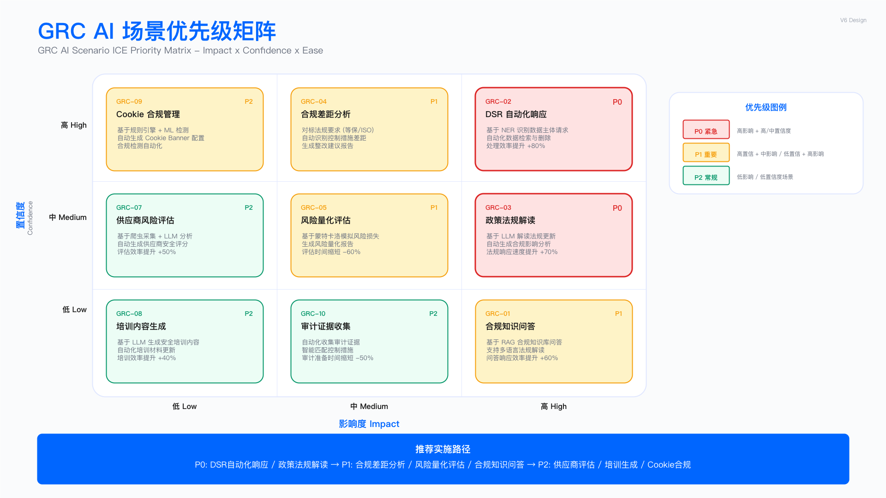

# 17.5　AI for GRC：治理、风险与合规的自主等级演进

> English Title: AI for Governance, Risk & Compliance: An Autonomy-Level View
> 本节定位：本节遵循全章的分工边界（见 [17.1 演进主线与自主等级](./17.1_演进主线与自主等级.md)）。它只回答四个问题——GRC 这个域里 AI 能力演进到了哪一步、当前停在哪个自主等级、前沿拐点在哪、选型该怎么取舍。至于这些能力如何嵌入企业既有的 GRC 流程（合规差距分析怎么排期、政策怎么以代码方式落地、GRC 平台怎么选型），是第2章的职责，本节到边界处交叉引用、不重复展开。
> 目标读者：GRC Manager、Compliance Officer、DPO、Risk Manager、Internal Audit

---

## 17.5.1 GRC 是一个"文本密集、裁量为王"的域

要判断 AI 在一个安全域里能走多远，先看这个域的工作本质。GRC 的日常，剥掉外壳后是两件事叠在一起：

第一件是海量的文本搬运与理解。法规是文本，政策是文本，供应商的 SOC 2 报告是上百页文本，一封数据主体请求（DSR）邮件是文本，审计证据散落在几十个系统里等着被汇聚、比对、结构化。这类工作重复、枯燥、吃人力，而且恰好是大模型最擅长的——它是 AI 在 GRC 里能立刻发力的地方。

第二件是最终的裁量与责任承担。一条法规在本企业的具体场景该怎么适用、一个高风险 DSR 该不该受理、一份合规差距报告要不要签字上报监管，这些判断的代价高、不可逆、需要有人具名负责。这类工作不该、也不能交给模型定夺——它是 AI 在 GRC 里的天花板。

这两件事叠在一起，就决定了 GRC 域一个鲜明的特征：AI 的价值曲线在"文本处理"环节陡峭，在"最终裁量"环节几乎归零。 本章的自主等级标尺（L0–L5，见 17.1.2）套到 GRC 上，结论比其他安全域更保守——多数 GRC 场景的合理落点是 L2 到 L3，能可靠跑到 L4 的场景屈指可数，而 L5 在合规语境下近乎是个禁区。原因不难理解：合规的本质是"向监管和董事会证明你做到了"，而"证明"这件事天然要求一个可追责的人站在结论后面。

> 本节唯一的判断坐标：GRC 的一个环节值不值得往更高自主等级推，只看两点——它是否被"重复性文本处理"主导，以及它的产出是否需要一个人具名负责。前者高、后者低的环节（法规检索、证据汇聚、DSR 初分类），可以放心往上推；后者高的环节（终裁、签字、上报），无论技术多强都该把人留在回路里。

---

## 17.5.2 GRC AI 的演进：从"会查法规的助手"到"会自己取证的智能体"

把 GRC 里几类典型能力放到自主等级的阶梯上，能清楚看到这个域是怎么一级一级往上爬的，以及为什么大多数场景爬到一半就该停下。

### L2 辅助：检索增强，GRC AI 落地最扎实的一级

GRC 的第一波、也是至今最稳的一波 AI 落地，是 L2 的检索增强。典型形态是"会查法规的合规助手"：法务面对一个问题，AI 从权威法规库里检索出相关条款原文，基于真实条文归纳作答，并附上出处；法务在此基础上快速判断，决策权始终在人。

这一形态之所以在 GRC 里格外契合，是因为它同时命中了这个域的两个刚需。其一，约束幻觉。 合规场景绝不能容忍模型凭训练记忆编造一条并不存在的法规条款——检索增强把模型的回答强行约束在检索到的真实条文范围内，从机制上堵死了这条最危险的错误路径。其二，可追溯。 法务必须能逐句核对结论的法规依据，检索增强天然把"出处"一并返回，让每一句结论都能定位回原文。

法务和合规团队每天花在"翻法规、找条款、拼上下文"上的时间，正是 L2 检索助手能立刻接手的，且风险极低——因为决定权仍在人手里。

这一级的工程要点——语料的版本与时效、混合检索的参数、引用强制——本小节末尾的工件一给出了一份可以直接改的配置。至于这些能力如何嵌进企业既有的合规流程（差距分析怎么排期、控制库怎么建），仍属第2章职责，见 [2.3 合规管理框架](../../第01部分_基础与战略治理/第02章_GRC治理/2.3_合规管理框架.md) 的合规差距分析五步法。

### L3 有条件自动：把确定性的合规流程固化下来

GRC 里有大量"每次都走同样几步"的确定性流程，它们适合从 L2 往上推一格到 L3——让 AI 按预设流程自动跑完多步动作，人只守在关键决策点。

最典型的是 DSR（数据主体请求）处理。GDPR、CCPA、PIPL 等法规对响应时限有硬性要求（GDPR 30 天、LGPD 15 天），请求量一大，人工逐封判断类型、识别管辖权、计算截止日期就极易违规。这里可以清晰地划一条线：语义理解交给模型，确定性规则交给代码。 判断一封措辞千变万化的邮件到底是"要求删除数据"还是"行使被遗忘权"，这是 LLM 的强项；而各法域的响应时限、流程路由，是不该交给模型推断的确定性规则——把它硬编码进系统，反而更可靠。这条"模型管语义、代码管规则"的分界，是 GRC 自动化的一条通用心法。

> DSR 处理里真正需要 LLM 的只有"意图分类"一小块，其余（时限计算、状态流转、审计留痕）用确定性代码更稳、更可解释、更便宜。别因为整条流程叫"智能运营"，就把每一步都塞给模型。

边界清晰、每次都走同样几步的合规处置（DSR 路由、等保 checklist 核对、证据定期归集），可以固化成流程推到 L3，把人从重复劳动里解放出来。

L3 流程如何真正嵌入企业的隐私运营和合规值班——DSR 与隐私合规体系的联动、身份验证的强度设定、多系统删除的一致性——属于域章职责，见 [17.6 AI for DataSec](./17.6_AIforDataSec_AI数据安全.md) 与[第9章隐私合规](../../第03部分_数据安全与隐私/第09章_隐私合规/)。

### L4 高度自主：能自己取证的智能体，GRC 里少数够格的场景

L4 和 L3 的本质区别在于：流程不再是人写死的，而是智能体自己规划出来的。 在 GRC 里，够得上 L4 的场景不多，供应商安全评估是其中最典型的一个。

传统的供应商评估极耗人力：评估人要通读上百页 SOC 2 Type II 报告、核对 ISO 27001 证书范围、翻渗透测试结论、比对安全问卷答案，再交叉核验、综合打分。这件事的本质是"在大量非结构化文档里自主取证并交叉核验"——它没有一条能事先写死的固定流程，因为每家供应商给的材料、每份报告的结构都不一样。智能体在这里的价值，是自己决定先读哪份材料、发现证书范围与实际业务不符时自己顺藤摸瓜去别的文档里求证、把散落各处的证据拼成一张风险图。这正是 L4 "自己规划、自己调工具、自己纠错"的用武之地。

但即便到了 L4，GRC 的天花板依旧生效：智能体可以自主完成取证和初步研判，但"这家供应商能不能用"的最终结论，必须有人签字。 尤其要盯住一类模型容易漏掉的关键信息——SOC 2 报告里的"例外事项"（exceptions）、ISO 证书里被悄悄缩小的适用范围、供应商自评问卷里的美化倾向。这些正是决定风险等级的要害，也正是最需要人工复核的地方。所以 L4 的供应商评估智能体，本质是"把人从翻文档里解放出来，聚焦到真正需要专业判断的风险研判上"，而不是取消人。

那类今天仍靠资深人员"凭经验一份份翻材料交叉核验"、且难以固化成死流程的 GRC 判断（供应商评估、复杂多法域合规咨询、跨框架证据关联），是 L4 的候选——前提是更便宜的 L2/L3 确实兜不住。

### L5 完全自主：合规语境下的禁区

L5 意味着全流程无人干预、人只做事后审计。在 GRC 域，这几乎是个禁区——不是技术做不到，而是合规的定义决定了它不该发生。监管要问责的时候，需要一个具体的人站在合规结论后面；一个"无人把关"的合规决策，本身就与"可审计、可追责"的合规本质相冲突。把 L5 理解为一个需要极度审慎对待的方向，而不是 GRC AI 要冲的终点。

---

上面四级划的是判断的边界。下面把其中两级最常被要求"给个能跑的东西"的部分写出来：L2 的合规问答该怎么配，L3 的证据归集该收成什么结构。两份工件都能改了直接用，代价写在各自后面。

### 工件一：合规问答 RAG 的语料、检索与引用强制

合规问答的难点不在模型，在语料。同一部法律两年里可能改两次，旧版条文与新版条文在向量空间里长得几乎一样，检索器分不出来。所以下面这份配置花在语料版本与时效上的篇幅，比花在检索参数上的多——版本管理是这套东西的成败点。引用一条已经废止的条款，比不回答危险得多：不回答只是没帮上忙，引废止条款给出的是一个看起来有出处、实际站不住的合规结论，而且它会被下游当成依据继续往前用。

```yaml
# compliance_qa.rag.yaml —— 合规问答助手的语料、检索与引用强制
# 这份配置管三件事：哪些法规进语料库、检索按什么参数召回、答案给不出条款出处时怎么办。
version: 3
service: compliance-qa

# ── 一、语料范围：进库的每一份都要能说清版本与时效 ───────────────────
corpus:
  jurisdictions: [CN, EU]          # 只入本企业实际有业务的法域；多一个法域就多一份长期维护
  chunking:
    unit: article                  # 切到"条"。引用校验比对的是条款号，切到自然段就没法比
    max_tokens: 1200
    overlap_tokens: 0              # 条与条之间不重叠：重叠会让引文同时落在相邻两条里，定位失真
    keep_fields: [doc_id, version, article_no, effective_from, effective_to, status]
  documents:
    - doc_id: cn-pipl
      title: 中华人民共和国个人信息保护法
      jurisdiction: CN
      doc_type: law
      version: "2021-08-20"        # 版本号用发布或修订日期，不用 latest 这类活标签
      effective_from: "2021-11-01"
      effective_to: null           # null 表示现行有效
      status: in_force             # in_force | superseded | repealed | draft
      article_no_pattern: '^第[一二三四五六七八九十百零]+条$'
      url: null                    # 权威发布页由录入人填写，模型不得生成
      owner: legal-privacy
      last_verified_on: "2026-06-30"   # 谁在哪一天核过一次现行有效性，过期就要重核
    - doc_id: cn-dsl
      title: 中华人民共和国数据安全法
      jurisdiction: CN
      doc_type: law
      version: "2021-06-10"
      effective_from: "2021-09-01"
      effective_to: null
      status: in_force
      article_no_pattern: '^第[一二三四五六七八九十百零]+条$'
      url: null
      owner: legal-privacy
      last_verified_on: "2026-06-30"
    - doc_id: eu-gdpr
      title: Regulation (EU) 2016/679
      jurisdiction: EU
      doc_type: regulation
      version: "2016-04-27"
      effective_from: "2018-05-25"
      effective_to: null
      status: in_force
      article_no_pattern: '^Article \d+(\(\d+\))?$'
      url: null
      owner: legal-privacy
      last_verified_on: "2026-06-30"
    - doc_id: internal-policy-dsp
      title: 数据分类分级管理标准
      jurisdiction: CN
      doc_type: internal_standard      # 内部标准与法规同库但要能区分：外部问答不得只引内部文件作依据
      version: "v4.2"
      effective_from: "2026-01-01"
      effective_to: null
      status: in_force
      article_no_pattern: '^\d+(\.\d+)*$'
      url: null
      owner: grc-office
      last_verified_on: "2026-06-30"

  # 版本生命周期：这套东西的成败点。新版进来必须做完这四步，缺一步就会出现"引用已废止条款"
  lifecycle:
    on_new_version:
      ingest_as_new_doc: true        # 新版本另起 doc_id 或版本字段入库，绝不原地覆盖旧版
      mark_previous_status: superseded
      set_previous_effective_to: true  # 旧版补上失效日期，否则两版会同时被判为现行有效
      reindex_within_days: 5         # 从公布到重建索引的上限。这几天里助手答的是旧版口径
    retrievable_status: [in_force]   # 默认只有现行有效的能被检索到
    quarantine_status: [superseded, repealed, draft]
    quarantine_behavior: keep_but_exclude   # 留档以便复盘历史口径，但默认检索不到
    historical_query:
      enabled: true
      param: as_of                   # 传 as_of=2022-06-01 才会检索当时有效的版本
      default: null                  # 不传就只查现行有效版本
      require_explicit_notice: true  # 走历史口径时答案必须显著标注，避免被当成现行意见使用
    stale_alarm_days: 180            # last_verified_on 超过这个天数未复核，该文档降级为不可检索

# ── 二、检索参数 ────────────────────────────────────────────────
retrieval:
  mode: hybrid                       # BM25 + 向量。法条问答里条款号与法定术语是精确串，纯向量会漏
  embedding_model_ref: env:COMPLIANCE_EMBEDDING_MODEL   # 按数据出域要求在部署时注入，不写死
  top_k_vector: 20
  top_k_keyword: 20
  fusion: reciprocal_rank            # 两路分数不可比，用 RRF 融合，别直接加权相加
  rerank:
    enabled: true
    top_n: 8                         # 重排后只送 8 条进上下文；条数越多，模型越容易引错条
  filters:
    status: [in_force]
    jurisdiction_from_question: true # 问题没点明法域时，按提问人所属实体的默认法域过滤
    doc_type_for_external_answer: [law, regulation]   # 对外答复不得只引内部标准
  min_rerank_score: 0.35             # 低于此分视为"没检索到"，直接进拒答分支

# ── 三、引用强制：检索不到就拒答，不许编 ─────────────────────────
answer_contract:
  require_citations: true
  min_citations: 1
  citation_fields: [doc_id, version, article_no, quote]
  quote_max_chars: 200
  quote_must_be_verbatim: true       # 引文必须是原文片段；改写过的引文一律判失败
  forbid:
    - answer_without_citation
    - cite_document_not_in_retrieved_set   # 引用没进本轮上下文的文档，等同于凭记忆编造
    - paraphrase_as_quote
    - cite_status_not_in_force
  refusal:
    when: [no_hit_above_min_score, citation_verification_failed, only_quarantined_hits]
    template_ref: prompts/refuse_no_basis.txt
    must_return: [attempted_queries, nearest_documents]  # 拒答要说清查过什么，否则会被当成系统故障
    escalate_to: legal-privacy       # 拒答不是终点，转人工才是

# ── 四、生成后校验：不通过就不返回 ──────────────────────────────
verification:
  run: post_generation
  checks:
    - article_exists                 # 条款号在该文档该版本里真实存在
    - version_effective              # 引的版本当前有效，或与显式传入的 as_of 一致
    - quote_verbatim                 # 引文能在条文原文里逐字找到
    - citation_in_retrieved_set      # 引用的条款确实在本轮检索结果里
  on_fail: refuse_and_log
  log_sink: internal://grc/qa/citation_failures
  alert_threshold_daily: 20          # 单日校验失败超过 20 次，先查语料再查模型

audit:
  retain_days: 1095
  record: [question, jurisdiction, as_of, retrieved_doc_ids, answer, citations,
           verification_result, corpus_snapshot_id, model_version, prompt_version]
  corpus_snapshot_id: required       # 没有语料快照 ID，事后无法复现"当时依据的是哪一版"
```

三个设计选择是有代价的。

其一，`retrievable_status` 只放行 `in_force`。好处是助手默认碰不到废止条文，代价是历史口径的问题必须显式传 `as_of` 才能问，法务查"2022 年那笔业务当时适用哪条"时会先撞一次拒答。更实际的代价在 `reindex_within_days: 5`——法规公布到语料重建索引之间有几天空窗，这几天里助手答的是旧版口径，而它自己意识不到。这个窗口要有人盯，盯的方式是把法规修订的官方发布渠道接进监控；等法务发现答错了再来报，已经晚了。

其二，`quote_must_be_verbatim` 要求引文逐字来自原文。代价是回答会显得生硬，模型不能把三条条文揉成一句通顺的话再挂一个出处。放宽成"意思一致即可"，校验就失去判据了——"意思一致"只能再交给一个模型去判，而那正是这套机制要防的环节。

其三，`overlap_tokens: 0` 让条与条之间不重叠。代价是跨条的问题（第 X 条要结合第 Y 条一起看）需要模型自己引两条，召回会低一些；换成重叠切分，引文会同时落在相邻两条里，条款号定位就不准了。合规问答里定位准比召回高更要紧。

引用校验要独立成一段代码。写在 prompt 里的"请确保引用的条款真实存在"不构成校验，它由待校验的那个模型自己执行。下面这段在生成之后跑，任一条引用不过，整条回答就不发出去。

```python
"""合规问答的引用校验：检查模型引的条款在语料里真实存在、当前有效、且引文逐字对得上。
用法: python3 verify_citations.py corpus_index.json answer.json [--as-of YYYY-MM-DD]

corpus_index.json 由入库流程生成，与 compliance_qa.rag.yaml 的 corpus 段一一对应：
  {"cn-pipl": {"version": "2021-08-20", "status": "in_force",
               "effective_from": "2021-11-01", "effective_to": null,
               "articles": {"第五十一条": "个人信息处理者应当根据……"}}}
answer.json 是模型输出，含 answer、citations、retrieved_doc_ids 三个字段。

校验不通过时返回码非 0：调用方据此走 answer_contract.refusal 的拒答分支，
而不是把这条回答发给用户。拒答的代价是用户多等一轮，引用废止条款的代价是合规结论错。
"""
import json
import re
import sys

# 失败原因与 compliance_qa.rag.yaml 的 verification.checks 一一对应
NO_CITATION = "no_citation"
DOC_UNKNOWN = "doc_unknown"
ARTICLE_MISSING = "article_missing"
VERSION_MISMATCH = "version_mismatch"
NOT_EFFECTIVE = "not_effective"
QUOTE_MISMATCH = "quote_mismatch"
NOT_RETRIEVED = "not_retrieved"

# 全半角与标点归一表。只处理书写差异，不处理数字写法差异——
# "第五十一条"和"第51条"是两个不同的键，靠入库流程统一，不靠这里猜
_PUNCT = str.maketrans("（）：；，。、“”‘’　", "():;,.,\"\"''" + " ")


def normalize(text):
    """比对引文前做最小归一：去空白、统一全半角标点。不做任何同义改写。"""
    return re.sub(r"\s+", "", (text or "").translate(_PUNCT))


def effective_on(doc, as_of):
    """判断这一版在 as_of 当天是否有效。as_of 为 None 时只认现行有效版本。"""
    if as_of is None:
        return doc.get("status") == "in_force"
    if doc.get("status") == "draft":
        return False
    start, end = doc.get("effective_from"), doc.get("effective_to")
    if start and as_of < start:
        return False
    if end and as_of > end:
        return False
    return True


def verify_one(cite, corpus, retrieved, as_of):
    """校验单条引用，返回失败原因列表；空列表表示通过。"""
    fails = []
    doc = corpus.get(cite.get("doc_id"))
    if doc is None:
        return [DOC_UNKNOWN]
    if cite.get("version") and cite["version"] != doc.get("version"):
        fails.append(VERSION_MISMATCH)
    if not effective_on(doc, as_of):
        fails.append(NOT_EFFECTIVE)
    article = (doc.get("articles") or {}).get(cite.get("article_no"))
    if article is None:
        fails.append(ARTICLE_MISSING)
    elif normalize(cite.get("quote")) not in normalize(article):
        fails.append(QUOTE_MISMATCH)
    if retrieved is not None and cite.get("doc_id") not in retrieved:
        fails.append(NOT_RETRIEVED)
    return fails


def verify_answer(answer, corpus, as_of=None):
    """校验一次问答的全部引用。任何一条引用不过，整条回答就不能发出去。"""
    cites = answer.get("citations") or []
    retrieved = answer.get("retrieved_doc_ids")
    report = {"as_of": as_of, "citation_count": len(cites), "failures": []}
    if not cites:
        report["failures"].append({"index": None, "reasons": [NO_CITATION]})
    for i, cite in enumerate(cites):
        reasons = sorted(set(verify_one(cite, corpus, retrieved, as_of)))
        if reasons:
            report["failures"].append({"index": i,
                                       "doc_id": cite.get("doc_id"),
                                       "article_no": cite.get("article_no"),
                                       "reasons": reasons})
    report["ok"] = not report["failures"]
    return report


def parse_args(argv):
    as_of, rest = None, list(argv)
    if "--as-of" in rest:
        i = rest.index("--as-of")
        if i + 1 >= len(rest):
            raise SystemExit("--as-of 后面要跟 YYYY-MM-DD")
        as_of = rest[i + 1]
        del rest[i:i + 2]
    if len(rest) != 2:
        raise SystemExit(__doc__.splitlines()[1])
    return rest[0], rest[1], as_of


def main(argv):
    corpus_path, answer_path, as_of = parse_args(argv)
    with open(corpus_path, encoding="utf-8") as fh:
        corpus = json.load(fh)
    with open(answer_path, encoding="utf-8") as fh:
        answer = json.load(fh)
    report = verify_answer(answer, corpus, as_of)
    print(json.dumps(report, ensure_ascii=False, indent=2))
    if not report["ok"]:
        print("校验未通过：按 answer_contract.refusal 拒答并转 legal-privacy，不要返回这条回答")
        return 1
    return 0


if __name__ == "__main__":
    sys.exit(main(sys.argv[1:]))
```

照抄时最容易改错的三处。

第一，`corpus_index.json` 里 `articles` 的键必须和模型输出的 `article_no` 用同一套写法。"第五十一条"和"第51条"是两个不同的键，`normalize()` 只统一空白与全半角标点，不碰数字写法。两边不统一，全部引用都会判 `article_missing`，而现象是"助手突然什么都不肯答了"，很容易被当成模型坏了去查模型。写法的统一要在入库时做，不要指望校验环节兜住。

第二，`effective_on()` 在 `as_of` 为 `None` 时只认 `in_force`。为了让历史问题也能答，有人会把这里改成允许 `superseded` 通过——改完之后默认路径就允许引用已废止条款了，而校验报告仍然是绿的。要放开历史口径，走 `as_of` 参数，别动默认分支。

第三，`min_rerank_score` 是最常被往下调的一项。拒答率高的时候把 0.35 调到 0.15，指标立刻好看，实际是把拒答换成了引用不相关条款——后者能通过 `article_exists` 与 `quote_verbatim` 两项校验，因为条款确实存在、引文确实是原文，只是与问题无关。这个阈值该拿一批标注过的问答样本重标，不该按拒答率的手感调。

### 工件二：控制有效性证据的结构化收集定义

GRC 里最费人的活是证明控制在跑。费人之处不在取证本身，而在取回来的东西经常不被审计认——一张截图没有时间、一份导出说不清来源系统、一段日志看不出覆盖了哪段时间。下面这份 schema 把"一条证据要能自证什么"固定下来，其中自动采集的那部分要求最严。

```json
{
  "schema_id": "grc.control-evidence.v2",
  "purpose": "控制有效性证据项的结构定义。一条证据要能自证四件事：证的是哪个控制、覆盖哪段时间、从哪个系统取的、现在还算不算数。",
  "required": [
    "evidence_id", "control_id", "framework_refs", "evidence_type",
    "collection_mode", "evidence_window", "collected_at", "valid_until",
    "owner", "storage_ref", "integrity_hash"
  ],
  "fields": {
    "evidence_id": {
      "type": "string",
      "pattern": "^EV-[0-9]{4}-[0-9]{6}$",
      "note": "年份 + 流水号。跨年不重排，审计会按编号回溯往年证据"
    },
    "control_id": {
      "type": "string",
      "note": "本企业统一控制库的编号，不是框架条款号。一个控制可映射多个框架条款，反过来不成立"
    },
    "framework_refs": {
      "type": "array",
      "items": {"type": "string"},
      "example": ["ISO27001:2022/A.8.16", "等保2.0/8.1.4.3", "SOC2/CC7.2"],
      "note": "一控多用：同一条证据可同时满足多个框架，这一列决定了它能被复用几次"
    },
    "evidence_type": {
      "enum": ["config_snapshot", "system_log", "metric_series", "ticket_record",
               "approval_record", "scan_report", "screenshot", "policy_document",
               "training_record", "interview_note", "sample_test"],
      "note": "screenshot 与 interview_note 是最弱的两类，只在没有系统化取证手段时用，且不可作为自动采集的产物"
    },
    "collection_mode": {
      "enum": ["automated", "semi_automated", "manual"],
      "note": "automated = 无人触发、按调度从源系统取；semi_automated = 人触发脚本或人从系统导出；manual = 人写、人拍、人访谈"
    },
    "evidence_window": {
      "type": "object",
      "properties": {"from": {"type": "string", "format": "date-time"},
                     "to": {"type": "string", "format": "date-time"}},
      "note": "证据覆盖的业务时间区间。它与 collected_at 是两件事：一份 7 月 1 日采集的日志，覆盖的可能是 6 月的运行情况"
    },
    "collected_at": {"type": "string", "format": "date-time",
                     "note": "采集动作发生的时刻，UTC 带时区，不用本地无时区字符串"},
    "valid_until": {"type": "string", "format": "date",
                    "note": "由 validity_policy 按 evidence_type 推导，允许就地覆盖但必须写 override_reason"},
    "owner": {"type": "string", "note": "控制责任人，不是采集脚本的维护者。证据过期时找他，不是找运维"},
    "storage_ref": {"type": "string", "note": "证据文件的不可变存储地址；写入后禁止覆盖，更新用新 evidence_id"},
    "integrity_hash": {"type": "string", "pattern": "^sha256:[0-9a-f]{64}$"},
    "source_system": {"type": "string", "note": "自动采集必填：证据取自哪个系统实例，含环境标识（prod / staging）"},
    "source_query": {"type": "string", "note": "自动采集必填：可重放的查询或 API 调用参数，用于复现这份证据"},
    "collector_version": {"type": "string", "note": "自动采集必填：采集器版本。采集逻辑变了而证据没变，多半是采集器出了问题"},
    "collector_identity": {"type": "string", "note": "自动采集必填：采集所用的服务账号，审计要核它的权限范围"},
    "prepared_by": {"type": "string", "note": "人工与半自动必填：谁做的"},
    "reviewed_by": {"type": "string", "note": "人工与半自动必填：谁复核的，且不得与 prepared_by 相同"},
    "reviewed_at": {"type": "string", "format": "date-time"},
    "ai_assisted": {
      "type": "object",
      "properties": {
        "used": {"type": "boolean"},
        "purpose": {"enum": ["extraction", "summarization", "mapping_suggestion"]},
        "model_version": {"type": "string"},
        "human_reviewer": {"type": "string"},
        "human_reviewed_at": {"type": "string", "format": "date-time"}
      },
      "note": "AI 参与过的证据必须标出来，且必须有具名人复核。AI 只做抽取、归纳、映射建议，不产生证据本身"
    },
    "exceptions": {
      "type": "array",
      "items": {"type": "string"},
      "note": "抽样测试发现的偏差项。这一栏为空要有理由，长期全空的控制通常是没真测"
    }
  },
  "conditional_requirements": [
    {
      "when": {"collection_mode": "automated"},
      "require": ["source_system", "source_query", "collected_at", "collector_version",
                  "collector_identity", "integrity_hash"],
      "forbid_types": ["screenshot", "interview_note"],
      "reason": "自动采集的证据不带来源系统与采集时间，审计无法判断它取自哪个环境的哪一刻，也无法重放验证，等同于没有证据"
    },
    {
      "when": {"collection_mode": "semi_automated"},
      "require": ["source_system", "prepared_by", "reviewed_by", "reviewed_at"],
      "reason": "人触发的导出要能说清是谁在什么权限下导的，否则无法排除“挑好看的时段导一份”的可能"
    },
    {
      "when": {"collection_mode": "manual"},
      "require": ["prepared_by", "reviewed_by", "reviewed_at"],
      "distinct_fields": ["prepared_by", "reviewed_by"],
      "reason": "人工证据的可信度全靠双人分离，自己做自己审等于没审"
    },
    {
      "when": {"ai_assisted.used": true},
      "require": ["ai_assisted.model_version", "ai_assisted.human_reviewer",
                  "ai_assisted.human_reviewed_at"],
      "reason": "AI 参与的部分要能被单独追溯；模型换版本后，此前由它抽取的证据需要重新抽检"
    }
  ],
  "validity_policy": {
    "default_valid_days": {
      "config_snapshot": 90, "system_log": 30, "metric_series": 30, "scan_report": 30,
      "ticket_record": 90, "sample_test": 90, "screenshot": 30,
      "approval_record": 365, "policy_document": 365, "training_record": 365,
      "interview_note": 365
    },
    "grace_days": 14,
    "expiry_action": "mark_stale_and_notify_owner",
    "note": "证据过期不等于控制失效。报告里必须把“控制无效”和“证据过期”分成两列，混在一起会让整改优先级失真"
  },
  "coverage_rules": {
    "min_sample_size_formula": "ceil(population * 0.05)",
    "min_sample_floor": 5,
    "continuous_controls_require": "metric_series 或 system_log，且 evidence_window 必须连续覆盖考核期，不允许只取期末一天的快照",
    "note": "持续性控制只交一份期末快照，证明的是“那一刻是对的”，不是“这一年都是对的”"
  },
  "examples": [
    {
      "evidence_id": "EV-2026-000418",
      "control_id": "CTL-LOG-004",
      "framework_refs": ["ISO27001:2022/A.8.15", "等保2.0/8.1.4.3"],
      "evidence_type": "config_snapshot",
      "collection_mode": "automated",
      "evidence_window": {"from": "2026-06-01T00:00:00Z", "to": "2026-06-30T23:59:59Z"},
      "collected_at": "2026-07-01T02:10:00Z",
      "valid_until": "2026-09-29",
      "owner": "infra-security-lead",
      "storage_ref": "internal://grc/evidence/2026/EV-2026-000418.json",
      "integrity_hash": "sha256:0000000000000000000000000000000000000000000000000000000000000000",
      "source_system": "siem-prod-cn-north",
      "source_query": "GET /api/v2/retention-policy?scope=all&as_of=2026-06-30",
      "collector_version": "evidence-collector 1.8.3",
      "collector_identity": "svc-grc-collector",
      "exceptions": []
    },
    {
      "evidence_id": "EV-2026-000419",
      "control_id": "CTL-ACC-011",
      "framework_refs": ["SOC2/CC6.2"],
      "evidence_type": "sample_test",
      "collection_mode": "manual",
      "evidence_window": {"from": "2026-04-01T00:00:00Z", "to": "2026-06-30T23:59:59Z"},
      "collected_at": "2026-07-08T09:30:00Z",
      "valid_until": "2026-10-06",
      "owner": "iam-manager",
      "storage_ref": "internal://grc/evidence/2026/EV-2026-000419.pdf",
      "integrity_hash": "sha256:1111111111111111111111111111111111111111111111111111111111111111",
      "prepared_by": "grc.analyst.zhou",
      "reviewed_by": "grc.manager.li",
      "reviewed_at": "2026-07-09T03:00:00Z",
      "ai_assisted": {
        "used": true,
        "purpose": "extraction",
        "model_version": "grc-doc-extract@2026-05",
        "human_reviewer": "grc.analyst.zhou",
        "human_reviewed_at": "2026-07-08T11:00:00Z"
      },
      "exceptions": ["抽查 20 个离职账号，2 个在离职后 3 天才被禁用，已开整改单 REM-2026-0771"]
    }
  ]
}
```

三个设计选择是有代价的。

其一，`conditional_requirements` 把自动采集的门槛设得比人工高：必须带 `source_system`、`source_query`、`collector_version`、`collector_identity`、`integrity_hash` 五项，还禁止产出截图与访谈记录。代价是接一个新系统的自动采集，工作量比让人每季度导一次表大得多，前几个控制上线会明显偏慢。这几项的用处在被质疑时才显现：审计问"这份配置快照取自生产还是预发"，`source_system` 直接作答；问"能不能重取一份看看现在还是不是这样"，`source_query` 可以重放。缺了它们，一份自动采集的证据与一份手写声明在证据力上没有区别。

其二，`evidence_window` 与 `collected_at` 拆成两个字段。多数团队只记一个采集时间，于是一份 7 月 1 日采集、覆盖 6 月运行情况的日志，在报告里显示成"7 月的证据"。到跨期审计时，这类证据要么被要求重取，要么被判为未覆盖考核期。拆字段的代价是采集器要多算一次时间区间，且区间边界必须与考核期对齐。

其三，`manual` 模式强制 `prepared_by` 与 `reviewed_by` 不同人。代价直接落在小团队身上：只有两个人的合规组，每条人工证据都要占掉两个人的时间。放弃这条能省人力，但人工证据的可信度就只剩一个签名。

照抄时最容易改错的三处。

第一，`valid_until` 按 `evidence_type` 推导，很多人图省事给所有类型统一填 365 天。配置快照给 365 天，意味着一年里配置改过八次也照样"证据有效"。`config_snapshot` 与 `approval_record` 的有效期差一个数量级是有理由的：前者证明的是一个会变的状态，后者证明的是一个已经发生的动作。

第二，`validity_policy` 注释里那条区分要落到报告结构上——证据过期与控制失效是两件事。把两者合成一列"不合规"，整改队列里会挤满控制其实跑得好好的项，真正失效的控制反而排不上号。这个错误在数据层不报错，到管理层才发作。

第三，`ai_assisted` 这一段最容易被整段删掉，理由通常是"只是用模型帮忙抽取一下"。留着它的价值在模型换版本的时候：`model_version` 记下了哪些证据由哪个版本抽取，换版本后只需对这批做抽检；删掉它，就只剩全量重做或者赌它没问题两个选项。这一条呼应 17.5.5 的第三条取舍——溯源是 GRC AI 的准入门槛。

---

## 17.5.3 GRC 各场景的自主等级落点

把上面的分析收敛成一张对照表。这张表不是要给每个场景钉死一个等级，而是给出一个合理落点的判断——它落在哪一级，由"文本处理占比"和"是否需要具名负责"两个坐标决定（17.5.1）。


*图 17.10：GRC AI 场景矩阵——按文本密集度与裁量权重两维划分的场景自主等级落点*

> 下表"当前主流技术形态"一列列举的是代表实现；真正决定归档的是左侧"合理自主落点"与判断依据，它们由场景性质决定。

| GRC 场景 | 合理自主落点 | 判断依据 | 当前主流技术形态 |
| -------- | ------------ | -------- | ---------------- |
| 法规智能解读 | L2 | 文本处理主导，但结论需法务背书 | 检索增强 + 法律问答 |
| DSR 处理 | L3 | 意图分类靠模型，时限/路由靠规则；高风险请求转人工 | 语义分类 + 确定性工作流 |
| 供应商安全评估 | L3–L4 | 自主取证可上 L4，最终结论必须人工签字 | 文档理解智能体 + 证据溯源 |
| 合规差距分析 | L2–L3 | 框架映射可自动化，整改优先级排序需业务判断 | 知识图谱映射 + 检索增强 |
| 审计证据收集 | L3 | 汇聚可自动化，证据完整性需人工背书 | 系统集成 + 文档理解 |
| 政策文档生成 | L2 | 生成草稿可辅助，定稿责任在人 | 检索增强 + 生成 |
| 风险评估报告 | L2–L3 | 数据汇总可自动化，风险结论需人工确认 | 检索增强 + 模板 |

这张表有三点值得注意。其一，整张表没有一个场景独立落到 L4 以上而不带"人工签字/背书"的尾巴——这就是 GRC 域"裁量为王"的直接体现，也是它区别于 SecOps（17.3 里告警研判能更彻底地跑到 L4）的根本原因。其二，越靠近"最终裁量"的场景，落点越低：政策定稿、风险结论都停在 L2，因为它们的产出直接对应责任。其三，几个场景标了区间（L3–L4、L2–L3），意思是同一场景里不同子环节的落点不同——供应商评估的"取证"能上 L4，"定级"却要退回人工，这种"一个场景内部分级"的思路，比给整个场景贴一个标签更贴近实操。

---

## 17.5.4 GRC 域的前沿拐点：从"检索问答"到"自主合规取证"

全章的耐久命题（17.1.4）落到 GRC 域，对应一个具体的拐点。

耐久的命题是：当推理与智能体模型的自主取证与交叉核验能力跨过某个可靠性阈值，GRC 里两件今天还高度依赖人力的事会发生质变——

- 合规评估从"人查资料、AI 辅助归纳"（L2）跃迁为"智能体自主通读全部证据、交叉核验、还原出'这家供应商在哪些控制上名实不符'的完整图景"（L4）。今天智能体还容易漏掉 SOC 2 的例外事项、看不穿证书范围的缩水；跨过阈值后，它能像资深评估人一样主动追问这些疑点。
- 多法域合规咨询从"人工逐个法域比对"跃迁为"智能体自主识别一个业务场景触及的所有司法辖区、并给出各法域下相互冲突之处的结构化对照"。

这个命题不依赖任何具体产品——它描述的是"自主取证能力跨过阈值会带来范式跃迁"这一规律，明天换任何模型来实现，命题依然成立。

当前最接近这个阈值的，是以 Claude Mythos 为代表的前沿推理模型。

识别 GRC 域下一个拐点，沿用 17.1.4 给出的三个通用信号，落到合规场景就是：工具调用可靠性（智能体能不能稳定地把散落各系统的证据取全）、长程任务成功率（面对一份需要交叉几十处的评估任务能不能走到底不跑偏）、自主纠错能力（读到自相矛盾的证据时能不能自己发现并回头求证，而不是照单全收）。盯住这三点，就能判断下一个模型是否把 GRC 场景往上推了一格。识别拐点的可操作机制（季度智能体回归、模型升级检查清单），见 [17.10 演进与展望](./17.10_演进与展望.md)。

---

## 17.5.5 GRC 域的选型取舍

GRC 场景选型，比其他安全域多背一层合规约束，有三条取舍值得单独点明。

取舍一：能用确定性规则的，就别引入模型的不确定性。 这是 GRC 选型的第一原则。法规时限、框架条款编号、checklist 匹配这类结构化、有唯一正确答案的判断，用规则引擎更稳、更可解释、更便于审计；LLM 只在处理模糊表述、跨措辞语义时作为增强。合规差距分析和等保检查的主体逻辑往往规则引擎就能覆盖，模型是点缀而非主角。把 LLM 当万能锤，会在最需要确定性的合规判断里引入不必要的漂移。

取舍二：数据敏感度决定模型部署形态，架构上别与单一模型强绑定。 GRC 数据常涉及敏感合规信息、内部政策、供应商机密，需要根据数据敏感度在公有云模型和私有部署之间切换。选型时要为"同一能力、不同敏感度走不同模型"留出架构余地，避免把整套 GRC AI 焊死在某一个模型接口上——这既是合规要求（数据不出域），也是避免供应商锁定的工程习惯。

取舍三：证据溯源不是可选项，是 GRC AI 的准入门槛。 无论哪个场景、哪个自主等级，只要产出要进入合规流程，模型的每一条结论都必须能定位回原始出处（法规条款、报告页码、系统记录）。没有溯源的 GRC AI 输出，在审计面前一文不值——因为合规的本质就是"可验证、可追溯"。这条约束高于任何性能指标：一个准确率略低但每句话都能核验的系统，远胜一个准确率更高却给不出出处的黑盒。

这些取舍指向"选什么、怎么建"的方向，但GRC AI 能力如何真正落进企业既有的治理机制——差距分析怎么排期整改、控制库怎么做到"一控多用"、政策怎么以代码方式（Policy-as-Code）持续验证、GRC 平台按成熟度怎么选型——是第2章的职责，本节到此为止：

- 合规框架与差距分析五步法：[2.3 合规管理框架](../../第01部分_基础与战略治理/第02章_GRC治理/2.3_合规管理框架.md)
- 统一控制库与 Policy-as-Code 工程化：[2.4 政策与标准体系](../../第01部分_基础与战略治理/第02章_GRC治理/2.4_政策与标准体系.md)
- GRC 平台按成熟度选型与集成架构：[2.5 GRC 平台与工具](../../第01部分_基础与战略治理/第02章_GRC治理/2.5_GRC平台与工具.md)
- 风险量化与第三方风险生命周期：[2.2 风险管理体系](../../第01部分_基础与战略治理/第02章_GRC治理/2.2_风险管理体系.md)

---

## 本节小结

- GRC 是文本密集、裁量为王的域：AI 的价值曲线在"文本处理"环节陡峭、在"最终裁量"环节归零。这决定了 GRC 多数场景的合理落点是 L2–L3，能上 L4 的少，L5 近乎禁区。
- 判断坐标只有两个：一个环节值不值得往更高自主等级推，看它是否被重复文本处理主导、以及产出是否需要具名负责。
- 各场景合理落点：法规解读 L2、DSR 处理 L3、供应商评估 L3–L4（取证可自主、定级需签字）、合规差距 L2–L3。越靠近最终裁量，落点越低。
- 前沿拐点：当自主取证与交叉核验能力跨过阈值，合规评估从"人查 AI 辅助"跃迁为"智能体自主取证还原名实不符的图景"。命题耐久，Claude Mythos 只是当前例证、不作论证前提。
- 三条选型取舍：能用规则就别用模型的不确定性；数据敏感度决定部署形态、别绑死单一模型；证据溯源是 GRC AI 的准入门槛而非可选项。
- 两份可直接改用的工件：合规问答 RAG 的语料版本、检索参数与引用强制校验（引用不过就拒答），以及控制有效性证据的结构化定义（自动采集必须带来源系统、采集时间与可重放的查询）。前者的成败点在法规语料的版本管理，后者的成败点在证据能不能自证覆盖了哪段时间。
- 分工边界：本节讲 GRC 域 AI 的演进、等级、前沿与选型；能力如何嵌入既有治理流程，交第2章（2.2/2.3/2.4/2.5）。

---

## 与其他章节的关联

| 关联章节 | 关联内容 | 协同价值 |
| -------- | -------- | -------- |
| [17.1 演进主线与自主等级](./17.1_演进主线与自主等级.md) | 自主等级 L0–L5 标尺 | 本节沿用全章唯一分级骨架 |
| [17.2 Agentic 安全智能体架构](./17.2_Agentic安全智能体架构.md) | 智能体解剖、评估回归、成本分层 | GRC 智能体（如供应商评估）的架构与评估依赖此处 |
| [17.10 演进与展望](./17.10_演进与展望.md) | 识别下一拐点的信号清单 | GRC 域的持续跟进机制 |
| [2.3 合规管理框架](../../第01部分_基础与战略治理/第02章_GRC治理/2.3_合规管理框架.md) | 合规差距分析五步法、全球法规地图 | 法规解读/差距分析能力落进合规流程 |
| [2.4 政策与标准体系](../../第01部分_基础与战略治理/第02章_GRC治理/2.4_政策与标准体系.md) | 统一控制库、Policy-as-Code | 政策生成/控制映射能力的落地载体 |
| [2.5 GRC 平台与工具](../../第01部分_基础与战略治理/第02章_GRC治理/2.5_GRC平台与工具.md) | GRC 平台选型与集成 | AI 能力嵌入既有 GRC 平台 |
| [17.6 AI for DataSec](./17.6_AIforDataSec_AI数据安全.md) | 数据安全集成 | DSR 处理与数据分类分级联动 |

---

## 导航

[← 上一节：17.4 AI for AppSec](./17.4_AIforAppSec_AI应用安全.md) | [返回章节目录](./README.md) | [下一节：17.6 AI for DataSec →](./17.6_AIforDataSec_AI数据安全.md)

---

© 2025-2026 AISecOps Project. Licensed under CC BY-NC-SA 4.0
