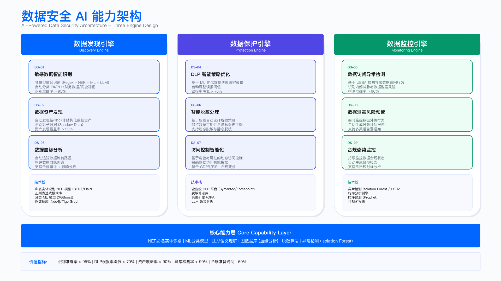

# 17.6　AI for DataSec：从批量分类到自主数据治理

> English Title: AI for Data Security: From Bulk Classification to Autonomous Data Governance
> 目标读者: Data Security Manager, DLP Engineer, Data Governance, Privacy Engineer

---

## 本节定位

本节回答一个具体问题：数据安全这个域，AI 能力今天爬到了自主等级的哪一档，前沿在往哪走，哪些活值得上智能体、哪些不值得。 我们不再把 AI-for-DataSec 讲成一张"更快更准"的对比表，而是沿 17.1 确立的自主等级 L0–L5（见 [17.1 演进主线与自主等级](./17.1_演进主线与自主等级.md)），把数据安全的核心工作——分类分级、敏感发现、DLP 研判、访问异常、跨境合规——各自摆到它当前该停靠的等级上，再讲清楚把某一类推高一级要付出什么代价。

贯穿全节有一条取舍：数据安全里绝大多数判断是高频、确定、可复现的——一个字段是不是手机号、一次传输命不命中规则——这类活交给正则和 ML 又快又便宜，根本轮不到智能体。只有少数真正模糊、真正高价值、又需要跨系统串联证据的判断（一次可疑的批量导出到底是运维正常操作还是内鬼窃取），才值得动用一个会多步调查的 agent，因为它慢、它贵、它偶尔会错。

与 第8章 的分工：本节讲的是"数据安全的 AI 能力演进到哪一级、前沿判断、选型取舍"；而这些能力如何嵌入企业的数据安全体系与具体工作流——分类分级标准怎么定、访问控制策略怎么落、DLP 怎么部署、监控审计怎么运转、跨境怎么合规——留在 [第8章 数据安全](../../第03部分_数据安全与隐私/第08章_数据安全/README.md)。两章精确互引，不重复堆叠。后文每讲到一类能力的落地面，都会精确指向 第8章 的对应节。

---

## 一、数据安全各类工作的自主等级分布

传统的数据安全 AI 叙事——"人工盘点 vs 智能扫描"——最大的问题是把数据安全当成一件均质的事去"上 AI"。真实场景里，"给一个字段打敏感标签"和"判断一次内部人员的批量导出是不是数据窃取"是两类完全不同的工作，它们该停靠的自主等级差着好几档。下表把数据安全的核心工作按 17.1 的 L0–L5 摆开，读它的正确方式是认清每类工作今天合理的停靠点，以及把它再往上推一级需要付出什么代价，而非直奔"最高那一档"。

| 自主等级 | 人机关系 | 数据安全里的典型工作 | 今天的技术使能者 |
| ------- | ------- | ------------------ | -------------- |
| L0–L1 | 全人工 / 规则告警 | 正则命中打标（身份证、手机号）、DLP 关键词拦截、静态权限策略 | 正则、ML 分类器 |
| L2 辅助 | 人决策，AI 提示 | 字段分类建议、DLP 告警摘要与降噪、脱敏策略草案、访问异常打分 | ML 分类 / LLM 辅助 |
| L3 有条件自动 | AI 执行，人监督 | 批量分类打标自动落库、固定 playbook 的告警富化、按规则自动脱敏 | 工作流编排（半自动） |
| L4 高度自主 | AI 自主，人管例外 | 一次可疑数据外泄的多步自主调查（拉血缘、查访问历史、比对基线、串证据） | Agentic 运行时 |
| L5 完全自主 | 罕见 / 审慎 | 端到端无人处置数据事件（当前几乎不存在，敏感数据的不可逆性决定了极难放手） | 前沿推理模型逼近 |

三点必须讲清楚，否则这张表只是又一张会过期的快照：

其一，数据安全的重心天然压在低等级，这不是保守，是数据的性质决定的。 数据安全里最大的工作量——给几十万个字段打标、对每天几十万次传输做 DLP 判定——是海量、高频、可复现的确定性判断，正是 L0–L2 最擅长的。这类活正则和 ML 一秒钟能处理成千上万条，用一个会推理的 agent 逐条去看，既慢又贵还不稳定。把便宜的活压在低等级，是数据安全 AI 的第一原则。 后文所有讲到 agent 的地方，都是在这个前提下讨论"剩下那少数真正难的判断"。

其二，L2 到 L4 的跃迁同样是三级技术台阶推上去的。 这三级台阶是：可靠的 function-calling → MCP 工具生态的标准化 → 推理模型驱动的自主性。数据安全里最能体现这条链的是"数据泄露调查"：没有可靠的工具调用，agent 连查一次数据血缘、拉一次访问日志都不敢托付；没有 MCP 把数据目录、DLP、CASB、访问审计统一成可消费的工具，每接一个系统都要重写胶水；而只有当推理模型能在多步之间自己判断"这次导出的表里有哪些敏感字段、这个人平时碰不碰这些表、上一步查到的 IP 意味着什么"，调查才真正从"人写好流程、AI 填空"（L3）跃迁为"AI 自己决定下一步查什么"（L4）。数据安全运营的等级可据此定位：只会给字段生成分类建议、给 DLP 告警配一段摘要等人决策的，停在 L2；按预先编排的固定步骤跑分类落库和告警富化、遇到分支就交回给人的，是 L3；能根据每一步的中间结果自主决定下一步查什么、直到自己判断证据足够的，才是 L4——而在数据安全里，能稳定跑到 L4 的场景目前还很少。

其三，各级叠加共存，不是新的取代旧的。 2026 年的数据安全体系里，L1 的正则打标、L2 的 DLP 降噪、L3 的自动分类落库、L4 的泄露调查 agent 是同时在跑的。这不是过渡态的混乱，而是合理的成本结构——把海量确定的判断压在低等级，把昂贵的自主推理省给真正需要跨系统串证据的少数事件。哪类判断停在哪一级，由它的价值、风险与可逆性决定：给字段打错一个标签可以事后纠正（可逆、低风险），可以放心自动化；而误删一批"判定为可脱敏"的生产数据是不可逆的，就必须卡在低等级、留人复核。

> 前沿拐点：当推理/agentic 模型的自主调查能力跨过某个可靠性阈值，数据安全里最难的那类工作——"一次可疑数据外泄的跨系统因果调查"——会从少数高价值事件的奢侈品，变成对每一起中高风险事件都能负担得起的常规操作。届时数据安全运营的重心，会从"人工串联数据目录、血缘、访问日志、DLP 事件"转向"智能体自主拉取并串联这些证据、人只审最终结论"。以 Claude Mythos 为代表的前沿推理模型，是当前最接近该阈值的例证。如何识别下一个拐点（工具调用可靠性、长程任务成功率、自主纠错能力三类信号），见 [17.10 演进与展望](./17.10_演进与展望.md)。

演进叙事到此为止。 本节余下的篇幅——各类数据安全工作今天合理的停靠等级、为什么大部分不该上 agent、少数该上 agent 的活长什么样、以及这些能力如何精确交给 第8章 落地——才是重点。

---

## 二、能力总览：哪些活不该上 agent

在展开任何 AI 能力之前，先把数据安全的痛点归类清楚，否则容易陷入"有什么 AI 能力就上什么场景"的技术驱动误区。数据安全的痛点可以收敛为三类——看不见、护不准、追不上——每一类对应一组 AI 能力：数据不可见对应发现类能力（分类分级、敏感识别、血缘），保护不精准对应保护类能力（DLP 降噪、脱敏、跨境合规），响应不及时对应监控类能力（访问异常、行为分析、泄露调查）。这个三分法是本节的组织骨架，后文按它分三条线展开；每类能力今天合理的停靠等级，汇总在第六部分的选型对照表里。

三类痛点之间存在依赖顺序：不解决"看不见"，后面的"护不准""追不上"都是空中楼阁——不知道敏感数据在哪，就无法为其配置精准的 DLP 策略，也无法对其访问建立异常基线。这也是为什么发现类能力（分类、敏感识别）永远是最优先落地的。

还有一个判断先摆到台面上：数据安全里绝大多数 AI 能力，今天合理的停靠点在 L1–L3，只有"泄露自主调查"这一类值得也才刚够得着 L4，而且仅限少数高价值事件。 下面按发现、保护、监控三条线分别展开，每条线都先讲"这类活为什么不该轻易上 agent、该用什么更便宜的手段"，再讲"如果确有必要，agent 用在哪一小段"，最后把落地面精确交给 第8章。

---

## 三、发现类能力：分类分级与敏感识别（L1–L3，不上 agent）

发现类能力是数据安全 AI 里工作量最大、也最不该上 agent 的一类。给几十万个字段打敏感标签，本质是海量、高频、可复现的判断——正是正则和 ML 最擅长、agent 最不划算的地方。这里真正的技术难点在于"同一类敏感数据以不同形态存在，单一方法覆盖不了"，与要不要推理无关。

### 3.1 为什么是多策略融合，而不是一个大模型

数据分类面临的本质挑战是"同一类敏感数据以不同形态存在"。正则表达式对格式固定的结构化数据（身份证、手机号）精度极高，但对姓名、地址等自由文本完全无能为力；NER 模型擅长自由文本实体识别，但对新型字段命名约定泛化能力弱；ML 语义分类依赖字段名和元数据推断，对无意义字段名（如 `col1`、`field_a`）失效；LLM 能理解复杂上下文，但调用成本高、延迟大。

一个常见的误区是"既然 LLM 什么都能理解，全用 LLM 分类不就行了"。答案是不行——对着几十万字段逐个调 LLM，账单和延迟都不可承受，而且绝大多数字段（一个标准的 `mobile` 列）用正则一毫秒就判定了，动用推理模型纯属浪费。正确的做法是四策略按置信度高低串联，用对的工具处理对的数据类型，把 LLM 省给前三层都判不准的少数复杂字段。分类场景把这条取舍摆得格外清楚：能用确定性规则解决的，就不引入模型的不确定性和成本。

关键设计与权衡：置信度阈值是分类质量的核心参数。各策略的置信度上限不同（正则 0.95、NER 0.85、ML 0.75），反映了各策略固有的不确定性。LLM 只在置信度 < 0.7 或复杂场景触发——阈值过低会让 LLM 频繁调用增加成本，过高会让大量模糊字段缺乏兜底。另一个核心权衡是采样率：对 TB 级数据表，全量扫描不现实，通常采用统计采样（如每表抽取 1000 行），采样偏差可能导致罕见敏感字段漏判，需要结合元数据（字段名、注释）补充检测。

生产环境常见坑：(1) 正则误报——`^\d{16,19}$` 会把员工工号、产品编号等数字串误识别为银行卡号，需要结合字段名和上下文做二次过滤；(2) 模型冷启动——企业初期没有自训练数据，NER 和 ML 分类器只能用通用模型，对企业内部命名约定（如 `user_cert_no` 代表身份证）识别效果差，需要 3–6 个月标注数据积累；(3) 动态数据处理——流式数据（Kafka）的分类时机和处理延迟比批量数据复杂得多，需要单独设计实时分类管道。

### 3.2 分类流水线的实际配置

四策略融合在工程上就是一条流水线：接数据源、采元数据、按顺序跑四个阶段、加权融合、按分级路由复核队列、回写数据目录。下面这份配置是它的完整形态，能直接对照着改成自己环境的版本。读它的主线是"钱花在哪、闸门设在哪"——`sampling` 决定扫描成本，`llm.trigger` 与 `llm.budget` 决定模型账单，`review_queue` 与 `grade_policy` 决定哪些结果机器不许自己定。

```yaml
# classification_pipeline.yaml —— 字段级分类打标流水线
# 调度器按 schedule 拉起，对每个 source 依次执行 stages，结果经 fusion 收敛后写回数据目录。
version: 3
pipeline: field-classification

sources:
  - name: mysql-crm-prod
    connector: jdbc
    dsn_ref: vault://datasec/crm-ro        # 只读账号；分类扫描不需要写权限，别图省事复用应用账号
    include: ["crm.*"]
    exclude: ["crm.tmp_*", "crm.*_bak"]    # 临时表和备份表跳过，否则同一批字段会被反复计费
    sampling:
      rows_per_table: 1000
      strategy: reservoir                  # 均匀覆盖历史行；直接 LIMIT 1000 只会取到最早的物理页
      max_bytes_per_column: 4096
  - name: hive-dw
    connector: hive
    dsn_ref: vault://datasec/dw-ro
    include: ["dw.dwd_*", "dw.dws_*"]
    sampling:
      rows_per_table: 2000
      strategy: partition_stratified       # 按分区分层采样，避免只采到最新分区
  - name: s3-datalake
    connector: s3
    bucket: corp-datalake
    prefix: raw/
    sampling:
      objects_per_prefix: 50
      bytes_per_object: 65536

metadata:
  # 样本之外必须带上的上下文。ML 与 LLM 的判准率主要由这几项决定，缺注释的表准确率会明显掉一档
  collect: [schema, column_name, column_comment, table_comment, data_type, nullable, distinct_ratio]
  from_catalog: true
  catalog_endpoint: internal://datacatalog/v1

stages:
  - id: regex
    engine: pattern
    ruleset: rulesets/pii_cn.yaml
    max_confidence: 0.95
    require_checksum: true                 # ID_CARD 走 ISO 7064 MOD 11-2、BANK_CARD 走 Luhn
    min_match_ratio: 0.6                   # 采样值里至少六成命中才算数，防单条巧合定性
    on_match: emit_candidate               # 命中也只是候选，仍进融合：工号、订单号常年伪装成卡号
  - id: ner
    engine: ner
    model: ner-zh-pii
    entities: [PERSON, LOCATION, ORGANIZATION]
    min_entity_ratio: 0.3
    max_confidence: 0.85
  - id: ml
    engine: classifier
    model: field-name-xgb
    features: [column_name, table_name, column_comment, data_type, distinct_ratio]
    max_confidence: 0.75
    always_run: true                       # 无条件跑，成本可忽略，用来给前两层做交叉验证
  - id: llm
    engine: llm
    prompt_ref: prompts/classify_field.prompt.yaml@v4
    trigger:                               # 三条同时成立才调用，这是控成本的主闸门
      max_upstream_confidence: 0.70
      column_name_uninformative: true      # col1 / field_a / ext_3 这类无信息量的命名
      not_in_cache: true
    max_confidence: 0.80
    budget:
      max_calls_per_run: 5000
      max_calls_per_table: 50              # 单表上限，防止一张 800 列的宽表吃掉整轮预算
      cache_key: [database, table, column, schema_fingerprint]
      cache_ttl_days: 30
    timeout_seconds: 20
    on_error: skip_stage                   # LLM 不可用时流水线继续，该字段直接落人工队列

fusion:
  method: weighted_vote
  weights: {regex: 0.95, ner: 0.85, llm: 0.80, ml: 0.75}
  min_sources_for_auto_tag: 2              # 只有 ML 一票时不允许自动落库
  tie_breaker: highest_single_source

review_queue:
  enter_when:
    - confidence_below: 0.80
    - grade_in: [Restricted]               # 判到 Restricted 的一律人工确认，不看置信度
    - sources_conflict: true               # 两个策略给出不同 data_type
  order_by: [grade_desc, confidence_asc, table_row_count_desc]
  sla_days: {Restricted: 3, Confidential: 7, Internal: 14, Public: 30}
  max_depth_before_page: 2000              # 队列积压到这个深度要叫人，否则"留人复核"名存实亡

grade_policy:
  # 分级在这里只决定复核强度与证据留存；加密、脱敏、权限这些控制措施本身见 8.4 与 8.5
  Restricted:
    auto_tag: false
    keep_evidence: true
    evidence_retention_days: 365
  Confidential:
    auto_tag: true
    min_confidence: 0.85
    keep_evidence: true
    evidence_retention_days: 180
  Internal:
    auto_tag: true
    min_confidence: 0.75
    keep_evidence: false
  Public:
    auto_tag: true
    min_confidence: 0.60
    keep_evidence: false

output:
  sink: internal://datacatalog/v1/tags
  write_mode: upsert
  preserve_manual_override: true           # 人工改过的标签机器不得覆盖，否则复核工作量白费
  emit_metrics: [fields_scanned, llm_calls, llm_cost_usd, review_queue_depth, auto_tag_rate]

schedule:
  full_scan: "0 2 * * 6"                   # 每周六 02:00 全量
  incremental: "*/30 * * * *"              # 半小时一次增量，只扫 schema 指纹变化过的表
```

这份配置里有几个选择是有代价的，照抄前要想清楚。

采样是成本与漏判的直接交换。 `rows_per_table: 1000` 让 TB 级表的扫描落在分钟级，代价是低频出现的敏感字段可能一次都没被采到——一张订单表里千分之一的记录带了身份证，1000 行采样大概率看不见它。缓解办法是让 `metadata` 里的字段名与注释承担更多判断权重，而不是一味调大采样量。`strategy` 的两个取值是针对不同存储形态的：`reservoir` 用于普通表，`partition_stratified` 用于按天分区的数仓表，用错会让采样全部落在最新分区，历史数据形态完全没进视野。

LLM 的三条触发条件是"与"关系，不是"或"。 这是最容易改错的地方：把 `trigger` 理解成任一条件成立就调用，账单会翻十几倍——绝大多数字段的置信度本来就在 0.7 以下，但它们同时有一个可读的字段名，不该动用 LLM。`cache_key` 里带 `schema_fingerprint` 也是刻意的：表结构没变就复用旧结论，结构一变缓存自动失效，比按时间过期更准。

`min_sources_for_auto_tag: 2` 与 `grade_policy.Restricted.auto_tag: false` 是两道独立的闸门。 前者防的是单个弱策略自说自话，后者防的是最贵的那类错误无人复核。两者都会推高人工复核量，`review_queue.max_depth_before_page` 就是用来暴露"复核队列已经积压到没人看"这件事的——没有这个上限，"留了人工兜底"很容易变成纸面承诺。

配置定义了"跑什么"，融合逻辑定义了"信谁"。下面这段代码是 `stages` 与 `fusion` 两块配置的执行体，抓住两个方法即可看懂全貌：`classify_field` 是编排器，依次调用四个策略、把输出统一装进 `results`（含 `source`、`type`、`confidence`），策略 3（ML）无条件执行、策略 4（LLM）由 `_needs_llm_analysis` 守卫，对应配置里的 `always_run` 与 `trigger`；`_fuse_results` 是决策器，用 `weights` 给每个策略加权、按 `data_type` 累加取最高分，再由 `needs_review` 把机器不确定的结果交回人工。

```python
"""
数据分类分级引擎 - 多策略融合
与 classification_pipeline.yaml 的 stages / fusion 两块配置一一对应。
"""

from dataclasses import dataclass
from typing import List, Dict
from enum import Enum

class DataGrade(Enum):
    """全书统一的四级数据分级，口径见 8.2.1，不要在这里自建第五级。"""
    RESTRICTED = "Restricted"      # 泄露即身份盗用/资金损失/系统入侵
    CONFIDENTIAL = "Confidential"  # 直接标识符与内部经营数据
    INTERNAL = "Internal"          # 内部使用，泄露影响有限
    PUBLIC = "Public"              # 可公开发布

@dataclass
class ClassificationResult:
    """分类结果"""
    field_name: str
    data_type: str              # ID_CARD, PHONE, EMAIL, etc.
    grade: DataGrade
    confidence: float           # 0-1
    sources: List[str]          # REGEX, NER, ML, LLM
    needs_review: bool

class DataClassificationEngine:
    """数据分类分级引擎"""

    def __init__(self):
        self.regex_classifier = RegexClassifier()
        self.ner_classifier = NERClassifier()
        self.ml_classifier = MLClassifier()
        self.llm_classifier = LLMClassifier()

    async def classify_field(
        self,
        field: FieldMetadata,
        samples: List[str]
    ) -> ClassificationResult:
        """对字段进行分类"""

        results = []

        # 策略 1: 正则匹配
        regex_result = self.regex_classifier.classify(samples)
        if regex_result.matched:
            results.append({
                "source": "REGEX",
                "type": regex_result.type,
                "confidence": 0.95
            })

        # 策略 2: NER 实体识别
        ner_result = await self.ner_classifier.classify(samples)
        if ner_result.entities:
            results.append({
                "source": "NER",
                "type": ner_result.dominant_type,
                "confidence": ner_result.confidence
            })

        # 策略 3: ML 语义分类
        ml_result = self.ml_classifier.predict(
            field_name=field.name,
            field_comment=field.comment,
            table_name=field.table_name
        )
        results.append({
            "source": "ML",
            "type": ml_result.type,
            "confidence": ml_result.confidence
        })

        # 策略 4: LLM 深度理解（前三层判不准才触发，控制成本）
        if self._needs_llm_analysis(results):
            llm_result = await self.llm_classifier.classify(
                field=field,
                samples=samples
            )
            results.append({
                "source": "LLM",
                "type": llm_result.type,
                "confidence": llm_result.confidence
            })

        # 结果融合
        return self._fuse_results(field.name, results)

    def _fuse_results(
        self, field_name: str, results: List[Dict]
    ) -> ClassificationResult:
        """多策略结果融合"""

        weights = {"REGEX": 0.95, "NER": 0.85, "LLM": 0.80, "ML": 0.75}

        type_scores = {}
        for result in results:
            weight = weights[result["source"]]
            score = result["confidence"] * weight
            data_type = result["type"]
            if data_type not in type_scores:
                type_scores[data_type] = {"score": 0, "sources": []}
            type_scores[data_type]["score"] += score
            type_scores[data_type]["sources"].append(result["source"])

        # 选择最高分
        best_type = max(type_scores, key=lambda x: type_scores[x]["score"])
        best = type_scores[best_type]

        # 归一化置信度
        total = sum(t["score"] for t in type_scores.values())
        confidence = best["score"] / total if total > 0 else 0

        # 单策略独票不得直接产出高置信度：只有 ML 命中时，归一化会把它算成 1.0，
        # 于是一个 0.75 上限的弱策略反而免了复核。对应配置的 min_sources_for_auto_tag。
        if len(best["sources"]) < 2 and "REGEX" not in best["sources"]:
            confidence = min(confidence, 0.6)

        grade = self._grade_of(best_type)
        return ClassificationResult(
            field_name=field_name,
            data_type=best_type,
            grade=grade,
            confidence=confidence,
            # Restricted 一律复核，与置信度无关；其余按阈值
            needs_review=(grade is DataGrade.RESTRICTED) or confidence < 0.8,
            sources=best["sources"],
        )
```

融合用的是加权投票而非"最高单策略胜出"，这意味着多个弱策略（NER + ML）若都指向同一类型，合力可以压过一个孤立的强策略。真实数据里这通常更稳健，代价是低质量策略会"抱团"放大同一个错误，所以 `weights` 和触发阈值需要跟着 3.4 的评测结果持续调。

照抄这段代码最容易踩的是归一化那一步。 `confidence = best["score"] / total` 算的是"最高类型占所有类型得分的比例"，当只有一个策略出结果时分子分母相等，置信度恒为 1.0——一个上限只有 0.75 的 ML 单票，反而拿到满分并跳过复核。上面那三行钳制就是补这个洞的，删掉它整条人工复核链路会大面积失效。另外 `weights[result["source"]]` 用的是直接下标，新增一个策略却忘了在 `weights` 里登记，运行时会抛 `KeyError` 而不是降级——这一点在扩展策略时要留意。代码里的 `FieldMetadata`、四个 `*Classifier` 是示意接口，`_grade_of` 按 3.5 的类型与分级对应表实现，接入时替换为自己的版本。

### 3.3 分类 prompt 与它要求的输出格式

前面的配置在 `stages.llm` 里指向了一份 prompt。那份 prompt 长什么样、要求模型吐出什么结构，直接决定了这一层是可用的兜底还是新的噪声源。把它当配置管起来（带版本号、带模型参数、带 schema 引用），而不是散在代码里的一段字符串，是这类工件唯一能长期维护的形态。

```yaml
# prompts/classify_field.prompt.yaml —— 与 classification_pipeline.yaml 的 llm 阶段配套
version: 4
owner: data-security-engineering
model_params:
  temperature: 0                 # 分类结果必须可复现，温度不为 0 时同一字段两次跑出不同分级
  max_output_tokens: 600
  output_format: json_schema
  schema_ref: schemas/field_classification.schema.json
  on_schema_violation: retry_once_then_review   # 重试一次仍不合约就转人工，不做二次解析猜测

system: |
  你是企业数据资产的字段分类器。输入是一个数据库字段的元数据与掩码样本，
  你判断它属于哪一类敏感数据、对应哪一个数据分级，并给出可核对的判断依据。

  按以下规则判断。
  1. 数据分级只能取 Restricted / Confidential / Internal / Public 之一，
     口径以企业数据分类标准为准，不要自创等级，也不要输出数字等级。
  2. 样本已掩码，只保留形态（如 138****5678）。据形态判断，不要试图还原原值。
  3. 判不准就输出 data_type = "UNKNOWN" 并给低置信度，不要猜。
     判不准会进人工队列，猜错会污染下游的脱敏与权限策略，后者更贵。
  4. evidence 必须逐条引用输入里真实出现过的内容（字段名、注释片段、样本形态、同表字段名），
     不得复述本提示词，不得编造输入中没有的表名或字段名。
  5. 字段名与样本形态冲突时（如字段名 user_id 但样本是 11 位手机号形态），
     以样本形态为准，并在 conflict_note 写明冲突点。
  6. 只输出 JSON，不要输出解释性文字或 Markdown 代码围栏。

user_template: |
  库表: {database}.{table}
  表注释: {table_comment}
  字段名: {column_name}
  字段注释: {column_comment}
  数据类型: {data_type}
  非重复值占比: {distinct_ratio}
  掩码样本（最多 10 条）:
  {masked_samples}
  同表其他字段名: {sibling_columns}

# 少样本示例只挑三类最容易判错的，多了会挤占上下文也会让模型过拟合到示例形态
few_shot_refs:
  - examples/uninformative_name_is_phone.json     # col_a 实为手机号
  - examples/user_id_is_not_id_card.json          # 18 位业务主键不是身份证
  - examples/order_no_looks_like_bank_card.json   # 19 位订单号不是银行卡
```

模型必须按下面这份 schema 输出。它不是格式洁癖：`confidence` 与 `evidence` 两个字段是人工复核队列的排序依据，缺了它们，复核队列就只能按时间排队，最贵的错误会排在最后被看到。

```json
{
  "$schema": "https://json-schema.org/draft/2020-12/schema",
  "title": "FieldClassification",
  "type": "object",
  "additionalProperties": false,
  "required": ["column_ref", "data_type", "grade", "confidence", "evidence", "needs_review"],
  "properties": {
    "column_ref": {
      "type": "string",
      "description": "库.表.字段，必须与输入一致；回写数据目录时靠它定位，模型改写过就写不回去",
      "pattern": "^[A-Za-z0-9_]+\\.[A-Za-z0-9_]+\\.[A-Za-z0-9_]+$"
    },
    "data_type": {
      "type": "string",
      "enum": ["ID_CARD", "BANK_CARD", "PHONE", "EMAIL", "NAME", "ADDRESS",
               "HEALTH", "FINANCIAL", "CREDENTIAL", "DEVICE_ID", "NON_SENSITIVE", "UNKNOWN"]
    },
    "grade": {
      "type": "string",
      "description": "全书统一四级，口径见 8.2.1",
      "enum": ["Restricted", "Confidential", "Internal", "Public"]
    },
    "confidence": {
      "type": "number",
      "minimum": 0,
      "maximum": 1,
      "description": "复核队列的排序键之一：同分级内先看低置信度的"
    },
    "evidence": {
      "type": "array",
      "minItems": 1,
      "maxItems": 5,
      "description": "复核者据此在几秒内判断结论成不成立；没有证据的结论无法复核，只能重判",
      "items": {
        "type": "object",
        "additionalProperties": false,
        "required": ["kind", "quote"],
        "properties": {
          "kind": {
            "type": "string",
            "enum": ["column_name", "column_comment", "table_comment", "sample_shape", "sibling_column"]
          },
          "quote": {"type": "string", "maxLength": 200}
        }
      }
    },
    "conflict_note": {"type": ["string", "null"], "maxLength": 300},
    "needs_review": {"type": "boolean"},
    "review_reason": {
      "type": ["string", "null"],
      "enum": ["low_confidence", "restricted_grade", "source_conflict", "uninformative_name", null]
    },
    "model_version": {"type": "string"}
  }
}
```

为什么置信度和证据是必填项。 一次全量扫描会产出几十万条分类结果，其中进人工队列的可能有几千条。复核人手是固定的，这几千条必然看不完，于是"先看哪一条"成为真问题。`grade` 决定第一排序键（Restricted 的漏判代价最高），`confidence` 决定第二排序键（同分级内先看模型最不确定的），`evidence` 决定单条复核要花几秒还是几分钟——复核者看到"字段注释写着'证件号'"这一句就能立刻定论，看不到证据则要自己去查一遍表。把 `evidence.quote` 限制为"原样摘自输入"，也顺带堵住了模型编造依据的常见失败：编造的引文与输入一比对就露馅，可以在写回前做程序化校验。

有代价的设计选择有三处。 其一，`additionalProperties: false` 会让模型多输出一个字段就整条作废，好处是 schema 演进时不会悄悄混入没人消费的字段，坏处是升级 prompt 版本时必须同步改 schema，两者必须同版本发布。其二，`temperature: 0` 换来可复现，代价是模型在真正模糊的字段上会稳定地给出同一个错误答案，靠重采样发现分歧的路子在这里用不了，只能靠 3.4 的评测集兜。其三，`on_schema_violation: retry_once_then_review` 选择了转人工而非放宽解析——很多实现会在这里写一段"从模型输出里正则抠 JSON"的兜底代码，它能把成功率从 98% 拉到 99.5%，但抠出来的那部分结果没有任何质量保证，属于用可见的失败换不可见的失败。

照抄时最容易改错的地方：`column_ref` 的 `pattern` 只允许字母数字下划线，真实环境里带连字符或中文的表名会直接被判违约，改 schema 前先扫一遍自己的命名规范；`enum` 里的 `NON_SENSITIVE` 和 `UNKNOWN` 是两个意思——前者是"看清楚了，不敏感"，后者是"没看清"，把两者合并会让复核队列丢掉一整类需要人看的字段。

### 3.4 分类质量的分层回归评测

分类流水线每改一次——换 prompt 版本、调阈值、给 ML 换特征——都需要回答同一个问题：这次改动是让分类更准了，还是只是把错误换了个地方。整体准确率回答不了它。一份真实的字段样本集里 Internal 和 Public 通常占八九成，Restricted 只占百分之几，把它们混在一起算，Restricted 的召回从 0.95 掉到 0.75 也只会让总准确率动一个百分点，而这正是最贵的那类退化。所以评测必须按分级分层，并给每一级单独设门槛。

```python
"""分类质量回归评测：按数据分级分层统计精确率与召回率。

用法: python3 eval_classification.py labeled_set.jsonl predictions.jsonl
两份文件每行一个 JSON 对象，至少包含 column_ref 与 grade 两个键。
标注集由人工复核过的字段构成，每季度补充一次，覆盖各分级与各数据源。
"""
import json
import sys
from collections import defaultdict

GRADES = ["Restricted", "Confidential", "Internal", "Public"]

# 漏标代价权重：Restricted 漏一个的代价远高于 Internal，用于加权漏标代价这个单一趋势指标
MISS_COST = {"Restricted": 25.0, "Confidential": 5.0, "Internal": 1.0, "Public": 0.2}

# 发布门禁：任一分级不达标即判回归失败。Restricted 卡召回（宁可多报），
# Internal/Public 卡精确率（多报会把复核队列淹掉），两端要求刻意不对称。
RECALL_FLOOR = {"Restricted": 0.98, "Confidential": 0.95, "Internal": 0.85, "Public": 0.60}
PRECISION_FLOOR = {"Restricted": 0.70, "Confidential": 0.85, "Internal": 0.90, "Public": 0.90}


def load(path):
    """读 JSONL，按 column_ref 建索引。重复的 column_ref 以最后一条为准。"""
    out = {}
    with open(path, encoding="utf-8") as f:
        for line in f:
            line = line.strip()
            if line:
                rec = json.loads(line)
                out[rec["column_ref"]] = rec
    return out


def confusion(truth, pred):
    """按分级累计 TP/FP/FN。没有给出预测的字段按漏标计入其真实分级，
    否则"模型跳过难判字段"会表现为指标变好。"""
    stat = {g: {"tp": 0, "fp": 0, "fn": 0, "support": 0} for g in GRADES}
    for ref, t in truth.items():
        g_true = t["grade"]
        stat[g_true]["support"] += 1
        p = pred.get(ref)
        g_pred = p.get("grade") if p else None
        if g_pred == g_true:
            stat[g_true]["tp"] += 1
        else:
            stat[g_true]["fn"] += 1
            if g_pred in stat:
                stat[g_pred]["fp"] += 1
    return stat


def ratio(num, den):
    return num / den if den else 0.0


def report(stat):
    """打印分层指标，返回未达门槛的项。"""
    failed = []
    weighted_miss = 0.0
    print(f"{'grade':<14}{'support':>8}{'precision':>11}{'recall':>9}{'f1':>8}")
    for g in GRADES:
        s = stat[g]
        precision = ratio(s["tp"], s["tp"] + s["fp"])
        recall = ratio(s["tp"], s["tp"] + s["fn"])
        f1 = ratio(2 * precision * recall, precision + recall)
        weighted_miss += s["fn"] * MISS_COST[g]
        print(f"{g:<14}{s['support']:>8}{precision:>11.3f}{recall:>9.3f}{f1:>8.3f}")
        if s["support"] and recall < RECALL_FLOOR[g]:
            failed.append(f"{g} 召回 {recall:.3f} < 门槛 {RECALL_FLOOR[g]}")
        if s["tp"] + s["fp"] and precision < PRECISION_FLOOR[g]:
            failed.append(f"{g} 精确率 {precision:.3f} < 门槛 {PRECISION_FLOOR[g]}")
    print(f"\n加权漏标代价 = {weighted_miss:.1f}（跨版本比较用，绝对值无意义）")
    return failed


def main():
    truth, pred = load(sys.argv[1]), load(sys.argv[2])
    missing = len(set(truth) - set(pred))
    if missing:
        print(f"提示: {missing} 个标注字段没有对应预测，按漏标计入")
    failed = report(confusion(truth, pred))
    for msg in failed:
        print("FAIL " + msg)
    sys.exit(1 if failed else 0)


if __name__ == "__main__":
    main()
```

这段脚本的核心是 `confusion` 里的一行取舍：没有预测结果的字段按漏标计入。 少了这一行，"模型对判不准的字段干脆不输出"就会表现为指标全面变好——召回的分母只算模型愿意回答的部分，是评测里最常见的自欺。同理，`report` 里的门槛判断加了 `if s["support"]` 与 `if s["tp"] + s["fp"]` 两个守卫：某一级在本次样本集里一条都没有时不判失败，否则每次抽样波动都会误报回归。

三个门槛的设置是有代价的。 Restricted 的精确率门槛压到 0.70，比 Internal 的 0.90 还低，这是刻意的：宁可把一批 Confidential 字段误升为 Restricted 让人复核，也不能漏。代价是复核队列里 Restricted 那一栏会长期有三成误报，复核人力要按这个量配。`MISS_COST` 里 25:1 的权重差是拍出来的经验值，它只用于跨版本比较趋势，不要拿它的绝对值去跟任何外部基准对齐。

照抄时最容易改错的两处：一是把 `RECALL_FLOOR` 和 `PRECISION_FLOOR` 设成同一套数值，那等于放弃了"两端要求不对称"这个设计，Restricted 会因为精确率不达标而卡住发布，团队接着就会去调低召回来换精确率，方向正好反了；二是标注集本身——如果它是从生产结果里"挑模型判错的"补进来的，分布会越修越偏，正确做法是按数据源和分级分层随机抽样，让标注集的分布贴近真实资产分布，再单独维护一份难例集分开看。

### 3.5 类型代码与数据分级的对应

分类引擎的输出必须落到一套统一的字典上，否则不同策略识别出的类型无法互通，也无法与下游的脱敏、权限策略挂钩。下表左侧是业务可理解的分类名，中间的类型代码（如 `ID_CARD`、`PHONE`）是系统内部流转的机器标识，右侧是它对应的数据分级——用的是全书统一的四级：Restricted / Confidential / Internal / Public（定义见 8.2.1）。分级依据是泄露后果的严重性，而非"像不像个人信息"：身份证、银行卡、健康信息、密码凭据同为 Restricted，因为它们外泄可直接造成身份盗用、资金损失或系统入侵；姓名、手机号、邮箱这类直接标识符归 Confidential；设备与网络标识单独看只是准标识符，归 Internal，但它与其他字段可关联时要上调。

| 分类 | 类型代码 | 示例 | 数据分级 | 定级依据 |
| ---- | -------- | ---- | -------- | -------- |
| 身份证号 | ID_CARD | 110101199001011234 | Restricted | 特定身份信息，可直接用于身份盗用 |
| 银行卡号 | BANK_CARD | 6222021234567890123 | Restricted | 支付卡数据，受 PCI DSS 约束 |
| 健康信息 | HEALTH | 血型、病历 | Restricted | 特殊类别个人数据 |
| 密码凭据 | CREDENTIAL | password、token | Restricted | 泄露即等于系统被入侵 |
| 姓名 | NAME | 张三 | Confidential | 直接标识符 |
| 手机号 | PHONE | 13812345678 | Confidential | 直接标识符，且是撞库与诈骗的入口 |
| 邮箱 | EMAIL | user@example.com | Confidential | 直接标识符 |
| 地址 | ADDRESS | 北京市朝阳区…… | Confidential | 直接标识符 |
| 财务信息 | FINANCIAL | 工资、账单 | Confidential | 内部经营与个人财务信息 |
| 设备/网络标识 | DEVICE_ID | IP、cookie、设备指纹 | Internal | 准标识符；可与他表关联时上调 Confidential |
| 脱敏聚合数据 | AGGREGATED | k-匿名后的统计结果 | Internal 或 Public | 取决于去标识化是否不可逆 |

表里有两行是自动化最容易判错的。 `DEVICE_ID` 的分级取决于同库里还有没有能把它关联回自然人的字段，这是一个跨字段判断，而分类引擎是逐字段跑的，天然看不到；实践中的做法是先按 Internal 落标，再由表级规则在"同表存在直接标识符"时整体上调。`AGGREGATED` 的分级取决于去标识化的不可逆性，这是一个需要验证而非声明的属性，机器给不出结论，只能默认按 Internal 处理并进人工队列——把它自动落成 Public 是这套体系里代价最高的错误之一。

这套分类体系的标准、分级规则与打标落地流程，属于数据安全治理的基础工程，本节不展开，详见 [第8章 数据分类与标记](../../第03部分_数据安全与隐私/第08章_数据安全/8.2_数据分类与标记.md)。 本节只负责讲清 AI 如何以多策略融合的方式把分类"做出来"、它今天为什么停在 L2–L3；而这套标签如何嵌入企业的数据安全策略、如何驱动脱敏与访问控制，是 第8章 的职责。同理，血缘分析（把字段级的数据流向织成图）属于发现类能力的延伸，其在数据全生命周期安全中的定位见 [第8章 数据生命周期安全](../../第03部分_数据安全与隐私/第08章_数据安全/8.3_数据生命周期安全.md)。

### 3.6 向量库：企业自己造出来的新数据副本

发现类能力过去只需要盯住数据库、数仓、对象存储。企业开始做 RAG 之后多了一类数据面：向量库。它的麻烦之处在于身份模糊——它既不是数据源也不是备份，而是一份被切碎、被嵌入、还附带了检索入口的数据副本。分类分级的元数据在"切块 → 嵌入 → 入库"这三步里非常容易掉，而一旦掉了，向量检索会绕过原库的所有权限控制，把一段本该 Restricted 的内容直接拼进某个员工的问答上下文里。

这类问题不需要复杂方案，一段抽样体检脚本就能判断管道有没有洞：抽样发现一例，就说明不是偶发。

```python
"""vector_store_scan.py —— 抽查向量库里有没有混进高敏数据。

判据有三条，任一命中即算问题：
  1. 块级元数据缺失（没有 grade 或 acl_group，下游没法做权限过滤）
  2. 正文里检出高敏内容，但块上标的分级更低（按低分级放行等于越权）
  3. 上游文档已是高分级，块上却没继承（切块环节把标签丢了）
store / detectors / catalog 三个依赖由调用方注入，按各自的 SDK 实现同名方法即可。
"""
import random
from collections import Counter

GRADE_RANK = {"Public": 0, "Internal": 1, "Confidential": 2, "Restricted": 3}
UNKNOWN_GRADES = {}          # 未识别的密级标签及出现次数，扫描结束须为空或有人认领
HIGH_GRADES = {"Confidential", "Restricted"}
SAMPLE_PER_COLLECTION = 500
REQUIRED_META = ("source_doc_id", "grade", "acl_group")


def rank(grade):
    """未知密级不能落到 0（Public）——那是把"没读懂的标签"当成"确认可公开"。
    未知一律按最高密级处理并单独计数，让它在报表里以待处理项的形式暴露出来，
    而不是安静地混进公开数据里。默认值写反在这里不会报错，只会在某天泄露时被发现。"""
    if grade not in GRADE_RANK:
        UNKNOWN_GRADES[grade] = UNKNOWN_GRADES.get(grade, 0) + 1
        return max(GRADE_RANK.values())
    return GRADE_RANK[grade]


def scan_collection(store, collection, detectors, catalog):
    """对单个集合抽样，返回 [(chunk_id, 问题类型, 细节)]。"""
    findings = []
    ids = store.list_ids(collection)
    sample = random.sample(ids, min(SAMPLE_PER_COLLECTION, len(ids)))
    for cid in sample:
        chunk = store.get(collection, cid)
        meta = chunk.get("metadata") or {}
        text = chunk.get("text", "")

        missing = [k for k in REQUIRED_META if not meta.get(k)]
        if missing:
            findings.append((cid, "META_MISSING", ",".join(missing)))

        # 复用分类流水线的同一套检测器，避免两处规则各自漂移
        hits = [d.name for d in detectors if d.match(text)]
        if hits:
            hit_grade = max((catalog.grade_of_type(h) for h in hits), key=rank)
            if hit_grade in HIGH_GRADES and rank(meta.get("grade")) < rank(hit_grade):
                findings.append((cid, "GRADE_UNDERSTATED",
                                 f"detected={hits} -> {hit_grade}, tagged={meta.get('grade')}"))

        upstream = catalog.grade_of_doc(meta.get("source_doc_id"))
        if upstream and rank(upstream) > rank(meta.get("grade")):
            findings.append((cid, "GRADE_NOT_INHERITED",
                             f"doc={upstream}, chunk={meta.get('grade')}"))
    return findings


def main(store, detectors, catalog):
    total = Counter()
    for collection in store.list_collections():
        for cid, kind, detail in scan_collection(store, collection, detectors, catalog):
            total[kind] += 1
            print(f"[{collection}] {cid} {kind} {detail}")
    print("汇总:", dict(total))
    # 抽样里出现任何一类，就该先停掉这条嵌入管道再排查；补标签只是治标
    return 1 if total else 0
```

这段脚本只做抽样，不做全量，这是刻意的取舍。 全量扫一个上亿块的向量库既慢又贵，而抽样体检的目的不是"找出所有脏数据"，是判断嵌入管道有没有系统性缺陷——管道要是丢标签，随便抽 500 块就能撞见；管道要是没问题，全量扫也扫不出什么。代价是抽不到低频污染，比如某个只导入过一次的历史文档。真要做数据清理而非管道体检，就得换成按 `source_doc_id` 全量比对。

三条判据里 `GRADE_UNDERSTATED` 最容易被改错。 它比较的是"正文检出的分级"和"块上标的分级"，方向只能是单向的——检出的更高才算问题。有人会把它写成"两者不相等就告警"，结果是所有保守标高的块全部变成噪声，几轮之后这个检查就被关掉了。另外 `rank()` 对未知分级返回 0（等同 Public），这是一个 fail-open 的默认值，配合 `META_MISSING` 那条判据才安全：分级缺失会先被第一条抓到，不至于因为默认值而静默放过。如果删掉 `META_MISSING` 那条，这个默认值就成了漏洞。

还有一条退出条件必须在这里写明，否则这段脚本会被当成向量库权限治理的全部。 脚本查的是"标签有没有掉"，`acl_group` 齐全只说明下游**具备**做权限过滤的输入，不说明这个过滤够用。对 Restricted 内容，查询时附加过滤条件这一种隔离形态本身就是脆弱的——过滤条件没下推到向量库、下推时用错了运算符（8.5 讨论过的 `$in` 与 `$containsAny` 之误），都会在特定输入下静默失效。判据是：Restricted 内容的隔离要做到索引级或命名空间级，块级过滤只适用于同一信任域内的粗粒度分区。这条判据的机理（嵌入反演、跨租户检索泄露、知识库投毒、检索侧信道）与完整防护清单在 [18.3 的 LLM08 向量与嵌入弱点](../第18章_AI系统安全/18.3_LLM威胁与防护.md)，检索链路上的权限过滤与二次注入检测的实现在 [18.2.6 LLM 应用安全](../第18章_AI系统安全/18.2_AI安全架构设计与实施.md)；标签在副本间的传播机制见 [第8章 数据生命周期安全](../../第03部分_数据安全与隐私/第08章_数据安全/8.3_数据生命周期安全.md)。

---

## 四、保护类能力：DLP 降噪（L2，ML 快筛 + LLM 精判）

保护类能力里最典型、也最能体现"分级用 AI"思路的是 DLP 告警降噪。它今天合理的停靠点是 L2——AI 给出研判建议、人做最终放行/阻断决策，而不是让 AI 自主处置。原因很直接：DLP 拦不拦一次传输，一头连着数据泄露事故（漏报），一头连着业务中断（误拦合法操作），两种错误代价都高且不对称，还轮不到放手让 agent 自主决定。

### 4.1 为什么 DLP 误报问题严重，以及 AI 用在哪一层

传统 DLP 基于关键词和正则规则，把所有包含"身份证"字样或符合身份证格式的文件传输都拦截。但员工发给同事的脱敏测试数据、包含示例格式说明的技术文档、合规部门正当的数据导出，都会触发同样的规则。**未经调优的规则型策略**误报率可以到 60–80%（作者项目经验的量级口径，非行业基准；调优到位的策略是另一个量级，10.3 给的可用区间是策略准确率 85–95%，同样是作者口径）。误报率高企的结果是：安全团队陷入告警海洋、员工对拦截产生免疫心理绕过规则、真正的数据泄露反而被淹没。引用这两个数字时不要并排放，它们量的是同一套策略调优前后的两个状态，不是两家厂商的横评。AI 增强 DLP 的核心是引入上下文理解——同样是发送身份证号码，是员工发给外部黑客还是 HR 系统向社保局上报，风险等级天差地别。

但引入上下文理解不等于对每条告警都调 LLM。这里同样遵循"便宜的活压在低等级"：ML 层做高频、低成本的快速过滤，LLM 层只处理需要语义理解的少数复杂判断。 核心权衡在于假阴性（漏报真实泄露）和假阳性（拦截合法操作）的代价不对称——漏报可能导致数据泄露事故，假阳性影响业务效率。因此阈值应偏保守（宁可多报让人工确认，也不轻易放行可疑操作），但需要配套高效的人工复核界面，避免"人工积压=等同于不看"。

生产环境常见坑：(1) 加密流量盲区——DLP 通常无法检测端到端加密的通信（如企业微信、钉钉加密附件），员工可能利用加密信道绕过检测；(2) 终端 DLP 与网络 DLP 的割裂——两者告警无法关联，同一泄露事件可能分别产生两个独立告警，人工难以联系；(3) 模型对新业务场景的适应滞后——新上线的业务系统数据传输模式未被模型学习，初期误报率高，ML 层需要 2–4 周冷启动期建立行为基线。这条说的只是降噪模型自身的冷启动，不要拿它当"多久可以开阻断"的答案：DLP 策略从监控告警切到阻断的窗口另有口径，[10.3](../../第03部分_数据安全与隐私/第10章_信息保护与内部风险/10.3_数据丢失防护.md) 要求先以监控告警模式运行 4–8 周、用 500–1000 个真实业务场景测出误报基线并调优后再切换，"上线即阻断"被它点名为典型误区。两个窗口串行而非并行——模型基线建好之后，策略仍要走完它自己的观察期。

### 4.2 ML 过滤 + LLM 上下文分析

下面这份配置是"ML 快筛 + LLM 精判"的可执行形态。它按三层排列：确定性规则先吃掉可预期的噪声与红线，ML 层给出误报概率并分流，LLM 层只处理中间那批拿不准的，产出建议而不是处置。配置末尾的 `fallback` 是这份工件里最该先读的一段——LLM 不可用时系统怎么办，决定了这套降噪是减负还是减防。

```yaml
# dlp_triage.yaml —— DLP 告警降噪的处置配置
# 三层自上而下执行，每层的分支互斥，第一条命中即生效，不再往下走。
version: 2
pipeline: dlp-alert-triage

intake:
  sources: [mail_dlp, endpoint_dlp, casb_dlp, network_dlp]
  dedup:
    key: [sender, recipient_domain, policy_id, file_hash]
    window_minutes: 30            # 同一次外发常被终端和网络各报一次，先合并再研判
  required_fields: [alert_id, policy_id, sender, recipients, match_count,
                    data_grade, channel, occurred_at]
  on_missing_field: route_to_human   # 字段不全的告警不进模型：缺字段的预测不可信

# 第一层：确定性规则。不调模型，毫秒级，处理"结论早就明确"的两类告警
deterministic:
  - name: filed-batch-report
    when:
      sender_in: [svc-hr-sync, svc-billing]
      recipient_domain_in: [partner-report.example]
      channel: sftp
    action: auto_close
    reason: "已备案的对外报送任务；白名单每季度复核一次，过期条目自动失效"
    expires_on: "2026-12-31"      # 白名单必须带过期日，否则会沉淀成永久的盲区
  - name: restricted-to-personal-cloud
    when:
      data_grade: Restricted
      destination_category: personal_cloud_storage
    action: block_and_page        # 红线：不进模型，不等研判
    reason: "Restricted 外发到个人云盘，先阻断再复盘"
  - name: leaver-bulk-export
    when:
      sender_hr_status: offboarding
      match_count_gte: 1000
    action: escalate_to_investigation    # 交 5.2 的调查流程，不走自动关闭
    reason: "离职窗口内的大批量外发，误关一次的代价远高于人工看一次"

# 第二层：ML 快筛。输出误报概率，按区间分流
ml_filter:
  model: dlp-fp-xgb
  model_version_pin: "2026-05"    # 阈值与模型版本绑定发布，换模型必须同时重标阈值
  features:
    - alert_type
    - match_count
    - file_size_bytes
    - recipient_is_external
    - recipient_is_known_partner
    - sender_violation_count_90d
    - sender_department
    - is_business_hours
    - channel
    - attachment_is_encrypted
  routing:
    - when_fp_prob_gte: 0.90
      action: auto_close
      sample_rate: 0.02           # 自动关闭的按 2% 抽样回灌人工，用来发现模型漂移
    - when_fp_prob_lt: 0.25
      action: high_risk_queue     # 直接进高风险队列，不必花 LLM 的钱再确认一遍
    - when_default: true
      action: send_to_llm

# 第三层：LLM 精判。只处理中间段，只产出建议
llm_review:
  prompt_ref: prompts/dlp_triage.prompt.yaml@v3
  input_fields: [alert_summary, sender_role, recipient_relation, file_name,
                 data_grade, match_samples_masked, sender_baseline_30d]
  redaction:
    mask_before_send: [match_samples, file_content_snippet]   # 送模型的样本必须先掩码
    forbid_fields: [raw_attachment, full_recipient_list]      # 为查一次误报而把原文喂出去，得不偿失
  output_contract:
    required: [risk_level, rationale, recommended_action, evidence]
    risk_level_enum: [Critical, High, Medium, Low]
    recommended_action_enum: [block, escalate, monitor, close]
  limits:
    timeout_seconds: 15
    max_retries: 1
    max_calls_per_hour: 800
    max_cost_per_day_usd: 200

# LLM 结果如何回到 DLP 工单：只写建议字段，不碰处置状态
writeback:
  target: "internal://dlp/case/{alert_id}/annotations"
  fields:
    ai_risk_level: "{{risk_level}}"
    ai_rationale: "{{rationale}}"
    ai_recommended_action: "{{recommended_action}}"
    ai_evidence: "{{evidence}}"
    ai_model_version: "{{model_version}}"
    ai_reviewed_at: "{{timestamp}}"
  never_write: [case_status, disposition, assignee]   # 状态流转只由人或确定性规则驱动
  human_decision_field: analyst_disposition
  feedback_loop:
    collect: [analyst_disposition, ai_recommended_action]
    disagreement_rate_threshold: 0.25   # 人机分歧率超过 25% 触发重训与阈值复核

# 兜底：LLM 不可用、超时、输出不合约时的降级行为
fallback:
  triggers: [llm_timeout, llm_error, schema_violation, budget_exhausted, endpoint_unreachable]
  behavior: route_to_human_queue     # 降级方向是"多给人看"，不是"自动放行"
  queue: dlp-manual-review
  priority_by: [data_grade, match_count]
  degrade_mode:
    circuit_breaker_minutes: 10      # 熔断，避免每条告警都去撞同一个坏端点
    keep_deterministic: true         # 确定性规则不受影响，红线仍然拦得住
    keep_ml_filter: true
    auto_close_threshold_shift: 0.05 # 降级期间把自动关闭阈值抬到 0.95，宁可多留给人
  alert_on_degrade: [secops-oncall]
  max_queue_depth_before_page: 500   # 队列积压到这个深度必须叫人，否则降级等于静默丢弃
```

兜底这一段决定了故障期的表现。 LLM 层挂掉时有三种可能的降级方向：全部放行、全部拦截、全部转人工。全部放行会让降级期变成攻击窗口；全部拦截会在模型抖动的十分钟里瘫掉业务；转人工是唯一能同时守住这两头的选项，但它有前提——人工队列必须有容量上限并且会叫人。`max_queue_depth_before_page` 就是这个前提的实现：没有它，"降级转人工"和"降级丢弃"在系统行为上没有区别，只是前者的告警堆在一个没人看的队列里。`auto_close_threshold_shift` 是同一个思路的另一面：降级期间 ML 层还在跑，但把自动关闭的门槛从 0.90 抬到 0.95，用更少的自动处置换更高的确定性。

三个设计选择是有代价的。 其一，白名单条目带 `expires_on`，好处是防止盲区永久化，代价是每季度都要有人真的去复核，过期条目会让一批例行告警突然涌回队列——这个复核工作量要提前排进人力。其二，`ml_filter` 在误报概率低于 0.25 时直接进高风险队列、跳过 LLM，省下的是钱，放弃的是那批告警的分析理由，分析师拿到的是一个分数而不是一段说明。其三，`never_write` 把 `case_status` 锁死，意味着 AI 再确定也无法自动结案，降噪效果全靠分析师采纳建议来兑现；如果团队最终发现分析师根本不看 `ai_rationale`，问题出在复核界面而不在模型。

照抄时最容易改错的三处。 第一，`routing` 的两个阈值方向相反——`when_fp_prob_gte: 0.90` 是"很可能是误报所以关掉"，`when_fp_prob_lt: 0.25` 是"很可能是真事所以升级"，把符号写反会让系统精确地关掉所有真实告警；上线前拿一批已定性的历史告警回放一遍，这类错误一次就能暴露。第二，`model_version_pin` 与阈值必须同版本发布，很多团队换模型只改模型名，旧阈值套新模型的概率分布，分流比例会整体漂移。第三，`redaction.mask_before_send` 是这份配置里最容易被"为了让模型判得更准"而放宽的一项——把原文送进模型确实能提高判准率，但 DLP 系统本身就此成为一条把敏感数据送出边界的通道，这个交换在多数企业不成立。

整份配置里唯一会自动阻断的地方，是第一层那条确定性红线（Restricted 数据外发到个人云盘），它不依赖任何模型判断。LLM 的输出全部落在 `annotations` 里，改变不了工单状态——这就是 DLP 降噪停在 L2 的具体形态。DLP 的处置策略如何嵌入数据丢失防护体系、如何与终端/网络/云 DLP 联动落地，见 [第8章 数据丢失防护（DLP）](../../第03部分_数据安全与隐私/第08章_数据安全/8.6_数据丢失防护.md)。 本节只负责讲清 AI 降噪的分层范式与它停在 L2 的理由。

保护类能力里还有脱敏策略生成与跨境合规两项。脱敏策略生成本质是"规则引擎 + LLM 起草草案、人审定"，同样停在 L2——因为一条错误的脱敏规则若被自动应用到生产数据是不可逆的，绝不能放手；其在数据加密与脱敏体系中的定位，见 [第8章 数据加密体系](../../第03部分_数据安全与隐私/第08章_数据安全/8.4_数据加密体系.md)。跨境合规分析用知识图谱 + RAG 推荐合规路径，是典型的"AI 给建议、法务定论"的 L2 场景，其落地面见 [第8章 跨境数据治理](../../第03部分_数据安全与隐私/第08章_数据安全/8.8_跨境数据治理.md)。

---

## 五、监控类能力：从访问异常检测（L2）到泄露自主调查（L4 少数）

监控类能力是数据安全里唯一真正够得着 L4 的一条线，但要分清两段：日常的访问异常检测停在 L2（AI 打分、人研判），只有少数高价值的泄露事件调查才值得动用 L4 的自主 agent。 这一节先讲前者为什么不该上 agent，再讲后者是 agent 唯一站得住脚的落点。

### 5.1 访问异常检测：为什么用行为基线而非 agent

数据泄露最危险的形态往往来自拥有合法权限的内部人员的越界访问，而非外部入侵——一个数据库管理员批量导出核心用户表，从权限上完全合法，静态规则根本拦不住。UEBA（用户与实体行为分析）的思路是换一个判据：不问"这个操作是否被允许"，而问"这个操作是否符合这个人平时的样子"。为此需要先为每个用户建立行为基线（平时几点访问、访问多少数据、常碰哪些表、从哪些 IP 来），再用统计和序列模型识别偏离。这样即便攻击者盗用了合法账号，其反常行为模式也会暴露。

这里不该上 agent 的理由很实在：访问异常检测面对的是每天几十万条访问日志的持续打分，是典型的高频、可量化的统计问题，Isolation Forest 加 LSTM 这类模型又快又稳，用一个会推理的 agent 逐条去"想"既跑不动也没必要。agent 的价值不在"发现异常"这一步，而在异常被发现之后、需要跨系统串证据判断"这到底是不是一起真泄露"的那一小段——那是下一小节的 L4。

关键设计与权衡：核心权衡是基线的稳定性与灵敏度之间的矛盾。基线窗口取得太短（如几天），会把正常的业务波动（季度结算、大促备货）误判为异常；取得太长，又会让缓慢渗透式的行为漂移被"温水煮青蛙"式地纳入正常。下面配置里的 30 天滚动窗口，是在两者间取的折中。另一个权衡体现在风险评分公式上——它把"异常程度"与"数据敏感度""用户风险系数"相乘而非相加，意味着三个因子中任一为低都会显著拉低总分：访问再反常，若碰的是公开数据，也不该触发高危响应。这种乘法结构天然实现了"敏感数据的异常才是真异常"的优先级。

生产环境常见坑：(1) 冷启动无基线——新员工、新系统上线初期没有历史行为可参照，此阶段几乎所有访问都会被判为"首次""异常"，必须设置基线成熟期并在此期间降低响应等级，否则告警会淹没团队；(2) 岗位轮转导致基线失效——员工调岗后访问范围合理地扩大，旧基线会持续误报，需要与 HR 系统联动，在权限变更时主动重置或平滑基线；(3) 阈值单一化——用统一的 3σ 阈值套所有用户，会让本身访问量波动大的岗位（如数据分析师）频繁误报、访问量稳定的岗位漏报，成熟做法是按角色分群建立差异化基线。

访问异常检测的工程形态是一条"采集 → 建基线 → 检测 → 评分 → 分档响应"的流水线，它的全部判断力都压在配置里：基线取多长的窗口、按什么分群、什么情况下重置，检测器用什么信号、什么阈值，风险分怎么合成、多少分走哪条处置通道。六种常见异常先用一张表说清各自的判据和最常见的误报源，配置紧随其后。

| 检测类型 | 触发判据 | 最常见的误报源 |
| -------- | -------- | -------------- |
| 大量数据下载 | 导出行数超出个人基线 3σ | 季度结算、大促备货等周期性业务高峰 |
| 异常时间访问 | 落在个人访问时段 p95 窗口之外 | 跨时区协作、值班轮换 |
| 敏感表批量查询 | 命中 Restricted/Confidential 表且行数超阈值 | 合规部门的正当取数 |
| 首次访问敏感表 | 基线期内未出现过的高分级表 | 新入职、新项目立项 |
| 权限变更后访问 | 权限升级后 72 小时内触达新表 | 正常调岗后的合理扩权 |
| 离职前异常导出 | 离职流程中且导出量超基线 2σ | 交接期的正常资料整理 |

```yaml
# access_baseline.yaml —— 数据访问异常检测的基线与评分配置
version: 5

baseline:
  window_days: 30                  # 太短会把业务周期当异常，太长会让缓慢渗透被吸收成常态
  refresh: daily
  min_events_for_baseline: 200     # 样本不足就不出基线，避免拿三条日志当"常态"
  warmup_days: 14                  # 新员工/新系统的基线成熟期，期间只记录不告警
  cohort_by: [job_family, data_domain]   # 按角色分群：数据分析师和客服不该共用一把尺子
  dimensions:
    access_hour: {stat: histogram, deviation: kl_divergence}
    query_count_daily: {stat: robust_zscore, threshold: 3.0}
    rows_exported_daily: {stat: robust_zscore, threshold: 3.0, log_scale: true}
    tables_touched: {stat: set_jaccard, novelty_weight: 0.6}
    source_ip_asn: {stat: set_membership}
    query_shape: {stat: ngram_profile}     # SELECT/JOIN 结构，抓"换了一种取数方式"
  reset_on:
    - hr_event: [transfer, role_change, promotion]   # 调岗后旧基线立即失效，否则持续误报
    - entitlement_change: major
  reset_behavior: rebuild_with_cohort_prior          # 用同群体先验补位，避免重置后进入无基线的裸奔期

detectors:
  - id: bulk_export
    signal: rows_exported_daily
    condition: "zscore >= 3.0"
  - id: off_hours
    signal: access_hour
    condition: "outside_p95_window"
  - id: sensitive_bulk_query
    signal: tables_touched
    condition: "table_grade in [Restricted, Confidential] and rows >= 10000"
  - id: first_touch
    signal: tables_touched
    condition: "novel_table and table_grade >= Confidential"
  - id: post_privilege_change
    signal: entitlement_change
    condition: "within_hours(72) and novel_table"
  - id: pre_departure
    signal: rows_exported_daily
    condition: "hr_status == offboarding and zscore >= 2.0"   # 离职窗口阈值刻意放低

models:
  # baseline.dimensions 里的统计量直接算，下面两个是需要训练的部分
  point_anomaly:
    algo: isolation_forest         # 量级类异常（导出量、查询次数）的孤立点检测
    retrain_days: 7
    contamination: 0.01            # 假定 1% 的异常率；设高了会把正常的长尾当异常
  sequence_anomaly:
    algo: lstm_autoencoder         # 操作序列的模式异常，抓"每步都合法但顺序反常"
    sequence_length: 50
    retrain_days: 30
    reconstruction_error_threshold: 0.35

risk_score:
  formula: anomaly_score * data_grade_factor * actor_factor * 100
  anomaly_score: max_of_detectors  # 取最高单项，不做求和：多个弱信号相加会堆出假的高分
  data_grade_factor: {Restricted: 1.0, Confidential: 0.7, Internal: 0.3, Public: 0.1}
  actor_factor:
    default: 0.6
    privileged_account: 1.0
    service_account: 0.4           # 服务账号的批量读取是常态，另立一套基线
    offboarding: 1.0

response:
  - when_score_gte: 90
    action: [block_session, page_oncall, snapshot_evidence]
    require_human_confirm_within_minutes: 30   # 自动阻断必须限时人工确认，超时自动回滚
  - when_score_gte: 70
    action: [alert, assign_analyst]
  - when_score_gte: 50
    action: [record, weekly_digest]
  - when_default: true
    action: [record]

suppression:
  maintenance_windows:
    - {cron: "0 1 1 * *", duration_minutes: 240, reason: "月度对账批处理"}
  known_batch_accounts: [svc-etl-dw, svc-bi-report]
  max_alerts_per_actor_per_day: 5  # 同一账号刷屏时合并，防止一个人淹掉整个队列
  never_suppress:
    - data_grade: Restricted       # 抑制规则不适用于 Restricted，否则抑制清单会成为攻击面
```

乘法评分是这份配置里影响最大的一个选择。 `anomaly_score * data_grade_factor * actor_factor` 让三个因子中任一为低都显著拉低总分：访问再反常，碰的若是 Public 数据，也不该触发高危响应。代价是它对 `data_grade_factor` 极其敏感——分类打标错一级，这里的风险分就直接差一倍多，5.1 的检测质量因此完全绑定在第三部分的分类质量上。这也是分类结果要留人工复核的又一个理由。

`anomaly_score: max_of_detectors` 与求和的差别，是很多团队上线后才补的一课。 求和意味着六个检测器各触发一点就能拼出高分，而这恰好是正常员工在忙季的样子：导出多一点、加班晚一点、碰了两张新表。取最高单项则要求至少有一个维度真正异常，代价是错过"每个维度都略微异常"的慢速渗透——这类行为要靠另一条长周期的趋势分析去看，不该指望日频检测器。

照抄时最容易改错的地方有三处。 一是 `warmup_days` 与 `reset_on` 的组合：只写重置不写重建策略，员工调岗后会进入一段没有基线的窗口，此时要么全放行、要么全告警，`rebuild_with_cohort_prior` 就是用来填这个窗口的。二是 `require_human_confirm_within_minutes` 常被删掉——自动阻断一旦没有限时确认与自动回滚，一次模型抖动就会把人锁在系统外面几个小时。三是 `suppression` 里的 `never_suppress`：抑制规则、白名单、维护窗口都是可以被内部人员摸清并利用的，把最高分级排除在抑制之外，是让这类"绕过路径"至少留一条守得住的底线。

访问异常检测如何嵌入数据访问控制策略、如何与监控审计体系联动，见 [第8章 数据访问控制](../../第03部分_数据安全与隐私/第08章_数据安全/8.5_数据访问控制.md) 与 [第8章 数据安全监控与审计](../../第03部分_数据安全与隐私/第08章_数据安全/8.7_数据安全监控与审计.md)。 本节只负责讲清 UEBA 打分范式与它停在 L2 的理由。

### 5.2 泄露自主调查：数据安全里 agent 唯一站得住脚的落点

前面反复强调"大部分数据安全工作不该上 agent"，那么什么时候该上？答案是这一小节：当访问异常检测打出一条高风险告警——比如一名离职流程中的员工在凌晨批量导出了核心用户表——接下来"这到底是不是一起真泄露"的判断，需要跨多个系统串联证据、且每一步查什么取决于上一步查到了什么，这才是 L4 自主调查的用武之地。

为什么这一段值得上 agent，而前面的打分不值得？区别在于判断的形态。访问打分是"对单条日志算一个分"，形态固定、可批量、无分支；而泄露调查是"顺着一条线索往下挖"，形态是开放的多步推理：查到这个人调岗过，就得去比对他的旧基线；发现他导出的表里有身份证字段，就得去数据血缘里看这些数据流向了哪里；看到目标 IP 是个人云盘，就得去 DLP 事件里找有没有对应的外发记录。每一步查什么，取决于上一步查到了什么——这种"按证据决定下一步"的开放式调查，正是固定 playbook（L3）做不到、而 L4 自主 agent 才擅长的。

一个数据泄露调查 agent 典型的一次自主工具调用链大致是：

```
高风险告警：user_X 凌晨批量导出 user_profile 表 → agent 接手
        │
        ▼  [工具调用1] 查 HR 系统：user_X 当前状态？
   → 返回：离职流程中，离职日 T+7
        │
        ▼  [工具调用2] 查数据分类：user_profile 表含哪些敏感字段？
   → 返回：ID_CARD(Restricted)、PHONE(Confidential)、ADDRESS(Confidential)  ← 命中 Restricted
        │
        ▼  [工具调用3] 查行为基线：user_X 平时碰这张表吗？
   → 返回：过去 30 天 0 次访问，本次为首次  ← 强异常
        │
        ▼  [工具调用4] 查数据血缘/DLP：导出后数据流向哪里？
   → 返回：40 分钟后有一次到个人云盘的外发记录  ← 关键证据
        │
        ▼  agent 综合证据，判定为高置信度内部数据窃取
        │
▼  ★人在回路 gate：涉及员工处置 + Restricted 数据，
          agent 不自动封禁，只产出调查报告 + 证据链，交安全主管裁决
```

这条链的形态是配置表达不了的——每一步查什么由上一步的返回决定，写不成固定的步骤表。但它的边界可以配置，而且必须配置：agent 能调哪些工具、每个工具能看多少、什么动作一律不许做、预算烧完怎么办。下面这份约束是上面那条链能被托付的前提。

```yaml
# investigation_agent.gate.yaml —— 泄露调查 agent 的工具面与放行边界
version: 2
agent: data-leak-investigator

entry_condition:
  from: access_anomaly
  min_risk_score: 85
  max_concurrent_investigations: 3   # 并发上限；告警风暴时宁可排队，也不要一次烧光预算

tools:
  # 全部只读。调查 agent 不持有任何写权限，处置动作走人工审批的另一条链路
  - name: hr_status_lookup
    access: read_only
    returns: [employment_status, last_day, transfer_history]
    masked_fields: [id_number, home_address, salary]   # 调查需要"在不在离职流程"，不需要身份证号
  - name: catalog_grade_lookup
    access: read_only
    returns: [table_grade, sensitive_columns]
  - name: access_baseline_lookup
    access: read_only
    lookback_days: 90
  - name: lineage_query
    access: read_only
    max_hops: 4                      # 血缘图能一路走到全公司，不设跳数会退化成全图遍历
  - name: dlp_event_search
    access: read_only
    time_window_hours: 72

budget:
  max_tool_calls: 25
  max_wall_clock_minutes: 20
  max_cost_usd: 15
  on_exceed: stop_and_handoff        # 超预算不续跑，把已有证据连同"未查完"的清单交给人

gates:
  - action_class: containment        # 封禁账号、吊销令牌、锁表
    allowed: false
    rationale: "误封的代价不可逆，处置权留在安全主管"
  - action_class: notify
    allowed: true
    targets: [secops-oncall]
  - action_class: evidence_snapshot
    allowed: true
    constraints: [no_raw_pii_in_report, hash_only_for_samples]

output:
  report_schema: schemas/investigation_report.schema.json
  required_sections: [timeline, evidence_chain, alternative_explanations,
                      confidence, recommended_action, unchecked_items]
  must_include_negative_evidence: true   # 必须写明"查了但没查到"的项，否则证据链只剩有罪推定
  retention_days: 730

escalation:
  to: security_manager
  sla_hours: 4
  attach: [report, raw_tool_call_log]    # 工具调用原始日志随报告提交，供复核者逐步验证
```

`must_include_negative_evidence` 是这份配置里最容易被删掉、也最不该删的一项。 一个多步调查 agent 天然倾向于把支持"是泄露"的证据串成一条完整的线，因为它每一步的检索都是沿着这个假设展开的。要求报告写出"查了 IP 归属，没查到异常""比对了同组同事，同期有三人做过类似导出"这类反向结果，是把审阅者从"检查这条链通不通"拉回到"这条链是不是唯一解释"。`alternative_explanations` 与 `unchecked_items` 两个必填段落是同一个作用。

有代价的选择有两处。 `hr_status_lookup` 把身份证号、家庭住址掩掉，代价是 agent 无法做某些跨系统的身份关联，遇到需要精确匹配的场景只能标为未完成、交人工——这是刻意的，一个能读全量 HR 明细的调查 agent，本身就是新的高价值目标。`budget.on_exceed: stop_and_handoff` 则意味着复杂案子经常查一半就交出去，团队会想改成"超预算后继续跑"，但真正该调的是入口阈值 `min_risk_score`：让更少的事件进来，而不是让每个事件跑更久。

照抄时最容易改错的是 `gates` 的写法。 把 `containment` 写成 `allowed: true` 加一个审批条件，看起来更灵活，实际上把"人是否点了同意"变成了链路里的一环，而这一环在告警风暴、夜间、审批人不在时会退化成橡皮图章。写成一律 `false`、处置走独立链路，是用灵活性换一个不会在压力下变形的边界。另外 `lineage_query.max_hops` 若跟着"查全一点"的直觉调大到 8 以上，单次调查的工具返回量会指数增长，预算会在血缘查询上耗尽，agent 反而拿不到后面的 DLP 证据。

这条链里有两点必须点破，它们决定了这类 agent 能不能真正落地：

其一，agent 不做终局处置——人在回路的 gate 是硬约束。 上面这条链的终点不是"agent 自动封禁账号并锁定数据"，而是"agent 产出一份带完整证据链的调查报告，交安全主管裁决"。原因是爆炸半径：封禁一名员工、锁定一批生产数据，一旦判错，代价是不可逆的（错误处置合法员工、中断正常业务）。因此在数据安全里，agent 的自主性止于"调查"，处置权始终在人手里。 这也是为什么本节把这类工作标为"L4 少数"而非 L5——L5 的端到端无人处置，在数据这种高不可逆性的域里几乎不存在。

其二，这仍然是"少数"——绝大多数告警根本走不到这条链。 前面 L1 的正则、ML、UEBA 已经把海量确定的判断消化掉了，真正模糊到需要 agent 多步调查的高价值事件，一天可能只有个位数。正是因为量少、值钱、又难，才养得起一个慢而贵的 agent。 如果对每条访问异常都启动一次多步调查，成本和延迟都不可承受——这与 [17.3 AI for SecOps](./17.3_AIforSecOps_AI安全运营.md) 里"逐级过滤漏斗、只把高价值告警送给 agent"是同一个成本工程原则。

需要说明的是，这类泄露调查 agent 的完整工程形态——它如何被评估、如何设置分级 gating、如何在失败时降级回滚——不在本节展开，因为它与告警研判 agent 的工程范式高度同构，[17.3 AI for SecOps](./17.3_AIforSecOps_AI安全运营.md) 已给出旗舰级的完整轨迹、gate、成本分层与失败回滚样板，本节不重复。数据安全场景只是把"告警"换成"数据事件"、把工具集换成数据目录/血缘/DLP/访问审计，骨架完全一致。而调查结论如何进入数据安全事件的响应与审计流程，见 [第8章 数据安全监控与审计](../../第03部分_数据安全与隐私/第08章_数据安全/8.7_数据安全监控与审计.md)。

---

## 六、数据安全 AI 能力全景

把前面三条线的能力沉淀成一张可复用的平台，得到的是一套四层结构：基础层是数据安全数据湖，把元数据、分类标签、访问日志、DLP 事件、血缘关系统一沉淀；能力层提供 NER、ML 分类、LLM 理解、图分析这些可组合的算法原语；应用层是发现、保护、监控三大引擎，按前文的痛点分类组织具体功能；服务接入层负责与既有的数据目录、DLP、CASB、审计系统对接。分层的意义在于隔离变化：上层业务场景频繁增减，底层原子能力相对稳定，中间靠三大引擎解耦。下面的架构图给出完整视图。

这套分层画的是"数据安全 AI 能力"的静态结构，而不是一个 agentic 运行时。 其中绝大多数功能停在 L1–L3，靠稳定的算法原语和引擎编排跑批量与流式任务；真正的 L4 自主 agent（5.2 那类泄露调查）只在监控引擎里作为极少数高价值事件的处置路径存在，它消费的是同一套底层能力（分类标签、血缘图、访问日志、DLP 事件），但以自主循环而非固定编排的方式串联它们。这也解释了这套分层的设计权衡——引擎与能力解耦带来灵活性和复用性，但引入了跨层调用的编排复杂度，因此每一层的接口必须清晰稳定，否则容易退化成难以维护的紧耦合系统。


*图 17.11：数据安全 AI 能力架构——发现、保护、监控三条能力线与第8章控制体系的对应*

图注：数据安全 AI 能力架构图，展示从数据发现、数据保护到监控分析的三大引擎及其底层能力支撑；括号内标注了各引擎当前合理停靠的自主等级。

> 能力层的具体承载：ML 分类常用 XGBoost、BERT；LLM 理解层的推理与工具调用能力，以 Claude Mythos 一类前沿推理模型为当前较接近"可托付自主调查"阈值的代表；图分析常见 Neo4j 一类图数据库；MCP 正逐步成为 agent 消费数据目录/血缘/DLP/审计等工具的标准协议。这些具体选型与上文的分层和自主等级判断相互独立。

### 技术选型与实时性对照

下表把主要能力所用的组件（NER/正则、ML 模型、LLM、图分析）和实时性要求排在一起对照。它的价值在于暴露选型规律：正则/NER 集中在结构化敏感识别，LLM 承担的角色各异（在分类里做兜底、在泄露调查里做推理主力），图分析只在关系密集的场景（血缘、访问图）才出现。最右侧的"实时性"列尤其值得对照——从访问检测的"实时"到数据血缘的"日级"跨越几个数量级，它直接决定该场景用流式还是批处理架构，也解释了为什么同样叫"数据安全 AI"，不同场景的工程形态可以差别极大。表中"停靠等级"一列则一眼看清：绝大多数能力停在 L1–L3，只有泄露调查够得着 L4。

| 能力           | NER/正则   | ML 模型          | LLM        | 图分析   | 实时性 | 停靠等级 |
| -------------- | ---------- | ---------------- | ---------- | -------- | ------ | -------- |
| 分类分级       | 正则 + NER | XGBoost          | 兜底       | -        | 分钟级 | L2–L3    |
| 敏感发现       | 正则 + NER | BERT             | 兜底       | -        | 小时级 | L1       |
| 数据血缘       | -          | -                | 推理       | 图数据库 | 日级   | L2–L3    |
| DLP 分析       | -          | XGBoost          | 上下文精判 | -        | 秒级   | L2       |
| 访问异常检测   | -          | Isolation Forest | -          | 访问图   | 实时   | L2       |
| 脱敏策略生成   | 正则       | -                | 起草草案   | -        | 分钟级 | L2       |
| 跨境合规分析   | -          | -                | 推理       | 法规图谱 | 分钟级 | L2       |
| 泄露自主调查   | -          | -                | 自主循环   | 血缘/访问图 | 事件驱动 | L4（少数） |

---

## 七、落地边界与阅读指引

本节反复出现的一条判断线索，值得在收尾时汇成一句：在数据安全域，AI 能力的重心天然压在 L1–L3，因为数据的判断多是高频、可复现、且相当一部分不可逆——打标错了可以改，删错了、放行错了改不回来。 这决定了"什么时候上 agent"的答案在数据安全里格外保守：只有当一件事既模糊又高价值、还必须跨系统串证据时（泄露调查），agent 才站得住脚，而且它的自主性还得止于"调查"，处置权留给人。

与 第8章 的分工也在此收口，便于读者按图索骥：

| 本节讲（17.6：AI 能力演进/自主等级/前沿/选型） | 落地交给 第8章（如何嵌入数据安全体系与工作流） |
| ------ | ------ |
| 多策略融合分类如何做出来、为何停在 L2–L3 | [8.2 数据分类与标记](../../第03部分_数据安全与隐私/第08章_数据安全/8.2_数据分类与标记.md)、[8.3 数据生命周期安全](../../第03部分_数据安全与隐私/第08章_数据安全/8.3_数据生命周期安全.md) |
| 脱敏策略为何用"LLM 起草 + 人审定"、停在 L2 | [8.4 数据加密体系](../../第03部分_数据安全与隐私/第08章_数据安全/8.4_数据加密体系.md) |
| 访问异常 UEBA 打分范式、为何停在 L2 | [8.5 数据访问控制](../../第03部分_数据安全与隐私/第08章_数据安全/8.5_数据访问控制.md) |
| DLP 降噪的 ML 快筛 + LLM 精判分层 | [8.6 数据丢失防护（DLP）](../../第03部分_数据安全与隐私/第08章_数据安全/8.6_数据丢失防护.md) |
| 泄露自主调查（L4 少数）的判据与 gate | [8.7 数据安全监控与审计](../../第03部分_数据安全与隐私/第08章_数据安全/8.7_数据安全监控与审计.md) |
| 跨境合规分析为何是"AI 建议、法务定论" | [8.8 跨境数据治理](../../第03部分_数据安全与隐私/第08章_数据安全/8.8_跨境数据治理.md) |

泄露调查 agent 的完整工程范式（轨迹、gate、成本分层、失败回滚、评估）与本节高度同构，统一见旗舰节 [17.3 AI for SecOps](./17.3_AIforSecOps_AI安全运营.md)，本节不重复。

---

## 与其他章节的关联

| 关联章节                                                                              | 关联内容     | 协同价值                 |
| ------------------------------------------------------------------------------------- | ------------ | ------------------------ |
| [17.1 演进主线与自主等级](./17.1_演进主线与自主等级.md)                                | 自主等级骨架 | 本节 L0–L5 判断的统一基准 |
| [17.3 AI for SecOps](./17.3_AIforSecOps_AI安全运营.md)                                            | agent 工程范式 | 泄露调查 agent 的轨迹/gate/评估同构参照 |
| [17.5 AI for GRC](./17.5_AIforGRC_AI治理风险合规.md)                                                  | 隐私合规     | 数据分类与 DSR 处理联动  |
| [第8章 数据安全](../../第03部分_数据安全与隐私/第08章_数据安全/README.md)                  | 数据安全体系 | 本节 AI 能力的全部落地面 |
| [第10章 信息保护](../../第03部分_数据安全与隐私/第10章_信息保护与内部风险/README.md)        | DLP 集成     | AI 增强 DLP 效果         |

---

## 导航

[← 上一节：17.5 AI for GRC](./17.5_AIforGRC_AI治理风险合规.md) | [返回章节目录](./README.md) | [下一节：17.7 AI for Business Security →](./17.7_AIforBusinessSec_AI业务安全.md)

---

© 2025-2026 AISecOps Project. Licensed under CC BY-NC-SA 4.0
