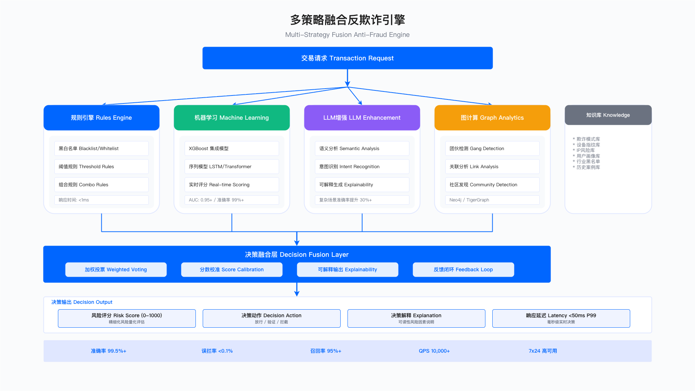
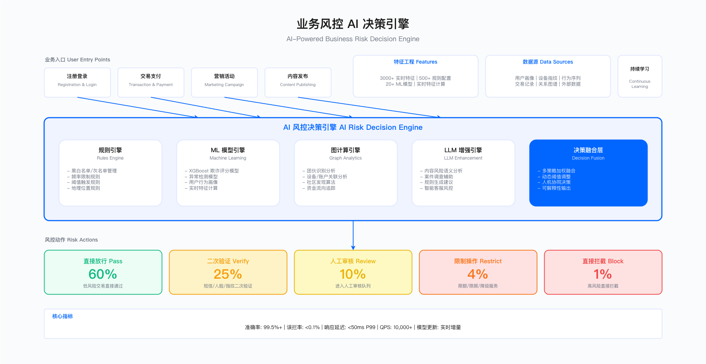

# 17.7　AI for BusinessSec：业务安全的自主等级判断

> 本节定位：把第17章的自主等级主线套到业务安全域（反欺诈、账号安全、营销反作弊、内容审核）上，回答四个问题——这个域的 AI 能力今天演进到了哪一级、为什么大多停在 L2–L3 难以上探 L4、前沿的松动点在哪、选型时该怎么取舍。它不重复讲每个场景怎么落地：交易风控、账号防护、内容审核、反羊毛的完整工作流、评分引擎代码、阈值配置与实战案例，都在 [第13章 业务风控与反欺诈](../../第04部分_安全运营与防御能力/第13章_业务风控与反欺诈/README.md)，本节与之精确互引、不堆叠。
> 目标读者：业务安全负责人、风控架构师、反欺诈工程师、AI 风控产品

本节沿用 17.1 建立的自主等级尺子（[17.1 演进主线与自主等级](./17.1_演进主线与自主等级.md)），逐类风控判断定位其当前等级，并说明为什么业务安全比 SecOps 更"恋栈"低自主等级。

---

## 17.7.1 与第13章的分工：本节讲判断，域章讲落地

业务安全是 AI 在企业里落地最早、也最成熟的一块——早在"大模型"成为热词之前，反欺诈就已经在用梯度提升树做实时评分、用图计算挖团伙。正因为它成熟，写它最容易掉进"把评分引擎从头讲一遍"的坑，而那些内容第13章已经写完了。所以本节严格守住分工：

- 本节（17.7）讲：业务安全这个域的 AI 能力演进到了哪一级、为什么卡在这里、前沿往哪松动、选型怎么权衡。这是随模型能力变化的耐久判断。
- 第13章讲：这些判断如何落进具体的风控工作流——账号防护的分级验证怎么设计（[13.2 账号安全与反撞库](../../第04部分_安全运营与防御能力/第13章_业务风控与反欺诈/13.2_账号安全与反撞库.md)）、交易反欺诈的多策略评分怎么融合（[13.3 交易风控与反欺诈](../../第04部分_安全运营与防御能力/第13章_业务风控与反欺诈/13.3_交易风控与反欺诈.md)）、内容审核的多模态链路怎么串（[13.4 内容安全与反作弊](../../第04部分_安全运营与防御能力/第13章_业务风控与反欺诈/13.4_内容安全与反作弊.md)）、营销反羊毛的团伙识别怎么做（[13.5 营销活动安全（反羊毛）](../../第04部分_安全运营与防御能力/第13章_业务风控与反欺诈/13.5_营销活动安全.md)）、风控决策引擎怎么搭（[13.7 风控决策引擎设计](../../第04部分_安全运营与防御能力/第13章_业务风控与反欺诈/13.7_风控决策引擎设计.md)）。

一句话记法：你想知道"反欺诈 AI 会往哪演进、我该不该现在上 agent"，读本节；你想知道"我这条领券活动的反羊毛规则怎么写、阈值定多少"，读第13章。 两边章节号精确对应，不重复。

---

## 17.7.2 业务安全的自主等级现状：为什么大多停在 L2–L3

把自主等级尺子放到业务安全的四个典型场景上，会看到一个和 SecOps 明显不同的分布：业务安全的主战场今天稳稳落在 L2–L3，向 L4 上探的动力远不如告警研判那么强。这不是技术不够，而是这个域的约束条件天然把它按在低自主等级上。

| 业务安全场景 | 今天合理的自主等级 | 停在这一级的原因 |
| ------------ | ------------------ | ---------------- |
| 交易反欺诈 | L3（AI 自动评分放行/拦截，人管例外与申诉） | 判断链路早已标准化成"多策略融合→分数→分档动作"，无需 agent 自己规划；实时性要求 P99 数十毫秒，容不下 agent 多步推理 |
| 账号安全防护（ATO） | L2–L3（AI 定风险等级，触发分级验证） | 决策是"该不该加一道验证"，本身可逆、成本低；标准阈值就能覆盖大多数，无须逐案自主调查 |
| 营销反作弊（反羊毛） | L3（AI 出团伙判定，自动限量/拦截） | 图关联+规则已能识别绝大多数团伙；对抗虽激烈但模式相对收敛，固化流程够用 |
| 内容审核 | L2–L3（AI 分档，模糊地带交人审） | "越界"边界受法规与语境约束、误删代价高，模糊内容必须留人兜底，不敢全自动 |

业务安全的判断，大多能被"固化流程 + 分数分档"覆盖，这正是 L3 的形态，而不是 L4。 交易反欺诈的"查特征→多策略出分→按分数区间决定放行/验证/人审/拦截"，每一步都是预先设计好的，AI 填的是分数，不是流程——它不需要、也来不及像告警研判 agent 那样"自己决定下一步查什么"。这与 [17.3 AI for SecOps](./17.3_AIforSecOps_AI安全运营.md) 里那条自主调查轨迹形成鲜明对比：SecOps 的告警研判之所以能爬到 L4，正因为它的查法难以固化成死流程；而业务安全的判断恰恰高度可固化，这让它舒服地停在 L3。

三件事把业务安全按在低自主等级上：

其一，实时性预算不允许多步自主推理。 交易风控直挡在用户支付的关键路径上，一次决策的延迟预算常常只有数十毫秒。L4 智能体"观察→推理→再调工具→再推理"的多步循环，动辄数百毫秒到数秒，根本塞不进这个预算。业务安全对 LLM 的用法因此高度克制：LLM 不进实时主链路打分，只做事后增强——对少量已被判为高风险的案例补一段可解释性分析、或给运营一份研判摘要。这条"LLM 事后增强、不参与每笔实时打分"的取舍，是业务安全区别于 SecOps 的核心工程约束（落地形态见 [13.3 交易风控与反欺诈](../../第04部分_安全运营与防御能力/第13章_业务风控与反欺诈/13.3_交易风控与反欺诈.md) 与 [13.7 风控决策引擎设计](../../第04部分_安全运营与防御能力/第13章_业务风控与反欺诈/13.7_风控决策引擎设计.md)）。

其二，误伤代价高，人必须守在模糊地带。 把一个真实用户挡在支付或登录门外、误删一条正常内容，都是直接的业务损失和投诉。这决定了业务安全的自动化必须保守：低风险自动放行、高置信自动拦截，但中间那段模糊地带宁可多送人审也别自动误判。账号防护的"无感→滑块→短信→人脸"分级验证、内容审核的"通过→机审→人审→删除"分档，本质都是把"人管例外"这件事做得更精细，而不是取消它。这天然对应 L2–L3，而非"人只管例外"的 L4。

其三，判断可固化，就没必要为自主性多付钱。 反欺诈的核心判断能被多策略融合稳定覆盖，图团伙识别能被社区发现算法稳定产出。既然一套编排好的流程加分数分档就能又快又准又便宜地跑完，就没有理由请一个又慢又贵的 agent 来自己规划。业务安全里要上 L4，前提是确认更便宜的 L3 兜不住；多数场景的答案是"兜得住"。

"固定几步 + 一个分数阈值"就能可靠完成的风控判断属于 L3，不必为它们付 agent 的自主性溢价。真正值得考虑上探的，是下一节说的那类"固化流程覆盖不住"的场景。

---

## 17.7.3 多策略融合：业务安全 AI 的耐久内核

尽管自主等级停在 L3，业务安全 AI 有一个稳定的内核——多策略融合决策。它由这个域的对抗性质决定，并非某一代技术的产物。


*图 17.12：多策略融合反欺诈检测——规则、图计算、序列模型与 LLM 判别的分工与投票*

四类策略各补一个别人补不上的盲区：

- 规则引擎：最快（亚毫秒级）、最可解释、运营能即时增删。它管的是已知的、边界清晰的攻击手法——新设备大额、高速交易、位置跳跃这类。缺点是被针对后易绕过，且只覆盖写进规则的模式。
- ML 模型：泛化能力强，能识别规则表之外的异常特征组合，对变种攻击有效。缺点是对全新攻击模式响应滞后，且会随黑产对抗发生特征漂移。
- 图分析：唯一能看见群体视角的策略。羊毛党、盗卡团伙的本质是组织化套利——单个账号孤立看完全正常（实名认证、历史清白），但放进关联网络才暴露"同一设备关联数百账号、注册 IP 与支付方式高度重叠"的团伙特征。这种"单点正常、群体异常"，是任何单账号维度的 ML 都发现不了的，只有图能连点成网。缺点是计算代价高、有冷启动问题（新账号没有关联数据）。
- LLM 语义：理解力最强，能读懂"字面无害、意图违规"的隐性内容——内容审核里的谐音、反讽、图文夹带，反欺诈里高风险案例的可解释性生成。缺点是延迟与成本最高，因此只做事后增强，绝不进实时主链路。

把这四类叠起来的逻辑很清楚：用便宜手段先过滤大多数，把昂贵的手段留给便宜手段拿不准的地带。 规则先拦已知，ML 补变种，图揭团伙，LLM 兜住语义模糊的少数——这正是 17.2 讲的成本/延迟分层思想在业务安全域的具体样子（分层架构见 [17.2 Agentic 安全智能体架构](./17.2_Agentic安全智能体架构.md)，融合引擎的工程实现见 [13.7 风控决策引擎设计](../../第04部分_安全运营与防御能力/第13章_业务风控与反欺诈/13.7_风控决策引擎设计.md)）。


*图 17.13：业务风险决策引擎——多源信号汇聚、策略编排与分级处置的决策链路*

图注：业务风险决策引擎的多策略融合结构，从数据采集、特征工程、模型决策到分档响应——规则/ML/图各出一分再加权融合，LLM 挂在融合之后只处理高风险案例。这张图的骨架跨范式稳定，具体权重与阈值属于可调参数，其设计与调优详见 [13.7 风控决策引擎设计](../../第04部分_安全运营与防御能力/第13章_业务风控与反欺诈/13.7_风控决策引擎设计.md)。

融合里两个耐久的工程判断，值得单独点出：

- 权重与阈值是"体验-安全"的旋钮，不是常量。 融合权重（规则:ML:图的信任度排序）、风险分档阈值（放行/验证/人审/拦截的边界）都不是抄来的定值，而是随业务形态和数据分布调的旋钮——低客单价高频交易和高客单价低频交易的最优配置差异显著。阈值往哪挪，直接决定误伤与漏放的此消彼长。照搬参考值上线，几乎注定在真实数据面前碰壁。
- 不同场景的融合口径不同。 风控场景用"多维加权"（让各维度互相平衡），内容审核却用"取最大"（任一模态违规即处置，不许干净模态稀释违规模态），反羊毛还要加"单维度一票放大"（群控/团伙这类强信号一旦命中，不该被其它维度低分和稀泥）。同是融合，口径由场景的风险语义决定——这类取舍的具体实现分别落在 [13.3](../../第04部分_安全运营与防御能力/第13章_业务风控与反欺诈/13.3_交易风控与反欺诈.md)、[13.4](../../第04部分_安全运营与防御能力/第13章_业务风控与反欺诈/13.4_内容安全与反作弊.md)、[13.5](../../第04部分_安全运营与防御能力/第13章_业务风控与反欺诈/13.5_营销活动安全.md)。

下面三份工件把这两个判断落成可执行的形态：分数怎么交给决策引擎、规则与模型怎么分工、策略改动上线前怎么验。

### 模型输出契约：决策引擎读到的到底是什么

多策略融合要落地，第一件要定死的事是模型给决策引擎的那份输出长什么样。风控里模型和决策引擎通常由两个团队维护，中间只有这一份契约。契约里最容易缺的不是分数，是模型不可用时的表达方式——很多实现把降级信息放在 HTTP 状态码或日志里，而决策引擎读的是响应体，于是模型挂掉之后，决策引擎拿到一个默认值 0 分，把当天所有交易当成低风险放行。

```json
{
  "$schema": "https://json-schema.org/draft/2020-12/schema",
  "title": "RiskScoreResponse",
  "description": "风控模型返回给决策引擎的单笔评分结果",
  "type": "object",
  "additionalProperties": false,
  "required": ["request_id", "event_id", "scored_at", "status", "score",
               "score_version", "feature_pipeline_version"],
  "properties": {
    "request_id": {"type": "string"},
    "event_id": {"type": "string"},
    "scored_at": {"type": "string", "format": "date-time"},
    "latency_ms": {"type": "integer", "minimum": 0},
    "status": {
      "type": "string",
      "description": "决策引擎必须先读它再读 score。降级标识放在响应体里，不能只放在状态码或日志里",
      "enum": ["ok", "degraded", "unavailable"]
    },
    "score": {
      "type": ["number", "null"],
      "minimum": 0,
      "maximum": 1000,
      "description": "分数缺失时必须是 null。填 0 会被当成低风险放行，填 1000 会全量误拦，两个默认值都错"
    },
    "score_version": {
      "type": "string",
      "description": "模型标识加语义化版本。分档阈值与它绑定，换版本必须重新定档",
      "pattern": "^[a-z0-9_]+@[0-9]+\\.[0-9]+\\.[0-9]+$"
    },
    "feature_pipeline_version": {
      "type": "string",
      "description": "特征口径版本。模型没变而特征口径变了，出来的就是另一个打分器，只记模型版本追不到这类事故"
    },
    "hit_features": {
      "type": "array",
      "description": "命中特征按贡献度降序，只留前若干个；全量特征快照另存，用 feature_snapshot_ref 关联",
      "maxItems": 10,
      "items": {
        "type": "object",
        "additionalProperties": false,
        "required": ["name", "value_bucket", "contribution", "direction"],
        "properties": {
          "name": {"type": "string"},
          "value_bucket": {
            "type": "string",
            "description": "分桶后的取值。不回传原始值，避免风控响应本身成为一条数据外泄通道"
          },
          "contribution": {"type": "number"},
          "direction": {"type": "string", "enum": ["risk_up", "risk_down"]},
          "freshness_seconds": {"type": ["integer", "null"], "minimum": 0}
        }
      }
    },
    "explanation": {
      "type": "object",
      "additionalProperties": false,
      "required": ["reason_codes", "source"],
      "properties": {
        "reason_codes": {
          "type": "array",
          "description": "面向运营与申诉的稳定编码。用编码而非自由文本，申诉工单才能按原因聚合",
          "minItems": 1,
          "maxItems": 5,
          "items": {"type": "string", "pattern": "^RC-[0-9]{3}$"}
        },
        "source": {
          "type": "string",
          "description": "可解释性从哪来。事后由 LLM 写的说明与模型实际依据是两回事，必须分开标",
          "enum": ["model_attribution", "surrogate_model", "rule_template",
                   "llm_narrative", "none"]
        },
        "narrative": {"type": ["string", "null"], "maxLength": 500},
        "narrative_is_advisory": {"type": "boolean", "default": true}
      }
    },
    "degrade": {
      "type": ["object", "null"],
      "description": "status 非 ok 时必填，说明为什么降级、现在这个分数从哪来",
      "additionalProperties": false,
      "required": ["reason", "fallback_source", "since"],
      "properties": {
        "reason": {
          "type": "string",
          "enum": ["model_timeout", "model_unloaded", "feature_store_miss",
                   "circuit_open", "drift_guard_tripped", "version_pin_mismatch"]
        },
        "fallback_source": {
          "type": "string",
          "enum": ["previous_model_version", "rule_only", "none"]
        },
        "feature_completeness": {"type": "number", "minimum": 0, "maximum": 1},
        "since": {"type": "string", "format": "date-time"}
      }
    },
    "feature_snapshot_ref": {"type": ["string", "null"]},
    "hard_rule_hits": {"type": "array", "items": {"type": "string"}}
  },
  "allOf": [
    {
      "if": {"properties": {"status": {"const": "ok"}}, "required": ["status"]},
      "then": {
        "required": ["hit_features", "explanation"],
        "properties": {"score": {"type": "number"}, "degrade": {"type": "null"}}
      }
    },
    {
      "if": {"properties": {"status": {"const": "unavailable"}}, "required": ["status"]},
      "then": {"required": ["degrade"], "properties": {"score": {"type": "null"}}}
    },
    {
      "if": {"properties": {"status": {"const": "degraded"}}, "required": ["status"]},
      "then": {"required": ["degrade"]}
    }
  ]
}
```

`status` 与 `score: null` 这一对组合是这份契约的核心。 让 `score` 允许为 `null`、并强制决策引擎先读 `status`，实际上是拒绝提供任何"安全的默认分数"。这一点常被认为过于教条，因为给一个默认值能让下游少写一个分支。但默认值的两个方向都通不过检验：默认 0 分意味着模型故障期间所有交易按低风险放行，故障半小时就是半小时的敞口；默认 1000 分意味着全量拦截，业务在几分钟内会要求把风控整个摘掉，之后很长时间不敢再开。把这两条路都堵死，代价是决策引擎必须显式实现降级分支，也就是下一份配置里的 `fallback_profile`。

`explanation.source` 把可解释性的来源标出来，是这份 schema 里最容易被认为多余的字段。 它区分的是"模型实际据以打分的依据"和"事后生成的一段说明"。前者来自模型自身的归因，后者可能是一个代理模型的近似，也可能是把命中特征丢给 LLM 让它写一段通顺的话。三者在运营界面上看起来一样，但只有第一种能作为申诉处理和监管问询的依据。不标来源的后果是：几个月后有人拿一段 LLM 写的说明去回复客户投诉，而那段话与模型的真实依据无关。`narrative_is_advisory` 默认为真，是同一件事的兜底。

`hit_features.value_bucket` 只回传分桶值有实实在在的代价。 排查一笔具体的误拦时，运营看到的是"近 7 天设备关联账号数：高"，而不是"设备关联账号数：43"，定位效率明显下降。这里选择分桶，是因为风控评分接口往往被多个业务系统调用，回传原始特征值等于把用户画像的一部分沿调用链广播出去。补偿手段是 `feature_snapshot_ref`——全量特征存在受控的快照库里，排查时凭工单去查，这条路径有审计。

照抄这份 schema 最容易改错的是 `allOf` 里第一条的 `"degrade": {"type": "null"}`。 它要求 `status` 为 `ok` 时 `degrade` 必须为空。省掉这一条，系统就能返回 `status: ok` 同时带着一个非空的 `degrade` 对象，而这种自相矛盾的响应在真实故障中很常见——上游超时后重试成功，代码把 `status` 改回了 `ok`，却忘了清 `degrade`。决策引擎此时按 `ok` 分支走，用的却是降级期间的兜底分数。另一处是 `score_version` 的 `pattern` 与 `feature_pipeline_version` 必须成对使用：只 pin 模型版本、不管特征口径版本，是这类系统里最难排查的一类线上事故，因为模型文件的哈希没变，任何版本比对都发现不了。

### 规则与模型的混合决策配置

上面的分数进决策引擎之后，规则与模型如何分工要写成配置而非代码。这份配置要回答四件事：哪些规则模型无权推翻、分数各档对应什么动作、新模型怎么灰度、以及分数分布异常时自动退到哪里。

```yaml
# risk_decision.yaml —— 规则与模型的混合决策配置（交易风控场景）
# 执行顺序固定：硬规则 → 模型分档 → 降级兜底。前一段出结果就不进下一段。
version: 7
scene: payment_txn
autonomy_level: L3                 # 固定流程加分数分档，人管例外与申诉
decision_order: [hard_rules, model_bands, fallback_profile]

# 硬规则：模型分数无权推翻。命中即出结果，不进模型分档。
hard_rules:
  deny:
    - id: HR-001
      name: 命中监管名单
      expr: "party.sanction_hit == true"
      action: reject
      overridable_by_model: false
      owner: compliance
      change_control: dual_approval      # 合规与风控双签，风控单方改不动
    - id: HR-002
      name: 设备已确认为群控农场
      expr: "device.farm_confirmed == true"
      action: reject
      overridable_by_model: false
      evidence_ttl_days: 30              # 确认结论会过期，过期后回到模型判断
  allow:
    - id: HR-020
      name: 白名单商户的小额代扣
      expr: "merchant.id in trusted_merchants and amount <= 200"
      action: pass
      overridable_by_model: false
      review_days: 30                    # 放行类硬规则必须定期复审
      max_daily_hits: 50000              # 超量说明规则被人利用，触发告警并自动失效

model_bands:
  score_field: score
  score_version_pin: txn_fraud@3.4.1     # 分档阈值与模型版本绑定
  boundary: left_closed_right_open
  bands:
    - {name: low, range: [0, 300], action: pass}
    - {name: medium, range: [300, 620], action: step_up_verify,
       params: {methods: [sms, biometric], max_attempts: 3}}
    - {name: high, range: [620, 850], action: manual_review,
       params: {queue: txn_review, sla_minutes: 15, on_sla_breach: step_up_verify}}
    - {name: extreme, range: [850, 1000], action: reject,
       params: {appeal_channel: enabled, appeal_sla_hours: 24}}
  human_review_capacity:
    daily_max: 4000
    on_overflow: downgrade_to_step_up    # 人审挡量超产能时下调档位，不是直接拦

rollout:
  candidate: txn_fraud@3.5.0
  bucket_by: user_id_hash                # 按用户散列分桶，不按请求随机
  stages:
    - {name: shadow, traffic: 1.0, effective: false, min_hours: 72}
    - {name: canary_1, traffic: 0.01, effective: true, min_hours: 24}
    - {name: canary_10, traffic: 0.10, effective: true, min_hours: 72}
    - {name: full, traffic: 1.0, effective: true}
  guard_metrics:
    - {name: step_up_rate, max_relative_increase: 0.20}
    - {name: reject_rate, max_relative_increase: 0.15}
    - {name: manual_review_volume, max_relative_increase: 0.30}
    - {name: fraud_loss_rate_t7, max_relative_increase: 0.05, lag_days: 7}
  promote_requires: [no_guard_breach, fraud_loss_rate_t7_observed]
  on_guard_breach: [freeze_rollout, pin_previous_version, page_oncall]

drift_guard:
  windows: {short: 15m, baseline: 28d}
  signals:
    - {id: DG-1, metric: score_psi, warn: 0.10, trip: 0.25}
    - {id: DG-2, metric: feature_null_rate, trip_absolute: 0.05}
    - {id: DG-3, metric: band_share_extreme, trip_relative: 3.0}
    - {id: DG-4, metric: score_p50_shift, trip_absolute: 80}
  trip_action:
    order: [freeze_rollout, pin_previous_version, enter_fallback, page_oncall]
    min_dwell_minutes: 30                # 防止指标抖动导致来回切换
    require_human_to_resume: true        # 自动退，人工才能恢复

fallback_profile:
  trigger: "score == null or status != 'ok'"
  bands_disabled: true
  reject_only_on_hard_rules: true        # 没有模型分就不做自动拒绝
  step_up_above_amount: 500              # 用金额这类稳定维度兜底
  pass_below_amount: 100
  manual_review_above_amount: 20000
  max_duration_minutes: 60               # 超过一小时仍未恢复，升级为业务决策而非技术兜底
```

三处设计选择带着明确的代价。

`hard_rules.allow` 这一段的存在本身就是取舍。 放行类硬规则是模型无权干预的通道，它同时也是黑产最想找到的入口——一旦某个白名单商户被攻破或被收买，这条规则就是一条自动放行的高速路。这里保留它，是因为大额稳定商户的代扣被模型误拦的业务代价确实高；控制手段是 `review_days` 的定期复审加 `max_daily_hits` 的用量上限，命中量突增时规则自动失效而非继续放行。省掉这两个字段是最常见的改法，省掉之后这条规则会安静地存在好几年。

`model_bands.human_review_capacity.on_overflow: downgrade_to_step_up` 承认了一件事：人审产能是一个硬约束，而不是可以靠排队消化的软约束。 高风险档的量一旦超过人审日产能，多出来的部分必须有个去处。选择下调到加验证而非直接拒绝，是因为误伤代价不对称——把一个正常用户挡在支付门外的代价，高于让他多做一次短信验证。代价是黑产可以靠制造挡量来把自己冲进加验证档，所以这个开关必须配合 `manual_review_volume` 的灰度守护指标一起看：挡量异常增长本身就是一个攻击信号。

`rollout.guard_metrics` 里的 `fraud_loss_rate_t7` 带 7 天滞后，这让灰度周期没法压缩。 拦截率、加验率、人审量当天就能看到，欺诈损失率要等拒付与举报回流，通常是几天。只看当天指标就推全量，会推上去一个"拦得少、体验好、漏放翻倍"的模型，而问题在一周后才浮现。`promote_requires` 里显式要求 `fraud_loss_rate_t7_observed`，代价是一次模型上线周期至少两周。压缩这个周期的常见做法是用当天的代理指标替代，那等于把灰度的核心作用去掉了。

照抄这份配置最容易改错的是 `rollout.bucket_by: user_id_hash`。 按请求随机分流实现起来更简单，流量比例也更精确，但同一个用户在几分钟内会一会儿走新模型、一会儿走旧模型，表现是同样的操作有时要验证有时不用。这类投诉无法复现，排查时两边日志都显示"策略正确执行"。另一处是 `drift_guard.trip_action` 的 `require_human_to_resume: true`——自动退回、人工恢复是刻意的不对称。写成自动恢复看起来更省事，实际后果是指标在阈值附近抖动时，系统会在正常模式和兜底模式之间反复横跳，而这两种模式对用户的表现完全不同。`min_dwell_minutes` 只能减轻抖动，堵不住来回切换本身。

### 策略变更的离线回测：误拦与漏放分开算

阈值调整、模型换版、档位重划，上线前都要用历史标注数据回测一遍。回测脚本最关键的设计不在统计口径，在于坚持把两类错误分开报。误拦的代价是投诉、流失和客服工单，漏放的代价是资损，两者单位不同，合成一个指标等于替业务先做了一次没有依据的换算，而这个换算会直接决定阈值往哪边挪。

```python
"""strategy_backtest.py —— 风控策略变更的离线回测。

用法: python3 strategy_backtest.py events.jsonl
每行一个历史事件，含 score / hard_rule_hit / amount / label（1 为欺诈，0 为正常）。
标签成熟期未到的事件不进回测集：拒付与举报要几天才回流，把未成熟的正样本当成负样本，会把
一笔漏放算成一次正确放行，整体结论偏乐观。
误拦与漏放分开报，不合成单一指标——前者的代价是投诉与流失，后者是资损，单位不同。
"""
import json
import sys
from collections import Counter

# 加验证与人审都不等于拦住：坏人有一定比例能通过短信或人脸、人审也会放错，两个比例用历史样本估
STEPUP_BYPASS_RATE = 0.35
REVIEW_MISS_RATE = 0.10
# 每档写上界，落在第一个比它大的上界里；末档上界取无穷，保证任何分数都有归属
BASELINE = [(300, "pass"), (620, "step_up"), (850, "manual_review"), (float("inf"), "reject")]
CANDIDATE = [(260, "pass"), (560, "step_up"), (820, "manual_review"), (float("inf"), "reject")]

def decide(event, bands):
    if event.get("hard_rule_hit"):
        return "reject"
    if event.get("score") is None:
        return "step_up"      # 模型降级时的兜底动作，与 risk_decision.yaml 保持一致
    for upper, action in bands:
        if event["score"] < upper:
            return action

def backtest(events, bands):
    m = Counter()
    for event in events:
        action = decide(event, bands)
        amount = float(event.get("amount", 0.0))
        if event["label"] == 1:
            if action == "pass":
                m["漏放笔数"] += 1
                m["漏放金额"] += amount
            elif action == "step_up":
                m["坏人加验笔数"] += 1
                m["漏放金额"] += amount * STEPUP_BYPASS_RATE
            elif action == "manual_review":
                m["坏人送审笔数"] += 1
                m["漏放金额"] += amount * REVIEW_MISS_RATE
        elif action == "reject":
            m["误拦笔数"] += 1
            m["误拦金额"] += amount
        elif action == "step_up":
            m["好人加验笔数"] += 1
        if action == "manual_review":
            m["人审笔数"] += 1
    m["漏放等效笔数"] = (m["漏放笔数"] + m["坏人加验笔数"] * STEPUP_BYPASS_RATE
                         + m["坏人送审笔数"] * REVIEW_MISS_RATE)
    return m

def show(name, m, good_total, bad_total):
    print(f"[{name}] 误拦（好人被拒）{m['误拦笔数']:.0f} 笔 / {m['误拦金额']:.0f} 元，"
          f"占正常样本 {m['误拦笔数'] / good_total:.4%}")
    print(f"  好人被加验 {m['好人加验笔数']:.0f} 笔，人审挡量 {m['人审笔数']:.0f} 笔")
    print(f"  漏放（坏人放过）直接放行 {m['漏放笔数']:.0f} 笔，"
          f"计入加验与人审逃逸后等效 {m['漏放等效笔数']:.1f} 笔 / {m['漏放金额']:.0f} 元，"
          f"占欺诈样本 {m['漏放等效笔数'] / bad_total:.4%}")

def main(argv):
    if len(argv) != 2:
        print(__doc__)
        return 2
    events = [json.loads(x) for x in open(argv[1], encoding="utf-8") if x.strip()]
    good = sum(1 for e in events if e["label"] == 0) or 1
    bad = sum(1 for e in events if e["label"] == 1) or 1
    base, cand = backtest(events, BASELINE), backtest(events, CANDIDATE)
    show("基线", base, good, bad)
    show("候选", cand, good, bad)
    print(f"[变化] 误拦笔数 {cand['误拦笔数'] - base['误拦笔数']:+.0f}，"
          f"漏放等效笔数 {cand['漏放等效笔数'] - base['漏放等效笔数']:+.1f}，"
          f"人审挡量 {cand['人审笔数'] - base['人审笔数']:+.0f}")
    print("  两项一升一降时不要自行加权，交由业务按各自代价定夺")
    return 0

if __name__ == "__main__":
    sys.exit(main(sys.argv))
```

`STEPUP_BYPASS_RATE` 是这段脚本里唯一一个不能拍脑袋的常数。 把加验证当成拦住（也就是把这个值设成 0），任何把大量流量从拒绝档挪到加验证档的策略都会同时表现出误拦下降和漏放下降，看起来是一次纯赚的调整。真实情况是坏人有相当比例能通过短信或人脸验证——盗号场景下短信可能就在攻击者手里。这个比例要用历史加验样本的实际通过后欺诈率去估，而且要按验证方式分开估，短信和人脸差别很大。同理 `REVIEW_MISS_RATE` 承认人审也会放错，把人审当成 100% 准确会让任何增加人审量的策略在回测里显得完美，而人审产能的账在 `risk_decision.yaml` 里已经是个硬约束。

脚本最后那句"不要自行加权"是刻意留在输出里的。 回测跑完通常是误拦降了、漏放升了，或者反过来，这时最自然的动作是给两者配个权重算出一个总分来比较。这个权重是一次业务决策：一笔误拦损失多少长期价值、一笔漏放损失多少资金，只有业务方能定，而且不同商品线的答案不一样。风控工程师替业务定这个权重，等于用一个未经确认的换算率决定了策略往哪边偏。把两个数并排放着交出去，比给一个精确的总分更有用。

照抄这段代码最容易改错的是 `decide` 里 `score is None` 那个分支。 它对应模型降级的情况，返回的动作必须与 `risk_decision.yaml` 的 `fallback_profile` 一致。两处不一致时，回测里降级样本按加验证算、线上按放行算，而降级样本在历史数据里往往集中在某几个故障时段，占比不高但欺诈浓度很高——这批样本算错，回测结论会在最关键的那段时间上失真。另一处是回测集的构成：`label` 必须来自成熟期已过的标注，用当天数据回测会把大量尚未回流的欺诈标成正常，误拦看起来居高不下，漏放看起来接近零。

---

## 17.7.4 前沿松动点：业务安全向 L4 上探的几处迹象

业务安全今天停在 L3，但有几处正在松动——松动的是某些原本"固化流程覆盖不住"的角落，它们开始出现 L3 向 L4 试探的价值，而非整个域集体上探 L4。判断这些松动点，比预测"哪年全面 agent 化"更实用。

松动点一：对抗调查与团伙溯源。 反欺诈的实时打分会长期停在 L3（实时性预算锁死了它），但事后的团伙溯源和黑产手法调查不受毫秒级约束——它更像 SecOps 的告警研判：面对一个可疑团伙，需要"查这批账号的共性→顺着设备/资金链拓展→根据发现调整方向→形成处置建议"这样一条难以预先固化的调查路径。这正是 L4 自主调查的用武之地。业务安全的 L4 机会，大概率先出现在这类离线、可逆、需要多步自主推理的调查场景，而非实时拦截主链路。

松动点二：语义对抗的持续升级。 内容审核的对手在把对抗做得越来越"语义化"——谐音、反讽、隐喻、图文夹带，都是让"字面无害、意图违规"的内容躲过机器。随着推理模型对隐性语义的理解力提升，LLM 在内容审核里的角色可能从"少数模糊案例的事后增强"向"更常态的语义判官"移动。但要提醒：这仍是 L2–L3 内部的能力增强（AI 判得更准），不等于自动化程度提高——误删代价高这条约束没变，模糊地带该留人审还得留。

松动点三：黑产自己在用 agent。 攻防是同步演进的。当黑产开始用 AI 批量生成钓鱼话术、用自动化 agent 编排养号-薅羊毛-套现的全链路，防守方被迫也要用更强的 AI 来对抗。这是业务安全上探更高自主等级最现实的推力——不是因为防守方想要，而是因为对手逼你要。

怎么识别下一个真正的拐点？ 用 [17.10 演进与展望](./17.10_演进与展望.md) 给出的那套信号清单去量：工具调用可靠性、长程任务成功率、自主纠错能力。具体到业务安全，落到一个可操作的自问——当一个 agent 能可靠地自主完成一次团伙溯源调查（自己规划查法、自己纠错、给出可复核的处置建议）而无须人逐步引导时，业务安全的 L4 拐点就到了。 在那之前，实时反欺诈仍将稳稳停在多策略融合的 L3。

> 业务安全域今天真正大规模落地的仍是 L2–L3 的多策略融合，agent 化尚处早期探索。上文的"松动点"是趋势判断而非已成熟的产品形态，其成立与否取决于推理模型的自主调查能力是否跨过可靠性阈值（见 [17.1](./17.1_演进主线与自主等级.md) 对前沿拐点的论述），不是已交付的能力。

---

## 17.7.5 选型取舍：业务安全 AI 落地的四个判断题

给业务安全上 AI，取舍集中在四个问题上。它们是耐久的判断框架，不随具体工具变化；每个问题的落地答案则在第13章对应小节。

判断题一：实时链路上，用规则/ML 还是 LLM？ 答案几乎总是前者。实时打分的延迟预算容不下 LLM，LLM 只在事后增强环节出现。凡是想把 LLM 塞进每笔请求实时打分的方案，先量一量它对 P99 延迟的影响——这条红线在业务安全里几乎不可逾越。

判断题二：这个场景值不值得上图分析？ 图能揭示团伙，但代价高、有冷启动。判据是危害是否主要来自"群体协同"：反羊毛、盗卡团伙高度依赖图（散点必须连成网才看得见团伙）；而单点欺诈、单账号异常，图的边际价值有限。别为不需要群体视角的场景背图计算的成本（图分析的取舍见 [13.5 营销活动安全（反羊毛）](../../第04部分_安全运营与防御能力/第13章_业务风控与反欺诈/13.5_营销活动安全.md)）。

判断题三：自动化档位切在哪、给人留多大兜底？ 这是"体验-安全"旋钮的核心。判据是误伤代价与可逆性：账号防护误伤可逆（用户多验证一步），可以激进些；内容误删、支付误拦代价高，中间模糊地带必须留足人审。切档不是一次定死，要与人审产能联动——人审挡量过大扛不住、过小漏放升高（分级设计见 [13.2 账号安全与反撞库](../../第04部分_安全运营与防御能力/第13章_业务风控与反欺诈/13.2_账号安全与反撞库.md) 与 [13.4 内容安全与反作弊](../../第04部分_安全运营与防御能力/第13章_业务风控与反欺诈/13.4_内容安全与反作弊.md)）。

判断题四：怎么应对模型漂移与黑产对抗？ 业务安全是持续对抗，黑产会分析被拦样本来绕过检测，模型特征分布会随时间偏移。判据是建立漂移监控与重训机制：用特征分布偏移指标（如 PSI）盯住"模型悄悄失效"的信号，一旦抬头就该重训。这是业务安全区别于一次性上线场景的关键——它需要一套持续迭代的运营机制，具体的监控指标与迭代节奏落在 [13.7 风控决策引擎设计](../../第04部分_安全运营与防御能力/第13章_业务风控与反欺诈/13.7_风控决策引擎设计.md) 与 [13.8 业务安全实战案例](../../第04部分_安全运营与防御能力/第13章_业务风控与反欺诈/13.8_业务安全实战案例.md)。

---

## 17.7.6 一个真实锚点：蚂蚁集团的 AI + 安全一体化

抽象判断需要一个真实参照来印证。蚂蚁集团是国内最早把"AI + 安全"做成一体化能力矩阵的企业，其跨境支付风控实践在 2024 年世界互联网大会获评精品案例，正好用来印证本节的几个抽象判断在真实产品里的样子。

它印证的第一件事：能力中台化，跨场景复用，而非烟囱式重建。 蚂蚁的 AI + 安全覆盖反欺诈、反洗钱、反赌博、企业风控、反黄牛、内容安全等多个场景，共享一套底层能力矩阵。这正是本章反复强调的"设备指纹、行为采集、特征工程、模型决策沉淀为公共层，各业务线只在接入层暴露差异"——各线各建一套是积累技术债最快的方式。

它印证的第二件事：实时性不牺牲体验。 其跨境支付风控做到 10 秒完成商户开户入驻、90% 订单秒级审核通过、欺诈风险率控制在万分之一以下、笔均运营成本显著降低。这些数字来自厂商公开案例，印证的是"多策略融合 + 分档决策"在真实规模下能做到又快又准——而支撑它的正是本节讲的耐久内核，不是某个新范式。

它印证的第三件事：AI 自身要被治理。 蚂蚁的"倚天鉴"AI 安全评估方案以"蓝军"测评为核心，覆盖鲁棒性、可解释性、公平性、框架安全、代码安全——这提示业务安全用 AI 时，AI 模型本身的鲁棒性与公平性也是攻击面与合规点。这条线的防御深度归 [第18章 Security for AI](../第18章_AI系统安全/README.md)，本节只指出其存在。

> 以上数据与方案来自蚂蚁集团公开报道。参考来源：[蚂蚁集团安全风控案例入选世界互联网大会](https://finance.sina.com.cn/tech/roll/2024-11-20/doc-incwspwu2233013.shtml)、[蚂蚁数科国内市场份额领先](https://www.cfbond.com/2025/05/15/wap_991087373.html)。

---

## 17.7.7 威胁演进方向：值得盯住的几条趋势

业务安全的自主等级往哪走，很大程度被对手拖着走。下面几条威胁趋势值得盯住——重点不是记住某个百分比，而是理解它对"AI 该怎么演进"的指向。

| 威胁趋势 | 指向的 AI 能力演进 | 来源 |
| -------- | ------------------ | ---- |
| 深伪换脸攻击激增，冲击生物识别验证 | 活体检测、行为生物识别从静态特征转向动态行为 | iProov Threat Intelligence Report 2023 |
| AI 生成钓鱼话术，占商业欺诈邮件相当比例 | 语义理解侧的对抗升级，LLM 在内容/话术审核中的角色加重 | VIPRE Q2 2024 Email Threat Report |
| 账号接管（ATO）持续增长为主要攻击向量 | 多维行为建模、分级验证成为账号安全标配 | 行业报告 |
| 有组织羊毛党工具化、平台化、产业化 | 图神经网络团伙识别成为反作弊的必选项 | 风控行业洞察 |

把这张表和 17.7.4 的松动点对读，一条线就清楚了：对手在把攻击"AI 化、语义化、组织化"，防守方被迫在语义理解与图关联两个方向持续加码，并在离线调查场景开始向 L4 试探。 具体数字会更新，但方向性趋势稳定——业务安全的 AI 演进，本质是一场跟着对手节奏走的持续对抗。

---

## 本节小结

- 分工：本节讲业务安全域的 AI 演进判断，四个场景的落地工作流与实现全部交 [第13章](../../第04部分_安全运营与防御能力/第13章_业务风控与反欺诈/README.md)，章节号精确互引、不重复。
- 现状：业务安全的主战场稳在 L2–L3——实时性预算、误伤代价、判断可固化这三件事，天然把它按在低自主等级上；一句话就是"能用 L3 就别为自主性多付钱"。
- 内核：多策略融合（规则/ML/图/LLM 各补盲区，便宜手段先过滤、昂贵手段兜模糊）是跨范式的耐久结构；LLM 只做事后增强、不进实时打分是核心工程约束。
- 前沿：向 L4 的松动大概率先出现在离线团伙溯源调查这类难以固化的场景，而非实时拦截；语义对抗与黑产 agent 化是最现实的推力。
- 选型：四个耐久判断题——实时链路别塞 LLM、按"群体协同"决定要不要图、按"误伤代价与可逆性"切自动化档位、建漂移监控应对持续对抗。

---

## 导航

[← 上一节：17.6 AI for DataSec](./17.6_AIforDataSec_AI数据安全.md) | [返回章节目录](./README.md) | [下一节：17.8 编码代理安全落地 →](./17.8_编码代理安全落地.md)

---

© 2025-2026 AISecOps Project. Licensed under CC BY-NC-SA 4.0
