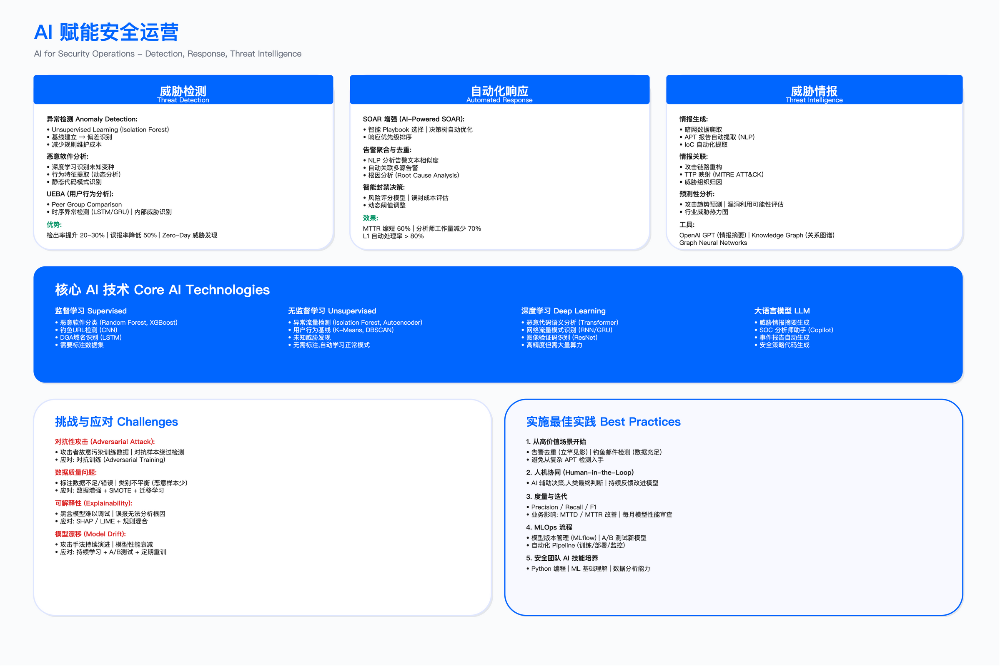

# 第17章　AI驱动网络安全

> English Title: AI for Cybersecurity: From RAG to Agentic — Autonomy Levels and Practice
> 目标读者：安全负责人、安全架构师、SOC / SecOps、DevSecOps、数据安全团队

---

## 执行摘要 | Executive Summary

AI for Cybersecurity 的能力随大语言模型与 Agent 运行时的进步持续演进，防御方能做到的事逐年变化。本章以一条更耐久的主线贯穿——安全能力沿"自主等级"阶梯向上生长。

本章用一套贯穿全章的骨架来讲这件事：自主等级 L0–L5。从纯人工规则（L0–L1），到 AI 提示、人来决策（L2 检索增强 / Copilot），到 AI 执行、人来监督（L3 工作流编排），再到 AI 自主、人管例外（L4 Agentic），直至罕见而审慎的完全自主（L5）。这条阶梯既解释了"AI 做安全"这些年怎么演进过来，也回答了读者最关心的问题：我的某一类告警，今天该停在哪一级？

> 本章是 AISecOps（AI-Security-Operations）方法论的组成部分，聚焦 AI for Cybersecurity（用 AI 做安全）。关于 Security for AI（AI 系统自身的攻防与防御设计），请参阅 [第18章](../../第06部分_AI驱动的安全创新/第18章_AI系统安全/README.md)。本章只讲"落地智能体时必须消费哪些安全控制"，攻防深度指向第18章，两章边界清晰、互不重复。



*图 17.14：AI 安全运营能力全景——AI 在检测、研判、响应、治理各环节的介入点；读者要看出这些能力随自主等级逐级解锁，并非同时到位，演进因果见 17.1*

### 一条主线

本章的骨架是自主等级、能力维度（规划 / 记忆 / 工具 / 人在回路 / 权限 / 成本 / 评估）、以及把能力从一级推向下一级的演进因果机制。具名的框架、运行时、模型（Strands、ADK、Claude Agent SDK、OpenClaw、Hermes Agent 等）均为截至 2026.7 的代表实现，与骨架相互独立。

凡是主张上智能体的地方，本章都会交代"为什么不用更便宜的 ML 或规则"。绝大多数告警不该、也不需要走到 L4。

### AI 技术在各安全域的应用映射

下表把 AI 能力与前序章节（第 2–13 章）的安全域对应起来，帮助读者按需定位。本章各 AI-for-X 节只讲"该域 AI 能力的演进判断、当前自主等级、前沿在哪、选型取舍"，具体如何嵌入该域工作流的细节交由对应域章展开。

| 安全域（章节）    | AI 技术应用                          | 当前主流自主等级        | 交叉引用域章 |
| ----------------- | ------------------------------------ | ----------------------- | ------------ |
| 第2章：GRC 治理 | 合规映射、风险量化、政策解读         | L2–L3（人决策为主）     | 第2章      |
| 第4章：安全架构 | 威胁建模辅助、架构风险评估           | L2                      | 第4章      |
| 第5章：云安全   | 配置漂移识别、云上威胁关联           | L2–L3                   | 第5章      |
| 第6章：应用安全 | 代码审查、SAST/DAST 降噪、SCA 优先级 | L2–L3                   | 第6章      |
| 第8章：数据安全 | 数据分类分级、敏感发现、访问异常     | L2–L3                   | 第8章      |
| 第11章：SOC     | 告警研判、自主调查、SOAR 编排、UEBA  | L2–L4（旗舰场景）       | 第11章     |
| 第13章：业务风控与反欺诈 | 反欺诈、账号安全、内容审核           | L2–L3（高不可逆，慎上 L4） | 第13章  |

样例标尺（SecOps ↔ 第11章）：SOAR 自动化的"智能体自主研判范式与自主等级判断"写在 17.3；"SOAR 在 SOC 值班流程与 playbook 里的具体落地"留在第11章。二者精确交叉引用，不重复堆叠。

### 本章结构与阅读顺序

本章按"演进主线 → 智能体架构 → 各安全域判断 → 落地方法论 → 展望 → 案例"组织。旗舰节是 17.3 AI for SecOps，它用一条真实告警的完整自主调查轨迹，把前面的抽象骨架落到可验收的实操上。

```
第一部分：主线与架构（Why & How）
├─ 17.0 执行摘要 —— AI-for-Sec 能力持续演进；引出自主等级骨架
├─ 17.1 演进主线与自主等级 —— 全章唯一标尺
│   ├─ 自主等级 L0–L5：每级的留存形态
│   ├─ 演进因果：三级技术台阶（可靠 function-calling → MCP 工具生态 → reasoning 模型）
│   └─ 前沿拐点：从"检索问答"到"自主调查"
└─ 17.2 Agentic 安全智能体架构 —— 取代旧的集中式平台思路
    ├─ 从集中式平台到智能体：为何集中式在 agentic 时代退场
    ├─ 智能体解剖：规划 / 推理 / 记忆与上下文工程 / 工具（经 MCP）/ 人在回路
    ├─ 工具层与 MCP：安全智能体如何消费 SIEM/EDR/TI/工单
    ├─ 单体 vs 多智能体编排：以及何时不要多智能体
    ├─ 框架选型：按架构轴对比，给决策树
    ├─ 评估与回归：轨迹级 eval、任务成功率、模型升级行为漂移检测
    ├─ 成本与延迟分层：便宜 ML 先过滤，贵智能体只研判高价值告警
    ├─ 生产工程：可观测性 / 分级 gating / 故障降级
    └─ 落地必须消费的安全控制（攻防深度见第18章）

第二部分：各安全域的自主等级判断（By Security Domain）
├─ 17.3 AI for SecOps ★旗舰 —— 完整调查轨迹 + 人在回路 gate + 成本分层 + 失败回滚 + 评估
├─ 17.4 AI for AppSec —— 应用安全的自主等级演进
├─ 17.5 AI for GRC —— 治理、风险与合规的自主等级演进
├─ 17.6 AI for DataSec —— 从批量分类到自主数据治理
└─ 17.7 AI for BusinessSec —— 业务安全的自主等级判断（高不可逆场景的谨慎）

第三部分：落地、展望与案例（How to Implement & What's Next）
├─ 17.8 编程智能体：把安全嵌进研发与业务流程 —— PR 门禁 / SAST 扫描修复复验 / IaC 左移 / 检测即代码
├─ 17.9 AISecOps 落地方法论 —— 选型 / 数据 / 评估 / ROI + 中小团队 vs 大厂两条路径
├─ 17.10 演进与展望 —— 识别下一拐点的信号清单 + 如何持续跟上
└─ 17.11 AI 安全综合案例研究 —— 三域自主等级对照案例（L4研判/L3取证/反欺诈反面教材），案例A与17.3同构、不复述完整轨迹
```

为什么用单一自主等级骨架？

战略成熟度、平台建设阶段、能力分级如果各用一套模型，读者会在几套"级别"之间迷路。本章只用一套 L0–L5 自主等级：所谓的"三代范式"（RAG/Copilot、工作流编排、Agentic）不是另一套成熟度，而是推动能力沿这条阶梯向上爬的技术使能者。演进有叙事，但只有一把尺子。

17.2 的架构主线

在 agentic 时代，把所有 AI 安全能力塞进一个集中式平台的思路正在退场——智能体自带规划、记忆与工具消费能力，架构重心从"集中式数据与模型平台"转向"能自主消费安全控制的智能体运行时"。上下文工程的问题依然存在且更重要，但 17.2 的主线是智能体解剖、MCP 工具层、评估回归与成本分层。

GRC 与 DataSec 的边界

17.5（GRC）与 17.6（DataSec）在隐私 / 数据领域有交集：GRC 回答"为什么要做、做到什么程度"（合规流程、政策、审计证据），DataSec 回答"怎么做、用什么技术"（自动打标、异常检测、DLP 策略）。两节各自从自主等级视角切入，判断该域能力今天能推到哪一级。

---

## 章节快速导航

| 章节                                                | 标题                                     | 描述                                             |
| --------------------------------------------------- | ---------------------------------------- | ------------------------------------------------ |
| [17.0](./17.0_执行摘要.md)                 | 执行摘要                                 | AI-for-Sec 能力持续演进；自主等级骨架      |
| [17.1](./17.1_演进主线与自主等级.md)              | 演进主线与自主等级                       | L0–L5 骨架、演进因果、前沿拐点                    |
| [17.2](./17.2_Agentic安全智能体架构.md) | Agentic 安全智能体架构                   | 智能体解剖、MCP 工具层、评估回归、成本分层        |
| [17.3](./17.3_AIforSecOps_AI安全运营.md) ★                   | AI for SecOps：从告警研判到自主调查      | 完整调查轨迹、人在回路 gate、成本分层、失败回滚   |
| [17.4](./17.4_AIforAppSec_AI应用安全.md)                     | AI for AppSec                            | 应用安全的自主等级演进                           |
| [17.5](./17.5_AIforGRC_AI治理风险合规.md)                        | AI for GRC                               | 治理、风险与合规的自主等级演进                   |
| [17.6](./17.6_AIforDataSec_AI数据安全.md)                    | AI for DataSec                           | 从批量分类到自主数据治理                         |
| [17.7](./17.7_AIforBusinessSec_AI业务安全.md)          | AI for BusinessSec                       | 业务安全的自主等级判断                           |
| [17.8](./17.8_编程智能体与研发安全.md)     | 编程智能体：安全嵌入研发与业务             | PR 门禁 / SAST 扫描修复复验 / IaC 左移 / 检测即代码 / 护栏 |
| [17.9](./17.9_AISecOps落地方法论.md)    | AISecOps 落地方法论                      | 选型 / 数据 / 评估 / ROI + 两条路径              |
| [17.10](./17.10_演进与展望.md)                 | 演进与展望                               | 识别下一拐点的信号清单、如何持续跟上             |
| [17.11](./17.11_AI安全综合案例研究.md)                 | AI 安全综合案例研究                      | 三域自主等级对照案例（L4研判/L3取证/反欺诈反面教材），案例A与17.3同构、不复述完整轨迹       |

---

## 导航

[← 上一章：第13章](../../第04部分_安全运营与防御能力/第13章_业务风控与反欺诈/README.md) | [返回 Part 目录](../README.md) | [下一章：第18章 →](../../第06部分_AI驱动的安全创新/第18章_AI系统安全/README.md)

---

© 2025-2026 AISecOps Project. Licensed under CC BY-NC-SA 4.0
