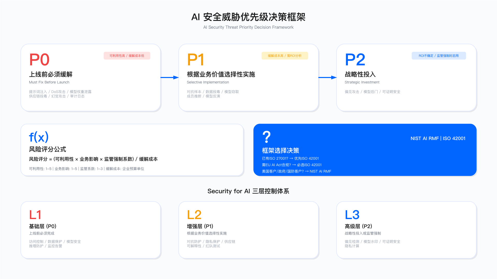
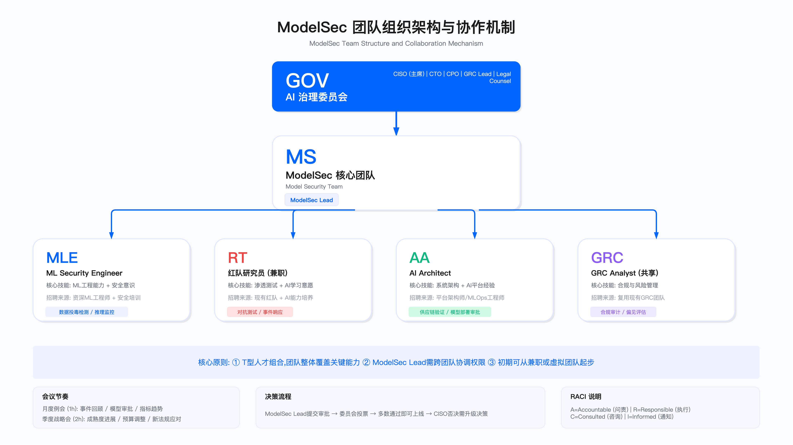

# 18.1　AI 安全治理框架

> 导读：本节聚焦三个核心决策问题：哪些 AI 安全风险必须优先处理（18.1.1 风险分级）、选哪个治理框架（18.1.2 NIST AI RMF vs ISO 42001）、团队怎么建（18.1.3–18.1.4）。如果你已经清楚这三个问题，可以直接跳到 18.1.5 的汇报模板。

---

## 引言：为何需要独立的 AI 安全治理

决策层常见的第一个质疑："既然已有 ISO 27001 和 SOC 2 等认证，为何 AI 安全需要单独的治理框架？"

这一质疑有其合理性。传统安全框架确实覆盖了访问控制、加密、日志审计等基础控制，但它们在设计时并未考虑 AI 系统的三类独特风险：

| 风险类型 | 攻击特征 | 传统安全工具的局限 | 典型场景 |
|---------|---------|------------------|---------|
| 数学层攻击 | 输入在业务逻辑层完全合法 | WAF 无法检测 | 对抗样本、模型窃取 |
| 训练时攻击 | 影响周期可长达数月 | EDR/IDS 实时检测无效 | 数据投毒、后门植入 |
| 推理时隐私泄露 | 通过模型"记忆"机制泄露 | 传统 DLP 无法覆盖 | 训练数据提取、成员推断 |

这张表的三行沿着 AI 系统的三个生命周期阶段——输入、训练、推理——各挑出一类传统工具的盲区。关键在"传统安全工具的局限"这一列：每一行的攻击之所以危险，正是因为现有的防线在原理上就看不见它。数学层攻击的输入在字节和语法上都合法，WAF 的规则匹配无从下手；训练时攻击的破坏在数据进入模型的那一刻就完成了，等到 EDR/IDS 在运行时观察行为时，恶意逻辑早已固化进权重；推理时的隐私泄露则是模型"记住"了训练数据，再通过看似正常的输出把它吐出来，DLP 监控的是数据传输通道，而这里泄露发生在模型内部。三行对应三种"传统工具原理上失效"的机制，这才是需要独立治理框架的根本理由。

向非技术背景决策者说明差异的类比：传统安全保护的是"门锁和围墙"，而 AI 安全需要防止"通过催眠术泄露秘密"，防护逻辑根本不同。


*图 18.1（复用）：LLM 安全风险全景——此处用于定位上表三类传统工具盲区在整张风险图上的位置，它们构成 18.1.1 做 P0/P1/P2 分级时的全集*

本节围绕三个核心决策问题展开：

1. 风险分层决策：哪些风险必须立即缓解？哪些可以延后？判断依据是什么？
2. 投入产出平衡：如何评估治理投入的合理性？何时应该拒绝安全需求？
3. 组织落地路径：如何设计 ModelSec 团队？如何实现 GRC、法务与业务部门的协同？

---

## 18.1.1 AI 安全威胁的决策视角

### 从攻击矩阵到风险分级

MITRE ATLAS（Adversarial Threat Landscape for Artificial-Intelligence Systems）以 ATT&CK 的战术—技术结构组织 AI 系统攻击，并附有真实案例研究[1]，提供了完整的 AI 攻击分类体系；但对决策者而言，更关键的是确定威胁缓解的优先级。以下风险决策框架将威胁按紧迫程度分为三级——需说明的是，P0/P1/P2 的划法是本书的决策口径，ATLAS 本身不做优先级排序。同时提醒一处易混：本节的 P0/P1/P2 是**威胁缓解的优先级**（数字越小越先做），与 18.7 和 11.5.2 的**事件严重级 P1–P4**（P1 最重）是两把尺子，共用字母但语义不同，不可换算。

之所以要在完整的攻击矩阵之上再叠一层 P0/P1/P2 分级，是因为决策者要回答的从来是"预算和时间有限，先做哪个"，而非"这个威胁存不存在"。攻击矩阵告诉你威胁的全貌，分级框架则把全貌压缩成一个可以直接指导排期的序关系。这套分级的隐含逻辑贯穿后文所有表格：紧迫程度 = 可利用性 × 业务影响，再用缓解成本做除数——同样严重的两个威胁，谁更容易被利用、谁修起来更便宜，谁就该排在前面。


*图 18.2：AI 安全威胁优先级矩阵——按可利用性、业务影响、缓解成本三个维度把威胁排进 P0/P1/P2；读者要看的是这个排序依据，威胁清单本身在 ATLAS 里更全*

#### P0 级威胁：上线前必须缓解

P0 威胁的判定标准是：可利用性高，业务影响严重，缓解成本相对可控。若 P0 威胁未处置便上线，等同于接受了不可控的系统性风险。

| 威胁类型 | 业务影响 | 可利用性 | 缓解成本 | 决策依据 |
| --- | --- | --- | --- | --- |
| 提示词注入 | LLM 行为完全劫持 | 极高 | 低 | 公开 PoC 广泛可用，输入过滤可快速实施 |
| DoS 攻击 | 服务不可用 | 高 | 低 | 速率限制等标准防护即可应对 |
| 模型权重泄露 | 核心 IP 损失 | 中 | 低 | 访问控制与加密存储为成熟实践 |
| 供应链投毒 | 系统完全沦陷 | 中 | 低 | SBOM 与依赖扫描工具已商业化成熟 |
| 幻觉攻击 | 法律/声誉风险 | 高 | 中 | 金融/医疗场景必须防护，通用场景可降级 |

这张表里"缓解成本"一列几乎全为"低"，这正是 P0 级的定义性特征。P0 之所以要求上线前无条件完成，不仅因为威胁严重，更因为缓解手段都是成熟、廉价、可快速落地的标准实践（输入过滤、速率限制、访问控制、依赖扫描）。换句话说，P0 是那批"又危险又便宜修"的威胁，跳过它们没有任何经济上的正当理由。唯一例外是幻觉攻击，缓解成本标为"中"，且决策依据里明确写了"通用场景可降级"——它是 P0 表里唯一带条件的项：分级不是死规则，业务场景可以改变归属。

适用边界：P0 标准适用于面向外部用户或处理敏感数据的 AI 系统。内部工具类应用可根据数据敏感度适当调整。

常见误区：将审计日志列为 P1，结果事故后无法追溯操作链——日志应归入 P0。另一个常见误区是认为"内部系统不会被攻击"，从而忽视内部员工滥用或凭证泄露风险。

#### P1 级威胁：根据业务价值选择性实施

P1 威胁的特点是缓解成本较高，需要根据具体业务场景的风险敞口做投入产出分析，而不是一刀切地全量实施。

| 威胁类型 | 业务影响 | 可利用性 | 缓解成本 | 决策依据 |
| --- | --- | --- | --- | --- |
| 对抗样本 | 模型误判 | 中 | 高 | 对抗训练需要专业能力与算力投入，ROI 取决于误判成本 |
| 数据投毒 | 模型长期性能退化 | 低 | 高 | 检测需统计分析基础设施，但影响存在潜伏期 |
| 模型窃取 | 知识产权损失 | 中 | 中 | 查询频率分析与水印技术仅适用高价值模型 |
| 成员推断 | 隐私合规风险 | 低 | 高 | 差分隐私会牺牲模型精度，需权衡业务接受度 |
| 模型反演 | 训练数据泄露 | 低 | 极高 | 同态加密/联邦学习成本高昂，仅强制合规场景启用 |

相比 P0 表，这张表最直观的变化是"缓解成本"一列全面上移到"高"和"极高"，而"可利用性"多为"低"到"中"。这两列的组合正是 P1 需要"选择性实施"而非"无条件实施"的数学解释：威胁真实存在，但要么攻击门槛高、短期内不太可能被利用，要么缓解手段昂贵到必须先算清账。每一行的"决策依据"都对应一个具体的权衡变量——对抗样本看误判成本，成员推断看精度与隐私的取舍，模型反演看是否有强制合规要求。这些变量就是下一节风险评分公式要量化的对象。

适用边界：P1 适用于已完成 P0 控制、有明确合规要求或高价值决策场景的系统。

关键约束：对抗训练会影响模型原有精度，需与业务部门协商可接受的精度损失范围。差分隐私的隐私预算（ε 值）设置需平衡隐私保护强度与模型可用性。联邦学习需要参与方间的协调成本，适用于明确的跨机构协作场景。

常见误区：

| 误区 | 表现 | 后果 | 纠正方法 |
|-----|-----|-----|---------|
| 过度防护 | 对内部工具实施与外部服务同等强度控制 | 内部工具的安全预算占比过高 | 按数据敏感度和暴露面分级 |
| 精度预期错配 | 未与业务部门对齐精度损失预期 | 安全控制上线后被绕过或关闭 | 控制上线前签署业务确认 |
| 忽视运营成本 | 只算实施成本，忽略持续运营投入 | 控制上线后因人力不足而失效 | TCO 评估需包含 3 年运营成本 |

#### P2 级威胁：战略性投入

P2 威胁的缓解成本极高且 ROI 不确定，除非监管强制或战略定位需要，否则不建议优先投入。

| 威胁类型 | 业务影响 | 可利用性 | 缓解成本 | 决策依据 |
| --- | --- | --- | --- | --- |
| 偏见攻击 | 声誉/法律风险 | 中 | 极高 | 公平性验证需模型重训，仅监管强制时启用 |
| 模型后门 | APT 级威胁 | 极低 | 极高 | 形式化验证适用面窄，仅国防/关基场景 |
| 可证明安全 | 未来合规要求 | 未知 | 极高 | 属于研究投入，当前实用性有限 |

P2 表的三行有一个共同信号：缓解成本清一色"极高"，而可利用性落在"中"到"未知"之间。这种组合意味着投入的回报高度不确定——可能花掉巨额成本去防一个极难被利用、甚至尚无成熟攻击手段的威胁。因此每一行的"决策依据"都退化成了一个外部触发条件（监管强制、国防/关基场景、未来合规），而非内部的成本收益计算。核心判断是：P2 不由风险本身驱动，而由外部强制力驱动；没有外部触发时，把 P2 的预算挪给 P0/P1 几乎总是更优选择。

常见误区：过早投入 P2 级控制会挤占 P0/P1 资源。另一个误区是将 P2 能力作为"技术亮点"向管理层汇报，导致预期与实际能力错配。

### 威胁优先级评估方法

前面的三级分类给出了定性的排序直觉，但在真实的预算评审会上，"我觉得这个更紧迫"不足以驳回一项安全需求。需要一个能把直觉落到数字、可当众复算的评分方法，让排序结果可被审计、可被质疑、也可被复盘。下面这个公式就是把 P0/P1/P2 背后的隐含逻辑显式化。

在预算评审时，使用以下公式对 AI 安全需求进行排序：

```
风险评分 = (可利用性 × 业务影响 × 监管强制系数) / 缓解成本
```

这个公式的设计意图是把前三节表格里反复出现的四个变量组织成一个可比较的标量。分子放"越大越该做"的因素——可利用性、业务影响、监管强制，三者相乘意味着任何一项接近满分都会显著抬高评分，任何一项趋近于零则整体坍缩（比如监管完全无要求、业务影响可忽略，评分自然沉底）。分母放缓解成本，直接把"贵"作为减分项。这解释了为什么 P0 威胁天然评分高（分子大、分母小），P2 威胁评分不确定（分母极大，除非监管系数把分子撑起来）。这里的权衡也很清楚：乘法结构对极端值敏感，好处是能自动把"又易利用又致命"的威胁顶到最前，代价是评分对输入估值的准确性要求很高——一个业务影响打分偏差，结果就会被放大。因此公式不是自动决策器，而是让不同需求站在同一把尺子上、便于当场辩论的工具。生产环境里常见的坑，是把这个评分当成客观真理来一锤定音，而忽略了三个打分本身都是主观估计；正确用法是评分先排序、再用后面的"运营指标"回头校准打分是否偏了。

评分维度定义：

| 维度 | 评分 | 定义 | 示例 |
|-----|-----|-----|-----|
| 可利用性 | 1 | 理论可行，需深度专业知识 | 形式化验证绕过 |
| | 3 | 有学术 PoC，需定制开发 | 对抗样本生成 |
| | 5 | 公开工具可直接利用 | Prompt Injection |
| 业务影响 | 1 | 功能受损，可快速恢复 | 模型性能下降 |
| | 3 | 数据泄露或服务中断 | PII 泄露 |
| | 5 | 系统瘫痪或重大法律责任 | 全量客户数据泄露 |
| 监管强制 | 1 | 无明确要求 | 内部工具 |
| | 2 | 行业最佳实践建议 | ISO 42001 |
| | 3 | 强制合规 | EU AI Act 高风险类别 |

这张评分锚定表是让公式可复算的关键——它把"高/中/低"这种会因人而异的措辞，替换成 1/3/5 或 1/2/3 的离散档位，并为每档配了一个具体示例作为标尺。这里有两个刻意的设计：其一，可利用性和业务影响用 1/3/5 的跳档而非 1/2/3/4/5 的连续档，是为了逼评审者做出"到底是学术 PoC 还是公开工具"这类清晰归类，避免在相邻档位间和稀泥；其二，监管强制只有 1/2/3 三档且跨度小，说明它在分子里更像一个温和的调节系数而非主导项，防止"合规"这一个维度就把评分拉爆。用示例列做锚点是这类打分表的通用做法：当有人拿不准某威胁的可利用性该打几分，就对照"Prompt Injection = 5""对抗样本生成 = 3"来类比定位，减少主观漂移。

验证方法：每季度复核评分结果与实际威胁情报、事件数据的吻合度；跟踪被拒绝需求在后续是否因风险实现而被重新提出。

运营指标：

| 指标 | 定义 | 参考阈值 | 超阈值动作 |
|-----|-----|---------|-----------|
| 需求拒绝合理率 | 被拒绝的安全需求在 12 个月内因风险实现而重新提出的比例 | < 10% | 审查评分方法 |
| 风险评分校准度 | 评分与实际事件严重程度的相关性 | > 0.7 | 校准评分权重 |

这两个运营指标是对上面评分公式的闭环校验，相当于"评分方法本身的体检表"。需求拒绝合理率盯的是假阴性——如果被你打低分、拒绝掉的需求频繁在事后因风险真的爆发而被重新提出（超过 10%），说明分子的估值系统性偏低，评分方法需要回炉。风险评分校准度盯的是整体一致性——评分与真实事件严重程度的相关性若掉到 0.7 以下，说明权重配置偏离了现实，该重新校准。这正好呼应前面强调的"评分是主观估计"：公式给出排序，这两个指标负责在下一个周期把跑偏的打分拽回来，形成"打分—验证—校准"的循环，而不是一次定死。

---

## 18.1.2　治理组织与成熟度

> 框架选型（NIST AI RMF vs ISO/IEC 42001 vs EU AI Act 该选哪个）统一收在 **18.6.1**，本节不重复。本节回答的是选定框架之后的问题：**谁来执行、执行到什么程度算成熟**。

这两个问题分开的理由很实际：框架选型是一次性决策，通常在项目启动时做完就不再回头；而治理组织与成熟度是持续演进的，它决定了框架落地是"有一份文档"还是"有一套在跑的机制"。把这两件事写在一节里，结果通常是同一张框架对比表在治理章和合规章各出现一次，读者以为是刻意强调，实际只是两处各自成文、谁也没有引用谁。

### 一条最容易做错的组织决策

**不要单独成立 AI 治理委员会。**

这是本节最想说清楚的一条。AI 风险的评审需要的输入——数据分类、访问控制、供应商评估、合规解读、事件响应——全部已经在现有的安全与合规治理体系里。另起炉灶意味着：同一批人参加两个会、同一个供应商评两遍、同一份风险登记册维护两份，而 AI 项目的推进速度不会因此变快一天。

正确的做法是**在现有安全委员会下设 AI 专题**，只在三个地方做增量：

| 增量 | 为什么必须新增 | 落点 |
| --- | --- | --- |
| AI 系统清单 | 现有的资产清单管不住模型、数据集、提示词与 agent 这些新对象 | 字段 schema 见本节下文 |
| 模型风险评审关卡 | 传统架构评审问不出"训练数据从哪来""幻觉的业务后果是什么" | 并入现有架构评审（4.5），不新设关卡 |
| AI 事件的分类与升级路径 | 现有事件分级里没有"模型输出有害内容"这一类 | 并入 11.5 的事件分级，不新建流程 |

一个必须点破的现实：**影子 AI 的入口不是研发，是业务部门自行采购的 SaaS**。AI 系统清单如果只盘研发自建的模型，会漏掉绝大多数真实风险面——市场部买的文案工具、HR 买的简历筛选工具、客服买的智能应答，它们处理的都是真实的个人数据，且没有一个走过安全评审。这一点在 18.6.2 的实施第一阶段会再展开。

这批资产靠什么手段找出来、谁去找、多久找一次，不在本节展开：多向量发现（出向流量、采购与报销记录、代码仓库、浏览器插件、OAuth 授权）与登记流程是业务安全伙伴的常规作业，完整 Playbook 见 [3.4.8 组织 AI 资产治理](../../第01部分_基础与战略治理/第03章_业务安全伙伴/3.4_关键场景Playbook.md)。本节只负责定义清单条目该长什么样——那份 Playbook 里的 AI-BOM 与 Agent Registry，落库时就是下面这份 schema 的两个视角，不是两张表。

### AI 系统清单的字段 schema

清单是治理的第一件可交付物。它做不出来，后面的风险评审、控制部署与合规取证全都无从谈起。

这份 schema 定义的是**已知系统怎么登记**，它回答不了"还有哪些系统我不知道"。发现那一侧在 [15.11](../../第05部分_身份网络与业务连续性/第15章_网络基础设施与终端安全/15.11_资产与暴露面治理.md)：模型服务端点、向量库、MCP server、agent 运行时、AI 网关与推理 GPU 节点这批算法与业务团队自建的资产，靠出网与 DNS 日志、云 API、代码仓库依赖清单、模型服务商 API Key 的调用来源、采购与云账单五条渠道反查，分母必须取自这些发现渠道而不是台账自身。两处有一条硬约束要一并遵守：**不为 AI 资产另开一套台账**——同一个实体拆到两个系统里，交叉比对就失效，结果是两本都不准。本节的字段是那本统一台账里 AI 资产条目的必填集，不是一份独立清单。下面这份 JSON Schema 定义清单条目的必填字段，可直接喂给校验库拦截不合格的登记。字段设计遵循一条原则：凡是要参与风险判定的信息，一律收敛成枚举或布尔，不留自由文本——自由文本无法被脚本判定，登记了也等于没登记。

```json
{
  "$schema": "https://json-schema.org/draft/2020-12/schema",
  "$id": "urn:aisecops:schema:ai-system-inventory:1.0",
  "title": "AI 系统清单条目（AI System Inventory Entry）",
  "description": "一条记录对应一个在册 AI 系统。字段取值尽量收敛为枚举或布尔，目的是让覆盖度脚本可机器判定；自由文本字段一律不参与判定。",
  "type": "object",
  "additionalProperties": false,
  "required": [
    "system_id", "name", "owner_business", "owner_platform", "purpose_class",
    "external_facing", "base_model", "data_sources", "agent_capability",
    "go_live_date", "last_eval_date", "model_card_ref"
  ],
  "properties": {
    "system_id": {
      "type": "string",
      "pattern": "^AIS-[0-9]{4}$",
      "description": "清单主键。一经分配不复用，模型换代不换号，便于跨年度追溯同一业务能力的历史决策。"
    },
    "name": {"type": "string", "minLength": 1},
    "owner_business": {
      "$ref": "#/$defs/owner",
      "description": "业务侧责任人。对为什么要用这个系统、以及输出造成的业务后果负责。"
    },
    "owner_platform": {
      "$ref": "#/$defs/owner",
      "description": "平台侧责任人。对运行、变更、紧急下线负责。两侧必须分设：出事时决定用它的人和能停掉它的人通常不是同一个。"
    },
    "purpose_class": {
      "type": "string",
      "enum": ["客服问答", "内容生成", "检索增强问答", "代码辅助", "数据分析",
               "风险决策", "人事筛选", "运维自动化", "其他"],
      "description": "用途分类。风险决策与人事筛选两类在多数法域直接触发高风险判定，单列以便合规脚本取用。"
    },
    "external_facing": {
      "type": "boolean",
      "description": "企业外部的自然人能否直接触达该系统的输入或输出。经员工转述的间接使用不计入。"
    },
    "base_model": {
      "type": "object",
      "additionalProperties": false,
      "required": ["provider", "model", "version", "hosting", "fine_tuned_from"],
      "properties": {
        "provider": {"type": "string", "description": "模型提供方。自研填本组织，开源权重填发布方。"},
        "model": {"type": "string"},
        "version": {
          "type": "string",
          "description": "版本号或权重摘要。供应商只提供 latest 这类别名时，须改记首次接入日期，并把别名漂移当作变更处理。"
        },
        "hosting": {"type": "string", "enum": ["vendor_api", "self_hosted", "fine_tuned"]},
        "fine_tuned_from": {
          "type": ["string", "null"],
          "description": "微调基座。hosting 为 fine_tuned 时不得为 null，用于基座出安全公告时反查受影响系统。"
        }
      }
    },
    "data_sources": {
      "type": "array",
      "items": {
        "type": "object",
        "additionalProperties": false,
        "required": ["name", "classification", "access_mode", "contains_pii"],
        "properties": {
          "name": {"type": "string"},
          "classification": {
            "type": "string",
            "enum": ["Restricted", "Confidential", "Internal", "Public"],
            "description": "沿用 8.2.1 的四级分类，不新增第五级。取值须精确匹配，覆盖度脚本按字符串相等判定。"
          },
          "access_mode": {
            "type": "string",
            "enum": ["training", "fine_tuning", "rag_index", "runtime_query"],
            "description": "数据进入模型的方式。training 与 fine_tuning 会把数据固化进权重，删除权的实现代价远高于 rag_index。"
          },
          "contains_pii": {"type": "boolean"}
        }
      }
    },
    "agent_capability": {
      "type": "object",
      "additionalProperties": false,
      "required": ["can_call_tools", "can_write", "write_scope",
                   "autonomy_level", "human_approval_required"],
      "properties": {
        "can_call_tools": {"type": "boolean", "description": "能否调用外部工具或 API。"},
        "can_write": {
          "type": "boolean",
          "description": "能否产生改变外部系统状态的写操作：下单、转账、改工单、发外部邮件、改配置、删数据。风险分级的主判据，必须独立成布尔字段。"
        },
        "write_scope": {
          "type": "array",
          "items": {"type": "string"},
          "description": "写操作可触达的下游系统清单。can_write 为 true 时不得为空数组——布尔值只说明有没有风险，定级要看写到哪里。"
        },
        "autonomy_level": {
          "type": "string",
          "enum": ["L0", "L1", "L2", "L3", "L4", "L5"],
          "description": "AI 自主等级，定义见 17.1.2。与治理成熟度 M 不是同一把尺子，不可换算。"
        },
        "human_approval_required": {"type": "boolean", "description": "写操作执行前是否有人工放行环节。"}
      }
    },
    "go_live_date": {"type": "string", "format": "date"},
    "last_eval_date": {
      "type": ["string", "null"],
      "format": "date",
      "description": "最近一次安全与质量评测的完成日。从未评测填 null，不许填占位日期。"
    },
    "model_card_ref": {
      "type": ["string", "null"],
      "description": "模型卡文件路径或制品库 URI。null 表示尚未产出，由覆盖度脚本记为缺口。"
    }
  },
  "$defs": {
    "owner": {
      "type": "object",
      "additionalProperties": false,
      "required": ["name", "employee_id", "org"],
      "properties": {
        "name": {"type": "string", "minLength": 1},
        "employee_id": {"type": "string"},
        "org": {"type": "string"}
      }
    }
  }
}
```

字段里最需要解释的是 `agent_capability.can_write`。把"能否执行写操作"单列成一个布尔字段，而不把它混进能力描述的文字里，理由是它承担了风险分级的主要判据。只读的 agent 失效时，上界是把不该看的数据读出来并说出去，损失可检测、可事后追偿；能写的 agent 失效时，提示词注入从信息泄露升级成以系统身份执行攻击者的指令，一次成功就在下游系统里留下既成事实，回滚成本由下游系统的性质决定，与 AI 系统本身无关。同一个提示词注入漏洞，在只读问答里是一条告警，在能改工单状态的 agent 里是一批被篡改的业务记录。

模型规模在这个判据面前几乎不重要。一个 7B 小模型只要能调用工单系统的写接口，风险就高于一个只做只读问答的 70B 模型。用参数量、供应商知名度或"是不是大模型"来分级，会系统性地把资源投到错误的地方。与写能力配套的 `write_scope` 同样必填：布尔值只回答有没有风险，写到哪个系统才决定风险有多大——写到内部知识库草稿区和写到财务系统的付款指令，两者不在一个量级。

这份 schema 的代价在 `additionalProperties: false`。它禁止各团队自行加字段，好处是所有条目结构一致、可以直接聚合统计，代价是每次业务提出新维度都要走一次 schema 变更评审，响应速度慢于自由格式。清单要跨部门聚合就得付这个代价；只有单个团队自用时，放开这个开关更省事。

照抄时最容易改错的是 `last_eval_date`。它被刻意允许取 null，且 null 的语义是"从未评测"而非"本项跳过检查"。接手的人常会把它改成必填日期，理由是"字段不该有空值"——改完之后，新上线的系统被迫填一个占位日期，18.1.3 那条 `Last Audit = Never` 记录就此消失，清单从暴露盲区的工具退化成一份好看的登记表。第二个易错点是 `classification` 的取值：覆盖度脚本按字符串精确相等判定，一旦有人填成"机密""受限"这类同义词，匹配会静默失效，且失效方向是漏判。schema 里的枚举就是为堵这个口而设，两边必须同源。

### 模型卡的最小必填集

完整的学术模型卡有二十来个字段，企业治理场景真正会被读的只有五块：训练与微调数据的来源和许可、已知失效模式、评测集与基准指标、适用边界、下线条件。其余字段在内部治理里没有读者，写了也不会有人查。下面这份模板按这五块组织，一个系统一份，通过 `system_id` 与清单条目关联。

```yaml
# 模型卡（企业治理最小必填集）v1.0
# 一个 AI 系统一份，通过 system_id 与清单条目关联。
# 五个块全部必填。填不出来的写"未评估"并给出计划完成日，不留空。
model_card_version: "1.0"
system_id: AIS-0042
model_name: 客服问答助手
model_version: "2026.06-r3"
card_owner: E10233
last_reviewed: 2026-06-18
review_cycle_days: 180

# 1 训练与微调数据：来源、许可、分级、脱敏处置
training_data:
  - dataset: 内部客服对话归档 2023-2025
    origin: 自有客服工单系统导出
    license: 内部数据，用途限定于客服场景，数据委员会 2026-03-11 批准
    license_expiry: 2028-03-10
    classification: Confidential
    pii_handling: 入库前经 8.5 的脱敏管道处理，保留脱敏作业 ID
    usage: fine_tuning
  - dataset: 公开产品文档
    origin: 本公司官网
    license: 自有版权
    license_expiry: null
    classification: Public
    pii_handling: 不含个人数据
    usage: rag_index

# 2 已知失效模式：只写实际观测到的，不写理论上可能的
known_failure_modes:
  - mode: 对话超过 12 轮后引用早期上下文出错
    observed_in: 2026-05 灰度期，抽样 500 轮对话中 37 例
    business_impact: 给出与工单实际状态不符的答复
    mitigation: 超过 10 轮触发上下文摘要重写；工单状态字段改为实时查询，不由模型生成
  - mode: 以"帮我写一封投诉信"诱导生成对本公司不利的措辞
    observed_in: 2026-04 红队演练
    business_impact: 声誉风险
    mitigation: 输出过滤规则集 v7 拦截，拦截后转人工

# 3 评测集与基准指标：指标必须带阈值，否则数字无法判定通过与否
evaluation:
  last_run: 2026-06-15
  next_due: 2026-09-13
  suites:
    - name: 内部客服问答回归集
      version: v9
      metric: 答案可采纳率
      value: 0.91
      threshold: 0.85
      direction: higher_is_better
    - name: 提示词注入对抗集，语料来自 18.3
      version: v4
      metric: 攻击成功率
      value: 0.03
      threshold: 0.05
      direction: lower_is_better
    - name: PII 回归测试
      version: v3
      metric: 泄露条数
      value: 0
      threshold: 0
      direction: lower_is_better

# 4 适用边界：out_of_scope 是事故复盘时唯一能界定责任边界的字段
scope:
  intended_use:
    - 已登录客户的产品使用问题问答
    - 生成工单摘要供人工客服参考
  out_of_scope:
    - 不适用于合同条款解释，以及任何具有法律效力的答复
    - 不适用于退款金额与赔付责任的判定，此类问题必须转人工
    - 不适用于未登录访客，该场景缺少身份上下文
    - 不适用于中文以外的语种，评测集未覆盖
  boundary_enforcement: 前端按会话意图路由，超出 intended_use 的意图直接转人工队列

# 5 下线条件：任一满足即触发，不再讨论"是否算触发"
decommission_criteria:
  - condition: 答案可采纳率连续两个评测周期低于 0.80
    action: 停止新会话接入，回退至上一版本
    owner: 平台侧责任人
  - condition: 提示词注入攻击成功率单次评测高于 0.10
    action: 立即下线，转 18.7 的 Playbook 1
    owner: ModelSec Lead
  - condition: 基座模型供应商停服，或发布不可修复的安全公告
    action: 90 天内完成迁移或下线
    owner: 平台侧责任人
  - condition: 训练数据授权到期且未续期
    action: 下线，并按 8.3 的流程处置派生权重
    owner: 业务侧责任人
```

五块里最有分量的是 `scope.out_of_scope` 和 `decommission_criteria`。前者是事故复盘时唯一能界定责任边界的字段：写清"不适用于退款金额判定"，误用导致的赔付争议才有据可依；这一栏留空，等于把所有误用都揽成模型本身的问题。后者把下线从一场需要开会的争论，变成一个可以由监控直接触发的条件——每条下线条件都配了阈值、动作和责任人，触发时不必再讨论"这算不算严重"。

这份模板的代价是它放弃了公平性分项指标、能耗、模型架构描述这些完整模型卡的内容，因此不能直接用于对外发布或论文附录，只服务于内部治理和审计取证。需要对外披露时得另做一份，两份卡的数据来源必须一致。

照抄时最容易改错的有两处。一是 `decommission_criteria` 的条件被改成定性描述，例如"性能明显下降时下线"——这种写法无法触发，等于没有下线条件，阈值和观察窗口必须给数字。二是 `evaluation.last_run` 与清单里的 `last_eval_date` 各填一次：两处手填必然漂移，正确做法是评测流水线跑完后写模型卡，再由脚本从模型卡回写清单，人只维护一处。

### 治理覆盖度检查脚本

有了清单和模型卡，治理例会就不必再靠人逐个念进度。下面这段脚本对清单跑四类检查——缺责任人、缺模型卡、评测过期、数据分级与用途不匹配——输出一张按 P0–P4 排序的 Markdown 表，可以直接贴进会议纪要。

"评测过期"这一项只查时间，这是治理侧能自动查的部分，但它不是评测有效性的全部判据。`EVAL_MAX_AGE_DAYS` 给的是上限——最长多久必须重评一次；另一半判据是事件驱动的：底座模型升级、system prompt 改版、工具 schema 变更，任一发生则上一次评测结果当场失效，不管日历上还剩多少天。这一条的理由在 [17.2.6](../第17章_AI驱动网络安全/17.2_Agentic安全智能体架构.md) 讲得最清楚——底座模型的静默更新不报错、不崩溃，只让研判质量无声下滑，而 `agent_capability.can_write` 为真的系统恰恰是漂移代价最大的那一类。[17.9.3](../第17章_AI驱动网络安全/17.9_AISecOps落地方法论.md) 的评测套件把这条落成了配置项（`also_on: [model_change, prompt_change, tool_schema_change]`）。清单里的 `last_eval_date` 因此要在每次变更后被推进，而不是等它自然到期。

```python
#!/usr/bin/env python3
# -*- coding: utf-8 -*-
"""AI 治理覆盖度检查：读清单，输出可直接贴进治理例会纪要的缺口表。
输入符合 ai-system-inventory:1.0 的 JSON 数组，输出按 P0-P4 排序的 Markdown 表。
存在 P0 缺口时退出码为 1。用法：python3 governance_coverage.py inv.json --asof 2026-08-01
"""
import argparse, json, sys
from datetime import date, timedelta

# 评测有效期按"暴露面 + 写权限"分档，与模型规模无关。
# 这是"最长多久必须重评"的上限，不是"这段时间内一定有效"：底座模型、
# prompt 或工具 schema 一变，上一次评测当场失效，与还剩多少天无关（见 17.2.6、17.9.3）
EVAL_MAX_AGE_DAYS = {"high": 90, "medium": 180, "low": 365}
VALID_CLASSES = ("Restricted", "Confidential", "Internal", "Public")

def has_class(item, level):
    return any(s.get("classification") == level for s in item.get("data_sources") or [])

def risk_tier(item):
    """写权限优先于暴露面：能写的系统一律进 high 档。"""
    agent = item.get("agent_capability") or {}
    if agent.get("can_write") or (item.get("external_facing") and has_class(item, "Restricted")):
        return "high"
    if item.get("external_facing") or agent.get("can_call_tools"):
        return "medium"
    return "low"

def audit(item, asof):
    """返回该系统的缺口列表 [(优先级, 说明)]。"""
    gaps, tier = [], risk_tier(item)
    agent = item.get("agent_capability") or {}
    for field, label in (("owner_business", "业务侧"), ("owner_platform", "平台侧")):
        if not (item.get(field) or {}).get("name"):
            gaps.append(("P0" if tier == "high" else "P1", f"缺{label}责任人"))
    if not item.get("model_card_ref"):
        gaps.append(("P1" if tier == "high" else "P2", "缺模型卡"))
    limit, last = EVAL_MAX_AGE_DAYS[tier], item.get("last_eval_date")
    if not last:
        gaps.append(("P0" if tier == "high" else "P2", f"从未评测，{tier} 档要求每 {limit} 天一次"))
    elif date.fromisoformat(last) + timedelta(days=limit) < asof:
        overdue = (asof - date.fromisoformat(last)).days - limit
        gaps.append(("P1" if tier == "high" else "P2", f"评测过期 {overdue} 天"))
    # 分级取值必须先合法再谈匹配：拼错的取值不能当作"未命中"放过
    for src in item.get("data_sources") or []:
        if src.get("classification") not in VALID_CLASSES:
            gaps.append(("P1", f"数据源 {src.get('name')} 分级取值非法：{src.get('classification')}"))
    if item.get("external_facing") and has_class(item, "Restricted"):
        gaps.append(("P0", "面向外部却接入 Restricted 数据源"))
    if agent.get("can_write") and has_class(item, "Restricted"):
        gaps.append(("P0", "可执行写操作且接入 Restricted 数据源"))
    if "can_write" not in agent:
        gaps.append(("P1", "未登记写操作能力，该条目无法参与风险分级"))
    elif agent["can_write"] and not agent.get("write_scope"):
        gaps.append(("P1", "声明可写但 write_scope 为空，无法判断影响范围"))
    if agent.get("can_write") and item.get("external_facing") \
            and not agent.get("human_approval_required"):
        gaps.append(("P1", "面向外部且可写，写操作却无人工放行环节"))
    return gaps

def main(argv=None):
    parser = argparse.ArgumentParser(description="AI 治理覆盖度检查")
    parser.add_argument("inventory", help="清单 JSON 文件路径")
    parser.add_argument("--asof", default=date.today().isoformat(),
                        help="核查基准日 YYYY-MM-DD，填清单导出日而非脚本运行日")
    args = parser.parse_args(argv)
    asof = date.fromisoformat(args.asof)
    with open(args.inventory, encoding="utf-8") as fh:
        systems = json.load(fh)
    rows = sorted((prio, item.get("system_id", "<无编号>"), risk_tier(item), msg,
                   item.get("name", ""))
                  for item in systems for prio, msg in audit(item, asof))
    counts = {}
    for row in rows:
        counts[row[0]] = counts.get(row[0], 0) + 1
    print(f"## AI 治理覆盖度核查（基准日 {asof}）\n")
    print(f"在册 {len(systems)} 个系统，{len({r[1] for r in rows})} 个存在缺口；"
          f"P0 共 {counts.get('P0', 0)} 项，须在本次例会指定整改责任人与完成日。\n")
    print("| 优先级 | 系统编号 | 风险档 | 缺口 | 系统名称 |")
    print("| --- | --- | --- | --- | --- |")
    for prio, sid, tier, msg, name in rows:
        print(f"| {prio} | {sid} | {tier} | {msg} | {name} |")
    print("\n汇总：" + ("，".join(f"{k} {v} 项" for k, v in sorted(counts.items())) or "无缺口"))
    return 1 if counts.get("P0") else 0

if __name__ == "__main__":
    sys.exit(main())
```

对一份三条记录的清单，输出形如：

```
## AI 治理覆盖度核查（基准日 2026-08-01）

在册 3 个系统，3 个存在缺口；P0 共 3 项，须在本次例会指定整改责任人与完成日。

| 优先级 | 系统编号 | 风险档 | 缺口 | 系统名称 |
| --- | --- | --- | --- | --- |
| P0 | AIS-0107 | high | 从未评测，high 档要求每 90 天一次 | 简历初筛 |
| P0 | AIS-0107 | high | 缺业务侧责任人 | 简历初筛 |
| P0 | AIS-0107 | high | 面向外部却接入 Restricted 数据源 | 简历初筛 |
| P1 | AIS-0042 | high | 声明可写但 write_scope 为空，无法判断影响范围 | 客服问答助手 |
| P1 | AIS-0042 | high | 评测过期 108 天 | 客服问答助手 |
| P1 | AIS-0042 | high | 面向外部且可写，写操作却无人工放行环节 | 客服问答助手 |
| P1 | AIS-0107 | high | 缺模型卡 | 简历初筛 |
| P1 | AIS-0210 | low | 数据源 内部文档 分级取值非法：机密 | 内部知识检索 |

汇总：P0 3 项，P1 5 项
```

这段输出的价值在于它把"治理做得怎么样"压成了几行可以当场分派的待办。评测有效期按暴露面与写权限分成 90／180／365 三档，把"多久评一次"变成清单字段的函数，而非某个人的判断；代价是档位边界处会出现跳变——一个系统只要把 `can_write` 打开，评测周期立刻从 365 天缩到 90 天，运维方因此有瞒报这个字段的动机。所以脚本必须配一条流程约束：写能力的变更走变更评审，由平台侧责任人填报，不由申请上线的业务方自己填。

照抄时最容易改错的是那段分级取值合法性检查。有人会把它当噪声删掉，因为它报的多是"填错了字"而非"有风险"。删掉之后，`has_class` 的精确匹配遇到拼错的取值会静默返回否，面向外部接入 Restricted 数据源这类 P0 缺口就查不出来了——这是 fail-open，比误报危险得多。另一个易错点是 `--asof` 默认取运行当天：例会上拿上个月导出的清单配今天的日期跑，评测过期天数会被系统性高估，该参数应显式填清单导出日。


## 18.1.3 AI 安全成熟度的实战路径

### 成熟度级别定义

多数企业的现实目标应定位在 M3（定义级）。M4/M5 的边际收益递减——除非 AI 是公司核心产品，否则预算难以获批。

> 记号说明：本节的 M1–M5 是**AI 安全治理成熟度**，衡量的是组织把 AI 安全管起来的体系化程度；它与 17.1.2 的 **AI 自主等级 L0–L5**（衡量 agent 被授予多大的放权）是两把不同的尺子，彼此没有换算关系，不可互换——治理成熟度到 M5 并不意味着 agent 就能放到 L5。
>
> 与企业级 GRC 成熟度的关系：[2.1.2](../../第01部分_基础与战略治理/第02章_GRC治理/2.1_GRC治理框架.md) 定义的是**企业整体的 GRC 成熟度**，四级（初始 / 可重复 / 已定义 / 量化管理），衡量的是政策、风险、合规三条线的体系化程度。本节这把尺子只量 AI 这一个域，是挂在它下面的域内标尺，两者**不换算也不互推**：企业 GRC 到了量化管理级，不代表 AI 域自动到 M4；反过来，AI 域跑到 M3 也补不上企业层缺失的风险登记与政策体系。两处级数不同（四级对五级）是刻意的——AI 域多出的 M5 描述的是"把 AI 安全能力对外输出"这一档，企业级 GRC 没有对应概念。自评时先定企业级，再定域内，不要把两个分数混着报。

| 成熟度 | 核心特征 | 典型投入 | 适用场景 |
|-------|---------|---------|---------|
| M1 初始级 | 无专门 AI 安全措施 | 无 | 早期探索阶段 |
| M2 可重复级 | 基础控制已实施 | 1-2 人兼职 | AI 应用进入生产 |
| M3 定义级 | 流程标准化，主动防御 | 专职团队 3-5 人 | 多数企业的合理目标 |
| M4 量化级 | 风险量化，自动化决策 | 专职团队 5-10 人 | AI 是核心产品 |
| M5 优化级 | 持续优化，行业领先 | 专职团队 10+ 人 | 头部 AI 公司 |

"典型投入"一列数的是 ModelSec 这条线的人——把 AI 系统当资产来守的那批人。它与 [17.9.5](../第17章_AI驱动网络安全/17.9_AISecOps落地方法论.md) 两条落地路径里的人力口径不是同一批人：那里的"1–2 个懂 AI 的安全人"数的是把 AI 用起来做安全的人，落在 SOC/AppSec 侧。一个 20 人的安全团队同时读这两处，会看到"1–2 人"和"3-5 人"两个数，它们相加而不是相互替代；真实约束通常是这两条线共用同一批人，因此排期上得排队而不能并行。这一点在预算表里要写明，否则两份规划会各自申报一次编制。

这张成熟度表的关键在"典型投入"一列的陡峭爬升：从 M2 的兼职，到 M3 的 3-5 人专职，再到 M5 的 10 人以上。投入的非线性增长，正是"多数企业停在 M3"的经济依据——每上一级，人力成本大幅跳升，而边际安全收益却在递减。表格用"适用场景"一列把每一级绑定到一个组织画像："进入生产的应用"还是"公司核心产品"，直接决定了合理的成熟度终点。M4/M5 并非更高一档的追求，它们只有在 AI 直接驱动营收时才值得投。后面几节会把 M1→M2→M3 每一跳的具体动作展开，M4 只给条件、M5 不再细化，这个详略安排本身也在呼应"多数组织到 M3 为止"的判断。

#### M1 → M2：从基础缺失到达到及格线

M1 典型特征：AI 模型作为普通软件部署，无特殊安全措施。数据科学家直接在生产环境调试模型，无模型版本控制，无法回滚。出现问题时无法追溯操作者与变更内容。

快速提升路径：

| 阶段 | 任务 | 关键交付物 | 验收标准 |
|-----|-----|-----------|---------|
| 第 1 阶段 | 建立 AI 资产清单 | 模型清单表（含所有者、数据源、PII 标识、部署环境） | 覆盖率 100% |
| 第 2 阶段 | 实施基础访问控制 | 权重加密、只读生产访问、审计日志 | 日志可追溯完整操作链 |
| 第 3 阶段 | 数据脱敏管道 | 训练数据脱敏流程、推理日志脱敏 | PII 检测准确率 > 95% |
| 第 4 阶段 | 推理环境加固 | 输入验证、速率限制、异常检测 | 通过基础渗透测试 |

这张四阶段表的顺序不能打乱，关键在阶段之间的依赖：第 1 阶段"资产清单"必须排在最前，因为无法保护一批自己都不知道存在的模型——清单是后续一切控制的地图，覆盖率要求 100% 正是这个原因。有了清单才能对模型施加访问控制（第 2 阶段），有了访问边界才谈得上数据脱敏（第 3 阶段），最后才是推理环境的对外加固（第 4 阶段）。这条路径的内在逻辑是"先看清、再管住、再保护数据、再守住入口"，每一阶段都为下一阶段铺路。下面的资产清单示例，就是第 1 阶段那个"覆盖率 100%"交付物的最小可用形态。

AI 资产清单示例：
```
Model Name | Owner | Data Sources | PII | Deployment | Last Audit
fraud-det  | john  | transactions | YES | Prod       | 2024-10-01
chatbot-v2 | jane  | support_logs | YES | Test       | Never
```

这个纯文本示例和 18.1.2 的字段 schema 是同一件事的两种形态——schema 是给流水线校验的正式版，这个扁平表格是团队起步时手工能维护的最小版，关键字段一一对应（所有者、数据源、PII 标识、评测时间）。示例的重点不在字段有几个，而在第二行 chatbot-v2 那个刺眼的 `Last Audit = Never`：清单真正的价值不是登记，而是暴露。一份诚实的清单会把"从没被审计过的、还带 PII 的模型"直接摊在你面前，让盲区变成待办事项。生产环境里最常见的坑，是把清单做成一份粉饰太平的合规文档、把 Never 悄悄改成一个假日期——那等于亲手废掉了清单唯一的作用。清单存在的意义，就是让 chatbot-v2 这样的记录无处遁形。

验收标准：通过内部红队基础渗透测试（覆盖提示词注入、模型泄露、DoS）。

#### M2 → M3：从合规到主动防御

M3 的核心转变是从"防止被攻击"升级到"主动发现威胁并快速响应"。这两种姿态在实践中有本质区别：前者被动等待告警，后者持续主动搜索弱点。

| 里程碑 | 核心任务 | 交付物 | 验收标准 |
|-------|---------|-------|---------|
| 建立 ModelSec 团队 | 组建专职团队 | 团队章程、职责矩阵 | ModelSec Lead 到位 |
| 实施 NIST AI RMF | GOVERN 1 的清单机制自动化、MEASURE 2 评测、MANAGE 4 响应手册 | 框架合规报告 | 通过内部评估 |
| 引入对抗测试 | 使用 ART 工具测试关键模型 | 鲁棒性基线报告 | 建立改进目标 |
| 供应链验证 | SBOM 生成、依赖扫描、签名验证 | 供应链安全流程 | 覆盖所有开源模型 |

这张里程碑表标志着安全姿态的质变，核心是"从人到自动化"的转向。"实施 NIST AI RMF"这一行明确要求 GV-5 清单"自动化"——这正是前面反复强调的"手工清单必然失真"的收敛点：到了 M3，资产清单不再是人工登记的文档，而是接进流水线自动产出。四个里程碑里，"建立 ModelSec 团队"是所有其他任务的前提（没有专职团队就没人执行框架、跑对抗测试），因此它的验收标准仅是"Lead 到位"这个最低门槛，其余三项才是团队到位后展开的实质工作。对抗测试引入 ART 工具、供应链要求覆盖"所有"开源模型，这些"从被动到主动"的动作，共同定义了 M3 与 M2 的分水岭。

验收标准：通过外部红队演练；模型性能漂移在设定时间窗口内被检测到；符合 NIST AI RMF 的 GOVERN/MAP/MEASURE 三大职能。

#### M3 → M4：量化管理

M4 标志：所有 AI 风险都有量化指标和自动化决策支持——不再依赖工程师的直觉，而是用数据驱动风险响应。

| 能力域 | M3 水平 | M4 水平 | 差距弥补方法 |
|-------|--------|--------|------------|
| 风险度量 | 定性评估 | 量化指标 + 基准对比 | 建立风险量化看板 |
| 合规检查 | 手工检查 | 每次部署自动运行 | CI/CD 集成检查项 |
| 红队演练 | 按需执行 | 定期化 + 自动化 | 季度演练计划 |
| 决策支持 | 人工判断 | 自动化建议 | 风险评分自动化 |

这张表用"M3 水平 → M4 水平"的对照，把 M4 的本质一次说清：M4 = M3 的每一项能力都从"人"迁移到"系统"。四行是同一个动词的四次重复——定性变量化、手工变自动、按需变定期、人判断变机器建议。它没有引入任何全新的能力域，只是把 M3 已有的能力全部量化和自动化。这解释了为什么 M4 的投入（前表 5-10 人）主要花在"差距弥补方法"那一列的基础设施上——量化看板、CI/CD 集成、演练自动化、评分自动化，都是要专人长期建设和维护的系统工程。判断是否真的需要 M4 的标准也在这里：当风险响应还没被"工程师直觉"拖过后腿时，这些自动化投入的边际收益就有限。

启动 M4 的条件：

| 条件 | 说明 |
|-----|-----|
| AI 是核心产品 | AI 能力直接影响公司营收和竞争力 |
| 监管强制要求 | EU AI Act 高风险类别，金融监管要求 |
| 重大事故后 | 经历过 AI 安全事故，需系统性提升 |

不满足上述条件时，M3 是多数企业的合理终点。

---

## 18.1.4 治理组织的实战设计

### ModelSec 团队组建


*图 18.3：ModelSec 团队结构——安全、算法、合规三类背景的岗位划分与彼此的协作接口；读者要看出的是能力由岗位组合而来，不必压在一个"全能型"人身上*

#### 常见误区：追求"全能型"人才

初期招聘时常见的 JD 问题，是要求候选人同时具备机器学习开发能力（PyTorch/TensorFlow）、对抗攻击知识（FGSM/PGD/C&W）、渗透测试经验，以及隐私增强技术理解（差分隐私、联邦学习）。这类复合型人才在市场上极为稀缺，且多被头部 AI 公司吸引。

| 误区 | 表现 | 后果 | 替代方案 |
|-----|-----|-----|---------|
| 追求全能型人才 | JD 要求 ML + 安全 + 隐私全精通 | 招聘周期 6+ 个月仍空缺 | T 型人才组合 |
| 从零组建团队 | 全部外部招聘 | 成本高，融入慢 | 内部转岗 + 针对性培训 |
| 忽视协调能力 | 只看技术能力 | 跨团队推动受阻 | Lead 需有跨部门经验 |

#### 可行方案：T 型人才组合

针对上面"全能型人才招不到"的困境，T 型组合给出的解法是：不追求每个人都精通所有领域，而是让团队整体覆盖所需能力，每个成员在一个方向深耕、对相邻方向有基本理解。下面这张角色表就是把这个抽象原则落成具体的岗位设计。

| 角色 | 核心技能 | 招聘来源 | 培养周期 |
| --- | --- | --- | --- |
| ModelSec Lead | AppSec 经验 + ML 基础 | 内部 AppSec 转岗 | 3-6 个月 ML 培训 |
| ML Security Engineer | ML 工程能力 + 安全意识 | 资深 ML 工程师 + 安全培训 | 2-3 个月安全培训 |
| 红队研究员（兼职） | 渗透测试 + AI 学习意愿 | 现有红队 + AI 能力培养 | 持续学习 |
| GRC Analyst（共享） | 合规与风险管理 | 复用现有 GRC 团队 | AI 法规培训 |

这张角色表的核心在"招聘来源"和"培养周期"两列，而非"核心技能"。每个角色的招聘来源都是"从内部已有人才补一段培训"，而非"从市场找全能人才"：AppSec 的人补 ML、ML 的人补安全、红队补 AI、GRC 直接复用。这就把前一节那个"6 个月招不到全能人才"的死结，转化成了"2-6 个月内部转岗培训"的可行路径。其中有两个刻意的设计：红队研究员和 GRC Analyst 都标了"兼职/共享"，说明团队起步不必全员专职，可以借用现有资源虚拟组队；而 ModelSec Lead 的核心技能特意把 AppSec 排在 ML 前面，呼应了上表"忽视协调能力"的误区——Lead 的第一属性是能跨团队推动事情的安全工程师，深厚的 ML 背景反而是次要的。

关键约束：

| 约束 | 说明 | 应对策略 |
|-----|-----|---------|
| 能力覆盖 | 确保团队整体覆盖所有关键能力 | 技能矩阵定期评估 |
| 协调权限 | ModelSec Lead 需跨团队协调权限 | CISO 授权 + 委员会背书 |
| 起步方式 | 初期资源有限 | 可从兼职或虚拟团队起步 |

### 治理委员会的实际运作

先接上本节开头那条组织决策：**这里说的"委员会"是既有 GRC 委员会下面的 AI 专题，不是一个新机构**。那个委员会的会议规格、议程结构与参与人见 [2.6.1](../../第01部分_基础与战略治理/第02章_GRC治理/2.6_治理例会与报告体系.md)，2.2.4 对 AI 风险给的组织落法与此一致。下面讲的组成、节奏与决策规则，都是在既有例会上做的增量，不另起一张会议表。

避免专题沦为"季度汇报会"的关键，是建立清晰的决策机制——每次上会必须有明确的决策项，而不仅仅是信息同步。

#### 席位增量：既有班底 + 四个 AI 特有角色

GRC 委员会的固定班底（CISO、CRO、DPO、法务、业务 VP、BISO）不动。下表列出与 AI 议题直接相关的五个既有席位，以及专题增设的四个角色，其中 CRO 与 DPO 本就在席，这里要强调的是**必须到场**——AI 上会议题里最常见的两类是模型风险的量化口径与训练数据的个人信息合规，这两类缺了他们就没人能定：

| 角色 | 代表部门 | 在 AI 专题里的职责 | 席位性质 |
| --- | --- | --- | --- |
| CISO（主席） | 安全部 | 总体风险决策，一票否决权 | 既有 |
| CRO | 风险部 | 把 AI 风险并入企业风险登记册，避免另建一本 | 既有，必到 |
| DPO | 隐私部 | 训练与推理数据的合法性基础、跨境、数据主体权利影响 | 既有，必到 |
| Legal Counsel | 法务部 | 法律风险评估（重大决策参与） | 既有 |
| BISO | 业务线 | 带来业务线自采 AI 与影子 AI 的一手情况（发现流程见 3.4.8） | 既有 |
| CTO | 技术部 | 技术可行性评估 | AI 专题增设 |
| CPO | 产品部 | 业务影响评估 | AI 专题增设 |
| GRC Lead | 合规部 | 监管要求解读，AI 议题的会前材料归口 | AI 专题增设 |
| ModelSec Lead | 安全部 | 技术细节支持，提交审批 | AI 专题增设 |

这张席位表的设计意图，是让 AI 风险决策的每一个视角都有一个明确的责任人在场。"代表部门"一列的覆盖面——安全、风险、隐私、法务、业务、技术、产品、合规，恰好对应一个 AI 上线决策必须权衡的维度：风险量化、个人信息、法律、业务价值、可行性、监管。缺任何一方，决策就会在那个维度上盲飞。三处细节值得留意：CISO 标注"一票否决权"，把风险守门的最终责任压在一个具体角色上，避免民主投票稀释掉安全底线；Legal Counsel 标注"重大决策参与"，则是刻意限制法务的参与范围——这直接呼应了后文 RACI 里"Legal 过度参与导致审批周期翻倍"的误区，从组成设计上就为效率留了口子；而"席位性质"一列区分既有与增设，是为了让人一眼看出这张表不是一份新委员会的花名册——四个增设角色是 AI 带来的增量，其余五个本来就在场。

#### 会议节奏与决策机制

AI 专题不自带会议表，它占的是既有例会里的固定时段。三行分别挂在三个已有的落点上：

| 落点 | 频率 | AI 专题占用 | 核心议题 | 产出 |
|---------|-----|-----|---------|-----|
| GRC 委员会月度例会（2.6.1，全会 90–120 分钟） | 每月 | 固定 30 分钟议题段 | 事件回顾、模型审批、指标趋势 | 审批决议、行动项 |
| 董事会/风险委员会季度会（2.6.1，全会 60–90 分钟） | 每季 | 与其他议题合并，按需 15–20 分钟 | 成熟度进展、预算调整、监管应对 | 战略调整建议 |
| 紧急会议 | 按需 | 30 分钟专场 | 重大事件、紧急审批 | 应急决策 |

这张节奏表是对"专题别沦为季度汇报会"这一告诫的具体解药。关键在"产出"一列——每个落点都被强制绑定一个决策性产出（审批决议、战略调整、应急决策），而非"信息同步"。这就是防止会议空转的机制设计。三个落点按时间尺度分工：月度处理运营节奏的具体审批（颗粒度细），季度处理战略和预算（视野拉高），紧急会议压缩到 30 分钟专治突发。

把"占用时长"写死成议题段而非独立会议，是刻意的：AI 议题一旦有了自己的会，它面对的听众就只剩关心 AI 的人，而 AI 风险恰恰需要被放在企业风险的同一张桌子上排序。代价是每月只有 30 分钟，装不下所有议题——因此需要一条会前分流：常规模型变更走线下审批留痕，只有触发升级判据的才上会。判据与升级路径沿用 2.6.3 的升级机制，不另写一套。

决策流程：
```
ModelSec Lead 提交审批 → GRC 委员会 AI 专题投票 → 多数通过即可上线
如 CISO 否决 → 升级至董事会/风险委员会（2.6.1 顶层）裁决
```

这段短短的伪代码定义了专题的决策规则，核心是两条路径的分工：常规路径是"多数通过"的民主投票，保证效率；但 CISO 的否决不走民主逻辑，而是直接升级到 2.6.1 三层例会架构的顶层。这是一个刻意的不对称设计——为什么多数人同意还不够？因为 AI 安全风险一旦被业务多数票压过，往往就是事故的开端，所以要给守门人一个能中断流程的杠杆。但这个杠杆也不是绝对的独裁：CISO 否决之后并非一票定死，流程要求"提交更高层级决策"，把争议上交给有更大问责范围的角色。这条流程同时防了两种失效——业务压倒安全，以及安全部门滥用否决权卡死业务，二者都被强制升级机制接住。

#### 审批案例：高风险 AI 模型

下面这个案例把前面抽象的委员会组成、决策流程和 RACI 一次性串起来演示——它是治理机制在一次真实审批中的动态回放，呈现了"谁在什么阶段、依据什么职责、说了什么话、导向什么结论"。

背景：产品团队希望上线基于 LLM 的客户服务 AI，计划使用原始客户对话记录训练（含大量 PII）。

| 阶段 | 执行者 | 内容 | 结论 |
|-----|-------|-----|-----|
| 风险评估 | ModelSec | 数据投毒风险中，隐私泄露风险高，提示词注入风险高 | 建议不批准 |
| 委员会投票 | 全体委员 | CISO 否决，CTO 要求改进，CPO 接受延期，GRC/Legal 指出合规问题 | 驳回 |
| 整改要求 | ModelSec | PII 脱敏 + 提示词注入防护 | 重新提交 |

这张表的三行展示了治理机制如何逐层拦下一个有问题的上线请求。第一行 ModelSec 的风险评估用的正是 18.1.1 的风险分级语言（隐私泄露"高"、提示词注入"高"），得出"建议不批准"——这是技术把关。第二行是委员会组成表的实战：每个角色都从自己的部门视角发声，CISO 动用了那张组成表里标注的"一票否决权"，GRC/Legal 各自尽了合规与法律的职责，最终"驳回"。第三行说明驳回并未终结流程——ModelSec 给出具体整改项（PII 脱敏、注入防护）后"重新提交"，回到起点。这个案例最关键的一点是：治理的产出不是"批/不批"的二元裁决，而是把一个危险请求转化为一份可执行的整改清单，让它有机会以更安全的形态回来。

验证方法：整改完成后由 ModelSec 执行红队测试，验证脱敏有效性与注入防护效果。

### 关键角色 RACI 矩阵

前面案例里各角色"该谁定夺、该谁执行"的分工，需要一张固定下来的责任地图来支撑，否则每次审批都要重新扯皮。RACI 矩阵就是这张地图——它把每一类 AI 安全活动和每一个关键角色交叉，标清谁问责、谁执行、谁被咨询、谁被告知。

| 活动 | ModelSec Lead | AI Architect | Data Scientist | GRC | Legal |
| --- | --- | --- | --- | --- | --- |
| AI 安全策略制定 | A | R | C | C | C |
| 模型风险评估 | A/R | R | C | C | I |
| 对抗测试 | A/R | C | I | I | I |
| 数据投毒检测 | A | C | R | I | I |
| 供应链验证 | R | A | I | C | I |
| 模型部署审批 | A | R | C | C | I |
| 推理监控 | C | C | I | I | I |
| 合规审计 | R | C | I | A | R |
| 事件响应 | A/R | C | C | C | C |
| 偏见评估 | R | C | A | R | R |

RACI 矩阵有两条阅读维度：每一列刻画角色画像，每一行界定责任归属，其纪律核心是"每行恰好一个 A"。ModelSec Lead 列 A 密布——它是绝大多数安全活动的问责方，是团队的核心角色；每一行里问责（A）和执行（R）常常分离，比如"模型风险评估"里 ModelSec Lead 是 A/R（既问责又执行），而"供应链验证"里 A 落在 AI Architect、ModelSec Lead 只是 R，说明问责权是跟着专业领域走的，谁最懂谁问责。几处刻意的安排值得留意：Legal 列大面积是 I（告知即可），只在"合规审计""偏见评估"才升为 R，这正是为把法务的深度参与限制在真正需要的地方，避免拖慢审批；"偏见评估"一行里 Data Scientist 是 A（问责方），因为偏见本质是模型训练层面的问题，理应由建模者负责。这张矩阵的意义在下面的定义表和误区表里才完整——它的作用是用一套纪律逼团队想清楚每件事到底谁负责，而不是让人背下四个标识。

RACI 定义：

| 标识 | 含义 | 说明 |
|-----|-----|-----|
| A | Accountable | 出事时向管理层问责的角色 |
| R | Responsible | 实际执行工作的角色 |
| C | Consulted | 决策前必须征求意见的角色 |
| I | Informed | 决策后通知即可的角色 |

这张定义表的价值落在"说明"那一列——它点破了 A 和 R 最容易被混淆的分野：A 是"出事时被问责"的人，R 是"实际干活"的人。这个区分是整个矩阵的地基——正因为 A 意味着承担后果而非动手执行，所以下面误区表才会强调"每个活动只能有一个 A"，否则出事时无人真正担责、互相推诿。同样，C（决策前咨询）和 I（决策后告知）的差别在于时机与影响力：C 能在决策前改变结论，I 只是事后知会。搞混 C 和 I，要么让无关角色卡住决策（本该 I 的设成 C），要么让关键角色被架空（本该 C 的设成 I）。

常见误区：

| 误区 | 表现 | 后果 | 纠正方法 |
|-----|-----|-----|---------|
| Legal 过度参与 | 所有活动都设为 C | 审批周期 2-3 倍延长 | 仅重大合规决策深度参与 |
| 责任不清 | 同一活动多个 A | 出事时互相推诿 | 每活动仅一个 A |
| 遗漏关键角色 | 数据隐私问题未咨询 Legal | 合规风险暴露 | 定期审查矩阵覆盖度 |

### 管理评审：判断体系本身是否还有效

委员会例会和管理评审经常被合并成一件事，理由是"人差不多、议题也差不多"。合并之后丢掉的是后者的功能：例会解决具体问题（这个模型批不批、这个事件怎么处置），管理评审判断体系本身是否还有效（现有的政策、指标与资源配置，还撑得住未来一年的 AI 用法吗）。两者的输入、产出与频率都不同，合并的结果通常是管理评审被例会的具体议题挤没。

ISO/IEC 42001 9.3 对管理评审的输入项与输出项各有固定清单[3]。落到 AI 治理，输入清单是九类，每一类都要带数据来源，口头汇报不算：

| 输入项 | AI 治理里的具体形态 | 数据来源 |
| --- | --- | --- |
| 上次评审行动项的闭环情况 | 逐条状态、未闭环的原因与新期限 | 行动项台账 |
| 内外部议题与相关方要求的变化 | 监管适用日变动、客户合同新增的 AI 条款、供应商能力变化 | GRC 跟踪表、合同评审记录 |
| AI 系统清单的变化 | 新增与退役数量、用途分类迁移、影子 AI 的发现量 | 清单系统（18.1.2） |
| 目标与指标达成情况 | 评测通过率、漂移检出、治理覆盖度脚本的输出趋势 | 度量平台 |
| 事件、近失与投诉 | 事件分级分布、根因归类、重复发生的类别 | 事件平台（见 18.7.2） |
| 审核结果 | 内审、认证审核、客户审计的不符合项与趋势 | 审核报告 |
| 风险与机会的处置有效性 | 已接受风险的复核结论、缓解措施是否仍成立 | 风险登记册 |
| 资源充足性 | 人力缺口、算力与评测预算的实际消耗 | 财务与团队数据 |
| 改进机会 | 见下一小节的四类来源 | 改进池 |

输出是三类决策，每一类都要落到具名责任人与期限，只写"继续加强"的评审记录在认证审核中会被直接质疑：

| 输出项 | 具体形态 |
| --- | --- |
| 体系变更决定 | 政策修订、风险容忍度调整、分级标准修改、控制项增删 |
| 资源决定 | 编制、预算、工具采购的增减 |
| 目标与改进决定 | 下一周期的指标目标值、进入执行的改进项、暂缓项及其理由 |

与委员会例会的分工：

| 维度 | 委员会例会（本节前文） | 管理评审 |
| --- | --- | --- |
| 频率 | 月度与季度 | 每年不少于一次，体系发生重大变化时增开 |
| 议题 | 具体系统与具体事件 | 体系的适宜性、充分性与有效性 |
| 典型产出 | 审批决议、行动项 | 政策修订、资源调整、目标设定 |
| 主持 | CISO | CEO 或分管高管，CISO 提交材料 |
| 记录去向 | 会议纪要 | 管理评审报告，认证审核必查 |

适用边界：尚无 AIMS、也不打算认证的组织，可把管理评审并入年度安全体系评审，增加一个 AI 专章即可，不必单设会议；但输入清单里的"AI 系统清单变化"与"目标与指标达成情况"两项不能省——它们是 AI 部分区别于传统安全体系评审的实质内容。已启动 ISO/IEC 42001 认证的组织不能合并，审核员会要求看独立的管理评审记录与参会人签字。

验证方法：抽查上一次管理评审报告，九类输入是否齐备、每类是否有数据支撑；输出项是否全部有责任人与期限。运行指标：管理评审按期召开率（目标 100%）；输出项按期闭环率（目标 ≥ 85%，低于 60% 说明评审在做无法执行的决定）；输入项缺失数（目标 0，出现即在下次评审前补齐）。

### 持续改进：改进机会从哪来

18.6.3 给的是不符合项的整改方向，那属于纠正措施——出了问题修回去。ISO/IEC 42001 第 10 章还要求持续改进管理体系的适宜性、充分性与有效性[3]，它不以问题发生为前提。区别在触发条件：纠正措施由不符合触发，持续改进由观察触发。缺了后者，体系只会在事故推动下前进。

四类改进机会的来源与进入方式：

| 来源 | 具体信号 | 谁负责发现 | 进入下一周期的方式 |
| --- | --- | --- | --- |
| 评测结果趋势 | 同一评测集上的通过率缓慢下滑、某类用例长期贴着阈值 | ModelSec | 提改进项，附趋势图与按当前斜率推算的失守时点 |
| 近失事件 | 被防护层拦下但差一步成功的攻击、演练中暴露的响应断点 | 事件响应值班 | 复盘时单列"未造成影响但暴露能力缺口"条目 |
| 外部研究进展 | 新的攻击技术、ATLAS 矩阵更新、监管指引变化 | GRC 与 ModelSec 分工订阅 | 每季度评估一次是否需要新增控制或评测项 |
| 供应商能力变化 | 模型供应商的安全能力、SLA 与可审计性变动 | 采购与 ModelSec | 年度供应商评估结论转为改进项或替换决策 |

改进池的运行规则，用来防止它变成许愿墙：每条改进项必须写清触发信号与预期改变的指标，两者缺一不收；改进池在管理评审上统一定优先级，只有被评审选中的项进入下一周期的目标；未被选中的项留在池中并记录暂缓理由，下次评审重新排序；连续三次未被选中的项关闭，理由写"优先级长期不足"而不是悄悄删掉——关闭记录本身是下次评审判断资源是否长期不足的证据。

适用边界：改进池适用于已有度量数据的组织，至少要有评测通过率与事件台账。度量尚未建立时（对应 18.1.3 的 M1 到 M2 阶段），评测趋势与供应商能力变化这两类信号采不到，改进机会只剩近失事件与外部研究两个来源，此时不必强行建池，把近失复盘做实即可。

验证方法：抽取上一周期关闭的改进项，检查它声称要改变的指标是否真的动了；抽取暂缓项，检查暂缓理由是否记录在案。运行指标：改进项的年度关闭数与新增数之比（长期低于 1 说明池在堆积）；改进项从提出到进入执行的中位周期（目标 ≤ 一个评审周期）；由"近失"来源产生的改进项占比（目标 ≥ 20%，过低通常说明近失根本没被记录，而不是没有发生）。

---

## 18.1.5 向决策层汇报的结构

### 季度 AI 安全汇报模板

决策层时间有限，汇报需要高度结构化。每个模块都应有明确的信息密度目标，避免把技术细节堆砌给不需要它们的听众。

| 汇报模块 | 时长 | 核心内容 | 决策层关注点 |
|---------|-----|---------|------------|
| 风险态势 | 2 分钟 | AI 资产分布，重点风险 | 整体风险可控性 |
| 关键指标 | 3 分钟 | 安全指标与趋势 | 投入是否有效 |
| 投资回报 | 5 分钟 | 本季投入与避免损失 | ROI 是否合理 |
| 下季计划 | 3 分钟 | 重点项目与风险 | 资源需求预判 |
| 决策事项 | 2 分钟 | 需要批准的事项 | 需要做什么决策 |

这张汇报模板表的设计核心是"时长"和"决策层关注点"两列的对应关系。时间分配是倾斜的——投资回报独占 5 分钟，是其余模块的一到两倍多。这个倾斜背后是对决策层心理的判断：C-level 最在意的从来是"这笔钱花得值不值"，而非安全指标本身，所以 ROI 模块理应拿到最多时间。每个模块都被强制配了一个"决策层关注点"，等于给汇报内容一个校验器：某部分内容若回答不了对应的关注点（可控性、有效性、ROI、资源、决策），就是在浪费决策层的时间。总时长控制在 15 分钟内，本身也是"决策层时间有限"这一约束的直接体现。下面五个小节，就是这张表五行的展开模板。

#### 1. 风险态势（2 分钟）

```
当前 AI 资产：XX 个模型
├─ 高风险：X 个（涉及 PII/金融决策）
├─ 中风险：XX 个
└─ 低风险：XX 个

重点风险：
- 客服 AI：提示词注入风险（已缓解）
- 信贷评分模型：潜在偏见（评估中）
```

这个模板用占位符（XX）而非真实数字，意图是给汇报者一个可复用的填空结构而非具体案例。它的信息组织方式是：先给资产总量、再按风险等级分层展开，最后只挑两三个"重点风险"点名——这正是"2 分钟"时长约束下的信息取舍。决策层不需要听每个模型的细节，只需要一眼看到"高风险有几个、都是什么"。每个重点风险后面都跟了一个状态标注（"已缓解""评估中"），这是刻意设计——决策层关心的不只是"有什么风险"，更是"这些风险现在处在什么处置阶段"，状态标注让一句话就同时传达了风险和进展。

#### 2. 关键指标（3 分钟）

| 指标 | 当前值 | 目标 | 趋势 | 说明 |
| --- | --- | --- | --- | --- |
| 对抗样本鲁棒性 | XX% | > 目标值 | ↗ | 对抗训练项目进行中 |
| 模型漂移检出时间 | < Xh | < 目标值 | → | 已达设定基线 |
| 供应链扫描覆盖率 | XX% | 100% | ↗ | 计划时间完成全覆盖 |

这张指标表的关键设计是"趋势"一列的箭头——对时间有限的决策层，方向比绝对数值更有信息量。一个↗告诉决策层"这条线在改善、投入在见效"，一个→说明"已达基线、维持即可"，无需他们去心算当前值和目标值的差距。这正好回应了汇报模板里"关键指标"对应的关注点"投入是否有效"：趋势箭头就是有效性的最直观证据。三个示例指标也不是随意选的，它们分别对应增强层的三个控制方向（对抗防护、监控、供应链），让指标和前面的控制体系一一挂钩。"说明"一列则给每个数字配一句上下文，避免决策层对着裸数字发问。

#### 3. 投资回报分析（5 分钟）

```
本季度投入：$XXK
├─ 对抗训练：$XXK（鲁棒性提升 XX%）
├─ 供应链工具：$XXK（覆盖率提升 XX%）
├─ 红队演练：$XXK（发现 X 个高危漏洞）
└─ 培训：$XXK（全员 AI 安全意识）

避免损失（风险缓解价值）：
- 红队发现的提示词注入漏洞，若被利用可导致数据泄露
- 供应链扫描拦截的恶意依赖
```

这段模板是整个汇报里分配时间最多的一块，它的结构刻意分成对称的两半：上半段"投入"把每一笔钱和一个可量化的成果绑在一起（花多少、换来鲁棒性/覆盖率提升多少），下半段"避免损失"则把已经拦下的具体威胁列出来。这个"投入 vs 避免损失"的并置就是 ROI 论证的骨架——安全的价值天然难量化，因为它证明的是"没发生的坏事"，所以模板用"红队发现的漏洞若被利用会导致什么"这种反事实表述，把抽象的安全价值翻译成决策层能感知的损失规避。这里的汇报技巧是：不要空谈安全的重要性，而要把每一笔支出对应到一个成果、把每一次拦截对应到一个被避免的具体后果。生产环境里汇报最容易踩的坑，就是只报投入不报避免损失，让 ROI 变成一笔有支出无回报的糊涂账。

#### 4. 下季度计划（3 分钟）

```
重点项目：
1. [P0] 完成 ISO 42001 认证
   - 目标：满足 EU AI Act 合规要求
   - 风险：如不完成，影响欧盟市场客户签约

2. [P1] 信贷模型偏见评估
   - 目标：满足监管要求
   - 风险：若发现显著偏见，需重新训练
```

这段计划模板复用了全节一以贯之的 P0/P1 优先级语言，每个项目采用三段式结构：优先级标签 + 目标 + 风险。优先级标签让决策层一眼分清哪个必须做、哪个可选做；"目标"回答做这件事图什么；而"风险"一栏是最关键的设计——它写的不是"技术风险"，而是"不做/做了会对业务造成什么后果"（影响欧盟客户签约、可能需要重新训练）。这种把项目风险直接翻译成业务语言的写法，正是为了让决策层在批预算时能凭业务影响而非技术细节做判断。这一栏也是为下一节"决策事项"埋的伏笔——当某个风险大到需要更高一层来定时，它就升级成需要决策层批准的事项。

#### 5. 需要决策的事项（2 分钟）

向决策层呈现选项时，应提供明确的选项与各自的成本、风险权衡，而非开放式问题：

> "信贷评分模型对特定群体的批准率存在差异。法务部建议暂停模型使用，但会影响业务目标。
>
> 方案 A：继续使用现有模型，但人工复审所有拒绝案例
> 方案 B：暂停模型使用，启动重新训练项目
>
> 请决策层选择方案并授权在发现严重偏见时的应急处置权限。"

这段话术示例是全节治理哲学的浓缩，其核心是一个反差：安全部门不做决定，只把决定所需的材料准备到位。它没有问决策层"我们该怎么办"（开放式问题会把责任又踢回给技术团队），而是给出两个已经算好成本和风险的封闭选项（A 继续但人工复审、B 暂停并重训），让决策层只需做选择而非做分析。这正是本节反复强调的"呈现选项而非对抗"的落地写法——安全的职责是让每个选项的代价清晰可见，选择权则交给有业务问责权的角色。最后一句"授权应急处置权限"尤其关键：它不只求一个当下的决定，还预先锁定了未来触发条件下的行动授权，避免真出问题时又要临时召集决策。生产环境里向上汇报最常见的失败，就是把没消化的开放问题丢给决策层，结果决策被无限拖延——这段示例演示的正是它的反面。

---

## 18.1.6 落地时的阻力与应对

### 阻力类型汇总

| 阻力 | 来源 | 本质 | 应对策略 |
|-----|-----|-----|---------|
| "已有 ISO 27001" | 财务、业务部门 | 未理解 AI 威胁差异 | 对比演示 |
| "会影响模型精度" | 产品、数据科学 | 业务与安全指标权衡 | 呈现选项 |
| "认证周期太长" | 销售、业务拓展 | 合规与商业周期冲突 | 分阶段策略 |

这张阻力汇总表的价值在"本质"一列——它把三句常见的反对话术都还原成了背后的真实分歧。其中的方法论是：应对阻力的前提是先看穿它的本质，而不是就着表面说辞争论。"已有 ISO 27001"表面是质疑必要性，本质是"没理解 AI 威胁和传统威胁的差异"，所以应对策略是"对比演示"而非讲道理；"会影响精度"本质是业务和安全两套指标的权衡，所以用"呈现选项"把权衡摊开给业务方自己选；"周期太长"本质是合规节奏和商业节奏的冲突，所以用"分阶段"去弥合。三种阻力对应三种应对，且每种应对都精准打在本质而非表象上。后面三节就是这三行的逐一展开。

### 阻力一："已有 ISO 27001，为何还需要 AI 安全治理？"

使用对比演示说明差异，效果优于纯概念解释：

| 攻击类型 | 传统安全 | AI 安全 | 差异 |
|---------|---------|--------|-----|
| 注入攻击 | SQL 注入使用非法字符，WAF 可检测 | 提示词注入使用合法自然语言 | 传统工具无法识别 |
| 数据泄露 | 需攻击者访问数据库 | 模型推理时可输出训练数据 | 数据库加密无效 |

这张对比表是本节开篇那张"三类独特风险"表的说服性版本——开篇是给技术读者的原理分析，这张是给持怀疑态度的业务方的演示脚本。它的力量来自"传统安全"和"AI 安全"两列的并置：每一行都用一个业务方熟悉的传统攻击（SQL 注入、数据库泄露）作锚点，再展示 AI 版本如何绕过那道他们以为管用的防线。这种并置的说服力在于它不抽象——它不说"AI 威胁不同"，而是具体到"你的 WAF 挡得住 SQL 注入的非法字符，但提示词注入用的是合法自然语言，规则匹配无从下手"。"差异"一列则是一句话的结论钉子（传统工具无法识别、数据库加密无效），专门用来击穿"我已有 ISO 27001 所以已经安全了"的错觉。

### 阻力二："安全控制会影响模型精度"

应对方法：呈现选项而非对抗。安全部门的职责是展示不同决策的风险和成本，让有权限的角色做出选择——"不做"也是合理决策，前提是风险被明确记录。

| 方案 | 模型精度 | 攻击成功率 | 缓解措施 |
|-----|---------|-----------|---------|
| 不实施对抗训练 | 维持当前 | 较高 | 网络保险 + 免责条款 |
| 实施对抗训练 | 可能下降（需测试） | 显著降低 | 无需额外缓解 |

这张两行表是"呈现选项而非对抗"的教科书式落地。第一行"不实施对抗训练"竟然被认真列为一个正当选项，并配了缓解措施（网络保险 + 免责条款）——这正是本节立场的体现：安全部门不是来否决业务的，"不做"只要风险被记录、有兜底措施，就是一个合理决策。表格用"模型精度"和"攻击成功率"两列把权衡摊开：做对抗训练换来攻击成功率显著降低，代价是精度可能下降；不做则精度维持，但要用保险和免责条款去兜住那份"较高"的风险。把选择权连同两边的代价一起交给业务方，比安全部门单方面强推控制更容易推动落地——这也呼应了 18.1.5 决策事项里"呈现选项"的话术。

### 阻力三："认证周期与业务周期不匹配"

应对方法：分阶段策略，让客户接受"认证进行中"状态。

| 阶段 | 内容 | 客户沟通要点 |
|-----|-----|------------|
| 快速实施 | 基础控制上线 | 通过尽调基本要求 |
| 差距分析 | 准备差距分析报告 | 承诺认证时间表 |
| 正式认证 | 并行推进认证流程 | 定期更新进度 |

这张三阶段表解决的是一个纯时间冲突：正式认证要 6-12 个月，但客户签约不等人。分阶段策略的精髓在"客户沟通要点"一列。策略的关键不在技术，而在于把一次漫长的认证拆成客户可以逐步接受的里程碑：第一阶段先用基础控制满足尽调的最低门槛让业务不停摆，第二阶段用差距分析报告给客户一个可信的时间承诺，第三阶段并行推进认证并持续同步进度。三个阶段的沟通要点层层递进——从"先满足底线"到"给出承诺"再到"保持透明"，本质是用可见的进展和明确的承诺，去换取客户对"认证尚未完成"这个中间状态的容忍。它把一个"要么有证要么没证"的二元僵局，转化成了一条客户能陪你走完的路径。

---

## 本节小结

AI 安全治理的核心价值不是"消除所有风险"，而是让每一个风险决策都被记录、评估，并由合适层级的角色批准。治理框架的有效性，体现在能够在"业务速度"与"安全刚性"之间找到可持续的平衡点。

治理有效性检验标准：

| 检验维度 | 达标标准 | 验证方法 |
|---------|---------|---------|
| 决策记录 | 所有风险决策可追溯 | 审查会议记录/风险登记册 |
| 权限匹配 | 重大风险由 C-level 批准 | 审批记录审查 |
| 理解验证 | 决策者看到演示或证据 | 会议记录中有演示记录 |
| 应急预案 | 每个已接受风险有预案 | 预案覆盖率检查 |

这张收尾的检验标准表，把全节散落的治理动作凝练成四条可核查的底线，也收束了整节的因果闭环。四个维度各自钉住前文的一个关键机制：决策记录对应 18.1.4 委员会必须产出决策的要求，权限匹配对应 CISO 否决和 RACI 的问责设计，理解验证对应 18.1.6 反复强调的"对比演示优于纯概念解释"，应急预案则对应"不做也是合理决策，前提是风险被记录并有兜底"。它给"治理有效"下了一个可操作的定义：这四条全部达标，而非风险归零。每一条都配了"验证方法"，说明它是一份能拿着去审计自己治理体系的检查清单，而不止于一句口号。

---

## 参考文献

| # | 来源 | 标题 | 日期 | 链接 |
| --- | --- | --- | --- | --- |
| [1] | MITRE | ATLAS (Adversarial Threat Landscape for Artificial-Intelligence Systems)：AI 系统攻击战术/技术矩阵与案例研究 | 持续更新 | <https://atlas.mitre.org/> |
| [2] | NIST | Artificial Intelligence Risk Management Framework (AI RMF 1.0), NIST AI 100-1 | 2023-01-26 | <https://doi.org/10.6028/NIST.AI.100-1> |
| [3] | ISO | ISO/IEC 42001:2023 Information technology — Artificial intelligence — Management system（第 1 版） | 2023-12-18 | <https://www.iso.org/standard/42001> |

---

## 导航

[← 上一节：18.0 AI 安全战略](./18.0_执行摘要.md) | [返回章节目录](./README.md) | [下一节：18.2 AI 安全架构设计 →](./18.2_AI安全架构设计与实施.md)

---

© 2025-2026 AISecOps Project. Licensed under CC BY-NC-SA 4.0
