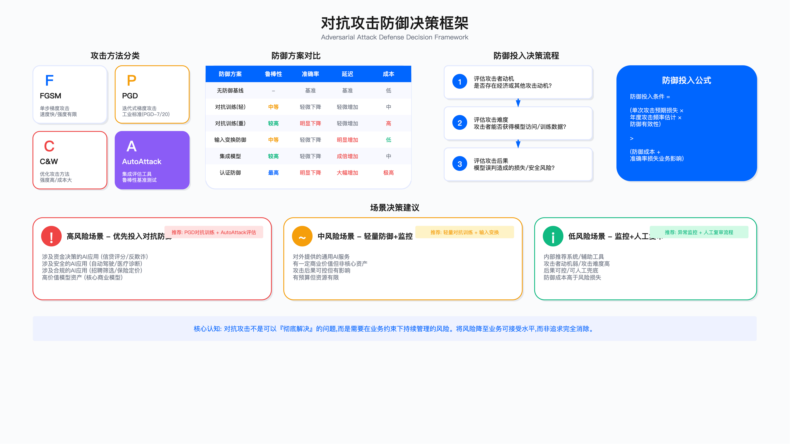

# 18.4　对抗性攻击与防御

> 导读：本节从数学直觉出发解释对抗样本为何不可避免（18.4.1），然后给出攻击分类法（18.4.2）和防御比较框架（18.4.3），最后提供生产级实现（18.4.4–18.4.5）。如果你是决策者，重点读 18.4.1 的业务语言解释和 18.4.3 的防御选型；如果你是工程师，重点读代码实现部分。

---

## 18.4.1 对抗样本的数学直觉

### 为什么对抗样本不可避免

理解对抗样本，需要先理解神经网络的本质：它是一个高维空间中的非线性函数，将输入映射到输出（类别标签）。这个空间的维度极高——一张 224×224 的彩色图像有 150,528 个维度。

在这个高维空间中，每个类别的"决策边界"是一个超曲面。从正常样本出发，沿特定方向移动极小距离就能穿越决策边界到达另一个类别区域——这一现象由 Szegedy 等人在 2013 年首次系统报告[1]，Goodfellow 等人随后给出"高维空间中模型的局部线性性足以解释对抗样本"的解释，并据此提出单步的 FGSM 攻击[2]。

需要区分两点：对抗样本的普遍存在性有充分的实验证据与理论解释，但"任何连续函数的决策边界附近必然存在脆弱点"并不是一条已被普遍证明的定理，本书不作此断言。工程上可以接受的结论是：迄今没有任何训练方法能完全消除对抗脆弱性，防御的目标是抬高攻击成本而非归零风险。

对决策者的业务语言解释：假设你的人脸识别系统在正常照片上准确率 99.5%，这意味着在 200 张照片中会有 1 张出错。对抗攻击利用数学手段，专门找到这类"错误边界"，使攻击者能够可靠地制造出让系统出错的输入。这不是因为你的系统质量差——哪怕是世界最顶级的模型也有类似的脆弱性。

### 对抗扰动的三个关键参数

要把上面的几何直觉落到可操作的攻防语言，就得知道扰动本身由哪几个旋钮控制。下面这张表把攻击者手里的三个核心旋钮拆开：它们分别决定"扰动看起来有多明显""攻击者愿意花多少算力""攻击的野心有多大"。三个旋钮共享一条主线——每个都在隐蔽性、强度与代价之间做交换，没有免费的午餐。

| 参数 | 含义 | 业务含义 |
|-----|-----|---------|
| ε（epsilon） | 扰动幅度上限（Lp 范数约束） | ε 越小，扰动越不可见，攻击越隐蔽 |
| 攻击步数 | 迭代优化步骤数 | 步数越多，攻击越强，计算越慢 |
| 攻击目标 | 有目标（指定错分类）vs 无目标（任意错分类） | 有目标攻击更危险但更难 |

这三个参数不只是攻击者的旋钮，也是防御方评估时必须固定的实验条件。后面 18.4.4 的对抗训练与业务方沟通模板中，ε 与攻击步数会反复出现——它们既是攻击强度的度量，也是复现攻防实验的前提。脱离具体 ε 和步数谈"攻击成功率"没有意义，这也是为什么后文所有指标都要求写明这两个值。

---

## 18.4.2 攻击分类法

### 按攻击者知识分类

面对同一个模型，攻击者掌握多少内部信息，直接决定他能用什么手段、成本有多高。所以第一刀就按"攻击者知道什么"来切——这是最重要的分类维度，也是防御策略选择的起点。下表从白盒到黑盒，本质上是攻击者信息量递减、攻击难度递增的一条谱线；具体算法名不重要，重要的是威胁模型落在哪一档。

这是最重要的分类维度，直接决定防御策略选择。

| 攻击类型 | 攻击者知识 | 代表算法 | 攻击难度 | 现实威胁 |
|---------|---------|---------|---------|---------|
| 白盒攻击 | 完整模型结构、参数、梯度 | FGSM、PGD、C&W | 低（攻击成功率高） | 内部人员、模型泄露后 |
| 灰盒攻击 | 部分知识（训练集、架构） | 迁移攻击、ZOO | 中 | 已知目标系统信息时 |
| 黑盒攻击 | 仅能查询输出（无梯度） | 迁移攻击、NES | 高（需大量查询） | 外部攻击者的主要手段 |

"我们只会遇到黑盒攻击，所以只按黑盒设防"是一种危险的误解。评估方法论的要点在于：白盒测试的目的是逼出防御能力的天花板，并不用来模拟真实攻击者。

白盒攻击是安全评估的基准：虽然实际攻击者通常只能做黑盒攻击，但白盒攻击提供了防御能力的上界——如果白盒攻击成功率仍然很高，说明防御措施不足。安全团队应该用白盒攻击评估系统，用黑盒攻击评估现实风险。

### 按攻击方法分类

上一张表回答"攻击者知道什么"，这一张回答"具体用哪把刀"。这里列的不是给攻击者的菜单，而是给防御方的评估工具箱——每种算法对应一个测试目的，每一行都是一个测试用例：FGSM 是最粗的冒烟测试，PGD 是标准回归基准，C&W 用来量防御的极限，AutoAttack 用来避免自欺欺人，物理攻击则专供落到真实世界的场景。

| 算法 | 特点 | 适用评估场景 | 原始出处 |
|-----|-----|------------|---------|
| FGSM | 单步梯度攻击，速度最快 | 快速基准测试，验证系统是否完全无防御 | Goodfellow 等，ICLR 2015[2] |
| PGD | 多步投影梯度攻击，标准强度 | 标准对抗鲁棒性评估基准 | Madry 等，ICLR 2018[3] |
| C&W | 最小扰动优化，攻击力最强 | 评估防御的上限 | Carlini & Wagner，IEEE S&P 2017[4] |
| AutoAttack | 四种攻击集成、无需调参，减少评估偏差 | 论文与内部评估的标准攻击集 | Croce & Hein，ICML 2020[5] |
| 物理攻击 | 打印贴纸等真实物理扰动 | 安防摄像、自动驾驶等物理场景 | 见 18.4.9 多模态与物理攻击 |

表里 AutoAttack 单独占一行，背后是一个反复被验证的教训：只用一种攻击算法评估，很容易得到"看起来很鲁棒"的假象。它之所以是评估的守门员，原因如下。

AutoAttack 的重要性：Croce 与 Hein 用 AutoAttack 重新评估了当时公开的数十种防御方法，发现其中绝大多数报告的鲁棒精度被显著高估，多个防御在无需调参的集成攻击下失效[5]。结论很直接——用单一攻击算法、或用需要手工调参的攻击评估防御效果，往往过于乐观；内部验收也应把 AutoAttack 作为守门员。

---

## 18.4.3 防御比较框架

### 主流防御方法对比

攻击方法讲完，问题转到防御侧：面对上述攻击谱线，我们手里有哪些牌，各要付什么代价？下表把五种主流防御并排放，横向比较它们的原理、实际效果和代价。这里最该盯住的是效果与代价的比值，而非"实际效果"那一列的高低——防御选型选的从来是性价比和场景匹配度最高的那一档，不是最强的那一档。

| 防御方法 | 核心原理 | 实际效果 | 代价 | 推荐场景 |
|---------|---------|---------|-----|---------|
| 对抗训练（PGD-AT[3]） | 用对抗样本扩充训练集 | 高（当前最有效） | 训练成本 2-5 倍；准确率下降 1-5%（本书示例口径，实际值随数据集、ε 与模型规模变化很大） | 高价值决策系统 |
| 随机平滑（Randomized Smoothing[6]） | 高斯噪声随机化输入 | 中高（可给出 L2 半径下的可证明鲁棒性保证） | 推理成本高；准确率下降 | 需要认证防御保证时 |
| 输入预处理 | JPEG 压缩/高斯模糊破坏扰动 | 低（易被自适应攻击绕过） | 低 | 不推荐作为主要防御 |
| 模型集成 | 多模型投票降低攻击成功率 | 中 | 推理成本 N 倍 | 对抗训练的补充 |
| 特征压缩 | 降维压缩破坏高频扰动 | 低-中（易绕过） | 低 | 仅辅助使用 |

表里"输入预处理"和"特征压缩"效果都被标成低，却依然列出来，是因为它们便宜、常被误当成主力防线。这张表有两条主结论：一是便宜的预处理靠不住，二是最贵的对抗训练反而最值得投，下面两段分别展开。

为什么输入预处理效果有限：JPEG 压缩在破坏对抗扰动的同时，也破坏了正常图像的高频细节，导致误报率升高。更重要的是，自适应攻击者可以生成对压缩操作鲁棒的对抗样本——攻防是一场持续的军备竞赛。

对抗训练是当前最可靠的防御：代价是准确率-鲁棒性权衡（accuracy-robustness trade-off），即提升对抗鲁棒性必然以牺牲干净样本准确率为代价。这个权衡没有办法完全避免，只能通过更好的训练策略（如 TRADES、MART）来减小。

---

## 18.4.4 生产级对抗训练实现

### 为什么需要生产化的对抗训练

学术论文中的对抗训练实现通常面向研究，不适合直接用于生产：没有断点续训、没有混合精度优化、没有监控钩子、没有分布式训练支持。以下实现针对工程生产场景设计。

下面这段代码有一个整体图景。对抗训练的核心思想只有一句话：在训练时就把攻击者会用的对抗样本喂给模型，让它提前见过世面。这里采用的是 Madry 等人形式化的"内层最大化—外层最小化"鞍点问题，用 PGD 求解内层[3]，这也是目前经受住 AutoAttack 检验最多的一类经验防御。整个类围绕两件事展开——`generate_pgd_attack` 负责"造出攻击样本"，`train_epoch` 负责"用攻击样本和干净样本混着训"。类的文档字符串把关键设计决策、超参数选择指南和已知局限都写在了显眼处，这是刻意的：它同时是代码，也是给运维和业务方看的一份契约。文档字符串定下基调，两个方法则把这些决策落地。

这里的几个默认值都有出处，对应 18.4.1 讲过的三个旋钮：`epsilon` 是扰动上限，`pgd_steps` 是攻击步数，`alpha` 是每步走多远（约 ε/4，让多步迭代不会一步冲出 ε 球），`adv_ratio` 则是混合训练里对抗样本的占比。把它们做成 `config` 传入而非写死，正是为了让不同业务能按自己的准确率-鲁棒性权衡去调。

```python
class ProductionAdversarialTraining:
    """
    生产级对抗训练实现

    关键设计决策：
    1. 使用 PGD 生成对抗样本（比 FGSM 更强，比 C&W 更快）
    2. α（步长）设为 ε/4，平衡攻击强度和计算效率
    3. 随机初始化（random_start=True）避免攻击陷入局部最优
    4. 混合训练（对抗样本 + 干净样本）防止过拟合到对抗分布

    超参数选择指南：
    - ε（扰动上限）：图像任务通常 8/255（L∞）；从小值开始实验
    - pgd_steps：7-10 步（更多步数收益递减，计算成本线性增加）
    - 对抗样本比例：50% 是常用初始值；可根据准确率-鲁棒性权衡调整

    已知局限：
    - 对白盒自适应攻击效果最好，对迁移攻击效果中等
    - 训练时间 2-5 倍增加（取决于 pgd_steps）
    - 干净样本准确率通常下降 1-5%（必须告知业务方并获得确认）
    """

    def __init__(self, model, optimizer, config: dict):
        self.model = model
        self.optimizer = optimizer
        self.epsilon = config.get('epsilon', 8/255)
        self.alpha = config.get('alpha', 2/255)      # 步长 ≈ ε/4
        self.pgd_steps = config.get('pgd_steps', 7)
        self.adv_ratio = config.get('adv_ratio', 0.5)  # 对抗样本占比
        self.device = next(model.parameters()).device  # 数据与模型同设备

    def generate_pgd_attack(self, x, y, random_start: bool = True):
        """
        PGD（Projected Gradient Descent）攻击生成

        原理：
        - 在 ε 球内沿损失函数梯度方向迭代更新输入
        - 每步更新后投影回 ε 球（确保扰动不超限）
        - 随机初始化让攻击从不同起点出发，避免局部最优

        关键行：
        - delta.requires_grad_(True)：必须对扰动开启梯度追踪
        - delta.grad.data.sign()：FGSM 的核心，沿梯度符号方向移动
        - delta.clamp(-self.epsilon, self.epsilon)：投影操作，保持 L∞ 约束
        - x.clamp(0, 1)：确保生成的图像像素值合法
        """
        delta = torch.zeros_like(x)

        if random_start:
            # 随机初始化：在 ε 球内均匀采样起点
            delta = torch.empty_like(x).uniform_(-self.epsilon, self.epsilon)
            delta = torch.clamp(x + delta, 0, 1) - x

        delta.requires_grad_(True)

        for step in range(self.pgd_steps):
            # 前向传播：计算对抗样本的损失
            output = self.model(x + delta)
            loss = F.cross_entropy(output, y)

            # 反向传播：获取对扰动的梯度
            self.model.zero_grad()
            loss.backward()

            # 梯度符号更新：沿损失增大方向移动
            with torch.no_grad():
                delta.data = delta.data + self.alpha * delta.grad.data.sign()
                # 双重 clamp：先限制扰动幅度，再限制像素值范围
                delta.data = torch.clamp(delta.data, -self.epsilon, self.epsilon)
                delta.data = torch.clamp(x + delta.data, 0, 1) - x

            # 重置梯度（防止梯度累积）
            delta.grad.zero_()

        return delta.detach()

    def train_epoch(self, train_loader, epoch: int) -> dict:
        """
        一个 epoch 的对抗训练

        混合训练策略：adv_ratio 的样本做对抗训练，其余做正常训练
        这个混合比例影响准确率-鲁棒性权衡，需要根据业务需求调整
        """
        self.model.train()
        total_loss = 0.0
        adv_correct = 0
        clean_correct = 0
        total_samples = 0

        for batch_idx, (x, y) in enumerate(train_loader):
            x, y = x.to(self.device), y.to(self.device)

            # 决定这个 batch 的训练模式
            use_adversarial = (torch.rand(1).item() < self.adv_ratio)

            if use_adversarial:
                # 对抗训练路径
                delta = self.generate_pgd_attack(x, y)
                x_adv = x + delta
                output = self.model(x_adv)
                loss = F.cross_entropy(output, y)
                adv_correct += (output.argmax(1) == y).sum().item()
            else:
                # 正常训练路径（保留干净样本准确率）
                output = self.model(x)
                loss = F.cross_entropy(output, y)
                clean_correct += (output.argmax(1) == y).sum().item()

            self.optimizer.zero_grad()
            loss.backward()
            self.optimizer.step()

            total_loss += loss.item()
            total_samples += len(y)

        return {
            "epoch": epoch,
            "avg_loss": total_loss / len(train_loader),
            "adv_accuracy": adv_correct / (total_samples * self.adv_ratio + 1e-8),
            "clean_accuracy": clean_correct / (total_samples * (1 - self.adv_ratio) + 1e-8)
        }
```

`generate_pgd_attack` 解析：PGD 的全部精髓是一个"走一步、拉回来"的循环。循环体内先做前向传播算出损失，再反向传播拿到损失对扰动 `delta` 的梯度；`delta.grad.data.sign()` 只取梯度的符号方向，这正是 FGSM 的核心思想，意思是"不管梯度多大，都朝让模型出错最快的方向迈固定一步"。真正体现"P"（Projected，投影）的是紧跟其后的双重 `clamp`：第一个把扰动幅度压回 ε 球，保证攻击仍然"人眼不可见"；第二个把加了扰动的图像像素压回 [0,1] 合法范围，保证生成的还是一张真实存在的图。随机初始化（`random_start`）则是在循环开始前把起点随机撒进 ε 球，避免每次都从原点出发陷入同一个局部最优——它让训练时见到的对抗样本更多样。

`train_epoch` 解析：这里体现的是文档字符串里的第 4 条设计决策——混合训练。每个 batch 用一次随机抛硬币（`torch.rand(1).item() < self.adv_ratio`）决定走对抗路径还是干净路径，`adv_ratio` 就是硬币的偏向。走对抗路径时先造对抗样本再训练，走干净路径时直接用原图训练。之所以要保留干净路径，是因为如果全用对抗样本，模型会过拟合到对抗分布，反而在正常输入上掉点——这就是文档里"防止过拟合到对抗分布"的工程含义。返回字典里把对抗准确率和干净准确率分开统计，正是为了实时暴露那条准确率-鲁棒性权衡曲线，而不是等训练完才发现干净准确率崩了。

生产环境常见坑：文档字符串的"已知局限"三条写的是真实会被踩的坑，不是免责声明。第一，这套训练对白盒自适应攻击最有效，对迁移攻击只是中等——如果威胁模型主要是外部黑盒攻击者，别指望它包治百病。第二，训练时间 2–5 倍的膨胀直接冲击排期和算力预算，`pgd_steps` 每加一步，每个对抗 batch 就多一次完整前反向传播。第三，也是最容易引发事故的一条：干净样本准确率会下降，必须在项目启动前告知业务方并拿到确认，否则上线后"识别率怎么反而降了"会变成一场无法收场的甩锅。

### 业务方沟通模板

上面那条"必须告知业务方并获得确认"不能停在口头，得落成一份可签字的文档。下面这个模板的用途很直白：把对抗训练的代价从工程黑话翻译成业务方能决断的取舍，并留下签字栏形成契约。注意模板里所有数字都是方括号占位符，配套注释反复强调"以实测为准"——这是刻意的红线：对抗训练的准确率下降幅度、训练时间倍数在不同模型和数据集上差异极大，任何预先承诺的具体数字都是不负责任的。这个模板的重点在于逼着团队在实施前就把实测基准、实测预期、业务确认三件事摆到台面上，填什么值反倒次要。

```
对抗训练影响评估报告

实施前基准（填入实测值）：
  干净样本准确率：[填入实测基准值，如 XX.X%]
  FGSM 攻击成功率：[填入 ε=8/255 下实测值]（ε=8/255）
  PGD 攻击成功率：[填入步数=7 下实测值]（步数=7）

实施后预期（填入实验实测值）：
  干净样本准确率：[填入对抗训练后实测值]
  FGSM 攻击成功率：[填入 PGD 对抗训练后 FGSM 攻击成功率实测值]
  PGD 攻击成功率：[填入 PGD 对抗训练后 PGD 攻击成功率实测值]

业务影响确认：
  □ 接受干净样本准确率下降（具体幅度以实验报告为准，不同模型和数据集差异显著）
  □ 接受训练时间增加（具体倍数取决于 pgd_steps 和硬件配置，需以实际实验数据为准）
  □ 接受对新型攻击的不完全防护

业务负责人签字：_______  日期：_______
```

留意基准与预期两栏都要求写明 ε 和步数——这正是 18.4.1 埋下的伏笔：脱离攻击强度参数的成功率是没有可比性的空话。三个勾选框对应三类必须被业务方主动接受的代价：准确率下降、训练时间、以及对新型攻击的不完全防护。少了任何一个签字，都意味着风险在没有知情的情况下被默默转嫁给了业务方。

---

## 18.4.5 生产级输入防御管道

输入防御管道是部署后的实时防护，与离线对抗训练互补：训练提升模型鲁棒性，运行时管道拦截明显的攻击。

如果说对抗训练是"练兵于平时"，那么这条管道就是"设卡于线上"。它的设计哲学是分层过滤、快速失败：三层检测按延迟从小到大排列（频域 → 压缩 → 统计），越便宜的检查越靠前，一旦某层命中就立即返回，不再往后跑。这样绝大多数正常样本只需过一两层就放行，只有可疑样本才会走完全程。这个类有两条线：一是 `process` 方法里三层检测的先后顺序和各自的返回结构；二是每层返回里都带的 `recommendation` 字段——它把"检测到攻击后怎么办"的决策权交还给了业务场景。

`__init__` 里的三个阈值（高频能量占比、JPEG 质量、统计 Z-score）都是可配置的，文档字符串明确写着"不能直接用论文值"——这是整条管道最容易被忽视的前提，后面会展开。

```python
class InputDefensePipeline:
    """
    生产环境输入防御管道

    分层防御设计：
    D1 频域分析：对抗扰动通常集中在高频分量（快速，延迟 < 5ms）
    D2 特征压缩：通过降维破坏高频对抗扰动（延迟 < 10ms）
    D3 统计检测：检测输入分布偏离正常范围（延迟 < 20ms）

    使用建议：
    - D1 和 D2 作为轻量预过滤，减少到达 D3 的样本量
    - 任一层检测到攻击，可选择拒绝或标记人工复核
    - 阈值需要在业务数据上校准，不能直接用论文值

    核心局限：
    - 所有预处理防御对自适应攻击（攻击者知道防御存在）效果有限
    - 不应作为唯一防线，必须与对抗训练结合使用
    - 高频能量阈值对不同图像类型差异较大，需要分类型校准
    """

    def __init__(self, config: dict):
        self.high_freq_threshold = config.get('high_freq_threshold', 0.3)
        self.jpeg_quality = config.get('jpeg_quality', 75)
        self.stat_threshold = config.get('stat_threshold', 3.0)  # Z-score

    def process(self, image_tensor) -> dict:
        """
        三层防御管道，快速失败设计

        失败策略：任一层检测到攻击时，返回 is_safe=False 和建议动作
        建议动作有两种：'reject'（直接拒绝）或 'human_review'（人工复核）
        高风险场景（安防）用 reject；高可用场景（电商）用 human_review
        """
        # D1：频域高频能量分析
        freq_result = self._analyze_frequency(image_tensor)
        if freq_result['high_freq_ratio'] > self.high_freq_threshold:
            return {
                'is_safe': False,
                'detection_layer': 'frequency',
                'score': freq_result['high_freq_ratio'],
                'recommendation': 'human_review'
            }

        # D2：JPEG 压缩降噪
        compressed = self._jpeg_compress(image_tensor, self.jpeg_quality)
        diff = torch.abs(image_tensor - compressed).mean().item()
        if diff > 0.05:  # 压缩前后差异过大，说明存在高频噪声
            return {
                'is_safe': False,
                'detection_layer': 'compression',
                'diff_score': diff,
                'recommendation': 'human_review'
            }

        # D3：统计分布检测（检测输入是否偏离正常分布）
        stat_result = self._statistical_detection(image_tensor)
        if stat_result['z_score'] > self.stat_threshold:
            return {
                'is_safe': False,
                'detection_layer': 'statistical',
                'z_score': stat_result['z_score'],
                'recommendation': 'human_review'
            }

        return {'is_safe': True, 'processed_input': compressed}

    def _analyze_frequency(self, image_tensor) -> dict:
        """
        频域分析

        原理：对抗扰动通常表现为高频噪声（人眼不可见，但模型敏感）
        实现：FFT 后计算高频区域的能量占总能量的比例
        局限：低频对抗攻击（如颜色偏移攻击）无法被此方法检测

        关键行：
        - fftshift：将零频分量移到频谱中心，便于区分高低频区域
        - high_freq_mask：环形掩码，选取距中心 40% 以外的高频区域
        """
        import numpy as np

        img_np = image_tensor.numpy()
        if len(img_np.shape) == 3:
            img_np = img_np.mean(axis=0)  # 灰度化

        # 二维 FFT
        fft = np.fft.fft2(img_np)
        fft_shift = np.fft.fftshift(fft)
        magnitude = np.abs(fft_shift)

        h, w = magnitude.shape
        center_h, center_w = h // 2, w // 2
        Y, X = np.ogrid[:h, :w]
        dist = np.sqrt((X - center_w)**2 + (Y - center_h)**2)
        radius = min(h, w) * 0.4

        # 高频区域：距中心距离 > radius（对抗扰动主要集中在此）
        high_freq_mask = dist > radius
        high_freq_energy = magnitude[high_freq_mask].sum()
        total_energy = magnitude.sum()

        return {
            'high_freq_ratio': high_freq_energy / (total_energy + 1e-8),
            'method': 'fft_analysis'
        }

    def _jpeg_compress(self, image_tensor, quality: int):
        """JPEG 压缩（破坏高频对抗扰动，但也会破坏正常高频细节）"""
        from PIL import Image
        import io

        img = Image.fromarray(
            (image_tensor.numpy().transpose(1, 2, 0) * 255).astype('uint8')
        )
        buffer = io.BytesIO()
        img.save(buffer, format='JPEG', quality=quality)
        buffer.seek(0)
        compressed = Image.open(buffer)
        return torch.from_numpy(
            np.array(compressed).transpose(2, 0, 1).astype('float32') / 255.0
        )

    def _statistical_detection(self, image_tensor) -> dict:
        """
        统计异常检测

        原理：正常图像的像素统计特性（均值、标准差、分布）
              相对稳定；对抗样本可能破坏这些统计特性
        限制：自适应攻击可以在生成对抗样本时约束统计特性
        """
        import numpy as np
        img_np = image_tensor.numpy()

        mean = img_np.mean()
        std = img_np.std()

        # 与正常图像统计基线比较（需要在业务数据上建立基线）
        # 这里使用占位值，生产环境需替换为实际基线
        baseline_mean = 0.5
        baseline_std = 0.25

        z_score = abs(mean - baseline_mean) / (baseline_std + 1e-8)

        return {
            'mean': float(mean),
            'std': float(std),
            'z_score': float(z_score)
        }
```

三层检测的原理：三个检测方法各自盯住对抗扰动的一个统计痕迹，互为补充。`_analyze_frequency` 抓的是"高频噪声"——它先做二维 FFT，用 `fftshift` 把零频分量搬到频谱中心，这样以中心为圆心画一个半径（代码里取短边的 40%），圆外就是高频区，圆内是低频区；然后算高频能量占总能量的比例。对抗扰动往往表现为人眼看不见但模型敏感的高频噪声，所以这个比例偏高就是可疑信号。`_jpeg_compress` 走的是另一条思路——用有损压缩把高频细节"抹掉"，再比对压缩前后的差异；如果一张图压缩前后差得很多，说明它含有大量会被压掉的高频成分，同样指向对抗扰动。`_statistical_detection` 则退到最粗的粒度，看整张图的均值、标准差是否偏离正常基线，用 Z-score 衡量偏离程度。三者从"频域—压缩—统计"由细到粗，命中任一层就足以拉响警报。

关键设计与权衡：`process` 返回结构里最值得玩味的是 `recommendation` 字段。管道本身不替业务做"拒绝还是放行"的决定，而是给出 `reject`（直接拒绝）或 `human_review`（转人工复核）两种建议，把最终裁量权留给场景——安防这类高风险场景倾向直接拒，电商这类高可用场景倾向转人工，宁可多花人力也不轻易拦截真实用户。这种"检测与处置分离"的设计，让同一条管道能服务风险偏好完全不同的业务。快速失败的顺序安排也是权衡的结果：把最便宜的频域分析放最前，就是为了让大部分正常流量在第一层就低成本放行。

生产环境常见坑：文档字符串里的三条局限和几处代码注释，标出了这条管道最容易翻车的地方。第一，`_statistical_detection` 里的 `baseline_mean = 0.5`、`baseline_std = 0.25` 是明晃晃的占位值，注释也写了"生产环境需替换为实际基线"——直接带着这两个数上线，等于用别人的尺子量自己的布，误报率会失控。这也呼应了文档里"阈值不能直接用论文值""高频能量阈值需要分类型校准"的告诫：卡通图、医疗影像、自然照片的高频分布天差地别，一套阈值走天下必然误伤。第二，也是最根本的一条，所有这些预处理检测面对自适应攻击（攻击者知道你装了这道卡）效果都有限——攻击者完全可以在生成对抗样本时顺手约束住频域能量和统计特性，绕过整条管道。所以文档反复强调：它绝不能当唯一防线，必须和 18.4.4 的对抗训练配合使用，一个练内功、一个守门口，缺一不可。

---

## 18.4.6 认证防御（Randomized Smoothing）

对抗训练能提升模型鲁棒性，但无法提供数学证明。认证防御（Certified Defense）通过随机平滑技术，为模型的预测提供可证明的鲁棒性保证：在半径 R 内的任何扰动，模型预测不会改变。下文实现依据 Cohen、Rosenfeld 与 Kolter 在 ICML 2019 给出的随机平滑方案[6]——需要注意其保证的范围：认证半径是 L2 范数意义下的，对 L∞ 或语义级扰动不能直接套用。

前两种防御都只能给出"经验上更难攻破"的结论，而这一节要的是"数学上可证明"。它的适用场景和代价非常极端，值得先摆明再看代码。

适用场景：需要向监管机构或高价值客户证明 AI 系统安全性的场景。

代价：推理成本约为普通推理的 100 倍（需要 N 次带噪声采样），且认证准确率低于标准准确率。

这两句话定下了这段代码的基调：认证防御不是为了跑得快，而是为了拿到一张能给监管看的"数学证书"，代价是把一次推理放大成上千次采样。下面这个类把这套"加噪声—投票—算半径"的流程实现出来。它的核心直觉是：在输入上撒一把高斯噪声后，模型绝大多数时候仍然投给同一个类别，那么这个预测就是"稳"的，稳到可以用统计学给出一个不会翻盘的扰动半径 R。文档字符串里那三行公式和 σ、p_A、Φ⁻¹、R 的定义，就是这个直觉的数学表达；不必逐符号推导，核心权衡是"σ 越大、认证半径越大但准确率越低"。

```python
class CertifiedDefense:
    """
    随机平滑认证防御

    原理：
    对输入 x 添加高斯噪声 δ ~ N(0, σ²I)，
    平滑分类器 g(x) = argmax P[f(x+δ) = c]
    可以证明：当 ||Δ|| < R = σ·Φ⁻¹(p_A) 时，g(x+Δ) = g(x)

    其中：
    - σ：噪声标准差（越大，认证半径越大，准确率越低）
    - p_A：最高置信类别的预测概率
    - Φ⁻¹：正态分布的反函数
    - R：认证鲁棒半径（在此半径内有数学保证）

    参数选择原则：
    - σ = 0.12：低噪声，高准确率，小认证半径（用于高准确率要求场景）
    - σ = 0.25：平衡选择（常用默认值）
    - σ = 0.50：大噪声，低准确率，大认证半径（用于高安全要求场景）

    生产坑点：
    - N=1000 次采样是准确率和计算成本的折中；论文通常用 N=100000
    - 高斯平滑改变模型的推理行为，需要用加噪声数据重新训练基础模型
    - 认证失败（ABSTAIN）意味着噪声下预测不稳定，不等于被攻击
    """

    def __init__(self, base_model, num_classes: int, sigma: float = 0.25,
                 n_samples: int = 1000):
        self.model = base_model
        self.num_classes = num_classes
        self.sigma = sigma
        self.n_samples = n_samples

    def certify(self, x, alpha: float = 0.001) -> dict:
        """
        认证预测

        alpha：错误率上界（统计保证的置信水平）
        通常取 0.001（99.9% 置信度）

        返回：
        - prediction：预测类别（ABSTAIN 表示无法给出有把握的预测）
        - certified_radius：数学保证的鲁棒半径
        - p_A_lower：最高置信类别概率的下界（用于计算认证半径）
        """
        # 步骤 1：Monte Carlo 采样，统计各类别预测频次
        counts = self._sample_predictions(x, self.n_samples)

        # 步骤 2：确定最高和次高频类别
        top_two = counts.argsort()[-2:]
        cA = top_two[-1]  # 最高频类别
        nA = counts[cA]   # 其预测次数

        # 步骤 3：单侧二项置信下界（Clopper-Pearson 方法）
        # 在 alpha 置信水平下，nA/n_samples 的真实下界
        from scipy.stats import binom
        p_A_lower = binom.ppf(alpha, self.n_samples, nA / self.n_samples) / self.n_samples

        # 步骤 4：决定是否可以给出认证预测
        if p_A_lower < 0.5:
            # 无法以足够高的置信度确定预测类别
            return {
                'prediction': 'ABSTAIN',
                'certified_radius': 0.0,
                'p_A_lower': float(p_A_lower),
                'note': 'Prediction not stable enough under noise'
            }

        # 步骤 5：计算认证半径
        from scipy.stats import norm
        certified_radius = self.sigma * norm.ppf(p_A_lower)

        return {
            'prediction': int(cA),
            'certified_radius': float(certified_radius),
            'p_A_lower': float(p_A_lower),
            'certifiable': True
        }

    def _sample_predictions(self, x, n: int) -> 'np.ndarray':
        """
        带噪声的 Monte Carlo 采样

        每次推理添加独立的高斯噪声，统计预测频次
        这是认证防御计算开销高的主要原因
        """
        import numpy as np
        counts = np.zeros(self.num_classes, dtype=int)

        with torch.no_grad():
            for _ in range(n):
                noise = torch.randn_like(x) * self.sigma
                noisy_x = x + noise
                pred = self.model(noisy_x.unsqueeze(0)).argmax(dim=1).item()
                counts[pred] += 1

        return counts
```

`certify` 五步解析：这个方法把上面的直觉拆成了一条流水线。步骤 1 调 `_sample_predictions` 对同一张图加 N 次不同的高斯噪声、各推理一次，统计每个类别被投中多少次——这就是"撒噪声后看模型往哪投"的具体实现，也是整套方法开销高达百倍的根源。步骤 2 挑出得票最高的类别 `cA`。步骤 3 是全篇最关键的一步：它不直接用"得票率"当置信度，而是用 Clopper-Pearson 二项置信下界算出这个得票率在给定 `alpha`（错误率上界）下的保守下界 `p_A_lower`——换句话说，宁可低估也不高估，这样后面给出的半径才是可信的下界而非乐观的估计。步骤 4 的分水岭很直白：如果连保守下界都不到 0.5，说明模型在噪声下投票根本不稳，直接返回 `ABSTAIN`（弃权），不硬给结论。只有过了这道坎，步骤 5 才用 σ·Φ⁻¹(p_A_lower) 算出认证半径——σ 是选定的噪声强度，Φ⁻¹ 把概率下界翻译成半径。整条链路的精神是：把"我大概率对"升级成"我在这个半径内可证明地对"。

关键设计与权衡：文档里的参数选择原则本质是一条滑块——σ 从 0.12 到 0.50，是在"干净准确率"和"认证半径"之间滑动。要高准确率就用小 σ，但换来的证书半径小、能挡的扰动有限；要能挡大扰动就用大 σ，但干净准确率随之下降。没有两全，只能按场景取舍。`n_samples` 默认 1000 同样是折中：文档指出论文常用十万级采样以逼近真实分布，生产上千已是准确率与算力的妥协，采样越少，`p_A_lower` 的估计越保守、半径越可能缩水。

生产环境常见坑：三条坑点各指向一类真实事故。第一，N=1000 的采样量决定了这套方法天生慢，把它塞进低延迟在线服务基本行不通，更适合离线出具认证报告的场景——这也和本节开头"约 100 倍推理成本"的代价前后呼应。第二，最容易被忽略的一条：高斯平滑改变了模型的推理行为，直接拿一个普通训练出来的模型来跑随机平滑，认证准确率会很难看，必须用加噪声的数据重新训练基础模型，否则整套流程建在沙上。第三，务必把 `ABSTAIN` 理解对——它是"噪声下预测不稳定，我不敢下结论"，不等于"检测到攻击"。把弃权当成告警去处置，会制造大量假阳性，反而淹没真正的风险信号。

---

## 18.4.7 场景化防御决策指南


*图 18.6：对抗攻击防御框架——各类防御手段与它们对应的威胁档位和代价；读者要按自己场景的威胁类型倒推防御组合，而非从"最强防御"往下挑*

### 按业务场景选择防御组合

前面几节把每种防御的原理和代价都摆清楚了，但工程师面对具体业务时真正要回答的是："我这个场景到底该组合哪几种？"下表就是这个问题的落地答案。它不是从"最强防御"里挑，而是从"威胁类型"倒推防御组合——先看主要威胁落在攻击谱线的哪一档（18.4.2），再看对应的推荐组合和它要求接受的关键权衡。"关键权衡"那一列就是决策的成本标签：任何组合都要先在某个维度上认赔。

| 业务场景 | 主要威胁 | 推荐防御组合 | 关键权衡 |
|---------|---------|------------|---------|
| 人脸识别（安防） | 白盒/物理攻击 | 对抗训练 + 多模型集成 + 人工复核 | 鲁棒性优先，接受准确率小幅下降 |
| 内容审核 | 黑盒逃逸 | 对抗训练 + 输入频域检测 | 误报率约束严格（避免用户体验损失） |
| 医疗影像诊断 | 白盒攻击（内部） | 认证防御 + 严格人工复核 | 安全性优先，接受高推理成本 |
| NLP 文本分类 | 字符/词替换攻击 | 对抗训练（NLP 版）+ 输入标准化 | 中文场景需专门适配 |
| LLM 应用 | 提示词注入 | Guardrails（见 18.2 和 18.3） | 与图像对抗样本防御不同 |

注意最后一行的分流：LLM 应用面对的是提示词注入这类语言层威胁，和本节讲的图像对抗样本是两套完全不同的防御范式，因此直接指回 18.2 与 18.3，避免读者误把图像防御那套硬套到文本上。医疗影像那一行则是全表唯一选用认证防御的场景，正好印证 18.4.6 的定位——只有当"需要向监管证明"的价值高到能吃下百倍推理成本时，认证防御才划算。

### 常见误区清单

选对了防御组合还不够，落地时最常见的翻车不在技术选型，而在认知偏差。下面这张误区清单是本节的"防呆表"，每一行都遵循"误区 → 识别信号 → 纠正方法"的诊断式结构：左列是错误心智，中列是你能在评估报告或方案里一眼看出的症状，右列是对应的解药。它的用法是在方案评审时逐条对照，而非通读一遍——只要中列的识别信号出现，就该拉响对应的警报。

| 误区 | 识别信号 | 纠正方法 |
|-----|---------|---------|
| 追求零攻击成功率 | 防护方案复杂度极高，误报率也高 | 接受残留风险，设定业务可接受的阈值 |
| 用单一攻击算法评估防御 | 评估报告只有 FGSM 成功率 | 使用 AutoAttack 或多算法集成评估 |
| 忽视准确率-鲁棒性权衡 | 未与业务方沟通对抗训练代价 | 实施前展示实验数据，获得业务确认 |
| 认为输入预处理足够 | 防御方案只有 JPEG 压缩 | 自适应攻击可绕过，必须配合对抗训练 |
| 部署后不更新防御 | 规则/模型超过 6 个月未更新 | 建立定期红队测试和防御更新机制 |

这五条误区其实是前面各节结论的反面教材：第二条对应 18.4.2 的 AutoAttack 守门员，第三条对应 18.4.4 的业务沟通模板，第四条对应 18.4.3 关于输入预处理靠不住的判断。它们之所以反复出现，是因为在工程实践里，这几个坑最容易被"看起来能用"的假象掩盖过去。

---

## 18.4.8 持续运营框架

对抗防御是一场持续的军备竞赛，攻防两侧的能力都在滚动升级。以下框架支撑防御能力的持续演进：

既然攻防是持续的军备竞赛，那么防御就不能是"上线即完工"的一锤子买卖。下表把持续运营拆成四类周期性活动，横轴是"频率—目的—工具"。频率那一列的节奏差异是重点：回归测试跟着模型更新走（高频、被动触发），新型攻击评估按季度走（跟踪前沿），红队演练按半年走（成本高、覆盖全），参数调优则是按需触发（误报率超标才动）。这四种节奏叠在一起，才构成一张既不漏防又不过度消耗的运营网。

| 运营活动 | 频率 | 目的 | 工具 |
|---------|-----|-----|-----|
| 标准攻击集回归测试 | 每次模型更新后 | 确保更新未降低鲁棒性 | ART + 自动化测试框架 |
| 新型攻击评估 | 季度 | 跟踪攻防前沿，及时识别新威胁 | 论文跟踪 + 专项测试 |
| 红队演练 | 半年 | 全面评估真实攻击面 | 内部/外部红队 |
| 防御参数调优 | 按需（误报率超阈值时） | 维持误报率在业务可接受范围 | A/B 测试 |

### 验证方法汇总

运营活动回答"多久做一次"，验证方法回答"每次做要测什么、达到什么才算过"。下表把鲁棒性拆成五个可独立验证的目标，每一行给出"用什么方法测—用什么工具—判定标准是什么"。它的价值在于把模糊的"我们的模型很鲁棒"翻译成一组可勾选、可复现的验收条件。注意判定标准那一列几乎都挂在"业务阈值"上，这与前文一以贯之——鲁棒性没有绝对达标线，只有相对于业务可接受风险的达标线。

| 验证目标 | 验证方法 | 工具 | 判定标准 |
|---------|---------|-----|---------|
| 白盒鲁棒性 | PGD/AutoAttack 评估 | ART | 攻击成功率 < 业务阈值 |
| 黑盒鲁棒性 | 迁移攻击评估 | TextAttack/ART | 攻击成功率 < 1.5× 白盒 |
| 物理攻击防御 | 实际环境打印测试 | 人工 | 关键场景无漏判 |
| 干净准确率保留 | 标准测试集 | 框架内置 | 下降 ≤ 业务约定阈值 |
| 误报率控制 | 正常样本误判统计 | 日志分析 | 误报率 < 1% |

这张表里白盒和黑盒鲁棒性分开验证，正是 18.4.2 "用白盒评估能力上界、用黑盒评估现实风险"那条方法论的落地；而"干净准确率保留"和"误报率控制"两行，则把 18.4.3 反复强调的准确率-鲁棒性权衡变成了必须过关的硬指标——防御做得再强，只要干净准确率或误报率突破业务约定，就算不达标。

### 运行指标

验证方法是上线前的验收，运行指标则是上线后的持续体温计。下表列出四个需要长期监控的指标，每个都配了明确的告警阈值。这些阈值都是"越过它就该有人介入"的触发器，并非拍脑袋定的红线：拦截率跌破线要审查防御是否退化，干净准确率异常下降要查是不是训练或数据出了问题，人工复核率或误报率持续偏高则说明检测阈值卡得太紧，正在误伤正常用户。

| 指标 | 含义 | 告警阈值 |
|-----|-----|---------|
| 对抗样本拦截率 | 防御系统拦截已知攻击的比例 | < 85% 触发防御审查 |
| 干净样本准确率 | 正常输入的识别准确率 | 下降超过约定阈值触发调查 |
| 人工复核触发率 | 进入人工复核的样本比例 | 持续偏高（> 5%）需优化检测阈值 |
| 高频噪声检测误报率 | 正常样本被误判为攻击的比例 | > 2% 需调整阈值 |

这四个指标恰好对应了前面代码的运行侧回声：高频噪声检测误报率直接盯着 18.4.5 那条频域检测的 D1 层，人工复核触发率则量化了 `recommendation='human_review'` 被触发的频度。当误报率或复核率报警，往往意味着 `high_freq_threshold` 之类的阈值需要按 18.4.5 强调的"在业务数据上校准"重新调整——运营指标和管道参数在这里形成了闭环。

---

## 18.4.9 多模态对抗攻击

### 问题背景

随着多模态模型（图像 + 文本、视频 + 音频等）的广泛应用，对抗攻击的攻击面也随之扩大。攻击者可能通过在一个模态中嵌入对抗扰动，影响整个多模态系统的输出。

典型场景包括：在图像中嵌入对抗补丁（adversarial patch）影响图像-文本理解系统；通过音频对抗样本干扰语音识别与后续处理；在视频帧中植入对抗扰动影响视频分析系统。

多模态带来的新问题不是"多了几个模态要各自防"，而是模态之间的融合环节本身成了新的攻击面——攻破一个模态就可能撬动整个系统的判断。下表把可用的防御措施按实施复杂度排开，供选型时权衡投入产出。其中跨模态一致性检验和融合策略审查效果最根本但复杂度最高，独立模态验证和对抗补丁检测则是复杂度适中、可以先行落地的抓手。

### 防御要点

| 防御措施 | 说明 | 实施复杂度 |
|---------|-----|-----------|
| 跨模态一致性检验 | 检查不同模态输入之间的语义一致性 | 高 |
| 独立模态验证 | 对各模态分别进行安全检查 | 中 |
| 对抗补丁检测 | 针对局部可见的对抗补丁专门检测 | 中 |
| 融合策略审查 | 评估融合机制是否易被单一模态攻击影响 | 高 |

### 适用边界

任何防御都有它管用和不管用的地界，多模态尤其如此。下表把最该优先投入防御资源的三类场景单独拎出来，配上各自的风险说明。它的作用是划定优先级边界——不是所有多模态系统都值得上跨模态一致性检验这种高复杂度手段，而这三类场景因为"单一模态被攻破即可危及整体"，风险集中，值得优先加固。

| 重点关注场景 | 风险说明 |
|------------|---------|
| 图像 + 文本智能审核 | 攻击者可通过图像绕过文本过滤 |
| 多模态身份验证 | 单一模态攻击可能影响整体验证 |
| 自动驾驶多传感器 | 传感器融合漏洞可能导致安全事故 |

三行的共同风险模式其实是一致的：系统假设各模态都可信，攻击者只需攻破其中最薄弱的一个，就能借融合机制放大影响。这也是为什么"融合策略审查"在防御要点里被标为高复杂度却不可省略——它正对着这条风险的要害。

---

## 参考文献

| # | 来源 | 标题 | 日期 | 链接 |
| --- | --- | --- | --- | --- |
| [1] | ICLR 2014（arXiv:1312.6199） | C. Szegedy, W. Zaremba, I. Sutskever, J. Bruna, D. Erhan, I. Goodfellow, R. Fergus, "Intriguing Properties of Neural Networks" | 2013-12-21 预印本 | <https://arxiv.org/abs/1312.6199> |
| [2] | ICLR 2015（arXiv:1412.6572） | I. J. Goodfellow, J. Shlens, C. Szegedy, "Explaining and Harnessing Adversarial Examples"（FGSM） | 2014-12-20 预印本 | <https://arxiv.org/abs/1412.6572> |
| [3] | ICLR 2018（arXiv:1706.06083） | A. Madry, A. Makelov, L. Schmidt, D. Tsipras, A. Vladu, "Towards Deep Learning Models Resistant to Adversarial Attacks"（PGD 与对抗训练） | 2017-06-19 预印本 | <https://arxiv.org/abs/1706.06083> |
| [4] | IEEE S&P 2017（arXiv:1608.04644） | N. Carlini, D. Wagner, "Towards Evaluating the Robustness of Neural Networks"（C&W 攻击） | 2016-08-16 预印本 | <https://arxiv.org/abs/1608.04644> |
| [5] | ICML 2020（arXiv:2003.01690） | F. Croce, M. Hein, "Reliable Evaluation of Adversarial Robustness with an Ensemble of Diverse Parameter-free Attacks"（AutoAttack） | 2020-03-03 预印本 | <https://arxiv.org/abs/2003.01690> |
| [6] | ICML 2019（arXiv:1902.02918） | J. M. Cohen, E. Rosenfeld, J. Z. Kolter, "Certified Adversarial Robustness via Randomized Smoothing" | 2019-02-08 预印本 | <https://arxiv.org/abs/1902.02918> |

---

## 导航

[← 上一节：18.3 LLM 威胁与 OWASP Top 10](./18.3_LLM威胁与防护.md) | [返回章节目录](./README.md) | [下一节：18.5 AI 数据安全与隐私 →](./18.5_AI数据安全与隐私.md)

---

© 2025-2026 AISecOps Project. Licensed under CC BY-NC-SA 4.0
