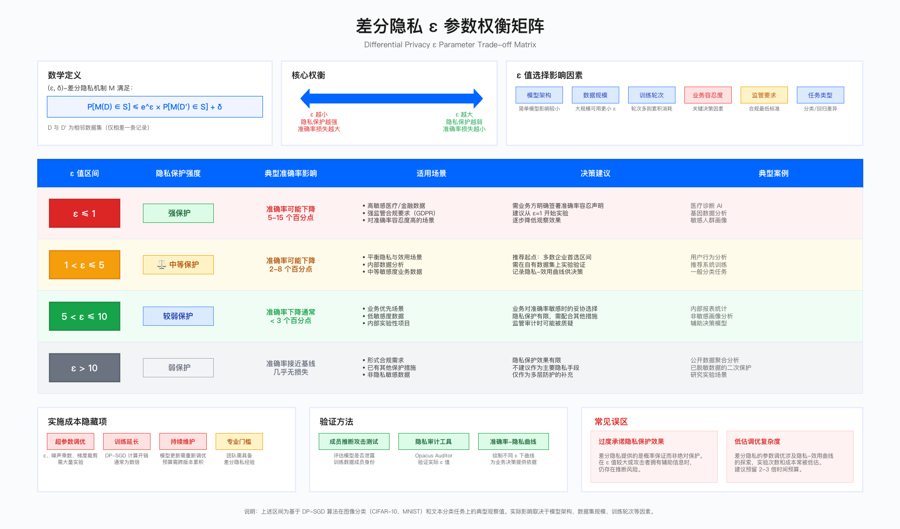
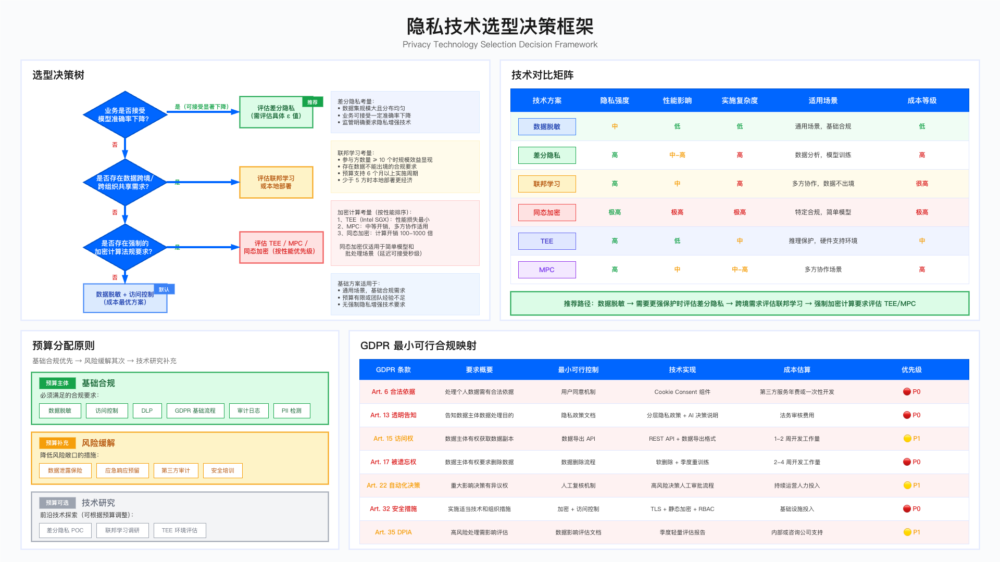

# 18.5　AI 数据安全与隐私

> 导读：本节定位为 [9.5 隐私工程](../../第03部分_数据安全与隐私/第09章_隐私合规/9.5_隐私工程实践.md) 的 AI 专项扩展，聚焦三项 AI 特有的隐私保护技术：差分隐私（18.5.2）、联邦学习（18.5.3）、同态加密（18.5.4）。如果你只需要快速通过 GDPR 基线，直接看 18.5.5 最小可行方案；如需了解与第9章的定位关系，见本节引言。

---

## 引言：AI 隐私与通用隐私合规的区别

[第9章 隐私合规](../../第03部分_数据安全与隐私/第09章_隐私合规/README.md) 讨论的是通用隐私合规（数据最小化、访问控制、数据删除）。这些措施对传统数据系统有效，但对 AI 系统有一个根本性的盲点：训练完成的模型本身就是一种"压缩记忆"。

即使删除了原始数据、加密了存储、限制了访问，模型权重中仍然编码了训练数据的统计特性。攻击者可以通过：
- 成员推断攻击：以显著高于随机猜测的准确率判断某条记录是否在训练集中——该攻击由 Shokri 等人在 IEEE S&P 2017 首次系统化，并证明只需黑盒 API 访问即可实施[3]
- 训练数据提取：通过反复查询，从模型中提取接近原始训练样本的内容
- 模型逆向攻击：从模型权重重建训练数据的分布特征

这意味着 AI 隐私保护必须在训练过程本身中嵌入隐私机制，而非仅依赖部署后的访问控制。这是本节所有技术的出发点。理解这一点，也就能理解为什么本节反复出现"在训练时加噪声""在梯度上做手脚"这类看似绕远的做法——因为传统的"事后删除"在模型这个载体上根本不成立，隐私必须在数据被"压缩"进权重之前就介入。

---

## 18.5.1 AI 数据生命周期安全

隐私工程最常见的失误，是把注意力全押在某个单点——比如只做存储加密，却任由 PII 流进训练日志。要避免这种"木桶短板"，得先有一张按阶段拆解风险的地图。下面这张表把 AI 数据从进入系统到被删除的全过程切成六段，每段对应它特有的主要风险和对应控制。横向看有一个规律：风险的性质随阶段推移在变化——前三段（采集、存储、处理）与传统数据系统大体相同，靠合规核查、加密、脱敏就能覆盖；而从"模型训练"这一段开始，风险变成了 AI 独有的"记忆"问题，控制手段也随之升级为差分隐私、机器遗忘这类本节要展开的技术。

| 阶段 | 主要风险 | 控制措施 |
|-----|---------|---------|
| 数据采集 | 数据来源不合规、未授权采集 | 数据溯源验证、合规许可核查 |
| 数据存储 | 静态数据泄露 | 加密存储、访问控制、密钥管理 |
| 数据处理 | PII 泄露到处理日志、中间结果 | 脱敏管道、安全计算环境 |
| 模型训练 | 训练过程"记忆"敏感数据 | 差分隐私训练、数据最小化 |
| 模型部署 | 成员推断、训练数据提取 | 输出过滤、查询限速、差分隐私推理 |
| 数据删除 | "被遗忘权"难以在模型中实现 | 机器遗忘、模型重训、季度更新策略 |

表格末两段（部署、删除）值得单独盯住：它们对应的是模型上线之后才暴露、且最难补救的风险——一旦模型已经带着敏感记忆对外服务，事后想"抽走"某条数据几乎无解，这也是 18.5.5 被遗忘权那一整套"等效措施"存在的根本原因。

表格前三段（采集、存储、处理）与传统数据系统同源，控制手段也同源，本节因此不重复推导，只标出它们在 AI 管道里的落点。这三段真正的工程难点不在"要不要做分类和脱敏"，而在"这么大的量怎么打得准、DLP 报出来的一堆告警怎么筛"——把 AI 用在这两件事上的做法（字段级分类流水线、分类质量的分层回归评测、DLP 告警的三层降噪、向量库的标签体检）在 [17.6](../第17章_AI驱动网络安全/17.6_AIforDataSec_AI数据安全.md)。两边的关系是：17.6 是用 AI 把前三段做出规模，本节是处理后三段那些传统手段根本够不着的风险（训练记忆、成员推断、被遗忘权）。分类分级本身沿用全书同一套四级（Restricted / Confidential / Internal / Public，定义见 8.2.1），两处不另起标准。

数据最小化在 AI 场景的实践：AI 训练往往贪婪地使用所有可用数据（"数据越多越好"的直觉）。但从隐私角度，训练数据应遵循数据最小化原则：只收集对模型目标必要的最少数据。过度收集不仅增加隐私风险，也增加监管合规压力。

---

## 18.5.2 差分隐私：数学可量化的隐私保护

### 核心概念

差分隐私（Differential Privacy, DP）提供了一个数学框架，用参数 ε（epsilon）量化隐私保护强度：对任意相邻数据集（相差一条记录），机制输出落入任一集合的概率之比不超过 e^ε。该定义由 Dwork 等人在 TCC 2006 提出[1]。ε 越小，保护越强。

直觉解释：想象你在训练一个疾病预测模型，某位患者担心自己的健康数据是否会被"记住"。ε=1 的差分隐私保证：无论这位患者的数据是否参与训练，攻击者从模型输出能获取的关于这位患者的信息差异不超过 e^1 ≈ 2.72 倍。

差分隐私之所以在三种技术里被放在首位，正因为它把"隐私"从一个模糊的形容词变成了可以写进合同、可以向审计员出示的数字。别的方案能说"我们保护了数据"，只有差分隐私能说"我们保护到 ε=1 这个量级"——这种可量化性，是它在监管场景里最硬的底牌。

### ε 值选择：隐私强度与模型性能的权衡


*图 18.7：差分隐私权衡曲线——ε 取值与模型可用性的此消彼长；读者要看出这条曲线上没有最优点，只有按场景选定并写进文档的工作点*

这是差分隐私最关键的工程决策，没有"正确答案"，只有根据场景做出的权衡。之所以没有标准答案，是因为 ε 本质上是一个在隐私和精度之间滑动的旋钮：往强隐私方向拧，模型的可用性就下降；往高准确率方向拧，隐私保护就趋于名存实亡。下表把这个连续的旋钮切成三挡，帮你在具体场景里快速定位起点：

| ε 值 | 隐私强度 | 准确率影响 | 典型适用场景 |
|-----|---------|----------|------------|
| ε ≤ 1 | 强（接近理论最优） | 显著下降（5-15%） | 医疗、金融等高敏感场景 |
| ε = 3-8 | 中 | 轻微下降（1-5%） | 通用 ToC 产品的平衡选择 |
| ε > 10 | 弱（接近无保护） | 接近无损失 | 低敏感数据，主要满足合规形式要求 |

这张表有一个反直觉的点：ε > 10 那一行虽然"准确率接近无损失"看着诱人，但它的隐私强度已经"接近无保护"——换句话说，此时付出了实现差分隐私的全部工程成本，却几乎没换来实质保护，只剩下一个能写进合规文档的形式。真正的工程判断落在中间那行：对大多数 ToC 产品，ε=3-8 是那个既拿得出隐私论证、准确率代价又可接受的甜蜜区。

口径提示：这张表里的 ε 是**一次训练全过程累计消耗的隐私预算**（DP-SGD 下由 accountant 按步累加得出），不是单次查询的预算。统计分析场景的 ε 是另一把尺子——那里每次查询各消耗一份预算，按组合定理累加到年度总额，因此单次取值必须比这里紧得多，[9.5.3](../../第03部分_数据安全与隐私/第09章_隐私合规/9.5_隐私工程实践.md) 给的口径是高敏感数据 ε≤1.0、商业分析 ε≤5.0，并配一套预算追踪与耗尽即拒的机制。两张表的数字不能互相搬用：把本表的 3–8 当成单次查询预算去发查询，几轮之后年度预算就会被打穿；反过来用 9.5.3 的单次上限去卡训练总预算，多数模型会训不出可用精度。同一个数据集同时被训练和被查询时，两笔预算要分账记，不要合并成一个数。

GDPR 语境下的 ε 值：GDPR 未规定具体 ε 值，ε 的选择需结合数据敏感程度、模型任务和业务风险综合判断，不存在适用于所有场景的统一阈值。

### 生产环境差分隐私实现（DP-SGD）

DP-SGD（差分私有随机梯度下降）是在训练过程中引入隐私保护的标准方法，由 Abadi 等人在 ACM CCS 2016 提出，同时给出了用于精确核算多轮训练累计隐私预算的 moments accountant[2]。其核心操作是：对每个样本的梯度做范数裁剪（限制单条数据的影响），然后添加校准高斯噪声（掩盖单条数据的贡献）。

为什么是"裁剪+加噪"这两步，而不是别的？ 回到隐私的本质——差分隐私要保证"一条数据在与不在，结果差不多"。裁剪解决的是"影响上限"问题：如果任由某条异常样本产生一个巨大的梯度，它就会在权重上留下醒目的指纹，攻击者据此就能推断它参与过训练；把每条样本的梯度范数强行压到阈值 C 以内，就等于给"单条数据能撬动模型多少"划了一条硬天花板。加噪解决的是"精确可辨"问题：即便影响被限了幅，聚合梯度里仍残留着单条数据的方向信息，注入一层校准过的随机噪声，就把这点残留信息淹没在噪声里，让攻击者无法反推。两步缺一不可——只裁剪不加噪，方向信息还在；只加噪不裁剪，异常样本的影响上限失控，噪声再大也压不住。

下面这段代码把这套逻辑落成一个可读的训练器类。它的骨架是三个方法各自守住的那道防线：`_clip_gradients` 守"影响上限"，`_add_noise` 守"方向掩盖"，而 `train_step_with_dp` 把它们和隐私预算追踪串成一次完整的训练步。类文档里那句话被反复强调——生产环境应当用 Opacus，这段代码是为讲清原理而写的教学实现。

```python
class DifferentialPrivacyTrainer:
    """
    差分隐私训练器（基于 DP-SGD）

    核心机制：
    1. 梯度裁剪（Gradient Clipping）：
       将每个样本的梯度范数限制在 C 以内
       → 限制任何单条训练数据对模型的最大影响

    2. 高斯噪声注入：
       向裁剪后的梯度添加 N(0, σ²C²I) 噪声
       → 掩盖单条数据的实际梯度方向

    3. 隐私预算追踪（Moments Accountant）：
       精确追踪已消耗的隐私预算（ε, δ）
       → 当预算耗尽时停止训练

    关键参数对性能的影响：
    - max_grad_norm (C)：越小，隐私越强，梯度信息损失越多
    - noise_multiplier (σ)：越大，隐私越强，准确率越低
    - 两者共同决定 ε 值（通过 Moments Accountant 计算）

    推荐使用 Opacus 库（PyTorch 官方 DP 库）而非手动实现：
    from opacus import PrivacyEngine
    """

    def __init__(self, model, optimizer, config: dict):
        self.model = model
        self.optimizer = optimizer
        self.max_grad_norm = config['max_grad_norm']        # 梯度裁剪阈值 C
        self.noise_multiplier = config['noise_multiplier']  # 噪声乘数 σ
        self.target_epsilon = config['target_epsilon']
        self.target_delta = config.get('target_delta', 1e-5)
        self.privacy_budget_used = 0.0

    def _clip_gradients(self, per_sample_grads: list) -> list:
        """
        每样本梯度裁剪

        关键设计：必须对每个样本单独裁剪，而非对批次梯度整体裁剪
        批次整体裁剪不能提供差分隐私保证

        实现说明：
        - 计算每个样本的梯度 L2 范数
        - 若超过 max_grad_norm，按比例缩小到上限
        - 合法梯度不受影响（范数已在上限内）
        """
        clipped = []
        for grad in per_sample_grads:
            norm = torch.norm(grad)
            clip_factor = min(1.0, self.max_grad_norm / (norm + 1e-8))
            clipped.append(grad * clip_factor)
        return clipped

    def _add_noise(self, gradients):
        """
        添加校准高斯噪声

        噪声标准差 = noise_multiplier × max_grad_norm
        这个公式确保噪声量与梯度裁剪阈值成正比

        注意：噪声在批次级别添加（对聚合梯度），而非每样本级别

        教学简化：标准 DP-SGD（如 Opacus）是对"求和的裁剪梯度"加噪后
        再除以 batch size，噪声相对每样本平均值被同步缩小；此处对已平均的
        梯度直接加噪、未除以 batch size，故噪声量级偏大，真实标定见 Opacus。
        """
        noise_scale = self.noise_multiplier * self.max_grad_norm
        noise = torch.normal(
            mean=0,
            std=noise_scale,
            size=gradients.shape
        ).to(gradients.device)
        return gradients + noise

    def train_step_with_dp(self, batch_x, batch_y) -> dict:
        """
        单步差分隐私训练

        生产建议：使用 Opacus 库替代此实现，Opacus 处理了更多边界情况
        此代码用于说明 DP-SGD 的核心逻辑
        """
        self.optimizer.zero_grad()

        # 计算每个样本的梯度（需要关闭批次聚合）
        per_sample_grads = self._compute_per_sample_gradients(batch_x, batch_y)

        # 梯度裁剪
        clipped_grads = self._clip_gradients(per_sample_grads)

        # 聚合（平均）
        avg_grad = torch.stack(clipped_grads).mean(dim=0)

        # 添加噪声
        noisy_grad = self._add_noise(avg_grad)

        # 应用梯度
        for param, grad in zip(self.model.parameters(), [noisy_grad]):
            param.grad = grad

        self.optimizer.step()

        # 更新隐私预算（简化版，生产环境用 Opacus 的 accountant）
        self.privacy_budget_used += self._compute_epsilon_step()

        return {
            "epsilon_used": self.privacy_budget_used,
            "epsilon_remaining": self.target_epsilon - self.privacy_budget_used,
            "training_should_stop": self.privacy_budget_used >= self.target_epsilon
        }
```

代码解析： 三个方法的执行顺序就藏着 DP-SGD 的全部要点。`train_step_with_dp` 先算每样本梯度（注释里点明"需要关闭批次聚合"，这是关键：普通训练框架为了效率直接给你聚合好的批次梯度，而差分隐私必须拿到未聚合的、逐样本的梯度），然后依次调用裁剪、聚合、加噪。这里有个关键的顺序约束：裁剪在聚合之前，加噪在聚合之后。`_clip_gradients` 遍历的是每条样本的梯度，逐条把范数压进 `max_grad_norm`；而 `_add_noise` 里那句"噪声在批次级别添加"意味着噪声只对已经平均好的 `avg_grad` 加一次。顺序反了整个隐私保证就塌了——若先聚合再裁剪，就退化成注释里反复警告的"批次整体裁剪"，无法提供差分隐私保证；若在裁剪前加噪，噪声会被后续裁剪削掉一部分，标定就失准。再看最后返回的字典，它把"已用预算/剩余预算/是否该停训"三个信号一并抛出——这呼应了类文档里的第三点机制：隐私预算是会被训练消耗的有限资源，每走一步都在花 ε，`training_should_stop` 就是那个"钱花光了就必须收手"的开关。

生产环境常见坑： 这段教学代码把 `_compute_epsilon_step` 和 `_compute_per_sample_gradients` 留成了占位——而这两处正是真正的深水区。隐私预算的精确核算（Moments Accountant）涉及并不平凡的数学，简单地把每步的 ε 相加会严重高估实际消耗，这正是代码注释里坦承"简化版，生产环境用 Opacus 的 accountant"的原因。每样本梯度的高效计算同样棘手：朴素实现要为每条样本各跑一次反向传播，开销大到不可接受，Opacus 用了向量化技巧才把它做到可用。所以本段代码给出的最有价值的一条生产建议，其实写在文档字符串里而非逻辑里——别手写 DP-SGD，用 Opacus。手写实现真正的风险不是跑不起来，而是它可能"看起来在做差分隐私"，实际却因为预算核算错误或裁剪时机不对，给了你一个虚假的 ε 承诺。

### 差分隐私的性能现实

有了 ε 旋钮的直觉和 DP-SGD 的实现，下一个绕不开的问题是：为隐私付出的准确率代价到底有多大？先看有原始出处的一组数字——DP-SGD 的提出者 Abadi 等人在论文中给出的实验结果（δ = 10⁻⁵）[2]：

| 数据集 | ε = 0.5 | ε = 2 | ε = 4 | ε = 8 | 同架构非私有基准 |
|-----|-----|-----|-----|-----|--------------|
| MNIST | 90% | 95% | — | 97% | 98.3% |
| CIFAR-10 | — | 67% | 70% | 73% | 约 80%（仅重训全连接层的口径；完整非私有训练约 86%） |

两条可直接引用的结论：其一，任务越简单、模型越容易拟合，DP 的代价越小——MNIST 在 ε=8 时只掉约 1.3 个百分点，CIFAR-10 同等预算下掉约 7 个百分点；其二，代价曲线随 ε 收紧而加速下坠，CIFAR-10 从 ε=8 收到 ε=2 又要再掉 6 个百分点。这解释了为什么 18.5.2 把 ε=3-8 称作"平衡选择"：它正处在曲线还没开始急剧下坠的那一段。务实的选型顺序也随之清楚：与其一上来就锁定 ε=1，不如从相对宽松处起步，只在成员推断测试确实报警时才逐级收紧。

需要提醒两点：上表是 2016 年的结果，其绝对数值早已被后续工作（更好的初始化、大批量、预训练迁移）改写，不能当作当前可达上限；同时它也不能外推到你的任务上——DP 的准确率代价强依赖数据集规模、模型容量与是否使用公开数据预训练，任何"DP 会让准确率掉 X%"的通用说法都不成立，必须在自己的数据上实测。经验上，基于大型预训练模型的 NLP 任务代价通常明显小于从零训练的视觉任务，但这一条同样是趋势判断而非可引用的基准数字。

### 适用边界与常见误区

适用场景：
- 处理医疗记录、金融交易、位置数据等高敏感信息的 AI 系统
- GDPR/PIPL 合规要求高的场景
- 需要向监管机构证明隐私保护的场景

不适用场景：
- 数据敏感度低的内部工具（代价超过收益）
- 已有严格访问控制、成员推断风险极低的闭环系统

常见误区：

| 误区 | 识别信号 | 纠正方法 |
|-----|---------|---------|
| ε 值越小越好 | 设置 ε=0.01 导致模型无法收敛 | 从 ε=3 开始实验，逐步收紧 |
| 批次梯度裁剪等同于 DP | 裁剪后未分析每样本梯度 | 必须用每样本梯度裁剪（Opacus 默认） |
| DP 是万能隐私方案 | 认为 DP 可以替代所有隐私控制 | DP 只保护训练过程，仍需数据存储加密等基础控制 |

这三条误区看似各自独立，其实指向同一个认知偏差：把差分隐私当成一个"开了就万事大吉"的独立开关。第一条错在忘了 ε 是权衡而非越极端越好；第二条错在只学了裁剪的形、丢了每样本的神，与前文 `_clip_gradients` 注释警告的完全是同一件事；第三条错在没记住 DP 只管训练这一段——它对存储泄露、访问越权束手无策，必须和生命周期表里其他阶段的控制配套使用。

---

## 18.5.3 联邦学习：数据不出域的协作训练

### 核心思想

联邦学习（Federated Learning）允许多个参与方在不共享原始数据的情况下联合训练模型。每个参与方在本地数据上训练，只上传模型梯度（或权重更新）到中央服务器，服务器聚合梯度后更新全局模型。这一范式与其基线算法 FedAvg 由 McMahan 等人在 AISTATS 2017 提出[4]，该文同时指出参与方数据天然是非独立同分布（Non-IID）且不平衡的，这是下表"数据分布"一列的理论来源。

数据安全保证：原始训练数据始终保留在参与方本地，中央服务器只看到聚合后的梯度，理论上无法重建单个参与方的原始数据。

实际局限：梯度本身也可能泄露训练数据的信息（梯度反演攻击）。联邦学习通常需要配合差分隐私（在上传梯度前添加噪声）才能提供更强的隐私保证。

这里出现了一个把本节两项技术缝合起来的关键点：联邦学习保证"数据不出域"，差分隐私保证"梯度不泄密"——前者防的是原始数据外流，后者防的是从梯度里反推数据。它们各补对方的短板，这也是 18.5.6 选型树里"联邦学习 + 差分隐私"这条组合分支的由来。

### 规模经济与适用边界

联邦学习不是随处适用的技术，它的收益高度依赖场景。判断值不值得上，第一步是看"数据为什么不能集中"——是法规不许，还是竞争关系使然，抑或只是暂时没做数据整合。下表按参与方规模和数据分布特征列出四类典型场景，帮你先做一次粗筛：

| 场景 | 参与方数量 | 数据分布 | 联邦学习价值 |
|-----|---------|---------|------------|
| 金融反欺诈（跨机构） | 5-20 家银行 | 非独立同分布（Non-IID） | 极高（数据不能共享） |
| 移动设备端模型（横向） | 百万设备 | 高度 Non-IID | 高（隐私法规约束） |
| 医院联合诊断 | 10-50 家医院 | 中度 Non-IID | 高（医疗数据监管） |
| 内部部门数据整合 | 3-5 个部门 | 相对同分布 | 中（组织内数据共享更简单） |

对照这张表，价值分层的规律很清楚：联邦学习价值越高的场景，数据"不能集中"的约束越硬——跨机构的银行受反欺诈数据不可共享所限、医院受医疗监管所限，都是"想合也合不了"；而最后一行的内部部门整合，数据其实是"能合只是没合"，此时联邦学习的收益就掉到了"中"。这一行是个警示：当障碍只是组织内协作惰性而非真实的法律或竞争壁垒时，直接打通数据往往比引入联邦学习这套重型机制划算得多。此外，"数据分布"这一列反复出现的 Non-IID 也值得注意——各参与方数据分布越不一致，联邦学习的训练就越难收敛，这个隐性难度直接对应下面成本表里的一大项。

隐性成本提醒：联邦学习的工程复杂度远高于集中式训练。上一张表回答的是"值不值得做"，这张表回答的是"做起来要付出什么"——它把那些在立项时容易被"数据不出域"的美好承诺盖过、却在落地时集中爆发的成本项一一摊开：

| 成本项 | 说明 | 量级参考 |
|-------|-----|---------|
| 协调基础设施 | 安全聚合服务器、通信加密 | 初始建设 2-4 周 |
| 参与方适配 | 各参与方的本地训练框架适配 | 每个参与方 1-2 周 |
| Non-IID 数据问题 | 数据分布不一致导致收敛慢 | 超参数调优 2-4 周 |
| 持续运营 | 参与方的模型同步、故障处理 | 1 人/月 |
| 梯度压缩 | 高通信成本（尤其大模型） | 需专项优化 |

这张成本表分为一次性成本和持续成本两类。前四项里，协调基础设施、参与方适配、Non-IID 调优大体是建设期一次投入；而"持续运营"那一行标注的"1 人/月"是长期负担——联邦学习一旦上线，就不是训完即走的批处理，而是需要长期看护多方同步与故障处理的分布式系统。"参与方适配"那行也藏着一个容易被漏算的乘数：成本是按参与方数量线性累加的，回看上一张表里"百万设备""10-50 家医院"这类规模，适配成本会被参与方数量放大到相当可观。这两点合起来解释了为什么联邦学习的总拥有成本常常远超立项时的乐观估计。

适用边界：联邦学习不是"分布式训练的自然选择"——如果数据可以安全地集中存储，集中式训练通常更简单、更快、效果更好。联邦学习的价值在于数据因法规或竞争关系不能集中的场景。

---

## 18.5.4 同态加密：加密状态下的计算

### 核心概念

同态加密（Homomorphic Encryption, HE）允许在密文上直接执行计算，结果解密后与在明文上计算相同。理论上，这意味着：
- 用户可以发送加密的输入给服务器
- 服务器在不解密的情况下执行推理
- 将加密的推理结果返回用户
- 用户解密得到最终结果

服务器全程看不到原始输入和输出，提供了最强的推理隐私保护。

注意同态加密和前两项技术保护的阶段不同：差分隐私和联邦学习都作用在训练侧，管的是"模型别记住数据"；同态加密作用在推理侧，管的是"服务器别看见用户当下的输入输出"。这是一种理论上极其优雅的保护——连提供服务的服务器都对数据一无所知。但正因为这种"全程盲算"的要求过于苛刻，它在工程上付出的代价也是本节三项技术里最沉重的。

### 性能现实：为什么当前很少用于生产

同态加密的性能开销是其大规模生产部署的主要障碍。下表把"开销沉重"这个定性判断量化成随模型复杂度递增的开销倍数。必须先说明口径：表中的倍数是作者综合公开实现（如 Microsoft SEAL[5]）与项目经验给出的量级估算，非某一次可复现基准测试的结果——真实开销强依赖方案（BFV/BGV/CKKS）、参数选择、是否需要自举与硬件加速，跨两三个数量级的偏差很常见。这张表的意义不在某个具体数字，而在那条陡峭得吓人的增长曲线：

| 场景 | 明文推理延迟 | HE 推理延迟 | 开销倍数 |
|-----|-----------|-----------|---------|
| 简单线性回归 | < 1ms | 50-200ms | 50-200× |
| 小型神经网络 | 5ms | 5-30 秒 | 1000-6000× |
| 中型 CNN | 50ms | 5-30 分钟 | 6000-36000× |
| LLM 推理 | 1-5 秒 | 数天 | 理论上可行，实际不可用 |

从上往下，开销倍数从"几十倍"一路飙到"几万倍"，直到 LLM 那一行彻底越过可用性的边界——"理论上可行，实际不可用"这句话，正是同态加密当下处境的精准写照。这条曲线也直接决定了下文的适用边界：模型越简单、越浅，同态加密越有落地空间；一旦触及深层网络乃至大模型，性能墙就高到无法逾越。所以判断能否上同态加密，第一决定因素是模型落在这张表的哪一行，隐私需求多迫切反倒排在其次。

技术局限：
- 当前 FHE（全同态加密）只支持多项式运算，ReLU 等非线性激活函数需要多项式近似，影响精度
- 内存开销极大（密文比明文大 1000 倍以上）
- 最新 CKKS 方案对浮点数近似计算有精度损失

这三条局限并非孤立，它们共同解释了性能表的陡峭：只支持多项式运算，意味着神经网络里无处不在的非线性激活都得用多项式硬凑，既伤精度又增计算；密文膨胀千倍，意味着算力和内存被同步吃掉；而 CKKS 的浮点近似损失，则让"密文计算等价于明文计算"这个理论承诺在实践中打了折扣。

### 何时考虑同态加密

鉴于上述局限，当前阶段建议只在以下场景考虑同态加密。这张表的每一行都是对前面性能墙的一种"绕行"——要么绕开延迟要求，要么绕开模型复杂度，要么用监管强制或战略意愿来吸收那份高昂成本：

| 适用条件 | 说明 |
|---------|-----|
| 推理延迟要求宽松（小时级） | 批量离线推理场景 |
| 模型简单（线性或浅层网络） | 复杂模型性能不可接受 |
| 监管强制要求 | 某些金融/医疗监管要求加密计算 |
| 预算充足且是战略性投入 | 研究探索或未来合规准备 |

把这四行反过来读，它其实是在告诉你什么时候不该碰同态加密：只要你的场景需要实时响应、模型不简单、又没有监管硬性要求，那么同态加密几乎必然是错的选择。这也引出了那条务实得多的替代路径。

对大多数企业，当前阶段的务实替代方案是：可信执行环境（TEE/SGX）+ 传输加密，在较低性能代价下提供相对可信的隔离推理环境。

---

## 18.5.5 GDPR 合规最小可行方案

对于需要进入欧盟市场的 AI 产品，以下是通过 GDPR 基线合规审计的最小化实施方案。每项控制均标注"必须实施"或"等效替代可接受"，帮助团队做优先级决策。

### 核心合规要求映射

从这里开始，本节的重心从"技术怎么做"转向"合规怎么落"。做 GDPR 合规最容易踩的坑，是把法条当成模糊的道德要求而无从下手。下面这张映射表的价值，就在于把抽象条款翻译成 AI 系统里的具体挑战，再给出一条能真正落地的最小可行路径——它的三列层层递进：条款要什么，这个要求撞上 AI 会产生什么特有困难，最后用什么务实动作去满足它。

| GDPR 条款 | 要求 | AI 场景挑战 | 最小可行方案 |
|----------|-----|----------|-----------|
| Art. 6 合法依据 | 数据处理必须有合法基础 | AI 训练往往需要大量数据，难以逐条获得同意 | 文档化处理目的和法律依据（同意/合法利益/合同） |
| Art. 13 透明性 | 告知用户数据如何被处理 | AI 决策逻辑复杂，难以简单解释 | 分层隐私政策 + AI 决策说明页 |
| Art. 17 被遗忘权 | 用户可要求删除其数据 | 模型"记住"了训练数据，删除原始数据不够 | 季度模型重训（排除已删除数据）+ 明确告知延迟 |
| Art. 22 自动化决策 | 高风险自动决策需人工介入 | AI 决策速度快，人工审查是瓶颈 | 高风险决策（信贷、医疗）强制人工复核节点 |
| Art. 25 隐私设计 | 默认最高隐私保护 | 数据最小化与模型性能存在张力 | 分析并文档化"必要性"，剔除非必要字段 |
| Art. 35 DPIA | 高风险 AI 需做数据保护影响评估 | 许多 AI 系统符合"高风险"标准 | 针对每个高风险 AI 系统完成 DPIA 模板 |

表中条款编号与义务表述以 GDPR 官方文本为准[6]，"AI 场景的难点"与"最小可行方案"两列是本书的工程解读，不是法规要求。这张表贯穿着一条合规哲学："最小可行方案"这一列几乎全是"文档化"和"流程节点"，而非"上最先进的技术"。合法依据靠文档化、透明性靠说明页、隐私设计靠文档化必要性——GDPR 要的是可举证的合规行为，不是技术军备竞赛。这条哲学在 Art. 17 被遗忘权那一行体现得最尖锐，也最难落地，因为它直接撞上了本节开篇就点明的核心难题——模型是"压缩记忆"，删了原始数据模型照样记得。下面用一段代码展示这个最棘手条款的务实解法。

### 被遗忘权的务实实现

实时机器遗忘（Machine Unlearning）到 2026 年仍停留在研究阶段——没有公认方法能从已训练模型中精确删除单条训练数据的影响；制度侧的空白同样要说清楚：EDPB、英国 ICO、国家网信办均未把遗忘算法认定为满足删除权的手段，NIST 也没有就机器遗忘发布指引。一篇 33 位作者联署的立场论文把结论写得很直接：遗忘不是约束生成式 AI 模型行为的通用解，"从参数中移除信息"与"抑制特定输出"是两个不同目标，各自都有技术与实质障碍[7]。这是理解下面这段代码的前提：既然做不到"精确擦除"，那么合规的落脚点就必须从"技术上删干净"转向"审计上讲得通"。以下 `GDPRErasureHandler` 展示的正是这套被审计员认可的"等效措施"——它不试图从模型里抠出某条数据，而是通过"立即删原始数据 + 延迟到重训时排除 + 全程透明告知"这三件事的组合，让删除请求在制度层面得到闭环处理。

```python
class GDPRErasureHandler:
    """
    GDPR 被遗忘权处理器

    实现策略：
    1. 立即处理（原始数据）：删除数据库中的原始记录，实时生效
    2. 延迟生效（模型层面）：标记为"待排除"，下次模型重训时生效
    3. 用户沟通：明确告知延迟窗口（季度重训 = 最长一个季度）

    这个方案已被多个 GDPR 审计员接受为"等效措施"
    关键是：清晰的文档记录 + 用户明确知情 + 时间承诺可执行

    前置条件（本类不做，调用方必须先做完，口径见 9.4.1）：
    - 逐项评估 Art.17(3) 的五项例外，确认该主体数据不在法定保留范围内。
      对所有删除请求一律执行是 9.4.1 点名的常见误区。
    - 把删除请求写入独立于备份系统的删除登记表；任何一次从不可变副本
      恢复出来的数据，投产前须重放该登记表再删一次。
    - 对外承诺的完成时间按"最长的那份不可变副本保留期"计算，
      不是按季度重训周期计算。模型侧的重训窗口只是承诺里的一段。

    注意：如果 ε 值在差分隐私训练中设置为 ≤ 3，
    可以额外主张"数据对模型的实际影响已通过 DP 最小化"，
    强化合规论证。ε 的口径与取值区间见 18.5.2 与 9.5.3。
    """

    def __init__(self, db_client, model_registry, notification_service):
        self.db = db_client
        self.registry = model_registry
        self.notifier = notification_service

    async def process_erasure_request(self, user_id: str, request_id: str) -> dict:
        """
        处理删除请求

        GDPR 要求：Art.12(3) 规定自收到请求起一个月内响应；
        请求复杂或数量过多时可再延长两个月，但延期决定必须在首月内
        连同理由告知数据主体。不是"30 天"——按自然月算，条款原文见 9.4.1。
        时间线：立即删除原始数据（< 24h），模型更新在下一次季度重训时生效。
        若下一次重训落在首月之外，本请求必须走 Art.12(3) 的延期告知流程，
        不能靠一句"下季度生效"的通知代替。
        """
        results = {}

        # 步骤 1：立即删除原始数据（24 小时内）
        results['raw_data'] = await self._delete_user_data(user_id)

        # 步骤 2：标记所有关联模型需要重训
        affected_models = await self.registry.get_models_trained_with(user_id)
        for model_id in affected_models:
            await self.registry.mark_for_retraining(
                model_id=model_id,
                reason=f"GDPR erasure request {request_id}",
                excluded_user_id=user_id,
                target_date=self._next_quarterly_retraining_date()
            )

        results['affected_models'] = affected_models

        # 步骤 3：发送确认通知（GDPR 要求告知处理结果）
        await self.notifier.send_erasure_confirmation(
            user_id=user_id,
            request_id=request_id,
            immediate_actions=["raw_data_deleted", "logs_purged"],
            pending_actions={
                "model_retraining": {
                    "affected_models": affected_models,
                    "scheduled_date": self._next_quarterly_retraining_date().isoformat(),
                    "explanation": (
                        "您的数据将在下次定期模型更新时从 AI 系统完全移除。"
                        "在此期间，您的原始数据已被删除，差分隐私保护已最小化"
                        "您的数据对模型的影响。"
                    )
                }
            }
        )

        # 步骤 4：记录处理日志（合规审计用）
        await self._log_erasure_completion(user_id, request_id, results)

        return results

    def _next_quarterly_retraining_date(self):
        """计算下一次季度重训日期（3 月、6 月、9 月、12 月的第一个工作日）"""
        from datetime import datetime, date
        import calendar
        today = date.today()
        # 找到下一个季度月份
        quarterly_months = [3, 6, 9, 12]
        for month in quarterly_months:
            if month > today.month:
                return date(today.year, month, 1)
        return date(today.year + 1, 3, 1)
```

代码解析：`process_erasure_request` 的四个步骤对应的正是类文档里的三条策略再加一条审计记录，本质是一条"快慢两条时间线"的流水线。快线是步骤 1——原始数据在数据库里立即删除，注释标注"< 24h"，这一步是实打实的物理删除，用户的原始记录当场消失。慢线是步骤 2——它并不动模型权重，只是调 `mark_for_retraining` 给受影响的模型打上"待排除"标记，把真正的生效时点推迟到 `_next_quarterly_retraining_date` 算出的下一个季度重训日。这里要留意 `mark_for_retraining` 传入的 `excluded_user_id`：它记录的是"下次重训时把这个用户排除在训练集之外"，而不是当场从现有模型里抽走该用户——这正是"等效措施"而非"精确遗忘"的技术实质。步骤 3 是这套方案能被审计员接受的支点：`send_erasure_confirmation` 把 `immediate_actions`（已完成的）和 `pending_actions`（待重训的、附带明确 `scheduled_date`）分开告知用户——透明和时间承诺，恰恰是弥补"无法即时遗忘"这一技术缺口的合规货币。步骤 4 的日志则是整套动作的审计留痕，没有它，前三步做得再规范也无法向审计员举证。

关键设计与权衡： 注意类文档末尾那段关于 ε 的注释——它把本节前面的差分隐私和这里的被遗忘权勾连了起来：当训练时用了 ε ≤ 3 的差分隐私，就能在合规论证里额外主张"数据对模型的实际影响本就已被最小化"，从而强化"延迟重训"这个等效措施的说服力。这是一处巧妙的合规复用：一项技术措施（DP）在被遗忘权的语境下被二次利用为论证材料。但代码里那句写进用户通知的中文解释也埋着一个务实的权衡点——它同时向用户承诺了"原始数据已删除"和"差分隐私已最小化影响"，两条腿走路，正因为任何单独一条都不足以完全满足 Art. 17。

生产环境常见坑： 这段代码的健壮性高度依赖三个外部承诺能否兑现。其一是 `get_models_trained_with(user_id)`——它要求你有一套能准确追溯"哪些模型用过某用户数据"的数据血缘，一旦血缘记录不全，就会漏标模型，导致某些模型里的用户数据永远排不掉，合规承诺就成了空话。其二是季度重训必须真的按期执行：整套方案向用户和审计员承诺的重训窗口是硬性时间契约，若重训因为算力、预算或排期一再拖延，`_next_quarterly_retraining_date` 算得再准也没意义——承诺没兑现，等效措施就失效了。

其三最容易被整段漏掉：**这段代码只处理了"活着的那份数据"**。训练集快照、特征库物化表、模型制品往往同时躺在备份体系里，其中的不可变副本（WORM / 对象锁定）在锁定期内任何身份都删不掉，包括账号根用户。这不是能力缺陷而是设计使然——它正是防勒索的必备项。可行的做法只有一条：把删除请求写进一份独立于备份系统的删除登记表，恢复流程放行前强制重放。因此对外答复的完成时间要按最长的那份不可变副本保留期算，而不是按季度重训周期算，两者往往差着量级。完整口径、两类副本的分别处理与验证方法见 [9.4.1](../../第03部分_数据安全与隐私/第09章_隐私合规/9.4_数据主体权利管理.md)，不可变副本的实现层次与真实绕过方式见 16.3.2。

换句话说，这段代码本身只是流程骨架，它能不能真正实现合规，取决于组织有没有配套的数据血缘系统、雷打不动的重训纪律，以及一份被恢复流程真正执行的删除登记表。

### 差分隐私在 GDPR 合规中的作用

上一段代码里 ε 注释埋下的伏笔，在这张表里得到系统展开。它把差分隐私对三条 GDPR 条款的贡献一一列清，但每一行的"是否充分"都在给你踩刹车——DP 是合规论证的加分项，绝不是免死金牌：

| GDPR 条款 | DP 的贡献 | 是否充分 |
|----------|---------|---------|
| Art. 25 隐私设计 | 证明在训练层面有隐私保护机制 | 部分满足（需配合其他措施） |
| Art. 17 被遗忘权 | 小 ε 值可主张"影响已最小化" | 需审计员认可，不能单独依赖 |
| Art. 32 安全措施 | 提供技术上的"适当保护措施"证据 | 部分满足 |

这张表的关键在"是否充分"这一列的措辞——三行清一色是"部分满足""不能单独依赖"，没有一行说"充分"。这样的措辞是刻意为之，反复强调一个立场：差分隐私能为你的合规叙事提供技术证据，但 GDPR 落地靠的是证据、流程、文档的组合拳，任何单一技术都补不齐整个合规面。

核心认知：GDPR 要求的是"适当的技术和组织措施"，而非最先进的技术。经过文档化的务实方案，往往比技术上完美但无法落地的方案更受审计员认可。

---

## 18.5.6 技术选型决策树


*图 18.8：隐私技术选型矩阵——差分隐私、联邦学习、同态加密与 TEE 各自的适用区间；读者要看出选型由"数据能否集中"和"推理侧隐私要求多高"这两个问题收敛而来*

前面五个小节各自说清了一项技术的原理、代价与边界，但真正到项目里做决定时，你需要的不是分别评估，而是一条能快速收敛的判断路径。下面这棵决策树把三项技术的选型压缩成两个根本问题——数据能不能集中决定训练侧走 DP 还是联邦学习，推理输入隐私要求多高决定推理侧走同态加密还是 TEE：

```
数据能否集中存储？
    ├─ 是 → 是否有严格的隐私泄露风险（成员推断/训练数据提取）？
    │           ├─ 是 → 差分隐私（DP-SGD）
    │           └─ 否 → 标准加密存储 + 访问控制已够
    └─ 否（数据孤岛）→ 联邦学习
                          └─ 梯度安全要求极高？
                              ├─ 是 → 联邦学习 + 差分隐私
                              └─ 否 → 标准联邦学习

推理阶段输入隐私要求极高？
    ├─ 是 + 可接受极高延迟 → 同态加密（当前仅适合批量/简单模型）
    └─ 是 + 实时要求 → TEE（可信执行环境）是当前最务实的选项
```

这棵树有意把"数据能否集中"放在最顶层，因为这是唯一一个由外部约束（法规、竞争关系）而非技术偏好决定的分叉——正如 18.5.3 的适用边界所述，能集中就别用联邦学习。树上还有两个值得注意的"提前退出"：一是"标准加密存储 + 访问控制已够"，说明并非所有场景都需要动用本节的重型技术，成员推断风险低时基础控制就够了；二是把同态加密锁在"可接受极高延迟"这个极窄的入口后面，其余高隐私推理需求一律导向 TEE——这正是 18.5.4 性能墙结论的直接落地。整棵树本质上是把前五节的适用边界压成了一串可执行的 if-else。

### 技术综合对比

如果说决策树给的是"怎么选"，那么下面这张综合对比表给的是"为什么这么选"的全景依据。它把三项技术在七个维度上并排铺开，是本节所有分散讨论的一次收口——在决策树某个分叉前犹豫时，按维度横向对照这张表，取舍的理由就一目了然：

| 维度 | 差分隐私 | 联邦学习 | 同态加密 |
|-----|---------|---------|---------|
| 保护阶段 | 训练 | 训练 | 推理 |
| 数据不出域 | 否（数据可集中） | 是（核心价值） | 是（输入不离开用户） |
| 准确率代价 | 1-22%（取决于 ε） | 1-10%（取决于 IID 程度） | <1%（主要是精度近似） |
| 计算开销 | 低（训练慢 2-5 倍） | 中（通信+协调开销） | 极高（推理慢 1000+ 倍） |
| 工程复杂度 | 低（Opacus 一行代码） | 高（分布式系统） | 极高（专业密码学） |
| 生产成熟度 | 高（Apple、Google 已用） | 中（谷歌 Gboard 等） | 低（仍在研究阶段） |
| 合规论证能力 | 强（有数学证明） | 中（有架构证明） | 强（有密码学证明） |

横向对比这张表，三种技术呈现出清晰的性格差异：差分隐私是"低门槛高性价比"的默认选项——工程复杂度低、成熟度高、合规论证强，代价主要落在准确率上；联邦学习是"为特定约束买单"的选项——只有当"数据不出域"成为硬需求时，才值得承担它中等偏高的工程复杂度；同态加密则是"理论最美但代价最重"的选项——准确率几乎无损、合规论证最硬，却被"极高计算开销"和"低生产成熟度"两栏死死拖住。特别对照"保护阶段"这一行会发现一个不该被忽视的事实：差分隐私和联邦学习都在训练侧，只有同态加密独守推理侧——这意味着它们并非非此即彼的竞品，一个成熟的隐私体系完全可能训练用 DP、推理用 TEE，各司其职。这也正是为什么本节反复强调"组合使用"而非"三选一"。

---

## 验证方法与运行指标

### 验证方法

| 验证项 | 方法 | 工具 | 判定标准 |
|-------|-----|-----|---------|
| 成员推断风险 | 成员推断攻击测试 | ML Privacy Meter | 攻击准确率 ≤ 55% |
| 差分隐私 ε 值 | Moments Accountant 计算 | Opacus accountant | 实际 ε ≤ 目标 ε |
| 被遗忘权响应 | 模拟删除请求 + 验证流程 | 手动测试 | 法定一个月内完成响应（Art.12(3)，延期须首月内告知）|
| DPIA 覆盖率 | 检查高风险 AI 系统清单 | GRC 系统 | 100% 完成 |

### 运行指标

| 指标 | 定义 | 目标值 | 告警阈值 |
|-----|-----|-------|---------|
| PII 泄露事件数 | LLM 输出中泄露 PII 的事件数 | 0 | > 0 触发 P1 响应 |
| 数据脱敏覆盖率 | 已脱敏字段/应脱敏字段 | ≥ 99% | < 95% 告警 |
| 权利请求响应时效 | 从收到请求到完成处理 | < 20 天 | > 25 天告警 |
| 差分隐私预算使用率 | 已消耗 ε / 目标 ε | 持续监控 | 接近目标时停止训练 |
| DPIA 覆盖率 | 高风险 AI 系统完成 DPIA 的比例 | 100% | < 100% 阻断上线 |

---

## 参考文献

| # | 来源 | 标题 | 日期 | 链接 |
| --- | --- | --- | --- | --- |
| [1] | TCC 2006（LNCS 3876, pp. 265-284） | C. Dwork, F. McSherry, K. Nissim, A. Smith, "Calibrating Noise to Sensitivity in Private Data Analysis"（差分隐私定义） | 2006 | <https://doi.org/10.1007/11681878_14> |
| [2] | ACM CCS 2016（arXiv:1607.00133） | M. Abadi, A. Chu, I. Goodfellow, H. B. McMahan, I. Mironov, K. Talwar, L. Zhang, "Deep Learning with Differential Privacy"（DP-SGD 与 moments accountant） | 2016-10 | <https://arxiv.org/abs/1607.00133> |
| [3] | IEEE S&P 2017（arXiv:1610.05820） | R. Shokri, M. Stronati, C. Song, V. Shmatikov, "Membership Inference Attacks against Machine Learning Models" | 2016-10-18 预印本 | <https://arxiv.org/abs/1610.05820> |
| [4] | AISTATS 2017（PMLR vol. 54） | H. B. McMahan, E. Moore, D. Ramage, S. Hampson, B. Agüera y Arcas, "Communication-Efficient Learning of Deep Networks from Decentralized Data"（FedAvg） | 2017 | <https://arxiv.org/abs/1602.05629> |
| [5] | Microsoft Research | Microsoft SEAL（MIT 许可开源同态加密库，支持 BFV / BGV / CKKS） | v4.3（持续维护） | <https://github.com/microsoft/SEAL> |
| [6] | EUR-Lex（欧盟官方公报） | Regulation (EU) 2016/679 (GDPR) 全文（第 6、13、17、22、25、35 条） | 2016-04-27 | <https://eur-lex.europa.eu/eli/reg/2016/679/oj> |
| [7] | arXiv:2412.06966（A. F. Cooper 等 33 位作者联署立场论文） | "Machine Unlearning Doesn't Do What You Think: Lessons for Generative AI Policy and Research" | 2024-12-09 | <https://arxiv.org/abs/2412.06966> |

---

## 导航

[← 上一节：18.4 对抗性攻击与防御](./18.4_对抗性攻击与防御.md) | [返回章节目录](./README.md) | [下一节：18.6 合规框架落地 →](./18.6_AI治理与合规落地.md)

---

© 2025-2026 AISecOps Project. Licensed under CC BY-NC-SA 4.0
