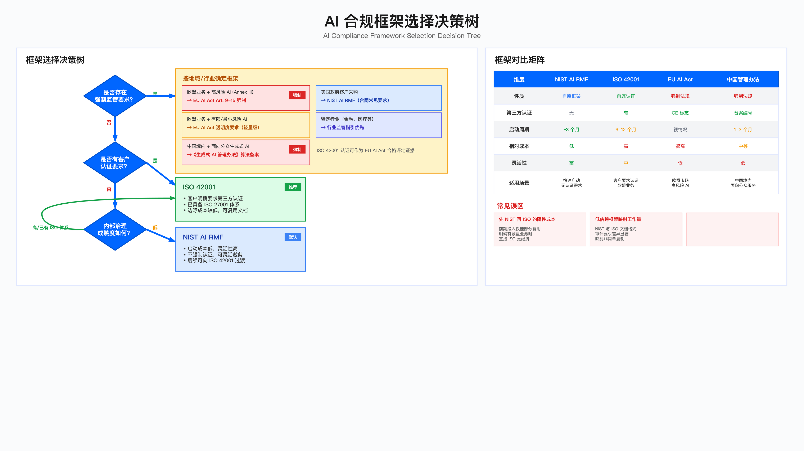

# 18.6　AI 治理与合规落地

> 导读：本节解决"用哪个框架、怎么落地、花多少钱"三个核心问题。18.6.1 的框架选择决策树将三种主要框架（NIST AI RMF、ISO 42001、EU AI Act）的适用场景分解为可判断的条件；18.6.2–18.6.4 分别提供各框架的工程化实施路径；18.6.5 专项处理中国境内生成式 AI 备案；18.6.7–18.6.8 处理投资决策与监管演进；18.6.9–18.6.11 补齐管理体系里最容易被跳过的三块——AI 素养与人员能力、内外部沟通计划、多样性与可及性的责任边界；18.6.12 给出第18章技术控制到 ISO/IEC 42001 与 NIST AI RMF 的映射表，以及合规证据清单配置。如需直接评估合规投资ROI，跳至18.6.7；如需了解EU AI Act时间表，跳至18.6.8；EU AI Act 第 4 条的 AI 素养义务自 2025-02-02 已适用且不分风险档位，落地口径见 18.6.9。

---

## 引言：合规框架选择的决策逻辑

AI 合规面临一个持续存在的组织张力：监管要求收紧的速度远快于企业能够消化合规投资的速度。业务团队对"不直接产生收益的合规支出"天然保持抵触，而合规失败的代价——客户取消合同、监管罚款、声誉损失——往往在决策之后数月乃至数年才显现。

这种时间上的不对称是合规延迟的根本原因。解决它不靠道德倡导，靠两件事：量化合规失败的期望损失（18.6.7 的 ROI 框架），以及分阶段投入（合规 MVP → 认证落地 → 深度合规）。本节从框架选择、分阶段实施、成本控制三个维度提供工程化路径，核心原则是：基于监管强制性与业务风险分级，分阶段投入，不追求"一步到位完美合规"。

---

## 18.6.1 合规框架的选择决策


*图 18.9：合规框架选择矩阵——NIST AI RMF、ISO 42001 与 EU AI Act 的适用条件对照；读者要看出框架由业务所处的监管地域与风险等级决定，与技术偏好无关*

选择 NIST AI RMF、ISO 42001 还是 EU AI Act 合规路径，取决于业务压力点而非技术偏好。以下决策树将选择过程分解为可判断的二元问题。

### 框架选择决策树

第一层：是否存在强制监管要求？

若存在强制监管，按地域和行业确定框架：
- 欧盟业务 + 高风险 AI（EU AI Act 附件三定义）→ 第 9-15 条强制合规[4]（无法回避）；ISO 42001 认证可作为合格评定的支撑证据，但不等于推定合规（见 18.6.8）
- 欧盟业务 + 有限/最小风险 AI → EU AI Act 透明度要求（轻量级）
- 中国境内面向公众的生成式 AI 服务 → 《生成式人工智能服务管理暂行办法》[7] 项下的备案义务（强制，见 18.6.5）；若服务生成合成内容，还需同时满足《人工智能生成合成内容标识办法》[8] 与强制性国标 GB 45438-2025[9]
- 美国政府客户采购 → NIST AI RMF（采购合同常见要求）
- 特定行业（金融、医疗等）→ 行业监管指引优先于通用框架

第二层：若无强制监管，是否有客户认证要求？

- 客户明确要求第三方认证 → ISO 42001（全球认可度较高）
- 已具备 ISO 27001 体系 → ISO 42001 边际成本较低，可复用文档和流程
- 客户不要求认证 + 内部治理成熟度低 → NIST AI RMF（启动成本低，灵活性高）

### 三框架定位与权衡对比

| 维度 | NIST AI RMF | ISO 42001 | EU AI Act 合规 |
|-----|------------|----------|--------------|
| 性质 | 自愿框架，无第三方认证 | 自愿框架，有第三方认证 | 强制法规，无选择余地 |
| 启动成本 | 低（1-2 人月，3 个月可见成果） | 中（6-12 个月认证周期） | 高（12-18 个月合规周期） |
| 认可范围 | 美国政府/企业采购 | 全球认可，欧盟客户首选 | 欧盟市场准入门槛 |
| 适用起点 | 无强制监管、快速启动 | 有欧盟客户、已有 ISO 体系 | 欧盟高风险 AI 运营商 |
| 主要风险 | 无认证不适合欧盟客户尽调 | 认证周期超预期影响业务承诺 | 合规失败面临罚款：违反第 5 条禁止性做法最高 3500 万欧元或全球年营业额 7%，其他多数义务为 1500 万欧元或 3%（第 99 条）[4] |

### 常见误区与纠正

| 误区 | 识别信号 | 后果 | 纠正方法 |
|-----|---------|-----|---------|
| "先 NIST 再过渡 ISO"的隐性成本 | 明确有欧盟业务却先选 NIST | NIST 工作仅部分复用，重复投资 | 明确有欧盟业务直接启动 ISO 42001 |
| 低估跨框架映射工作量 | 计划一周完成框架映射 | 文档格式、审计要求差异导致返工 | 预留 4-6 周映射与调整周期 |
| 忽视"影子 AI" | AI 资产清单仅含 IT 采购项目 | 业务自行采购的 SaaS AI 成合规盲区 | 清单须覆盖业务部门采购的所有 AI 工具 |
| 以最高罚款额度估算风险 | "GDPR 最高罚 4% 营收"就全力合规 | 忽视发生概率，过度投入或过度忽视 | 用期望值（罚款额度 × 发生概率）计算 |

---

## 18.6.2 NIST AI RMF 快速实施指南

### 为何将 NIST 作为起点

NIST AI RMF 1.0（NIST AI 100-1，2023-01-26 发布）[1] 的核心优势是低启动成本与高灵活性——它明确定位为自愿性框架，以 GOVERN／MAP／MEASURE／MANAGE 四大职能组织，不强制认证，可按组织实际情况裁剪，且向 ISO 42001[2] 过渡时部分工作可复用。若需要在 AI 风险管理流程上补一层与 ISO 体系同源的方法论，可参照 ISO/IEC 23894:2023（AI 风险管理指南）[3]。AI RMF 的代价是它只给职能不给控制清单，需要自行补齐可审计的控制项；若不想从零编写，可直接取用 CSA 的 AI Controls Matrix（AICM）v1.1——18 个域、247 项控制，并已给出到 ISO 42001、NIST AI RMF 与 EU AI Act 的映射，可作为三框架并行时的统一控制底稿[11]。但 NIST 路线仍有边界：如果客户明确要求"通过认证"的书面证明，NIST 无法满足，需直接评估 ISO 42001。

### 90 天实施计划

四个阶段并非严格线性——阶段 3（度量体系）的基础设施可以在阶段 2 期间并行建设。关键约束是阶段 1 的组织决策必须先完成，后续工作依赖于清晰的责任归属。

#### 阶段 1：建立治理基础（第 1-4 周）

目标：启动治理机制，完成 AI 资产盘点。

| 任务 | 工作量 | 交付物 | 关键约束 |
|-----|-------|-------|---------|
| 在现有安全委员会下设 AI 专题 | 1 周 | 委员会章程 | 不要单独建"AI 治理委员会"——易被边缘化 |
| AI 系统清单盘点 | 2 周 | 资产清单 | 须包括业务部门自行采购的 SaaS AI 工具 |
| 风险分级 | 1 周 | 高/中/低风险分类 | 建议采用 EU AI Act 分类标准，便于后续对接 |
| AI 使用政策草案 | 2 周 | 核心政策文档 | 首版控制在 10 页以内，冗长文档导致落地困难 |

常见失败点：前两周陷入"谁主导 AI 治理"的组织争论。建议明确：GRC 团队主导（熟悉合规流程），安全团队提供技术支持，AI 团队作为利益相关方参与。

验证方法：抽查 3-5 个业务部门，验证 AI 资产清单是否有遗漏；委员会首次会议完成决策记录。

#### 阶段 2：风险映射（第 5-8 周）

目标：对高风险 AI 系统完成威胁映射。

优先级判定公式：`业务影响 × PII 敏感度 × 监管强制系数 / 现有控制成熟度`。建议首批选取 3-5 个最高分系统。

MITRE ATLAS[10] 威胁映射重点关注三类战术：
- Initial Access（AML.TA0003，提示词注入、API 滥用）
- ML Attack Staging（AML.TA0012，对抗样本、数据投毒）
- Exfiltration（AML.TA0013，模型窃取、训练数据泄露）

不建议一次性映射矩阵中的全部战术——ATLAS 持续演进（2026 年 2 月的 v5.4.0 为 16 个战术、84 项技术），一次铺满工作量过大且边际效用递减，战术总数请以查阅时的官方矩阵为准[10]。AIIA（AI 影响评估）简化模板控制在 1 页以内：系统名称、用途、影响人群、潜在危害、缓解措施、风险等级、审批人。

关键约束：AIIA 需跨部门协作（法务 + 伦理 + AI 团队），实际工作量通常超出预期，建议为每个 AIIA 预留 1 周。

验证方法：高风险 AI 的风险评估报告通过委员会评审；评估报告包含可验证的缓解措施。

#### 阶段 3：建立度量体系（第 9-12 周）

目标：上线 AI 安全监控能力。

优先监控指标（首批不超过 5 个）：

| 指标类别 | 具体指标 | 数据源 | 告警触发条件 |
|---------|---------|-------|------------|
| 性能监控 | 模型准确率、推理延迟 | 推理日志 | 准确率低于基线或延迟超出 SLA |
| 安全监控 | 对抗样本检测 | WAF + 自定义规则 | 日检出次数超出阈值 |
| 隐私监控 | PII 泄露检测 | DLP 工具 | 任何 PII 泄露 |
| 合规监控 | 模型审计覆盖率 | 内部系统 | 覆盖率低于目标值 |
| 运营监控 | AI 事件响应时间 | 工单系统 | 超出响应 SLA |

常见误区：一开始就追求"偏见检测"（实现复杂、见效慢，建议后期引入），应先做"性能漂移检测"（实现成本低、效果可见）。

#### 阶段 4：风险管理（持续）

建立 AI 事件响应流程。**这里不新建一套分级**，直接沿用全书唯一的事件严重级 P1–P4（定义见 11.5.2，**P1 最严重**），AI 场景只是把触发条件补上——这正是 18.1.2 所说的"并入 11.5 的事件分级，不新建流程"。响应与升级时钟以 18.7 的三维定级矩阵为准，本表只给对照：

| 级别 | AI 场景的典型触发 | 响应 SLA | 决策层级 |
|-----|-----|---------|---------|
| P1 Critical | 训练/推理数据泄露、模型被攻陷、监管报告义务触发 | ≤ 15 分钟响应，30 分钟无进展自动升级 | CISO 必须参与 |
| P2 High | 提示词注入成功、对抗攻击得手、性能严重退化、偏见投诉 | ≤ 1 小时响应 | 安全负责人 |
| P3 Medium | 单次攻击尝试、性能轻微漂移、日志异常 | ≤ 4 小时响应 | 值班分析师 |

写这张表时最容易犯的错，是另起一套以 P0 为最高档的编号。全书已有的 P0–P4 是**优先级**记号（数字越小越优先），P1–P4 是**事件严重级**（P1 最重），两套记号共用数字但语义不同；在事件分级里引入 P0，读者跨章读到 11.5.2 和 18.7 时就无法判断同一个记号指哪把尺子。分级的完整判据（数据泄露/系统控制/影响范围三维取最严）与各级的解决时限、升级时限见 [18.7 AI 安全运营](./18.7_AI安全运营.md)。

响应流程：检测 → 分类 → 遏制（暂停模型/回滚版本）→ 调查 → 恢复 → 复盘。

验证方法：完成至少一次桌面演练，响应流程文档经相关团队签字确认。

---

## 18.6.3 ISO 42001 认证实战经验

### 认证成本的完整构成

ISO 42001 认证决策中最常见的低估是总成本计算不完整。以下是实际需要预算的成本项：

| 成本项 | 金额范围（参考） | 说明 |
|-------|--------------|-----|
| 认证机构费用（阶段一 + 阶段二） | 5-15 万元 | 取决于机构和组织规模 |
| 内部人力成本 | 2-6 人月 | GRC + 法务 + AI 团队时间 |
| 咨询顾问费用 | 10-30 万元 | 有 AI 行业经验的顾问 |
| 内部培训成本 | 2-5 万元 | 内审员培训、全员 AI 素养培训 |
| 工具和文档管理 | 1-3 万元 | GRC 平台、文档系统 |
| 年度监督审核 | 3-8 万元/年 | 认证维持成本 |
| 缓冲（建议 30%） | — | 应对认证周期超期、不符合项整改 |

什么时候 ISO 42001 有正向 ROI：当欧盟客户合同价值 ÷ 认证全成本 > 4 时，认证通常有合理的业务回报。

### 认证路线图

#### 阶段一：差距分析

目标：评估当前 AI 管理体系（AIMS）成熟度，识别差距。

建议：选择有 ISO 42001 认证经验的机构（如 BSI、TÜV SÜD、LRQA），而非仅有 ISO 27001 经验的顾问——AI 特定场景理解差异显著。

ISO 42001 核心条款的常见差距：

| 条款 | 要求 | 常见差距 |
|-----|-----|---------|
| 4.3 | AIMS 范围定义 | AI 系统清单不完整（尤其 SaaS AI 工具） |
| 5.2 | AI 政策 | 有草案但未正式发布，缺乏董事会审批 |
| 6.1 | 风险评估 | 缺少"机会"维度（ISO 要求双向评估） |
| 8.2 | AI 影响评估（AIIA） | 覆盖范围不足，工作量低估 |
| 8.3 | 生命周期管理 | 缺乏变更管理流程和模型退役流程 |
| 9.1 | 监控度量 | 缺少偏见相关指标 |
| 9.2 | 内部审核 | 审核员缺乏 AIMS 审核经验 |

常见失败点：低估 AIIA 工作量。每个 AIIA 需跨部门协作，实际耗时通常是预估的 2-3 倍。建议制作 3-4 个模板（客服 AI、推荐系统、分析工具），其他系统基于模板填写。

#### 阶段二：体系建设

四个关键里程碑，各有其常见陷阱：

AI 政策正式发布：董事会审批时重点关注"风险容忍度"条款——这是最容易引发争议的部分，需提前与管理层对齐口径。

完成所有 AIIA：模板化是压缩周期的核心手段。每个模板覆盖一类 AI 系统的共性风险，具体系统只需填写差异部分。

变更管理流程上线：避免流程过重（"每次模型更新都要委员会审批"会导致 AI 团队抵制）。建议区分：重大变更（切换底层模型）须审批，参数微调仅需记录。

内部审核：培训 ISO 27001 内审员转型为 ISO 42001 审核员，成本低于外聘。首次内审通常发现 10-15 个不符合项，多为文档完整性问题，不必担心。

#### 阶段三：认证审核

阶段一审核（文档审核，远程，2-3 天）

常见问题：AI 系统清单遗漏外部 API 调用的 AI 服务；风险评估未覆盖供应链风险。这两点是审核员明确关注的高频质疑点，提前准备应对材料。

阶段二审核（现场审核，2-4 天）

审核员典型问题：
- "展示一个 AIIA 的完整审批流程"（会随机抽取 1-2 个系统深入验证）
- "如果模型出现偏见，你们如何响应？"（需演示事件响应流程，不只是说文档里有）
- "证明 KPI/KRI 仪表盘是实时的"（现场登录系统验证，不接受截图）

准备清单：打印所有 AIMS 文档（部分审核员偏好纸质）；为每个条款准备对应证据文件；让内审员模拟审核员提问做预演；确保被访谈人员当天在场（审核员会临时要求访谈特定角色）。

#### 阶段四：纠正措施与证书颁发

典型不符合项：

| 不符合项 | 严重程度 | 整改方向 |
|---------|---------|---------|
| 生命周期管理流程未涵盖模型退役 | 次要 | 补充退役检查清单 |
| 内部审核未覆盖第三方 AI 供应商 | 次要 | 增加供应商审核条款 |
| 部分 AI 系统缺少 AIIA | 严重 | 补做 AIIA（严重不符合项会阻断认证） |

证书有效期 3 年，期间需接受年度监督审核。年度监督审核不是走过场——认证机构会核查上一年度发现的改进项是否落地。

---

## 18.6.4 EU AI Act 合规实战指南

### 高风险 AI 的判定：首先确认你是否在范围内

EU AI Act Annex III 定义了"高风险 AI"类别。以下是与企业 AI 最相关的几类：

| 类别 | 典型系统 | 高风险判定 |
|-----|---------|----------|
| 就业与工人管理 | 招聘 AI、绩效评估 AI | 是，明确列入 Annex III |
| 信贷评估 | 信贷风控模型 | 是，明确列入 Annex III |
| 教育与职业培训 | 学生评分 AI | 是，明确列入 Annex III |
| 重要基础设施 | 电力/水务调度 AI | 是 |
| 客服聊天机器人 | 普通客服机器人 | 否（除非涉及上述决策） |
| 内容推荐系统 | 新闻推荐、商品推荐 | 否（通常） |

确认方法：对每个 AI 系统执行三步判断：(1) 是否在 Annex III 明确列出的类别中？(2) 是否"显著影响"受影响人的健康、安全或基本权利？(3) 系统是否在欧盟市场提供？三问均是，则为高风险 AI，须满足 Article 9-15 全部要求。

### 高风险判定与合规截止日的判定脚本

上面的三步判断可以落成代码。好处有三个：判定口径固定、结论可复算、时间表变化时能一次性重跑全部在册系统。下面这段脚本读一份系统描述，输出档位、适用义务、每项义务的最晚合规日，以及按建设周期倒排出的启动日。

脚本里的日期按 2026 年修订后的时间表写：独立高风险系统（附件三）的义务推迟到 2027-12-02，作为产品安全组件的高风险 AI（附件一）推迟到 2028-08-02，生成合成内容的标识义务顺延到 2026-12-02，而通用目的 AI 模型义务自 2025-08-02 已适用、执法权自 2026-08-02 起行使，未随高风险义务推迟。同一次修订还把"为偏见检测与纠正而处理特殊类别个人数据"的法律依据，从高风险 AI 扩展到全部 AI 系统与通用目的 AI 模型，并附严格必要性标准；脚本对声明了此类处理的系统会附一条提示，提醒留存必要性论证。修订的来源与逐条口径见 18.6.8。

```python
#!/usr/bin/env python3
# -*- coding: utf-8 -*-
"""EU AI Act 初判：输出风险档位、适用义务、每项义务的最晚合规日与倒排启动日。
时间表基准为 Regulation (EU) 2024/1689 第 113 条，经 Regulation (EU) 2026/1744
（Digital Omnibus on AI，2026-07-08 签署、2026-07-27 生效）修订，口径见 18.6.8。
本脚本只做初筛，定档与放行由法务签字，具体条款以官方文本为准。
用法：python3 eu_ai_act_triage.py system.json --asof 2026-08-01
"""
import argparse, json, sys
from datetime import date, timedelta

# 义务 -> (适用日, 建设周期天数)。改这张表前先核对官方文本，不要凭记忆改
DUTY = {
    "prohibited": (date(2025, 2, 2), 0),            # 第 5 条禁止性做法
    "ai_literacy": (date(2025, 2, 2), 60),          # 第 4 条 AI 素养
    "gpai": (date(2025, 8, 2), 180),                # 第五章 GPAI 模型义务
    "transparency": (date(2026, 8, 2), 90),         # 第 50 条一般透明度
    "synthetic_marking": (date(2026, 12, 2), 120),  # 合成内容标识，由 2026-08-02 顺延
    "high_risk_annex_iii": (date(2027, 12, 2), 540),  # 独立高风险，由 2026-08-02 推迟
    "high_risk_annex_i": (date(2028, 8, 2), 540),     # 内嵌产品高风险，由 2027-08-02 推迟
}
# GPAI 义务自 2025-08-02 适用，执法权自本日起行使，该日期未随高风险义务推迟
GPAI_ENFORCEMENT = date(2026, 8, 2)
# 附件三领域的内部初筛线索，键沿用 18.1 清单的 purpose_class；这不是附件原文
ANNEX_III_HINTS = {"人事筛选": "就业与工人管理", "风险决策": "关键私人服务（含信贷评估）"}

def classify(item):
    """返回 (档位, 判定依据)。"""
    if not item.get("eu_market"):
        return "out_of_scope", "未在欧盟市场提供，且输出不在欧盟境内使用"
    if item.get("prohibited_practice"):
        return "prohibited", "落入第 5 条禁止性做法，不存在合规路径，只能停用"
    if item.get("safety_component_of_regulated_product"):
        return "high_risk_annex_i", "作为附件一所列产品的安全组件，随该产品法规走合格评定"
    area = item.get("declared_annex_iii_area") or ANNEX_III_HINTS.get(item.get("purpose_class"))
    if area and item.get("significant_impact"):
        return "high_risk_annex_iii", f"用途落入{area}，且认定对健康、安全或基本权利有显著影响"
    if area:
        return "limited", f"用途接近{area}但未认定显著影响，须留存不认定的书面理由与签字人"
    if item.get("interacts_with_humans") or item.get("generates_synthetic_content"):
        return "limited", "触发第 50 条透明度义务"
    return "minimal", "未触发上述任一条件"

def obligations(item, tier):
    """返回 [(义务描述, 适用日, 建设周期天数)]，按适用日升序。"""
    if tier == "out_of_scope":
        return []
    if tier == "prohibited":
        return [("第 5 条禁止性做法：已适用，须立即停用",) + DUTY["prohibited"]]
    out = [("第 4 条 AI 素养：相关人员培训与记录",) + DUTY["ai_literacy"]]
    if tier.startswith("high_risk"):
        day, lead = DUTY[tier]
        out.append(("第 9-15 条：风险管理、数据治理、技术文档、日志留存、透明度、"
                    "人工监督、准确性与鲁棒性", day, lead))
        out.append(("上市前合格评定与欧盟数据库注册，流程见 18.6.4（条款号以官方文本为准）",
                    day, lead))
    if item.get("interacts_with_humans"):
        out.append(("第 50 条透明度：告知对方正在与 AI 交互",) + DUTY["transparency"])
    if item.get("generates_synthetic_content"):
        out.append(("生成合成内容的机器可读标识",) + DUTY["synthetic_marking"])
    if item.get("is_gpai_provider"):
        out.append((f"第五章通用目的 AI 模型义务，执法权自 {GPAI_ENFORCEMENT} 起行使",)
                   + DUTY["gpai"])
    return sorted(out, key=lambda row: row[1])

def main(argv=None):
    parser = argparse.ArgumentParser(description="EU AI Act 风险分级与合规截止日初判")
    parser.add_argument("system", help="系统 JSON，沿用 18.1 清单字段并补欧盟专用标志位")
    parser.add_argument("--asof", default=date.today().isoformat(), help="判定基准日")
    args = parser.parse_args(argv)
    asof = date.fromisoformat(args.asof)
    with open(args.system, encoding="utf-8") as fh:
        item = json.load(fh)
    tier, why = classify(item)
    duties = obligations(item, tier)
    print(f"系统：{item.get('name')}（{item.get('system_id')}）")
    print(f"初判档位：{tier}")
    print(f"判定依据：{why}\n")
    if not duties:
        print("当前无适用义务。欧盟市场投放状态一旦变化须重跑本判定。")
        return 0
    print("| 义务 | 最晚合规日 | 建设周期 | 启动日不得晚于 | 状态 |")
    print("| --- | --- | --- | --- | --- |")
    overdue_start = 0
    for name, day, lead in duties:
        start = day - timedelta(days=lead)
        if day <= asof:
            state = "已适用，须立即具备证据"
        elif start < asof:
            state = f"距合规日 {(day - asof).days} 天，启动日已过 {(asof - start).days} 天"
            overdue_start += 1
        else:
            state = f"距合规日 {(day - asof).days} 天"
        print(f"| {name} | {day} | {lead} 天 | {start} | {state} |")
    future = [row for row in duties if row[1] > asof]
    if future:
        print(f"\n最近一个必须合规的日期：{future[0][1]}，对应义务——{future[0][0]}")
    else:
        print("\n全部适用义务的合规日均已到期，当前处于敞口状态。")
    print(f"已适用义务 {len(duties) - len(future)} 项；建设启动日已逾期的义务 {overdue_start} 项。")
    if item.get("bias_testing_special_category_data"):
        print("提示：为偏见检测与纠正而处理特殊类别个人数据的法律依据，经 2026 年修订"
              "已从高风险 AI 扩展到全部 AI 系统与通用目的 AI 模型，但附严格必要性标准，"
              "须留存必要性论证、最小化措施与访问限制记录。")
    return 0

if __name__ == "__main__":
    sys.exit(main())
```

对一个面向欧盟市场的简历初筛系统，输出为：

```
系统：简历初筛（AIS-0107）
初判档位：high_risk_annex_iii
判定依据：用途落入就业与工人管理，且认定对健康、安全或基本权利有显著影响

| 义务 | 最晚合规日 | 建设周期 | 启动日不得晚于 | 状态 |
| --- | --- | --- | --- | --- |
| 第 4 条 AI 素养：相关人员培训与记录 | 2025-02-02 | 60 天 | 2024-12-04 | 已适用，须立即具备证据 |
| 第 50 条透明度：告知对方正在与 AI 交互 | 2026-08-02 | 90 天 | 2026-05-04 | 距合规日 1 天，启动日已过 89 天 |
| 第 9-15 条：风险管理、数据治理、技术文档、日志留存、透明度、人工监督、准确性与鲁棒性 | 2027-12-02 | 540 天 | 2026-06-10 | 距合规日 488 天，启动日已过 52 天 |
| 上市前合格评定与欧盟数据库注册，流程见 18.6.4（条款号以官方文本为准） | 2027-12-02 | 540 天 | 2026-06-10 | 距合规日 488 天，启动日已过 52 天 |

最近一个必须合规的日期：2026-08-02，对应义务——第 50 条透明度：告知对方正在与 AI 交互
已适用义务 1 项；建设启动日已逾期的义务 3 项。
提示：为偏见检测与纠正而处理特殊类别个人数据的法律依据，经 2026 年修订已从高风险 AI 扩展到全部 AI 系统与通用目的 AI 模型，但附严格必要性标准，须留存必要性论证、最小化措施与访问限制记录。
```

输出里真正驱动排期的是后两列。只给"是不是高风险"，拿到结论的人下一步仍要问"那我什么时候之前得做完"；把最晚合规日和倒排启动日一起给出，结论才能直接进项目计划。这里的建设周期取自 18.6.7 的分阶段路径，高风险按 540 天折算——组织若已有 ISO 42001 体系，这个数可以显著压缩，照搬默认值会把启动日排得过早，占用本该给其他优先级的预算。

附件三的判定被拆成两条路：`purpose_class` 自动命中只覆盖"人事筛选"和"风险决策"两类，其余领域（教育评分、关键基础设施、执法、移民、司法）必须由 `declared_annex_iii_area` 人工声明。代价是自动化程度低，收益是不制造虚假的确定性——附件三的边界有解释空间，全自动映射会让人误以为定档已经完成，而定档错误的后果不对称。

照抄时最容易改错的是 `DUTY` 那张日期表。2026 年的修订只推迟了高风险义务与合成内容标识，通用目的 AI 模型的两个日期原地未动；最常见的误改是把"推迟"理解成整部法规顺延，连带把执法起点也往后挪，结果漏掉 2026-08-02 起就已打开的可处罚窗口。第二处是脚本刻意不判断提供者与部署者身份——两者义务差别很大，而这个判断要看合同关系，不是系统描述里的字段能决定的，脚本不猜，留给法务。

### Article 9：风险管理系统

监管要求：建立、实施和维护持续的风险管理流程（非一次性评估）。

| 交付物 | 页数建议 | 核心内容 | 审核重点 |
|-------|---------|---------|---------|
| 风险管理计划 | 15-20 页 | 风险容忍度定义、评估频率 | 可操作性——发现风险后如何处置 |
| 风险评估报告 | 每系统一份 | FMEA 分析、关键风险场景 | P0/P1 风险识别完整性 |
| 上市后监控计划 | 5-10 页 | 公平性指标、投诉分析、重训练触发条件 | 监控是否持续而非一次性 |

设计原则：风险管理计划控制在 20 页以内——过长的文档（>50 页）表明边界不清晰，审核员对其可操作性持怀疑态度。每项风险必须配对应的缓解措施，只列风险不列缓解方案会被判定为"有名无实"。

### Article 10：数据治理

监管要求：训练数据应"相关、代表性、无错误、完整"。

关键合规风险：训练数据来源的合法性。未经授权使用的数据（如未获用户授权的社交媒体爬虫数据）可能导致 AI 系统禁止上市及监管罚款。预防性数据合规审查的成本远低于事后补救——上线后发现数据来源问题，可能需要重新训练模型。

数据治理三项核心要求：

1. 数据来源审查：验证数据获取的授权协议，确认遵守 robots.txt 及网站服务条款，社交媒体数据需用户明确同意（符合 GDPR Article 6）。

2. 数据质量审计：覆盖代表性（各年龄/性别/种族群体）、准确性、多样性三个维度。

3. 数据溯源系统：每条训练数据记录来源、授权时间、采集时间，可审计。

### Article 13：透明度义务

监管要求：向用户提供"清晰、充分"的信息。

以招聘 AI 为例，必须告知候选人的信息：简历将由 AI 系统初筛；AI 评分在最终决策中的权重；AI 使用的评估标准及其权重；人工复审申请渠道；AI 评分理由查询权利。

可解释性实现方案：使用 SHAP 等工具生成评分解释。输出示例：
```
您的评分为 75 分（满分 100 分）。
主要贡献因素：
  + Python 技能：+20 分（岗位核心要求）
  + 5 年相关经验：+15 分
  - 缺少机器学习项目经验：-10 分

如对评分有异议，可申请人工复审（processing@company.com）
```

### Article 14：人工监督

监管要求：高风险 AI 必须设计为"可被人工有效监督"，这是一个系统设计要求，而非流程要求。

三道防线设计：

| 防线 | 时机 | 措施 | 触发条件 |
|-----|-----|-----|---------|
| 部署前监督 | 上线前 | 偏见/鲁棒性测试，公平性指标达标 | 必须通过门槛 |
| 运行时监督 | 推理时 | 低置信度预测人工复审 | 置信度 < 阈值或用户申诉 |
| 事后审计 | 定期 | 随机抽查 AI 决策，人工验证 | 人机不一致率超阈值暂停模型 |

Override 机制：允许人工推翻 AI 决策，记录推翻理由，将推翻案例作为模型改进的训练数据。监控推翻率趋势——持续高推翻率是模型需要重训的信号。

### 欧盟数据库注册（Article 49 注册义务，Article 71 数据库）

监管要求：Annex III 项下的高风险 AI 系统在投放市场或投入使用前，提供者与部分部署者须按 Article 49 完成注册；该注册进入 Article 71 设立、由欧盟委员会与成员国共同维护的欧盟数据库。（Article 64 是设立 AI Office 的条款，与注册义务无关，早期材料常把两者混为一谈。）

注册流程：准备 AI 系统信息、提供者信息、合格评定机构信息、CE 标志、技术文档摘要，按 Annex VIII 规定的字段提交。数据库中的多数信息公开可查，部分字段仅对市场监管机关可见。

时间上要注意本轮修订的影响：Annex III 高风险义务已由 Regulation (EU) 2026/1744 推迟至 2027-12-02，注册义务随之顺延；但这不改变 GPAI 义务的适用与执法时点，也不顺延 GDPR 第 35 条的 DPIA 义务。

持续更新义务：重大变更须 30 天内更新注册；严重事故报告为最长 15 天内，且致人死亡或大范围侵害等特定情形下时限更短（依 Article 73 分档）。这两个时间窗口需要提前在事件响应流程中明确。

---

## 18.6.5 中国《生成式 AI 管理办法》合规要点

### 备案适用范围

法规依据是《生成式人工智能服务管理暂行办法》（国家网信办等七部门令第 15 号，2023-07-10 公布、2023-08-15 施行）[7]，其第二条将适用范围限定为"利用生成式人工智能技术向中华人民共和国境内公众提供生成式人工智能服务"，第十七条规定具有舆论属性或社会动员能力的服务应履行安全评估与算法备案义务。"面向公众"是关键界定词——以下场景通常不需要备案（需法务确认具体适用性）：

| 场景 | 豁免依据 | 注意事项 |
|-----|---------|---------|
| 仅供企业内部使用 | 非"面向公众提供服务" | 需确保无外部用户访问入口 |
| 研发测试阶段 | 非正式对外服务 | 测试用户须为内部员工或签约测试者，不能无限期延长 |
| 调用第三方已备案服务 | 服务提供方已完成备案 | 需确认第三方备案有效性 |
| B2B 定制服务 | 非面向公众 | 须有明确的企业客户合同；若客户再向公众提供，需评估责任归属 |
| 纯分析型 AI | 不属于生成式 AI 范畴 | 需确认不具备内容生成能力 |

不可豁免的边界条件：即使内部使用，若涉及向政府机构提供服务仍需评估；B2B 服务若客户方再向公众提供，责任归属需法务意见。

### 备案材料准备

基本信息：营业执照、法定代表人身份证、服务器部署在中国境内的证明（如云服务商合同）。

算法信息：算法名称、类型、应用场景；技术原理、训练数据来源、数据规模、模型参数量。

安全自评估报告（重点，通常 20-30 页，三项核心内容）：

| 评估维度 | 内容 | 常见薄弱点 |
|---------|-----|---------|
| 内容安全 | 如何防止生成违法有害内容 | 敏感词库不完善，人工复审覆盖率不足 |
| 数据安全 | 训练数据合法性证明 | 爬虫数据缺少 robots.txt 遵守证明 |
| 算法安全 | 如何防止被恶意利用 | 输入验证、速率限制、滥用检测的实现证据 |

安全措施证明：实名认证截图、"AI 生成"标识截图、内容审核系统架构图、应急响应预案。

### 审查重点与常见补充要求

审查重点按关注度排序：内容安全最严格（审查员会实际测试系统能否生成敏感内容）；数据来源合法性；实名认证落实（需演示用户注册完整流程）。

常见补充要求：提供内容审核模型的准确率测试报告；说明如何处理政治敏感内容；补充应急响应演练记录。

关键约束：不得在备案期间上线服务（否则属于"未备案擅自提供服务"，面临行政处罚）。备案通过后获得备案编号，须在服务页面显著位置公示。

### 生成合成内容的标识义务（与备案并行的第二条强制线）

备案解决的是"能不能提供服务"，标识解决的是"生成出来的内容怎么标"，两者互不替代。《人工智能生成合成内容标识办法》由国家网信办、工信部、公安部、国家广播电视总局四部门于 2025-03-07 公布、2025-09-01 施行[8]，配套的强制性国家标准 GB 45438-2025《网络安全技术 人工智能生成合成内容标识方法》2025-02-28 发布、同日 2025-09-01 实施[9]。工程上要落两类标识：

- 显式标识：在生成内容的界面或内容本身以文字、声音、图形等可被用户直接感知的方式提示"由人工智能生成/合成"
- 隐式标识：在文件元数据中写入生成合成信息（内容属性、服务提供者名称或编码、内容编号等），必要时叠加数字水印

责任链是三段式的：服务提供者负责添加标识，内容传播平台负责核验并对未标识内容做提示，用户在发布时负有如实声明义务。技术细节（元数据字段、编码规则）以 GB 45438-2025 正文为准[9]，本书不复述字段表。

---

## 18.6.6 合规失败案例与教训

从已发生的合规失败案例中，三个失败模式反复出现：

| 案例 | 根因 | 教训 |
|-----|-----|-----|
| 认证承诺未兑现（客户取消订单） | AIIA 工作量低估 + 认证机构排期延期 | 差距分析完成后再承诺时间表；预留 30-50% 缓冲；提前锁定认证机构排期 |
| 训练数据来源不合法（监管审查） | 数据来源合法性审核缺失，使用未授权社交媒体爬虫数据 | 所有训练数据建立来源审计；遵守 robots.txt；社交媒体数据须用户同意 |
| 算法备案被拒（AI 写作助手） | 敏感词库不完善，人工复审覆盖不足 | 升级敏感词库；高风险内容 100% 人工复审；建立可演示的应急响应机制 |

共同模式：三个案例都在执行层面低估了工作量或忽略了监管方的实际关注点。合规失败很少是因为不知道要求，而是因为高估了现有系统满足要求的程度。

---

## 18.6.7 合规投资决策框架

### ROI 评估方法

合规投资决策应基于量化分析。口径必须与全书一致：**ROI 取净额除以投入**，即分子先减掉成本，`ROI = 0` 才是盈亏平衡。这与 [17.9.4](../第17章_AI驱动网络安全/17.9_AISecOps落地方法论.md) 的 AISecOps 单场景 ROI 是同一把尺子，两处算出来的百分比可以直接比较。写成"收益 / 成本"的毛比会让同一笔投入看起来比实际高出整整 100 个百分点——同样是花 100 万换回 500 万，净额口径是 400%，毛比口径是 500%，跨章对比时这个差额会被当成两个项目的优劣差异。

```
ROI = (期望避免损失 + 合规带来的业务机会 − 合规总成本) / 合规总成本

其中：
期望避免损失 = (监管罚款最大额度 × 违规概率) + (客户合同损失 × 丢失概率)
业务机会     = 因认证新获客户合同价值 + 溢价能力增量
合规总成本   = 建设成本 + 年度维护成本（含监督审核）× 年限
```

合规 ROI 与 17.9.4 那张表的差别只在输入项：17.9.4 的收益来自省下的人工工时，需要一个兑现系数（省下的工时没变成编制变更就不计入财务收益）；合规这边的收益主要来自"没被罚"和"签得下来的合同"，前者是概率期望、后者要有合同或询单作证据。两者都不许拿行业平均值填——分母里的成本是自己付的，分子里的概率也只能由本组织的监管暴露度决定。

关键提醒：罚款风险评估需结合发生概率（而非只看最高罚款额度）。EU AI Act 的罚款按违规性质分级：违反禁止性条款（Article 5）最高 3500 万欧元或全球营收 7%，违反高风险等其他义务最高 1500 万欧元或 3%，向监管机构提供不实信息最高 750 万欧元或 1%（取两者较高值）。对特定企业的实际发生概率取决于监管执法重点和企业曝光度。

### 分阶段合规路径

| 阶段 | 目标 | 方案 | 适用场景 | 典型周期 |
|-----|-----|-----|---------|---------|
| 阶段 1：合规 MVP | 通过客户尽调 | NIST AI RMF 快速实施 | 初创公司、无强制监管 | 3 个月 |
| 阶段 2：认证落地 | 获得第三方认证 | ISO 42001 认证 | 有欧盟业务、客户要求认证 | 6-12 个月 |
| 阶段 3：深度合规 | 满足高风险 AI 监管要求 | EU AI Act 全面实施 | 招聘/信贷/医疗等高风险 AI | 12-18 个月 |

---

## 18.6.8 监管演进趋势（2025-2028）

### EU AI Act 分阶段实施时间线

```
2024.08 ──────────────────────────────────────────────────────────> 2028+

 2024.08.01  EU AI Act 正式生效
      │
 2025.02.02  禁止条款生效 (Article 5)
      │      ├─ 社会评分系统禁止
      │      ├─ 公共场所实时生物识别（执法例外）禁止
      │      ├─ 情感识别（工作场所/教育）禁止
      │      └─ 认知行为操控禁止
      │
 2025.08.02  AI 素养与通用 AI 规则生效
      │      ├─ Article 4: AI 素养培训义务
      │      ├─ Article 50: GPAI 模型透明度要求
      │      └─ Article 51-52: 系统性风险 GPAI 模型义务
      │
 2026.08.02  GPAI 执法与罚款启动（如期，未推迟）
      │      └─ GPAI 义务进入可处罚阶段
      │
 2026.12.02  合成内容透明度义务生效
      │      └─ Article 50(2)，经 Digital Omnibus 由原定 2026.08 顺延
      │
 2027.12.02  高风险 AI 系统全面合规（经 2026 Digital Omnibus 由原定 2026.08 推迟）
      │      ├─ Annex III 定义的独立高风险系统须满足 Article 9-15
      │      ├─ CE 标志强制要求
      │      ├─ EU 数据库注册强制要求
      │      └─ 合格评定程序完成
      │
 2028.08.02  内嵌式高风险 AI 合规（Annex I）
             └─ 作为产品安全组件的 AI 系统（医疗器械 AI、汽车 AI）
```

上图给出的是便于记忆的粗线条，逐条落到条款时请以下面两段经官方文本核对的口径为准。

原始时间表（Regulation (EU) 2024/1689 第 113 条）[4]：本条例 2024-08-01 生效；第一章（总则，含第 4 条 AI 素养义务）与第二章（第 5 条禁止性做法）自 2025-02-02 起适用；第三章第 4 节、第五章（通用目的 AI 模型，第 51-56 条）、第七章（治理）、第十二章（处罚，第 101 条除外）及第 78 条自 2025-08-02 起适用；其余条款（含第 50 条对特定 AI 系统的透明度义务、附件三高风险系统）自 2026-08-02 起适用；第 6(1) 条（作为产品安全组件的附件一高风险 AI）自 2027-08-02 起适用。这里有两个易错点需要点明：第 4 条 AI 素养义务的适用日是 2025-02-02 而非 2025-08-02；第 50 条是面向聊天机器人、深度伪造等"特定 AI 系统"的透明度义务，不是通用目的 AI 模型的透明度义务——后者在第 53 条，系统性风险模型的额外义务在第 55 条。

2026 年的修订：Digital Omnibus on AI 以 Regulation (EU) 2026/1744 落地（2026-05 达成三方临时协议，2026-06-29 理事会终批，2026-07-08 签署，2026-07-27 生效）[5]，高风险义务整体后延——独立高风险系统（附件三）由原定 2026-08-02 推迟到 2027-12-02，内嵌产品高风险 AI（附件一）由原定 2027-08-02 推迟到 2028-08-02，生成合成音视频图文的透明度义务顺延到 2026-12-02（第 50 条其余透明度要求仍按 2026-08-02 执行）；GPAI 的执法与罚款自 2026-08-02 起如期生效，并未推迟。规划合规节奏时以最新官方口径为准。

### ISO 42001 与 EU AI Act 协同复用

需要先纠正一个流传很广的说法：ISO 42001 本身并未被纳入欧盟协调标准（harmonised standard）体系，因此它不产生第 40-41 条意义上的推定合规。承担这一角色的是 CEN-CENELEC JTC 21 正在制定的 prEN 18286《Artificial Intelligence — Quality management system for EU AI Act regulatory purposes》——该标准对应 AI Act 第 17 条的质量管理体系要求，2025 年下半年进入 enquiry（公开征询），征询意见已处理完毕，截至 2026 年年中处于各国标准化机构正式投票（Formal Vote）阶段，尚未在欧盟官方公报（OJEU）引用[6]。同批还有 prEN 18228（AI 风险管理，公开征询至 2026 年 7 月底）与 prEN 18283（AI 偏见管理，制定中）[6]。只有被 OJEU 引用之后，符合该标准才产生推定合规效力。prEN 18286 的附录 D 给出了与 ISO/IEC 42001 控制项的对照，因此已有 42001 体系的企业可显著减少后续对接的增量工作。换言之，ISO 42001 的价值是"体系载体与复用基础"，而非"合规免检金牌"。在此前提下，可按以下映射估算增量工作：

| ISO 42001 条款 | EU AI Act 对应条款 | 复用程度 | 增量工作 |
|--------------|------------------|---------|---------|
| 6.1 风险评估 | Article 9 | 高（~80%） | 补充欧盟特定风险场景 |
| 8.2 影响评估 | Article 9(2) | 高（~85%） | 格式对齐 |
| 6.1.3 数据管理 | Article 10 | 中（~60%） | 补充数据代表性证明 |
| 8.3 生命周期 | Article 15 | 中（~70%） | 补充退役处置 |
| 9.1 监控度量 | Article 9(4) | 高（~75%） | 补充上市后监控机制 |

### 全球监管格局演进

| 地区 | 监管框架 | 2025 关键节点 | 2026-2027 趋势 |
|-----|---------|-------------|--------------|
| 欧盟 | EU AI Act | 禁止条款、GPAI 规则生效 | GPAI 执法与罚款 2026.08 启动；高风险义务经 Digital Omnibus 推迟至 2027.12 |
| 美国 | NIST AI RMF（自愿）+ 州级立法 | 科罗拉多州 AI 法生效日经立法推迟（原定 2026.02，以最新官方口径为准） | 联邦立法可能性增加、行业监管收紧 |
| 英国 | 原则导向监管 | 行业监管机构发布 AI 指引 | 可能引入立法框架 |
| 中国 | 《生成式 AI 办法》+ 行业监管 | 备案执法趋严、行业细则出台 | 监管覆盖范围扩大，跨境 AI 服务监管 |
| 新加坡 | AI Verify（自愿） | 金融业 AI 监管收紧 | 可能引入强制框架 |

美国州级立法应对建议：建立"最严标准"合规策略——以最严格州（科罗拉多州、加利福尼亚州）的要求为基线，避免多套合规体系的维护成本。

### 合规规划资源投入节奏（2025–2026 建设期）

下表给出建设期（2025–2026）的投入建议，百分比为该阶段内部的相对分配。经 2026 Digital Omnibus 后延，高风险（Annex III）义务实际生效点在 2027-12、内嵌式（Annex I）在 2028-08，因此 2027 年起进入合规运行与持续监控期，投入重心从体系建设转为运行维持、事故报告演练与合格评定跟进，具体节奏应对齐各自适用日期。

| 时间段 | 重点投入领域 | 建设期内预算占比建议 | 关键交付物 |
|-------|------------|------------|----------|
| 2025 H1 | 禁止系统审计、AI 素养基础 | 20% | 禁止系统清单、培训计划 |
| 2025 H2 | AI 素养落地、ISO 42001 启动 | 25% | 培训完成率 >80%、差距分析报告 |
| 2026 H1 | ISO 42001 体系建设、高风险评估 | 30% | AIMS 体系文档、AIIA 完成 |
| 2026 H2 | ISO 42001 认证、合格评定启动 | 25% | 认证证书、评定机构选定 |

---

## 18.6.9 AI 素养与人员能力

### 这条义务与本节其他义务的区别

EU AI Act 第 4 条要求提供者与部署者尽最大努力确保其员工、以及代其操作 AI 系统的其他人员具备足够的 AI 素养，该条自 2025-02-02 起适用[4]。它有两处与本节此前讨论的义务不同：不分风险档位，最小风险的内部效率工具也在范围内；不分自建与外购，只买了带 AI 功能的 SaaS、自己不训练任何模型的公司同样是部署者。18.6.4 的判定脚本里，除"不在范围内"与"落入第 5 条禁止性做法（不存在合规路径）"两种情形外，`ai_literacy` 是每个档位都会列出的第一条义务，原因在此。

ISO/IEC 42001 从管理体系一侧给出同一件事的要求：7.2 要求确定必要能力、确保人员胜任并保留证据，7.3 要求人员理解 AI 政策及自身贡献[2]；NIST AI RMF 的 GOVERN 2 把培训与责任结构绑在一起[1]。三者叠加后的落地动作一致：按角色定义能力、验证能力、留下能证明验证发生过的记录。

第 4 条没有规定课时、形式或及格分数。这一点常被读成要求宽松，实际含义是监管不检查上了几小时课，检查的是组织凭什么认为这些人够格。可审计的证据因此是能力判定的依据链，签到表只是其中最弱的一环。

### 五类角色，五份不同的能力要求

多数组织在这条义务上的错误是给所有人上同一门课：一门九十分钟的 AI 安全通识，全员必修，考十道单选题。这门课对普通员工过深，对研发过浅，对采购基本无关，三类人都没拿到能改变行为的东西。

| 角色 | 必须掌握 | 明确不要求 | 达标的可观察行为 |
| --- | --- | --- | --- |
| 使用 AI 工具的普通员工 | 数据分级红线、输出核对、追问依据（三件事见下一小节） | 模型原理、提示工程技巧、攻击手法 | 被问"这个结论从哪来"时能给出模型之外的可核实来源 |
| 把 AI 接进产品的研发 | 模型输出等同不可信输入、系统提示词不构成访问控制、拼接进下游前的校验、日志与上下文中的 PII | 对抗样本的数学推导、自行训练或微调模型 | 代码评审中能指出把模型输出直接拼进 SQL、shell 或 HTML 的位置 |
| 运维 agent 的安全工程师 | 自主等级 L0–L5 与各级的人工确认点（见 17.1.2）、agent 的权限与凭据获取路径、工具调用审计的读法、断开与降级手段 | 模型训练与微调工程 | 演练中能在设定时限内断开一个被诱导的 agent，并说清它这段时间访问过哪些系统 |
| 做 AI 采购与合同的 | 提供者与部署者的义务边界、供应商声明中哪些是可验证控制、必写条款（模型变更通知、训练数据使用限制、审计权、事故通知时限） | 技术评测的执行 | 新签 AI 服务合同中四类条款齐备，且有过因条款缺失退回供应商的记录 |
| 管理层 | 本组织 AI 资产的风险分布与最高档所在、各项义务的适用日与当前敞口、批准上线时签的是什么、何种情况必须停用 | 技术细节 | 季度汇报中能针对某个具体系统质疑其假设，而非只问上线时间（模板见 18.1.5） |

"明确不要求"这一列与"必须掌握"同等重要。不写清不要求什么，课程内容会持续膨胀——每次事件后都有人提议加一节，两年后变成一门没人上得完的课，完成率随之下滑，而下滑最快的往往是最该上课的那批人。

### 普通员工那一层：三件事

普通员工占人数的绝大多数，这一层的培训重心是判断，不是原理。三件事按价值排序。

第一件是哪些数据不能贴进外部模型。这件事有明确答案，不需要员工临场权衡，直接接 8.2 的四级分类：

| 数据分级 | 公有 SaaS 模型（含个人账号） | 企业签约通道（含不用于训练的承诺） | 企业内私有部署 |
| --- | --- | --- | --- |
| Restricted | 禁止，无例外 | 禁止 | 单独审批，逐次留痕 |
| Confidential | 禁止 | 审批后允许 | 允许 |
| Internal | 禁止使用个人账号 | 允许 | 允许 |
| Public | 允许 | 允许 | 允许 |

这张表要在培训里以判定题的形式出现，而不是以条文的形式出现。"客户的完整投诉工单能不能贴进公网聊天窗口"比"Confidential 数据禁止外发"更接近员工真实遇到的问题，后者读完就忘，前者会在下次动手前浮现出来。

第二件是 AI 输出必须核对。核对标准按可核对性分档：有权威来源可查的（法规条文、内部制度、系统数据）必须逐条回查；无法回查的（趋势判断、方案建议）只能作为草稿，署名的人承担全部责任。培训里要给出反例——模型编造一个格式完全正确、条款号看起来合理的法规引用，是最容易通过肉眼检查的错误形态，也是本书反复强调"条款号以官方文本为准"的现实理由。

第三件是遇到"AI 说的"要能追问依据。这一条针对组织内部的传播链：一个人从模型拿到结论，转述给第二个人时丢掉了不确定性，第三个人拿它做决策。可训练的动作只有一个——接收方追问"这是模型生成的还是查证来的，来源在哪"，追问不到就退回。把它变成会议和文档里的常规提问，比让每个人都学会评估模型可靠性现实得多。

### 达标口径：从学时改成行为

"完成率 100%"作为达标口径的问题是它与能力无关。可用的口径绑在具体触发点上，且不通过时有真实后果。

| 触发点 | 达标动作 | 判定者 | 未达标的处理 |
| --- | --- | --- | --- |
| 入职后 30 天内 | 完成全员基线课；五道数据外发情景判定题至少答对四道 | LMS 自动判分 | 补训后重测；两次未过关闭外部模型通道并通知直属主管 |
| 研发提交第一个接入模型的服务进入评审 | 完成研发专项课；在自己的服务上标出信任边界与输出校验位置 | 代码评审人 | 评审不通过，服务不进入 18.2 的 G2 门禁 |
| 安全工程师首次承接 agent 运维值班 | 在受控演练中正确识别一次提示注入诱导并按流程上报 | 演练裁判 | 不得单独值班，跟班至下次演练通过 |
| 采购签署第一份 AI 服务合同 | 完成合同条款专项课；对照四类必写条款逐条确认 | 法务会签 | 合同不放行 |
| 管理层每 12 个月一次 | 参与一次 AI 事件桌面演练并在演练中作出决策 | 演练记录 | 记入管理评审的资源充足性输入项 |

"未达标的处理"一列决定这套口径是否成立。没有后果的达标要求会退化成完成率，而完成率与能力无关这件事，上一段已经说过。

### 可留存的证据形态

下面这份配置把角色、验证方法与证据绑在一起。它要回答的问题只有一个：审核员问"你凭什么认为这些人够格"时，指向哪个系统里的哪条记录。

```yaml
# AI 素养基线与证据登记 v1.0
# 一个角色一条记录。EU AI Act 第 4 条未规定课时与形式，可审计的是能力判定的依据链，
# 因此每条记录必须同时给出 verification（怎么验）与 evidence（留什么），缺一即视为未落地。
program:
  owner: GRC Lead
  legal_basis:
    - EU AI Act 第 4 条，自 2025-02-02 适用，不分风险档位与角色
    - ISO/IEC 42001 7.2 能力与 7.3 意识
  review_cycle_months: 12
  refresh_triggers:
    - 更换底层模型供应商或基座模型大版本
    - 首次上线一类新用途，例如首个 agent
    - 监管适用日或官方指引变化
    - 发生与人员操作相关的 AI 事件或近失
  population_note: 承包商、外包及代本组织操作 AI 系统的第三方人员同在范围内，按同一套角色定义纳管

roles:
  - id: ROLE-ALL
    name: 使用 AI 工具的普通员工
    population_source: HR 花名册全员加承包商台账
    trigger: 入职后 30 天内首次，此后每 12 个月
    verification: 五道数据外发情景判定题，至少答对四道
    failure_action: 补训后重测；两次未过关闭外部模型通道
    evidence:
      - 判定题作答明细与判分记录，保留原始选项而非仅保留分数
      - 补训与重测记录
      - 通道关闭工单
    system_of_record: LMS 加 IAM 通道授权系统

  - id: ROLE-DEV
    name: 把 AI 接进产品的研发
    population_source: 代码仓库中调用模型 SDK 或推理网关的服务的提交者
    trigger: 首个接入模型的服务进入评审前
    verification: 在自己的服务上标出信任边界与输出校验位置，由代码评审人确认
    failure_action: 评审不通过，服务不进入 18.2 的 G2 门禁
    evidence:
      - 评审记录中的确认意见与评审人工号
      - 服务的信任边界标注图或说明段落
    system_of_record: 代码托管平台的评审记录

  - id: ROLE-AGENTOPS
    name: 运维 agent 的安全工程师
    population_source: agent 值班表
    trigger: 首次承接值班前，此后每 6 个月
    verification: 受控演练中正确识别一次提示注入诱导并按流程上报
    failure_action: 不得单独值班，跟班至下次演练通过
    evidence:
      - 演练脚本版本、投放时间与裁判判定
      - 上报工单与响应时间线
    system_of_record: 演练平台加事件响应平台

  - id: ROLE-PROC
    name: 做 AI 采购与合同的
    population_source: 采购系统中 AI 类目的经办人与对口法务
    trigger: 签署首份 AI 服务合同前，此后每 12 个月
    verification: 对照四类必写条款逐条确认并由法务会签
    failure_action: 合同不放行
    evidence:
      - 条款对照表的签署版本
      - 因条款缺失退回供应商的往来记录
    system_of_record: 合同管理系统

  - id: ROLE-EXEC
    name: 管理层
    population_source: AI 治理委员会名单加有 AI 系统上线审批权的角色
    trigger: 每 12 个月
    verification: 参与一次 AI 事件桌面演练并在演练中作出决策
    failure_action: 记入管理评审的资源充足性输入项
    evidence:
      - 演练签到与决策记录
      - 该决策事后的复盘结论
    system_of_record: 演练记录归档目录
```

照抄这份配置最容易改错的有三处。第一是 `verification` 被写成课程名称——"完成《AI 安全通识》"描述的是投入而非结果，审核时无法回答"凭什么认为这个人够格"，这一栏必须写成能判定通过与否的动作。第二是 `population_source` 被填成部门名：角色人群要能从某个系统导出，填"研发部"意味着范围靠人工圈定，新入职、转岗与外包人员会持续漏出；ROLE-DEV 定义成"调用模型 SDK 或推理网关的服务的提交者"，正是因为这个口径能从代码仓库直接查。第三是 `failure_action` 被填成"通知主管"。通知不构成后果，通道关闭、评审不通过、合同不放行这类动作才构成；只写通知的组织，两年后会发现未达标名单一直在增长而无人处理。

### 适用边界

只用第三方 SaaS 内嵌 AI 功能、自己不接模型 API 的组织：仍是部署者，第 4 条适用，但角色表可压到 ROLE-ALL 与 ROLE-PROC 两类，研发与 agent 运维两类不必设。这类组织的风险集中在数据外发与输出采信，全员基线课加采购条款把关就覆盖了主要面。需要留意"内嵌 AI 功能"的边界会移动——办公套件、客服系统、代码补全工具在版本升级中持续增加 AI 能力，角色划分应随 AI 资产清单的变化重新评估，而不是一次划定长期不动。

纯研究性试点：EU AI Act 对投放市场前的科研与开发活动设有豁免安排，具体范围与条件以官方文本为准。可以确定的是豁免针对产品合规义务，不豁免试点人员接触真实数据时的数据分级红线；而且试点一旦向内部真实业务开放，哪怕只是一个部门试用，就不再属于研究活动，按部署者处理。这个口径建议写死在 AI 资产清单的一个字段里由清单负责人维护，不由试点团队自行认定。

本节不覆盖的：AI 工程师的建模能力培养属 19.4 的能力模型与 19.5 的人才发展；全员这一层的课程形态、演练设计与上报渠道在 19.6.1，本节只定义能力要求、达标口径与证据形态，两处不重复。

### 验证方法与运行指标

| 验证项 | 方法 | 判定标准 |
| --- | --- | --- |
| 角色映射完整性 | 按各条 `population_source` 从对应系统导出人数，与 HR 在册人数比对 | 未被映射到任一角色的在册人员为 0 |
| 达标口径的有效性 | 抽取上季度判定为达标的 5 人，复核其证据能否支撑达标结论 | 5 份证据均能回答"凭什么判定够格" |
| 演练的真实性 | 检查提示注入演练脚本的版本更新记录 | 每次演练脚本与上次不同，不重复使用同一套诱导话术 |

| 运行指标 | 采集方式 | 目标值 | 告警阈值 |
| --- | --- | --- | --- |
| 角色覆盖率 | 角色映射比对 | 100% | < 95% |
| 触发点后 30 天内达标率 | LMS 与评审记录 | ≥ 90% | < 70% |
| 提示注入诱导识别率 | 受控演练判定 | 逐次演练上升 | 连续两次下降 |
| 证据陈旧率（超 12 个月未更新的角色记录占比） | 证据库 | 0 | > 10% |

---

## 18.6.10 内外部沟通计划

ISO/IEC 42001 7.4 要的是一份计划：沟通什么、何时、对谁、由谁、用什么方式[2]；NIST AI RMF 的 GOVERN 5 关注与外部相关方的反馈通道[1]。书中给出的是四条单独通道——18.1.5 的决策层汇报模板、18.1.6 的客户沟通话术、18.6.4 与 18.6.5 的监管上报时限。它们各自成立，但拼不成一份计划：没有统一的触发条件定义，没有责任人清单，也回答不了"某类信息该不该对外说、由谁说"。

下面这份矩阵按 7.4 的五个要素组织，可直接填。它把触发条件而不是频率放在主导位置——AI 治理里需要沟通的事多数是事件驱动的，按固定周期发布的只有汇报与年度问卷两类。

```yaml
# AI 治理内外部沟通计划 v1.0
# 一个沟通对象一条记录，五个要素齐备：what / when / who / channel / cadence。
# trigger 与 cadence 至少一项非空；两项都空的条目无效，因为它不会被任何事情启动。
defaults:
  plan_owner: GRC Lead
  external_release_rule: 对外发布物发出前经法务会签，事故类另加 CISO 批准
  language_rule: 面向监管与客户的材料保留中英双版，以提交语种的版本为准
  record: 每次沟通登记进证据库，字段为对象、日期、内容摘要、发出人、渠道

internal:
  - audience: 管理层与董事会
    what: AI 风险态势、指标趋势、需决策事项、监管敞口
    trigger: 重大事件确认后 24 小时内；监管适用日变化后 5 个工作日内
    cadence: 季度
    who: CISO
    channel: 季度汇报（模板见 18.1.5）与专项简报

  - audience: 业务与产品团队
    what: 新上线 AI 系统的适用边界与禁用场景、模型版本变更的影响面
    trigger: 上线前；模型卡的 scope 或 decommission_criteria 发生变更时
    cadence: 无固定周期
    who: 平台侧责任人
    channel: 发布说明与变更通知

  - audience: 研发团队
    what: 政策更新、门禁与评测阈值调整、事件复盘结论
    trigger: 政策发布、门禁参数调整、复盘定稿
    cadence: 月度汇总
    who: ModelSec Lead
    channel: 工程周知渠道，同步更新代码评审清单

  - audience: 法务与合规
    what: 新增 AI 用途、跨境数据处理安排、监管口径变化
    trigger: 用途新增或变更；法规与官方指引更新
    cadence: 无固定周期
    who: GRC Lead
    channel: 会签流程

external:
  - audience: 监管机构
    what: 严重事故报告、备案与注册信息变更、问询答复
    trigger: 事故认定后按法定时限，分档见 18.6.4；备案信息变更见 18.6.5
    cadence: 无固定周期
    who: GRC Lead 起草，法务会签，CISO 批准
    channel: 官方指定通道，不走邮件等非正式渠道

  - audience: 客户
    what: 认证进度、AI 服务的能力边界与已知失效模式、影响客户的事件
    trigger: 尽调问卷到达；认证节点达成；事件影响面确认涉及该客户
    cadence: 年度安全说明更新
    who: 客户经理，材料由 GRC 提供
    channel: 尽调问卷、安全说明文档、事件通知函

  - audience: 供应商
    what: 对供应商的安全要求、事故通知义务、审计安排
    trigger: 签约与续约；供应商侧发生影响本组织的事件
    cadence: 年度评估问卷
    who: 采购，ModelSec 提供技术要求
    channel: 合同附件与年度问卷

  - audience: 用户与公众
    what: AI 交互告知、合成内容标识说明、申诉与人工复审入口
    trigger: 服务上线；交互界面或标识方式变更
    cadence: 随产品发布
    who: 业务侧责任人
    channel: 产品界面与 AI 说明页
```

这份计划最容易改错的是 `trigger` 与 `cadence` 的关系。两栏都填成"季度"看起来整齐，后果是事件驱动的沟通全部失效——严重事故不会等到季度末。文件头的默认规则只挡住了两项全空的条目，两项都填固定周期的条目同样可疑，它等于声明这类信息没有任何需要即时响应的触发条件，填之前先确认是否真的如此。第二处是 `who` 被填成部门：监管与客户沟通出问题时要追到具体角色，填"合规部"意味着事发时先花半天确定谁去回话。第三处是外部四类里供应商最容易被漏掉——多数组织只把供应商当采购对象，忘了 AI 供应链的通知义务是双向的，本组织出事时也需按合同通知下游客户。

适用边界：本矩阵假设组织已有明确的对外发言口径与法务会签流程。缺这两项前提时先建会签规则再填矩阵，否则矩阵会把未经审核的对外沟通合法化。仅面向国内市场、无欧盟客户的组织可去掉双语要求，但监管与用户两行不可省略——中国境内生成式 AI 服务的备案编号公示与合成内容标识说明同样属于对公众的沟通义务（见 18.6.5）。矩阵不替代事件响应流程里的通报环节，两者的关系是矩阵定义对谁说什么，Playbook 定义在哪个时间点触发（见 18.7.2）。

验证方法：随机抽取上季度发生的两起需要外部沟通的事件，比对实际沟通对象、时限与矩阵是否一致；检查每个 audience 条目在过去 12 个月是否至少被触发或执行过一次，长期零触发的条目要么触发条件定义错了，要么该与相邻条目合并。

运行指标：法定时限内完成监管上报的比例（目标 100%，任何一次超时触发根因分析）；客户尽调问卷的平均响应时长（目标 ≤ 5 个工作日）；矩阵条目的 12 个月零触发数（目标 ≤ 1）。

---

## 18.6.11 多样性、公平与可及性的责任边界

NIST AI RMF 的 GOVERN 3 要求把人员多样性、公平、包容与可及性相关的过程贯穿 AI 生命周期各阶段[1]。把这一项整段写进安全书会产出一堆无人执行的条款，因为它的责任人、预算与验收方都不在安全团队。这里只界定安全团队确实承担的那一小块，其余明确归属。

安全团队该管的三件事，都已经是评测体系的一部分，不需要新建流程：

- 评测集的代表性登记。评测集只覆盖一类用户群体时，跑出来的准确率与鲁棒性数字对其余群体不成立。安全侧的动作是要求每个评测集记录其人群与场景分布，与指标一起留在模型卡的 `evaluation` 块里；判定标准是"分布记录存在且与 `intended_use` 对得上"，不是"分布必须均衡"——后者需要业务定义目标人群，安全团队没有这个判断依据。
- 公平性测试作为评测项。把公平性指标与阈值写进模型卡的评测块，与准确率同等对待，超阈值进入 `decommission_criteria` 的触发条件。18.1.1 把公平性评测列为 P2 并建议后期引入，这个优先级判断不变，但一旦引入就按评测项管理，不另设一套伦理流程。
- 可及性相关的失效模式登记。语音或视觉交互对特定障碍用户失效，属于模型卡的 `known_failure_modes`，与其他失效模式同样处理。

明确不归安全团队、本书不展开的三项：团队构成与招聘多样性（人力资源）、产品无障碍设计与相关标准符合性（产品与前端）、面向受影响群体的参与式设计（业务）。不展开的理由是这三项的责任人、预算与验收方都在安全团队之外，写进安全书只会产出无人认领的条款；而在 AI RMF 自评里把它们标成"已覆盖"，比标"未覆盖"危害更大。

适用边界：本条的界定适用于安全团队不承担产品设计职责的组织。安全与产品合一的小型团队可以把三项一并接下，但要分开记录责任人，否则外部审计无法判断谁在做。面向消费者的高风险系统（招聘、信贷、教育评分）所需的公平性投入远超本条描述的范围，应按 18.6.4 的 Article 10 数据治理要求处理，本条只覆盖通用情形。

验证方法：抽查三个在册系统的模型卡，检查 `evaluation` 块是否含评测集分布记录；检查 AI RMF 自评表中 GOVERN 3 的证据来源是否标注了人力资源与产品侧，而不是全部由安全团队填写。

运行指标：评测集分布记录的覆盖率（目标：高风险系统 100%，其余系统 ≥ 60%）；GOVERN 3 自评中由安全团队之外提供证据的条目数（目标 > 0，为 0 说明这项仍是安全团队一家在虚构）。

---

## 18.6.12　控制映射与合规证据

### 第18章技术控制到 ISO/IEC 42001 与 NIST AI RMF 的映射

写法与附录 B 一致，先说边界：映射不是等价。表里写"18.4 ↔ MEASURE 2"，意思是 18.4 的内容与该类别相关、可作为落地参考，不意味着做完 18.4 就满足了该类别的全部要求。认证审核看的是组织的实际证据。

表里有两处刻意的留白：

- ISO/IEC 42001 只写正文第 4-10 章的条款号，口径沿用 18.6.3 差距表已核对的部分；Annex A 的控制编号一律不写。原因是本书未逐条核对 Annex A 现行文本的编号与标题，写错编号比不写更糟。
- NIST AI RMF 只映射到职能与类别一级（如 MEASURE 2），不写子类别（如 MEASURE 2.7），理由相同。

需要控制项一级的三向映射，直接取 CSA 的 AI Controls Matrix v1.1，它已给出到 ISO 42001、NIST AI RMF 与 EU AI Act 的映射[11]，不必自己重做一遍。

| 本书控制 | 落点 | ISO/IEC 42001 | NIST AI RMF | 覆盖程度 |
| --- | --- | --- | --- | --- |
| AI 系统清单与责任人登记 | 18.1.2 | 4.3 | GOVERN 1 | 完全覆盖 |
| 治理委员会、RACI 与决策记录 | 18.1.4 | 5.1、5.3 | GOVERN 2 | 完全覆盖 |
| 威胁优先级评分与 P0/P1/P2 分级 | 18.1.1 | 6.1 | MAP 2、MANAGE 1 | 完全覆盖 |
| 模型卡：数据来源、失效模式、适用边界、下线条件 | 18.1.2 | 7.5 | MAP 3、MAP 4 | 完全覆盖 |
| 治理成熟度自评 M1–M5 | 18.1.3 | 9.1 | GOVERN 1 | 部分覆盖 |
| AI 影响评估 AIIA | 18.6.2、18.6.3 | 8.2 | MAP 5 | 部分覆盖 |
| 分层输入输出防护与 Guardrails | 18.2、18.3 | 8 运行 | MEASURE 2、MANAGE 2 | 完全覆盖 |
| 对抗鲁棒性评测与对抗训练 | 18.4 | 8 运行、9.1 | MEASURE 2 | 完全覆盖 |
| 模型供应链：SBOM、签名验证、反序列化扫描 | 18.2、18.3 | 8 运行 | GOVERN 6、MANAGE 3 | 完全覆盖 |
| 训练数据脱敏、差分隐私、数据溯源 | 18.5 | 6.1、8 运行 | MAP 4、MEASURE 2 | 完全覆盖 |
| CI/CD 安全门禁 G1–G3 | 18.2 | 8 运行 | MANAGE 1 | 完全覆盖 |
| 推理监控、漂移检测与指标体系 | 18.7.5 | 9.1 | MEASURE 3、MEASURE 4 | 完全覆盖 |
| AI 事件响应 Playbook 与事件分级 | 18.7.2、18.6.2 | 10 改进（纠正措施部分） | MANAGE 4 | 完全覆盖 |
| AI 系统 BCP/DR | 18.7.4 | 8.3 | MANAGE 4 | 部分覆盖 |
| 人工监督与 override 机制 | 18.6.4 | 8 运行 | MANAGE 2 | 完全覆盖 |
| 用户透明度告知与评分解释 | 18.6.4 | 8 运行 | MAP 3、MANAGE 2 | 完全覆盖 |
| 合规证据留存与保留期 | 18.6.12 | 7.5 | GOVERN 1 | 完全覆盖 |
| 内部审核与认证审核准备 | 18.6.3 | 9.2 | GOVERN 1 | 部分覆盖 |
| 第三方 AI 服务与影子 AI 治理 | 18.6.1 | 8 运行 | GOVERN 6、MANAGE 3 | 部分覆盖 |
| 公平性与偏见评测 | 18.1.1、18.6.2、18.6.11 | 9.1 | MEASURE 2 | 部分覆盖 |
| 资源配置：算力、数据、人力 | 18.1.3 仅人力 | 7.1 | GOVERN 1 | 部分覆盖 |
| AI 素养与人员能力 | 18.6.9、19.6.1 | 7.2、7.3 | GOVERN 2 | 完全覆盖 |
| 内外部沟通计划 | 18.6.10 | 7.4 | GOVERN 5 | 完全覆盖 |
| 管理评审 | 18.1.4 | 9.3 | GOVERN 1 | 完全覆盖 |
| 持续改进机制 | 18.1.4 | 10 改进（持续改进部分） | MEASURE 4 | 完全覆盖 |
| 人员多样性、公平与可及性 | 18.6.11 | 无对应条款 | GOVERN 3 | 部分覆盖 |

### 上一版标"未覆盖"的五项，现在是什么状态

这五项在上一版的映射表里全部标为"未覆盖"。本版补齐了其中四项，第五项只补了属于安全团队的那一部分，仍标"部分覆盖"。补的是什么、边界画在哪，逐条列在下面——这张表的用途是让按本书搭体系的读者知道哪些还得自己找材料。

| 条目 | 对应要求 | 现在落在哪 | 仍需读者自备的部分 |
| --- | --- | --- | --- |
| AI 素养与人员能力 | ISO/IEC 42001 7.2、7.3；AI RMF GOVERN 2 的培训部分 | 18.6.9 给五类角色的能力要求、达标口径、证据形态与基线配置；19.6.1 给全员这一层的课程与演练设计 | 具体课程内容与题库需按本组织的 AI 用途自行编写；本书只给能力要求与判定口径，不给教材 |
| 内外部沟通计划 | ISO/IEC 42001 7.4；AI RMF GOVERN 5 | 18.6.10 的沟通矩阵，按对象、内容、触发条件、责任人、渠道、频率六栏组织，覆盖内部四类与外部四类 | 对外发言口径与危机沟通话术属公关与法务范畴，本书不涉及 |
| 管理评审 | ISO/IEC 42001 9.3 | 18.1.4 末尾给出九类输入、三类输出，以及它与委员会例会的分工表 | 管理评审报告的正式模板需按认证机构偏好调整 |
| 持续改进机制 | ISO/IEC 42001 10 改进的持续改进部分 | 18.1.4 末尾给出四类改进机会来源与改进池的运行规则，与 18.6.3 的纠正措施区分开 | 改进项的量化收益评估方法可参考 18.6.7 的 ROI 框架，本书未给 AIMS 专用版本 |
| 人员多样性、公平与可及性 | AI RMF GOVERN 3 | 18.6.11 只界定安全团队承担的三件事：评测集代表性登记、公平性测试作为评测项、可及性失效模式登记 | 团队构成与招聘多样性、产品无障碍设计、受影响群体参与式设计三项明确不属安全团队，本书不展开，证据须从人力资源与产品侧取回 |

标"部分覆盖"的八项，缺的是可交付物而非方向：AIIA 只给了模板要点与工作量估算，没有完整模板正文与评审规则；资源配置只有 18.1.3 的人力档位，算力与数据资源的规划要求无内容；内部审核讲了认证审核准备和内审员转型，没有内审计划、抽样规则与不符合项分级标准；第三方 AI 服务在第7章有通用供应商管理，AI 专项的合同条款（模型变更通知、训练数据使用限制、审计权）未展开；公平性评测在 18.1.1 被列为 P2 且建议后期引入，18.6.11 把它接进了评测体系并给了判定口径，实现代码与评测集选型仍没有；人员多样性、公平与可及性只覆盖安全团队该管的那一小块，另外三项按 18.6.11 的界定归人力资源与产品，本书不假装覆盖；成熟度自评是本书自建框架，两个外部框架都没有对应条目，它服务于绩效评价的目的但不产生 9.1 要求的度量数据；BCP/DR 的情况相反——18.7.4 内容完整，只是 ISO/IEC 42001 没有把业务连续性单列条款，映射到生命周期管理属对应关系不精确，不是本书缺内容。

### 合规证据清单配置

映射表回答"哪条要求由本书哪节满足"，证据清单回答另一个问题：审核当天拿什么出来。这两件事经常被合并处理，结果是体系文件写得很齐，审核员要一份具体记录时才发现没有系统在产出它。下面这份配置把每项义务拆成四个字段——留什么证据、由哪个系统产出、谁负责、保留多久。

```yaml
# 合规证据清单 v1.0
# 一项义务一条记录：留什么证据、由哪个系统产出、保留多久、谁负责。
# retention_basis 取值：
#   statutory   法定下限，须逐项对照官方文本复核，不得按内部策略缩短
#   contractual 客户合同或认证机构要求
#   internal    内部设定，可按风险调整
defaults:
  internal_retention_years: 6
  storage: 证据统一登记进 GRC 平台证据库，原始数据留在产出系统，证据库只存指针与哈希
  staleness_days: 90            # 超过该天数未更新的证据在合规看板标记为陈旧
  owner_fallback: GRC Lead      # 未指定 owner 的条目默认落到此角色，不允许空置

obligations:
  - id: OBL-01
    obligation: 高风险 AI 的风险管理系统持续运行（EU AI Act 第 9 条）
    applies_from: 2027-12-02
    evidence:
      - 风险管理计划当前版本与历次修订记录
      - 每次风险重评的输入、结论、决策人与日期
      - 缓解措施的实施与验证记录
    produced_by: GRC 平台风险登记册
    owner: GRC Lead
    retention: 系统下线后 10 年
    retention_basis: statutory
    note: 年限与起算点以官方文本为准，本表按提供者文档留存要求设定

  - id: OBL-02
    obligation: 训练数据来源合法性与数据治理（EU AI Act 第 10 条）
    applies_from: 2027-12-02
    evidence:
      - 每个数据集的授权协议、授权期限与续期记录
      - robots.txt 与服务条款遵守证明（爬取类数据源）
      - 数据质量与代表性审计报告
      - 脱敏作业 ID 与脱敏效果抽检结果
    produced_by: 数据平台血缘系统 + 模型卡 training_data 块
    owner: 数据治理负责人
    retention: 授权到期后 10 年
    retention_basis: internal
    note: 起算点为本表设定；技术文档一档的法定留存要求见 OBL-03

  - id: OBL-03
    obligation: 技术文档与模型卡（EU AI Act 第 11 条；ISO/IEC 42001 7.5）
    applies_from: 2027-12-02
    evidence:
      - 模型卡各版本（含失效模式、评测指标、适用边界、下线条件）
      - 架构与数据流图，版本与代码提交号对应
    produced_by: 制品库，随模型版本一同归档
    owner: 平台侧责任人
    retention: 系统下线后 10 年
    retention_basis: statutory

  - id: OBL-04
    obligation: 自动生成日志的留存（EU AI Act 第 12 条）
    applies_from: 2027-12-02
    evidence:
      - 推理请求与响应的审计日志，含模型版本、输入哈希、置信度
      - 人工推翻决策的记录与理由
    produced_by: 推理网关 + SIEM
    owner: ModelSec Lead
    retention: 12 个月
    retention_basis: internal
    note: 法定最短留存期以官方文本为准；本表取 12 个月以覆盖完整年度审核周期

  - id: OBL-05
    obligation: 透明度告知与人工监督（EU AI Act 第 13、14 条）
    applies_from: 2027-12-02
    evidence:
      - 用户告知界面的截图与发布版本记录
      - 人工复审率、推翻率的月度统计
      - 低置信度转人工的规则配置与变更记录
    produced_by: 前端发布系统 + 客服工单系统
    owner: 业务侧责任人
    retention: 6 年
    retention_basis: internal

  - id: OBL-06
    obligation: 生成合成内容标识（EU AI Act 第 50 条；中国《标识办法》与 GB 45438-2025）
    applies_from: 2026-12-02
    evidence:
      - 显式标识的界面证据
      - 隐式标识的元数据字段样本与校验脚本输出
      - 标识失效的告警与处置记录
    produced_by: 内容生成服务 + 内容审核平台
    owner: 平台侧责任人
    retention: 6 年
    retention_basis: internal
    note: 欧盟与中国两条线的适用日不同，中国侧自 2025-09-01 已实施，按较早者执行

  - id: OBL-07
    obligation: 通用目的 AI 模型义务（EU AI Act 第五章）
    applies_from: 2025-08-02
    evidence:
      - 模型技术文档与训练数据摘要
      - 版权政策与合规声明
    produced_by: 模型研发团队
    owner: 平台侧责任人
    retention: 10 年
    retention_basis: statutory
    note: 义务自 2025-08-02 适用，执法权自 2026-08-02 起行使，证据须已就位

  - id: OBL-08
    obligation: AI 影响评估 AIIA（ISO/IEC 42001）
    applies_from: 2026-01-01
    evidence:
      - 每个在册系统的 AIIA 及其审批签字
      - 跨部门评审记录（法务、伦理、AI 团队）
    produced_by: GRC 平台
    owner: GRC Lead
    retention: 6 年
    retention_basis: contractual
    note: applies_from 取本组织 AIMS 上线日，不是标准发布日

  - id: OBL-09
    obligation: 中国生成式 AI 服务备案与安全评估
    applies_from: 2023-08-15
    evidence:
      - 备案回执与备案编号公示截图
      - 安全自评估报告及历次更新
      - 内容审核准确率测试报告、应急演练记录
      - 实名认证流程录屏
    produced_by: 合规团队 + 内容审核平台
    owner: GRC Lead
    retention: 备案有效期内，变更或注销后再留 3 年
    retention_basis: internal
    note: 网络日志留存另按《网络安全法》第二十一条不少于六个月执行

  - id: OBL-10
    obligation: 严重事故报告与纠正措施
    applies_from: 2027-12-02
    evidence:
      - 事故时间线、影响面评估、上报回执
      - 纠正措施及有效性验证
    produced_by: 事件响应平台，流程见 18.7.2
    owner: ModelSec Lead
    retention: 10 年
    retention_basis: statutory
    note: 上报时限分档，以官方文本为准；本书 18.6.4 给出最长时限的口径
```

保留期分成 `statutory`、`contractual`、`internal` 三档，好处是审计时一眼能看出哪些期限不可协商。代价是 `statutory` 那一档必须逐项对照官方文本复核：本表给的年限是设定值，不是引用值。凡本书无法确认的时限，条目里都写了"以官方文本为准"，这些位置照抄前必须自己查一遍，包括自动生成日志的法定最短留存期和严重事故的上报时限分档。

照抄时最容易改错的有三处。第一是 `retention` 的起算点：OBL-01 写的是"系统下线后 10 年"，不是"证据产生之日起 10 年"——按后者理解，一个运行八年的系统在下线当天证据就已开始过期。第二是 OBL-06 的双线适用日：欧盟的合成内容标识义务顺延到 2026-12-02，中国的标识办法自 2025-09-01 已实施，同时面向两地的服务按较早者执行，只盯欧盟日期会漏掉一年多的中国合规窗口。第三是 `produced_by` 被填成部门名——这一栏要填能导出证据的系统，填部门名意味着审核当天靠人去翻，证据链断在这里，而审核员恰好会在这里追问。

---

## 验证方法与运行指标

| 验证项 | 方法 | 判定标准 |
|-------|-----|---------|
| 客户尽调通过率 | 跟踪尽调结果 | ≥ 90% |
| 认证审核一次通过率 | 认证审核结果 | 无严重不符合项 |
| 监管检查结果 | 监管检查报告 | 无重大不符合项 |
| AI 资产清单覆盖率 | 抽查业务部门 | ≥ 95%（包含 SaaS AI 工具） |

| 运行指标 | 采集方式 | 目标值 | 告警阈值 |
|---------|---------|-------|---------|
| 合规覆盖率 | AI 系统清单统计 | ≥ 95% | < 80% |
| 不符合项关闭周期 | 工单系统 | 平均 ≤ 20 天 | > 30 天 |
| 年度合规维护成本 | 财务系统 | 在预算内 | 超预算 20% 触发复盘 |
| 合规相关投诉 | 投诉系统 | 季度 ≤ 2 起 | > 5 起触发根因分析 |

---

> 注：AI 安全服务目录与事件响应 Playbook 已独立为 [18.7 AI 安全运营](./18.7_AI安全运营.md)，实现合规治理与运营服务的职责分离。

---

## 参考文献

| # | 来源 | 标题 | 日期 | 链接 |
| --- | --- | --- | --- | --- |
| [1] | NIST | Artificial Intelligence Risk Management Framework (AI RMF 1.0), NIST AI 100-1 | 2023-01-26 | <https://doi.org/10.6028/NIST.AI.100-1> |
| [2] | ISO | ISO/IEC 42001:2023 Information technology — Artificial intelligence — Management system | 2023-12-18 | <https://www.iso.org/standard/42001> |
| [3] | ISO | ISO/IEC 23894:2023 Information technology — Artificial intelligence — Guidance on risk management | 2023-02-06 | <https://www.iso.org/standard/77304.html> |
| [4] | EUR-Lex（欧盟官方公报） | Regulation (EU) 2024/1689（EU AI Act）；第 40-41 条协调标准、第 99 条罚则、第 113 条适用日期 | 2024-06-13 通过 / 2024-08-01 生效 | <https://eur-lex.europa.eu/eli/reg/2024/1689/oj> |
| [5] | EUR-Lex（欧盟官方公报） | Regulation (EU) 2026/1744 of 8 July 2026 amending Regulations (EU) 2024/1689, (EU) 2018/1139 and (EU) 2023/1230（Digital Omnibus on AI） | 2026-07-08 签署 / 2026-07-27 生效 | <https://eur-lex.europa.eu/eli/reg/2026/1744/oj> |
| [6] | CEN-CENELEC | European standards supporting the AI Act（prEN 18286 / prEN 18228 / prEN 18283 的 JTC 21 进展说明；prEN 18286 处于 Formal Vote 阶段） | 2026（CEN-CENELEC 通讯） | <https://www.cencenelec.eu/news-events/news/2026/newsletter/ots-73-etuc/> |
| [7] | 国家互联网信息办公室等七部门 | 《生成式人工智能服务管理暂行办法》（令第 15 号） | 2023-07-10 公布 / 2023-08-15 施行 | <https://www.cac.gov.cn/2023-07/13/c_1690898327029107.htm> |
| [8] | 国家互联网信息办公室、工业和信息化部、公安部、国家广播电视总局 | 《人工智能生成合成内容标识办法》 | 2025-03-07 公布 / 2025-09-01 施行 | <https://www.cac.gov.cn/2025-03/14/c_1743654684782215.htm> |
| [9] | 国家标准全文公开系统（SAMR） | GB 45438-2025《网络安全技术 人工智能生成合成内容标识方法》（强制性国家标准） | 2025-02-28 发布 / 2025-09-01 实施 | <https://std.samr.gov.cn/gb/search/gbDetailed?id=301E0388CB75788DE06397BE0A0AE1B4> |
| [10] | MITRE | ATLAS 矩阵（战术 AML.TA*、技术 AML.T*）与案例库 | v5.4.0（2026-02）；持续更新 | <https://atlas.mitre.org/> |
| [11] | Cloud Security Alliance | AI Controls Matrix (AICM) v1.1（18 个域、247 项控制目标，含 ISO 42001 / NIST AI RMF / EU AI Act 等映射） | 2026-06-22 发布 | <https://cloudsecurityalliance.org/artifacts/ai-controls-matrix-v1-1> |

---

## 导航

[← 上一节：18.5 数据安全与隐私](./18.5_AI数据安全与隐私.md) | [返回章节目录](./README.md) | [下一节：18.7 AI 安全运营 →](./18.7_AI安全运营.md)

---

© 2025-2026 AISecOps Project. Licensed under CC BY-NC-SA 4.0
