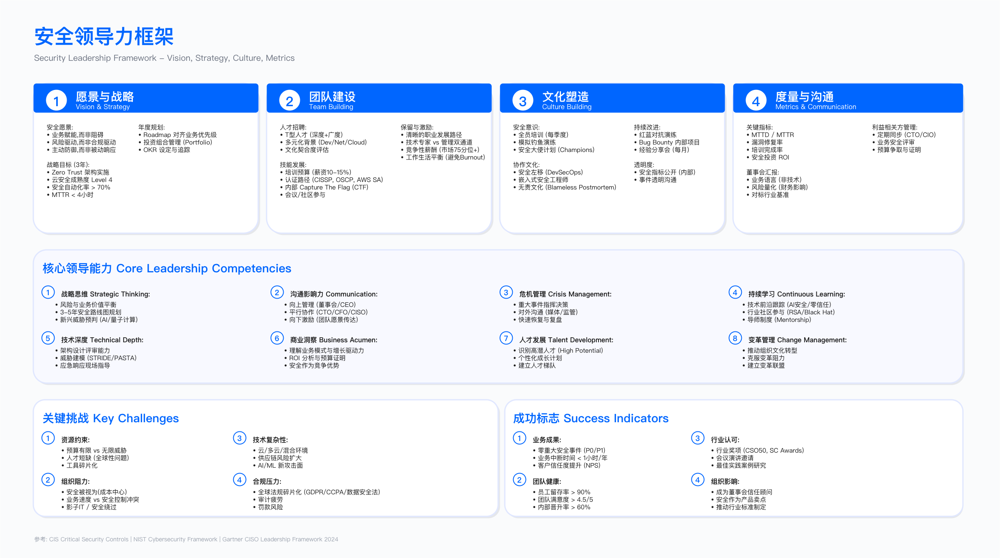
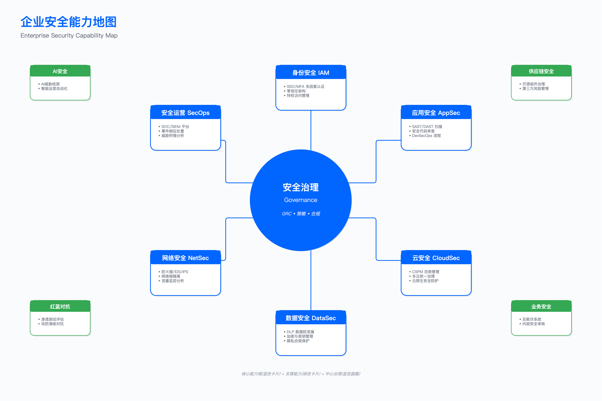

# 19.0　执行摘要

> 本节目标：梳理安全领导力与组织建设的核心问题域——结构性矛盾、成熟度差异、各节要点——为后续章节建立决策框架。

---

## 安全组织面临的结构性矛盾

企业安全组织建设的核心挑战不在技术层面，而在于组织、人才和文化三个维度的结构性矛盾。理解这些矛盾的本质，是设计有效组织架构的前提。

安全组织与业务组织有一个根本差异：业务组织的产出是可见的产品和服务，安全组织的产出是"未发生的事件"。这一特性导致安全团队在资源争夺中处于天然劣势——成功的安全工作是无形的，失败则被放大。CISO 需要认识到这一结构性困境，并在组织设计中预先考虑如何让安全价值可见化。

### 业务速度与安全质量的矛盾

敏捷开发和 DevOps 模式将产品发布周期从季度级压缩至周级甚至日级。但多数企业的安全审查流程仍采用串行模式：提交申请、排队等待、人工审查、反馈修改、再审查。这一流程通常需要一周或更长时间。

当产品发布窗口与安全审查周期产生冲突时，实际结果往往是安全审查被跳过或降级。这种"变通"操作并非产品团队有意绕过安全，而是组织机制未能适应业务节奏的必然结果。

一个典型场景：产品团队在周五下午提交发布申请，要求下周一上线。安全团队的审查排期已满，且周末无人值班。产品经理面临客户承诺的压力，向上级申请"特批"。最终要么安全审查被跳过，要么高级管理层被迫在没有充分信息的情况下做风险决策。这一模式反复出现，说明问题根源在机制而非个别人员的判断失误。

适用边界：该矛盾在多产品线并行发布、安全团队人员配置不足、缺乏自动化安全门禁的组织中尤为突出。

关键约束：

- 安全审查产能与发布需求的供需比通常低于 1:1
- 人工审查的边际成本不随规模下降
- 被绕过的安全流程会产生"合规假象"，实际风险敞口完全暴露

常见误区：

1. 试图通过增加人力解决产能不足——人工审查的线性扩展模式无法匹配指数级增长的发布需求
2. 将安全审查简化为检查清单——形式化的检查无法发现设计层面的安全缺陷

验证方法：

- 统计安全审查实际完成率与跳过率
- 对比审查覆盖版本与未覆盖版本的线上漏洞密度
- 回溯安全事件，分析其对应版本是否经过完整审查

运行指标：

- 安全审查完成率（低于组织设定阈值时预警）
- 审查等待时间中位数
- 跳过审查的版本占比

### 人才短缺与技能演进的矛盾

安全人才市场长期处于供不应求状态，高级安全岗位的招聘周期普遍较长。更深层的问题在于技能要求的快速演进：五年前属于"可选技能"的云安全、容器安全，已成为多数岗位的必备要求；供应链安全、AI 安全等新兴领域的人才储备几乎为零。

企业不仅需要在竞争激烈的市场中招聘，还必须接受一个现实：当前招聘到的人员，其技能在一定周期后可能无法满足新的威胁与技术要求。

这一矛盾的实际表现是：当企业启动云迁移项目时，发现现有安全团队缺乏云安全能力；当 AI 应用开始部署时，发现没有人了解 AI 安全的评估方法；当 Kubernetes 成为主流容器编排平台时，发现团队仍在使用传统虚拟机的思维模式进行安全管控。每一次技术转型都会暴露安全团队的能力缺口，而填补这些缺口的周期往往长于业务期望。

关键约束：

- 招聘周期与岗位空缺造成的产能损失
- 新员工培养周期内的效率折损
- 成熟工程师承担额外负荷导致的疲劳与流失

常见误区：

1. 过度依赖外部招聘而忽视内部培养——招聘成本高且周期长，内部培养是可持续的能力建设路径
2. 追求"全栈安全人才"——T 型人才模型比全栈模型更具可行性

验证方法：

- 定期进行技能差距评估（对照新兴威胁与技术要求）
- 追踪培训投入与能力提升的相关性
- 分析离职人员的技能分布与在岗时长

运行指标：

- 关键岗位填充周期
- 年度流失率（分职级统计）
- 人均培训时长与认证获取率

### 孤岛式运作与跨职能协作的矛盾

安全工作需要与开发、运维、产品、合规、法务等多个部门协作。但传统的组织结构和绩效考核机制往往制造协作壁垒。

典型场景是 DevSecOps 落地困难：开发团队考核功能交付速度，安全团队考核漏洞修复率和合规达成，运维团队考核系统稳定性。当新版本发布时，三方的目标冲突导致拉锯。缺乏协调机制时，结果要么是业务压力迫使安全妥协，要么是安全坚持导致业务延期。

一个具体例子：安全扫描发现某开源组件存在高危漏洞，需要升级到新版本。开发团队评估后发现升级需要修改大量代码并重新测试，影响发布计划。运维团队担心新版本带来兼容性问题，增加运维风险。三方在会议上各执己见，最终问题升级到 VP 层面——而 VP 缺乏技术背景，只能凭直觉决策。这一场景在缺乏跨职能治理机制的组织中反复上演。

关键约束：

- KPI 不一致导致的激励冲突
- 缺乏共同目标的跨部门协作难以持续
- 串行审批模式的时间成本随参与部门数量线性增长

常见误区：

1. 认为协作问题是"态度问题"——实际上多数是机制问题，KPI 不一致时团队再尽职也会陷入内耗
2. 试图通过增加沟通频次解决协作问题——机制不变，沟通越多内耗越大

验证方法：

- 对比串行与并行审批模式下的审批时效
- 追踪跨部门协作中的需求冲突频次与解决路径
- 评估跨职能治理机制（如安全委员会）的实际决策效力

运行指标：

- 跨部门审批时效
- 需求冲突上升到高层的频次
- 安全委员会决策的执行率

---

## 安全组织成熟度与业务影响

安全组织的成熟度直接影响业务敏捷性、风险水平、运营成本、人才吸引力和客户信任度。

### 业务敏捷性：从瓶颈到支撑

成熟安全组织将安全能力嵌入 CI/CD 流程，通过自动化扫描覆盖多数检查项，仅保留必要的人工审查。自动化门禁可以在构建阶段拦截高风险变更，同时放行符合安全基线的常规变更。人工专家仅介入复杂场景，如新架构引入、敏感数据处理逻辑变更、权限模型调整等。

传统安全组织采用人工串行审查，周期长、产能有限。当审查成为瓶颈时，产品团队倾向于绕过或降级安全要求。这一供需失衡在业务快速扩张期尤为突出。

验证方法：

- 对比安全审查时效与产品发布周期的匹配度
- 统计因安全审查导致的发布延期比例

### 风险降低：从被动修复到主动防御

成熟安全组织建立了漏洞管理流程、自动化跟踪、优先级排序、SLA 考核机制，高危漏洞修复周期可控。高危漏洞触发自动告警并进入加急处理通道，修复状态实时同步给相关干系人。

传统安全组织的漏洞管理依赖人工催促，缺乏强制 SLA。当漏洞积压到一定数量时，安全团队陷入"催促疲劳"，开发团队产生"狼来了"心理，双方信任逐渐消耗。

### 成本优化：从人海战术到效率提升

成熟安全组织通过自动化降低重复性人工工作——工单流转、报告生成、状态追踪、指标统计——同样的人员配置可支撑更大的业务规模。一名资深安全工程师的时间应该用于威胁建模、架构评审、复杂漏洞分析，而非手工整理扫描报告或催促开发团队。

### 人才吸引：技术栈与成长空间的影响

优秀的安全人才在面试时会评估团队的技术深度、工具链成熟度、职业发展空间。一个拥有完整 DevSecOps 工具链、清晰双轨职业路径、定期培训预算的团队，在人才市场上具有显著竞争优势。当候选人发现团队仍在使用过时的扫描工具、依赖人工报告、缺乏自动化流程时，即使薪资有吸引力，也会担忧技能退化风险。

### 客户信任：认证与评估通过率

对 ToB 业务，客户的安全尽职调查是销售流程的关键环节。成熟安全组织具备完整的认证体系和 GRC 能力，当客户发送安全问卷时，可以快速响应并提供标准化材料。缺乏体系化建设的组织，每次客户问卷都需要临时组织人员填写，信息不一致、响应慢，甚至因无法通过客户安全评估而丢单——而这一损失往往不会被归因到安全能力不足。

---

## 章节目标

本章提供构建高效安全组织的框架与方法，涵盖以下核心领域：

### 组织战略与架构

- 安全组织的使命定位与战略对齐（详见 19.1）
- 组织架构模式选型（集中式、分布式、混合式、Hub & Spoke）（详见 19.2）
- 组织成熟度评估与演进路径
- 10 大安全职能域与 RACI 矩阵（详见 19.3）

### 人才体系

- T 型人才能力模型与能力矩阵（详见 19.4）
- 招聘策略与评估框架（详见 19.5）
- 职业发展路径（IC Track 与 Management Track）
- 绩效评估与激励机制

### 文化建设

- Security Champions 计划设计与运营（详见 19.6）
- 安全培训体系（分层、分角色）
- 安全文化成熟度评估

### 预算与协作

- 预算编制方法与行业基准（详见 19.7）
- ROI 量化与向上沟通
- DevSecOps 协作机制（详见 19.8）
- BISO 协作模式与安全委员会

---

## 核心概念速览

### 安全组织战略（19.1）

安全组织战略的核心问题是：安全团队在企业中扮演什么角色？这一定位决定了组织架构设计、人员招聘标准、绩效考核方式以及与其他部门的协作模式。

传统安全使命聚焦于系统与数据保护，定位为风险控制者，使用技术术语沟通，以合规达成和无事故作为衡量标准。守门人天然与业务发展存在张力，当安全成为速度的阻碍时，业务会寻找绕过守门人的方法。

现代安全使命聚焦于业务支持与创新，定位为赋能者，使用业务语言沟通，以业务韧性、创新速度和客户信任作为衡量标准。安全团队不仅要说"这样不行"，更要说"换成这样做可以"。

安全组织成熟度五级：

成熟度模型的价值在于提供自我诊断和目标设定的框架。多数企业处于级别 2 到级别 3 之间，能够达到级别 4 的企业已属少数，级别 5 更是行业标杆水平。

- 级别 1（被动响应）：事后修复，缺乏规划，依赖外部，安全被视为成本中心。组织特征：没有专职安全人员，安全由 IT 运维兼任，出事后临时找外部服务商处理。
- 级别 2（合规驱动）：满足合规要求，建立基础流程，部署基本工具，安全被视为合规职能。组织特征：有专职安全人员但规模小，工作重心是应对审计和合规检查，缺乏主动发现问题的能力。
- 级别 3（主动防御）：引入威胁情报、SDL、SOC，实现部分自动化，安全被视为风险管理职能。组织特征：建立完整安全团队，具备主动发现和处置威胁的能力，但安全与业务的协同仍有改进空间。
- 级别 4（业务支持）：DevSecOps、BISO 模式运作，安全能力产品化，安全被视为业务加速器。组织特征：安全深度嵌入业务流程，不再是发布瓶颈；安全能力以服务形式提供给内部客户。
- 级别 5（战略领先）：行业引领，持续创新，安全文化深入组织，安全被视为竞争优势。组织特征：安全成为企业对外品牌的一部分，在行业会议上分享实践，吸引顶尖人才加入。

常见误区：试图跳级演进——每一级别的能力是上一级别的基础，跳级会导致能力空心化；将成熟度等同于人员规模——成熟度的核心是能力质量而非数量。

### 安全组织架构模式（19.2）

没有一种架构模式是普遍适用的，选择取决于企业规模、业务特点、组织文化和现有人员能力。错误的架构选择会导致协作低效、责任不清、资源浪费。架构选型是 CISO 上任后需要回答的关键问题之一，也是后续人员招募和职能建设的前提。

- 集中式：所有安全职能集中于 CISO 下属团队。标准统一、资源集中、技术深度强，但响应慢、业务理解不足、容易成为瓶颈。适用于中小规模企业、强监管行业、技术债务高的组织。业务线需安全服务时向中央团队提交请求，排队等待处理。
- 分布式（BISO 模式）：安全人员嵌入各业务线，中央团队仅保留策略制定职能。业务理解深、响应快、可定制化，但标准分散、资源重复、技术深度不足。适用于大型多业务线企业、快速创新型组织。BISO 与业务线 GM 一起工作，安全需求被"内化"而非"外加"。
- 混合式：中央团队负责策略、架构和专家支持，业务线配置 BISO，开发团队配置 Security Champions。兼顾控制与敏捷，但复杂度高、协调成本高。需要清晰的职责边界定义和高效的协调机制，否则容易出现责任推诿或重复工作。
- Hub & Spoke（中心辐射式）：中央设置专家团队（Hub），各业务线配置 BISO（Spoke），开发团队配置 Champions。在规模化与可持续性方面达到较好平衡，适用于大型企业、多业务线、DevSecOps 成熟的组织。Hub 提供专业深度，Spoke 提供业务理解，Champions 提供一线触点。

架构选型还需考虑：BISO 模式要求具备复合能力（技术+业务）的人才，市场供给有限；架构过渡需设计迁移路径，避免组织动荡。

### 安全团队职能划分（19.3）

职能划分的目的是明确"谁负责什么"，避免责任真空或重叠。无论规模如何，职能域的完整覆盖是安全能力建设的基础。缺少清晰划分时，安全场景往往变成"三不管"地带——多个团队各自"尽职"，但关键场景无人负总责。

10 大核心职能域：战略与治理、GRC 与合规、安全架构与工程、产品安全、应用安全、基础设施安全、云安全、数据安全与隐私、安全运营（SOC）、红队与攻防。此外，安全工程与自动化作为横向支撑职能，为各层提供工具开发和流程自动化能力。职能配置随组织规模演进：初创期聚焦 4-5 个核心职能，成长期扩展，成熟期完善 Hub & Spoke 模式。

### 安全能力模型（19.4）

安全能力模型解决的问题是：如何定义和评估安全人员的能力？如何设计职业发展路径？如何平衡专业深度与知识广度？

T 型人才模型承认一个现实：安全领域过于庞大，没有人能在所有方向都达到专家水平。合理的策略是在多个领域具备基础理解（横向），同时在一两个领域达到专家水平（纵向）。横向技能使安全人员能够跨领域协作，识别问题何时需要升级给其他专家；纵向技能是个人核心竞争力，是解决复杂问题和提供专业判断的基础。

双轨制职业路径解决的是：优秀的技术专家不一定适合做管理，但如果只有管理路径才能晋升和加薪，技术专家要么被迫转管理（可能导致管理岗不匹配和技术能力流失），要么离开寻找更好的发展空间。IC Track（个人贡献者路径）从初级工程师逐步发展为 Staff、Principal、Distinguished 等高级技术角色，是技术决策者；Management Track 从 Team Lead 发展为 Manager、Director、VP、CISO，职责重心是人员管理与战略规划。中层级可在两条路径间转换，高层级转换难度较大。

常见误区：只有管理路径导致技术人才流失；双轨制形同虚设——IC Track 薪酬和晋升空间实际上不如 Management Track，名义双轨实为单轨。

### 安全人才招聘与发展（19.5）

安全人才招聘的挑战在于：市场供给不足、评估难度大、文化匹配难以判断。一个通过技术面试的候选人，入职后可能因为无法与开发团队有效协作而产出不佳。招聘评估需要覆盖四个维度：

- 技术基础：OWASP Top 10 深度理解、SAST/DAST 工具使用、编程能力、SDL 流程经验
- 实战能力：威胁建模演练、渗透测试场景、事件响应设计——评估候选人能否将知识应用于实际问题
- 业务理解与协作：场景题（如何处理开发团队对安全审查效率的质疑）、向非技术人员解释技术风险的能力——技术能力强但协作能力弱的候选人往往无法发挥技术价值
- 文化匹配：价值观、职业规划、学习动力

Onboarding 的质量直接影响后续产出效率和留存率。设计良好的 Onboarding 分三个阶段：第一阶段（适应期）熟悉环境，了解"这里怎么做事"；第二阶段（成长期）在 Mentor 指导下独立完成任务，任务难度逐步递增；第三阶段（融入期）能独立处理日常工作，并开始为团队贡献新视角。常见问题是文档缺失或过时、Mentor 因工作繁忙无暇指导。

### 安全文化建设（19.6）

安全文化建设解决的问题是：如何让安全不仅仅是安全团队的事，而成为全员的共同责任？技术手段和流程制度解决"能不能"的问题，文化建设解决"想不想"的问题。当员工主动思考安全、主动上报问题、主动寻求安全团队帮助时，整个组织的安全态势会有质的提升。

Security Champions 计划是规模化推动安全文化的有效机制。安全团队的人数有限，无法深入每一个开发团队。Champions 作为安全团队在一线的"代言人"，弥补了这一覆盖缺口。Champions 是对安全有兴趣、愿意投入额外时间学习和推广安全实践的开发者，并非专职安全人员。选拔标准：自愿参与、具备技术能力、在团队内有影响力。

安全文化成熟度五级：从级别 1（被动抵抗，安全被视为阻碍）、级别 2（被动接受，有要求就做）、级别 3（主动参与，开发人员在设计时主动考虑安全）、级别 4（安全优先，未通过安全检查的代码无法合并），到级别 5（安全文化，员工自发识别和上报安全风险）。从级别 1 提升到级别 3 可能需要数年时间，从级别 3 到级别 5 则需要持续投入和高层坚定支持。

### 安全预算与投资（19.7）

安全预算编制的挑战在于：如何量化安全投资的回报？安全投资的"回报"往往是"未发生的损失"，这种"未发生"的事件难以用传统的 ROI 计算方法衡量，也难以向非安全背景的管理层解释。

ROI 论证需要选择财务部门能够认可的计算方法：效率提升类（自动化节省的人力成本、审查时间缩短带来的业务价值）可量化、可验证，最容易获得财务认可；风险降低类（漏洞密度降低减少的修复成本）部分可量化；避免损失类（数据泄露避免、合规罚款避免）难以直接证明，需借助行业基准和对标数据，但使用时需谨慎，避免被视为"恐吓营销"。

预算编制可采用混合方法：基于行业基准确定总预算框架，自下而上细化分配，按优先级排序。分阶段申请、每阶段展示 ROI，比一次性申请大额预算更容易获得持续支持。

### 安全协作与沟通（19.8）

安全工作的跨职能特性决定了协作能力是安全团队成功的关键因素。一个技术能力强但协作能力弱的安全团队，其实际价值会大打折扣。CISO 需要认识到：协作不是"软技能"，而是"硬能力"。

与高管沟通的核心原则是使用对方能够理解的语言——不同角色关注的问题不同，评估价值的维度也不同：与 CEO 用业务风险和竞争优势语言，与 CFO 用 ROI 和成本控制语言，与 CTO 用技术债务和架构风险语言，与业务负责人用上市时间和客户信任语言。CISO 需要具备"语言切换"能力，根据沟通对象调整表达方式。

BISO（Business Information Security Officer）是连接安全团队与业务团队的桥梁，成功的 BISO 需要同时具备安全专业能力和业务理解能力。双汇报关系的设计——虚线向业务线负责人汇报日常工作，实线向 CISO 汇报绩效与专业发展——确保 BISO 既能深度融入业务，又能保持安全专业性和独立性。

---

## 关键成功要素

### 高管赞助与战略对齐

- CISO 向 CEO 汇报有助于提升安全战略地位
- 高风险企业需建立董事会级安全汇报机制
- 安全 OKR 与业务 OKR 深度绑定

### 组织设计与职责清晰

- 根据企业规模和业务复杂度选择适合的架构模式
- 使用 RACI 矩阵明确职责边界，避免责任真空或重叠
- 大型企业推行 BISO 模式，深度嵌入业务

### 人才战略与文化建设

- 培养 T 型人才（一专多能）而非追求全栈
- 提供 IC 与 Management 双轨职业路径
- 规模化部署 Security Champions
- 文化建设需要持续投入，从被动接受提升至安全优先需要多年时间

---

## 常见陷阱

| 陷阱         | 描述                             | 规避方法                                   |
| ------------ | -------------------------------- | ------------------------------------------ |
| 安全 = 说不  | 安全团队只会拒绝，不提供替代方案 | 转变为"支持者"，提供安全方案而非单纯否决   |
| 孤岛运作     | 安全团队与业务、开发隔离         | BISO 嵌入、Champions 计划、DevSecOps 机制  |
| 工具堆砌     | 采购多个工具但不集成             | 工具平台化、集成优先、控制工具数量         |
| 忽视软技能   | 只关注技术能力，忽视沟通与协作   | 招聘和晋升时评估软技能，提供沟通培训       |
| 单轨职业路径 | 只有管理路径，技术专家被迫转管理 | 建立 IC 与 Management 双轨制并确保实质等价 |
| 缺乏度量     | 无法量化安全价值                 | 建立 KPI 体系，追踪可量化指标              |
| 文化忽视     | 只关注技术和流程，忽视文化建设   | Champions 计划、培训体系、文化成熟度度量   |
| 架构错配     | 架构选择不匹配企业阶段           | 根据企业规模、成熟度选择架构，设计过渡路径 |

---

## 衡量成功

### 领先指标（预防性）

- 组织成熟度评估分数
- 安全人员配置比例
- Champions 覆盖率
- 全员安全培训覆盖率
- 安全流程自动化率

### 滞后指标（检测性）

- 安全岗位招聘周期
- 安全团队年流失率
- 平均安全审查时间
- 生产环境漏洞密度
- 年度安全事件数

### 业务成果

- 业务敏捷性：安全审查不再是发布瓶颈
- 风险降低：高危漏洞修复周期可控，安全事件数量呈下降趋势
- 成本优化：自动化提升人均产出
- 客户信任：客户安全评估通过率高，ToB 销售周期缩短
- 认证与合规：通过所需认证，合规审计无重大发现

---

## 本节小结

### 核心要点

1. 安全组织建设的核心挑战是业务速度与安全质量、人才短缺与技能演进、孤岛运作与跨职能协作三个结构性矛盾
2. 组织架构模式选型需综合考虑企业规模、业务复杂度和组织文化，没有普适的最优解
3. T 型人才模型与双轨职业路径是人才战略的基础
4. Security Champions 是规模化推动安全文化的有效机制
5. 与财务沟通 ROI 时，效率提升类指标比"避免损失"更易获得认可
6. 跨职能协作的障碍多数是机制问题而非态度问题

### 验收要点

- 能够使用成熟度模型评估当前组织状态
- 能够根据企业特点选择适合的架构模式
- 能够设计职能划分与 RACI 矩阵
- 能够制定人才培养与 Champions 计划
- 能够编制预算并进行 ROI 论证
- 能够设计跨职能协作机制

---

## 导航

[返回章节目录](./README.md) | [下一节：19.1 安全组织战略 →](./19.1_安全组织战略.md)

---

© 2025-2026 AISecOps Project. Licensed under CC BY-NC-SA 4.0
